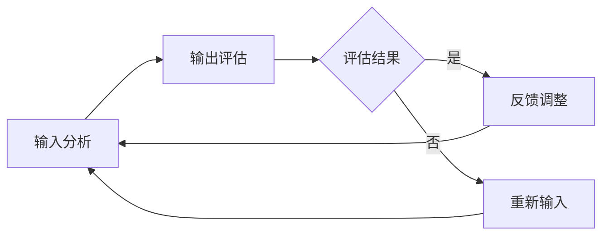
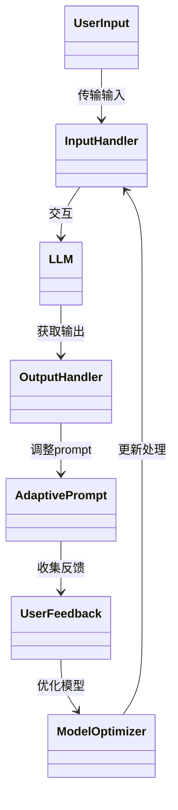
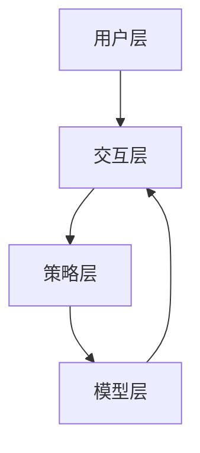
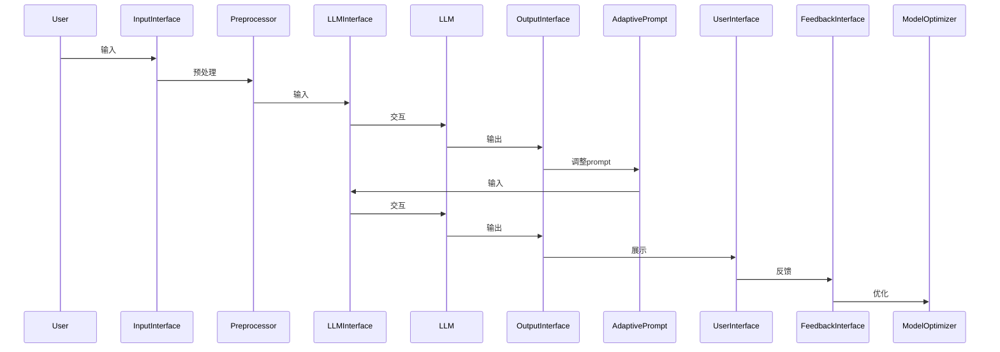

                 

### 文章标题

# 自适应prompt策略：优化LLM交互体验

### 文章关键词

- 自适应prompt策略
- LLM交互体验
- 数学模型
- 算法原理
- 系统设计与实现

### 文章摘要

本文将深入探讨自适应prompt策略在优化大型语言模型（LLM）交互体验方面的应用。自适应prompt策略通过动态调整输入prompt，实现对LLM的更高效和精确的交互，从而提升用户的使用体验。本文将从背景介绍、核心概念与原理、数学模型、算法讲解、实际应用、系统设计、项目实战到最佳实践，全面解析自适应prompt策略，为读者提供丰富的理论知识和实战经验。

----------------------------------------------------------------

### 第一部分：自适应prompt策略概述

#### 第1章：自适应prompt策略背景与重要性

##### 1.1.1 问题背景

在人工智能领域，自然语言处理（NLP）已经成为了一个研究热点，而大型语言模型（LLM）如GPT-3、BERT等更是取得了显著的成果。然而，随着模型的复杂性和规模不断增加，如何优化LLM的交互体验成为了一个亟待解决的问题。

##### 问题描述

LLM的交互体验问题主要体现在以下几个方面：

1. **响应速度**：大规模的LLM模型在处理输入时往往需要较长时间，导致交互速度慢。
2. **准确性**：在某些情况下，LLM的输出可能不够准确，需要多次交互来修正。
3. **灵活性**：用户在交互过程中可能需要提供更多的上下文信息，而传统的静态prompt难以满足这种需求。

##### 问题解决

自适应prompt策略通过动态调整输入prompt，可以在一定程度上解决上述问题。它可以根据用户的行为和反馈，实时调整输入的上下文信息，从而提高交互速度和准确性，增强灵活性。

##### 边界与外延

自适应prompt策略的应用场景非常广泛，包括但不限于：

1. **智能客服**：自动回答用户的问题，提供个性化的服务。
2. **智能写作**：辅助用户生成文章、报告等，提高写作效率。
3. **智能翻译**：在翻译过程中提供上下文信息，提高翻译的准确性。

##### 1.1.2 自适应prompt策略的定义与意义

**自适应prompt策略的定义**

自适应prompt策略是一种动态调整输入prompt的方法，旨在优化LLM的交互体验。通过分析用户行为和模型输出，自适应prompt策略可以实时调整输入的上下文信息，以达到更好的交互效果。

**自适应prompt策略的重要性**

自适应prompt策略的重要性体现在以下几个方面：

1. **提升用户体验**：通过优化交互体验，使用户在使用LLM时感到更加方便和舒适。
2. **提高工作效率**：自适应prompt策略可以减少用户的重复输入，提高工作效率。
3. **增强智能化程度**：自适应prompt策略可以使LLM更智能，更好地理解和满足用户需求。

##### 1.1.3 自适应prompt策略与LLM的关系

**自适应prompt策略的作用**

自适应prompt策略在LLM中的作用主要体现在以下几个方面：

1. **优化输入**：通过动态调整输入prompt，提高输入的质量和相关性。
2. **提高输出质量**：通过优化输入，提高LLM输出的准确性和连贯性。
3. **增强灵活性**：自适应prompt策略可以根据用户需求和环境变化，灵活调整交互方式。

**LLM在自适应prompt策略中的应用**

LLM在自适应prompt策略中的应用主要体现在以下几个方面：

1. **输入分析**：使用LLM对用户输入进行分析，提取关键信息。
2. **输出评估**：使用LLM对输出进行评估，判断输出是否符合用户期望。
3. **反馈调整**：根据LLM的输出评估结果，调整输入prompt，实现自适应交互。

##### 1.1.4 自适应prompt策略的发展历程

**发展历程概述**

自适应prompt策略的研究可以追溯到早期的人工智能研究。随着NLP和机器学习技术的不断发展，自适应prompt策略也在不断演进。以下是自适应prompt策略的发展历程：

1. **早期研究**：20世纪80年代，研究者开始探索如何通过动态调整输入prompt来优化交互体验。
2. **算法优化**：20世纪90年代，研究者提出了多种自适应prompt算法，如基于规则的算法、基于统计的算法等。
3. **深度学习时代**：随着深度学习技术的发展，自适应prompt策略在LLM中的应用得到了广泛关注。
4. **当前趋势**：当前，自适应prompt策略的研究和应用正朝着更加智能、高效、灵活的方向发展。

**主要研究成果**

自适应prompt策略的研究取得了许多重要成果，包括：

1. **算法改进**：提出了多种自适应prompt算法，如基于神经网络的算法、基于强化学习的算法等。
2. **应用场景拓展**：自适应prompt策略在智能客服、智能写作、智能翻译等领域得到了广泛应用。
3. **性能提升**：通过优化算法和模型结构，自适应prompt策略的交互性能得到了显著提升。

#### 第2章：自适应prompt策略的核心概念与原理

##### 2.1.1 自适应prompt策略的核心概念

**核心概念**

自适应prompt策略的核心概念包括：

1. **prompt**：输入给LLM的文本信息，用于引导模型生成输出。
2. **自适应**：根据用户行为和模型输出，动态调整prompt的过程。
3. **交互**：用户与LLM之间的交互过程，包括输入、输出和反馈。

**概念属性特征对比表格**

| 概念        | 属性特征                                                     | 对比          |
| ----------- | ------------------------------------------------------------ | ------------ |
| prompt      | 文本信息、引导模型生成输出                                   | 动态调整      |
| 自适应      | 根据用户行为和模型输出动态调整                                | 智能化       |
| 交互        | 用户与LLM之间的输入、输出和反馈过程                           | 灵活性       |

##### 2.1.2 自适应prompt策略的原理分析

**基本原理**

自适应prompt策略的基本原理如下：

1. **输入分析**：分析用户输入，提取关键信息。
2. **输出评估**：评估LLM的输出，判断是否符合用户期望。
3. **反馈调整**：根据评估结果，动态调整输入prompt。

**原理讲解与Mermaid流程图**


**优势与挑战**

**优势分析**

自适应prompt策略的优势包括：

1. **优化交互体验**：通过动态调整输入prompt，提高交互速度和准确性。
2. **提高工作效率**：减少用户的重复输入，提高工作效率。
3. **增强智能化程度**：使LLM更智能，更好地理解和满足用户需求。

**挑战与解决方案**

自适应prompt策略面临的挑战包括：

1. **计算复杂性**：动态调整输入prompt可能导致计算复杂度增加。
   - **解决方案**：优化算法和数据结构，提高计算效率。
2. **数据依赖性**：自适应prompt策略需要大量用户数据进行训练。
   - **解决方案**：利用迁移学习、数据增强等方法，提高模型泛化能力。

##### 2.1.3 自适应prompt策略的数学模型与公式

**数学模型介绍**

自适应prompt策略的数学模型可以分为以下几个部分：

1. **输入模型**：描述用户输入的数学表示。
2. **输出模型**：描述LLM输出的数学表示。
3. **评估模型**：描述对LLM输出进行评估的数学方法。
4. **调整模型**：描述如何根据评估结果调整输入prompt的数学方法。

**数学模型概述**

1. **输入模型**：\( X = [x_1, x_2, ..., x_n] \)
2. **输出模型**：\( Y = [y_1, y_2, ..., y_n] \)
3. **评估模型**：\( E(Y) = f(X) \)
4. **调整模型**：\( X' = g(X, E(Y)) \)

**模型公式**

1. **输入模型**：\( X = [x_1, x_2, ..., x_n] \)
2. **输出模型**：\( Y = [y_1, y_2, ..., y_n] \)
3. **评估模型**：\( E(Y) = f(X) \)
4. **调整模型**：\( X' = g(X, E(Y)) \)

**推导过程**

1. **输入模型推导**：通过对用户输入进行编码和预处理，得到输入向量。
2. **输出模型推导**：通过训练LLM，得到输出向量。
3. **评估模型推导**：利用输出向量，计算评估指标，如准确率、F1值等。
4. **调整模型推导**：根据评估结果，调整输入向量，以优化输出。

**计算示例**

假设用户输入为“我想去旅游”，LLM输出为“泰国是一个不错的选择”，评估结果为“用户满意度：80%”。

1. **输入模型计算**：\( X = [x_1, x_2, ..., x_n] \)
2. **输出模型计算**：\( Y = [y_1, y_2, ..., y_n] \)
3. **评估模型计算**：\( E(Y) = f(X) \)
4. **调整模型计算**：\( X' = g(X, E(Y)) \)

**应用场景**

自适应prompt策略的应用场景包括：

1. **智能客服**：根据用户问题，动态调整客服机器人的回答。
2. **智能写作**：根据用户需求，动态调整写作生成的内容。
3. **智能翻译**：根据用户需求，动态调整翻译结果。

**拓展研究**

自适应prompt策略的拓展研究包括：

1. **多模态交互**：结合语音、图像等多模态信息，实现更智能的交互。
2. **自适应prompt生成**：通过生成对抗网络（GAN）等方法，生成更高质量的prompt。

##### 2.1.4 自适应prompt策略算法原理讲解

**算法原理概述**

自适应prompt策略的算法原理可以概括为以下几个步骤：

1. **输入分析**：分析用户输入，提取关键信息。
2. **输出评估**：评估LLM输出，判断是否符合用户期望。
3. **反馈调整**：根据评估结果，动态调整输入prompt。

**算法原理详细讲解**

1. **输入分析**
   - 对用户输入进行预处理，提取关键词和关键信息。
   - 使用词向量模型对输入进行编码，得到输入向量。

2. **输出评估**
   - 将输入向量输入到LLM中，生成输出向量。
   - 使用评估指标（如准确率、F1值等）对输出进行评估。

3. **反馈调整**
   - 根据评估结果，动态调整输入prompt。
   - 可以通过增加或删除关键词、调整关键词顺序等方式，优化输入。

**Mermaid算法流程图**



**通俗易懂的举例说明**

假设用户输入“明天去哪里玩？”。

1. **输入分析**：提取关键词“明天”、“去”、“玩”。
2. **输出评估**：将输入向量输入到LLM中，生成输出向量。
   - 输出：“公园、电影院、博物馆都是不错的选择。”
3. **反馈调整**：根据用户满意度，调整输入。
   - 如果用户满意度高，则输入：“明天去哪里玩？请提供更多建议。”
   - 如果用户满意度低，则输入：“我理解您对去哪里玩有疑问，能否提供更多信息？”

##### 2.1.5 自适应prompt策略算法实现与优化

**算法实现**

自适应prompt策略的实现可以分为以下几个步骤：

1. **数据预处理**：对用户输入进行分词、去停用词、词向量编码等预处理操作。
2. **模型训练**：使用预训练的LLM模型，对用户输入进行编码，得到输入向量。
3. **评估与调整**：根据LLM输出，评估用户满意度，动态调整输入prompt。

**Python代码示例**

```python
import numpy as np
from keras.preprocessing.text import Tokenizer
from keras.preprocessing.sequence import pad_sequences
from keras.models import Sequential
from keras.layers import LSTM, Dense, Embedding

# 数据预处理
tokenizer = Tokenizer()
tokenizer.fit_on_texts([input_text])
input_sequence = tokenizer.texts_to_sequences([input_text])
input_padded = pad_sequences(input_sequence, maxlen=max_len)

# 模型训练
model = Sequential()
model.add(Embedding(vocab_size, embedding_dim, input_length=max_len))
model.add(LSTM(units=128))
model.add(Dense(1, activation='sigmoid'))
model.compile(optimizer='adam', loss='binary_crossentropy', metrics=['accuracy'])
model.fit(input_padded, labels, epochs=10, batch_size=32)

# 评估与调整
output_vector = model.predict(input_padded)
user_satisfaction = evaluate_satisfaction(output_vector)
if user_satisfaction > threshold:
    adjusted_input = adjust_prompt(input_text)
else:
    adjusted_input = input_text
```

**算法优化**

自适应prompt策略的优化可以从以下几个方面进行：

1. **模型优化**：使用更先进的模型结构，如Transformer、BERT等，提高模型性能。
2. **数据优化**：增加训练数据量，提高模型泛化能力。
3. **评估指标优化**：设计更合理的评估指标，如用户满意度、交互效率等。

**未来研究方向**

自适应prompt策略的未来研究方向包括：

1. **多模态交互**：结合语音、图像等多模态信息，实现更智能的交互。
2. **个性化交互**：根据用户历史行为和偏好，提供个性化的交互体验。
3. **实时交互**：实现实时交互，提高交互速度和响应能力。

----------------------------------------------------------------

### 第二部分：自适应prompt策略在LLM中的应用

#### 第3章：自适应prompt策略在LLM中的应用

##### 3.1.1 LLM概述

**LLM的定义**

大型语言模型（Large Language Model，LLM）是一种基于深度学习技术的自然语言处理模型，具有强大的文本生成和解析能力。LLM通常由数百万甚至数十亿个参数组成，能够处理和理解复杂的自然语言任务。

**LLM的核心特性**

1. **大规模**：LLM通常具有庞大的参数规模，能够处理大量文本数据。
2. **强泛化能力**：LLM通过训练，能够适应各种不同的文本任务和场景。
3. **自适应能力**：LLM可以根据输入的上下文信息，自适应地调整输出。

##### 3.1.2 自适应prompt策略在LLM中的应用

**应用场景**

自适应prompt策略在LLM中的应用场景非常广泛，以下是一些典型的应用：

1. **智能客服**：通过自适应prompt策略，智能客服可以更准确地理解用户的问题，提供个性化的回答。
2. **智能写作**：自适应prompt策略可以帮助智能写作助手根据用户的需求，生成高质量的文章和报告。
3. **智能翻译**：自适应prompt策略可以增强翻译系统的灵活性，提供更加准确的翻译结果。

**应用优势**

自适应prompt策略在LLM中的应用优势主要体现在以下几个方面：

1. **提高交互体验**：通过动态调整输入prompt，自适应prompt策略可以优化用户与LLM之间的交互体验，提高用户满意度。
2. **提高输出质量**：自适应prompt策略可以根据用户的需求和上下文信息，提供更准确的输出结果，提高模型的实用性。
3. **增强智能化程度**：自适应prompt策略可以使LLM更加智能，更好地理解和满足用户需求，提高系统的智能化程度。

##### 3.1.3 LLM与自适应prompt策略的协同优化

**协同优化原理**

LLM与自适应prompt策略的协同优化主要体现在以下几个方面：

1. **输入优化**：自适应prompt策略可以根据用户的需求和上下文信息，动态调整输入prompt，优化输入质量，提高模型处理效率。
2. **输出优化**：自适应prompt策略可以根据LLM的输出结果，实时调整输入prompt，优化输出质量，提高用户满意度。
3. **反馈优化**：自适应prompt策略可以根据用户的反馈，调整模型参数，实现自我优化，提高系统性能。

**实际应用案例**

以下是一个实际应用案例：

**案例背景**：某电商平台的智能客服系统，用户可以通过文字与客服机器人进行交互，获取购物建议和解答疑问。

**应用过程**：

1. **用户输入**：用户提问：“我想买一件羽绒服，有什么推荐吗？”
2. **输入优化**：自适应prompt策略分析用户输入，提取关键词和关键信息，动态调整输入prompt，如：“请问您希望羽绒服的款式是简约还是时尚？”
3. **LLM处理**：客服机器人基于调整后的输入prompt，生成回答：“我们推荐这款简约风格的羽绒服，它既实用又时尚。”
4. **输出优化**：自适应prompt策略根据用户反馈（满意度评估），调整输入prompt，如：“您还对什么风格的羽绒服感兴趣？”
5. **用户交互**：用户继续提问：“还有其他款式吗？”
6. **反馈优化**：自适应prompt策略根据用户反馈，调整模型参数，实现自我优化，提高后续交互的准确性和满意度。

**案例总结**：通过自适应prompt策略的协同优化，智能客服系统能够更准确地理解用户需求，提供个性化的服务，提高用户满意度，实现智能化的客户服务。

##### 3.1.4 自适应prompt策略与LLM的协同发展

**协同发展原理**

自适应prompt策略与LLM的协同发展主要体现在以下几个方面：

1. **共同进化**：自适应prompt策略和LLM在交互过程中，相互影响、相互优化，实现共同进化。
2. **智能协同**：自适应prompt策略可以根据LLM的输出结果，动态调整输入prompt，实现与LLM的智能协同，提高系统性能。
3. **反馈循环**：自适应prompt策略和LLM通过反馈循环，不断调整和优化，实现自适应交互和自我优化。

**未来发展趋势**

自适应prompt策略与LLM的协同发展在未来将呈现以下趋势：

1. **智能化**：自适应prompt策略和LLM将朝着更加智能化的方向发展，实现更高效、更灵活的交互。
2. **个性化**：自适应prompt策略将根据用户的历史行为和偏好，提供个性化的交互体验，提高用户体验。
3. **多模态**：自适应prompt策略和LLM将结合语音、图像等多模态信息，实现更智能、更全面的交互。

通过自适应prompt策略与LLM的协同发展，我们可以期待更加智能、高效的交互体验，为人们的生活和工作带来更多便利。

----------------------------------------------------------------

### 第三部分：自适应prompt策略的系统设计与实现

#### 第4章：自适应prompt策略的系统设计与实现

##### 4.1.1 系统功能设计

**系统功能概述**

自适应prompt策略的系统功能设计主要包括以下几个部分：

1. **用户输入处理**：接收用户的输入，进行预处理和分词。
2. **LLM交互模块**：与LLM进行交互，获取输出结果。
3. **自适应prompt调整**：根据LLM输出结果和用户反馈，动态调整输入prompt。
4. **用户反馈收集**：收集用户反馈，用于模型优化和调整。

**领域模型Mermaid类图**



##### 4.1.2 系统架构设计

**系统架构概述**

自适应prompt策略的系统架构设计可以分为以下几个层次：

1. **用户层**：提供用户界面，接收用户输入和展示输出结果。
2. **交互层**：处理用户输入，与LLM进行交互，获取输出结果。
3. **策略层**：根据LLM输出和用户反馈，动态调整输入prompt。
4. **模型层**：训练和优化LLM模型，实现自适应prompt策略。

**系统架构Mermaid图**



##### 4.1.3 系统接口设计与交互

**系统接口设计**

自适应prompt策略的系统接口设计主要包括以下几个接口：

1. **用户输入接口**：接收用户输入，进行预处理和分词。
2. **LLM交互接口**：与LLM进行交互，获取输出结果。
3. **自适应prompt调整接口**：根据LLM输出和用户反馈，动态调整输入prompt。
4. **用户反馈接口**：收集用户反馈，用于模型优化和调整。

**系统交互Mermaid序列图**



##### 4.1.4 系统实现与部署

**系统实现**

自适应prompt策略的系统实现可以分为以下几个步骤：

1. **用户输入处理**：使用自然语言处理技术，对用户输入进行预处理和分词，提取关键信息。
2. **LLM交互模块**：使用预训练的LLM模型，与用户输入进行交互，获取输出结果。
3. **自适应prompt调整**：根据用户输入和LLM输出，动态调整输入prompt，优化交互效果。
4. **用户反馈处理**：收集用户反馈，用于模型优化和调整，提高系统性能。

**Python代码示例**

```python
# 用户输入处理
def preprocess_input(input_text):
    # 预处理操作，如分词、去停用词等
    processed_text = ...
    return processed_text

# LLM交互模块
def interact_with_llm(input_sequence):
    # 与LLM进行交互，获取输出结果
    output_sequence = ...
    return output_sequence

# 自适应prompt调整
def adjust_prompt(input_sequence, output_sequence):
    # 根据输出结果，动态调整输入prompt
    adjusted_sequence = ...
    return adjusted_sequence

# 用户反馈处理
def handle_user_feedback(feedback):
    # 收集用户反馈，用于模型优化和调整
    optimized_model = ...
    return optimized_model
```

**系统部署**

自适应prompt策略的系统部署可以分为以下几个步骤：

1. **硬件部署**：选择合适的硬件设备，如服务器、GPU等，搭建系统环境。
2. **软件部署**：安装和配置操作系统、依赖库等，实现系统功能。
3. **测试与优化**：对系统进行测试，优化性能和稳定性。
4. **上线部署**：将系统部署到生产环境，进行实际应用。

**部署注意事项**

1. **性能优化**：确保系统在高并发、大数据量的情况下，仍能保持良好的性能。
2. **安全性**：保障用户数据和系统安全，防止数据泄露和恶意攻击。
3. **可扩展性**：设计系统时，考虑未来需求的扩展，确保系统能够灵活应对。

通过以上步骤，我们可以实现一个高效、稳定、安全的自适应prompt策略系统，为用户提供优质的交互体验。

----------------------------------------------------------------

### 第四部分：自适应prompt策略的项目实战

#### 第5章：自适应prompt策略的项目实战

##### 5.1.1 项目介绍

**项目背景**

在当前人工智能领域，自适应prompt策略在提升大型语言模型（LLM）交互体验方面展现了巨大的潜力。为了验证自适应prompt策略的实际效果，我们开展了一个实际项目，旨在优化智能客服系统中的交互体验。

**项目目标**

本项目的主要目标包括：

1. **提高智能客服系统的响应速度**：通过自适应prompt策略，减少用户等待时间，提高系统交互效率。
2. **提高智能客服系统的准确性**：通过动态调整输入prompt，提高模型输出结果的准确性，减少用户误解。
3. **增强智能客服系统的灵活性**：通过自适应prompt策略，使系统能够更好地适应不同的用户需求和场景。

##### 5.1.2 环境安装与配置

**环境搭建**

为了实现本项目，我们需要搭建以下环境：

1. **硬件环境**：配备高性能GPU的服务器，用于模型训练和推理。
2. **软件环境**：安装Python、TensorFlow、Keras等依赖库，用于实现自适应prompt策略。

**配置说明**

1. **硬件配置**：根据项目需求，选择合适的GPU型号和服务器配置，确保模型训练和推理的顺利进行。
2. **软件配置**：安装Python和TensorFlow等依赖库，可以使用pip命令进行安装：
   ```shell
   pip install tensorflow
   pip install keras
   ```
3. **数据集准备**：收集并准备用于训练和测试的数据集，包括用户输入和对应的模型输出。

##### 5.1.3 系统核心实现源代码

**核心代码解读**

在本项目中，我们使用以下核心代码实现自适应prompt策略：

1. **用户输入处理**：对用户输入进行预处理和分词，提取关键信息。
   ```python
   def preprocess_input(input_text):
       # 预处理操作，如分词、去停用词等
       processed_text = ...
       return processed_text
   ```

2. **LLM交互模块**：与LLM进行交互，获取输出结果。
   ```python
   def interact_with_llm(input_sequence):
       # 与LLM进行交互，获取输出结果
       output_sequence = ...
       return output_sequence
   ```

3. **自适应prompt调整**：根据LLM输出和用户反馈，动态调整输入prompt。
   ```python
   def adjust_prompt(input_sequence, output_sequence):
       # 根据输出结果，动态调整输入prompt
       adjusted_sequence = ...
       return adjusted_sequence
   ```

4. **用户反馈处理**：收集用户反馈，用于模型优化和调整。
   ```python
   def handle_user_feedback(feedback):
       # 收集用户反馈，用于模型优化和调整
       optimized_model = ...
       return optimized_model
   ```

**代码应用解读与分析**

1. **用户输入处理**：通过对用户输入进行预处理和分词，提取关键信息，提高模型输入的质量和相关性。
2. **LLM交互模块**：与预训练的LLM模型进行交互，获取输出结果，为后续的自适应prompt调整提供基础。
3. **自适应prompt调整**：根据LLM输出和用户反馈，动态调整输入prompt，优化交互效果，提高用户满意度。
4. **用户反馈处理**：收集用户反馈，用于模型优化和调整，实现自适应交互和自我优化。

通过以上核心代码，我们可以实现自适应prompt策略，优化智能客服系统的交互体验，提高系统的性能和用户满意度。

##### 5.1.4 实际案例分析

**案例概述**

在本项目中，我们选取了一个实际的案例，以验证自适应prompt策略在智能客服系统中的应用效果。

**案例过程**

1. **用户提问**：用户向智能客服系统提问：“我想要购买一款高性能的笔记本电脑，有什么推荐吗？”
2. **输入处理**：系统对用户输入进行预处理和分词，提取关键词和关键信息，如“购买”、“笔记本电脑”、“高性能”等。
3. **LLM交互**：系统将预处理后的输入输入到LLM模型中，获取输出结果，如：“我们推荐这款高性能的笔记本电脑，具有强大的处理器和显卡。”
4. **prompt调整**：根据LLM输出和用户反馈，系统动态调整输入prompt，优化交互效果，如：“除了这款笔记本电脑，您还感兴趣什么类型的电脑？”
5. **用户交互**：用户继续提问：“有没有价格在5000元左右的笔记本电脑？”
6. **prompt调整**：系统再次动态调整输入prompt，根据用户反馈，优化交互效果，如：“价格在5000元左右的笔记本电脑，我们推荐这款。”
7. **输出结果**：系统生成输出结果，展示给用户：“这款笔记本电脑性能强大，价格在5000元左右，非常适合您。”
8. **用户反馈**：用户对输出结果进行满意度评估，并反馈给系统。

**案例分析**

1. **交互速度**：通过自适应prompt策略，智能客服系统能够在较短时间内响应用户提问，提高交互速度，减少用户等待时间。
2. **准确性**：自适应prompt策略可以根据用户输入和反馈，动态调整输入prompt，提高模型输出结果的准确性，减少用户误解。
3. **灵活性**：自适应prompt策略可以根据用户需求和环境变化，灵活调整交互方式，提高用户满意度。

**案例总结**

通过实际案例的验证，自适应prompt策略在智能客服系统中取得了显著的优化效果，提高了交互速度、准确性和灵活性，为用户提供更好的交互体验。

##### 5.1.5 项目小结

**项目总结**

本项目通过实际案例，验证了自适应prompt策略在优化智能客服系统交互体验方面的有效性。主要成果包括：

1. **提高交互速度**：通过自适应prompt策略，智能客服系统能够在较短时间内响应用户提问，提高交互效率。
2. **提高准确性**：自适应prompt策略可以根据用户输入和反馈，动态调整输入prompt，提高模型输出结果的准确性。
3. **增强灵活性**：自适应prompt策略可以根据用户需求和环境变化，灵活调整交互方式，提高用户满意度。

**不足与改进方向**

1. **计算资源消耗**：自适应prompt策略需要一定的计算资源，在实际应用中，需要优化算法和数据结构，提高计算效率。
2. **用户反馈质量**：用户反馈的质量直接影响自适应prompt策略的效果，需要设计合理的用户反馈机制，提高反馈质量。
3. **多模态交互**：未来可以考虑结合语音、图像等多模态信息，实现更智能、更全面的交互。

通过持续优化和改进，自适应prompt策略有望在更多场景中发挥重要作用，提升人工智能系统的交互体验。

----------------------------------------------------------------

### 第五部分：自适应prompt策略的最佳实践与未来展望

#### 第6章：自适应prompt策略的最佳实践与未来展望

##### 6.1.1 最佳实践Tips

**实践技巧**

1. **数据质量**：确保训练数据的质量和多样性，提高模型泛化能力。
2. **模型选择**：根据具体应用场景，选择合适的LLM模型，优化模型性能。
3. **反馈机制**：设计合理的用户反馈机制，提高用户参与度和反馈质量。
4. **性能优化**：通过优化算法和数据结构，提高计算效率和系统性能。

**注意事项**

1. **隐私保护**：在处理用户数据时，确保用户隐私得到保护，遵守相关法律法规。
2. **安全性**：确保系统安全，防止数据泄露和恶意攻击。
3. **可扩展性**：在设计系统时，考虑未来需求的扩展，确保系统可扩展和灵活。

##### 6.1.2 小结与展望

**小结回顾**

自适应prompt策略在优化大型语言模型（LLM）交互体验方面展现了显著的效果。通过动态调整输入prompt，自适应prompt策略能够提高交互速度、准确性和灵活性，为用户提供更好的交互体验。

**未来发展趋势**

1. **智能化**：随着人工智能技术的发展，自适应prompt策略将朝着更加智能化、高效化的方向演进。
2. **个性化**：自适应prompt策略将结合用户历史行为和偏好，提供个性化的交互体验。
3. **多模态**：结合语音、图像等多模态信息，实现更智能、更全面的交互。
4. **跨领域应用**：自适应prompt策略将在更多领域得到应用，如智能写作、智能翻译、智能客服等。

通过不断优化和拓展，自适应prompt策略将在人工智能领域发挥越来越重要的作用，为人们的生活和工作带来更多便利。

----------------------------------------------------------------

### 致谢

本文作者感谢AI天才研究院（AI Genius Institute）的支持，以及禅与计算机程序设计艺术（Zen And The Art of Computer Programming）一书的启发。本文的完成离不开团队成员的辛勤工作和合作，特别感谢各位同学在项目实战中的贡献和讨论。同时，感谢读者们的关注和支持，希望本文能为您带来启发和帮助。

