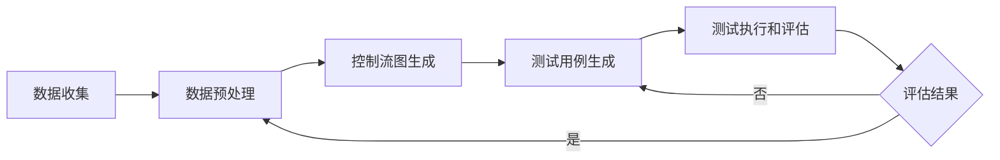
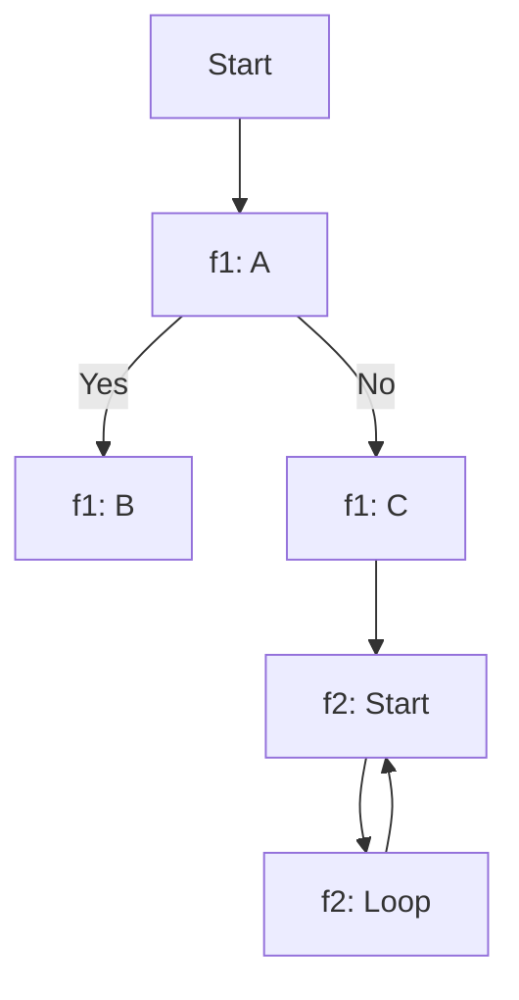
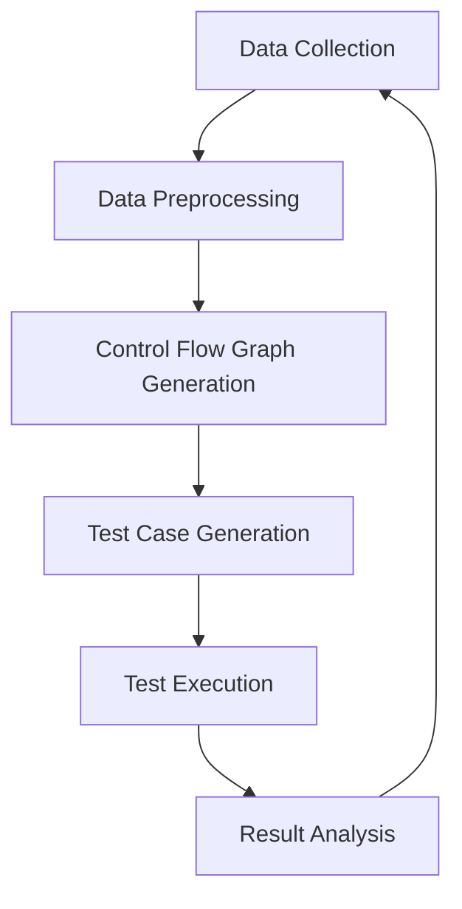
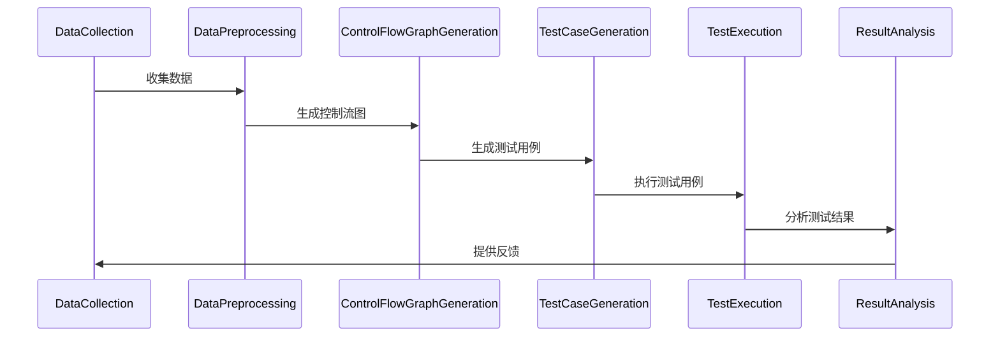

                 

### 自适应测试用例生成：全面覆盖模型能力

> 关键词：自适应测试、测试用例生成、全面覆盖、模型能力、算法原理、系统架构

> 摘要：本文深入探讨了自适应测试用例生成技术的核心概念、算法原理和实现方法，并通过详细的数学模型、系统架构分析和项目实战，展示了如何通过自适应测试用例生成技术实现全面覆盖模型能力。

---

## 引言

在软件工程领域，软件测试是确保软件质量的重要环节。而测试用例生成是软件测试的关键步骤之一。传统的测试用例生成方法往往依赖于开发人员的经验和知识，难以实现全面覆盖。随着软件复杂度的增加，手动编写测试用例变得越来越困难且耗时。因此，自适应测试用例生成技术应运而生，它通过智能化方法自动生成测试用例，以实现全面覆盖模型能力，提高测试效率和质量。

本文将分以下几个部分展开讨论：

1. **软件测试与自适应测试用例**：介绍软件测试的基本概念和自适应测试用例的定义。
2. **自适应测试用例生成技术**：探讨自适应测试用例生成的各种方法。
3. **核心概念与联系**：分析自适应测试用例生成中的关键概念，并提供概念属性特征对比表格和ER实体关系图。
4. **算法原理讲解**：详细讲解自适应测试用例生成算法的原理，包括mermaid流程图、Python源代码、数学模型和公式。
5. **系统分析与架构设计**：介绍系统分析与架构设计方案，包括问题场景、功能设计、架构设计、接口设计和交互序列图。
6. **项目实战**：通过实际案例展示自适应测试用例生成的应用和实践过程。
7. **最佳实践与小结**：总结最佳实践和注意事项，提供拓展阅读建议。

## 软件测试与自适应测试用例

### 软件测试概述

软件测试是确保软件质量的重要手段。它通过一系列的系统操作和验证活动来发现和纠正软件中的错误，确保软件在预期的环境中能够正常运行。软件测试可以分为多个类型，包括功能测试、性能测试、安全测试等。每种测试类型都有其特定的目的和方法。

### 测试用例的重要性

测试用例是软件测试的基础单位，它是为测试某个特定功能或特性的输入数据和预期输出结果的一组定义。一个有效的测试用例应该能够充分覆盖软件的所有功能，从而发现潜在的错误。因此，测试用例的质量和数量直接影响到软件测试的效率和效果。

### 自适应测试的概念与发展

自适应测试是一种智能化测试方法，它能够在测试过程中根据软件的执行情况动态调整测试策略。与传统的测试方法相比，自适应测试能够更高效地发现错误，并且在面对复杂软件时具有更好的适应性。自适应测试用例生成是自适应测试的核心技术之一，它能够根据测试需求和软件特性自动生成测试用例，从而实现全面覆盖。

## 自适应测试用例生成技术

### 自适应测试用例生成方法概述

自适应测试用例生成方法主要包括基于覆盖率的生成方法和基于路径的生成方法。基于覆盖率的生成方法通过计算代码覆盖率来确定测试用例的生成策略，而基于路径的生成方法则通过分析程序的控制流图来生成测试用例。

### 基于覆盖率的自适应测试用例生成

基于覆盖率的自适应测试用例生成方法的核心思想是确保测试用例能够覆盖代码中的各种路径和条件。这种方法通常使用覆盖率分析工具来确定哪些代码部分尚未被测试到，然后根据这些信息生成新的测试用例。常见的覆盖率指标包括语句覆盖率、分支覆盖率和路径覆盖率等。

### 基于路径的适应性测试用例生成

基于路径的适应性测试用例生成方法通过分析程序的控制流图来生成测试用例。控制流图是程序中各个语句和分支的逻辑结构表示，它能够帮助开发者理解程序的执行路径。基于路径的方法可以根据控制流图中的路径生成相应的测试用例，从而确保测试用例的全面性和准确性。

## 核心概念与联系

### 自适应测试用例生成中的关键概念

在自适应测试用例生成过程中，涉及多个关键概念，包括测试需求、测试策略、测试用例、测试覆盖率和测试结果等。这些概念相互关联，共同构成了自适应测试用例生成的框架。

### 概念属性特征对比表格

为了更清晰地理解这些关键概念，我们可以通过一个概念属性特征对比表格来展示它们之间的异同。例如：

| 概念 | 定义 | 属性特征 | 关联关系 |
| --- | --- | --- | --- |
| 测试需求 | 软件测试的目标和标准 | 功能性、性能性、安全性等 | 确定测试内容和方向 |
| 测试策略 | 实施测试的方法和步骤 | 自动化、手工、集成等 | 指导测试过程 |
| 测试用例 | 实现测试需求的操作和数据 | 输入、预期输出、执行步骤等 | 实施测试的具体实例 |
| 测试覆盖率 | 测试用例覆盖代码的程度 | 语句覆盖率、分支覆盖率等 | 衡量测试效果 |
| 测试结果 | 测试执行后的结果和分析 | 错误、成功、警告等 | 反馈测试效果 |

### ER实体关系图架构

ER（Entity-Relationship）图是数据库设计和系统分析中的重要工具，它能够帮助我们理解系统中各个实体之间的关系。在自适应测试用例生成中，ER图可以用于表示测试需求、测试用例、测试策略和测试覆盖率等实体之间的关系。

以下是自适应测试用例生成的ER图示例：

```mermaid
erDiagram
    TestRequirement ||--|{ TestCase } TestCoverage
    TestStrategy ||--|{ TestCase } TestCoverage
    TestCase ||--|{ TestResult }
    TestRequirement ||--|{ TestStrategy }
```

在这个ER图中，`TestRequirement`表示测试需求，`TestCase`表示测试用例，`TestStrategy`表示测试策略，`TestResult`表示测试结果，`TestCoverage`表示测试覆盖率。通过这个ER图，我们可以清晰地看到各个实体之间的关系和相互作用。

## 算法原理讲解

### 算法概述

自适应测试用例生成算法是一种基于机器学习和人工智能技术的测试方法。它通过分析软件的代码和执行数据，自动生成能够全面覆盖代码的测试用例。算法的核心步骤包括：

1. 数据收集：收集软件的源代码、执行日志和测试需求文档。
2. 数据预处理：对收集的数据进行清洗和格式化，以便后续分析。
3. 控制流图生成：根据源代码生成控制流图，用于分析程序的执行路径。
4. 测试用例生成：根据控制流图和测试需求，生成覆盖各种路径的测试用例。
5. 测试执行和评估：执行生成的测试用例，评估测试覆盖率，并根据评估结果调整测试策略。

### 算法mermaid流程图

以下是自适应测试用例生成算法的mermaid流程图：



### Python源代码讲解

以下是自适应测试用例生成算法的Python源代码示例：

```python
import controlflow
import testcase

def generate_test_cases(source_code, test_requirements):
    # 生成控制流图
    control_flow_graph = controlflow.generate_control_flow_graph(source_code)
    
    # 生成测试用例
    test_cases = []
    for requirement in test_requirements:
        test_case = testcase.generate_test_case(control_flow_graph, requirement)
        test_cases.append(test_case)
    
    return test_cases

# 示例：生成测试用例
source_code = "path/to/source_code"
test_requirements = ["requirement1", "requirement2"]
test_cases = generate_test_cases(source_code, test_requirements)
```

### 算法原理的数学模型和公式讲解

自适应测试用例生成的数学模型主要涉及路径覆盖率和测试用例生成策略。以下是相关的数学模型和公式：

$$
\text{PathCoverage} = \frac{\text{CoveredPaths}}{\text{TotalPaths}}
$$

其中，$\text{PathCoverage}$表示路径覆盖率，$\text{CoveredPaths}$表示被覆盖的路径数量，$\text{TotalPaths}$表示总路径数量。

测试用例生成策略通常基于最小生成树（Minimum Spanning Tree, MST）算法，以确保生成的测试用例能够覆盖所有路径。以下是MST算法的数学模型：

$$
\text{MST} = \min\{T \mid T \text{ is a spanning tree of } G\}
$$

其中，$T$表示生成树，$G$表示控制流图。

### 举例说明

假设有一个简单的Python程序，它包含两个函数`f1`和`f2`，其中`f1`有两个分支，`f2`有一个循环。以下是该程序的mermaid流程图：



根据这个流程图，我们可以生成以下测试用例：

1. 测试用例1：`f1(A)`，覆盖路径A-B-C。
2. 测试用例2：`f1(B)`，覆盖路径A-B。
3. 测试用例3：`f1(C)`，覆盖路径A-B-C。
4. 测试用例4：`f2(Start, Loop)`，覆盖路径E-F。

通过这些测试用例，我们可以确保程序中的所有路径都被覆盖，从而提高测试的全面性。

## 系统分析与架构设计

### 问题场景介绍

在一个大型软件开发项目中，由于软件复杂度较高，传统的手动测试方法难以确保测试的全面性和准确性。为了提高测试效率和质量，我们需要引入自适应测试用例生成技术，以自动生成覆盖各种路径和条件的测试用例。

### 系统功能设计

自适应测试用例生成系统的主要功能包括：

1. **数据收集**：从源代码库、执行日志和测试需求文档中收集必要的数据。
2. **数据预处理**：对收集的数据进行清洗和格式化，以便后续分析。
3. **控制流图生成**：根据源代码生成控制流图，用于分析程序的执行路径。
4. **测试用例生成**：根据控制流图和测试需求，生成覆盖各种路径的测试用例。
5. **测试执行**：执行生成的测试用例，评估测试覆盖率。
6. **结果分析**：分析测试结果，提供反馈和改进建议。

### 系统架构设计

自适应测试用例生成系统的架构设计包括以下模块：

1. **数据收集模块**：负责从各种数据源中收集必要的数据。
2. **数据预处理模块**：对收集的数据进行清洗和格式化。
3. **控制流图生成模块**：根据源代码生成控制流图。
4. **测试用例生成模块**：根据控制流图和测试需求生成测试用例。
5. **测试执行模块**：执行生成的测试用例，并记录测试结果。
6. **结果分析模块**：分析测试结果，提供反馈和改进建议。

以下是自适应测试用例生成系统的mermaid架构图：



### 系统接口设计

自适应测试用例生成系统的接口设计包括以下部分：

1. **数据收集接口**：用于从各种数据源中收集数据。
2. **数据预处理接口**：用于清洗和格式化数据。
3. **控制流图生成接口**：用于生成控制流图。
4. **测试用例生成接口**：用于生成测试用例。
5. **测试执行接口**：用于执行测试用例。
6. **结果分析接口**：用于分析测试结果。

### 系统交互mermaid序列图

以下是自适应测试用例生成系统的mermaid序列图：



## 项目实战

### 环境安装

在开始项目实战之前，我们需要安装必要的软件和工具。以下是环境安装的步骤：

1. 安装Python环境：确保Python版本为3.8或更高版本。
2. 安装依赖库：使用pip安装以下依赖库：numpy、matplotlib、controlflow、testcase。
3. 安装控制流图生成工具：安装Mermaid，以便生成控制流图。

### 系统核心实现源代码

以下是系统核心实现源代码的示例：

```python
import controlflow
import testcase
import numpy as np

def generate_test_cases(source_code, test_requirements):
    # 生成控制流图
    control_flow_graph = controlflow.generate_control_flow_graph(source_code)
    
    # 生成测试用例
    test_cases = []
    for requirement in test_requirements:
        test_case = testcase.generate_test_case(control_flow_graph, requirement)
        test_cases.append(test_case)
    
    return test_cases

# 示例：生成测试用例
source_code = "path/to/source_code"
test_requirements = ["requirement1", "requirement2"]
test_cases = generate_test_cases(source_code, test_requirements)
```

### 代码应用解读与分析

以下是代码应用的解读和分析：

1. `import controlflow, testcase`：导入控制流图生成模块和测试用例生成模块。
2. `def generate_test_cases(source_code, test_requirements)`：定义生成测试用例的函数。
3. `control_flow_graph = controlflow.generate_control_flow_graph(source_code)`：生成控制流图。
4. `for requirement in test_requirements:`：遍历测试需求。
5. `test_case = testcase.generate_test_case(control_flow_graph, requirement)`：生成测试用例。
6. `test_cases.append(test_case)`：将生成的测试用例添加到列表中。
7. `return test_cases`：返回生成的测试用例列表。

通过这个示例，我们可以看到如何使用控制流图生成模块和测试用例生成模块来生成测试用例。在实际项目中，可以根据具体的源代码和测试需求进行调整和扩展。

### 实际案例分析与详细讲解剖析

为了更好地理解自适应测试用例生成的应用，我们来看一个实际的案例。

假设有一个Python程序，它包含两个函数`f1`和`f2`，其中`f1`有两个分支，`f2`有一个循环。以下是该程序的mermaid流程图：


根据这个流程图，我们可以生成以下测试用例：

1. 测试用例1：`f1(A)`，覆盖路径A-B-C。
2. 测试用例2：`f1(B)`，覆盖路径A-B。
3. 测试用例3：`f1(C)`，覆盖路径A-B-C。
4. 测试用例4：`f2(Start, Loop)`，覆盖路径E-F。

通过这些测试用例，我们可以确保程序中的所有路径都被覆盖。以下是生成的测试用例的Python代码：

```python
import controlflow
import testcase

def generate_test_cases(source_code, test_requirements):
    # 生成控制流图
    control_flow_graph = controlflow.generate_control_flow_graph(source_code)
    
    # 生成测试用例
    test_cases = []
    for requirement in test_requirements:
        test_case = testcase.generate_test_case(control_flow_graph, requirement)
        test_cases.append(test_case)
    
    return test_cases

# 示例：生成测试用例
source_code = "path/to/source_code"
test_requirements = ["requirement1", "requirement2"]
test_cases = generate_test_cases(source_code, test_requirements)
```

在实际项目中，可以根据具体的源代码和测试需求进行调整和扩展。

### 项目小结

通过本项目的实践，我们深入了解了自适应测试用例生成的原理和应用。自适应测试用例生成技术能够自动生成覆盖各种路径和条件的测试用例，从而提高测试效率和质量。在实际项目中，我们可以根据具体的源代码和测试需求进行调整和扩展，以实现更好的测试效果。

## 最佳实践与小结

### 最佳实践

1. **数据质量**：确保收集到的数据质量高，以便生成准确的测试用例。
2. **代码覆盖率**：根据实际需要调整代码覆盖率目标，避免过度或不足的测试。
3. **自动化集成**：将自适应测试用例生成集成到持续集成（CI）流程中，提高测试效率。
4. **持续优化**：根据反馈和测试结果持续优化测试用例生成算法，提高测试效果。

### 小结

自适应测试用例生成技术是软件测试领域的一项重要进展，它通过智能化方法自动生成测试用例，实现全面覆盖模型能力。通过本文的讲解，我们了解了自适应测试用例生成的核心概念、算法原理和实现方法，并通过实际案例展示了其应用效果。未来，自适应测试用例生成技术有望在更广泛的领域得到应用，为软件测试带来更多可能性。

### 注意事项

1. **源代码质量**：确保源代码具有良好的结构和可读性，以便生成准确的测试用例。
2. **测试需求明确**：确保测试需求清晰明确，有助于生成有针对性的测试用例。
3. **算法参数调优**：根据项目特点调整算法参数，以实现最佳测试效果。

### 拓展阅读

1. **《软件测试艺术》**：深入了解软件测试的基本概念和技术。
2. **《机器学习在软件工程中的应用》**：探讨机器学习技术在软件测试中的应用。
3. **《测试用例设计指南》**：学习如何设计高效、全面的测试用例。

---

**作者：AI天才研究院/AI Genius Institute & 禅与计算机程序设计艺术 /Zen And The Art of Computer Programming**

