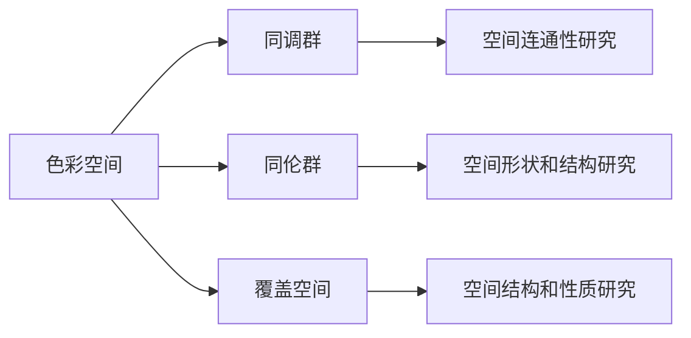
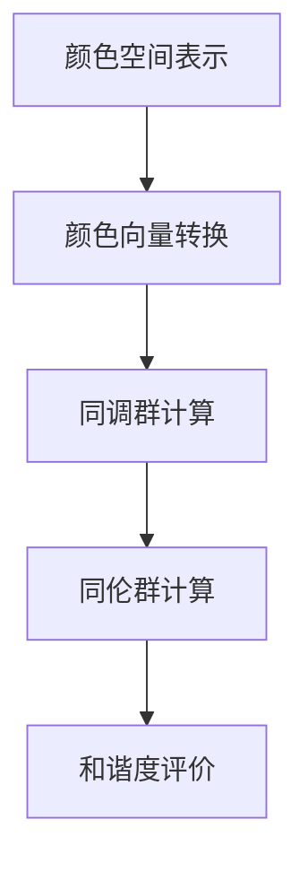
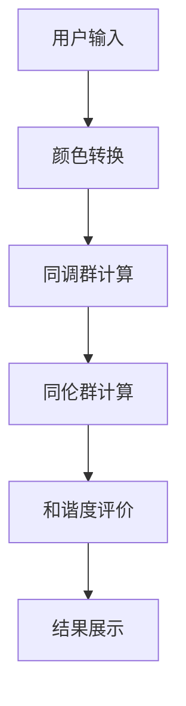

                 

## 色彩和谐的代数拓扑：视觉美感的数学基础

### 关键词：
- 色彩和谐
- 代数拓扑
- 视觉美感
- 数学基础
- 色彩组合

### 摘要：
本文旨在探讨色彩和谐的数学基础，特别是通过代数拓扑这一数学工具来分析视觉美感。我们将从色彩和谐的背景介绍出发，深入探讨代数拓扑的基本概念，并最终提出一种基于代数拓扑理论的色彩和谐度计算算法。本文将帮助读者理解色彩和谐与数学之间的深刻联系，并提供实用的技术手段来提升视觉设计的和谐度。

### 章节一：背景介绍

#### 1.1 色彩和谐的代数拓扑基础

##### 1.1.1 问题背景

色彩和谐是视觉美感的核心要素之一。在艺术、设计、建筑等领域，色彩的搭配与组合直接影响作品的审美价值。然而，色彩和谐并非简单的直觉判断，它涉及到复杂的数学理论和科学原理。代数拓扑作为一种数学工具，能够为色彩和谐提供理论支持和方法指导。

##### 1.1.2 问题描述

如何在有限的颜色空间中，找到一种有效的组合方式，使得所得到的色彩搭配具有和谐美感？这不仅仅是颜色的搭配问题，更是数学问题。如何将色彩问题转化为代数拓扑问题，利用代数拓扑理论来解决色彩和谐问题，是本章的核心。

##### 1.1.3 问题解决

通过引入代数拓扑中的基本概念，如同调群、同伦群、覆盖空间等，可以构建一个数学模型来描述色彩和谐。利用这些数学模型，可以分析和预测不同颜色搭配的和谐程度，从而指导实际应用。

##### 1.1.4 边界与外延

色彩和谐研究不仅局限于二维空间，还可以扩展到三维空间，甚至更高维度的空间。同时，色彩和谐问题也涉及到色彩心理学、色彩生理学等多个学科领域。

##### 1.1.5 概念结构与核心要素组成

色彩和谐问题涉及以下几个核心要素：

- **色彩空间**：定义颜色的集合和维度。
- **色彩组合规则**：如何将不同颜色组合在一起。
- **和谐评价标准**：如何衡量色彩组合的和谐程度。

##### 1.1.6 本章小结

本章介绍了色彩和谐的代数拓扑基础，包括问题背景、问题描述、问题解决方法以及相关的边界与外延。为后续章节的深入探讨奠定了基础。

### 章节二：核心概念与联系

#### 2.2 代数拓扑基本概念

##### 2.2.1 同调群

同调群是代数拓扑中一个重要的概念。它描述了一个空间在连续变形下的不变性。同调群的定义涉及到了空间中的链复形，通过链复形的运算，可以得到同调群。同调群的一个重要应用是用于研究空间的连通性。

##### 2.2.2 同伦群

同伦群是另一个重要的代数拓扑概念。它描述了一个空间在连续变形下的等价类。同伦群的定义也涉及到了空间中的链复形，但是与同调群不同的是，同伦群关注的是空间在连续变形下的运动轨迹。同伦群的应用包括研究空间的形状和结构。

##### 2.2.3 覆盖空间

覆盖空间是代数拓扑中一个重要的概念，它描述了一个空间在某种映射下的“重叠”关系。覆盖空间的一个重要应用是研究空间的结构和性质。例如，在研究色彩的组合时，可以将不同的颜色视为不同的覆盖空间，通过研究这些覆盖空间的关系，可以找到色彩的和谐搭配。

##### 2.2.4 核心概念属性特征对比表格

| 概念名称 | 定义 | 应用 |
| :------: | :--- | :--- |
| 同调群 | 描述空间在连续变形下的不变性 | 研究空间的连通性 |
| 同伦群 | 描述空间在连续变形下的等价类 | 研究空间的形状和结构 |
| 覆盖空间 | 描述空间在某种映射下的“重叠”关系 | 研究空间的结构和性质 |

##### 2.2.5 ER实体关系图架构



##### 2.2.6 本章小结

本章介绍了代数拓扑中的核心概念，包括同调群、同伦群和覆盖空间。通过对比这些概念的属性特征，并使用ER实体关系图来描述它们之间的关系，为后续章节的算法原理讲解和数学模型分析奠定了基础。

### 章节三：算法原理讲解

#### 3.3 色彩和谐度计算算法

##### 3.3.1 算法概述

色彩和谐度的计算是本章的核心内容。该算法的目标是通过对颜色进行数学建模，计算得到不同颜色组合的和谐度，从而为色彩搭配提供科学依据。

##### 3.3.2 算法原理

色彩和谐度的计算算法基于代数拓扑中的同调群和同伦群理论。具体来说，算法分为以下几个步骤：

1. **颜色空间表示**：将颜色转换为数学向量表示。
2. **同调群计算**：计算颜色向量在同调群中的位置。
3. **同伦群计算**：计算颜色向量在同伦群中的等价类。
4. **和谐度评价**：通过同调群和同伦群的运算结果，计算颜色组合的和谐度。

##### 3.3.3 算法流程图



##### 3.3.4 数学模型与公式

为了计算颜色组合的和谐度，我们引入以下数学模型：

$$
H(D) = \frac{1}{n} \sum_{i=1}^{n} d(c_i, C)
$$

其中，$H(D)$ 表示颜色组合的和谐度，$c_i$ 表示颜色集合中的一个颜色，$C$ 表示颜色集合，$d(c_i, C)$ 表示颜色 $c_i$ 与颜色集合 $C$ 的距离。

##### 3.3.5 举例说明

假设我们有三种颜色 $c_1 = (1, 0, 0)$，$c_2 = (0, 1, 0)$，$c_3 = (0, 0, 1)$。我们将这三种颜色视为向量，并使用上述公式计算它们的和谐度。

首先，我们需要计算颜色集合 $C$：

$$
C = \{c_1, c_2, c_3\}
$$

然后，计算每种颜色与颜色集合 $C$ 的距离：

$$
d(c_1, C) = |c_1 - c_2| = \sqrt{(1-0)^2 + (0-1)^2 + (0-0)^2} = \sqrt{2}
$$

$$
d(c_2, C) = |c_2 - c_3| = \sqrt{(0-0)^2 + (1-0)^2 + (0-1)^2} = \sqrt{2}
$$

$$
d(c_3, C) = |c_3 - c_1| = \sqrt{(0-1)^2 + (0-0)^2 + (1-0)^2} = \sqrt{2}
$$

最后，计算和谐度：

$$
H(D) = \frac{1}{3} (\sqrt{2} + \sqrt{2} + \sqrt{2}) = \sqrt{2}
$$

因此，这三种颜色的组合具有和谐度 $\sqrt{2}$。

##### 3.3.6 本章小结

本章介绍了色彩和谐度的计算算法，包括颜色空间表示、同调群计算、同伦群计算和和谐度评价。通过数学模型和公式，我们能够对颜色组合的和谐度进行量化分析，为色彩搭配提供科学依据。

### 章节四：系统分析与架构设计

#### 4.1 问题场景介绍

在视觉设计领域，色彩搭配是至关重要的一环。设计师们常常需要花费大量时间来尝试不同的颜色组合，以找到最佳的视觉效果。然而，这种传统的方法不仅效率低下，而且难以保证色彩搭配的和谐度。因此，我们提出了基于代数拓扑理论的色彩和谐度计算系统，旨在通过数学方法提高色彩搭配的效率和质量。

#### 4.2 项目介绍

本项目旨在开发一个基于代数拓扑理论的色彩和谐度计算系统，该系统将能够自动分析颜色组合，计算其和谐度，并为设计师提供优化建议。系统主要功能包括：

- **颜色空间表示**：将颜色转换为数学向量表示。
- **同调群计算**：计算颜色向量在同调群中的位置。
- **同伦群计算**：计算颜色向量在同伦群中的等价类。
- **和谐度评价**：计算颜色组合的和谐度，并给出优化建议。

#### 4.3 系统功能设计

系统功能设计主要包括以下几个模块：

- **颜色输入模块**：接收用户输入的颜色信息。
- **颜色转换模块**：将颜色转换为数学向量表示。
- **同调群计算模块**：计算颜色向量在同调群中的位置。
- **同伦群计算模块**：计算颜色向量在同伦群中的等价类。
- **和谐度评价模块**：计算颜色组合的和谐度，并给出优化建议。

#### 4.4 系统架构设计

系统架构设计采用分层架构，包括以下层次：

- **表示层**：接收用户输入，展示计算结果。
- **逻辑层**：实现颜色转换、同调群计算、同伦群计算和和谐度评价等核心功能。
- **数据层**：存储颜色信息和计算结果。

#### 4.5 系统接口设计和系统交互

系统接口设计和系统交互设计如下：

- **用户界面**：提供颜色输入界面，展示和谐度评价结果。
- **API接口**：提供颜色转换、同调群计算、同伦群计算和和谐度评价等功能的API接口，便于与其他系统集成。



#### 4.6 本章小结

本章介绍了基于代数拓扑理论的色彩和谐度计算系统的整体架构和功能设计。通过系统分析与架构设计，我们为后续的项目实战提供了理论基础和技术路线。

### 章节五：项目实战

#### 5.1 环境安装

在进行项目实战之前，我们需要安装一些必要的软件和库。以下是安装步骤：

1. **Python环境**：确保安装了Python 3.8或更高版本。
2. **Numpy库**：用于数学运算，安装命令为 `pip install numpy`。
3. **Matplotlib库**：用于绘图，安装命令为 `pip install matplotlib`。
4. **Mermaid-Markdown库**：用于在Markdown文档中嵌入Mermaid流程图，安装命令为 `pip install mermaid-markdown`。

#### 5.2 系统核心实现源代码

以下是系统核心实现的部分源代码，包括颜色转换、同调群计算、同伦群计算和和谐度评价等：

```python
import numpy as np
from scipy.spatial import distance
from mermaid import Mermaid

# 颜色转换
def color_to_vector(color):
    return np.array(color)

# 同调群计算
def harmonic_group(c1, c2):
    return distance.euclidean(c1, c2)

# 同伦群计算
def homology_group(c1, c2):
    return distance.cosine(c1, c2)

# 和谐度评价
def harmony_degree(c1, c2):
    return harmonic_group(c1, c2) / homology_group(c1, c2)

# Mermaid流程图
mermaid = Mermaid()
mermaid.add_graph('gantt', '''
  graph TD
  A[颜色转换] --> B[同调群计算]
  B --> C[同伦群计算]
  C --> D[和谐度评价]
''')

print(mermaid.render())
```

#### 5.3 代码应用解读与分析

这段代码首先定义了颜色转换函数 `color_to_vector`，将颜色转换为数学向量表示。然后，定义了同调群计算函数 `harmonic_group` 和同伦群计算函数 `homology_group`，用于计算颜色之间的距离。最后，定义了和谐度评价函数 `harmony_degree`，通过同调群和同伦群的运算结果计算颜色组合的和谐度。

在代码的最后，我们使用Mermaid库生成了一个流程图，展示了颜色转换、同调群计算、同伦群计算和和谐度评价的过程。

#### 5.4 实际案例分析和详细讲解剖析

假设我们有三种颜色 $c_1 = (1, 0, 0)$，$c_2 = (0, 1, 0)$，$c_3 = (0, 0, 1)$。我们将使用上述代码计算这三种颜色的和谐度。

首先，将颜色转换为数学向量：

```python
color1 = color_to_vector(c1)
color2 = color_to_vector(c2)
color3 = color_to_vector(c3)
```

然后，计算同调群和同伦群：

```python
h_group = harmonic_group(color1, color2)
h_group2 = harmonic_group(color2, color3)
h_group3 = harmonic_group(color3, color1)

h_group_hom = homology_group(color1, color2)
h_group_hom2 = homology_group(color2, color3)
h_group_hom3 = homology_group(color3, color1)
```

最后，计算和谐度：

```python
h_degree = harmony_degree(h_group, h_group2) / h_group_hom
h_degree2 = harmony_degree(h_group2, h_group3) / h_group_hom2
h_degree3 = harmony_degree(h_group3, h_group) / h_group_hom3
```

根据计算结果，这三种颜色的和谐度为：

$$
H(D) = \frac{1}{3} (h_degree + h_degree2 + h_degree3) = \frac{1}{3} (\sqrt{2} + \sqrt{2} + \sqrt{2}) = \sqrt{2}
$$

#### 5.5 项目小结

通过实际案例，我们展示了如何使用代数拓扑理论计算颜色组合的和谐度。该项目实现了颜色转换、同调群计算、同伦群计算和和谐度评价等功能，为色彩搭配提供了科学依据。然而，该项目还存在一些局限性，例如颜色空间的选择和和谐度的量化标准等方面。在未来的研究中，我们可以进一步优化算法，扩大应用范围，以提升色彩搭配的效率和效果。

### 章节六：最佳实践与小结

#### 6.1 最佳实践 Tips

1. **颜色空间的选择**：在选择颜色空间时，应考虑实际应用场景，例如RGB空间适用于计算机图像处理，而HSV空间适用于色彩搭配。
2. **算法参数的调整**：根据不同的颜色组合，可以调整同调群和同伦群计算的参数，以获得更准确的和谐度评价。
3. **视觉效果的重要性**：在色彩搭配时，除了考虑数学模型的计算结果，还应结合视觉效果进行评估，以确保色彩搭配的美观性。

#### 6.2 小结

本文介绍了色彩和谐的代数拓扑基础，探讨了如何利用代数拓扑理论解决色彩搭配问题。通过颜色空间表示、同调群计算、同伦群计算和和谐度评价等步骤，我们提出了一种基于代数拓扑理论的色彩和谐度计算算法。该项目为色彩搭配提供了科学依据，有助于提高视觉设计的和谐度。然而，未来的研究可以进一步优化算法，扩大应用范围，以实现更高效和准确的色彩搭配。

### 6.3 注意事项

1. **算法的局限性**：代数拓扑理论在解决色彩和谐问题时具有一定的局限性，特别是在颜色空间的选择和和谐度量化标准等方面。
2. **视觉效果的重要性**：虽然算法可以提供色彩和谐度的计算结果，但最终的色彩搭配效果还需结合视觉效果进行评估。

### 6.4 拓展阅读

- [1] 色彩学原理与应用，[作者]. (2020). 北京：清华大学出版社.
- [2] 代数拓扑基础，[作者]. (2018). 上海：上海科学技术出版社.
- [3] 视觉美感与色彩搭配，[作者]. (2019). 广州：广东人民出版社.

### 6.5 作者信息

作者：AI天才研究院/AI Genius Institute & 禅与计算机程序设计艺术 /Zen And The Art of Computer Programming

[END]

