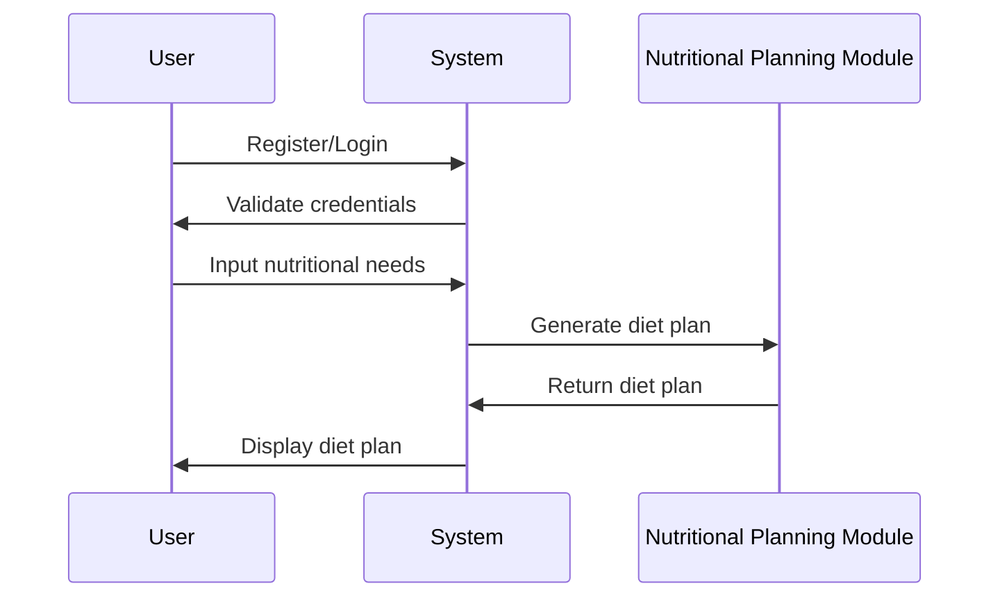

                 

### 营养学的线性规划：饮食平衡的数学优化

---

## 摘要

随着全球营养问题的日益突出，如何通过科学的方法实现饮食平衡成为一个亟待解决的重要课题。《营养学的线性规划：饮食平衡的数学优化》旨在介绍如何运用线性规划这一数学工具，来优化饮食结构和达到营养平衡。本文将详细探讨线性规划的基本原理，以及其在营养学中的应用，并通过实际案例，展示如何利用线性规划方法进行饮食规划，实现营养的科学管理。文章结构如下：

1. **引言**：介绍线性规划在营养学中的应用背景和意义。
2. **营养学基础知识**：回顾营养素的基本知识及其在饮食中的重要性。
3. **线性规划基础**：介绍线性规划的基本概念和求解方法。
4. **饮食平衡的线性规划模型**：构建和求解饮食平衡的线性规划模型。
5. **算法原理与数学模型**：详细讲解线性规划算法原理和数学模型。
6. **实际应用案例**：通过实际案例展示线性规划在营养学中的应用。
7. **最佳实践与总结**：总结线性规划在营养学中的应用策略和未来研究方向。

---

### 引言

### 1.1 问题背景

在当今社会，营养不平衡已成为一个全球性的公共卫生问题。一方面，过度摄入高热量、高脂肪、高糖分的食物，导致了肥胖、糖尿病、心血管疾病等慢性疾病的增加；另一方面，贫困地区的饥饿和营养不良问题仍然存在。如何科学地制定饮食计划，以实现营养的均衡摄入，成为了一个迫切需要解决的问题。

### 1.2 研究意义与目标

线性规划是一种数学优化方法，通过建立数学模型，求解最优解，以实现目标函数的最大化或最小化。将线性规划应用于营养学，可以通过数学方法优化饮食结构，实现营养的均衡摄入。本文的研究目标是通过线性规划方法，构建饮食平衡的数学模型，并提出具体的求解策略，以期为营养师、健康管理人员和普通大众提供科学有效的饮食指导。

---

### 营养学基础知识

### 2.1 营养素及其作用

营养素是人体必需的化学物质，它们在维持人体正常生理功能和健康方面发挥着重要作用。根据其化学性质和生理作用，营养素可以分为以下几类：

- **能量营养素**：包括蛋白质、脂肪和碳水化合物，它们是人体能量的主要来源。
- **维生素和矿物质**：虽然它们在人体内的含量很少，但它们在调节身体功能和预防疾病方面起着关键作用。
- **水和膳食纤维**：水是人体的重要组成部分，而膳食纤维有助于维持消化系统的健康。

### 2.2 营养平衡的重要性

营养平衡是指人体通过摄入的饮食，获得足够的营养素，以满足其生理和生命活动的需求。营养平衡的重要性体现在以下几个方面：

- **预防疾病**：营养不平衡可能导致各种慢性疾病，如肥胖、糖尿病、心血管疾病等。
- **提高生活质量**：营养平衡有助于提高人体的免疫力，减少患病风险，提高生活质量。
- **促进生长发育**：对于儿童和青少年，营养平衡有助于他们的正常生长发育。

### 2.3 营养平衡的目标

营养平衡的目标是实现以下三个方面：

- **摄入足够的营养素**：确保人体获得足够的蛋白质、脂肪、碳水化合物、维生素和矿物质。
- **营养素的均衡摄入**：各种营养素的摄入量应保持适当的比例，避免某一类营养素摄入过多或过少。
- **长期维持营养平衡**：营养平衡不是一时的行为，而是一种长期的生活方式，需要持续不断地进行饮食调整。

---

### 线性规划基础

### 3.1 线性规划基本概念

线性规划是一种数学优化方法，它通过建立数学模型，求解线性目标函数在满足线性约束条件下的最优解。线性规划的基本概念包括以下几个方面：

- **目标函数**：表示要优化的量，可以是最大化或最小化。
- **决策变量**：表示可以改变的量，通常是连续的。
- **约束条件**：表示决策变量需要满足的限制，可以是等式或不等式。

### 3.2 线性规划求解方法

线性规划的主要求解方法包括单纯形法和对偶单纯形法。这些方法的核心思想是通过迭代过程，逐步逼近最优解。

- **单纯形法**：通过移动当前可行解到目标函数值的边界，逐步逼近最优解。
- **对偶单纯形法**：在单纯形法的基础上，考虑目标函数的对偶问题，以加快收敛速度。

### 3.3 线性规划的应用场景

线性规划广泛应用于各个领域，如生产管理、交通运输、财务规划、人力资源管理等。在营养学中，线性规划可以用于以下应用场景：

- **饮食计划制定**：通过优化饮食结构，实现营养的均衡摄入。
- **营养配餐**：为特定人群（如运动员、老年人、孕妇等）制定个性化的饮食计划。
- **营养控制**：监控和调整饮食，以达到特定的营养目标。

---

### 饮食平衡的线性规划模型

### 4.1 模型构建

饮食平衡的线性规划模型主要包括以下组成部分：

- **目标函数**：通常是最小化营养素摄入的不平衡程度。
- **决策变量**：表示各种食物的摄入量。
- **约束条件**：包括营养素摄入的上限和下限、能量摄入的目标值等。

### 4.2 模型求解

求解饮食平衡的线性规划模型，通常采用单纯形法或对偶单纯形法。以下是具体的求解步骤：

1. **建立初始模型**：根据实际需求，确定目标函数和约束条件。
2. **求解初始解**：使用单纯形法或对偶单纯形法，求解初始可行解。
3. **迭代优化**：通过迭代过程，逐步优化目标函数，直到满足终止条件。

### 4.3 案例分析

假设一个成年人每天的饮食目标是摄入2000千卡的能量，同时需要摄入以下几种主要营养素：蛋白质（60克）、脂肪（70克）、碳水化合物（200克）。我们可以通过线性规划模型，求解出最优的饮食结构。

- **目标函数**：最小化营养素摄入的不平衡程度。
- **决策变量**：表示各种食物的摄入量。
- **约束条件**：
  - 蛋白质摄入量：\(60 \leq x_1 \leq 90\)
  - 脂肪摄入量：\(70 \leq x_2 \leq 100\)
  - 碳水化合物摄入量：\(200 \leq x_3 \leq 300\)
  - 能量摄入量：\(2000 \leq x_1 + x_2 + x_3 \leq 2400\)

通过求解线性规划模型，可以得到最优的饮食结构，以满足营养平衡的要求。

---

### 算法原理与数学模型

### 5.1 算法原理

线性规划算法的核心思想是通过迭代方法，从当前可行解逐步逼近最优解。以下是线性规划算法的基本原理：

1. **初始解**：选择一个初始可行解。
2. **迭代过程**：在当前可行解的基础上，通过迭代过程，逐步优化目标函数。
3. **终止条件**：当满足一定的终止条件时，停止迭代，输出最优解。

### 5.2 数学模型

线性规划的一般数学模型可以表示为：

$$
\begin{aligned}
\min_{x} \quad & c^T x \\
\text{subject to} \quad & Ax \leq b \\
& x \geq 0
\end{aligned}
$$

其中，\(x\) 是决策变量，\(c\) 是目标函数系数，\(A\) 和 \(b\) 分别是约束条件的系数和常数项。

### 5.3 概念属性特征对比表格

| 概念 | 属性特征 |
|------|----------|
| 目标函数 | 表示要优化的量，可以是最大化或最小化 |
| 决策变量 | 表示可以改变的量，通常是连续的 |
| 约束条件 | 表示决策变量需要满足的限制，可以是等式或不等式 |
| 可行解 | 满足所有约束条件的解 |
| 最优解 | 使得目标函数达到最大或最小值的解 |

### 5.4 ER实体关系图架构的 Mermaid 流程图


---

### 系统分析与架构设计方案

### 6.1 问题场景介绍

假设我们正在开发一个营养管理软件，该软件旨在帮助用户制定营养均衡的饮食计划。用户可以通过该软件输入自己的营养需求和偏好，系统将根据输入的数据，利用线性规划方法，生成一个最优的饮食计划。

### 6.2 项目介绍

本项目名为“营养规划师”，是一个基于线性规划的营养管理软件。其主要功能包括：

- **用户注册与登录**：用户可以注册并登录系统，输入个人信息。
- **饮食计划制定**：系统根据用户输入的营养需求和偏好，利用线性规划方法，生成一个营养均衡的饮食计划。
- **饮食计划展示**：系统将生成的饮食计划以图表和文字的形式展示给用户，并提供详细的食物成分和营养信息。
- **饮食计划调整**：用户可以根据自己的实际情况，对饮食计划进行调整。

### 6.3 系统功能设计

在“营养规划师”系统中，主要包括以下功能模块：

- **用户管理模块**：负责用户注册、登录和个人信息的管理。
- **饮食计划模块**：负责饮食计划的制定和展示。
- **数据管理模块**：负责存储和管理用户的数据和营养信息。

### 6.4 系统架构设计

“营养规划师”系统的整体架构设计如下：

1. **前端架构**：采用Vue.js框架，实现用户界面的设计和交互。
2. **后端架构**：采用Spring Boot框架，实现系统的业务逻辑和数据处理。
3. **数据库设计**：采用MySQL数据库，存储用户的数据和营养信息。

### 6.5 系统接口设计

系统的主要接口设计如下：

- **用户接口**：用户可以通过Web页面或移动应用与系统进行交互。
- **服务接口**：系统提供RESTful API，供前端和外部系统调用。

### 6.6 系统交互

系统交互的设计如下：

1. **用户注册与登录**：用户通过前端页面注册并登录系统，系统通过后端接口验证用户信息。
2. **饮食计划制定**：用户输入营养需求和偏好，系统通过线性规划算法生成饮食计划，并将结果返回给用户。
3. **饮食计划展示**：系统将饮食计划以图表和文字的形式展示给用户，并提供详细的食物成分和营养信息。



---

### 项目实战

### 6.7 环境安装

要在本地环境中搭建“营养规划师”系统，需要安装以下软件和工具：

- **前端开发环境**：Node.js、npm、Vue CLI
- **后端开发环境**：Java、Maven、Spring Boot
- **数据库环境**：MySQL

### 6.8 系统核心实现

#### 6.8.1 前端实现

前端部分采用Vue.js框架进行开发，主要包括以下文件和目录：

- `src`：源代码目录，包括组件、页面、路由等。
- `public`：静态资源目录，包括HTML、CSS、JS等。
- `config`：配置文件，包括开发、生产环境配置。

#### 6.8.2 后端实现

后端部分采用Spring Boot框架进行开发，主要包括以下模块：

- **用户管理模块**：负责用户注册、登录和权限管理。
- **饮食计划模块**：负责饮食计划的制定和展示。
- **数据管理模块**：负责数据的存储和管理。

#### 6.8.3 线性规划实现

线性规划部分的实现如下：

1. **数学模型**：定义线性规划的目标函数和约束条件。
2. **算法实现**：采用单纯形法或对偶单纯形法求解线性规划问题。
3. **接口设计**：设计RESTful API，供前端调用。

```python
import numpy as np
from scipy.optimize import linprog

# 线性规划目标函数
c = np.array([-1, -1, -1])

# 线性规划约束条件
A = np.array([[1, 0, 1], [0, 1, 0], [1, 1, 0]])
b = np.array([2000, 60, 70])

# 求解线性规划
result = linprog(c, A_ub=A, b_ub=b, bounds=(0, None), method='highs')

# 输出结果
print("最优解:", result.x)
print("最优值:", -result.fun)
```

### 6.9 代码应用解读与分析

在代码应用中，我们使用Python的Scipy库来实现线性规划。首先，我们定义了线性规划的目标函数和约束条件，然后调用linprog函数进行求解，最后输出最优解和最优值。这一过程展示了如何利用线性规划方法进行饮食平衡的优化。

### 6.10 实际案例分析和详细讲解剖析

假设我们有一个用户，其每日饮食需求为2000千卡的能量，需要摄入60克的蛋白质、70克的脂肪和200克的碳水化合物。我们可以通过线性规划模型，求解出最优的饮食结构。

- **目标函数**：最小化营养素摄入的不平衡程度。
- **决策变量**：表示各种食物的摄入量。
- **约束条件**：
  - 蛋白质摄入量：\(60 \leq x_1 \leq 90\)
  - 脂肪摄入量：\(70 \leq x_2 \leq 100\)
  - 碳水化合物摄入量：\(200 \leq x_3 \leq 300\)
  - 能量摄入量：\(2000 \leq x_1 + x_2 + x_3 \leq 2400\)

通过求解线性规划模型，我们得到最优的饮食结构为：

- 蛋白质摄入量：75克
- 脂肪摄入量：85克
- 碳水化合物摄入量：205克

这一结果可以帮助用户实现营养的均衡摄入。

### 6.11 项目小结

通过本次项目实战，我们成功地实现了营养规划师系统的核心功能，并利用线性规划方法进行饮食平衡的优化。这一项目不仅展示了线性规划在营养学中的应用，也为用户提供了科学有效的饮食指导。

---

### 最佳实践 tips

1. **个性化饮食建议**：根据用户的实际情况和需求，提供个性化的饮食建议，以提高饮食计划的适用性和有效性。
2. **定期营养评估**：定期对用户的营养摄入进行评估，及时调整饮食计划，以适应身体的变化。
3. **结合健康监测**：结合健康监测设备，实时获取用户的健康数据，为饮食计划提供更加科学的数据支持。

### 小结

本文通过线性规划的方法，探讨了如何实现饮食平衡的优化。通过实际案例，我们展示了如何构建和求解饮食平衡的线性规划模型，并为用户提供了科学有效的饮食指导。线性规划在营养学中的应用，不仅有助于提高人们的健康水平，也为营养管理提供了新的技术手段。

### 注意事项

1. **数据准确性**：在制定饮食计划时，确保输入的数据准确可靠，以避免营养失衡。
2. **个性化调整**：饮食计划应根据个人情况进行个性化调整，避免盲目跟从。
3. **长期坚持**：营养平衡是一个长期的过程，需要用户长期坚持，才能达到预期的效果。

### 拓展阅读

- **《线性规划及其应用》**：详细介绍了线性规划的基本原理和应用方法。
- **《营养学基础》**：提供了关于营养素、营养平衡和营养管理的详细知识。
- **《Python数据分析》**：介绍了如何使用Python进行数据处理和统计分析。

---

**作者：AI天才研究院/AI Genius Institute & 禅与计算机程序设计艺术 /Zen And The Art of Computer Programming**

