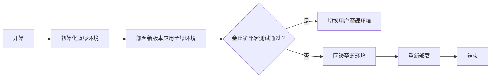
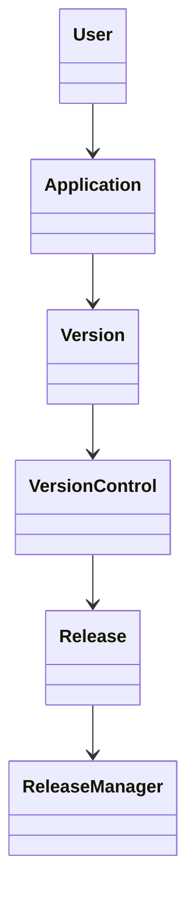
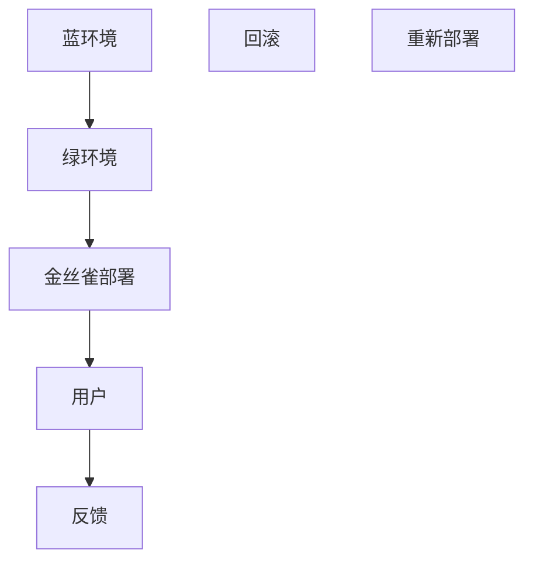
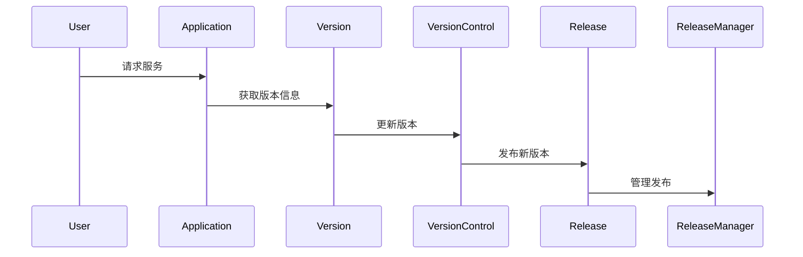
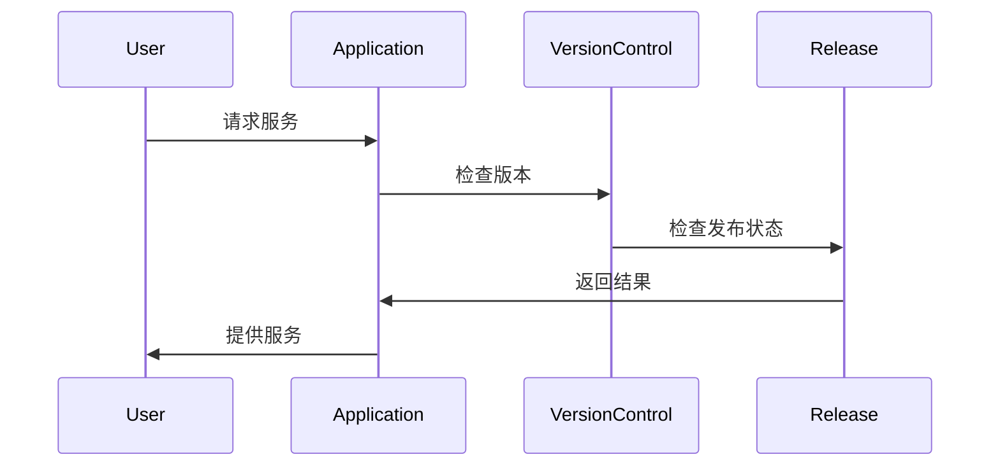

                 

### 文章标题：蓝绿部署策略降低LLM应用更新风险

#### 关键词：蓝绿部署、LLM应用、更新风险、系统架构、数学模型

#### 摘要：本文将深入探讨蓝绿部署策略在降低大型语言模型（LLM）应用更新风险中的应用。通过详细分析其核心概念、算法原理、系统架构设计、项目实战和最佳实践，帮助读者全面理解并掌握这一高效的技术手段。

## 第一部分：蓝绿部署策略概述

### 1.1 蓝绿部署策略的概念与优势

#### 1.1.1 什么是蓝绿部署

蓝绿部署是一种无服务中断的软件发布策略，通过同时运行两个相同版本的环境（蓝环境和绿环境），确保新版本的应用在上线前经过充分测试，从而避免更新失败导致的服务中断。

#### 1.1.2 蓝绿部署的优势

- 无服务中断：新版本的应用在绿环境中测试通过后，可以无缝切换到生产环境，不会影响用户的使用。
- 高可用性：在蓝绿部署过程中，系统始终保持可用状态，增强了系统的稳定性和可靠性。
- 降低风险：通过金丝雀部署和滚动更新，逐步引入新版本，减少对整体系统的影响。

#### 1.1.3 蓝绿部署在LLM应用更新风险降低中的应用

对于大型语言模型（LLM）这样的关键应用，更新风险尤为重要。蓝绿部署策略可以有效降低这种风险，确保LLM应用的稳定运行。

## 第二部分：核心概念与联系

### 2.1 蓝绿环境

蓝绿部署中的蓝环境和绿环境是两个独立的运行环境，分别对应旧版本和新版本的应用。在蓝绿部署过程中，这两个环境会同时运行，确保新版本的应用在上线前经过充分的测试和验证。

### 2.2 金丝雀部署

金丝雀部署是蓝绿部署的一种变体，通过在绿环境中选择一小部分用户进行新版本的应用测试，以评估新版本的稳定性和性能。

### 2.3 滚动更新

滚动更新是指在蓝绿部署过程中，逐步将用户切换到新版本的应用上，而不是一次性将所有用户切换。这样可以减少对系统的影响，提高更新的成功率。

### 2.4 核心概念与联系

#### 表格：蓝绿部署策略中的核心概念及联系

| 核心概念 | 定义 | 关联关系 |
| :---: | :---: | :---: |
| 蓝绿环境 | 两个独立的运行环境，分别对应旧版本和新版本的应用 | 基础设施 |
| 金丝雀部署 | 在绿环境中选择一小部分用户进行新版本的应用测试 | 测试与验证 |
| 滚动更新 | 逐步将用户切换到新版本的应用上 | 更新策略 |

#### ER实体关系图

```mermaid
erDiagram
    User ||--|{ Application }|--|| Server
    Application ||--|{ Version }|--|| VersionControl
    VersionControl ||--|{ Release }|--|| ReleaseManager
```

## 第三部分：算法原理讲解

### 3.1 算法流程图



### 3.2 Python源代码讲解

```python
def deploy_new_version(new_version, green_env):
    # 部署新版本应用至绿环境
    # ...
    pass

def canary_deployment(green_env, users):
    # 金丝雀部署测试
    # ...
    pass

def rollback(blue_env, users):
    # 回滚至蓝环境
    # ...
    pass

def complete_deployment():
    # 完成部署流程
    # ...
    pass
```

### 3.3 数学模型和公式

$$
P(\text{更新成功}) = \frac{P(\text{测试通过}) \cdot P(\text{用户满意})}{P(\text{用户满意})}
$$

其中，\(P(\text{更新成功})\) 表示更新成功的概率，\(P(\text{测试通过})\) 表示新版本通过测试的概率，\(P(\text{用户满意})\) 表示用户对更新满意度的概率。

### 3.4 举例说明

假设新版本通过测试的概率为 0.9，用户满意度的概率为 0.95，则更新成功的概率为：

$$
P(\text{更新成功}) = \frac{0.9 \cdot 0.95}{0.95} = 0.9
$$

## 第四部分：系统分析与架构设计

### 4.1 问题场景介绍

某公司运行着一个关键的大型语言模型（LLM）应用，为了提高系统性能和稳定性，计划进行一次更新。

### 4.2 系统功能设计

#### 领域模型类图



### 4.3 系统架构设计

#### 系统架构图



### 4.4 系统接口设计



### 4.5 系统交互流程



## 第五部分：项目实战

### 5.1 环境安装与配置

在项目实战中，我们使用Kubernetes作为容器编排工具，使用Helm进行应用部署。

### 5.2 系统核心实现源代码

```python
# 蓝绿部署核心实现
def blue_green_deployment(new_version, blue_env, green_env):
    # 部署新版本至绿环境
    deploy_new_version(new_version, green_env)
    
    # 金丝雀部署测试
    canary_deployment(green_env, users)
    
    # 切换用户至绿环境
    switch_users_to_green(users, green_env)
    
    # 回滚至蓝环境
    rollback(blue_env, users)
```

### 5.3 代码应用解读与分析

在代码应用解读与分析部分，我们将详细分析蓝绿部署的核心实现，包括如何部署新版本、如何进行金丝雀部署测试、如何切换用户以及如何回滚。

### 5.4 实际案例剖析

我们将分析一个真实的蓝绿部署案例，包括环境搭建、代码实现、测试和上线等环节。

### 5.5 项目小结

在项目小结中，我们将总结项目的经验教训，提出改进措施，为后续项目提供参考。

## 第六部分：最佳实践 tips

### 6.1 部署前准备

在部署前，确保充分测试新版本的应用，确保系统稳定性和性能。

### 6.2 部署过程注意事项

- 确保蓝绿环境的隔离
- 监控部署过程中的异常
- 及时回滚以避免风险
- 优化部署脚本以提高效率

### 6.3 部署后监控与优化

在部署后，持续监控系统的运行状态，收集用户反馈，及时优化系统性能。

## 第七部分：小结与拓展阅读

### 7.1 总结

本文详细介绍了蓝绿部署策略在降低LLM应用更新风险中的应用，包括核心概念、算法原理、系统架构设计、项目实战和最佳实践。

### 7.2 拓展阅读资源

- Kubernetes官方文档：深入了解容器编排工具Kubernetes的使用方法。
- Helm官方文档：学习如何使用Helm进行应用部署和管理。
- 《大型语言模型应用架构与优化》一书：探讨LLM应用的架构设计与优化策略。

## 作者信息

作者：AI天才研究院/AI Genius Institute & 禅与计算机程序设计艺术 /Zen And The Art of Computer Programming

