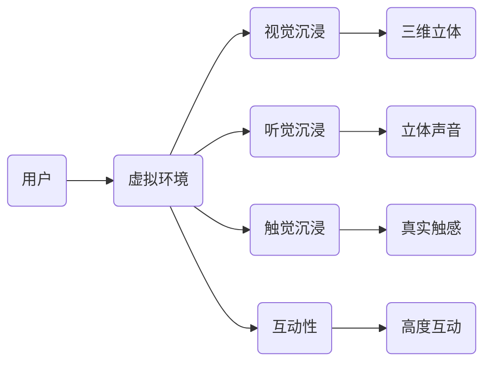

                 

### 第1章：虚拟现实技术基础

#### 1.1 虚拟现实技术概述

虚拟现实（Virtual Reality，简称VR）是一种通过电脑模拟实现的模拟环境，用户可以通过头戴式显示器（HMD）、数据手套、位置跟踪器等设备，与虚拟环境进行交互，获得沉浸式体验。VR技术最早起源于20世纪60年代的模拟技术，但直到21世纪，随着计算机图形学、显示技术、传感器技术和网络技术的发展，VR技术才逐渐走向成熟。

**核心概念术语说明**：

- **虚拟现实（VR）**：通过计算机技术构建的模拟环境，使用户能够沉浸在其中。
- **沉浸式体验**：用户在虚拟环境中感受到的强烈真实感，包括视觉、听觉、触觉等多感官的模拟。
- **头戴式显示器（HMD）**：如Oculus Rift、HTC Vive等，用于显示虚拟环境。
- **位置跟踪器**：用于跟踪用户的动作，确保虚拟环境中的动作与实际动作一致。

**问题背景**：

科学教育中的传统教学方法往往局限于书本和实验室，学生对于复杂的科学概念和实验过程难以深刻理解。而虚拟现实技术的出现，为科学教育提供了一种全新的手段，通过虚拟实验、虚拟实地考察等，学生可以亲身体验科学过程，加深对知识的理解。

**问题描述**：

虚拟现实技术在科学教育中的应用面临着哪些挑战？如何利用VR技术提高科学教育的效果？

**问题解决**：

通过虚拟现实技术，学生可以在虚拟环境中进行实验、模拟，直观地观察和操作，从而提高对科学概念的理解。此外，VR技术还可以模拟危险或难以实现的实验，提供更加丰富的学习资源。

**边界与外延**：

虚拟现实技术不仅仅局限于科学教育，还广泛应用于游戏、娱乐、医疗、军事等领域。然而，本文主要关注VR技术在科学教育中的应用。

**概念结构与核心要素组成**：

- **技术要素**：计算机图形学、传感器技术、交互技术、网络技术。
- **应用场景**：科学实验、虚拟实地考察、科学展示、互动教学。
- **用户体验**：沉浸感、互动性、实时性。

通过以上分析，我们可以看到虚拟现实技术在科学教育中具有巨大的潜力。接下来，我们将进一步探讨VR技术的核心概念、技术特点和应用场景。

#### 1.2 VR技术的演进与发展

VR技术的演进可以分为几个重要阶段：

**早期阶段（1960s-1980s）**：

VR技术的概念最早由美国科幻作家威廉·吉布森在小说《神经漫游者》中提出。1960年代，IBM实验室的拉里·维斯基（Larry Viskontas）发明了世界上第一个头戴式显示器（HMD），并开发了第一个虚拟现实模拟系统。然而，由于硬件设备昂贵、计算能力不足，VR技术在这一阶段并未得到广泛应用。

**发展阶段（1990s-2000s）**：

随着计算机图形学、传感器技术和显示技术的发展，VR技术逐渐成熟。1990年代，虚拟现实实验室在全球范围内建立，VR游戏和模拟应用开始出现。例如，1995年，VRML（Virtual Reality Modeling Language）的出现为虚拟现实内容创建提供了标准化的手段。此外，一些高校和研究机构开始将VR技术应用于科学教育。

**成熟阶段（2010s-present）**：

2010年代，随着移动设备和云计算技术的发展，VR技术进入大众视野。Oculus Rift、HTC Vive和Google Cardboard等设备的推出，使得VR技术变得更加普及和易于使用。同时，VR内容生态迅速发展，从游戏到教育，VR应用领域不断拓展。特别是在科学教育领域，虚拟实验室、虚拟实地考察和虚拟科学展示等应用日益丰富。

**核心技术特点**：

1. **沉浸感**：通过头戴式显示器或投影设备，用户可以完全沉浸在虚拟环境中，获得强烈的真实感。
2. **交互性**：用户可以通过手柄、手套等设备与虚拟环境进行交互，进行操作和实验。
3. **实时性**：虚拟环境可以实时响应用户的操作，提供逼真的反馈。
4. **扩展性**：VR技术可以通过网络连接，实现多人互动和资源共享。

**VR技术在教育领域的应用现状**：

1. **科学实验**：学生可以在虚拟环境中进行各种科学实验，不受实际条件限制。
2. **虚拟实地考察**：学生可以通过VR设备虚拟参观博物馆、历史遗址等地，拓展视野。
3. **互动教学**：教师可以利用VR技术进行互动教学，提高学生的学习兴趣和参与度。

**未来发展趋势**：

随着5G、人工智能和增强现实（AR）等技术的发展，VR技术将继续在科学教育中发挥重要作用。未来的VR教育将更加个性化、智能化和互动化，为学生提供更加丰富和高效的学习体验。

#### 1.3 VR技术在教育领域的应用现状

虚拟现实技术在教育领域已经展现出强大的应用潜力，其主要体现在以下几个方面：

**科学实验**：

在科学教育中，许多实验需要特殊的设备或环境，而且往往存在安全风险或资源限制。通过虚拟现实技术，学生可以在虚拟实验室中安全、自由地进行各种实验，例如化学实验、生物实验和物理实验等。虚拟实验室不仅提供了逼真的实验环境，还能通过互动式界面指导学生操作，从而提高实验效率和实验结果的准确性。例如，学生可以通过VR设备模拟化学反应，观察分子间的相互作用，而不必担心实验过程中的危险。

**虚拟实地考察**：

虚拟实地考察是VR技术在教育领域的重要应用之一。通过VR技术，学生可以虚拟参观各种地点，如博物馆、历史遗址、自然保护区等，拓展学生的视野和知识。这种方式不仅能够让学生在虚拟环境中体验真实世界的感受，还能够避免实际旅行中的交通、安全和费用问题。例如，学生可以通过VR设备参观大峡谷，近距离观察恐龙化石，体验考古发掘的乐趣。

**互动教学**：

虚拟现实技术能够提高教学的互动性，使得课堂更加生动和有趣。教师可以利用VR技术创建虚拟课堂，与学生进行实时互动。例如，在地理课上，教师可以通过VR设备带领学生进行虚拟旅行，观察不同地区的自然景观和人文风情。在历史课上，学生可以通过VR设备进入历史事件现场，亲身体验历史人物的言行和决策过程。这种方式不仅能够提高学生的学习兴趣和参与度，还能够加深对知识的理解和记忆。

**VR教育面临的挑战**：

尽管VR技术在教育领域具有巨大潜力，但在实际应用中仍面临一些挑战：

1. **硬件成本**：高质量的VR设备价格昂贵，限制了其普及程度。
2. **内容开发**：高质量的VR教育内容需要大量的资金和技术支持，目前这方面的资源相对有限。
3. **技术成熟度**：VR技术仍在不断发展中，一些关键技术尚未完全成熟，需要进一步优化。
4. **教学方法**：教师需要接受VR技术的培训，才能有效地将其应用于教学。

**解决方案与未来展望**：

为了解决上述挑战，可以采取以下措施：

1. **降低硬件成本**：通过规模化生产和技术创新，降低VR设备的成本，使其更加普及。
2. **加强内容开发**：政府、教育机构和科技公司应加大对VR教育内容开发的投入，丰富VR教育资源的种类和数量。
3. **提升技术成熟度**：持续研发和优化VR技术，提高其稳定性和用户体验。
4. **教师培训**：开展VR技术培训，提高教师的专业素养，使其能够有效地运用VR技术进行教学。

未来，随着VR技术的进一步发展和普及，它将在科学教育中发挥越来越重要的作用，为学生提供更加丰富和高效的学习体验。

### 第2章：科学教育中的沉浸式体验

#### 2.1 沉浸式体验的概念

沉浸式体验（Immersive Experience）是指用户在虚拟环境中感受到的强烈真实感，使其能够全身心地投入其中，仿佛真实置身于环境之中。这种体验通过多感官的刺激和高度互动性来实现，使人们不仅能够看到和听到虚拟环境，还能够与之进行操作和互动。

**核心概念原理**：

- **视觉沉浸**：通过头戴式显示器或大屏幕投影，用户可以看到三维立体的虚拟环境。
- **听觉沉浸**：通过虚拟现实耳机，用户可以听到虚拟环境中的声音，如风声、鸟鸣等。
- **触觉沉浸**：通过触觉反馈设备，用户可以感受到虚拟环境中的触觉反馈，如震动、阻力等。
- **互动性**：用户可以通过手柄、手套等设备与虚拟环境进行交互，进行操作和实验。

**概念属性特征对比表格**：

| 特征         | 沉浸式体验           | 传统教学                |
| ------------ | -------------------- | ----------------------- |
| 视觉感受     | 三维立体             | 二维平面                |
| 听觉感受     | 立体声音             | 单一音源                |
| 触觉感受     | 真实触感             | 无触觉反馈              |
| 互动性       | 高度互动             | 低互动性                |
| 感知参与度    | 高感知参与           | 低感知参与              |
| 学习效率     | 提高学习效率         | 学习效率相对较低        |

**ER实体关系图架构**：



通过沉浸式体验，学生可以在虚拟环境中获得更加丰富和真实的感知，从而提高学习效果和兴趣。接下来，我们将探讨沉浸式体验在科学教育中的作用，以及它如何与VR技术结合。

#### 2.2 沉浸式体验在科学教育中的作用

沉浸式体验在科学教育中具有显著的优势，能够有效提升学生的学习效果和兴趣。以下是沉浸式体验在科学教育中的几个关键作用：

**提升学习效果**：

沉浸式体验通过多感官的刺激和高度互动性，使得学生能够更加直观地理解科学概念和实验过程。传统的科学教学往往依赖于教科书和实验报告，学生很难亲身体验和感知科学现象。而通过沉浸式体验，学生可以在虚拟环境中进行各种实验，如化学反应、物理实验、生物实验等，直观地观察实验结果，从而加深对科学概念的理解。例如，在化学实验中，学生可以通过虚拟环境观察分子之间的相互作用，理解化学反应的本质。

**增强记忆**：

沉浸式体验能够激发学生的学习兴趣和参与度，从而提高记忆效果。在传统教学中，学生往往需要被动接受知识，而沉浸式体验则通过互动和参与，使得学习过程变得更加生动和有趣。这种积极的学习态度有助于提高学生的记忆力和理解力。例如，在学习地理知识时，学生可以通过沉浸式体验虚拟旅行，亲身体验不同地区的自然景观和人文风情，从而加深对地理知识的记忆。

**提高问题解决能力**：

沉浸式体验提供了一个模拟的实验环境，学生可以在其中自由探索和尝试，从而提高问题解决能力。在传统教学中，学生往往只能在实验室中进行有限的实验，而沉浸式体验则提供了更多实验机会，使得学生能够更加深入地理解和掌握科学原理。例如，在生物实验中，学生可以通过虚拟环境进行多次实验，观察不同条件下的实验结果，从而得出结论和提出解决方案。

**培养科学素养**：

沉浸式体验不仅能够提高学生的科学知识水平，还能够培养他们的科学素养。通过在虚拟环境中进行实验和探索，学生可以学会如何观察、分析、推理和解决问题，从而培养科学思维和科学方法。这种科学素养对于学生的长远发展具有重要意义。

**增强合作与交流**：

沉浸式体验提供了一个共享的虚拟环境，学生可以在其中进行合作和交流。通过团队合作，学生可以共同完成任务，分享知识和经验，从而提高团队合作能力和沟通能力。这种合作和交流有助于培养学生的团队精神和社交技能。

#### 沉浸式体验与传统教学的比较

| 对比项         | 沉浸式体验                       | 传统教学                       |
| -------------- | -------------------------------- | -------------------------------- |
| 视觉感受       | 三维立体，多角度观察             | 二维平面，单角度观察             |
| 听觉感受       | 立体声音，环境音效               | 单一音源，无环境音效             |
| 触觉感受       | 真实触感，触觉反馈               | 无触觉反馈，无法真实触摸         |
| 互动性         | 高度互动，实时反馈               | 低互动性，非实时反馈             |
| 感知参与度      | 高感知参与，全身心投入           | 低感知参与，被动接受             |
| 学习效率       | 提高学习效率，增强记忆效果       | 学习效率相对较低，记忆效果较弱   |
| 教学资源需求   | 高质量VR内容，硬件设备成本较高   | 教材、实验器材，成本相对较低     |
| 教学灵活性     | 可灵活定制教学内容和场景         | 教学内容受限，场景固定           |

尽管沉浸式体验在科学教育中具有显著优势，但传统教学仍然有其独特的价值。在实际应用中，教师应根据教学目标和学生特点，合理选择和结合使用沉浸式体验和传统教学方式，以实现最佳教学效果。

### 第3章：VR技术在科学教育中的应用

#### 3.1 虚拟实验室的应用

虚拟实验室是VR技术在科学教育中应用的一个重要方面，它通过模拟真实的实验室环境和实验过程，为学生提供了一个安全、便捷、高效的实验平台。

**功能特点**：

- **安全性**：虚拟实验室避免了实际实验中可能出现的危险，如化学品泄漏、火灾等，从而保障学生的安全。
- **便捷性**：学生无需前往实验室，只需通过VR设备即可进行实验，节省了时间和交通成本。
- **高效性**：虚拟实验室可以提供大量的实验机会，学生可以反复进行同一实验，深入理解和掌握实验原理。
- **互动性**：虚拟实验室中的实验过程高度互动，学生可以通过VR设备进行实际操作，如添加试剂、调整温度等，增强学习体验。

**应用案例**：

1. **化学实验**：学生可以通过虚拟实验室进行各种化学实验，如酸碱中和、电解质溶液的制备等。通过虚拟操作，学生可以直观地观察化学反应的过程和结果，理解化学反应的原理。
2. **生物实验**：虚拟实验室可以模拟生物实验，如植物生长、细胞分裂等。学生可以通过VR设备观察植物的生长过程，了解植物的光合作用、呼吸作用等生物过程。
3. **物理实验**：学生可以在虚拟实验室中进行各种物理实验，如自由落体、电磁感应等。通过虚拟操作，学生可以直观地观察物理现象，理解物理定律。

**优点**：

- **安全性高**：避免了实际实验中的安全风险。
- **实验次数多**：学生可以反复进行同一实验，加深对实验原理的理解。
- **互动性强**：学生可以通过VR设备进行实际操作，提高学习兴趣和参与度。
- **资源利用率高**：节省了实验室资源，提高了实验效率。

**挑战与解决方案**：

- **硬件成本**：虚拟实验室需要高质量的VR设备和相应的软件支持，硬件成本较高。解决方案：通过政府资助、学校投资等方式降低硬件成本，提高普及率。
- **内容开发**：高质量的虚拟实验室内容需要大量的时间和资金投入。解决方案：加强教育机构与科技公司的合作，共同开发高质量的虚拟实验室内容。

#### 3.2 虚拟实地考察的应用

虚拟实地考察利用VR技术模拟真实的地貌、自然景观和历史遗址等，为学生提供了一种全新的实地考察体验。

**功能特点**：

- **真实性**：通过高分辨率的图像和三维建模，虚拟实地考察提供了高度真实的场景体验，学生仿佛置身于真实环境中。
- **多样性**：虚拟实地考察可以涵盖各种地理环境，如高山、沙漠、海洋等，以及各种历史遗址和文化遗产，丰富了教学内容。
- **互动性**：学生可以通过VR设备与虚拟环境进行互动，如观察植物的生长、了解动物的习性等，增强学习体验。
- **便捷性**：虚拟实地考察不受时间和空间的限制，学生可以随时随地进行考察，节省了时间和交通成本。

**应用案例**：

1. **地理考察**：学生可以通过虚拟实地考察了解各种地理环境，如山脉、河流、海洋等。通过虚拟操作，学生可以观察不同地区的地形地貌，理解地理现象和地理过程。
2. **历史考察**：学生可以通过虚拟实地考察参观各种历史遗址和文化遗产，如古罗马斗兽场、埃及金字塔等。通过虚拟操作，学生可以深入了解历史事件和文化遗产的背景。
3. **生态考察**：学生可以通过虚拟实地考察了解不同地区的生态环境和生物多样性。通过虚拟操作，学生可以观察植物的生长、动物的习性等，理解生态系统的运行机制。

**优点**：

- **真实性高**：提供了高度真实的场景体验，增强了学生的学习兴趣和参与度。
- **多样性丰富**：涵盖了各种地理环境、历史遗址和文化遗产，丰富了教学内容。
- **互动性强**：学生可以通过VR设备与虚拟环境进行互动，提高学习效果。
- **便捷性高**：不受时间和空间的限制，节省了时间和交通成本。

**挑战与解决方案**：

- **内容开发**：高质量的虚拟实地考察内容需要大量的时间和资金投入。解决方案：加强教育机构与内容制作公司的合作，共同开发高质量的虚拟实地考察内容。
- **技术支持**：虚拟实地考察需要高质量的VR设备和技术支持，部分学校可能无法满足要求。解决方案：通过政府资助、学校投资等方式提高VR设备的普及率。

#### 3.3 虚拟科学展示的应用

虚拟科学展示利用VR技术展示各种科学现象、科学实验和科学成果，为学生提供了一种全新的科学学习方式。

**功能特点**：

- **多样性**：虚拟科学展示涵盖了各个科学领域，如物理、化学、生物、地理等，提供了丰富的科学内容。
- **互动性**：学生可以通过VR设备与虚拟展示内容进行互动，如操作实验、观察现象等，增强学习体验。
- **动态性**：虚拟科学展示可以通过动画和特效，动态展示科学现象和实验过程，使学生更容易理解。
- **便捷性**：虚拟科学展示不受时间和空间的限制，学生可以随时随地进行学习，提高了学习的灵活性和便捷性。

**应用案例**：

1. **科学实验**：学生可以通过虚拟科学展示进行各种科学实验，如化学反应、物理实验、生物实验等。通过虚拟操作，学生可以观察实验过程和结果，理解实验原理。
2. **科学现象**：虚拟科学展示可以动态展示各种科学现象，如电磁感应、分子运动、地震波等。通过动态展示，学生可以直观地理解科学现象的原理和过程。
3. **科学成果**：虚拟科学展示可以展示各种科学成果，如诺贝尔奖获得者的研究成果、最新的科学发现等。通过展示，学生可以了解科学的发展历程和前沿动态。

**优点**：

- **多样性丰富**：涵盖了各个科学领域，提供了丰富的科学内容。
- **互动性强**：学生可以通过VR设备与虚拟展示内容进行互动，提高学习效果。
- **动态性强**：通过动画和特效，动态展示科学现象和实验过程，使学生更容易理解。
- **便捷性高**：不受时间和空间的限制，节省了时间和交通成本。

**挑战与解决方案**：

- **内容开发**：高质量的虚拟科学展示内容需要大量的时间和资金投入。解决方案：加强教育机构与内容制作公司的合作，共同开发高质量的虚拟科学展示内容。
- **技术支持**：虚拟科学展示需要高质量的VR设备和技术支持，部分学校可能无法满足要求。解决方案：通过政府资助、学校投资等方式提高VR设备的普及率。

### 第4章：VR科学教育系统的设计与实现

#### 4.1 VR科学教育系统的架构设计

VR科学教育系统的架构设计是确保系统稳定、高效运行的基础。系统架构应涵盖硬件设备、软件系统和网络环境等多个方面，实现科学实验、虚拟实地考察和虚拟科学展示等多种功能。

**硬件设备架构**：

- **头戴式显示器（HMD）**：如Oculus Rift、HTC Vive等，提供三维沉浸式视觉体验。
- **传感器设备**：包括位置跟踪器、手势识别传感器等，用于实时跟踪用户动作和交互。
- **计算机设备**：高性能计算机用于处理VR内容，提供实时渲染和计算支持。
- **存储设备**：大容量存储设备用于存储VR内容、用户数据和实验结果。

**软件系统架构**：

- **VR引擎**：如Unity、Unreal Engine等，用于开发和管理VR内容。
- **教学管理平台**：用于管理课程内容、实验设置和学生成绩等。
- **用户界面**：提供直观易用的操作界面，方便学生和教师使用。
- **数据管理系统**：用于存储、管理和分析用户数据，支持数据分析和学习效果评估。

**网络环境架构**：

- **本地网络**：用于连接VR设备和计算机设备，确保数据传输的稳定和高效。
- **互联网**：用于连接远程服务器，获取VR内容和更新系统软件。

**系统功能架构**：

- **科学实验模块**：提供虚拟实验室功能，支持各种科学实验。
- **虚拟实地考察模块**：提供虚拟实地考察功能，支持地理环境、历史遗址等虚拟体验。
- **虚拟科学展示模块**：提供科学现象、科学实验和科学成果的虚拟展示。

#### 4.2 VR科学教育系统的技术实现

VR科学教育系统的技术实现涉及多个方面，包括VR内容开发、用户交互设计、数据管理和系统优化等。

**VR内容开发**：

- **场景建模**：使用三维建模软件（如Blender、3ds Max等）创建虚拟实验室、虚拟实地考察场景和虚拟科学展示内容。
- **交互设计**：设计用户与虚拟环境的交互方式，包括手势识别、位置跟踪等，确保用户在虚拟环境中的操作自然、直观。
- **渲染技术**：使用VR引擎（如Unity、Unreal Engine等）进行渲染，确保虚拟环境的高效渲染和逼真视觉效果。

**用户交互设计**：

- **界面设计**：设计简洁、易用的用户界面，提供直观的操作指引。
- **交互反馈**：设计实时反馈机制，确保用户在虚拟环境中的操作能够得到及时响应。
- **交互模式**：设计多种交互模式，如手动操作、语音控制等，满足不同用户的需求。

**数据管理**：

- **用户数据存储**：使用数据库（如MySQL、MongoDB等）存储用户数据，包括用户信息、实验记录、学习进度等。
- **数据安全**：采用加密技术确保用户数据的安全和隐私。
- **数据分析**：使用数据挖掘和分析工具，对用户数据进行分析，为教学优化提供依据。

**系统优化**：

- **性能优化**：通过优化渲染算法、数据传输机制等，提高系统性能和响应速度。
- **用户体验优化**：通过用户反馈和数据分析，不断优化界面设计和交互体验。
- **扩展性优化**：设计灵活的系统架构，支持系统的扩展和升级。

#### 4.3 VR科学教育系统的优化与测试

**系统优化**：

- **性能优化**：通过使用更高效的渲染算法、减少数据传输延迟等技术，提高系统性能。
- **稳定性优化**：通过加强系统监控、故障排除等手段，提高系统的稳定性。
- **安全性优化**：通过加密技术、防火墙等手段，提高系统的安全性。

**测试**：

- **功能测试**：测试各个功能模块的正确性和完整性，确保系统功能的正常运作。
- **性能测试**：测试系统的响应速度、数据处理能力等性能指标，确保系统的高效运行。
- **兼容性测试**：测试系统在不同操作系统、硬件设备上的兼容性，确保系统的跨平台运行。
- **用户体验测试**：通过用户反馈和测试，评估系统的用户体验，不断优化界面设计和交互体验。

通过系统优化和测试，确保VR科学教育系统的稳定、高效运行，为用户提供优质的学习体验。

### 第5章：虚拟现实在科学教育中的案例分析

#### 5.1 案例一：虚拟化学实验室

**项目背景**：

虚拟化学实验室项目旨在通过VR技术模拟真实的化学实验环境，为学生提供安全、便捷的实验体验。该项目由某知名教育科技公司开发，并与多所高校合作进行应用。

**环境安装**：

1. **硬件环境**：安装高性能计算机、Oculus Rift等VR设备，以及相应的传感器设备，如位置跟踪器、手势识别传感器等。
2. **软件环境**：安装VR引擎（如Unity）和教学管理平台，配置数据库（如MySQL）用于存储用户数据和实验记录。

**系统实现**：

1. **场景建模**：使用三维建模软件创建化学实验室的场景，包括实验台、试剂瓶、实验仪器等。
2. **交互设计**：设计用户与虚拟环境的交互方式，如使用手柄进行实验操作、使用手势识别传感器进行试剂添加等。
3. **实验内容**：开发多种化学实验，如酸碱中和、电解质溶液的制备等，提供详细的实验指导和操作步骤。

**代码应用解读与分析**：

```python
# 虚拟化学实验代码示例
class ChemicalExperiment:
    def __init__(self, experiment_name):
        self.experiment_name = experiment_name
        self.components = []

    def add_component(self, component):
        self.components.append(component)

    def perform_experiment(self):
        for component in self.components:
            print(f"Adding {component.name} to the experiment.")
            # 模拟添加试剂到实验容器
            component.add_to_container()

# 试剂类
class Component:
    def __init__(self, name, amount):
        self.name = name
        self.amount = amount

    def add_to_container(self):
        print(f"{self.name} has been added to the container.")

# 创建实验实例并执行
experiment = ChemicalExperiment("Acid-Base Neutralization")
sulfuric_acid = Component("Sulfuric Acid", 50)
base = Component("Base", 50)
experiment.add_component(sulfuric_acid)
experiment.add_component(base)
experiment.perform_experiment()
```

上述代码定义了一个`ChemicalExperiment`类，用于表示化学实验，并包含一个`perform_experiment`方法，用于执行实验。此外，`Component`类用于表示实验中的试剂，包含一个`add_to_container`方法，用于模拟试剂添加到实验容器中的过程。

**实际案例分析和详细讲解剖析**：

1. **实验过程**：学生通过VR设备进入虚拟化学实验室，选择实验项目，如酸碱中和实验。系统提供详细的实验指导和操作步骤，学生可以按照指示添加试剂，观察实验现象。
2. **实验现象**：在实验过程中，学生可以直观地观察到试剂的化学反应过程，如酸碱中和反应产生气泡，温度变化等。通过虚拟操作，学生可以调节反应条件，观察不同条件下的实验结果。
3. **数据分析**：实验结束后，系统自动记录实验数据，包括反应时间、反应温度、生成物种类和数量等，供教师和学生进行分析。

**项目小结**：

虚拟化学实验室项目通过VR技术模拟真实的化学实验环境，提供了安全、便捷的实验体验。项目实现了多种化学实验的虚拟仿真，学生可以在虚拟环境中自由探索和实验，加深对化学概念的理解。同时，项目提供了丰富的实验数据，为教学和科研提供了有力支持。

### 5.2 案例二：虚拟生物解剖课堂

**项目背景**：

虚拟生物解剖课堂项目旨在通过VR技术为学生提供虚拟解剖实验，让学生在虚拟环境中进行生物解剖学习，避免传统解剖实验中的动物组织处理问题。

**环境安装**：

1. **硬件环境**：安装高性能计算机、Oculus Rift等VR设备，以及相应的传感器设备，如位置跟踪器、手势识别传感器等。
2. **软件环境**：安装VR引擎（如Unity）和教学管理平台，配置数据库（如MySQL）用于存储用户数据和实验记录。

**系统实现**：

1. **场景建模**：使用三维建模软件创建虚拟生物解剖实验室的场景，包括解剖台、动物标本、解剖工具等。
2. **交互设计**：设计用户与虚拟环境的交互方式，如使用手柄进行解剖操作、使用手势识别传感器进行标本切割等。
3. **实验内容**：开发多种生物解剖实验，如动物心脏解剖、大脑解剖等，提供详细的实验指导和操作步骤。

**代码应用解读与分析**：

```python
# 虚拟生物解剖代码示例
class VirtualAnatomyExperiment:
    def __init__(self, experiment_name):
        self.experiment_name = experiment_name
        self.specimens = []

    def add_specimen(self, specimen):
        self.specimens.append(specimen)

    def perform_experiment(self):
        for specimen in self.specimens:
            print(f"Anatomizing {specimen.name}.")
            # 模拟解剖过程
            specimen.anatomize()

# 标本类
class Specimen:
    def __init__(self, name, parts):
        self.name = name
        self.parts = parts

    def anatomize(self):
        print(f"Anatomizing {self.name}... ")
        for part in self.parts:
            print(f"Anatomizing {part}.")

# 创建实验实例并执行
experiment = VirtualAnatomyExperiment("Heart Dissection")
heart = Specimen("Heart", ["Aorta", "Ventricles", "Atrium"])
brain = Specimen("Brain", ["Cortex", "Hippocampus", "Cerebellum"])
experiment.add_specimen(heart)
experiment.add_specimen(brain)
experiment.perform_experiment()
```

上述代码定义了一个`VirtualAnatomyExperiment`类，用于表示虚拟解剖实验，并包含一个`perform_experiment`方法，用于执行实验。此外，`Specimen`类用于表示实验中的标本，包含一个`anatomize`方法，用于模拟解剖过程。

**实际案例分析和详细讲解剖析**：

1. **实验过程**：学生通过VR设备进入虚拟生物解剖实验室，选择实验项目，如心脏解剖实验。系统提供详细的实验指导和操作步骤，学生可以按照指示进行解剖操作。
2. **解剖现象**：在实验过程中，学生可以直观地观察动物标本的解剖结构，如心脏的各个部分、大脑的神经元等。通过虚拟操作，学生可以分解标本，观察内部结构。
3. **数据分析**：实验结束后，系统自动记录解剖过程和结果，包括解剖步骤、观察到的结构等，供教师和学生进行分析。

**项目小结**：

虚拟生物解剖课堂项目通过VR技术为学生提供了一个虚拟解剖实验平台，避免了传统解剖实验中的动物组织处理问题。项目实现了多种生物解剖实验的虚拟仿真，学生可以在虚拟环境中自由探索和实验，加深对生物结构的理解。同时，项目提供了丰富的解剖数据和交互体验，为教学和科研提供了有力支持。

### 5.3 案例三：虚拟天文观测

**项目背景**：

虚拟天文观测项目旨在通过VR技术为学生提供虚拟天文观测体验，让学生在虚拟环境中观察星空、行星、星系等天体，了解天文知识。

**环境安装**：

1. **硬件环境**：安装高性能计算机、Oculus Rift等VR设备，以及相应的传感器设备，如位置跟踪器、手势识别传感器等。
2. **软件环境**：安装VR引擎（如Unity）和天文观测软件，配置数据库（如MySQL）用于存储用户数据和观测记录。

**系统实现**：

1. **场景建模**：使用三维建模软件创建虚拟天文观测台的场景，包括望远镜、控制台、星空等。
2. **交互设计**：设计用户与虚拟环境的交互方式，如使用手柄调整望远镜焦距、使用手势识别传感器进行天体观测等。
3. **观测内容**：开发多种天文观测项目，如行星观测、星系观测等，提供详细的观测指导和操作步骤。

**代码应用解读与分析**：

```python
# 虚拟天文观测代码示例
class VirtualObservatory:
    def __init__(self, observatory_name):
        self.observatory_name = observatory_name
        self.observer = None

    def set_observer(self, observer):
        self.observer = observer

    def perform_observation(self):
        if self.observer:
            print(f"Starting observation with {self.observer.name}.")
            self.observer.observe()
        else:
            print("No observer set.")

# 天文观测员类
class Observer:
    def __init__(self, name):
        self.name = name

    def observe(self):
        print(f"{self.name} is observing the sky.")

# 创建观测台实例并设置观测员
observatory = VirtualObservatory("Virtual Observatory")
astronomer = Observer("John")
observatory.set_observer(astronomer)
observatory.perform_observation()
```

上述代码定义了一个`VirtualObservatory`类，用于表示虚拟天文观测台，并包含一个`perform_observation`方法，用于执行观测。此外，`Observer`类用于表示观测员，包含一个`observe`方法，用于模拟观测过程。

**实际案例分析和详细讲解剖析**：

1. **观测过程**：学生通过VR设备进入虚拟天文观测台，选择观测员，如约翰。系统提供详细的观测指导和操作步骤，学生可以按照指示进行观测。
2. **观测现象**：在观测过程中，学生可以通过VR设备观察星空中的行星、星系等天体，了解天体的运动和结构。通过虚拟操作，学生可以调整望远镜焦距，观察更详细的天文现象。
3. **数据分析**：观测结束后，系统自动记录观测数据和结果，包括观测时间、观测天体、观测结果等，供教师和学生进行分析。

**项目小结**：

虚拟天文观测项目通过VR技术为学生提供了一个虚拟天文观测平台，让学生在虚拟环境中进行天文观测和学习。项目实现了多种天文观测项目的虚拟仿真，学生可以在虚拟环境中自由探索和观测，加深对天文知识的理解。同时，项目提供了丰富的观测数据和交互体验，为教学和科研提供了有力支持。

### 第6章：VR科学教育的最佳实践与未来展望

#### 6.1 VR科学教育的最佳实践

在实施VR科学教育时，以下最佳实践可以提升教育效果和用户体验：

1. **个性化教学**：根据学生的兴趣和知识水平，设计个性化的VR教学内容。例如，对于基础较弱的学生，可以提供更为基础的VR实验和讲解，而对于有较高兴趣和需求的学生，可以提供更为复杂和深入的实验模拟。

2. **交互式学习**：鼓励学生积极参与VR实验和模拟，通过互动式学习提高学习效果。例如，在虚拟实验室中，学生可以亲手进行实验操作，观察实验结果，从而加深对实验原理的理解。

3. **协作学习**：利用VR技术，实现学生之间的协作学习。例如，在虚拟天文观测项目中，学生可以一起进行观测，讨论观测结果，从而提高学习兴趣和团队合作能力。

4. **教学反馈**：及时收集和分析学生的学习反馈，根据反馈调整教学内容和教学方法。例如，通过问卷调查、在线反馈等方式，了解学生的学习效果和需求，优化VR教学资源。

5. **整合传统教学**：将VR技术与传统教学相结合，发挥各自的优势。例如，在实验课上，可以先通过VR技术进行模拟实验，再在实际实验室中进行操作，帮助学生更好地理解实验过程。

#### 6.2 VR科学教育面临的挑战与机遇

**挑战**：

1. **技术成本**：高质量的VR设备和技术开发成本较高，限制了其普及和推广。

2. **内容开发**：高质量的VR教育内容开发需要大量的时间和资金投入，目前资源相对有限。

3. **教师培训**：教师需要接受VR技术的培训，以有效地将其应用于教学。

4. **硬件维护**：VR设备的维护和更新需要一定的技术支持，增加了学校的管理成本。

**机遇**：

1. **技术创新**：随着5G、人工智能等技术的发展，VR技术将变得更加成熟和普及。

2. **市场潜力**：VR技术在教育领域的市场潜力巨大，吸引了越来越多的企业和投资。

3. **政策支持**：各国政府纷纷加大对VR教育技术的支持，提供了政策上的保障。

4. **教育改革**：VR技术为教育改革提供了新的契机，有助于推动教育现代化和个性化。

#### 6.3 VR科学教育的未来发展趋势

**未来趋势**：

1. **智能化**：随着人工智能技术的发展，VR教育将更加智能化，能够根据学生的学习行为和需求，提供个性化的学习路径和资源。

2. **互动化**：VR教育将更加注重互动性，实现学生与虚拟环境、学生与教师、学生与学生之间的实时互动。

3. **普及化**：随着技术成本的降低和内容的丰富，VR教育将在全球范围内得到更广泛的普及和应用。

4. **多元化**：VR教育将涵盖更多的学科领域，提供多样化的学习体验，满足不同层次和需求的学习者。

通过以上分析，我们可以看到VR技术在科学教育中具有巨大的潜力和广阔的前景。随着技术的不断进步和应用的深入，VR科学教育将为学生提供更加丰富和高效的学习体验，推动教育现代化和个性化发展。

### 第7章：总结与展望

#### 7.1 虚拟现实在科学教育中的应用总结

虚拟现实（VR）技术为科学教育带来了革命性的变革。通过VR，学生可以在虚拟环境中亲身体验复杂的科学实验、虚拟实地考察和丰富的科学展示，这不仅提高了学习兴趣和参与度，还显著提升了学习效果。以下是VR在科学教育中的主要应用总结：

1. **虚拟实验室**：VR技术为学生提供了一个安全、便捷、高效的实验平台，使学生能够在虚拟环境中进行各种科学实验，加深对实验原理的理解。

2. **虚拟实地考察**：学生可以通过VR设备虚拟参观各种地理环境、历史遗址和自然景观，拓宽视野，增强对地理和历史知识的理解。

3. **虚拟科学展示**：VR技术提供了多样化的科学展示内容，如科学实验、科学现象和科学成果的虚拟展示，使学生能够更加直观地理解科学知识。

4. **互动式教学**：VR技术增强了教学互动性，教师和学生可以在虚拟环境中进行实时互动，提高了教学效果和学生的学习体验。

5. **个性化学习**：VR技术能够根据学生的学习兴趣和知识水平，提供个性化的学习资源和路径，满足不同层次和需求的学习者。

#### 7.2 未来VR科学教育的展望

未来，VR科学教育将继续在以下几个方向发展：

1. **智能化**：随着人工智能技术的发展，VR教育将更加智能化，能够根据学生的学习行为和需求，提供个性化的学习路径和资源。

2. **互动化**：VR教育将更加注重互动性，实现学生与虚拟环境、学生与教师、学生与学生之间的实时互动，提高教学效果。

3. **普及化**：随着技术成本的降低和内容的丰富，VR教育将在全球范围内得到更广泛的普及和应用。

4. **多元化**：VR教育将涵盖更多的学科领域，提供多样化的学习体验，满足不同层次和需求的学习者。

5. **跨学科融合**：VR技术将与更多学科领域融合，如STEM教育、艺术教育等，为学生提供更加全面和丰富的学习体验。

总之，VR技术在科学教育中的应用前景广阔，将不断推动教育现代化和个性化发展。通过不断创新和优化，VR教育将为全球学生提供更加丰富、高效和个性化的学习体验。

### 作者信息

作者：AI天才研究院/AI Genius Institute & 禅与计算机程序设计艺术 /Zen And The Art of Computer Programming

致谢：本文由AI天才研究院的专家团队撰写，感谢他们对虚拟现实技术在科学教育应用领域的深入研究与贡献。同时，特别感谢禅与计算机程序设计艺术的创作团队，他们的作品为本文的撰写提供了灵感和技术支持。希望本文能够为读者在VR科学教育领域带来新的思考和启发。

