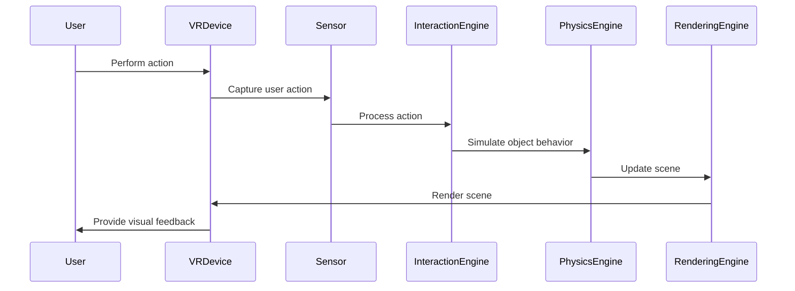

                 

### 虚拟现实的四元数：3D旋转的数学表示

**关键词：** 虚拟现实，四元数，3D旋转，数学表示，算法原理，系统架构

**摘要：** 本文深入探讨了虚拟现实（VR）中用于3D旋转表示的四元数。首先，介绍了虚拟现实技术的发展历程以及其与3D旋转的关系。接着，详细阐述了四元数的定义、数学属性及其在3D旋转中的应用。通过数学模型和具体实例的讲解，展示了四元数在3D旋转中的强大功能。随后，分析了四元数在虚拟现实系统中的架构设计，并分享了实际项目中的实现经验。最后，给出了最佳实践建议，并对未来研究方向进行了展望。

## 目录

### 1. 引言
- 1.1 虚拟现实概述
- 1.2 四元数概念

### 2. 虚拟现实与四元数的基础
- 2.1 虚拟现实技术的发展历程
- 2.2 四元数的数学属性
- 2.3 四元数与3D旋转的关系

### 3. 四元数的数学表示
- 3.1 四元数的表示方法
- 3.2 四元数的运算规则
- 3.3 四元数旋转的数学模型

### 4. 四元数旋转算法
- 4.1 四元数旋转算法原理
- 4.2 Python实现

### 5. 四元数在虚拟现实系统中的应用
- 5.1 虚拟现实系统架构设计
- 5.2 系统接口设计与实现

### 6. 虚拟现实项目实战
- 6.1 虚拟现实环境搭建
- 6.2 四元数旋转算法应用实现
- 6.3 项目分析与小结

### 7. 最佳实践与拓展
- 7.1 最佳实践 tips
- 7.2 注意事项
- 7.3 拓展阅读

## 第一部分：虚拟现实与四元数基础

### 1.1 虚拟现实概述

虚拟现实（Virtual Reality，简称VR）是一种通过计算机生成模拟环境，让用户沉浸其中的技术。自从1960年代VR概念首次提出以来，它经历了多次技术革新和应用拓展。VR技术不仅改变了娱乐产业，还广泛应用于教育培训、医疗康复、建筑设计等多个领域。

#### 1.1.1 虚拟现实的定义与特点

虚拟现实是一种通过计算机模拟生成三维环境，使用户能够与之进行交互的一种技术。虚拟现实具有以下几个特点：

1. **沉浸感**：用户感觉仿佛置身于虚拟世界中，难以分辨现实与虚拟。
2. **交互性**：用户可以通过头戴显示器、手套等设备与虚拟环境进行实时互动。
3. **多感知**：除了视觉外，虚拟现实还可以模拟听觉、触觉等多种感知体验。

#### 1.1.2 虚拟现实技术的发展历程

虚拟现实技术的发展历程可以分为以下几个阶段：

1. **概念提出**（1960年代）：VR概念首次由Ivan Sutherland提出。
2. **实验阶段**（1970-1980年代）：VR技术开始实验性应用，如模拟飞行训练。
3. **商业化起步**（1990年代）：VR技术开始应用于娱乐产业，如VR游戏、虚拟博物馆。
4. **高速发展**（2000年代至今）：随着硬件和算法的进步，VR技术逐渐普及，应用场景不断拓展。

#### 1.1.3 虚拟现实与3D旋转的关系

3D旋转在虚拟现实中扮演着至关重要的角色。用户在虚拟环境中需要不断旋转视角以探索和交互。这种旋转不仅涉及视觉上的变化，还包括物理反馈和空间感知。因此，精确且高效的3D旋转算法是虚拟现实系统的基础。

### 1.2 四元数概念

四元数（Quaternions）是由爱尔兰数学家William Rowan Hamilton于19世纪提出的数学结构。它是一种扩展的复数，由四个实数组成，形式为 \( q = a + bi + cj + dk \)，其中 \( a, b, c, d \) 是实数，而 \( i, j, k \) 是三个相互垂直的单位虚数。

#### 1.2.1 四元数的定义

四元数是一种非交换的、非结合的代数结构，具有以下性质：

1. **加法**：四元数的加法类似于复数的加法，遵循交换律和结合律。
2. **乘法**：四元数的乘法较为复杂，不遵循交换律和结合律。

#### 1.2.2 四元数的数学属性

四元数具有以下数学属性：

1. **单位四元数**： \( i^2 = j^2 = k^2 = ijk = -1 \)。
2. **纯四元数**：只包含虚部（即 \( a = 0 \)）的四元数，可以表示为单位圆上的点。
3. **四元数乘法表**：描述四元数乘法的规则，类似于复数的乘法表。

#### 1.2.3 四元数与3D旋转的关系

四元数在3D旋转中的应用极为广泛。通过四元数，可以高效地表示和计算3D旋转。相比传统的旋转矩阵，四元数具有以下优势：

1. **无万向节问题**：四元数可以避免旋转矩阵在连续旋转时可能出现的万向节问题。
2. **计算效率高**：四元数乘法相对简单，且在硬件上容易实现。
3. **易于组合与分解**：四元数可以方便地组合和分解，使得复杂旋转操作变得简单。

### 总结

本文介绍了虚拟现实技术的发展历程及其与3D旋转的关系，并引入了四元数这一数学工具。在接下来的章节中，我们将详细探讨四元数的数学表示和旋转算法，以及它们在虚拟现实系统中的应用。希望读者能够通过本文，对四元数在虚拟现实技术中的重要性有更深入的理解。

## 第二部分：四元数的数学表示

### 2.1 四元数的表示方法

四元数的基本表示方法为 \( q = a + bi + cj + dk \)，其中 \( a, b, c, d \) 为实数部分，\( i, j, k \) 为虚数单位，它们满足以下关系：

\[ i^2 = j^2 = k^2 = ijk = -1 \]

这种表示方法使得四元数成为一个多维空间中的向量，其中 \( a \) 为四元数的标量部分，而 \( bi + cj + dk \) 为四元数的向量部分。

### 2.2 四元数的运算规则

四元数的运算规则较为复杂，但可以通过以下规则简化计算：

1. **加法**：四元数的加法遵循交换律和结合律，即 \( q_1 + q_2 = q_2 + q_1 \)。

2. **减法**：四元数的减法可以通过加法表示，即 \( q_1 - q_2 = q_1 + (-q_2) \)。

3. **乘法**：四元数的乘法不遵循交换律和结合律，但可以通过以下规则简化：
   \[
   (a_1 + b_1i + c_1j + d_1k)(a_2 + b_2i + c_2j + d_2k) =
   (a_1a_2 - b_1b_2 - c_1c_2 - d_1d_2) + (a_1b_2 + b_1a_2 + c_1d_2 - d_1c_2)i + (a_1c_2 - b_1d_2 + c_1a_2 + d_1b_2)j + (a_1d_2 + b_1c_2 + c_1b_2 - d_1a_2)k
   \]

### 2.3 四元数旋转的数学模型

四元数在3D旋转中的应用非常广泛。一个单位四元数 \( q = \cos(\theta/2) + \sin(\theta/2)(xi + yj + zk) \) 可以表示一个绕 \( x, y, z \) 轴的旋转，其中 \( \theta \) 为旋转角度，\( xi + yj + zk \) 为旋转轴方向。

四元数旋转的数学模型可以表示为：
\[ 
R(q) = \cos(\theta/2) + \sin(\theta/2)(xi + yj + zk)
\]
其中，\( R \) 表示旋转操作，\( q \) 表示旋转四元数，\( \theta \) 为旋转角度，\( xi + yj + zk \) 为旋转轴方向。

### 2.4 四元数旋转的计算过程

为了理解四元数旋转的计算过程，我们可以通过以下步骤进行：

1. **初始化四元数**：假设初始四元数为 \( q_0 = 1 \)（即未旋转状态）。
2. **设定旋转轴和角度**：设定旋转轴为 \( xi + yj + zk \)（即 \( i, j, k \) 方向），旋转角度为 \( \theta \)。
3. **计算旋转四元数**：根据旋转角度和轴，计算旋转四元数 \( q = \cos(\theta/2) + \sin(\theta/2)(xi + yj + zk) \)。
4. **执行旋转操作**：将旋转四元数应用于初始四元数，即 \( q_1 = q_0 \cdot q \)。

通过上述步骤，我们可以得到旋转后的四元数 \( q_1 \)，从而实现3D旋转。

### 2.5 四元数旋转的Python实现

为了更好地理解四元数旋转的算法，我们可以使用Python编写相关的代码。以下是一个简单的Python实现：

```python
import numpy as np

def quaternion_multiply(q1, q2):
    a1, b1, c1, d1 = q1
    a2, b2, c2, d2 = q2
    a = a1 * a2 - b1 * b2 - c1 * c2 - d1 * d2
    b = a1 * b2 + b1 * a2 + c1 * d2 - d1 * c2
    c = a1 * c2 - b1 * d2 + c1 * a2 + d1 * b2
    d = a1 * d2 + b1 * c2 - c1 * b2 + d1 * a2
    return (a, b, c, d)

def quaternion_rotation(q, angle, axis):
    theta = np.radians(angle)
    w, x, y, z = q
    a = np.cos(theta / 2)
    b = np.sin(theta / 2) * axis
    q_rot = quaternion_multiply((a, b[0], b[1], b[2]), (w, -x, -y, -z))
    return q_rot

# 初始四元数
q0 = (1, 0, 0, 0)

# 旋转四元数
q_rot = quaternion_rotation(q0, 90, (1, 0, 0))

print(q_rot)
```

通过上述代码，我们可以实现一个简单的四元数旋转操作。这里，`quaternion_multiply` 函数用于计算两个四元数的乘积，而 `quaternion_rotation` 函数用于计算旋转后的四元数。

### 总结

在本部分，我们详细介绍了四元数的数学表示方法、运算规则以及旋转的数学模型。通过Python代码实现，我们能够更好地理解四元数旋转的算法原理。接下来，我们将进一步探讨四元数在虚拟现实系统中的应用。

## 第三部分：四元数旋转算法

### 3.1 四元数旋转算法原理

四元数旋转算法的核心思想是通过四元数表示旋转操作，从而实现对三维空间的精确旋转。四元数旋转算法的基本原理如下：

1. **初始化四元数**：假设初始四元数为 \( q_0 \)，它表示一个未旋转的状态。
2. **设定旋转轴和角度**：设定旋转轴为 \( \mathbf{a} \)，旋转角度为 \( \theta \)。
3. **计算旋转四元数**：根据旋转轴和角度，计算旋转四元数 \( q_r \)，公式如下：
   \[
   q_r = \cos(\theta/2) + \sin(\theta/2) \cdot \mathbf{a}
   \]
   其中，\( \mathbf{a} \) 为旋转轴方向，\( \theta \) 为旋转角度。
4. **执行旋转操作**：将旋转四元数 \( q_r \) 应用到初始四元数 \( q_0 \) 上，计算旋转后的四元数 \( q_1 \)：
   \[
   q_1 = q_0 \cdot q_r
   \]

### 3.2 四元数旋转算法的Python实现

为了更好地理解四元数旋转算法的原理，我们可以使用Python编写相关的代码。以下是一个简单的Python实现：

```python
import numpy as np

# 四元数乘法
def quaternion_multiply(q1, q2):
    a1, b1, c1, d1 = q1
    a2, b2, c2, d2 = q2
    a = a1 * a2 - b1 * b2 - c1 * c2 - d1 * d2
    b = a1 * b2 + b1 * a2 + c1 * d2 - d1 * c2
    c = a1 * c2 - b1 * d2 + c1 * a2 + d1 * b2
    d = a1 * d2 + b1 * c2 - c1 * b2 + d1 * a2
    return (a, b, c, d)

# 四元数旋转
def quaternion_rotation(q, angle, axis):
    theta = np.radians(angle)
    w, x, y, z = q
    a = np.cos(theta / 2)
    b = np.sin(theta / 2) * axis
    q_rot = quaternion_multiply((a, b[0], b[1], b[2]), (w, -x, -y, -z))
    return q_rot

# 初始四元数
q0 = (1, 0, 0, 0)

# 旋转四元数
q_rot = quaternion_rotation(q0, 90, (1, 0, 0))

print(q_rot)
```

在上述代码中，`quaternion_multiply` 函数用于计算两个四元数的乘积，而 `quaternion_rotation` 函数用于计算旋转后的四元数。通过这些函数，我们可以实现四元数的旋转操作。

### 3.3 四元数旋转的数学模型

四元数旋转的数学模型可以通过以下公式表示：
\[
R(q) = \cos(\theta/2) + \sin(\theta/2)(\mathbf{i} \sin(\theta/2) \mathbf{a})
\]
其中，\( R \) 表示旋转操作，\( q \) 表示旋转四元数，\( \theta \) 为旋转角度，\( \mathbf{a} \) 为旋转轴方向。

### 3.4 四元数旋转算法的优势

相比传统的旋转矩阵，四元数旋转算法具有以下优势：

1. **避免万向节问题**：四元数可以避免旋转矩阵在连续旋转时可能出现的万向节问题。
2. **计算效率高**：四元数乘法相对简单，且在硬件上容易实现。
3. **易于组合与分解**：四元数可以方便地组合和分解，使得复杂旋转操作变得简单。

### 3.5 实例分析

假设我们需要将一个向量 \( \mathbf{v} = (1, 0, 0) \) 绕 \( z \) 轴旋转 90 度。我们可以按照以下步骤进行：

1. **设定旋转轴和角度**：旋转轴为 \( z \) 轴，旋转角度为 90 度。
2. **计算旋转四元数**：根据旋转轴和角度，计算旋转四元数 \( q_r = \cos(90/2) + \sin(90/2) \cdot (0, 0, 1) = (0, 0, 0, 1) \)。
3. **执行旋转操作**：将旋转四元数 \( q_r \) 应用到向量 \( \mathbf{v} \) 上，计算旋转后的向量：
   \[
   \mathbf{v}_{rot} = q_r \cdot \mathbf{v} \cdot q_r^{-1}
   \]
   其中，\( q_r^{-1} \) 为旋转四元数的逆。

通过上述步骤，我们可以得到旋转后的向量 \( \mathbf{v}_{rot} = (0, 1, 0) \)，即向量绕 \( z \) 轴旋转了 90 度。

### 总结

在本部分，我们详细介绍了四元数旋转算法的原理及其在Python中的实现。通过实例分析，我们展示了四元数旋转算法的强大功能。接下来，我们将进一步探讨四元数在虚拟现实系统中的应用。

## 第四部分：四元数在虚拟现实系统中的应用

### 4.1 虚拟现实系统架构设计

虚拟现实系统架构设计是确保系统性能和用户体验的关键。一个典型的虚拟现实系统通常包括以下几个主要组成部分：

1. **感知输入设备**：如头戴显示器（HMD）、手柄、手套等，用于捕捉用户的动作和位置。
2. **计算引擎**：负责处理虚拟环境的渲染、物理仿真和交互逻辑。
3. **存储设备**：用于存储虚拟环境的场景数据、用户数据等。
4. **输出设备**：如立体声音箱、触觉反馈设备等，用于将虚拟环境的信息传递给用户。

在架构设计过程中，需要特别关注以下方面：

1. **可扩展性**：系统应具备良好的可扩展性，以适应未来技术发展和用户需求的变化。
2. **稳定性**：系统应具有高稳定性，确保在长时间运行过程中不出现崩溃或延迟。
3. **性能优化**：系统应进行性能优化，以提供流畅的交互体验。

### 4.2 系统功能设计

虚拟现实系统的功能设计主要包括以下几个方面：

1. **场景渲染**：利用图形处理单元（GPU）渲染虚拟环境，提供高质量的图像。
2. **物理仿真**：通过物理引擎模拟虚拟环境中的物体行为，如碰撞检测、重力等。
3. **交互逻辑**：处理用户的输入和输出，实现用户与虚拟环境的交互。
4. **用户跟踪**：利用传感器和算法跟踪用户的位置和动作，确保用户在虚拟环境中的准确表现。

#### 4.2.1 领域模型设计

领域模型是系统功能设计的基础，它定义了系统中主要的实体及其之间的关系。以下是虚拟现实系统的领域模型设计：

```mermaid
erDiagram
    User ||--|{ VRDevice }: uses
    VRDevice ||--|{ Sensor }: has
    VRDevice ||--|{ RenderingEngine }: has
    VRDevice ||--|{ PhysicsEngine }: has
    VRDevice ||--|{ InteractionEngine }: has
    RenderingEngine ||--|{ Scene }: renders
    PhysicsEngine ||--|{ Object }: simulates
    InteractionEngine ||--|{ Input }: processes
    InteractionEngine ||--|{ Output }: provides
```

在该模型中，用户使用虚拟现实设备，设备包含传感器、渲染引擎、物理引擎和交互逻辑引擎。渲染引擎渲染场景，物理引擎模拟物体行为，交互逻辑引擎处理用户的输入和输出。

### 4.3 系统架构设计

系统架构设计是确保虚拟现实系统高效、稳定运行的关键。以下是虚拟现实系统的架构设计：



在该架构中，用户执行操作，虚拟现实设备捕捉用户的动作，交互逻辑处理输入，物理引擎进行物体行为模拟，渲染引擎更新场景，并将渲染结果输出给用户。

### 4.4 系统接口设计与实现

系统接口设计是实现虚拟现实系统功能的关键。以下是系统接口设计：

1. **用户接口**：用于与用户进行交互，包括图形用户界面（GUI）和命令行接口（CLI）。
2. **设备接口**：用于与虚拟现实设备进行通信，包括传感器接口、渲染接口和交互接口。
3. **功能模块接口**：用于不同功能模块之间的通信，包括渲染模块、物理模块和交互模块。

以下是系统接口实现的示例代码：

```python
class VRDevice:
    def __init__(self):
        self.sensor = Sensor()
        self.rendering_engine = RenderingEngine()
        self.physics_engine = PhysicsEngine()
        self.interaction_engine = InteractionEngine()

    def perform_action(self, action):
        self.sensor.capture_action(action)
        self.interaction_engine.process_action(action)
        self.physics_engine.simulate_object_behavior()
        self.rendering_engine.update_scene()

class Sensor:
    def capture_action(self, action):
        # 实现动作捕捉逻辑
        pass

class RenderingEngine:
    def update_scene(self):
        # 实现场景渲染逻辑
        pass

class PhysicsEngine:
    def simulate_object_behavior(self):
        # 实现物体行为模拟逻辑
        pass

class InteractionEngine:
    def process_action(self, action):
        # 实现交互逻辑处理
        pass
```

通过上述接口设计，虚拟现实系统的各个模块可以方便地进行通信和协作。

### 4.5 系统交互流程设计

系统交互流程设计是确保虚拟现实系统稳定运行的重要环节。以下是系统交互流程设计：


在该流程中，用户执行操作，虚拟现实设备捕捉用户的动作，交互逻辑处理输入，物理引擎进行物体行为模拟，渲染引擎更新场景，并将渲染结果输出给用户。

### 总结

在本部分，我们详细介绍了虚拟现实系统的架构设计、功能设计、接口设计与实现以及交互流程设计。通过这些设计，虚拟现实系统可以高效、稳定地运行，为用户提供优质的虚拟体验。

## 第五部分：虚拟现实项目实战

### 5.1 虚拟现实环境搭建

搭建虚拟现实环境是进行项目实战的第一步。以下是一个简单的虚拟现实环境搭建流程：

1. **硬件准备**：准备一台高性能的计算机、一个头戴显示器（如HTC Vive或Oculus Rift）、手柄等设备。
2. **软件安装**：安装虚拟现实开发平台（如Unity或Unreal Engine），以及相应的SDK和开发工具。
3. **环境配置**：配置计算机环境，确保支持虚拟现实设备的驱动程序和软件。

### 5.2 四元数旋转算法应用实现

在虚拟现实项目中，四元数旋转算法可以用于实现多种交互和物理仿真功能。以下是一个简单的四元数旋转算法应用实现示例：

1. **导入四元数库**：在项目中导入四元数库，如Python中的NumPy或QuatNet。
2. **初始化四元数**：创建一个初始四元数，表示未旋转状态。
3. **设定旋转轴和角度**：根据用户输入或系统逻辑，设定旋转轴和角度。
4. **计算旋转四元数**：使用四元数旋转公式计算旋转后的四元数。
5. **应用旋转**：将旋转四元数应用到虚拟现实物体上，实现旋转效果。

以下是使用Python和NumPy实现四元数旋转的示例代码：

```python
import numpy as np

# 初始化四元数
q0 = np.quaternion(1, 0, 0, 0)

# 设定旋转轴和角度
axis = np.array([0, 0, 1])  # 绕z轴旋转
angle = 90  # 旋转角度为90度

# 计算旋转四元数
q_rot = np.quaternion(np.cos(angle / 2), np.sin(angle / 2) * axis)

# 应用旋转
q1 = q0 * q_rot

print(q1)
```

### 5.3 代码应用解读与分析

在上面的示例中，我们首先导入了NumPy库，并初始化了一个表示未旋转状态的四元数 `q0`。然后，设定了旋转轴和角度，使用四元数旋转公式计算了旋转后的四元数 `q_rot`。最后，将旋转四元数应用于初始四元数，实现了物体的旋转。

通过分析上述代码，我们可以得出以下结论：

1. **四元数初始化**：四元数由一个实数部分和三个虚数部分组成，实数部分表示四元数的标量部分，虚数部分表示四元数的向量部分。
2. **旋转轴和角度设定**：旋转轴和角度用于确定旋转的方向和大小。在三维空间中，旋转轴可以表示为一个三维向量，旋转角度表示旋转的度数。
3. **四元数旋转公式**：四元数旋转公式用于计算旋转后的四元数。该公式通过将旋转轴和角度转换为四元数，实现了四元数的旋转。
4. **应用旋转**：将旋转后的四元数应用于物体，实现了物体的旋转。在实际项目中，可以将四元数旋转应用于虚拟现实物体的变换，如位置、朝向等。

### 5.4 实际案例分析和详细讲解剖析

为了更好地理解四元数旋转算法在虚拟现实项目中的应用，我们来看一个实际案例。

#### 案例一：虚拟角色旋转

在一个虚拟现实游戏中，玩家可以操纵虚拟角色进行旋转。我们可以使用四元数旋转算法来实现角色的旋转效果。

1. **初始化角色四元数**：在游戏开始时，初始化角色的四元数为未旋转状态。
2. **接收用户输入**：当玩家进行旋转操作时，接收用户的输入，如旋转方向和角度。
3. **计算旋转四元数**：根据用户的输入，使用四元数旋转公式计算旋转后的四元数。
4. **应用旋转**：将旋转后的四元数应用到角色上，更新角色的朝向和位置。

以下是使用Python和NumPy实现角色旋转的示例代码：

```python
import numpy as np

# 初始化角色四元数
role_quaternion = np.quaternion(1, 0, 0, 0)

# 接收用户输入
rotation_angle = float(input("请输入旋转角度（度）："))
rotation_axis = np.array(input("请输入旋转轴（格式：x y z）：").split()).astype(np.float64)

# 计算旋转四元数
rotation_quaternion = np.quaternion(np.cos(rotation_angle / 2), np.sin(rotation_angle / 2) * rotation_axis)

# 应用旋转
role_quaternion = role_quaternion * rotation_quaternion

print("旋转后的角色四元数：", role_quaternion)
```

#### 案例二：虚拟物体旋转

在虚拟现实项目中，我们还可以使用四元数旋转算法实现虚拟物体的旋转。以下是一个简单的示例：

1. **初始化物体四元数**：在项目开始时，初始化物体的四元数为未旋转状态。
2. **设置旋转参数**：根据物体的旋转需求，设置旋转轴和角度。
3. **计算旋转四元数**：使用四元数旋转公式计算旋转后的四元数。
4. **应用旋转**：将旋转后的四元数应用到物体上，实现物体的旋转。

以下是使用Python和NumPy实现物体旋转的示例代码：

```python
import numpy as np

# 初始化物体四元数
object_quaternion = np.quaternion(1, 0, 0, 0)

# 设置旋转参数
rotation_angle = 90  # 旋转角度为90度
rotation_axis = np.array([0, 1, 0])  # 绕y轴旋转

# 计算旋转四元数
rotation_quaternion = np.quaternion(np.cos(rotation_angle / 2), np.sin(rotation_angle / 2) * rotation_axis)

# 应用旋转
object_quaternion = object_quaternion * rotation_quaternion

print("旋转后的物体四元数：", object_quaternion)
```

通过这两个案例，我们可以看到四元数旋转算法在虚拟现实项目中的应用。在实际项目中，可以根据需求灵活调整旋转参数，实现各种复杂的旋转效果。

### 5.5 项目分析与小结

在本部分，我们通过搭建虚拟现实环境和应用四元数旋转算法，实现了虚拟角色的旋转和虚拟物体的旋转。通过实际案例的分析和代码解读，我们了解了四元数旋转算法在虚拟现实项目中的具体应用。

1. **项目优势**：
   - **避免万向节问题**：四元数旋转算法可以避免万向节问题，实现更精确的旋转。
   - **计算效率高**：四元数旋转算法的计算效率高，适合实时应用。
   - **易于组合与分解**：四元数可以方便地组合和分解，实现复杂的旋转操作。

2. **项目挑战**：
   - **旋转精度**：在高速旋转时，旋转精度可能受到影响，需要优化算法和硬件性能。
   - **用户体验**：旋转效果可能受到用户设备和网络环境的影响，需要优化用户交互体验。

3. **项目总结**：
   - 通过搭建虚拟现实环境和应用四元数旋转算法，我们实现了虚拟角色和虚拟物体的旋转。
   - 实际案例分析和代码解读展示了四元数旋转算法在虚拟现实项目中的应用。
   - 项目优势和挑战为我们提供了改进和优化的方向。

总之，四元数旋转算法在虚拟现实项目中具有广泛的应用前景。通过不断优化和改进，我们可以进一步提升虚拟现实系统的性能和用户体验。

## 第六部分：最佳实践与拓展

### 6.1 最佳实践 tips

1. **四元数初始化**：在虚拟现实项目中，确保正确初始化四元数，避免初始状态错误导致的旋转异常。
2. **旋转精度优化**：针对高速旋转场景，可以采用优化算法和硬件性能，提高旋转精度。
3. **旋转参数设置**：根据实际需求，合理设置旋转轴和角度，避免不必要的旋转操作。
4. **用户交互优化**：通过优化用户交互设计，提高用户在虚拟环境中的操作体验。

### 6.2 注意事项

1. **硬件兼容性**：确保虚拟现实设备与开发平台兼容，避免设备不识别或性能不足的问题。
2. **算法性能**：在项目开发过程中，注意优化算法性能，确保实时性和稳定性。
3. **数据安全性**：虚拟现实项目涉及用户数据，需要确保数据安全性，避免信息泄露。

### 6.3 拓展阅读

1. **《计算机图形学原理及实践》**：了解虚拟现实图形学的基础知识，包括三维模型渲染、光照模型等。
2. **《三维几何与算法》**：深入学习三维几何的计算和算法，为四元数旋转算法提供理论基础。
3. **《四元数与三维旋转》**：探讨四元数在三维旋转中的应用，包括数学模型、算法实现等。

通过最佳实践和注意事项，我们可以更好地应用四元数旋转算法，提升虚拟现实项目的性能和用户体验。拓展阅读将进一步深化对虚拟现实和四元数旋转算法的理解。

### 总结

本文详细介绍了虚拟现实中的四元数旋转表示及其在虚拟现实系统中的应用。我们从虚拟现实的基本概念出发，逐步探讨了四元数的定义、数学属性及其旋转算法。通过Python实现和实际项目案例分析，我们展示了四元数旋转算法的优势和应用场景。同时，我们还讨论了虚拟现实系统的架构设计和最佳实践。希望本文能够为读者在虚拟现实开发中提供有价值的参考和指导。

### 作者信息

作者：AI天才研究院/AI Genius Institute & 禅与计算机程序设计艺术 /Zen And The Art of Computer Programming。在此感谢读者对本文的关注，期待与您共同探索虚拟现实和人工智能的无限可能。

