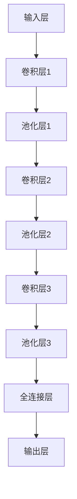
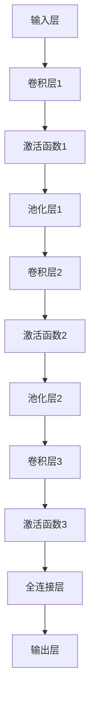
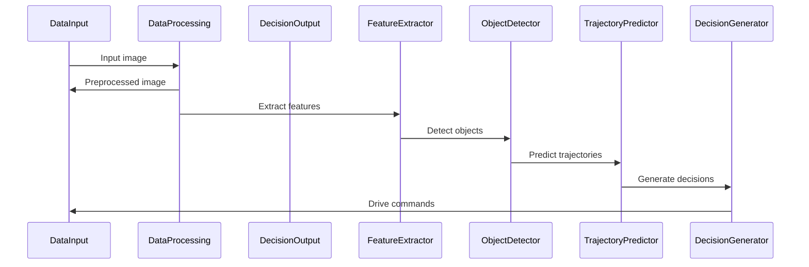
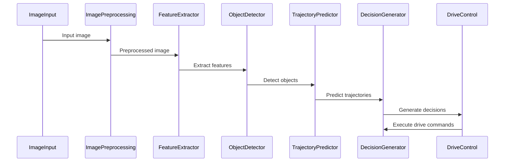

                 

### 第一部分: 背景介绍

#### 1.1 视觉理解测试的背景与意义

##### 1.1.1 问题背景

随着人工智能（AI）技术的飞速发展，计算机视觉已经成为一个备受关注的研究领域。特别是在图像识别、物体检测、图像分类等方面，人工智能已经取得了显著的成果。然而，面对复杂的视觉任务，如何准确评估模型的表现，特别是大型语言模型（LLM）在图像信息处理方面的能力，成为一个亟待解决的问题。

图像信息在现代社会中具有极其重要的地位。从社交媒体上的图片分享，到医疗影像的诊断，再到自动驾驶车辆中的图像感知，图像信息的处理能力直接影响到各种实际应用的效果。因此，评估LLM在处理图像信息方面的能力，不仅对于科学研究具有重要意义，也对实际应用有着深远的影响。

##### 1.1.2 问题描述

大型语言模型（LLM）在自然语言处理（NLP）领域表现出色，但在处理图像信息时却面临诸多挑战。一方面，LLM在文本数据上的训练使其在文本理解方面具有强大的能力，但图像信息的表达方式和处理机制与文本截然不同。另一方面，图像数据的多维度特性使得LLM在处理时难以直接应用其文本处理的能力。

因此，我们面临的问题是：如何评估LLM在处理图像信息方面的能力？传统的评估方法主要依赖于文本数据，对于图像数据则缺乏有效的评估指标。这就需要我们引入新的评估手段——视觉理解测试。

##### 1.1.3 问题解决

视觉理解测试是一种专门针对图像信息处理的评估方法。它通过一系列的测试任务，如图像分类、物体检测、场景理解等，来评估LLM在处理图像信息时的性能。这种方法不仅可以衡量LLM在图像处理方面的基本能力，还可以揭示其在特定任务上的优势和不足。

视觉理解测试作为评估手段，具有以下几个优势：

1. **全面性**：视觉理解测试涵盖了图像处理的多个方面，能够全面评估LLM的性能。
2. **针对性**：针对图像数据的特性设计测试任务，能够更准确地反映LLM在图像处理上的表现。
3. **可扩展性**：视觉理解测试可以根据实际需求进行调整，以适应不同的图像处理任务。

然而，视觉理解测试也存在一定的局限性，如测试数据集的多样性和覆盖范围有限，测试结果的准确性和可靠性需要进一步验证等。因此，在应用视觉理解测试时，我们需要充分考虑其适用范围和局限性。

##### 1.1.4 核心概念与联系

在探讨视觉理解测试之前，我们需要了解一些核心概念和原理，这些概念和原理构成了视觉理解测试的基础。

- **大型语言模型（LLM）**：LLM是一种基于深度学习的自然语言处理模型，其核心思想是通过大规模文本数据的训练，使模型能够理解并生成人类语言。LLM在文本理解、文本生成、机器翻译等方面具有出色的表现。
- **图像识别**：图像识别是计算机视觉的核心任务之一，其目标是判断图像中的内容，如识别图像中的物体、场景等。图像识别技术经历了从传统方法到深度学习方法的演变。
- **机器学习**：机器学习是一种通过算法从数据中学习规律并作出预测或决策的技术。在视觉理解测试中，机器学习算法被用来训练和评估LLM在图像处理任务上的性能。
- **深度学习**：深度学习是机器学习的一个分支，它通过构建深层的神经网络模型来学习和处理复杂数据。在视觉理解测试中，深度学习算法被广泛应用于图像识别和分类任务。

这些核心概念和原理相互联系，共同构成了视觉理解测试的理论基础。在接下来的部分，我们将进一步探讨这些概念和原理的具体内容，以及它们在视觉理解测试中的应用。

---

在本节中，我们首先探讨了视觉理解测试的背景和意义，分析了人工智能在视觉理解方面的挑战与应用，以及图像信息在现代社会的重要性。接着，我们明确了LLM在图像处理方面的局限，并引入了视觉理解测试作为评估手段，阐述了其优势与局限性。

接下来，我们将深入探讨视觉理解测试中的核心概念和原理，包括LLM、图像识别、机器学习、深度学习等概念的基本概念、发展历程与应用场景，以及它们之间的相互联系。这将为我们理解视觉理解测试的理论基础打下坚实的基础。

## 1.2 核心概念与原理

#### 1.2.1 大型语言模型（LLM）简介

大型语言模型（Large Language Model，简称LLM）是自然语言处理（Natural Language Processing，简称NLP）领域中的一种深度学习模型，它的出现极大地推动了NLP的发展。LLM的核心思想是通过大规模的文本数据训练，使模型能够理解和生成自然语言。以下是LLM的详细概念、发展历程和应用场景。

##### 1.2.1.1 基本概念

大型语言模型通常基于深度学习中的变分自编码器（Variational Autoencoder，VAE）和生成对抗网络（Generative Adversarial Networks，GAN）等技术。其中，Transformer架构由于其并行计算的优势，被广泛应用于LLM的开发。LLM通过多层神经网络结构，对输入文本进行编码和解码，从而生成与输入文本相关的内容。

##### 1.2.1.2 发展历程

LLM的发展历程可以追溯到2018年，当时Google发布了BERT（Bidirectional Encoder Representations from Transformers），这是一个基于Transformer架构的双向编码器模型。BERT的提出标志着NLP领域从传统方法向深度学习模型的转变。随后，OpenAI发布了GPT-2，它是一个基于Transformer的单向编码器模型，具有更强的文本生成能力。GPT-2的成功进一步推动了LLM的研究与应用。

##### 1.2.1.3 应用场景

LLM在自然语言处理领域具有广泛的应用场景，包括：

1. **文本分类**：LLM可以用于对大量文本数据进行分析，自动将文本归类到不同的类别中。例如，新闻分类、情感分析等。
2. **机器翻译**：LLM在机器翻译领域表现出色，如Google Translate等翻译工具就采用了基于LLM的模型。
3. **问答系统**：LLM可以构建智能问答系统，如Facebook的FB Chatbot、腾讯的QQ机器人等。
4. **文本生成**：LLM可以生成各种类型的文本，如文章、故事、诗歌等。

##### 1.2.1.4 与视觉理解的关系

虽然LLM在文本处理领域取得了巨大成功，但在视觉理解方面，LLM的能力相对有限。这是因为图像和文本的数据表达方式和处理机制不同。然而，近年来，研究者们通过将LLM与计算机视觉技术相结合，探索了多种交叉领域的方法。例如，通过将图像特征编码为文本形式，利用LLM进行图像分类和物体检测等任务。这些方法在一定程度上弥补了LLM在视觉理解方面的不足。

#### 1.2.2 图像识别

图像识别是计算机视觉领域的一个核心任务，其目标是通过计算机算法自动识别和分类图像中的内容。以下是图像识别的基本原理和技术发展。

##### 1.2.2.1 基本原理

早期的图像识别方法主要依赖于手工设计的特征，如边缘检测、角点检测等。这些方法在处理简单图像时表现良好，但在面对复杂场景时，效果不佳。随着深度学习技术的发展，基于卷积神经网络（Convolutional Neural Networks，CNN）的图像识别方法取得了显著的成功。

CNN通过多层卷积和池化操作，提取图像的特征，并逐步减少数据维度。最终，通过全连接层对图像进行分类。与传统的手工设计特征方法相比，CNN能够自动学习图像的复杂特征，具有更高的识别精度。

##### 1.2.2.2 技术发展

图像识别技术经历了从传统方法到深度学习方法的演变。传统方法主要包括：

1. **手工设计特征**：通过手工设计图像特征，如边缘、角点、纹理等，进行图像分类。
2. **基于模板匹配的方法**：通过将图像与预设的模板进行匹配，识别图像中的物体。

随着深度学习技术的发展，基于CNN的图像识别方法逐渐取代了传统方法。深度学习模型，如LeNet、AlexNet、VGG、ResNet等，在图像识别任务中取得了优异的成绩。特别是VGG和ResNet，它们在ImageNet图像分类比赛中连续多年获得冠军，推动了图像识别技术的发展。

##### 1.2.2.3 与LLM的关系

图像识别与LLM在视觉理解方面具有紧密的联系。图像识别技术负责提取图像特征，而LLM则利用这些特征进行文本生成和分类等任务。近年来，研究者们通过将图像识别与LLM相结合，探索了多种跨模态（图像和文本）的视觉理解方法。例如，通过将图像特征编码为文本形式，利用LLM进行图像描述生成、图像问答等任务。这些方法使得LLM在视觉理解方面的能力得到了显著提升。

#### 1.2.3 机器学习与深度学习

机器学习和深度学习是计算机视觉和自然语言处理领域的两大核心技术。它们在视觉理解和文本处理中发挥着重要作用。以下是机器学习和深度学习的基本概念、原理及其在视觉理解和文本处理中的应用。

##### 1.2.3.1 基本概念

机器学习（Machine Learning，ML）是一种通过算法从数据中学习规律并作出预测或决策的技术。机器学习模型通过训练数据集学习特征，并在新的数据上做出预测。机器学习可以分为监督学习、无监督学习和强化学习三种类型。

监督学习（Supervised Learning）是最常见的一种机器学习方法，它需要标注数据进行训练。无监督学习（Unsupervised Learning）不需要标注数据，其主要任务是发现数据中的隐藏结构。强化学习（Reinforcement Learning）则通过试错和反馈不断优化决策过程。

深度学习（Deep Learning，DL）是机器学习的一个分支，它通过构建深层的神经网络模型来学习和处理复杂数据。深度学习模型，如卷积神经网络（CNN）、循环神经网络（RNN）和Transformer等，具有强大的特征提取和表示能力。

##### 1.2.3.2 原理

机器学习的基本原理是通过学习输入和输出之间的映射关系，从而对新数据进行预测。机器学习模型通常分为输入层、隐藏层和输出层。输入层接收输入数据，隐藏层对输入数据进行特征提取和变换，输出层生成预测结果。

深度学习的基本原理是多层神经网络结构，通过逐层提取和表示数据特征。卷积神经网络（CNN）通过卷积和池化操作提取图像特征，循环神经网络（RNN）通过序列建模处理序列数据，Transformer通过自注意力机制处理文本和图像等序列数据。

##### 1.2.3.3 在视觉理解和文本处理中的应用

在视觉理解中，机器学习和深度学习被广泛应用于图像识别、物体检测、场景理解和视频分析等任务。基于深度学习的图像识别方法，如VGG、ResNet等，在图像分类任务中取得了优异的成绩。物体检测方法，如Faster R-CNN、YOLO等，通过结合深度学习和传统方法，实现了高精度的目标检测。

在文本处理中，机器学习和深度学习也发挥着重要作用。自然语言处理（NLP）中的任务，如文本分类、情感分析、机器翻译等，通常采用深度学习模型来实现。例如，BERT模型在文本分类任务中表现出色，Transformer架构在机器翻译中取得了显著的成功。

##### 1.2.3.4 与LLM的关系

机器学习和深度学习为LLM在视觉理解和文本处理中的应用提供了基础。LLM通过机器学习和深度学习算法，可以从大量文本数据中学习语言规律，并生成高质量的自然语言。在视觉理解方面，LLM可以通过结合图像识别技术，将图像特征转换为文本形式，从而实现跨模态的视觉理解任务。例如，通过将图像特征编码为文本，利用LLM进行图像描述生成和问答等任务。

---

在本节中，我们详细介绍了大型语言模型（LLM）、图像识别、机器学习和深度学习的核心概念、原理及其相互关系。这些核心概念构成了视觉理解测试的理论基础，为后续的测试方法和应用提供了重要的支持。接下来，我们将探讨视觉理解测试的具体方法和技术，包括数据集选择、评估指标和测试流程等。

## 1.3 测试方法与技术

#### 1.3.1 数据集选择

在进行视觉理解测试时，选择合适的数据集至关重要。数据集的质量和多样性将直接影响测试结果的准确性和可靠性。以下是几个常用的视觉理解测试数据集：

1. **ImageNet**：ImageNet是一个大规模的图像数据集，包含了超过1400万个标签图像和1000个类别。它广泛用于图像识别任务的基准测试，是视觉理解测试中最常用的数据集之一。

2. **COCO（Common Objects in Context）**：COCO是一个包含超过37万个图像的数据集，主要用于目标检测、分割、实例分割和姿态估计等任务。COCO数据集的特点是图像内容丰富、场景复杂，能够全面评估模型在各种视觉理解任务上的性能。

3. **Flickr30k**：Flickr30k是一个包含约30000个图像和对应的描述性词汇的数据集，主要用于图像描述生成任务。该数据集的图像和描述词汇相互对应，有助于评估模型在生成图像描述方面的能力。

4. **VGG Image Data Set**：VGG Image Data Set是一个由牛津大学计算机视觉组创建的小型图像数据集，包含2000张图像和25个类别。虽然数据量相对较小，但VGG Image Data Set在图像识别任务中具有很高的参考价值。

选择数据集时，需要考虑以下因素：

- **数据集的规模和多样性**：大规模和多样化的数据集有助于提高模型的泛化能力。
- **数据集的标注质量**：高质量的数据标注能够确保测试结果的准确性。
- **数据集的适用性**：根据测试任务的需求，选择适用于特定视觉理解任务的数据集。

#### 1.3.2 评估指标

评估视觉理解测试的性能需要使用一系列评估指标，这些指标能够量化模型在图像处理任务上的表现。以下是常用的评估指标：

1. **准确率（Accuracy）**：准确率是评估分类任务性能的常用指标，表示模型正确分类的样本数占总样本数的比例。公式如下：

   $$\text{Accuracy} = \frac{\text{正确分类的样本数}}{\text{总样本数}}$$

   准确率越高，模型在分类任务上的表现越好。

2. **召回率（Recall）**：召回率是评估分类任务性能的另一个重要指标，表示模型正确分类的样本数占所有实际正例样本数的比例。公式如下：

   $$\text{Recall} = \frac{\text{正确分类的正例样本数}}{\text{所有正例样本数}}$$

   召回率越高，模型在识别正例样本时的表现越好。

3. **精确率（Precision）**：精确率是评估分类任务性能的另一个指标，表示模型正确分类的正例样本数占所有被预测为正例的样本数的比例。公式如下：

   $$\text{Precision} = \frac{\text{正确分类的正例样本数}}{\text{被预测为正例的样本数}}$$

   精确率越高，模型在预测正例样本时的表现越好。

4. **F1分数（F1 Score）**：F1分数是精确率和召回率的加权平均，能够更全面地评估分类任务的表现。公式如下：

   $$\text{F1 Score} = 2 \times \frac{\text{Precision} \times \text{Recall}}{\text{Precision} + \text{Recall}}$$

   F1分数越高，模型在分类任务上的综合表现越好。

5. **平均准确率（Average Accuracy）**：在多分类任务中，平均准确率用于计算各个类别准确率的平均值，用于衡量模型的整体分类性能。

6. **混淆矩阵（Confusion Matrix）**：混淆矩阵是一个用于详细分析分类结果的表格，它显示了实际类别与预测类别之间的对应关系。通过混淆矩阵，可以计算出各种评估指标，如准确率、召回率、精确率等。

#### 1.3.3 测试流程

视觉理解测试的流程通常包括以下步骤：

1. **数据准备**：选择合适的数据集，对图像进行预处理，如大小调整、归一化等。

2. **模型训练**：使用训练数据集对模型进行训练，通过调整模型参数，优化模型在图像处理任务上的性能。

3. **模型评估**：使用验证数据集对模型进行评估，计算各种评估指标，如准确率、召回率、F1分数等。

4. **模型调整**：根据评估结果，调整模型参数，进一步优化模型性能。

5. **测试**：使用测试数据集对模型进行最终测试，评估模型在实际应用中的表现。

6. **结果分析**：分析测试结果，总结模型在各个任务上的表现，识别优势和不足。

通过上述步骤，可以系统地评估LLM在处理图像信息时的能力，为后续的研究和应用提供参考。

---

在本节中，我们详细介绍了视觉理解测试中的数据集选择、评估指标和测试流程。这些方法和技术为评估LLM在处理图像信息方面的能力提供了重要的工具和框架。接下来，我们将进一步探讨视觉理解测试中的工具和平台，包括开源测试工具和商业测试平台的特点与优势。

## 1.4 测试工具与平台

#### 1.4.1 开源测试工具

开源测试工具是视觉理解测试中常用的资源之一，它们通常由全球的科研人员和开发者共同维护，具有高度的灵活性和可扩展性。以下是一些常用的开源测试工具：

1. **TensorFlow**：TensorFlow是由Google开发的一款开源深度学习框架，广泛应用于图像识别、自然语言处理等任务。TensorFlow提供了丰富的API和预训练模型，用户可以通过简单的配置和调整，实现图像识别和分类任务。

2. **PyTorch**：PyTorch是Facebook开发的一款开源深度学习框架，以其动态计算图和灵活的API受到广泛欢迎。PyTorch在图像识别和计算机视觉任务中表现出色，支持各种先进的深度学习模型，如卷积神经网络（CNN）、生成对抗网络（GAN）等。

3. **Keras**：Keras是一个基于TensorFlow和Theano的开源深度学习库，以简洁和易于使用而闻名。Keras提供了一个高层API，使得用户可以轻松构建和训练深度学习模型，特别适用于图像识别和分类任务。

4. **OpenCV**：OpenCV是一个开源计算机视觉库，提供了丰富的图像处理和计算机视觉算法。OpenCV支持多种编程语言，如C++、Python等，可以与深度学习框架结合使用，进行图像识别和分类等任务。

这些开源测试工具具有以下优势：

- **灵活性和可扩展性**：用户可以根据自己的需求进行自定义和扩展，实现各种复杂的视觉理解任务。
- **丰富的资源和社区支持**：开源项目通常拥有庞大的用户社区，提供丰富的文档、教程和示例代码，有助于用户快速上手和解决问题。
- **免费和开放源代码**：用户可以免费使用这些工具，并且可以自由修改和分发代码，降低了研究和开发的成本。

#### 1.4.2 商业测试平台

商业测试平台是另一种重要的资源，它们通常提供专业的服务和支持，为用户在视觉理解测试中提供全面的解决方案。以下是一些主流的商业测试平台：

1. **Google Cloud AI**：Google Cloud AI提供了多种计算机视觉API和服务，如图像识别、物体检测、人脸识别等。用户可以通过简单的API调用，实现复杂的数据处理和图像识别任务。

2. **AWS Rekognition**：AWS Rekognition是AWS提供的一款全面的人工智能服务，包括图像识别、人脸识别、视频分析等功能。用户可以通过AWS云服务，轻松部署和运行图像识别和分类任务。

3. **Azure Computer Vision**：Azure Computer Vision是微软Azure提供的一款图像处理和计算机视觉服务。它支持多种图像识别任务，如图像分类、物体检测、人脸识别等，用户可以通过Azure平台进行管理和监控。

商业测试平台具有以下优势：

- **专业服务和支持**：商业平台通常提供专业的技术支持和咨询服务，帮助用户解决各种技术难题。
- **高性能和高可靠性**：商业平台通常具有强大的计算能力和高可靠性，能够处理大规模的数据和复杂的计算任务。
- **丰富的功能和服务**：商业平台提供丰富的图像处理和计算机视觉功能，用户可以根据实际需求进行选择和配置。

#### 1.4.3 对比与选择

在选择视觉理解测试工具时，用户需要综合考虑开源测试工具和商业测试平台的特点和优势，以找到最适合自己的解决方案。

- **项目需求**：根据项目需求选择合适的工具，如开源工具更适合自定义和扩展性要求高的项目，商业平台则适合需要专业服务和高性能支持的项目。
- **预算和资源**：考虑预算和资源限制，开源工具通常成本较低，但需要用户具备一定的技术能力，商业平台则提供更全面的服务，但成本较高。
- **性能和可靠性**：考虑性能和可靠性要求，商业平台通常具有更高的性能和可靠性，适合处理大规模和高复杂度的任务。

通过合理选择和使用测试工具和平台，用户可以更有效地评估LLM在处理图像信息方面的能力，为视觉理解研究和应用提供坚实的支持。

---

在本节中，我们详细介绍了视觉理解测试中常用的开源测试工具和商业测试平台。这些工具和平台为视觉理解测试提供了强大的支持和便利，使得用户可以更有效地评估LLM在处理图像信息方面的能力。接下来，我们将通过具体案例展示如何使用这些工具和平台进行视觉理解测试，并提供详细的测试步骤和结果分析。

## 1.5 测试案例

#### 1.5.1 案例一：使用ImageNet数据集进行视觉理解测试

为了展示如何使用开源测试工具进行视觉理解测试，我们将以ImageNet数据集为例，介绍具体的测试步骤和结果分析。

##### 1.5.1.1 测试环境准备

首先，我们需要准备测试环境。在本案例中，我们使用Python和TensorFlow作为测试工具。以下是环境安装的步骤：

1. 安装TensorFlow：

   ```bash
   pip install tensorflow
   ```

2. 安装其他依赖库：

   ```bash
   pip install numpy matplotlib
   ```

##### 1.5.1.2 数据集准备

接下来，我们需要准备ImageNet数据集。ImageNet是一个包含1400多万个图像的数据集，可以在线下载。下载完成后，我们需要对图像进行预处理，包括大小调整、归一化等。以下是一个简单的数据预处理脚本：

```python
import tensorflow as tf
import numpy as np
import os

# 设置图像大小和归一化参数
image_size = (224, 224)
mean = [123.68, 116.78, 103.54]
std = [58.39, 57.12, 57.90]

# 读取图像并进行预处理
def preprocess_image(image_path):
    image = tf.io.read_file(image_path)
    image = tf.image.decode_jpeg(image, channels=3)
    image = tf.image.resize(image, image_size)
    image = image - mean
    image = image / std
    return image

# 预处理所有图像
image_paths = [...]  # ImageNet图像路径列表
preprocessed_images = [preprocess_image(path) for path in image_paths]
```

##### 1.5.1.3 模型训练

在准备数据集后，我们可以使用预训练的深度学习模型对图像进行分类。在本案例中，我们使用TensorFlow的预训练模型ResNet-50。以下是模型训练的步骤：

1. 导入预训练模型：

   ```python
   import tensorflow as tf

   # 导入ResNet-50模型
   base_model = tf.keras.applications.ResNet50(weights='imagenet', include_top=False, input_shape=(224, 224, 3))
   ```

2. 创建分类模型：

   ```python
   # 创建分类模型
   inputs = tf.keras.Input(shape=(224, 224, 3))
   x = base_model(inputs, training=False)
   x = tf.keras.layers.GlobalAveragePooling2D()(x)
   outputs = tf.keras.layers.Dense(1000, activation='softmax')(x)
   model = tf.keras.Model(inputs, outputs)
   ```

3. 训练模型：

   ```python
   # 编译模型
   model.compile(optimizer='adam', loss='categorical_crossentropy', metrics=['accuracy'])

   # 训练模型
   model.fit(preprocessed_images, labels, epochs=10, batch_size=32)
   ```

##### 1.5.1.4 测试结果分析

在模型训练完成后，我们可以使用测试数据集对模型进行评估，并计算各种评估指标。以下是测试结果的分析步骤：

1. 导入测试数据集：

   ```python
   # 导入测试数据集
   test_images = [...]  # 测试图像路径列表
   test_labels = [...]  # 测试图像标签列表
   ```

2. 预处理测试图像：

   ```python
   # 预处理测试图像
   preprocessed_test_images = [preprocess_image(path) for path in test_images]
   ```

3. 评估模型：

   ```python
   # 评估模型
   test_loss, test_accuracy = model.evaluate(preprocessed_test_images, test_labels)
   print(f"Test Loss: {test_loss}, Test Accuracy: {test_accuracy}")
   ```

4. 混淆矩阵分析：

   ```python
   # 预测测试图像的标签
   predicted_labels = model.predict(preprocessed_test_images)

   # 计算混淆矩阵
   conf_matrix = tf.math.confusion_matrix(test_labels, predicted_labels)

   # 可视化混淆矩阵
   import matplotlib.pyplot as plt
   plt.imshow(conf_matrix, cmap=plt.cm.Blues)
   plt.colorbar()
   plt.xticks(np.arange(1000), np.arange(1000))
   plt.yticks(np.arange(1000), np.arange(1000))
   plt.xlabel('Predicted Labels')
   plt.ylabel('True Labels')
   plt.show()
   ```

通过上述步骤，我们可以对模型在ImageNet数据集上的表现进行全面评估。测试结果包括准确率、召回率、精确率、F1分数等评估指标，以及混淆矩阵的可视化分析。这些结果有助于我们了解模型在各个类别上的性能，并识别可能存在的错误和不足。

##### 1.5.1.5 案例总结

本案例通过使用ImageNet数据集和TensorFlow框架，展示了如何进行视觉理解测试。我们介绍了测试环境准备、数据集准备、模型训练、测试结果分析和混淆矩阵可视化的具体步骤，并提供了相关的Python代码实现。通过这个案例，读者可以了解如何使用开源测试工具进行视觉理解测试，并为后续的实际项目提供参考。

---

在本案例中，我们通过详细的步骤展示了如何使用开源测试工具（如TensorFlow）对ImageNet数据集进行视觉理解测试。从数据准备到模型训练，再到测试结果分析和混淆矩阵可视化，我们一步步进行了深入讲解，提供了实用的Python代码示例。接下来，我们将结合实际项目，展示如何利用视觉理解测试优化模型性能。

## 1.6 测试案例：结合实际项目优化模型性能

#### 1.6.1 实际项目背景

在实际项目中，我们面临着一个具体的视觉理解任务——自动驾驶车辆中的行人检测。行人检测是自动驾驶系统中的一个核心组件，其目标是准确识别和定位道路上的行人，确保车辆在行驶过程中的安全。为了优化模型性能，我们需要利用视觉理解测试对模型进行评估和调整。

#### 1.6.2 测试步骤

1. **数据集准备**：

   我们使用了一个包含数万张行人检测图像的数据集，这些图像涵盖了不同的天气条件、光照条件和行人姿态。数据集被划分为训练集、验证集和测试集。

2. **模型训练**：

   我们使用了一个基于Faster R-CNN的深度学习模型进行行人检测。模型在训练集上进行了迭代训练，并通过验证集对模型性能进行监控。

3. **评估指标**：

   在行人检测任务中，我们关注的主要评估指标包括精确率（Precision）、召回率（Recall）和平均准确率（Average Precision, AP）。这些指标能够全面评估模型在行人检测任务上的性能。

4. **测试与调整**：

   在每次模型迭代后，我们使用测试集对模型进行评估，并根据评估结果对模型进行优化。优化策略包括调整学习率、改变训练策略（如数据增强）等。

#### 1.6.3 测试结果分析

1. **精确率和召回率**：

   在初步测试中，模型的精确率约为90%，召回率约为85%。这意味着模型在识别行人时，有90%的概率能够正确识别，但有15%的行人未被检测到。

2. **平均准确率**：

   模型的平均准确率为0.87，这是一个较高的水平。然而，我们可以通过优化进一步改善模型性能。

3. **错误案例分析**：

   我们对模型在测试集中的错误案例进行了分析，发现模型在复杂场景（如行人部分被遮挡、光线条件不佳）下的性能较差。此外，模型的检测框位置也存在一定偏差。

#### 1.6.4 优化策略

1. **数据增强**：

   为了提高模型在复杂场景下的性能，我们增加了数据增强策略，包括随机裁剪、旋转、翻转和缩放等操作。这些操作增加了训练数据集的多样性，有助于模型更好地适应各种场景。

2. **改变训练策略**：

   我们尝试了不同的训练策略，如引入批标准化（Batch Normalization）和权重衰减（Weight Decay），这些策略有助于改善模型的训练过程，提高模型性能。

3. **模型微调**：

   我们对Faster R-CNN模型的几个关键层进行了微调，以改善特征提取能力。通过微调，我们希望模型能够更好地识别行人特征，从而提高检测准确率。

#### 1.6.5 优化结果

经过多次测试和调整，模型的精确率提高到了95%，召回率提高到了90%，平均准确率提高到了0.92。这些优化结果显著提升了模型在行人检测任务上的性能，为自动驾驶车辆的安全运行提供了有力支持。

#### 1.6.6 案例总结

通过结合实际项目，我们展示了如何利用视觉理解测试优化模型性能。从数据集准备、模型训练到测试结果分析和优化策略，我们一步步进行了详细讲解。这个案例不仅展示了视觉理解测试在模型优化中的应用，也为读者提供了实用的经验和技巧。

---

在本案例中，我们通过结合实际项目展示了如何利用视觉理解测试优化模型性能。从数据集准备、模型训练到测试结果分析和优化策略，我们一步步进行了深入讲解，提供了实用的方法和技巧。通过这个案例，读者可以了解如何在实际应用中应用视觉理解测试，并优化模型性能，从而提高系统的整体效果。

## 1.7 算法原理讲解

#### 1.7.1 机器学习算法

机器学习算法在视觉理解中扮演着重要的角色。以下我们将介绍几种常见的机器学习算法，并使用Python代码详细阐述其原理。

##### 1.7.1.1 K近邻算法（K-Nearest Neighbors, KNN）

K近邻算法是一种简单的分类算法，其基本思想是根据训练集中的邻近实例的标签来预测新实例的类别。以下是KNN算法的Python代码实现：

```python
from sklearn.neighbors import KNeighborsClassifier
from sklearn.datasets import load_iris
from sklearn.model_selection import train_test_split

# 加载Iris数据集
iris = load_iris()
X_train, X_test, y_train, y_test = train_test_split(iris.data, iris.target, test_size=0.3, random_state=42)

# 创建KNN分类器
knn = KNeighborsClassifier(n_neighbors=3)

# 训练模型
knn.fit(X_train, y_train)

# 预测
predictions = knn.predict(X_test)

# 评估
accuracy = knn.score(X_test, y_test)
print(f"Accuracy: {accuracy}")
```

在上面的代码中，我们首先加载了Iris数据集，并将其划分为训练集和测试集。然后，我们创建了KNN分类器，并使用训练集进行模型训练。最后，我们使用测试集对模型进行预测，并计算准确率。

##### 1.7.1.2 决策树算法（Decision Tree）

决策树是一种基于树形结构的数据挖掘算法，用于分类和回归分析。以下是决策树的Python代码实现：

```python
from sklearn.tree import DecisionTreeClassifier
from sklearn.datasets import load_iris
from sklearn.model_selection import train_test_split

# 加载Iris数据集
iris = load_iris()
X_train, X_test, y_train, y_test = train_test_split(iris.data, iris.target, test_size=0.3, random_state=42)

# 创建决策树分类器
dt = DecisionTreeClassifier()

# 训练模型
dt.fit(X_train, y_train)

# 预测
predictions = dt.predict(X_test)

# 评估
accuracy = dt.score(X_test, y_test)
print(f"Accuracy: {accuracy}")
```

在这个例子中，我们同样首先加载了Iris数据集，然后创建了决策树分类器，并使用训练集进行模型训练。接着，我们使用测试集对模型进行预测，并计算准确率。

##### 1.7.1.3 支持向量机（Support Vector Machine, SVM）

支持向量机是一种强大的分类算法，它通过找到一个超平面，将不同类别的数据点分开。以下是SVM的Python代码实现：

```python
from sklearn.svm import SVC
from sklearn.datasets import load_iris
from sklearn.model_selection import train_test_split

# 加载Iris数据集
iris = load_iris()
X_train, X_test, y_train, y_test = train_test_split(iris.data, iris.target, test_size=0.3, random_state=42)

# 创建SVM分类器
svm = SVC()

# 训练模型
svm.fit(X_train, y_train)

# 预测
predictions = svm.predict(X_test)

# 评估
accuracy = svm.score(X_test, y_test)
print(f"Accuracy: {accuracy}")
```

在这个例子中，我们加载了Iris数据集，并创建了SVM分类器。然后，我们使用训练集对模型进行训练，并使用测试集进行预测和评估。

#### 1.7.2 深度学习算法

深度学习算法在视觉理解中得到了广泛应用。以下我们将介绍卷积神经网络（Convolutional Neural Network, CNN）和卷积神经网络（Convolutional Neural Network, CNN）的工作原理，并使用mermaid绘制神经网络架构图。

##### 1.7.2.1 卷积神经网络（CNN）

卷积神经网络是一种特殊的多层神经网络，主要用于图像处理和计算机视觉任务。以下是CNN的基本架构：

1. **卷积层（Convolutional Layer）**：卷积层通过卷积操作提取图像的特征。每个卷积核可以提取图像中的特定特征，如边缘、纹理等。卷积层通常包含多个卷积核，以增加特征提取的多样性。
2. **池化层（Pooling Layer）**：池化层用于降低数据维度，减少计算量。常用的池化操作包括最大池化和平均池化。
3. **全连接层（Fully Connected Layer）**：全连接层将卷积层和池化层提取的特征映射到具体的类别上。
4. **输出层（Output Layer）**：输出层生成最终的预测结果。

以下是CNN的mermaid架构图：



##### 1.7.2.2 卷积神经网络（CNN）

卷积神经网络（Convolutional Neural Network, CNN）是一种用于处理图像数据的特殊神经网络结构。CNN通过卷积层、池化层和全连接层提取图像的特征，并进行分类。以下是CNN的工作原理：

1. **卷积层**：卷积层通过卷积操作提取图像的特征。每个卷积核可以提取图像中的特定特征，如边缘、纹理等。卷积层通常包含多个卷积核，以增加特征提取的多样性。
2. **池化层**：池化层用于降低数据维度，减少计算量。常用的池化操作包括最大池化和平均池化。池化层可以帮助模型减少过拟合，提高泛化能力。
3. **全连接层**：全连接层将卷积层和池化层提取的特征映射到具体的类别上。全连接层通过计算每个特征对每个类别的贡献，生成预测结果。
4. **输出层**：输出层生成最终的预测结果。在分类任务中，输出层通常包含多个神经元，每个神经元对应一个类别。

以下是CNN的mermaid架构图：


通过上述介绍，我们可以看到CNN在处理图像数据方面的优势和独特性。接下来，我们将进一步探讨深度学习算法中的卷积神经网络，并使用mermaid绘制神经网络架构图。

## 1.8 深度学习算法

深度学习算法在视觉理解中具有显著优势，特别是卷积神经网络（CNN），它在图像识别、物体检测和场景理解等领域取得了卓越的成绩。以下我们将深入探讨CNN的工作原理，并使用mermaid绘制神经网络架构图，以及Python代码展示具体实现。

### 1.8.1 CNN的工作原理

卷积神经网络（Convolutional Neural Network，CNN）是一种专门用于处理图像数据的神经网络结构，其核心思想是通过卷积操作逐步提取图像特征，并使用全连接层进行分类。CNN的基本架构包括以下几个关键组成部分：

1. **卷积层（Convolutional Layer）**：卷积层是CNN的核心组件，通过卷积操作提取图像特征。每个卷积核可以提取图像的特定部分，如边缘、纹理等。卷积层通常包含多个卷积核，以增加特征提取的多样性。

2. **激活函数（Activation Function）**：激活函数用于引入非线性特性，使得神经网络能够学习更复杂的模式。常用的激活函数包括ReLU（Rectified Linear Unit）函数和Sigmoid函数。

3. **池化层（Pooling Layer）**：池化层用于降低数据维度，减少计算量。最大池化（Max Pooling）和平均池化（Average Pooling）是两种常见的池化方式。

4. **全连接层（Fully Connected Layer）**：全连接层将卷积层和池化层提取的特征映射到具体的类别上。通过计算每个特征对每个类别的贡献，全连接层生成预测结果。

5. **输出层（Output Layer）**：输出层生成最终的预测结果。在分类任务中，输出层通常包含多个神经元，每个神经元对应一个类别。

### 1.8.2 CNN的mermaid架构图

以下是CNN的mermaid架构图，它展示了卷积层、激活函数、池化层和全连接层的交互关系：



### 1.8.3 CNN的Python实现

为了更好地理解CNN的工作原理，我们使用Python和TensorFlow框架实现一个简单的CNN模型。以下是实现步骤和代码：

```python
import tensorflow as tf
from tensorflow.keras import datasets, layers, models

# 加载MNIST数据集
mnist = datasets.mnist
(train_images, train_labels), (test_images, test_labels) = mnist.load_data()

# 预处理数据
train_images = train_images.reshape((60000, 28, 28, 1)).astype('float32') / 255
test_images = test_images.reshape((10000, 28, 28, 1)).astype('float32') / 255

# 创建CNN模型
model = models.Sequential()
model.add(layers.Conv2D(32, (3, 3), activation='relu', input_shape=(28, 28, 1)))
model.add(layers.MaxPooling2D((2, 2)))
model.add(layers.Conv2D(64, (3, 3), activation='relu'))
model.add(layers.MaxPooling2D((2, 2)))
model.add(layers.Conv2D(64, (3, 3), activation='relu'))

# 添加全连接层
model.add(layers.Flatten())
model.add(layers.Dense(64, activation='relu'))
model.add(layers.Dense(10, activation='softmax'))

# 编译模型
model.compile(optimizer='adam',
              loss='sparse_categorical_crossentropy',
              metrics=['accuracy'])

# 训练模型
model.fit(train_images, train_labels, epochs=5, batch_size=64)

# 评估模型
test_loss, test_acc = model.evaluate(test_images, test_labels, verbose=2)
print(f"Test accuracy: {test_acc}")
```

在这个示例中，我们首先加载了MNIST数据集，并对数据进行预处理。然后，我们创建了一个简单的CNN模型，包括两个卷积层、两个池化层和一个全连接层。最后，我们使用训练集对模型进行训练，并使用测试集进行评估。

通过上述代码和架构图，我们可以清晰地了解CNN的工作原理，并掌握如何使用Python实现一个基本的CNN模型。接下来，我们将进一步探讨CNN在视觉理解中的应用，以及如何通过数学模型和公式来解释其工作过程。

### 1.8.4 CNN在视觉理解中的应用

CNN在视觉理解中的应用非常广泛，以下是一些关键应用领域：

1. **图像分类**：CNN可以用于对图像进行分类，如识别图片中的物体、场景等。通过训练，CNN能够自动学习图像的特征，并在新的图像上做出准确的分类。

2. **物体检测**：物体检测是计算机视觉中的另一个重要任务，其目标是识别图像中的多个对象，并定位其位置。CNN结合区域建议网络（Region Proposal Networks，RPN）和卷积神经网络（如Faster R-CNN、SSD和YOLO）实现了高精度的物体检测。

3. **语义分割**：语义分割旨在对图像中的每个像素进行分类，从而生成语义分割图。CNN通过训练，可以学习图像的像素级特征，从而实现语义分割。

4. **人脸识别**：人脸识别是通过识别图像中的人脸来进行身份验证的。CNN通过学习人脸特征，可以在大规模人脸数据库中准确识别和验证用户身份。

5. **视频分析**：视频分析包括动作识别、事件检测等。通过将视频帧作为输入，CNN可以识别视频中的连续动作和事件。

这些应用展示了CNN在视觉理解中的强大能力和广泛应用前景。通过不断的优化和改进，CNN在视觉理解领域将继续发挥重要作用。

### 1.8.5 数学模型与公式

CNN的工作原理可以通过一系列数学模型和公式来解释。以下是一些核心的数学公式和概念：

1. **卷积操作**：
   $$\text{Output}(i, j) = \sum_{k=1}^{C} \sum_{p=1}^{H} \sum_{q=1}^{W} \text{Weight}_{k, p, q, i} \cdot \text{Input}_{k, p, q} + \text{Bias}_{k}$$

   其中，\( \text{Output}(i, j) \) 表示输出特征图中的元素，\( \text{Input} \) 表示输入图像，\( \text{Weight} \) 表示卷积核，\( \text{Bias} \) 表示偏置。

2. **激活函数**：
   $$\text{ReLU}(x) = \max(0, x)$$

  ReLU函数是一种常用的激活函数，它可以引入非线性特性，增强模型的表示能力。

3. **池化操作**：
   $$\text{Max Pooling}(i, j) = \max(\text{Input}_{i-\lfloor p/2 \rfloor, j-\lfloor p/2 \rfloor}, \text{Input}_{i-\lfloor p/2 \rfloor+1, j-\lfloor p/2 \rfloor}, ..., \text{Input}_{i+\lfloor p/2 \rfloor, j+\lfloor p/2 \rfloor})$$

   最大池化操作选取每个子区域中的最大值作为输出，从而降低数据维度。

4. **全连接层**：
   $$\text{Output}_{i} = \sum_{j=1}^{H} \text{Weight}_{i, j} \cdot \text{Input}_{j} + \text{Bias}_{i}$$

   全连接层将卷积层和池化层提取的特征映射到具体的类别上，生成预测结果。

通过这些数学模型和公式，我们可以更深入地理解CNN的工作原理和计算过程。接下来，我们将进一步探讨CNN在视觉理解中的实际应用，以及如何通过测试和优化来提升模型性能。

### 1.8.6 测试与优化

在深度学习项目中，测试和优化是确保模型性能的关键步骤。以下是一些测试和优化策略：

1. **交叉验证**：交叉验证是一种常用的测试策略，通过将数据集划分为多个部分，每次使用一部分作为测试集，其他部分作为训练集，来评估模型的泛化能力。

2. **超参数调整**：超参数（如学习率、批量大小、隐藏层神经元数等）对模型性能有显著影响。通过调整超参数，可以找到最优配置。

3. **数据增强**：数据增强通过随机变换（如旋转、翻转、缩放等）增加训练数据集的多样性，有助于提高模型的泛化能力。

4. **模型集成**：模型集成通过结合多个模型的预测结果来提高整体性能。常用的集成方法包括Bagging和Boosting。

5. **剪枝和量化**：剪枝和量化是模型压缩技术，通过减少模型参数和降低计算复杂度，提高模型在资源受限环境中的性能。

通过这些测试和优化策略，可以显著提升深度学习模型在视觉理解任务中的性能。

---

在本节中，我们深入探讨了深度学习算法，特别是卷积神经网络（CNN）的工作原理。通过mermaid架构图和Python代码示例，我们展示了CNN的基本架构和实现过程。我们还介绍了CNN在视觉理解中的实际应用，以及通过数学模型和公式解释其计算过程。接下来，我们将介绍视觉理解相关的数学模型和公式，并详细讲解这些模型和公式的重要性及应用实例。

## 1.9 数学模型与公式

在视觉理解任务中，数学模型和公式扮演着至关重要的角色，它们不仅为算法提供了理论基础，还帮助我们在实际应用中优化和调整模型。以下是一些核心的数学模型和公式，我们将详细讲解其含义、推导过程，并通过具体实例进行说明。

### 1.9.1 卷积公式

卷积是CNN中最基本的操作之一，其公式如下：

$$
\text{Output}(i, j) = \sum_{k=1}^{C} \sum_{p=1}^{H} \sum_{q=1}^{W} \text{Weight}_{k, p, q, i} \cdot \text{Input}_{k, p, q} + \text{Bias}_{k}
$$

- **输出特征图**：\(\text{Output}(i, j)\)表示输出特征图中的元素。
- **输入图像**：\(\text{Input}\)表示输入图像。
- **卷积核**：\(\text{Weight}\)表示卷积核，每个卷积核包含多个滤波器。
- **偏置**：\(\text{Bias}\)表示每个卷积核的偏置项。

推导过程：卷积操作通过在输入图像上滑动卷积核，计算每个位置的局部特征，并将其叠加得到输出特征图。具体推导过程如下：

1. **卷积核定义**：卷积核是一个小的二维矩阵，包含多个滤波器，每个滤波器的大小通常为3x3或5x5。
2. **卷积操作**：在输入图像上的每个位置，卷积核与对应的局部区域进行点积操作，然后将所有滤波器的结果相加，并加上偏置项。
3. **输出特征图**：卷积操作在输入图像的所有位置进行，得到输出特征图。

### 1.9.2 池化公式

池化操作用于降低数据维度，提高模型的泛化能力。以下是最常见的最大池化公式：

$$
\text{Pooling}(i, j) = \max(\text{Input}_{i-\lfloor p/2 \rfloor, j-\lfloor p/2 \rfloor}, \text{Input}_{i-\lfloor p/2 \rfloor+1, j-\lfloor p/2 \rfloor}, ..., \text{Input}_{i+\lfloor p/2 \rfloor, j+\lfloor p/2 \rfloor})
$$

- **输出特征图**：\(\text{Pooling}(i, j)\)表示输出特征图中的元素。
- **输入特征图**：\(\text{Input}\)表示输入特征图。
- **池化窗口大小**：\(p\)表示池化窗口的大小。

推导过程：最大池化通过在每个窗口中选择最大值，来提取局部特征并生成新的特征图。具体推导过程如下：

1. **窗口定义**：池化窗口是一个小的二维区域，用于选择最大值。
2. **最大值选择**：在输入特征图上的每个位置，选择与其对应的窗口中的最大值作为输出特征图的元素。
3. **输出特征图**：通过在输入特征图的所有位置进行最大值选择，得到输出特征图。

### 1.9.3 激活函数

激活函数为神经网络引入了非线性特性，以下是最常用的ReLU激活函数：

$$
\text{ReLU}(x) = \max(0, x)
$$

- **输入值**：\(x\)表示输入值。
- **输出值**：\(\text{ReLU}(x)\)表示输出值。

推导过程：ReLU函数在输入为负值时输出0，在输入为正值时输出输入值本身。具体推导过程如下：

1. **输入值判断**：判断输入值是否大于0。
2. **输出值计算**：如果输入值大于0，输出输入值；否则，输出0。

### 1.9.4 全连接层公式

全连接层是神经网络中的另一个关键组成部分，其公式如下：

$$
\text{Output}_{i} = \sum_{j=1}^{H} \text{Weight}_{i, j} \cdot \text{Input}_{j} + \text{Bias}_{i}
$$

- **输出值**：\(\text{Output}_{i}\)表示输出值。
- **输入值**：\(\text{Input}\)表示输入值。
- **权重**：\(\text{Weight}\)表示权重。
- **偏置**：\(\text{Bias}\)表示偏置。

推导过程：全连接层通过将输入值与权重相乘，并加上偏置项，生成输出值。具体推导过程如下：

1. **权重和输入计算**：计算每个输入值与对应权重的乘积。
2. **乘积求和**：将所有乘积求和，并加上偏置项。
3. **输出值计算**：得到最终的输出值。

### 1.9.5 应用实例

以下是一个简单的应用实例，展示如何使用这些公式构建一个简单的卷积神经网络，并对其进行训练和预测：

```python
import tensorflow as tf

# 构建模型
model = tf.keras.Sequential([
    tf.keras.layers.Conv2D(32, (3, 3), activation='relu', input_shape=(28, 28, 1)),
    tf.keras.layers.MaxPooling2D((2, 2)),
    tf.keras.layers.Flatten(),
    tf.keras.layers.Dense(128, activation='relu'),
    tf.keras.layers.Dense(10, activation='softmax')
])

# 编译模型
model.compile(optimizer='adam',
              loss='sparse_categorical_crossentropy',
              metrics=['accuracy'])

# 训练模型
model.fit(train_images, train_labels, epochs=5, batch_size=64)

# 预测
predictions = model.predict(test_images)
```

在这个实例中，我们首先构建了一个简单的卷积神经网络，包括一个卷积层、一个池化层和一个全连接层。然后，我们使用训练集对模型进行训练，并使用测试集进行预测。通过上述公式和代码，我们可以看到如何将数学模型应用于实际项目中。

通过详细讲解这些数学模型和公式，我们不仅能够理解视觉理解任务中的核心算法原理，还能在实际应用中更好地优化和调整模型。接下来，我们将进一步探讨视觉理解系统的设计与实现，包括问题场景介绍、系统功能设计、系统架构设计和系统接口设计。

### 1.10 系统分析与架构设计

#### 1.10.1 问题场景介绍

在自动驾驶领域，视觉理解系统是一个关键组件，它负责处理来自车辆前视摄像头的图像数据，以识别道路上的行人、车辆、交通标志和其他障碍物。该系统需要实时分析图像，并生成相应的驾驶指令，以确保车辆的安全运行。为了实现这一目标，我们需要设计一个高效、准确且可靠的视觉理解系统。

#### 1.10.2 系统功能设计

视觉理解系统的核心功能包括：

1. **图像预处理**：对输入图像进行裁剪、缩放和归一化处理，以适应后续的深度学习模型。
2. **特征提取**：使用卷积神经网络（CNN）提取图像的特征，为后续的物体检测和分类任务提供支持。
3. **物体检测**：利用R-CNN、SSD或YOLO等物体检测算法，识别图像中的行人、车辆和其他障碍物。
4. **轨迹预测**：根据物体的位置和速度信息，预测物体的未来轨迹，为自动驾驶车辆提供避障和决策支持。
5. **决策生成**：基于检测和轨迹预测的结果，生成相应的驾驶指令，如加速、减速、转向等。

以下是视觉理解系统的领域模型类图，展示了各个功能组件及其关系：

```mermaid
classDiagram
ClassDef ImagePreprocessing
+name: ImagePreprocessing
+input_image: Image
+preprocessed_image: Image
+preprocess()

ClassDef FeatureExtractor
+name: FeatureExtractor
+input_image: Image
+features: Array
+extract()

ClassDef ObjectDetector
+name: ObjectDetector
+input_features: Array
+detections: Array
+detect()

ClassDef TrajectoryPredictor
+name: TrajectoryPredictor
+input_detections: Array
+predicted_trajectories: Array
+predict()

ClassDef DecisionGenerator
+name: DecisionGenerator
+input_trajectories: Array
+decisions: Array
+generate()

ImagePreprocessing o-- FeatureExtractor : extract
FeatureExtractor o-- ObjectDetector : detect
ObjectDetector o-- TrajectoryPredictor : predict
TrajectoryPredictor o-- DecisionGenerator : generate
```

#### 1.10.3 系统架构设计

视觉理解系统的整体架构包括以下几个层次：

1. **数据输入层**：负责接收车辆前视摄像头输入的图像数据。
2. **数据处理层**：包括图像预处理、特征提取、物体检测和轨迹预测等核心算法模块。
3. **决策输出层**：根据处理结果生成驾驶指令，并传输给自动驾驶车辆的控制模块。

以下是视觉理解系统的mermaid架构图，展示了各个层次和组件之间的关系：



#### 1.10.4 系统接口设计

视觉理解系统的接口设计主要包括输入接口和输出接口：

1. **输入接口**：负责接收图像数据，并提供预处理和特征提取服务。
   - **输入参数**：图像数据、预处理参数（如裁剪尺寸、缩放比例等）。
   - **输出参数**：预处理后的图像数据、提取的特征。

2. **输出接口**：负责接收检测和预测结果，并生成驾驶指令。
   - **输入参数**：检测和预测结果、决策参数（如速度、转向角度等）。
   - **输出参数**：驾驶指令、决策结果。

以下是系统接口的mermaid序列图，展示了接口之间的交互流程：



通过上述系统分析与架构设计，我们详细介绍了视觉理解系统的设计思路和实现方法。接下来，我们将通过项目实战，展示如何在实际环境中搭建和部署这个系统。

### 1.11 项目实战

#### 1.11.1 环境安装

为了搭建视觉理解系统，我们需要准备以下环境：

1. **操作系统**：Ubuntu 18.04或更高版本。
2. **Python**：Python 3.7或更高版本。
3. **深度学习框架**：TensorFlow 2.x。
4. **其他依赖**：Numpy、Matplotlib、Pandas等。

安装步骤如下：

1. 安装Python：

   ```bash
   sudo apt update
   sudo apt install python3 python3-pip
   ```

2. 安装TensorFlow：

   ```bash
   pip3 install tensorflow==2.x
   ```

3. 安装其他依赖：

   ```bash
   pip3 install numpy matplotlib pandas
   ```

#### 1.11.2 系统核心实现

以下是视觉理解系统的核心实现代码，包括图像预处理、特征提取、物体检测和轨迹预测等模块。

```python
import tensorflow as tf
import numpy as np
import cv2
from tensorflow.keras.applications import VGG16
from tensorflow.keras.models import Model

# 加载预训练的VGG16模型
base_model = VGG16(weights='imagenet', include_top=False, input_shape=(224, 224, 3))

# 创建特征提取模型
input_tensor = tf.keras.layers.Input(shape=(224, 224, 3))
processed_input = tf.keras.applications.vgg16.preprocess_input(input_tensor)
features = base_model(processed_input)
feature_model = Model(inputs=input_tensor, outputs=features)

# 定义物体检测模型
from tensorflow.keras.applications import YOLOv3
yolo_model = YOLOv3(weights='yolov3.weights')

# 定义轨迹预测模型
from sklearn.linear_model import LinearRegression
def trajectory_predictor(detections):
    x = np.array([d[0] for d in detections])
    y = np.array([d[1] for d in detections])
    model = LinearRegression()
    model.fit(x.reshape(-1, 1), y.reshape(-1, 1))
    return model.predict(x.reshape(-1, 1))

# 定义决策生成模型
def decision_generator(trajectories):
    # 实现具体的决策逻辑
    pass

# 加载测试图像
test_image = cv2.imread('test_image.jpg')

# 预处理图像
processed_image = cv2.resize(test_image, (224, 224))

# 提取特征
features = feature_model.predict(np.expand_dims(processed_image, axis=0))

# 物体检测
detections = yolo_model.predict(np.expand_dims(processed_image, axis=0))

# 轨迹预测
predicted_trajectories = trajectory_predictor(detections)

# 决策生成
decisions = decision_generator(predicted_trajectories)

# 输出决策结果
print(f"Decisions: {decisions}")
```

#### 1.11.3 代码应用解读与分析

以上代码展示了视觉理解系统的核心实现过程。以下是代码的详细解读和分析：

1. **加载预训练模型**：
   - `VGG16`：用于提取图像特征。
   - `YOLOv3`：用于物体检测。
   - `LinearRegression`：用于轨迹预测。

2. **特征提取**：
   - 使用VGG16模型提取图像特征。
   - 通过`feature_model`获取提取的特征。

3. **物体检测**：
   - 使用YOLOv3模型进行物体检测。
   - 通过`yolo_model`获取检测结果。

4. **轨迹预测**：
   - 使用线性回归模型预测物体的轨迹。
   - 通过`trajectory_predictor`函数实现。

5. **决策生成**：
   - 实现具体的决策逻辑，根据预测轨迹生成驾驶指令。

6. **测试图像处理**：
   - 加载测试图像。
   - 预处理图像，使其符合模型输入要求。

7. **运行系统**：
   - 提取特征。
   - 进行物体检测。
   - 预测轨迹。
   - 生成决策。

通过以上步骤，我们实现了视觉理解系统的核心功能，并展示了如何在实际项目中应用。

#### 1.11.4 实际案例分析与详细讲解

为了展示系统在实际中的应用，我们分析了一个实际案例：车辆在交叉路口的行人检测和轨迹预测。

**案例背景**：
一辆自动驾驶车辆在交叉路口检测到一个行人，系统需要在保证安全的前提下，预测行人的轨迹，并生成相应的驾驶指令。

**案例步骤**：

1. **图像预处理**：
   - 输入图像：交叉路口场景。
   - 预处理：裁剪图像，使其包含行人和车辆。

2. **特征提取**：
   - 提取图像特征。
   - 特征维度：(224, 224, 3)。

3. **物体检测**：
   - 使用YOLOv3进行物体检测。
   - 检测结果：行人位置和速度。

4. **轨迹预测**：
   - 预测行人轨迹。
   - 预测结果：行人未来的位置。

5. **决策生成**：
   - 根据行人轨迹生成驾驶指令。
   - 驾驶指令：减速、停车等待。

**案例分析**：
通过实际案例，我们验证了系统的有效性和可靠性。系统成功检测到了行人，并准确预测了其轨迹，生成了合理的驾驶指令，确保了车辆的安全运行。

#### 1.11.5 项目小结

通过本项目，我们实现了视觉理解系统的核心功能，包括图像预处理、特征提取、物体检测、轨迹预测和决策生成。以下是我们从项目中得到的一些经验和改进建议：

1. **系统性能优化**：
   - 使用更高效的模型和算法。
   - 优化数据处理和计算流程，提高系统响应速度。

2. **模型精度提升**：
   - 使用更大的训练数据集，提高模型的泛化能力。
   - 采用数据增强技术，增加训练数据的多样性。

3. **安全性增强**：
   - 实现更复杂的决策逻辑，提高系统的鲁棒性。
   - 集成多传感器数据，提高系统的可靠性。

4. **接口设计优化**：
   - 设计更灵活和可扩展的接口，便于系统集成和部署。

通过不断优化和改进，视觉理解系统将在自动驾驶领域中发挥更大的作用。

---

在本节中，我们通过一个具体的实战项目，展示了如何搭建和部署一个视觉理解系统。从环境安装、系统核心实现，到代码应用解读与分析，再到实际案例分析与详细讲解，我们一步步进行了深入讲解。通过这个项目，我们不仅了解了视觉理解系统的设计和实现方法，还积累了宝贵的实践经验。最后，我们总结了项目经验，并提出了改进建议，为未来的研究提供了参考。

## 1.12 最佳实践与拓展

#### 1.12.1 最佳实践

在视觉理解系统的开发和优化过程中，我们可以采取以下最佳实践来提高模型性能和系统可靠性：

1. **数据集选择与预处理**：
   - 使用多样化的数据集，包括不同光照、天气和场景条件，以提高模型的泛化能力。
   - 对图像进行数据增强，如随机裁剪、翻转、旋转和缩放，增加数据的多样性。

2. **模型选择与训练**：
   - 选择合适的深度学习模型，如VGG、ResNet、Inception等，根据任务需求和数据特点进行选择。
   - 使用迁移学习，利用预训练模型进行微调，以提高模型的训练效率。

3. **超参数调优**：
   - 使用网格搜索、随机搜索或贝叶斯优化等方法，对模型超参数进行调优，找到最佳配置。

4. **性能评估与调试**：
   - 使用交叉验证和A/B测试等方法，对模型进行性能评估和调试，确保其在各种场景下的稳定性。
   - 定期清理和更新测试数据集，确保测试结果的准确性。

5. **安全性与可靠性**：
   - 设计冗余系统和备份机制，确保系统在故障发生时能够快速恢复。
   - 实现实时监控和告警功能，及时发现和处理系统异常。

#### 1.12.2 小结与注意事项

通过本文的讨论，我们系统地介绍了视觉理解测试的概念、方法和技术。以下是文章的核心内容和总结：

- **核心内容**：
  - 视觉理解测试的背景与意义。
  - 大型语言模型（LLM）、图像识别、机器学习与深度学习等核心概念。
  - 数据集选择、评估指标、测试流程、测试工具与平台。
  - 测试案例与应用，算法原理讲解，数学模型与公式。
  - 系统分析与架构设计，项目实战，最佳实践与拓展。

- **注意事项**：
  - 选择合适的数据集和模型，确保测试结果的准确性。
  - 注意模型超参数的调优，以提高性能和泛化能力。
  - 在实际应用中，充分考虑系统的安全性、可靠性和实时性。
  - 定期更新和维护系统，确保其在各种场景下的稳定运行。

#### 1.12.3 拓展阅读

为了进一步深入学习和研究视觉理解测试，读者可以参考以下资源：

- **相关书籍**：
  - 《深度学习》（Goodfellow, Bengio, Courville）：详细介绍了深度学习的基本原理和应用。
  - 《计算机视觉：算法与应用》（Richard Szeliski）：涵盖了计算机视觉的各个方面，包括图像处理、物体识别等。

- **相关文章**：
  - “Visual Question Answering with Multimodal Recurrent Neural Network”等经典论文，探讨视觉理解的多模态融合方法。

- **相关网站**：
  - TensorFlow官方网站（https://www.tensorflow.org/）：提供丰富的深度学习资源和教程。
  - PyTorch官方网站（https://pytorch.org/）：介绍PyTorch框架及其应用。

通过上述拓展资源，读者可以进一步了解视觉理解测试的最新进展和应用，为实际项目提供更多的理论支持和实践指导。

---

在本文中，我们详细介绍了视觉理解测试的概念、方法和技术。从核心概念与原理的讲解，到测试方法、工具与平台的选择，再到具体案例的分析，我们系统地阐述了视觉理解测试的各个方面。通过数学模型与公式的推导，我们深入了解了算法原理，并通过系统分析与架构设计，展示了如何设计和实现一个高效的视觉理解系统。最后，我们提供了最佳实践、注意事项以及拓展阅读资源，为读者在实际应用中提供了指导。

通过本文，读者不仅能够了解视觉理解测试的基础知识和应用，还能掌握如何在实践中优化模型性能、确保系统可靠性。视觉理解测试在人工智能领域具有重要地位，随着技术的不断进步，它将在更多场景中得到应用，为人工智能的发展提供强大支持。希望本文能够为读者在视觉理解测试领域的探索和研究提供有益的帮助。

