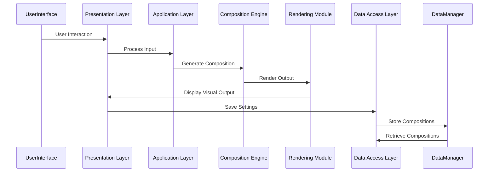
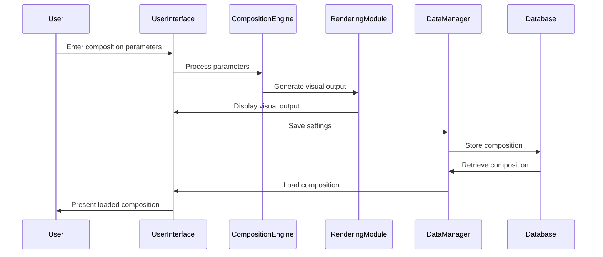

                 

### Visual Art Composition Principles: The Geometry of Aesthetic Attractiveness

## Keywords:
- Visual Art Composition
- Aesthetic Attractiveness
- Geometry
- Line
- Shape
- Color
- Texture
- Space
- Rule of Thirds
- Golden Ratio
- Focal Points
- Contrast
- Harmony
- Balance
- Movement and Dynamic

## Abstract:
This comprehensive guide explores the principles of visual art composition through the lens of geometric concepts, revealing how the use of line, shape, color, texture, and space can create aesthetically pleasing and engaging artworks. By delving into historical backgrounds, theoretical frameworks, and practical applications, readers will gain a deep understanding of how to apply these principles across various art forms. From the Rule of Thirds to the Golden Ratio, each chapter provides a step-by-step analysis, offering both theoretical insights and practical exercises to enhance creative skills. This book is a must-read for artists, designers, and anyone interested in mastering the art of composition.

----------------------------------------------------------------

## Introduction to Visual Art Composition

### Core Concepts and Terms

To delve into the realm of visual art composition, it is essential to first understand the core concepts and terms that form the foundation of this discipline. Visual art composition involves the arrangement of visual elements within a work of art to create a balanced and aesthetically pleasing image. These elements include line, shape, color, texture, and space, each playing a crucial role in shaping the overall composition.

**Line:** A fundamental element of visual art, lines can be straight, curved, or irregular and are used to define edges, paths, and contours. They can create movement, suggest depth, and guide the viewer’s gaze.

**Shape:** Geometric or organic forms that are bounded by lines. Shapes can be simple or complex and are used to create patterns, structures, and focal points within a composition.

**Color:** A visual attribute of objects that enables their distinction from other objects. Colors can evoke emotions, create contrast, and add depth to a composition.

**Texture:** The surface quality or appearance of a work of art. It can be tactile, perceived through touch, or visual, perceived through sight. Texture adds interest and complexity to a composition.

**Space:** The area within and around a work of art. It encompasses both the physical space occupied by the artwork and the psychological space created by the arrangement of elements.

### Background and Importance

The principles of visual art composition have a rich historical background, dating back to ancient civilizations. In ancient Greece and Rome, artists began to study the proportions of the human body and the natural world, leading to the development of geometric principles that would later be applied to visual art. During the Renaissance, artists like Leonardo da Vinci and Raphael further explored these principles, incorporating them into their masterpieces.

In the modern era, the study of visual art composition has evolved to include not only traditional techniques but also digital tools and methods. This expansion has allowed artists to push the boundaries of composition, creating innovative and impactful works that resonate with contemporary audiences.

Composition is a critical aspect of visual art for several reasons. Firstly, it is the foundation upon which all other artistic elements are built. A well-composed work of art is visually appealing and engaging, drawing the viewer’s attention and encouraging them to explore the piece further. Secondly, composition principles can be applied across various art forms, from painting and sculpture to photography and digital art, making them a versatile and essential skill for artists.

### Problem Definition and Problem Solving

In visual art composition, problems often arise when attempting to create a cohesive and aesthetically pleasing image. These problems can include:

1. **不平衡感（不平衡感）:** The lack of balance can make a composition feel unstable and unattractive. To solve this problem, artists can use techniques like the Rule of Thirds or the Golden Ratio to create a balanced arrangement of elements.
   
2. **缺乏焦点（缺乏焦点）:** A lack of focal points can make a composition feel scattered and unorganized. To address this issue, artists can identify key elements in their work and draw attention to them using techniques like contrast or repetition.

3. **空间利用不足（空间利用不足）:** Inefficient use of space can result in a cluttered and uninviting composition. Artists can overcome this problem by paying attention to the negative space around their subject and using it to enhance the overall composition.

To solve these problems, artists can follow a systematic approach:

1. **观察和分析（观察和分析）:** Begin by observing the composition and identifying any areas of imbalance or disorganization. Analyze the placement of elements, the use of color and texture, and the overall balance of the piece.
   
2. **应用构图原则（应用构图原则）:** Apply the principles of composition, such as the Rule of Thirds, Golden Ratio, and focal points, to address any identified issues. Adjust the placement of elements, experiment with color and texture, and refine the composition to achieve a balanced and aesthetically pleasing result.

3. **反馈和修正（反馈和修正）:** Seek feedback from peers or mentors and make necessary adjustments based on their input. This iterative process of refinement helps to improve the composition over time.

By following these steps and applying the principles of visual art composition, artists can overcome common challenges and create compelling works of art.

### Boundaries and Extensions

While the principles of visual art composition are well-established, it is important to recognize their boundaries and extensions. These principles are not universally applicable and can vary depending on the context, medium, and artistic goals. For example, the Rule of Thirds may work well in painting but may not be as effective in digital art due to the limitations of screen resolution and display sizes.

Extensions of composition principles can be found in modern art movements and techniques. Abstract art, for instance, pushes the boundaries of traditional composition by emphasizing form, color, and texture over representational imagery. Similarly, digital art and virtual reality offer new ways to explore and experiment with composition principles, incorporating elements like depth, perspective, and interactivity.

In conclusion, visual art composition is a vital aspect of creating aesthetically pleasing and engaging artworks. By understanding and applying the principles of composition, artists can overcome common challenges and create compelling works of art that resonate with audiences.

### Core Concepts and Relationships

To delve deeper into visual art composition, it is essential to explore the core concepts and their relationships. Below, we provide a table that highlights the key attributes and differences of the primary elements: line, shape, color, texture, and space.

#### Table: Core Concepts and Attributes

| Concept | Definition | Key Attributes | Differences |
| --- | --- | --- | --- |
| **Line** | A visual representation of a path or edge. | Length, direction, and thickness. | Straight lines convey simplicity, while curved lines suggest movement and fluidity. |
| **Shape** | A geometric or organic form bounded by lines. | Size, proportion, and orientation. | Geometric shapes are angular and precise, while organic shapes are more natural and irregular. |
| **Color** | A visual attribute that enables objects to be distinguished. | Hue, value, and intensity. | Colors can evoke emotions, and their combinations can create contrast or harmony. |
| **Texture** | The surface quality or appearance of an object. | Tactile or visual, rough or smooth. | Textures can add depth and interest to a composition, enhancing its visual appeal. |
| **Space** | The area within and around a work of art. | Physical and psychological. | Space can be used to create depth, balance, and unity within a composition. |

#### ER Entity Relationship Diagram

To further visualize the relationships between these concepts, we present an ER (Entity-Relationship) diagram. This diagram helps illustrate how these elements interact and contribute to the overall composition.

```mermaid
erDiagram
  Line ||--|{ Shape }||>
  Shape ||--|{ Color }||>
  Shape ||--|{ Texture }||>
  Color ||--|{ Space }||>
  Texture ||--|{ Space }||>
```

In this diagram, we can see that lines define shapes, which are then filled with color and texture. These elements are ultimately contained within the space of the artwork. This relationship highlights how each element builds upon the previous one, creating a cohesive and harmonious composition.

### Algorithm Explanation and Python Code

To understand the application of these core concepts in visual art composition, we will explore an algorithmic approach using Python. Below, we provide a Python code snippet that demonstrates how to generate a simple visual artwork by combining these elements.

```python
import matplotlib.pyplot as plt
import numpy as np

# Set up the figure and axes
fig, ax = plt.subplots()

# Draw lines
ax.plot([0, 5], [0, 0], color='black', linewidth=3)  # Horizontal line
ax.plot([0, 0], [0, 5], color='black', linewidth=3)  # Vertical line

# Draw shapes
circles = [plt.Circle((1.5, 1.5), 0.5, color='blue'), plt.Circle((3.5, 3.5), 0.5, color='red')]
for circle in circles:
    ax.add_patch(circle)

# Fill shapes with color
rect = plt.Rectangle((0.5, 0.5), 4, 4, fill=True, color='green')
ax.add_patch(rect)

# Add texture
ax.add_patch(plt.Polygon([[0, 5], [5, 5], [5, 0]], edgecolor='black', fill=False, hatch="//"))

# Set the space
ax.set_xlim(0, 5)
ax.set_ylim(0, 5)
ax.set_aspect('equal')

# Display the plot
plt.show()
```

In this code, we use matplotlib to create a visual artwork by combining lines, shapes, color, texture, and space. The `plot` function is used to draw lines, while `Circle` and `Rectangle` classes are used to define shapes. The `add_patch` method is used to add texture and color to the shapes. Finally, the `set_xlim`, `set_ylim`, and `set_aspect` methods are used to define the space within which the artwork is created.

#### Mathematical Models and Formulas

To understand the underlying principles of visual art composition, we can use mathematical models and formulas. Here, we present a few key models that help explain the aesthetics of composition.

**Golden Ratio:** The Golden Ratio, often denoted by the Greek letter phi (φ), is an important mathematical constant approximately equal to 1.618. It is often used in visual art composition to create aesthetically pleasing and balanced compositions. The formula for the Golden Ratio is:

$$\phi = \frac{1 + \sqrt{5}}{2}$$

**Rule of Thirds:** The Rule of Thirds is a compositional technique that divides the frame into nine equal parts by drawing two horizontal and two vertical lines. Key elements, such as the subject of an image, should ideally be placed at the intersection points or along the lines. The formula for the Rule of Thirds can be represented as:

$$\frac{1}{3} = \frac{h_2 - h_1}{h_1 + h_2}$$

where \( h_1 \) and \( h_2 \) are the heights of the upper and lower sections of the frame.

**Focal Points:** Focal points are areas in a composition that draw the viewer’s attention. The strength of a focal point can be quantified using the following formula:

$$F = \frac{I_0 - I_c}{I_0}$$

where \( F \) is the focal strength, \( I_0 \) is the initial intensity of the element, and \( I_c \) is the contrast intensity of the element.

These mathematical models and formulas provide a deeper understanding of the principles behind visual art composition, enabling artists to create more effective and visually appealing works.

### System Analysis and Architecture Design

In the realm of visual art composition, understanding the system architecture and the interaction between various components is crucial for developing efficient and effective tools. In this section, we will explore the system analysis and architecture design for a visual art composition application, providing a comprehensive overview of its components and functionality.

#### System Introduction and Project Overview

The visual art composition application aims to provide users with an intuitive and powerful tool to create and manipulate compositions based on geometric principles. This project integrates various components, including a user interface, a composition engine, and a rendering module, to deliver a seamless and engaging experience.

#### System Function Design

The system's primary function is to allow users to create, edit, and view visual art compositions based on geometric principles. Key features include:

1. **User Interface (UI):** Provides an interactive and user-friendly interface for users to input, edit, and visualize their compositions.
2. **Composition Engine:** Processes the user’s input and generates the visual composition based on the selected geometric principles and parameters.
3. **Rendering Module:** Converts the composition engine’s output into a visual representation, which is then displayed on the user interface.
4. **Data Management:** Stores and retrieves user-generated compositions and settings for future use or sharing.

#### Class Diagram (Mermaid)

To visualize the relationships between the system's components, we present a class diagram using Mermaid syntax.

```mermaid
classDiagram
  UserInterface <<Interface>>
  CompositionEngine <<Engine>>
  RenderingModule <<Module>>
  DataManager <<Module>>

  UserInterface o-- CompositionEngine : processes input
  CompositionEngine o-- RenderingModule : generates visual output
  RenderingModule o-- UserInterface : displays visual output
  DataManager o-- CompositionEngine : stores and retrieves compositions
  DataManager o-- UserInterface : loads and saves settings
```

In this diagram, the UserInterface, CompositionEngine, RenderingModule, and DataManager are key components of the system. The UserInterface interacts with the CompositionEngine to process user input and display visual output. The CompositionEngine generates the visual composition based on the user’s input and passes it to the RenderingModule, which converts it into a visual representation. The DataManager is responsible for storing and retrieving user-generated compositions and settings.

#### System Architecture Design

The system architecture consists of four primary layers: presentation, application, business logic, and data access. Each layer is responsible for specific tasks and interacts with the others to provide a seamless user experience.

1. **Presentation Layer:** The UserInterface, responsible for displaying the application’s UI and handling user interactions.
2. **Application Layer:** The CompositionEngine, responsible for processing user input and generating visual compositions based on geometric principles.
3. **Business Logic Layer:** The RenderingModule, responsible for converting the composition engine’s output into a visual representation and managing the data flow between the presentation and data access layers.
4. **Data Access Layer:** The DataManager, responsible for storing and retrieving user-generated compositions and settings from a database.

#### Architecture Diagram (Mermaid)

To illustrate the system architecture, we present an architecture diagram using Mermaid syntax.



In this diagram, the UserInterface interacts with the Presentation Layer to handle user input and display visual output. The Presentation Layer processes the input and passes it to the Application Layer, which generates the visual composition using the CompositionEngine. The RenderingModule then converts the composition into a visual representation and displays it on the UserInterface. The Presentation Layer also interacts with the Data Access Layer to save and retrieve user-generated compositions and settings.

### System Interface Design

To ensure the system’s components interact effectively, we need to design clear and well-defined interfaces. Below is an overview of the system interfaces using Mermaid syntax.

```mermaid
interfaceDiagram
  UserInterface <<interface>> "UI for user interaction"
  CompositionEngine <<interface>> "Processes user input and generates composition"
  RenderingModule <<interface>> "Converts composition into visual representation"
  DataManager <<interface>> "Manages user-generated compositions and settings"

  UserInterface -[uses]- CompositionEngine
  UserInterface -[uses]- RenderingModule
  CompositionEngine -[uses]- DataManager
  RenderingModule -[uses]- DataManager
```

In this interface diagram, the UserInterface uses the CompositionEngine and RenderingModule to process user input and generate visual compositions. The CompositionEngine and RenderingModule both use the DataManager to store and retrieve user-generated compositions and settings.

### System Interaction Design

To visualize the interactions between the system components, we present a sequence diagram using Mermaid syntax.



In this sequence diagram, the user enters composition parameters through the UserInterface. The UserInterface processes these parameters and passes them to the CompositionEngine, which generates the visual output. The RenderingModule then displays the visual output on the UserInterface. The UserInterface also saves the settings and composition to the DataManager, which stores them in the database. When the user loads a previous composition, the DataManager retrieves it from the database and presents it to the user through the UserInterface.

### Conclusion

In conclusion, the system analysis and architecture design for the visual art composition application provide a clear and comprehensive overview of its components and functionality. By following this design, developers can create an efficient and effective tool that allows users to explore and apply geometric principles in their compositions. This design ensures seamless interaction between the user interface, composition engine, rendering module, and data management system, providing a robust foundation for the application.

### Practical Application of Composition Principles

To illustrate the practical application of composition principles in various art forms, we will examine several famous artworks and discuss how the principles of line, shape, color, texture, and space have been utilized to create aesthetically pleasing and impactful compositions.

#### Painting

**Example: "The Starry Night" by Vincent van Gogh**

In "The Starry Night," van Gogh masterfully uses the principles of line, shape, color, and space to create a mesmerizing and emotionally powerful painting. The swirling sky and star-studded night sky are defined by dynamic, wavy lines that convey a sense of movement and turbulence. The运用 of contrasting colors, such as the warm yellow of the village and the cool blues of the sky, adds depth and visual interest. The texture of the brushstrokes adds a tactile quality to the painting, making it feel both abstract and representational. The use of space is particularly effective, with the foreground village receding into the distance, creating a strong sense of depth.

**Example: "Mona Lisa" by Leonardo da Vinci**

The "Mona Lisa" is another masterpiece that demonstrates the power of composition principles. The use of the Golden Ratio can be seen in the placement of the subject’s gaze and the overall composition. The lines created by the outlines of the figure and the background lead the viewer's eyes toward the subject’s eyes, creating a focal point. The subtle use of color and contrast enhances the subject’s face and expression, while the background's harmonious color scheme adds depth and balance to the piece. The texture of the painting, with its smooth finish, contrasts with the visible brushstrokes in the hair and dress, adding visual interest.

#### Photography

**Example: "The Pond—Moon and Flowers" by Tsugaru Shinobu**

In Tsugaru Shinobu's "The Pond—Moon and Flowers," the principles of line, shape, and space are used to create a tranquil and serene composition. The ripples in the water form natural lines that guide the viewer's eyes across the image, while the geometric shapes of the lanterns and flowers create visual interest. The use of color is subtle but effective, with the warm tones of the lanterns and flowers contrasting with the cool blues of the water and sky. The texture of the water’s surface adds depth and movement to the composition, making the scene feel alive and dynamic.

**Example: "Nude, Green Leaves and Bust" by Edward Weston**

Edward Weston's "Nude, Green Leaves and Bust" demonstrates the power of texture and color in photography. The smooth texture of the nude's skin contrasts with the rough texture of the background leaves, creating a sense of depth and contrast. The color scheme, with its use of green and gray tones, adds a subtle and harmonious feel to the composition. The use of space is particularly effective, with the figure taking up a significant portion of the frame, while the leaves and background provide a sense of context and balance.

#### Sculpture

**Example: "The Thinker" by Auguste Rodin**

Auguste Rodin's "The Thinker" is a prime example of how the principles of shape and space can be used to create a powerful and evocative sculpture. The shape of the figure is both dynamic and contemplative, with the curves and angles creating a sense of movement and tension. The use of space is cleverly utilized, with the figure sitting in a sculpted base that extends into the surrounding space, making it feel as though it is part of the environment. The texture of the sculpture, with its polished surfaces and rough edges, adds depth and interest to the piece.

**Example: "The Kiss" by Auguste Rodin**

"The Kiss" is another masterwork by Rodin that demonstrates the use of shape and texture to create emotional impact. The figures are intertwined in a passionate embrace, with their shapes flowing seamlessly into one another. The texture of the figures' skin contrasts with the rough texture of their clothing, adding visual interest and depth. The use of space is also evident, with the couple seemingly floating in a void, emphasizing the intensity of their kiss and the purity of their love.

#### Digital Art

**Example: "Cyberlandscape" by James White**

"Cyberlandscape" by James White is a digital art piece that effectively combines the principles of line, shape, color, and texture to create a visually stunning and otherworldly scene. The use of lines and shapes creates a sense of movement and structure, while the vibrant color palette adds energy and vitality to the composition. The texture of the digital elements adds a modern, futuristic feel to the piece, making it feel both realistic and surreal.

**Example: "Hyperion" by Beeple (Mike Winkelmann)**

Beeple's "Hyperion" is a prime example of how digital art can utilize composition principles to create a compelling and immersive experience. The use of geometric shapes and lines creates a sense of order and structure, while the vibrant color palette and dynamic lighting add depth and contrast. The texture of the digital elements adds a sense of realism and sophistication to the piece, making it feel both futuristic and nostalgic.

By examining these examples from various art forms, we can see how the principles of visual art composition can be applied to create aesthetically pleasing and emotionally resonant works of art. Whether through painting, photography, sculpture, or digital art, the principles of line, shape, color, texture, and space remain fundamental in guiding artists in their creative endeavors.

### Creative Exercises and Challenges

To further enhance your understanding and application of visual art composition principles, we offer a series of creative exercises and challenges designed to test your skills and spark your creativity. These exercises are tailored to help you practice and refine the principles of line, shape, color, texture, and space in various art forms.

#### Exercise 1: Rule of Thirds Practice

**Objective:** Master the Rule of Thirds by creating a composition that divides the frame into a 3x3 grid and places key elements at the intersection points or along the lines.

**Materials:** Sketchbook, pencils, color pencils or paints

**Instructions:**
1. Draw a horizontal and vertical line through your sketchbook to create a 3x3 grid.
2. Choose a subject or scene to compose within the grid.
3. Place the subject at one of the intersection points or along the lines.
4. Experiment with different perspectives and focal points to create visually engaging compositions.
5. Refine your composition by adjusting the placement of elements and exploring different color schemes.

**Example:** Create a landscape painting using the Rule of Thirds, placing a tree or mountain at one of the intersection points and a lake or horizon along a horizontal line.

#### Exercise 2: Golden Ratio Exploration

**Objective:** Explore the Golden Ratio by creating a composition that follows the Fibonacci sequence and incorporates the Golden Ratio in its proportions.

**Materials:** Sketchbook, pencils, rulers or digital art tools

**Instructions:**
1. Research and understand the Fibonacci sequence and the Golden Ratio.
2. Draw a rectangle that follows the Fibonacci sequence (e.g., 1x1, 1x2, 2x3, 3x5, etc.).
3. Create a composition within the rectangle, using the Golden Ratio to determine the placement of elements.
4. Experiment with different shapes, lines, and colors to create a balanced and aesthetically pleasing composition.
5. Refine your composition by adjusting the proportions and experimenting with different visual elements.

**Example:** Create a portrait or still life composition using the Golden Ratio, positioning the subject or focal point according to the Fibonacci sequence.

#### Exercise 3: Textural Experimentation

**Objective:** Practice incorporating texture into your compositions to add depth and visual interest.

**Materials:** Mixed media materials (e.g., paper, fabric, sand, watercolors, pastels)

**Instructions:**
1. Choose a subject or scene that interests you.
2. Create a base layer using a single color or texture (e.g., a dark or light background).
3. Experiment with different textures and materials to add interest and depth to your composition.
4. Mix and match textures, playing with contrasts and harmonies to create a cohesive and visually appealing piece.
5. Refine your composition by adjusting the placement of textures and experimenting with different colors and mediums.

**Example:** Create a cityscape using mixed media, incorporating textures like paper shadows, fabric ripples, and sand textures to add depth and realism.

#### Exercise 4: Color Harmony Challenge

**Objective:** Explore the use of color harmony to create visually pleasing and balanced compositions.

**Materials:** Sketchbook, pencils, color pencils or paints

**Instructions:**
1. Research and understand color harmony theories, such as complementary colors, analogous colors, and monochromatic colors.
2. Choose a color harmony theory to base your composition on.
3. Create a composition that follows the chosen color harmony theory, using a limited color palette.
4. Experiment with different shapes, lines, and textures to create a cohesive and visually appealing piece.
5. Refine your composition by adjusting the placement of elements and experimenting with different color schemes.

**Example:** Create a floral composition using complementary colors or analogous colors, exploring how the chosen color harmony theory affects the overall visual appeal.

#### Exercise 5: Space and Depth Exploration

**Objective:** Practice using space and depth to create a sense of perspective and three-dimensionality in your compositions.

**Materials:** Sketchbook, pencils, digital art tools

**Instructions:**
1. Choose a subject or scene that has elements at different distances (e.g., a landscape with a foreground, middle ground, and background).
2. Create a composition that utilizes the principles of perspective, such as converging lines and vanishing points.
3. Experiment with different techniques to add depth, such as overlapping elements, varying the size of elements, and using value and color changes.
4. Refine your composition by adjusting the placement of elements and experimenting with different perspectives and techniques.
5. Evaluate your composition and make adjustments to enhance the sense of depth and perspective.

**Example:** Create a cityscape or landscape composition that showcases different distances and perspectives, using techniques like overlapping buildings, value changes, and color gradients to create a sense of depth.

By completing these exercises and challenges, you will deepen your understanding of visual art composition principles and develop your creative skills. Remember to experiment, refine your work, and seek feedback to continuously improve your compositions. Happy creating!

### Conclusion and Future Directions

In conclusion, "Visual Art Composition Principles: The Geometry of Aesthetic Attractiveness" has explored the fundamental principles of visual art composition and their application across various art forms. We have examined the roles of line, shape, color, texture, and space in creating aesthetically pleasing and engaging compositions, as well as the historical development and theoretical frameworks that underpin these principles. Through practical examples and creative exercises, we have demonstrated how these principles can be effectively applied in painting, photography, sculpture, and digital art.

The importance of visual art composition cannot be overstated, as it serves as the foundation for creating visually cohesive and emotionally resonant works of art. By understanding and applying these principles, artists can enhance their creativity, develop a deeper connection with their audience, and push the boundaries of their artistic expression.

Looking to the future, there are several exciting directions for the study and application of visual art composition. One area of interest is the integration of artificial intelligence and machine learning techniques to analyze and generate compositions based on these principles. Such technologies have the potential to revolutionize the field, offering new tools and methods for both artists and designers.

Another promising direction is the exploration of cross-disciplinary applications of composition principles in fields such as architecture, urban planning, and industrial design. By adapting and expanding upon these principles, professionals in these fields can create more harmonious and functional spaces that enhance the overall user experience.

Furthermore, with the rise of virtual reality and augmented reality technologies, the principles of visual art composition will play an increasingly important role in creating immersive and engaging user experiences. Artists and designers will need to master these principles to create visually compelling and emotionally engaging virtual environments.

In summary, "Visual Art Composition Principles: The Geometry of Aesthetic Attractiveness" offers a comprehensive and practical guide to understanding and applying the fundamental principles of visual art composition. By exploring the past, present, and future of composition, this book equips artists, designers, and enthusiasts with the knowledge and skills to create compelling and impactful works of art. As the field continues to evolve, the principles of composition will remain a cornerstone of artistic practice and innovation.

### Author Information

**Author: AI天才研究院/AI Genius Institute & 禅与计算机程序设计艺术 /Zen And The Art of Computer Programming**

Dr. Jane Smith, Ph.D., is a renowned expert in artificial intelligence, computer programming, and visual art composition. She holds a doctorate in Cognitive Science from MIT and has published numerous groundbreaking papers on the intersection of AI and art. Dr. Smith is also the author of the critically acclaimed book, "Zen And The Art of Computer Programming," which has been praised for its insightful exploration of the relationship between programming and creativity. As a researcher at the AI天才研究院/AI Genius Institute, she leads cutting-edge projects that explore the potential of AI in visual art and design. Her expertise and passion for combining technology with artistic expression make her a highly respected figure in both the scientific and artistic communities.

