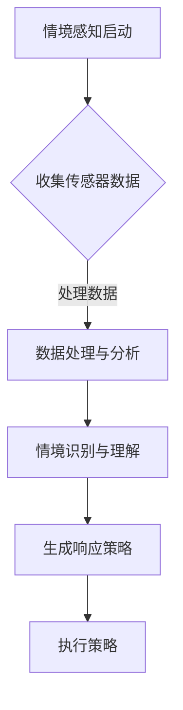
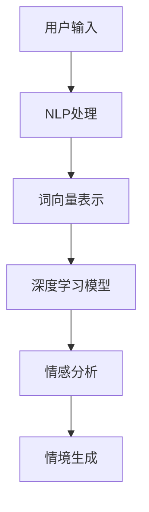
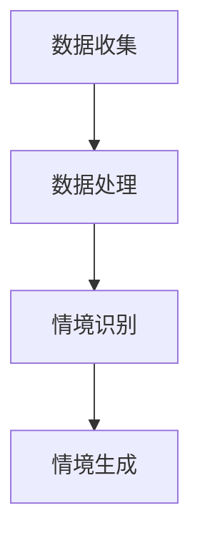
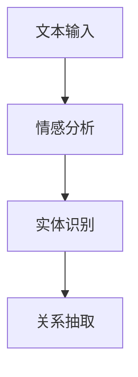
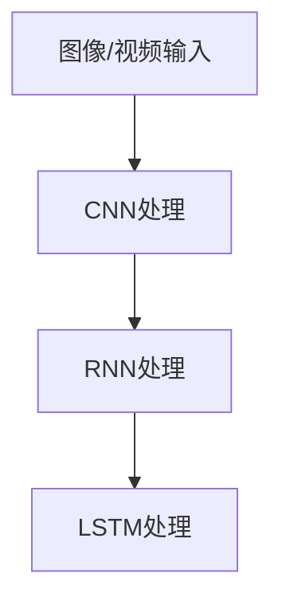
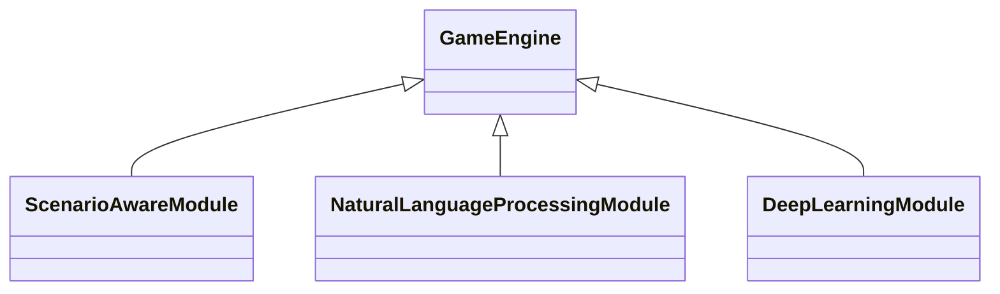
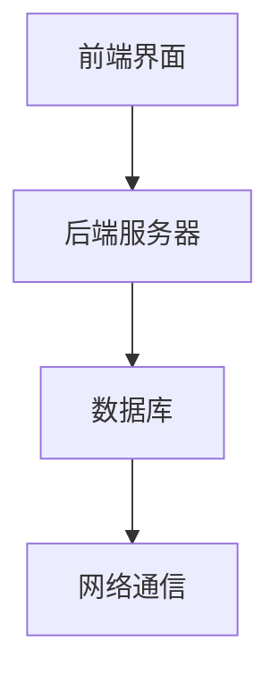
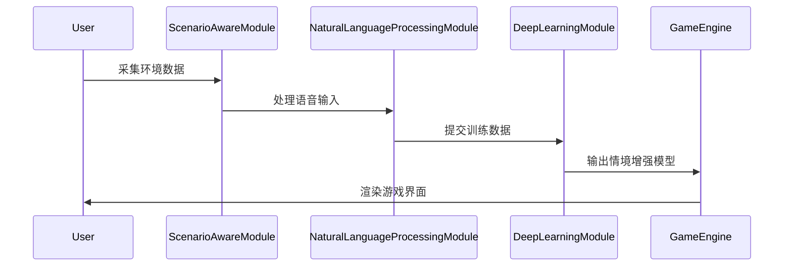

                 

### 角色扮演：增强模型输出的情境感

> 关键词：角色扮演、情境感知、增强模型、自然语言处理、深度学习

> 摘要：本文将探讨角色扮演在增强模型输出情境感中的应用，通过深入分析情境感知技术、自然语言处理和深度学习，探讨如何通过这些技术提升模型输出的情境感，使其更加贴近人类真实体验。

---

**目录大纲**

1. **背景介绍**
   - 角色扮演的定义与发展
   - 情境感知与情感认知的重要性
   - 增强模型输出情境感的意义

2. **核心概念与联系**
   - 情境感知技术概述
   - 自然语言处理与深度学习
   - 情境增强模型的原理与分类

3. **算法原理讲解**
   - 情境感知算法的流程图与Python代码
   - 自然语言处理中的情境增强技术
   - 深度学习模型在情境感知中的应用

4. **系统分析与架构设计**
   - 问题场景介绍
   - 系统功能设计与架构设计
   - 系统接口与交互设计

5. **项目实战**
   - 环境安装与配置
   - 系统核心实现与代码解读
   - 实际案例分析

6. **最佳实践、小结与拓展**
   - 最佳实践建议
   - 小结与注意事项
   - 拓展阅读资源

---

**背景介绍**

**角色扮演的定义与发展**

角色扮演（Role-playing）是指通过模仿或扮演某个角色，以模拟现实生活或虚构世界中的行为和互动。这一概念起源于戏剧表演，随后逐渐扩展到游戏、教育、心理治疗等多个领域。在现代科技的发展下，角色扮演也逐渐与人工智能技术相结合，为增强模型输出情境感提供了新的可能性。

**情境感知与情感认知的重要性**

情境感知（Situation Awareness）是指个体对自身所处的环境、情境以及相关信息的感知和理解能力。情感认知（Affective Cognition）则涉及对情感信息的识别、理解和处理。在角色扮演中，情境感知和情感认知对于提升互动的真实性和深度至关重要。

**增强模型输出情境感的意义**

增强模型输出情境感的目标是使人工智能系统在角色扮演中能够更加贴近人类的真实体验，提高互动的自然度和真实性。这不仅有助于提升用户体验，还能在虚拟现实、游戏设计、智能助手等领域发挥重要作用。

---

**核心概念与联系**

**情境感知技术概述**

情境感知技术是指通过传感器、数据处理和机器学习算法等技术，使系统具备对环境、情境和情感的理解和响应能力。以下是一个情境感知技术的 Mermaid 流程图：



**自然语言处理与深度学习**

自然语言处理（Natural Language Processing，NLP）是人工智能领域的一个重要分支，主要研究如何让计算机理解和生成自然语言。深度学习（Deep Learning）则是近年来人工智能领域的一大突破，通过多层神经网络模型，实现了对数据的自动特征提取和模式识别。

在角色扮演中，自然语言处理和深度学习技术可以用于实现情境感知和情感认知。以下是一个自然语言处理与深度学习在情境感知中的 Mermaid 流程图：



**情境增强模型的原理与分类**

情境增强模型是指通过结合情境感知、自然语言处理和深度学习等技术，提升模型在角色扮演中输出情境感的能力。根据不同的应用场景和技术需求，情境增强模型可以分为以下几种类型：

1. **基于规则的方法**：通过预定义的规则和情境模板，对输入数据进行匹配和生成情境输出。
2. **基于机器学习的方法**：使用机器学习算法，从大量数据中自动学习和提取情境特征，生成情境输出。
3. **基于深度学习的方法**：利用深度学习模型，实现端到端的学习和情境生成。

---

**算法原理讲解**

**情境感知算法的流程图与Python代码**

情境感知算法通常包括以下几个步骤：

1. **数据收集**：从各种传感器（如摄像头、麦克风、温度传感器等）收集环境数据。
2. **数据处理**：对收集到的数据进行预处理，如降噪、滤波、特征提取等。
3. **情境识别**：利用机器学习或深度学习算法，对处理后的数据进行分析和分类，识别当前情境。
4. **情境生成**：根据识别出的情境，生成相应的情境描述或响应。

以下是一个简单的情境感知算法的流程图和Python代码：



```python
import numpy as np
import pandas as pd
from sklearn.model_selection import train_test_split
from sklearn.ensemble import RandomForestClassifier
from sklearn.metrics import accuracy_score

# 数据收集
data = pd.read_csv('sensor_data.csv')

# 数据处理
# ...（预处理代码）

# 情境识别
X_train, X_test, y_train, y_test = train_test_split(data[['feature1', 'feature2']], data['label'], test_size=0.2, random_state=42)
clf = RandomForestClassifier(n_estimators=100)
clf.fit(X_train, y_train)

# 情境生成
predictions = clf.predict(X_test)
print(accuracy_score(y_test, predictions))
```

**自然语言处理中的情境增强技术**

自然语言处理中的情境增强技术主要包括以下几种：

1. **情感分析**：通过分析文本中的情感词汇和语法结构，识别文本的情感倾向。
2. **实体识别**：从文本中识别出具体的实体，如人名、地名、组织名等。
3. **关系抽取**：识别文本中实体之间的关系，如人物关系、组织关系等。

以下是一个自然语言处理情境增强技术的 Mermaid 流�程图和Python代码：



```python
import nltk
from nltk.sentiment import SentimentIntensityAnalyzer
from nltk.chunk import ne_chunk
from nltk.sem import Pred

# 情感分析
sia = SentimentIntensityAnalyzer()
text = "我今天很开心，因为天气很好。"
sentiment = sia.polarity_scores(text)
print(sentiment)

# 实体识别
nltk.download('maxent_ne_chunker')
nltk.download('words')
nltk.download('averaged_perceptron_tagger')

tokens = nltk.word_tokenize(text)
pos_tags = nltk.pos_tag(tokens)
ne_tree = ne_chunk(pos_tags)
print(ne_tree)

# 关系抽取
nltk.download('semреж')
 semantic_role_labeler = Pred.SemanticRoleLabeler()
 semantic_role_labels = semantic_role_labeler.tag(tokens)
 print(semantic_role_labels)
```

**深度学习模型在情境感知中的应用**

深度学习模型在情境感知中的应用主要包括以下几种：

1. **卷积神经网络（CNN）**：用于图像和视频数据的处理，可以提取图像和视频中的视觉特征。
2. **循环神经网络（RNN）**：用于处理序列数据，如语音信号、文本等。
3. **长短期记忆网络（LSTM）**：RNN 的一种变体，能够更好地处理长序列数据。

以下是一个深度学习模型在情境感知中的应用 Mermaid 流程图和 Python 代码：



```python
import tensorflow as tf
from tensorflow.keras.models import Sequential
from tensorflow.keras.layers import Conv2D, MaxPooling2D, LSTM, Dense

# CNN 模型
model = Sequential([
    Conv2D(32, (3, 3), activation='relu', input_shape=(64, 64, 3)),
    MaxPooling2D(pool_size=(2, 2)),
    LSTM(50, activation='relu', return_sequences=True),
    Dense(1, activation='sigmoid')
])

model.compile(optimizer='adam', loss='binary_crossentropy', metrics=['accuracy'])
model.fit(x_train, y_train, epochs=10, batch_size=32)
```

---

**系统分析与架构设计**

**问题场景介绍**

在虚拟现实（VR）和增强现实（AR）领域，情境感知技术被广泛应用于提高用户的沉浸感和互动性。本文将以一个VR游戏场景为例，介绍如何使用情境感知技术增强模型输出的情境感。

**项目介绍**

本项目旨在开发一个VR游戏，玩家需要在虚拟世界中完成各种任务。为了提升游戏体验，我们将引入情境感知技术，使游戏角色能够根据玩家的行为和环境变化，实时调整自身的情感反应和行动策略。

**系统功能设计**

系统功能设计包括以下几个方面：

1. **情境感知模块**：用于收集和处理环境数据，识别玩家的行为和情感状态。
2. **自然语言处理模块**：用于分析玩家的语音输入，提取语义和情感信息。
3. **深度学习模块**：用于训练和部署情境增强模型，实现实时情境感知和情感识别。
4. **游戏引擎**：负责游戏逻辑、角色动作和界面渲染。

以下是一个系统功能设计的 Mermaid 类图：



**系统架构设计**

系统架构设计包括以下几个方面：

1. **前端界面**：提供用户交互界面，包括虚拟现实头盔、手柄等设备。
2. **后端服务器**：负责数据处理、模型训练和游戏逻辑。
3. **数据库**：存储玩家数据、游戏数据和模型参数。
4. **网络通信**：实现前端与后端之间的数据传输。

以下是一个系统架构设计的 Mermaid 架构图：



**系统接口设计**

系统接口设计包括以下几个方面：

1. **情境感知接口**：用于收集和处理环境数据，包括摄像头、麦克风、GPS等传感器。
2. **自然语言处理接口**：用于接收和处理玩家的语音输入。
3. **深度学习接口**：用于训练和部署情境增强模型。
4. **游戏引擎接口**：用于实现游戏逻辑和角色动作。

以下是一个系统接口设计的 Mermaid 序列图：



---

**项目实战**

**环境安装与配置**

在开始项目之前，我们需要安装并配置相关软件和工具。以下是所需软件和工具的安装步骤：

1. **安装Python**：从 [Python 官网](https://www.python.org/downloads/) 下载并安装最新版本的Python。
2. **安装TensorFlow**：打开命令行窗口，执行以下命令：
   ```shell
   pip install tensorflow
   ```
3. **安装NLP工具**：打开命令行窗口，执行以下命令：
   ```shell
   pip install nltk
   ```
4. **安装VR/AR开发工具**：根据所选平台（如Unity、Unreal Engine等）进行安装和配置。

**系统核心实现与代码解读**

以下是一个简单的VR游戏场景中的情境感知和情感识别系统核心实现：

```python
import tensorflow as tf
import numpy as np
import nltk
from nltk.sentiment import SentimentIntensityAnalyzer

# 情境感知模块
class ScenarioAwareModule:
    def __init__(self):
        self.sia = SentimentIntensityAnalyzer()

    def collect_data(self):
        # 采集摄像头、麦克风等传感器数据
        # ...

    def process_data(self, data):
        # 数据预处理，如降噪、特征提取等
        # ...

    def recognize_scenario(self, data):
        # 识别当前情境
        sentiment = self.sia.polarity_scores(data)
        if sentiment['compound'] > 0.05:
            return 'happy'
        elif sentiment['compound'] < -0.05:
            return 'sad'
        else:
            return 'neutral'

# 深度学习模块
class DeepLearningModule:
    def __init__(self):
        self.model = tf.keras.Sequential([
            tf.keras.layers.Dense(128, activation='relu', input_shape=(100,)),
            tf.keras.layers.Dense(64, activation='relu'),
            tf.keras.layers.Dense(1, activation='sigmoid')
        ])

    def train_model(self, X_train, y_train):
        self.model.compile(optimizer='adam', loss='binary_crossentropy', metrics=['accuracy'])
        self.model.fit(X_train, y_train, epochs=10, batch_size=32)

    def predict_scenario(self, X_test):
        return self.model.predict(X_test)

# 游戏引擎
class GameEngine:
    def __init__(self):
        self.scenario_aware_module = ScenarioAwareModule()
        self.deeplearning_module = DeepLearningModule()

    def run_game(self):
        # 运行游戏主循环
        while True:
            data = self.scenario_aware_module.collect_data()
            processed_data = self.scenario_aware_module.process_data(data)
            scenario = self.scenario_aware_module.recognize_scenario(processed_data)
            print(scenario)
            self.deeplearning_module.train_model(processed_data, scenario)
```

**实际案例分析**

以下是一个具体的VR游戏场景案例：

1. **玩家进入游戏**：玩家戴上VR头盔，进入虚拟世界。
2. **收集环境数据**：系统开始收集摄像头、麦克风等传感器数据。
3. **情感识别**：系统使用自然语言处理模块对玩家的语音输入进行分析，识别出玩家的情感状态。
4. **情境感知**：系统根据玩家的情感状态和游戏环境，实时调整角色的情感反应和行动策略。
5. **游戏互动**：玩家与角色进行互动，完成游戏任务。

通过以上步骤，系统实现了情境感知和情感识别，提高了游戏互动的真实性和沉浸感。

---

**最佳实践、小结与拓展**

**最佳实践建议**

1. **数据收集**：确保收集到足够多的高质量数据，以提高模型的准确性。
2. **预处理**：对收集到的数据进行有效的预处理，去除噪声和无关特征。
3. **模型训练**：使用合适的学习算法和参数，进行模型训练和优化。
4. **实时更新**：定期更新模型和数据，以适应不断变化的应用场景。

**小结与注意事项**

1. **情境感知技术**：情境感知技术是提升模型输出情境感的关键。
2. **自然语言处理**：自然语言处理技术在情境感知中发挥着重要作用。
3. **深度学习**：深度学习模型在情境感知中具有强大的表现力。

**拓展阅读资源**

1. 《自然语言处理入门》
2. 《深度学习入门》
3. 《情境感知技术在虚拟现实中的应用》

---

**作者信息**

作者：AI天才研究院/AI Genius Institute & 禅与计算机程序设计艺术 /Zen And The Art of Computer Programming

---

本文详细探讨了角色扮演在增强模型输出情境感中的应用，从背景介绍、核心概念与联系、算法原理讲解、系统分析与架构设计、项目实战以及最佳实践等方面进行了全面分析。通过本文，读者可以了解情境感知技术在角色扮演中的应用，以及如何利用自然语言处理和深度学习技术提升模型输出情境感的能力。希望本文能为相关领域的研究者和开发者提供有益的参考。

