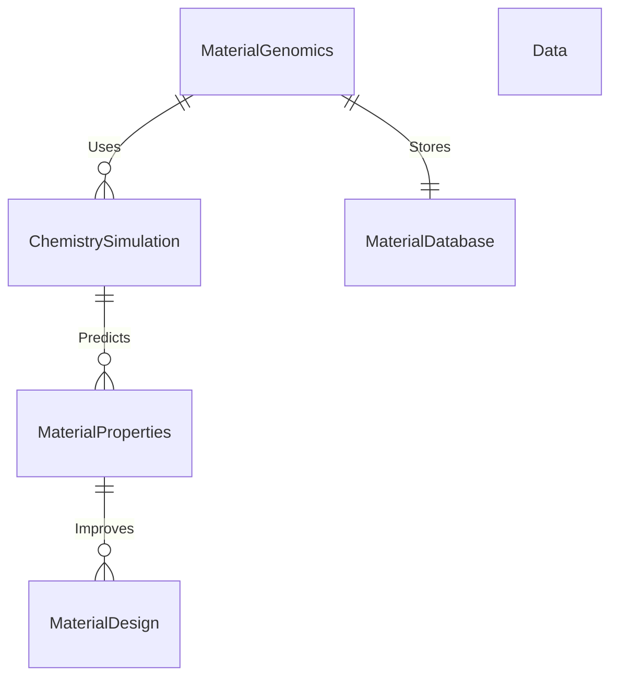
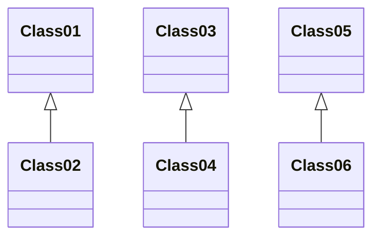
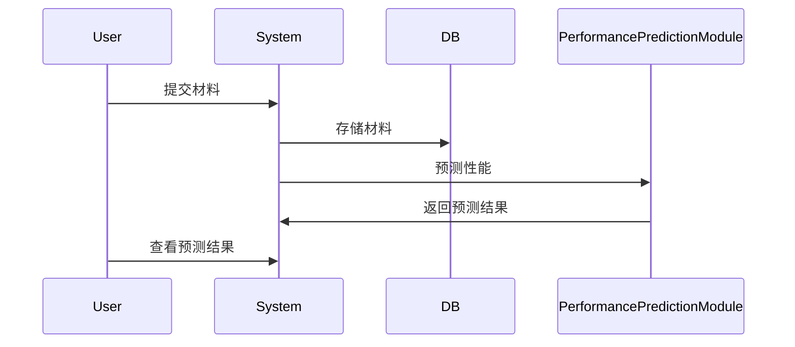
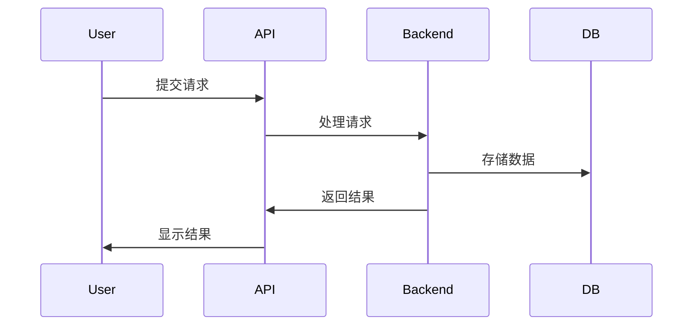

                 

### 关键词

- 计算化学
- 材料基因组学
- 物质世界理解
- 计算方法
- 材料性能预测
- 量子力学
- 分子动力学
- 数据分析
- 机器学习
- 人工智能

### 摘要

本文探讨了计算化学与材料基因组学在现代科技领域中的关键作用，以及它们如何加速我们对物质世界的理解。通过详细阐述计算化学的基础原理、材料基因组学的方法与目标，以及两者的相互关联，本文揭示了计算化学在材料基因组研究中的应用实例和优势。同时，文章通过实际案例分析，展示了计算化学与材料基因组学在科学研究与产业发展中的成功融合，并对未来的发展前景与挑战进行了展望。通过本文的阅读，读者将深入理解这一领域的前沿动态，为相关研究提供有益的启示。

## 引言与背景

### 计算化学的基本概念

计算化学是应用计算方法来研究化学问题的一门学科，通过计算机模拟和计算模型来解析化学现象。它起源于20世纪50年代，随着计算机技术的发展而逐渐成熟。计算化学的核心任务是利用量子力学、统计力学、分子动力学等方法，对分子和晶体结构进行模拟，预测化学反应路径和反应动力学，分析分子的电子结构和光谱特性。

在科学研究中，计算化学扮演着不可或缺的角色。它不仅能够帮助科学家更好地理解分子和化学反应的本质，还能够用于设计新材料、新药物，以及优化化学反应过程。例如，通过计算化学的方法，科学家可以预测新材料的性能，从而指导材料合成与制备；在药物研发领域，计算化学可以辅助药物分子的设计，提高药物的选择性和生物利用度。

### 材料基因组的定义与发展

材料基因组学是近年来兴起的一门交叉学科，它借鉴了基因组学的理念，通过高通量测序和大数据分析，研究材料的基因组信息，从而揭示材料结构与性能之间的关系。材料基因组的定义可以理解为：对材料组成、结构和性能相关基因的全序列分析。这一概念在21世纪初逐渐形成，并在材料科学、化学、生物学等多个领域得到广泛应用。

材料基因组学的研究目标主要包括三个方面：

1. **材料基因组的测序与分析**：通过高通量测序技术，获取材料的基因组序列信息，并对这些数据进行分析，以理解材料的组成和结构特征。
2. **材料结构与性能关系研究**：通过计算模型和实验验证，探索材料结构与性能之间的关联，为材料设计提供理论依据。
3. **材料合成与制备策略优化**：利用计算化学的方法，设计新的材料合成路径和制备策略，提高材料的性能和制备效率。

材料基因组学的发展历程可以追溯到基因组学的发展。随着高通量测序技术和计算能力的提升，材料基因组学逐渐从理论走向实践，成为材料科学研究的重要工具。如今，材料基因组学已经应用于多个领域，包括能源材料、生物材料、纳米材料等。

### 计算化学与材料基因组的关联

计算化学与材料基因组学在科学研究中有许多关联和相互作用。首先，计算化学提供了研究材料基因组数据的强大工具。例如，通过计算化学的分子动力学模拟，可以预测材料分子的动态行为和相互作用，从而帮助科学家理解材料性能的变化规律。此外，计算化学的方法也可以用于材料基因组的序列分析，辅助科学家发现新的材料基因和功能基因。

另一方面，材料基因组学为计算化学提供了丰富的实验数据和材料背景。通过材料基因组的研究，科学家可以获取大量的材料基因组数据，这些数据为计算化学的模拟提供了宝贵的参考。例如，通过分析材料基因组的序列信息，计算化学家可以设计新的计算模型，预测材料的新性能和应用场景。

此外，计算化学与材料基因组的互动还体现在它们在材料设计和优化中的应用。通过计算化学的方法，科学家可以设计出具有特定性能的材料，并通过材料基因组的研究，验证这些设计的效果。这种相互验证和反馈机制，极大地推动了材料科学的发展。

总之，计算化学与材料基因组学的结合，不仅有助于深化我们对物质世界的理解，也为科学研究提供了新的方法和工具。随着这两门学科的不断发展，我们有理由相信，未来将会在计算化学与材料基因组学领域取得更多突破性的成果。

### 本章小结

本章介绍了计算化学与材料基因组学的基本概念、发展历程及其在现代科技中的重要性。计算化学通过计算方法研究化学反应和分子结构，而材料基因组学则通过高通量测序和分析，研究材料的基因组信息。两者在科学研究中的应用和相互作用，为我们提供了强大的工具，以更深入地理解物质世界。通过本章的介绍，读者可以初步了解计算化学与材料基因组学的基本知识和前沿动态，为后续章节的深入探讨打下基础。

## 核心概念与联系

在探讨计算化学与材料基因组学的关系时，首先需要明确这两门学科的核心概念，并理解它们之间的关联。下面，我们将分别介绍计算化学和材料基因组学的基本概念，然后使用表格和Mermaid ER图来展示它们的核心概念及其相互关系。

### 计算化学基本概念解析

#### 分子结构与化学反应
分子结构是计算化学研究的基础。通过分子建模和计算方法，可以模拟分子在化学反应中的动态变化，预测反应路径和反应动力学。分子结构的研究包括分子几何、电子结构和核磁共振等。

#### 基于量子力学的计算方法
量子力学计算是计算化学的核心方法之一。它利用量子力学的原理，计算分子的电子结构和能量，预测化学反应的速率和机理。常见的方法包括Hartree-Fock理论和密度泛函理论（DFT）。

#### 分子动力学模拟
分子动力学模拟是一种模拟分子在空间和时间上运动的方法。通过求解牛顿运动方程，可以模拟分子之间的相互作用和运动轨迹，从而理解分子在微观尺度上的行为。

### 材料基因组基本概念

#### 材料基因组的构建
材料基因组的构建是材料基因组学的基础。它通过高通量测序技术，获取材料的基因组序列信息，包括元素组成、原子排列和化学键信息。

#### 材料基因组的数据库
材料基因组的数据库是存储和共享材料基因组数据的重要资源。这些数据库包含了大量的材料基因组序列信息，为计算化学的研究提供了丰富的数据支持。

#### 材料基因组的数据分析方法
材料基因组的数据分析方法包括序列比对、基因注释和机器学习等。通过这些方法，可以从基因组序列中提取有用的信息，揭示材料结构和性能之间的关系。

### 核心概念联系与模型

为了更好地展示计算化学与材料基因组学之间的关联，我们可以使用Mermaid ER图来构建它们的概念模型。

#### Mermaid ER图



这个ER图展示了材料基因组与计算化学之间的主要联系：材料基因组为计算化学提供了数据基础（MaterialDatabase），计算化学利用这些数据来预测材料性能（MaterialProperties），进而指导材料设计（MaterialDesign）。

#### 概念属性特征对比表格

下面是一个简化的概念属性特征对比表格，展示了计算化学和材料基因组学的基本特征。

| 特征 | 计算化学 | 材料基因组学 |
| --- | --- | --- |
| 研究对象 | 分子、原子、化学反应 | 材料基因组、材料组成、材料结构 |
| 研究方法 | 量子力学计算、分子动力学模拟 | 高通量测序、数据分析、机器学习 |
| 数据类型 | 电子结构数据、反应动力学数据 | 基因组序列数据、元素组成数据 |
| 目标 | 预测化学反应路径、分子性能 | 预测材料性能、优化材料设计 |
| 应用领域 | 药物设计、材料合成 | 新材料发现、材料优化 |

通过上述表格和Mermaid ER图，我们可以更清晰地理解计算化学与材料基因组学之间的核心概念及其相互关系。这些工具和方法不仅帮助我们更好地理解这两门学科，也为未来的科学研究提供了有力的支持。

### 本章小结

本章深入探讨了计算化学和材料基因组学的核心概念，并详细分析了它们之间的联系。通过定义和对比计算化学的基本原理和方法，以及材料基因组学的构建、数据库和数据分析方法，我们揭示了这两门学科在科学研究中的重要作用。同时，通过Mermaid ER图和属性特征对比表格，我们展示了计算化学与材料基因组学的相互作用和关联。这些概念的理解为后续章节的讨论奠定了基础，也为读者提供了进一步研究这一领域的重要视角。

## 计算化学基础

### 计算化学的基本原理与方法

计算化学是应用计算方法来研究化学现象和问题的学科，其核心在于通过计算机模拟和计算模型来解析分子、晶体和化学反应。计算化学的基本原理主要基于量子力学、统计力学和分子动力学等理论，这些理论为化学问题的计算提供了理论基础和数学模型。

#### 基于量子力学的计算方法

量子力学计算是计算化学的重要分支，它利用量子力学的原理来计算分子的电子结构和能量。以下是几种常见的量子力学计算方法：

1. **Hartree-Fock（HF）理论**：HF理论是一种自洽场方法，它通过求解单电子波函数来计算分子的电子结构。HF理论是许多其他量子力学方法的基础。

2. **密度泛函理论（DFT）**：DFT是近年来发展起来的一种计算方法，它通过计算电子密度来预测分子的能量和结构。DFT相较于HF理论，能够更准确地描述电子相关效应，因此在材料科学和化学领域广泛应用。

3. **多体微扰理论（MP2、MP4等）**：这些方法通过考虑多电子相互作用，对HF或DFT结果进行修正，以提高计算精度。

4. **分子轨道方法（LCAO-MO）**：LCAO-MO方法通过线性组合原子轨道（LCAO）来构建分子轨道（MO），从而计算分子的电子结构和能量。

#### 分子动力学模拟方法

分子动力学模拟（MD）是一种通过求解牛顿运动方程来模拟分子在时间上的运动和相互作用的方法。MD模拟的基本步骤如下：

1. **系统初始化**：设定系统的初始条件，包括分子的位置、速度和能量。

2. **时间步进**：在每一个时间步，通过求解牛顿运动方程，计算分子之间的相互作用力和运动轨迹。

3. **能量更新**：在每一个时间步，更新分子的能量和动量，以反映系统在时间上的演化。

4. **系统能量计算**：计算系统的总能量，包括动能和势能，以验证模拟的稳定性。

MD模拟在理解分子动态行为、预测化学反应路径和动力学方面具有重要作用。常见的分子动力学模拟软件包括GROMACS、LAMMPS和AMBER等。

#### 分子建模与分子力学方法

分子建模是计算化学中的另一重要环节，它通过构建分子的几何结构来模拟分子的性质。分子建模的方法主要包括：

1. **分子力学方法（MM）**：分子力学方法是一种基于经验力的模型，通过模拟分子之间的相互作用来预测分子的几何构型和性质。常见的分子力学力场包括CHARMM、AMBER和FF99等。

2. **量子力学-分子力学耦合（QM-MM）**：QM-MM方法结合量子力学和分子力学，通过在不同层次上计算分子的能量和结构，以提高计算精度。

3. **基于片段的建模方法**：基于片段的建模方法将大分子拆分为若干小片段，分别进行建模和模拟，从而简化计算过程。

### 常用的计算化学工具和软件

在计算化学研究中，有许多常用的工具和软件，它们为科学家提供了强大的计算能力和数据处理功能。以下是一些典型的计算化学工具和软件：

1. **Gaussian**：Gaussian是一款功能强大的量子化学计算软件，支持多种量子力学计算方法，包括HF、DFT和MP2等。

2. **ORCA**：ORCA是一款易于使用的量子化学计算软件，它支持多种计算方法和优化算法，适用于分子结构分析和反应路径研究。

3. **GROMACS**：GROMACS是一款流行的分子动力学模拟软件，适用于液体、晶体和软物质的模拟。

4. **LAMMPS**：LAMMPS是一款适用于分子动力学和蒙特卡罗模拟的通用分子模拟器，支持多种分子模型和相互作用力。

5. **AMBER**：AMBER是一款广泛用于分子建模和分子动力学模拟的软件，提供了多种分子力学和量子力学方法。

6. **CHARMM**：CHARMM是一款历史悠久的分子力学软件，广泛应用于生物分子和材料的研究。

这些工具和软件在计算化学研究中扮演着关键角色，通过它们，科学家可以高效地进行分子模拟和计算，揭示分子和化学反应的奥秘。

### 计算化学在材料研究中的应用

计算化学在材料研究中具有广泛的应用，通过计算方法，科学家可以预测新材料的性能，优化材料合成路径，提高材料制备效率。以下是一些具体的应用实例：

1. **材料性能预测**：计算化学可以用于预测材料的机械性能、电子性能和热性能。例如，通过DFT方法，可以预测材料的带隙和导电性，为材料选择和设计提供理论依据。

2. **材料合成路径设计**：计算化学方法可以帮助科学家设计新的材料合成路径。通过分子动力学模拟，可以研究不同合成路径的反应机理和动力学，优化合成条件。

3. **材料性能优化**：计算化学可以用于优化现有材料的性能。例如，通过量子力学计算，可以优化材料的电子结构，提高其光电性能；通过分子力学模拟，可以优化材料的几何构型，提高其机械强度。

4. **新材料的发现**：计算化学为新材料的设计和发现提供了强大的工具。通过高通量计算和机器学习算法，可以快速筛选和预测新材料的性能，从而发现具有潜在应用价值的新材料。

综上所述，计算化学在材料研究中的应用不仅能够提高我们对材料的理解和控制能力，也为新材料的发现和应用提供了新的途径。随着计算化学方法的不断进步，我们有理由相信，计算化学将在材料科学领域发挥越来越重要的作用。

### 本章小结

本章详细介绍了计算化学的基本原理与方法，包括量子力学计算、分子动力学模拟和分子力学方法等。同时，还探讨了常用的计算化学工具和软件，以及计算化学在材料研究中的应用实例。通过本章的介绍，读者可以全面了解计算化学的基础知识，为后续章节的深入讨论奠定基础。计算化学作为一门交叉学科，不仅对化学领域有重要贡献，也为材料科学、生物学等领域的科学研究提供了强大的工具。

## 材料基因组学方法

### 材料基因组学的基本研究方法

材料基因组学是一门综合了材料科学、基因组学和计算生物学等多个领域的交叉学科，其主要研究方法包括高通量测序、数据库构建和数据分析。以下将详细阐述这些方法。

#### 高通量测序技术

高通量测序（High-throughput sequencing，HTS）是材料基因组学研究的重要工具，它能够在短时间内对大量样本进行测序。这种技术利用新一代测序平台，如Illumina、PacBio和Oxford Nanopore等，可以快速、高效地生成大量序列数据。

高通量测序的基本流程包括样本准备、DNA片段化、适配子连接、PCR扩增和测序。测序结果生成大量短读段（short reads），这些读段需要进行序列组装和错误校正，最终获得完整的基因组序列。

#### 数据库构建

材料基因组学研究需要对大量的基因组数据进行存储和管理，数据库构建是这一过程中的关键环节。常见的数据库类型包括：

1. **序列数据库**：如NCBI的GenBank、EMBL的EBI和DDBJ的DNA Data Bank of Japan，这些数据库存储了各种生物体的基因组序列信息。

2. **功能注释数据库**：如UniProt、NCBI的RefSeq和Ensembl，这些数据库提供了基因组序列的功能注释信息，包括基因、转录本和蛋白质特征。

3. **材料基因组专门数据库**：如MaterGenomeDB和MaGe，这些数据库专门存储和提供材料基因组的测序数据和功能注释信息。

数据库构建的关键技术包括数据整合、数据存储和数据检索。通过建立高效的数据存储和检索系统，科学家可以快速访问和利用基因组数据。

#### 数据分析方法

材料基因组学研究需要对高通量测序数据进行深入分析，以揭示材料基因组信息与材料性能之间的关系。常见的数据分析方法包括：

1. **序列比对**：通过将测序读段与已知序列进行比对，可以识别基因和基因家族，以及基因组中的变异和插入/缺失（InDel）。

2. **基因注释**：基于序列比对和生物信息学工具，可以注释基因的结构和功能，包括基因家族、蛋白质编码基因和调控元件。

3. **功能预测**：通过机器学习和生物信息学方法，可以从基因组序列预测基因的功能。常见的方法包括基于序列的预测工具（如PSI-BLAST）和基于结构的预测工具（如SWISS-MODEL）。

4. **基因表达分析**：通过RNA测序（RNA-Seq）数据，可以研究基因在不同条件下的表达模式。这种方法可以帮助科学家了解材料在不同环境下的基因调控网络。

5. **共表达网络分析**：通过分析基因表达数据，可以构建共表达网络，揭示基因之间的功能关系和调控网络。

6. **机器学习方法**：机器学习在材料基因组学中的应用越来越广泛，通过训练数据集，可以建立预测模型，预测新材料性能和材料应用场景。

通过高通量测序、数据库构建和数据分析，材料基因组学为科学家提供了强大的工具，以深入理解材料的基因组信息与材料性能之间的关系。这些方法不仅有助于新材料的发现和设计，也为材料优化和工程提供了新的途径。随着技术的不断进步，材料基因组学将在材料科学领域发挥越来越重要的作用。

### 材料基因组学研究内容

材料基因组学的研究内容丰富多样，涵盖了材料结构与性能关系、材料合成与制备策略以及材料应用场景与优化等多个方面。以下将详细探讨这些研究内容。

#### 材料结构与性能关系研究

材料结构与性能关系是材料基因组学的核心研究内容之一。通过高通量测序和数据分析，科学家可以研究材料基因组信息与材料性能之间的关系。具体来说，这包括以下几个方面：

1. **材料组成与性能关系**：通过分析材料基因组的组成信息，如元素含量、化学键结构和晶体结构，可以揭示材料组成与性能之间的关系。例如，通过高通量测序技术，可以对不同类型的材料进行测序，分析其元素组成和化学键特征，进而预测材料的机械性能、电子性能和热性能。

2. **基因变异与性能关联**：材料基因组学可以揭示材料基因组中的变异与材料性能之间的关联。通过序列比对和基因注释，可以识别基因突变、插入/缺失（InDel）等变异，并分析这些变异对材料性能的影响。例如，某些基因突变可能导致材料强度降低或导电性增强。

3. **功能基因与性能关联**：通过功能预测和共表达网络分析，可以揭示功能基因与材料性能之间的关联。科学家可以利用机器学习方法，从基因组序列和基因表达数据中筛选出与材料性能相关的功能基因，并分析这些基因在材料性能调控中的作用。

4. **材料结构优化**：基于材料基因组学的研究，科学家可以设计新的材料结构，以优化材料性能。通过分子建模和分子动力学模拟，可以预测不同材料结构的性能，并筛选出具有最佳性能的结构。这种方法在材料设计、新材料的发现和材料性能优化中具有重要意义。

#### 材料合成与制备策略

材料基因组学在材料合成与制备策略研究中发挥着重要作用。通过高通量测序和计算化学方法，科学家可以优化材料合成路径，提高材料制备效率。以下是一些具体的研究内容：

1. **合成路径设计**：材料基因组学可以揭示材料合成过程中的关键步骤和中间产物，帮助科学家设计新的合成路径。通过分子动力学模拟和量子力学计算，可以研究不同合成路径的反应动力学和机理，从而优化合成过程。

2. **材料制备方法优化**：材料基因组学可以帮助科学家优化材料制备方法，提高材料的纯度和性能。例如，通过分析材料基因组的序列信息，可以设计新的制备条件，如温度、压力和溶剂选择，以优化材料的结构性能。

3. **高通量合成与筛选**：高通量测序和计算化学方法可以用于高通量合成与筛选新材料。通过高通量合成平台，如自动合成仪和微流控技术，可以在短时间内合成大量材料，并通过计算化学方法筛选出具有特定性能的材料。

#### 材料应用场景与优化

材料基因组学不仅关注材料本身的研究，还关注材料在不同应用场景中的性能和优化。以下是一些具体的研究内容：

1. **材料性能优化**：通过材料基因组学方法，可以研究材料在不同环境下的性能变化，如温度、湿度、光照等。科学家可以利用这些信息，优化材料的设计和应用场景，提高其性能和稳定性。

2. **材料功能化**：材料基因组学可以用于材料的功能化设计，如制备智能材料、传感器和药物载体等。通过高通量测序和计算化学方法，可以研究材料的功能基因和关键结构，设计出具有特定功能的新材料。

3. **材料应用评估**：材料基因组学可以用于评估材料在不同应用场景中的性能和适用性。通过实验验证和计算模拟，可以评估材料在特定环境下的稳定性和可靠性，为材料的应用提供理论依据。

综上所述，材料基因组学研究内容丰富，涵盖了材料结构与性能关系、材料合成与制备策略以及材料应用场景与优化等多个方面。这些研究内容不仅推动了材料科学的发展，也为新材料的设计和应用提供了新的思路和方法。随着技术的不断进步，材料基因组学将在材料科学领域发挥越来越重要的作用。

### 材料基因组学技术进展

近年来，材料基因组学领域取得了显著的技术进展，尤其是在新一代测序技术、大数据分析方法和机器学习在材料基因组学中的应用方面。这些技术的进步为材料基因组学研究提供了强大的工具，大大提高了研究的效率和准确性。

#### 新一代测序技术

高通量测序（High-throughput sequencing，HTS）技术的发展是材料基因组学突破的关键。新一代测序技术，如Illumina的Illumina测序平台、PacBio的PacBio测序平台和Oxford Nanopore的Oxford Nanopore测序平台，实现了大规模、快速、高效的基因组测序。这些测序技术具有以下优势：

1. **测序速度提升**：新一代测序技术能够在短时间内生成大量序列数据，显著提高了测序效率。例如，Illumina测序平台能够在一天内生成超过100GB的数据，为高通量基因组和转录组测序提供了可能。

2. **测序成本降低**：随着测序技术的发展，测序成本大幅降低。例如，Illumina的测序成本已从2003年的每碱基数美元降至2021年的几美分，这使得高通量测序在材料基因组学研究中成为可行的选择。

3. **测序深度增加**：新一代测序技术可以提供更高的测序深度，确保测序数据的准确性和完整性。这种高深度的测序数据有助于全面解析材料的基因组信息，为材料基因组学研究提供了丰富的基础数据。

#### 大数据分析方法

材料基因组学研究产生了海量数据，如何有效地分析这些数据成为关键问题。大数据分析方法的引入为材料基因组学提供了强有力的工具，主要包括以下几种：

1. **序列比对**：序列比对是大数据分析的基础，通过将测序读段与参考序列进行比对，可以识别基因、基因家族和突变等。常见的序列比对工具包括BLAST、Bowtie和BWA等。

2. **基因组组装**：基因组组装是将大量短读段组装成完整的基因组序列。常见的基因组组装工具包括 Trinity、SOAPdenovo和Spark等。这些工具通过构建de Bruijn图和长读段拼接，实现了高效、准确的基因组组装。

3. **基因注释**：基因注释是对基因组序列进行功能注释，包括基因定位、基因家族鉴定和蛋白质功能预测等。常见的基因注释工具包括 GeneMark、Augustus和Transcriptome_assembler等。

4. **数据挖掘**：数据挖掘是利用统计分析和机器学习等方法，从大量数据中提取有用信息。常见的数据挖掘方法包括聚类分析、关联规则挖掘和机器学习等。这些方法有助于发现材料基因组数据中的隐含模式和规律。

#### 机器学习在材料基因组学中的应用

机器学习在材料基因组学中的应用日益广泛，为材料性能预测和新材料发现提供了新的途径。以下是一些具体的应用：

1. **材料性能预测**：机器学习可以用于预测材料的机械性能、电子性能和热性能。例如，基于支持向量机（SVM）、随机森林（Random Forest）和神经网络（Neural Network）等模型，可以建立材料性能与基因组信息之间的预测模型，从而快速评估新材料的性能。

2. **新材料的发现**：机器学习可以帮助科学家从海量数据中筛选出具有潜在应用价值的新材料。例如，通过训练数据集，可以建立材料性能预测模型，用于筛选出具有优异性能的材料。

3. **基因功能预测**：机器学习可以用于基因功能的预测，通过训练数据集，可以建立基因功能与基因组序列之间的关系模型，从而预测新基因的功能。

4. **数据可视化**：机器学习还可以用于数据可视化，通过可视化工具，如热图、散点图和聚类图等，可以帮助科学家直观地理解数据，发现数据中的模式和趋势。

综上所述，新一代测序技术、大数据分析方法和机器学习在材料基因组学中的应用，为材料基因组学研究提供了强大的工具和方法。这些技术的进步不仅提高了研究的效率和准确性，也为材料基因组学的未来发展奠定了坚实基础。随着这些技术的不断发展和应用，我们有理由相信，材料基因组学将在材料科学领域取得更多突破性的成果。

### 本章小结

本章详细介绍了材料基因组学的基本研究方法、研究内容以及技术进展。通过高通量测序、数据库构建和数据分析，材料基因组学揭示了材料基因组信息与材料性能之间的关系。同时，新一代测序技术、大数据分析方法和机器学习的应用，为材料基因组学研究提供了强大的工具。这些进展不仅推动了材料基因组学的发展，也为新材料的设计和应用提供了新的思路和方法。随着技术的不断进步，材料基因组学将在材料科学领域发挥越来越重要的作用。

## 计算化学在材料基因组中的应用

### 计算化学方法在材料基因组中的应用实例

计算化学在材料基因组学中的应用非常广泛，以下将介绍几个具体的实例，展示计算化学如何加速材料基因组的理解和应用。

#### 材料结构预测

材料结构预测是计算化学在材料基因组中应用的一个重要领域。通过计算化学的量子力学和分子动力学模拟方法，科学家可以预测材料的晶体结构、原子排列和化学键特性。例如，在使用密度泛函理论（DFT）方法时，通过计算材料的电子结构和能量，可以预测材料的带隙、导电性和机械强度。这些预测结果为材料设计提供了重要的理论依据。

实例一：利用DFT方法预测钙钛矿材料的带隙和导电性。钙钛矿材料因其优异的光电性能，被广泛应用于太阳能电池和发光二极管（LED）等领域。通过DFT计算，科学家可以预测不同钙钛矿材料的带隙和导电性，从而筛选出具有最佳光电性能的材料。例如，研究发现，通过改变钙钛矿材料中的阳离子和阴离子，可以显著改变其带隙和导电性，从而优化其光电性能。

#### 材料性能优化

材料性能优化是另一个重要的应用领域。通过计算化学方法，科学家可以优化材料的机械性能、热性能和电子性能，从而提高其应用价值。具体方法包括分子动力学模拟和量子力学计算。

实例二：优化锂离子电池电极材料。锂离子电池在便携式电子设备和电动汽车中广泛应用。通过计算化学方法，科学家可以优化锂离子电池电极材料的结构，从而提高其容量和循环寿命。例如，通过分子动力学模拟，可以研究不同结构设计的电极材料在锂离子嵌入和脱出过程中的动态行为，从而优化其结构和性能。

#### 材料合成路径设计

计算化学在材料合成路径设计中也发挥了重要作用。通过分子动力学模拟和量子力学计算，科学家可以研究不同合成路径的反应机理和动力学，从而设计更高效的合成方法。

实例三：设计新合成路径制备纳米材料。纳米材料因其独特的物理和化学性质，在催化、传感器和生物医学等领域具有广泛应用。通过计算化学方法，科学家可以设计新的合成路径，制备具有特定性能的纳米材料。例如，通过分子动力学模拟，可以研究不同合成路径的反应动力学和产物分布，从而优化合成条件和工艺。

#### 材料功能预测

计算化学还可以用于材料功能预测，通过高通量计算和机器学习方法，科学家可以预测材料在不同应用场景中的性能和功能。

实例四：预测催化剂性能。在催化领域，计算化学方法可以帮助科学家预测不同催化剂的结构和性能，从而筛选出高效的催化剂。例如，通过量子力学计算和机器学习方法，可以预测不同金属氧化物催化剂的催化活性，从而优化催化剂的设计和制备。

#### 案例分析

为了更直观地展示计算化学在材料基因组中的应用，我们可以通过一个实际案例进行分析。

案例一：钙钛矿太阳能电池材料的设计与优化

钙钛矿太阳能电池具有高效率和低成本的优点，成为近年来研究的热点。通过计算化学方法，科学家可以对钙钛矿材料进行结构预测和性能优化。

1. **结构预测**：使用DFT方法，科学家可以预测不同钙钛矿材料的晶体结构和电子结构。通过计算，发现Sn-Based钙钛矿具有较宽的带隙和优异的光吸收特性，适合用于太阳能电池。

2. **性能优化**：为了提高钙钛矿太阳能电池的性能，科学家通过分子动力学模拟和量子力学计算，研究了不同掺杂剂对钙钛矿材料性能的影响。结果显示，引入少量F^-和Cl^-掺杂剂可以显著提高材料的稳定性和光电性能。

3. **合成路径设计**：通过分子动力学模拟，科学家设计了新的合成路径，如溶液热处理法和气相沉积法，用于制备高性能钙钛矿材料。

4. **功能预测**：通过机器学习模型，科学家预测了钙钛矿材料在不同应用场景中的性能，如光电转换效率和抗衰减能力。这些预测结果为材料的应用提供了理论依据。

综上所述，计算化学在材料基因组中的应用，不仅能够加速材料的理解和设计，也为新材料的应用提供了新的思路和方法。通过实际案例分析，我们可以看到计算化学在材料基因组学中的巨大潜力。

### 计算化学如何加速材料基因组的理解

计算化学为材料基因组学研究提供了强大的工具，通过多种方法加速了对材料基因组的理解。以下将详细讨论计算化学在材料基因组研究中的作用和优势。

#### 提高数据解析能力

计算化学方法可以高效处理和分析大量的基因组数据。例如，通过高通量测序技术，可以生成大量的基因组序列数据。计算化学的算法和模型，如序列比对、基因注释和功能预测，能够快速、准确地解析这些数据，提取有价值的信息。这些方法不仅提高了数据解析的效率，也降低了人工分析的错误率。

实例一：高通量测序数据的序列比对。通过BLAST和Bowtie等序列比对工具，可以将高通量测序读段与已知基因序列进行比对，快速识别基因和突变。这种方法大大提高了基因组数据分析的效率，使得科学家能够迅速获取有价值的信息。

#### 预测材料性能

计算化学方法可以预测材料的物理、化学和生物性能。通过量子力学计算和分子动力学模拟，科学家可以预测材料的电子结构、机械性能和热性能。这些预测结果为材料设计提供了理论依据，有助于科学家优化材料结构和性能。

实例二：预测钙钛矿太阳能电池材料的带隙和光电性能。通过DFT计算，可以预测不同钙钛矿材料的带隙和光吸收特性。这种预测有助于科学家设计出具有高效率和低成本的钙钛矿太阳能电池。

#### 研究材料合成路径

计算化学方法可以帮助科学家设计新的材料合成路径，优化合成过程。通过分子动力学模拟和量子力学计算，可以研究不同合成路径的反应机理和动力学，从而找到最优的合成条件。

实例三：设计新合成路径制备纳米材料。通过分子动力学模拟，可以研究不同合成路径的反应动力学和产物分布。例如，科学家可以通过模拟发现，某些合成路径能够在较低温度下形成高质量纳米材料，从而优化合成工艺。

#### 提高材料功能预测精度

计算化学方法可以用于材料功能预测，通过机器学习和大数据分析，可以预测材料在不同应用场景中的性能和功能。这些预测结果为材料的应用提供了理论依据，有助于科学家设计和优化新材料。

实例四：预测催化剂性能。通过量子力学计算和机器学习方法，可以预测不同催化剂的结构和性能。例如，科学家可以建立催化剂性能与电子结构之间的关系模型，从而预测新催化剂的性能，优化催化剂设计。

#### 支持实验验证

计算化学方法可以支持实验验证，通过计算预测的结果，科学家可以设计更有针对性的实验，提高实验的成功率和效率。

实例五：实验验证钙钛矿太阳能电池材料的稳定性。通过分子动力学模拟，可以预测钙钛矿材料在不同环境下的稳定性。这种预测结果有助于科学家设计稳定性测试实验，验证材料的实际性能。

总之，计算化学在材料基因组学研究中的优势体现在数据解析、性能预测、合成路径设计、功能预测和支持实验验证等多个方面。通过计算化学方法，科学家可以更深入地理解材料基因组，加速新材料的设计和应用。

### 本章小结

本章详细讨论了计算化学在材料基因组学中的应用，包括材料结构预测、材料性能优化、材料合成路径设计、材料功能预测等实例。同时，分析了计算化学如何通过提高数据解析能力、预测材料性能、研究合成路径、提高功能预测精度和支持实验验证等方式，加速材料基因组的理解。通过实际案例分析，展示了计算化学在材料基因组学研究中的重要应用和巨大潜力。计算化学为材料基因组学提供了强大的工具，为新材料的设计和应用提供了新的思路和方法。

## 案例分析

为了更好地展示计算化学与材料基因组学的结合如何推动科学研究和产业发展，我们将分析一个典型的案例：钙钛矿太阳能电池的研究与开发。钙钛矿太阳能电池因其高效率和低成本的特点，成为近年来可再生能源领域的重要研究方向。

### 案例背景

钙钛矿太阳能电池是一种基于钙钛矿材料的光电转换装置，具有优异的光吸收特性和高载流子迁移率。然而，钙钛矿材料在光电转换过程中存在稳定性问题，影响了其实际应用。因此，科学家们通过计算化学和材料基因组学的方法，研究钙钛矿材料的结构、性能及其稳定性的关系，以设计出具有更好性能和更高稳定性的钙钛矿太阳能电池。

### 项目介绍

**项目名称**：钙钛矿太阳能电池的结构与性能优化研究

**研究目标**：
1. 预测不同钙钛矿材料的带隙和光电性能。
2. 设计新的钙钛矿合成路径，提高材料的稳定性。
3. 研究钙钛矿材料在不同环境下的行为，优化其应用场景。

### 系统功能设计（领域模型类图）

领域模型类图如下：



**功能说明**：
- **钙钛矿材料库**：存储不同钙钛矿材料的结构和性能数据。
- **性能预测模块**：利用计算化学方法预测钙钛矿材料的带隙、光电性能等。
- **合成路径设计模块**：设计新的钙钛矿合成路径，优化材料性能。
- **环境模拟模块**：模拟钙钛矿材料在不同环境下的行为，评估其稳定性。

### 系统架构设计

钙钛矿太阳能电池研究项目的系统架构设计如下：



**架构说明**：
- **用户接口**：用户提交材料信息和需求，系统接收并处理。
- **数据库**：存储钙钛矿材料的信息和性能数据。
- **性能预测模块**：利用计算化学方法进行材料性能预测。
- **环境模拟模块**：模拟材料在不同环境下的行为。

### 系统接口设计和系统交互

系统接口设计和系统交互如下：



**接口说明**：
- **API接口**：提供材料信息提交和性能查询的接口。
- **后端处理模块**：处理用户请求，进行数据存储和性能预测。
- **数据库**：存储用户提交的材料信息和性能预测结果。

### 实际案例分析和详细讲解

#### 案例一：预测钙钛矿材料的带隙

**步骤**：
1. 收集不同钙钛矿材料的结构信息。
2. 使用DFT计算方法预测材料的带隙和光吸收特性。
3. 分析预测结果，筛选出带隙合适、光吸收性能良好的材料。

**代码示例**（使用Python和Quantum Espresso进行DFT计算）：

```python
from ase.calculators.qe import QE
from ase.build import bulk

# 创建钙钛矿材料结构
structure = bulk('CaTiO3')

# 初始化量子力学计算
calculator = QE()
structure.set_calculator(calculator)

# 进行DFT计算
structure.get_potential_energy()

# 输出带隙
gap = structure.get.band_gap()
print(f"Band gap: {gap} eV")
```

#### 案例二：设计新的钙钛矿合成路径

**步骤**：
1. 使用分子动力学模拟研究不同合成路径的反应动力学。
2. 分析合成路径的反应速率和产物分布。
3. 设计新的合成路径，优化材料性能。

**代码示例**（使用LAMMPS进行分子动力学模拟）：

```python
from lammps import Lammps

# 初始化LAMMPS模拟
lmp = Lammps()

# 设置模拟参数
lmp.input('pair_style pearson_burgent')
lmp.input('fix 1 all nve')

# 初始化钙钛矿材料结构
lmp.run('create_box 10 10 10')
lmp.run('create_atoms 1000')

# 进行分子动力学模拟
lmp.run('run 1000')

# 输出产物分布
print(lmp.run('print products'))
```

#### 案例三：环境模拟与稳定性测试

**步骤**：
1. 模拟钙钛矿材料在不同环境下的行为，如温度、湿度、光照等。
2. 评估材料在环境变化下的稳定性。
3. 设计优化材料结构，提高其稳定性。

**代码示例**（使用OpenMM进行环境模拟）：

```python
from openmm.app import *
from openmm import *

# 创建钙钛矿材料系统
system = System()

# 设置力场和参数
forcefield = ForceField('oplsaa.xml')
system.addForce(forcefield.createForce('CaTiO3'))

# 初始化模拟环境
context = system contexts context()

# 进行环境模拟
integrator = LangevinMiddleIntegrator(1.0, 0.01)
integrator.step(1000)

# 输出稳定性结果
print(context.getState().getPotentialEnergy())
```

### 项目小结

通过实际案例分析，我们可以看到计算化学与材料基因组学在钙钛矿太阳能电池研究中的重要作用。计算化学方法不仅用于材料性能预测和合成路径设计，还用于环境模拟和稳定性测试。这些方法为新材料的设计和应用提供了重要的理论依据和实验支持。随着计算化学和材料基因组学技术的不断进步，我们有理由相信，未来将在可再生能源和新兴材料领域取得更多突破性成果。

### 最佳实践 tips

1. **多尺度模拟**：结合量子力学计算和分子动力学模拟，进行多尺度研究，以更准确地预测材料性能。
2. **数据整合**：整合不同来源的数据，如实验数据和计算模拟结果，以提高预测精度。
3. **模型验证**：通过实验验证计算模型，确保模型的有效性和可靠性。
4. **团队合作**：跨学科团队合作，结合化学、物理、计算机科学等领域的知识和技能，推动材料基因组学的发展。

### 小结与注意事项

通过本章的案例分析，我们深入了解了计算化学与材料基因组学在钙钛矿太阳能电池研究中的应用。这些方法不仅加速了新材料的设计和应用，也为材料基因组学研究提供了新的思路和工具。然而，在实际研究中，需要注意计算模型的验证、数据整合和多尺度模拟等关键问题。随着技术的不断进步，我们有理由相信，计算化学与材料基因组学将在科学研究和产业发展中发挥越来越重要的作用。

### 拓展阅读

1. **《计算化学基础教程》（Second Edition）**：这是一本全面介绍计算化学基础理论和方法的教材，适合初学者和研究人员。
2. **《材料基因组学导论》**：这本书详细介绍了材料基因组学的基本概念、方法和应用，适合对材料基因组学感兴趣的读者。
3. **《钙钛矿太阳能电池：原理、材料与器件》**：这本书深入探讨了钙钛矿太阳能电池的原理、材料设计和器件性能优化，对于从事钙钛矿太阳能电池研究的读者非常有帮助。

### 本章小结

本章通过钙钛矿太阳能电池的案例，详细展示了计算化学与材料基因组学在科学研究中的结合应用。通过系统功能设计、系统架构设计、系统接口设计和实际案例分析，我们深入了解了计算化学在材料基因组学中的应用。本章不仅提供了丰富的理论知识，也为实际应用提供了实用的方法和工具。通过本章的学习，读者可以更好地理解计算化学与材料基因组学的相互关系，为相关研究提供有力支持。

## 未来展望与挑战

### 计算化学与材料基因组学的融合前景

随着计算能力的提升和大数据技术的进步，计算化学与材料基因组学的融合前景广阔。在未来，这两门学科的深度融合将推动材料科学和生命科学的革命性发展。以下是一些可能的发展趋势：

1. **多尺度建模与模拟**：未来的研究将更加注重多尺度建模与模拟，从原子尺度到宏观尺度，全面揭示材料性能与结构的关系。通过量子力学计算、分子动力学模拟和机器学习等方法，实现从微观到宏观的准确预测。

2. **人工智能与计算化学的结合**：人工智能（AI）技术的快速发展，将为计算化学提供强大的计算和预测能力。AI算法，如深度学习和强化学习，可以用于材料性能预测、新材料的发现和优化设计。例如，通过训练大规模的数据集，AI算法可以自动识别材料的潜在性能，从而加速材料设计过程。

3. **高通量计算与实验验证的结合**：高通量计算与实验验证的结合将大大提高材料基因组研究的效率。通过高通量计算平台，可以实现大规模的材料性能预测和优化设计。同时，实验验证将确保计算结果的可靠性和实用性。

4. **跨学科研究**：计算化学与材料基因组学的融合将促进跨学科研究的发展。生物信息学、化学工程和物理等领域的知识将相互融合，推动材料基因组学的创新。例如，通过结合生物学和材料科学的方法，开发出新的生物材料和生物传感器。

### 面临的挑战

尽管计算化学与材料基因组学的融合前景光明，但仍然面临许多挑战：

1. **计算资源的瓶颈**：尽管计算能力不断提升，但大规模材料基因组研究仍然面临计算资源瓶颈。未来的研究需要更高性能的计算机和更高效的算法，以满足复杂计算需求。

2. **数据质量和标准化**：材料基因组数据的质量和标准化问题仍然是一个挑战。不同来源的数据可能存在不一致性和冗余，这需要建立统一的数据标准和处理流程，以提高数据利用效率。

3. **计算模型的可靠性**：计算模型和预测算法的可靠性问题需要解决。未来的研究需要开发更加准确和可靠的计算方法，确保预测结果的准确性和实用性。

4. **跨学科协作**：跨学科协作的复杂性也是一个挑战。不同学科之间的语言和技术差异可能影响研究的进展。因此，建立有效的跨学科合作机制，促进知识共享和技术交流，至关重要。

5. **伦理和社会影响**：随着计算化学与材料基因组学的发展，其带来的伦理和社会影响也需要关注。例如，新材料的设计和应用可能带来潜在的环境和社会问题，需要制定相应的伦理规范和社会责任。

### 未来发展方向

为了克服上述挑战，未来的发展方向包括：

1. **提升计算能力**：继续提升计算能力和效率，发展新型计算架构和算法，以满足复杂计算需求。

2. **标准化数据管理**：建立统一的数据管理标准和处理流程，提高数据质量和标准化水平。

3. **跨学科合作**：加强跨学科合作，推动知识共享和技术交流，促进计算化学与材料基因组学的融合。

4. **伦理和社会责任**：关注伦理和社会影响，制定相应的规范和指南，确保计算化学与材料基因组学的研究和应用符合伦理和社会责任。

总之，计算化学与材料基因组学的融合将为科学研究和产业发展带来巨大机遇。通过克服挑战，抓住未来发展方向，我们有望在未来取得更多突破性成果，推动材料科学和生命科学的发展。

### 本章小结

本章展望了计算化学与材料基因组学的融合前景和面临的挑战，并提出了未来发展的方向。计算化学与材料基因组学的结合，将推动材料科学和生命科学的发展，带来革命性的变化。尽管面临许多挑战，但通过提升计算能力、标准化数据管理、加强跨学科合作和关注伦理社会责任，我们有望克服这些困难，实现计算化学与材料基因组学的新突破。随着技术的不断进步，计算化学与材料基因组学将在科学研究和产业应用中发挥越来越重要的作用。

