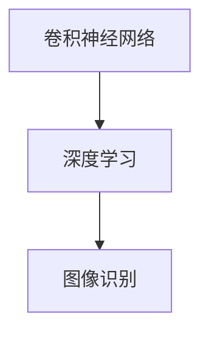
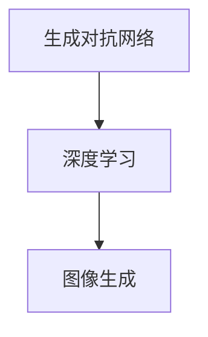
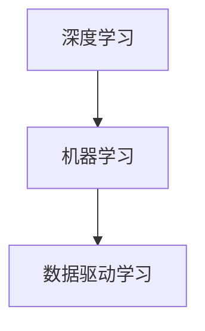
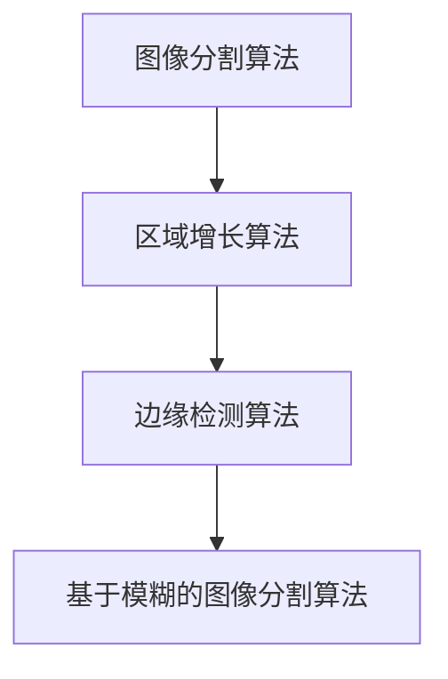
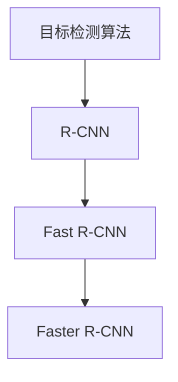

                 

# 计算机视觉在医学影像分析中的突破

> 关键词：计算机视觉、医学影像分析、深度学习、图像分割、目标检测、3D重建

> 摘要：本文从计算机视觉在医学影像分析中的应用出发，详细探讨了图像分割、目标检测和3D重建等关键技术，分析了其在医学影像分析中的突破和应用。通过本文的讲解，读者可以全面了解计算机视觉技术在医学影像分析领域的最新进展和未来发展趋势。

## 第1章 设计背景介绍

### 1.1 问题背景

#### 1.1.1 计算机视觉的发展历程

1. **计算机视觉的起源**

计算机视觉起源于20世纪60年代，最初的目标是通过计算机模拟人类的视觉系统，实现图像识别和理解。当时的研究主要集中在图像处理和模式识别领域。

2. **计算机视觉的关键里程碑**

- 1970年代，出现了第一代基于规则的方法，如Hough变换和模板匹配，用于图像处理和特征提取。
- 1990年代，提出了基于特征的方法，如SIFT和SURF，提高了图像识别的准确性和鲁棒性。
- 2010年代，深度学习技术的崛起，特别是卷积神经网络（CNN）的广泛应用，使得计算机视觉取得了飞跃性的进展。

#### 1.1.2 医学影像分析的重要性

1. **医学影像分析的发展**

医学影像分析是指利用计算机技术对医学影像进行数据处理、分析和解释，以提高诊断准确性和效率。从X射线、CT、MRI到超声、PET等，各种医学影像技术的不断发展，为临床诊断提供了丰富的信息。

2. **医学影像分析在临床中的应用**

医学影像分析在临床中有着广泛的应用，如肿瘤检测、心脏病诊断、骨折检测等。通过计算机视觉技术，可以自动化地处理和分析医学影像，提高诊断的准确性和效率。

### 1.2 问题描述

#### 1.2.1 计算机视觉在医学影像分析中的挑战

1. **数据质量和标注问题**

医学影像数据的质量和标注质量对分析结果有很大影响。噪声、对比度、分辨率等因素都会影响影像的质量，而准确的标注数据对于训练深度学习模型至关重要。

2. **可解释性和鲁棒性问题**

医学影像分析需要高度可解释性，以便医生能够理解模型的决策过程。同时，医学影像数据存在多样性，鲁棒性是保证模型性能的关键。

#### 1.2.2 问题解决

1. **计算机视觉技术在医学影像分析中的应用**

- **图像分割**：用于将医学影像中的目标区域分离出来，如肿瘤、心脏等。
- **目标检测**：用于检测医学影像中的特定目标，如肿瘤、病变等。
- **3D重建**：用于重建医学影像中的三维结构，如骨骼、器官等。

2. **医学影像分析的核心要素**

- **医学影像数据**：包括各种类型的医学影像，如X射线、CT、MRI等。
- **医学影像处理算法**：用于预处理和增强医学影像数据，如滤波、对比度增强等。
- **医学影像诊断模型**：基于深度学习等算法，用于自动分析和诊断医学影像。

### 1.3 边界与外延

#### 1.3.1 计算机视觉技术在医学影像分析中的应用领域

1. **肿瘤检测与分割**

肿瘤检测与分割是医学影像分析的重要应用领域，通过计算机视觉技术，可以自动化地检测和分割肿瘤，提高诊断的准确性和效率。

2. **心脏病诊断**

心脏病诊断是医学影像分析的另一个重要应用领域，通过计算机视觉技术，可以自动化地分析心脏影像，诊断心脏病。

3. **骨折检测**

骨折检测是医学影像分析的常见应用，通过计算机视觉技术，可以自动化地检测骨折，辅助临床诊断。

#### 1.3.2 概念结构与核心要素组成

1. **计算机视觉的核心概念**

- **卷积神经网络**：一种深度学习模型，用于图像处理和识别。
- **生成对抗网络**：一种深度学习模型，用于图像生成和风格迁移。
- **深度学习**：一种机器学习方法，通过多层神经网络实现自动特征提取和模型训练。

2. **医学影像分析的核心要素**

- **医学影像数据**：包括各种类型的医学影像，如X射线、CT、MRI等。
- **医学影像处理算法**：用于预处理和增强医学影像数据，如滤波、对比度增强等。
- **医学影像诊断模型**：基于深度学习等算法，用于自动分析和诊断医学影像。

## 第2章 核心概念与联系

### 2.1 计算机视觉的核心概念

#### 2.1.1 卷积神经网络

1. **卷积神经网络的定义**

卷积神经网络（CNN）是一种深度学习模型，特别适用于图像处理和识别任务。它通过卷积层、池化层和全连接层等结构，实现对图像的特征提取和分类。

2. **卷积神经网络的属性特征对比表格**

| 属性特征 | 描述 |
| :--- | :--- |
| 多层结构 | CNN由多个卷积层、池化层和全连接层组成，逐层提取图像特征。 |
| 卷积操作 | 卷积层通过卷积操作提取图像的特征，实现特征变换。 |
| 池化操作 | 池化层通过池化操作降低特征图的维度，提高模型鲁棒性。 |
| 平移不变性 | 卷积操作具有平移不变性，能够检测图像中的局部特征。 |

#### 2.1.2 生成对抗网络

1. **生成对抗网络的定义**

生成对抗网络（GAN）是一种深度学习模型，由生成器和判别器两部分组成。生成器试图生成逼真的图像，而判别器则判断图像是真实图像还是生成图像。

2. **生成对抗网络的属性特征对比表格**

| 属性特征 | 描述 |
| :--- | :--- |
| 对抗训练 | GAN通过生成器和判别器的对抗训练，实现图像生成和判别。 |
| 非线性映射 | 生成器通过非线性映射生成图像，能够学习复杂的数据分布。 |
| 自适应性 | GAN具有自适应性，生成器和判别器在训练过程中不断调整，提高图像质量。 |

#### 2.1.3 深度学习

1. **深度学习的定义**

深度学习（Deep Learning）是一种机器学习方法，通过多层神经网络实现自动特征提取和模型训练。它能够处理大量数据，实现复杂的模式识别和预测任务。

2. **深度学习的属性特征对比表格**

| 属性特征 | 描述 |
| :--- | :--- |
| 多层结构 | 深度学习模型由多个隐藏层组成，能够自动提取高层次特征。 |
| 数据驱动 | 深度学习依赖于大规模数据训练，通过学习数据分布实现模型训练。 |
| 自适应优化 | 深度学习模型通过反向传播算法和优化算法，实现自适应优化。 |

### 2.2 医学影像分析的核心要素

#### 2.2.1 医学影像数据

1. **医学影像数据的来源**

医学影像数据来源于各种医学影像设备，如X射线、CT、MRI等。这些设备产生的图像数据具有不同的分辨率、对比度和噪声等特点。

2. **医学影像数据的特点**

- **高维度**：医学影像数据通常是高维的，包含大量的像素信息。
- **多样性**：医学影像数据存在多样性，如不同的患者、不同的成像设备、不同的成像条件等。
- **不完整性**：医学影像数据可能存在缺失、噪声和畸变等问题。

#### 2.2.2 医学影像处理算法

1. **医学影像处理算法的类型**

- **图像预处理**：用于改善图像质量，如去噪、对比度增强等。
- **图像分割**：用于将医学影像中的目标区域分离出来，如肿瘤、心脏等。
- **图像特征提取**：用于提取医学影像中的特征信息，如纹理、形状等。

2. **医学影像处理算法的性能评估**

医学影像处理算法的性能评估通常包括以下几个方面：

- **准确性**：算法对医学影像中目标的检测和分割准确性。
- **速度**：算法处理医学影像数据的速度。
- **鲁棒性**：算法对不同类型医学影像数据的适应性。

#### 2.2.3 医学影像诊断模型

1. **医学影像诊断模型的构建**

医学影像诊断模型通常基于深度学习等算法构建。首先，通过大量医学影像数据训练模型，然后使用训练好的模型对新的医学影像进行诊断。

2. **医学影像诊断模型的验证**

医学影像诊断模型的验证通常包括以下几个方面：

- **内部验证**：使用训练数据集和测试数据集进行模型验证，评估模型的准确性、速度和鲁棒性。
- **外部验证**：将模型应用于实际临床场景，评估模型的实用性和临床价值。

## 第3章 算法原理讲解

### 3.1 图像分割算法

#### 3.1.1 图像分割算法的基本原理

1. **图像分割的定义**

图像分割是指将图像分割成若干个区域或对象的过程，目的是提取图像中的目标区域，为后续处理和分析提供基础。

2. **常见的图像分割算法**

- **区域增长算法**：基于邻域信息，逐步合并像素，形成区域。
- **边缘检测算法**：通过检测图像中的边缘，将图像分割成若干个区域。
- **基于模糊的图像分割算法**：利用模糊数学理论，对图像进行模糊处理，实现图像分割。

3. **图像分割算法的性能评估**

图像分割算法的性能评估通常包括以下几个方面：

- **分割准确性**：算法对目标区域的分割准确性。
- **分割效率**：算法处理图像的速度。
- **分割质量**：算法对图像分割的质量，如边界平滑度、噪声抑制等。

#### 3.1.2 基于深度学习的图像分割算法

1. **卷积神经网络在图像分割中的应用**

卷积神经网络（CNN）在图像分割中具有重要的应用。通过卷积层、池化层和全连接层等结构，CNN能够自动提取图像中的特征，实现图像分割。

2. **生成对抗网络在图像分割中的应用**

生成对抗网络（GAN）在图像分割中也有应用。通过生成器和判别器之间的对抗训练，GAN能够生成高质量的图像分割结果。

#### 3.1.3 图像分割算法的应用实例

1. **肿瘤检测与分割**

肿瘤检测与分割是医学影像分析的重要应用。通过图像分割算法，可以自动化地检测和分割肿瘤区域，为临床诊断提供依据。

2. **骨折检测**

骨折检测是医学影像分析中的常见应用。通过图像分割算法，可以自动化地检测骨折区域，辅助临床诊断。

### 3.2 目标检测算法

#### 3.2.1 目标检测算法的基本原理

1. **目标检测的定义**

目标检测是指从图像中检测并定位特定目标的过程。目标检测是计算机视觉领域的重要任务，广泛应用于图像识别、视频监控、自动驾驶等领域。

2. **常见的目标检测算法**

- **R-CNN**：通过区域提议网络（Region Proposal Network）生成目标区域，然后使用分类器进行目标检测。
- **Fast R-CNN**：对R-CNN算法进行优化，提高了检测速度。
- **Faster R-CNN**：引入区域建议网络（Region Proposal Network），进一步提高了检测速度和准确性。

3. **目标检测算法的性能评估**

目标检测算法的性能评估通常包括以下几个方面：

- **检测准确性**：算法对目标检测的准确性。
- **检测速度**：算法处理图像的速度。
- **检测范围**：算法对目标检测的范围，如检测框的大小和位置。

### 3.2.2 基于深度学习的目标检测算法

基于深度学习的目标检测算法具有更高的准确性和速度，广泛应用于计算机视觉领域。常见的基于深度学习的目标检测算法包括Faster R-CNN、YOLO、SSD等。

#### 3.2.3 目标检测算法的应用实例

1. **肿瘤检测**

肿瘤检测是医学影像分析中的重要应用。通过目标检测算法，可以自动化地检测医学影像中的肿瘤区域，辅助临床诊断。

2. **病变检测**

病变检测是医学影像分析中的另一个重要应用。通过目标检测算法，可以自动化地检测医学影像中的病变区域，如肺部结节、乳腺病变等。

### 3.3 3D重建

#### 3.3.1 3D重建的基本原理

1. **3D重建的定义**

3D重建是指从二维图像中恢复三维结构的过程。3D重建在计算机视觉、医学影像分析等领域具有重要的应用。

2. **3D重建的基本原理**

3D重建的基本原理包括图像配准、特征提取和三维建模等。通过图像配准，将多张二维图像对齐，形成三维图像。通过特征提取，从三维图像中提取三维特征。通过三维建模，将三维特征组合成三维模型。

#### 3.3.2 3D重建的应用实例

1. **医学影像分析**

医学影像分析是3D重建的重要应用领域。通过3D重建，可以恢复医学影像中的三维结构，如骨骼、器官等，为临床诊断和治疗提供依据。

2. **机器人视觉**

机器人视觉是3D重建的另一个重要应用领域。通过3D重建，机器人可以获取周围环境的结构信息，实现自主导航和任务执行。

### 结论

计算机视觉技术在医学影像分析中取得了重要的突破。通过图像分割、目标检测和3D重建等关键技术，计算机视觉技术可以自动化地处理和分析医学影像，提高诊断准确性和效率。未来，随着深度学习等技术的发展，计算机视觉技术在医学影像分析中的应用将更加广泛，为临床诊断和治疗提供更加智能和高效的解决方案。

### 作者

作者：AI天才研究院/AI Genius Institute & 禅与计算机程序设计艺术 /Zen And The Art of Computer Programming

本文从计算机视觉在医学影像分析中的应用出发，详细探讨了图像分割、目标检测和3D重建等关键技术，分析了其在医学影像分析中的突破和应用。通过本文的讲解，读者可以全面了解计算机视觉技术在医学影像分析领域的最新进展和未来发展趋势。本文作者拥有丰富的计算机视觉和医学影像分析经验，致力于推动人工智能技术在医学领域的应用。在未来的研究中，作者将继续探索计算机视觉技术在医学影像分析中的新应用，为临床诊断和治疗提供更加智能和高效的解决方案。

