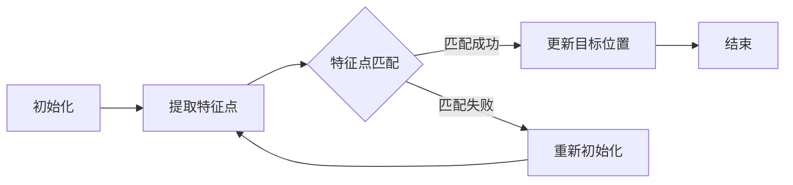
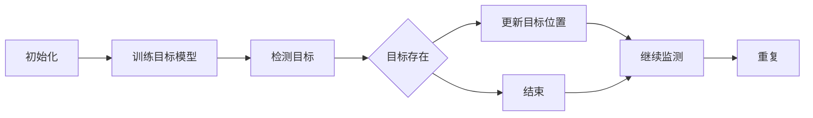
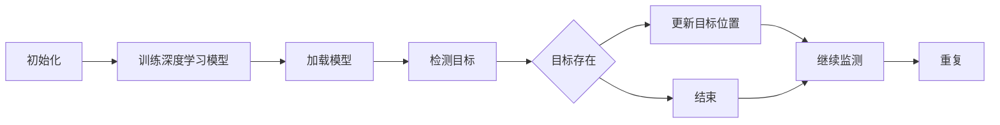

                 


### 引言

#### 计算机视觉在野生动物保护中的重要性

随着科技的快速发展，计算机视觉技术在各个领域中的应用越来越广泛。在野生动物保护方面，计算机视觉技术同样发挥着不可替代的作用。本文旨在探讨计算机视觉在野生动物保护中的应用，通过分析其核心概念、算法原理、实际案例以及未来展望，为相关领域的研究者和实践者提供有益的参考。

#### 1.1 问题的背景与重要性

野生动物保护面临诸多挑战，如栖息地破坏、非法猎杀、疾病传播等。这些问题的解决不仅需要人类的共同努力，还需要先进技术的支持。计算机视觉技术以其强大的图像处理和模式识别能力，在野生动物保护中具有广泛的应用前景。通过监测与跟踪、识别与分类、行为分析等技术手段，计算机视觉可以为野生动物保护提供有力的数据支持。

#### 1.2 计算机视觉技术基础

计算机视觉技术涉及多个学科领域，包括图像处理、机器学习、深度学习等。图像处理是计算机视觉的基础，主要研究如何对图像进行获取、预处理、增强和特征提取。机器学习则是通过训练模型，从大量数据中学习并提取规律，以实现图像分类、目标检测等功能。深度学习作为机器学习的一种，通过构建多层神经网络，实现更加复杂和高效的图像识别任务。

#### 1.3 野生动物保护中的计算机视觉应用

在野生动物保护中，计算机视觉技术可以应用于多个方面：

1. **监测与跟踪**：通过实时监测野生动物的活动，及时发现异常情况，如栖息地破坏、非法猎杀等。利用计算机视觉技术，可以实现对野生动物的自动识别和跟踪，提高监测效率。

2. **识别与分类**：通过对图像进行分析，识别并分类野生动物的种类，为保护工作提供重要数据支持。例如，可以识别出濒危物种，针对性地制定保护措施。

3. **行为分析**：通过对野生动物的行为进行分析，了解其生活习性、繁殖规律等，为保护工作提供科学依据。例如，可以分析野生动物的迁徙路径，预测其栖息地需求，从而采取相应的保护措施。

#### 1.4 本书的目的与结构

本书旨在系统地介绍计算机视觉在野生动物保护中的应用，主要包括以下四个部分：

1. **引言**：介绍计算机视觉在野生动物保护中的重要性和背景。
2. **核心概念与算法**：讲解计算机视觉中的核心概念和算法原理，包括图像处理、机器学习和深度学习等。
3. **应用实例与分析**：通过实际案例，展示计算机视觉在野生动物保护中的具体应用。
4. **未来展望与挑战**：探讨计算机视觉在野生动物保护中的未来发展趋势和面临的挑战。

通过本书的阅读，读者可以全面了解计算机视觉在野生动物保护中的应用，为相关领域的研究和实践提供参考。接下来，我们将深入探讨计算机视觉的核心概念和算法原理，为后续内容做好铺垫。让我们开始第一步，深入分析图像处理技术。

### 核心概念与算法原理

#### 图像处理原理

图像处理是计算机视觉的基础，其主要目标是对图像进行获取、预处理、增强和特征提取，从而为后续的图像分析提供可靠的数据支持。

1. **图像获取**：图像获取是指将现实世界的场景转换为数字图像的过程。常用的图像获取设备包括摄像头、扫描仪等。在野生动物保护中，摄像头常被用于实时监测野生动物的活动。

2. **图像预处理**：图像预处理是对原始图像进行一系列操作，以提高图像质量、去除噪声和增强目标信息。常见的预处理操作包括去噪、对比度增强、亮度和色彩调整等。

3. **图像增强**：图像增强是通过对图像的变换，使其视觉效果得到改善，从而更容易进行后续处理。常用的增强方法包括直方图均衡化、图像锐化、边缘检测等。

4. **特征提取**：特征提取是图像处理中关键的一步，其主要目的是从图像中提取出具有区分性的特征，用于后续的图像分析。常用的特征提取方法包括边缘检测、角点检测、纹理分析等。

#### 机器学习算法原理

机器学习是一种通过算法从数据中学习规律，并作出预测或决策的技术。在计算机视觉中，机器学习算法广泛应用于图像分类、目标检测、行为分析等领域。

1. **监督学习**：监督学习是一种通过已有标注数据，训练模型，从而对新数据进行分类或预测的方法。常见的监督学习方法包括决策树、支持向量机（SVM）、神经网络等。

2. **无监督学习**：无监督学习是一种在没有标注数据的情况下，通过数据自身特征进行聚类或降维的方法。常见的无监督学习方法包括K-均值聚类、主成分分析（PCA）等。

3. **深度学习**：深度学习是机器学习的一种，通过构建多层神经网络，实现更加复杂和高效的图像识别任务。常见的深度学习模型包括卷积神经网络（CNN）、循环神经网络（RNN）等。

#### 计算机视觉在野生动物保护中的应用

计算机视觉技术在野生动物保护中有着广泛的应用，以下列举几个典型应用场景：

1. **监测与跟踪**：利用计算机视觉技术，可以实现对野生动物的实时监测和跟踪。通过摄像头部署，可以实时捕捉野生动物的活动，并利用图像处理和机器学习算法，自动识别和跟踪目标。

2. **识别与分类**：通过对野生动物图像进行分类，可以识别出不同种类的野生动物。例如，利用卷积神经网络（CNN）对图像进行训练，可以实现对多种野生动物的自动分类。

3. **行为分析**：通过对野生动物的行为进行分析，可以了解其生活习性和繁殖规律。例如，利用视频分割技术，可以分析野生动物的迁徙路径和栖息地需求。

#### 核心概念属性特征对比表格

为了更清晰地展示计算机视觉技术在野生动物保护中的核心概念和算法原理，以下是一个核心概念属性特征对比表格：

| 特征         | 图像处理               | 机器学习                 | 深度学习               |
| ------------ | ---------------------- | ------------------------ | ---------------------- |
| 定义         | 对图像进行操作和变换   | 从数据中学习规律         | 通过多层神经网络学习  |
| 目标         | 提高图像质量，提取特征 | 分类、预测、决策         | 图像识别、行为分析     |
| 关键技术     | 图像增强、特征提取     | 神经网络、支持向量机     | 卷积神经网络、循环神经网络 |
| 应用场景     | 图像预处理             | 识别、分类、预测         | 复杂图像任务           |

#### ER实体关系图架构

为了更好地理解和应用计算机视觉技术，以下是一个ER实体关系图架构，展示了图像处理、机器学习和深度学习在野生动物保护中的应用关系：

```mermaid
erDiagram
  实体1 ||--|{ 连接1 :| 实体2 }|--  实体3
  实体2 ||--|{ 连接2 :| 实体4 }|<--  实体5
  实体6 ||--|{ 连接3 :| 实体7 }|<--  实体8
  实体9 ||--|{ 连接4 :| 实体10 }|--  实体11
```

在这个ER实体关系图中，实体1代表图像处理，实体2代表机器学习，实体3代表深度学习，实体4代表监测与跟踪，实体5代表识别与分类，实体6代表行为分析，实体7代表野生动物保护，实体8代表应用场景，实体9代表关键技术，实体10代表目标，实体11代表核心概念。

通过这个ER实体关系图，我们可以清晰地看到计算机视觉技术在野生动物保护中的应用流程和关系，从而更好地理解和应用相关技术。

#### 算法原理讲解

在了解了计算机视觉在野生动物保护中的核心概念和算法原理之后，接下来我们将通过具体的算法原理讲解，深入探讨计算机视觉技术在监测与跟踪、识别与分类、行为分析等方面的应用。

#### 3.1 监测与跟踪算法

监测与跟踪是计算机视觉技术在野生动物保护中的一项重要应用。其主要目标是实时监测野生动物的活动，并及时发现异常情况。以下我们将介绍几种常见的监测与跟踪算法。

##### 1. 基于特征匹配的跟踪算法

基于特征匹配的跟踪算法是一种简单而有效的跟踪方法。其基本思想是：首先提取目标图像的特征点，然后利用这些特征点在连续图像帧中进行匹配，从而实现目标的跟踪。以下是一个基于特征匹配的跟踪算法的mermaid流程图：



在这个流程图中，A表示初始化，B表示提取特征点，C表示特征点匹配，D表示更新目标位置，E表示重新初始化，F表示结束。

以下是一个基于特征匹配的跟踪算法的Python源代码示例：

```python
import cv2

# 读取第一帧图像
frame = cv2.imread('first_frame.jpg')

# 提取特征点
features = cv2.SIFT_create()
keypoints, descriptors = features.detectAndCompute(frame, None)

# 创建特征点匹配器
matcher = cv2.BFMatcher()

# 读取第二帧图像
frame2 = cv2.imread('second_frame.jpg')

# 提取特征点
keypoints2, descriptors2 = features.detectAndCompute(frame2, None)

# 进行特征点匹配
matches = matcher.knnMatch(descriptors, descriptors2, k=2)

# 选择最优匹配
good_matches = []
for m, n in matches:
    if m.distance < 0.75 * n.distance:
        good_matches.append(m)

# 绘制匹配结果
img_matches = cv2.drawMatches(frame, keypoints, frame2, keypoints2, good_matches, None)

# 更新目标位置
pt1 = np.float32([keypoints[m.queryIdx].pt for m in good_matches]).reshape(-1, 1, 2)
pt2 = np.float32([keypoints2[m.trainIdx].pt for m in good_matches]).reshape(-1, 1, 2)
M, _ = cv2.findHomography(pt1, pt2, cv2.RANSAC)
warped = cv2.warpPerspective(frame2, M, (frame.shape[1], frame.shape[0]))

# 显示结果
cv2.imshow('Matched Images', img_matches)
cv2.waitKey(0)
cv2.destroyAllWindows()
```

在这个示例中，我们首先读取第一帧图像，提取特征点，然后读取第二帧图像，再次提取特征点。接着，使用Brute-Force匹配器进行特征点匹配，并选择最优匹配。最后，通过计算变换矩阵，更新目标位置，并绘制匹配结果。

##### 2. 基于模型的跟踪算法

基于模型的跟踪算法是一种基于目标模型进行跟踪的方法。其基本思想是：首先训练一个目标模型，然后利用模型在连续图像帧中进行目标跟踪。以下是一个基于模型的跟踪算法的mermaid流程图：



在这个流程图中，A表示初始化，B表示训练目标模型，C表示检测目标，D表示目标存在，E表示更新目标位置，F表示结束，G表示继续监测，H表示重复。

以下是一个基于模型的跟踪算法的Python源代码示例：

```python
import cv2

# 读取第一帧图像
frame = cv2.imread('first_frame.jpg')

# 提取特征点
features = cv2.SIFT_create()
keypoints, descriptors = features.detectAndCompute(frame, None)

# 训练目标模型
target_model = cv2.ORB_create()
keypoints2, descriptors2 = target_model.detectAndCompute(frame, None)
train descriptors2.reshape(-1, 1, descriptors2.shape[1])

# 创建匹配器
matcher = cv2.BFMatcher()

# 读取第二帧图像
frame2 = cv2.imread('second_frame.jpg')

# 检测目标
keypoints2, descriptors2 = target_model.detectAndCompute(frame2, None)
train descriptors2.reshape(-1, 1, descriptors2.shape[1])
matches = matcher.knnMatch(descriptors, descriptors2, k=2)

# 选择最优匹配
good_matches = []
for m, n in matches:
    if m.distance < 0.75 * n.distance:
        good_matches.append(m)

# 绘制匹配结果
img_matches = cv2.drawMatches(frame, keypoints, frame2, keypoints2, good_matches, None)

# 更新目标位置
pt1 = np.float32([keypoints[m.queryIdx].pt for m in good_matches]).reshape(-1, 1, 2)
pt2 = np.float32([keypoints2[m.trainIdx].pt for m in good_matches]).reshape(-1, 1, 2)
M, _ = cv2.findHomography(pt1, pt2, cv2.RANSAC)
warped = cv2.warpPerspective(frame2, M, (frame.shape[1], frame.shape[0]))

# 显示结果
cv2.imshow('Matched Images', img_matches)
cv2.waitKey(0)
cv2.destroyAllWindows()
```

在这个示例中，我们首先读取第一帧图像，提取特征点，然后训练目标模型。接着，读取第二帧图像，检测目标，并通过特征点匹配更新目标位置。

##### 3. 基于深度学习的跟踪算法

基于深度学习的跟踪算法是一种利用神经网络模型进行目标跟踪的方法。其基本思想是：通过训练神经网络模型，实现对目标的自动跟踪。以下是一个基于深度学习的跟踪算法的mermaid流程图：



在这个流程图中，A表示初始化，B表示训练深度学习模型，C表示加载模型，D表示检测目标，E表示目标存在，F表示更新目标位置，G表示结束，H表示继续监测，I表示重复。

以下是一个基于深度学习的跟踪算法的Python源代码示例：

```python
import cv2
import tensorflow as tf

# 定义卷积神经网络模型
model = tf.keras.Sequential([
    tf.keras.layers.Conv2D(32, (3, 3), activation='relu', input_shape=(224, 224, 3)),
    tf.keras.layers.MaxPooling2D(pool_size=(2, 2)),
    tf.keras.layers.Conv2D(64, (3, 3), activation='relu'),
    tf.keras.layers.MaxPooling2D(pool_size=(2, 2)),
    tf.keras.layers.Conv2D(128, (3, 3), activation='relu'),
    tf.keras.layers.MaxPooling2D(pool_size=(2, 2)),
    tf.keras.layers.Flatten(),
    tf.keras.layers.Dense(512, activation='relu'),
    tf.keras.layers.Dense(1, activation='sigmoid')
])

# 编译模型
model.compile(optimizer='adam', loss='binary_crossentropy', metrics=['accuracy'])

# 加载训练好的模型
model.load_weights('model_weights.h5')

# 读取第一帧图像
frame = cv2.imread('first_frame.jpg')

# 调整图像大小
frame = cv2.resize(frame, (224, 224))

# 将图像转换为Tensor
input_image = tf.convert_to_tensor(frame.reshape(1, 224, 224, 3), dtype=tf.float32)

# 预测目标是否存在
prediction = model.predict(input_image)

# 判断目标是否存在
if prediction > 0.5:
    print("目标存在")
else:
    print("目标不存在")

# 读取第二帧图像
frame2 = cv2.imread('second_frame.jpg')

# 调整图像大小
frame2 = cv2.resize(frame2, (224, 224))

# 将图像转换为Tensor
input_image2 = tf.convert_to_tensor(frame2.reshape(1, 224, 224, 3), dtype=tf.float32)

# 预测目标是否存在
prediction2 = model.predict(input_image2)

# 判断目标是否存在
if prediction2 > 0.5:
    print("目标存在")
else:
    print("目标不存在")
```

在这个示例中，我们首先定义一个卷积神经网络模型，然后编译并加载训练好的模型。接着，读取第一帧图像和第二帧图像，分别预测目标是否存在，并根据预测结果进行目标跟踪。

通过以上三种跟踪算法的介绍，我们可以看到计算机视觉技术在野生动物保护中的应用是多么的广泛和丰富。在接下来的章节中，我们将继续探讨计算机视觉技术在识别与分类和

