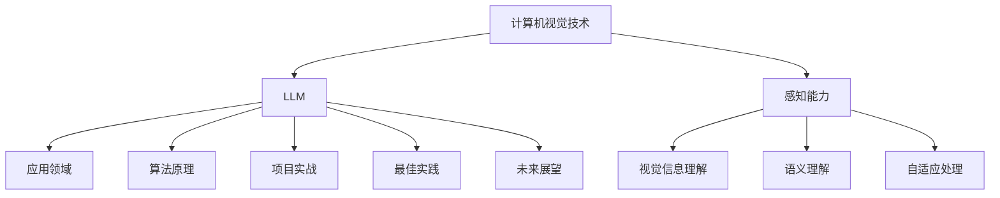
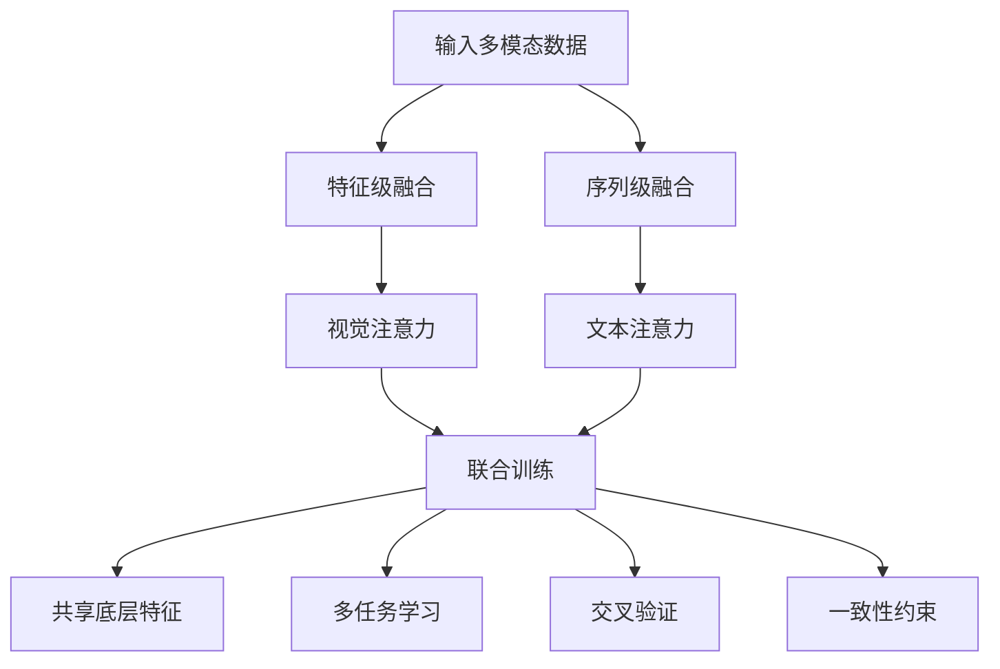

                 

### 第1章：引言

#### 1.1 问题背景

随着深度学习和人工智能的快速发展，计算机视觉技术已经成为智能系统中的一个关键组成部分。然而，传统计算机视觉技术在处理复杂场景和动态环境时存在感知能力不足的问题。近年来，大型语言模型（LLM）在自然语言处理领域取得了显著进展，其强大的语义理解能力和自适应学习能力引起了广泛关注。

在自然语言处理方面，LLM如GPT-3和BERT等模型已经展示了其在生成文本、问答系统、机器翻译等任务上的卓越性能。然而，这些模型在处理视觉信息时，其表现却相对有限。计算机视觉技术在图像识别、目标检测、图像生成等方面取得了巨大的进步，但如何将这些技术有效整合到LLM中，以提高其感知能力，成为了一个亟待解决的重要问题。

#### 1.2 问题描述

如何利用计算机视觉技术拓展LLM的应用，提升其在感知环境、理解语义和生成响应方面的能力，成为一个亟待解决的重要问题。这涉及到多个领域的技术融合，包括计算机视觉、自然语言处理、机器学习和人工智能等。

具体来说，问题描述如下：

- **问题一**：如何将计算机视觉技术中的图像和视频信息有效输入到LLM中，使其能够理解和利用这些视觉信息？

- **问题二**：如何使LLM在处理视觉信息时，能够保持其语义理解能力，并能够自适应地调整其处理策略？

- **问题三**：如何评估和优化LLM在处理视觉信息时的性能，包括准确性、效率和鲁棒性等指标？

#### 1.3 解决方法概述

本书将从理论到实践，详细探讨计算机视觉技术拓展LLM应用的感知能力。首先，我们将介绍计算机视觉和LLM技术的基本概念和发展历程。然后，深入分析计算机视觉技术拓展LLM应用的理论基础和算法原理。接着，通过实际项目实战，展示如何将理论应用于实际场景。最后，总结最佳实践，并提出未来研究方向。

#### 1.4 边界与外延

本书主要关注计算机视觉技术如何拓展LLM的感知能力，探讨的方法和技术将主要应用于智能交互、自动驾驶、图像识别和视频分析等领域。同时，本书也将探讨相关技术的局限性，以及如何在未来发展中克服这些挑战。

#### 1.5 概念结构与核心要素组成

本章的核心概念包括计算机视觉技术、LLM、感知能力和应用领域。核心要素包括算法原理、项目实战、最佳实践和未来展望。以下是一个简单的ER实体关系图架构的Mermaid流程图，用于描述这些核心概念之间的关系：



通过以上分析，我们可以看出，计算机视觉技术和LLM的结合，将大大提升智能系统的感知能力和应用范围。接下来，我们将逐步深入探讨这些核心概念，并详细分析其原理和应用。

---

### 第2章：计算机视觉技术概述

#### 2.1 计算机视觉技术发展历程

计算机视觉技术的发展历程可以追溯到20世纪60年代，当时计算机科学家们开始探索如何使计算机理解和解释图像。早期的计算机视觉研究主要集中在图像处理和特征提取技术上，如边缘检测、角点检测和纹理分析等。

随着计算能力的提高和算法的进步，20世纪90年代，计算机视觉技术进入了快速发展阶段。这一时期，出现了许多重要的算法和技术，如SIFT和SURF特征提取算法、霍夫变换和光流法等。这些技术的出现，使得计算机能够在更复杂的场景下进行图像理解和分析。

进入21世纪，深度学习的兴起为计算机视觉带来了新的机遇。深度学习模型，如卷积神经网络（CNN）和循环神经网络（RNN），在图像分类、目标检测和图像生成等领域取得了突破性的成果。特别是，随着GPU等硬件加速器的普及，深度学习模型能够在大规模数据集上进行训练，进一步推动了计算机视觉技术的发展。

#### 2.2 计算机视觉技术核心概念

计算机视觉技术涉及多个核心概念，包括图像处理、特征提取、目标检测、图像识别和图像生成等。

- **图像处理**：图像处理是计算机视觉的基础技术，包括图像的增强、滤波、分割和特征提取等操作。这些操作有助于改善图像质量，提取有用的信息。

- **特征提取**：特征提取是将图像或视频中的关键信息提取出来，以便后续的图像分析和理解。常见的特征提取方法包括SIFT、SURF和HOG等。

- **目标检测**：目标检测是计算机视觉中的一个重要任务，目的是从图像或视频中识别出特定的对象。常见的目标检测算法包括YOLO、SSD和Faster R-CNN等。

- **图像识别**：图像识别是计算机视觉中的一个高层次任务，目的是将图像或视频中的对象分类到特定的类别中。常见的图像识别算法包括CNN和卷积神经网络等。

- **图像生成**：图像生成是计算机视觉中的一个新兴领域，目的是通过算法生成新的图像或视频。常见的图像生成技术包括生成对抗网络（GAN）和变分自编码器（VAE）等。

#### 2.3 计算机视觉技术的应用领域

计算机视觉技术在许多领域都有广泛的应用，包括医疗、工业、交通、娱乐和军事等。

- **医疗领域**：计算机视觉技术在医疗领域有广泛的应用，如医学图像分析、疾病诊断和手术辅助等。例如，通过计算机视觉技术，可以自动分析医学图像，帮助医生快速诊断疾病。

- **工业领域**：计算机视觉技术在工业领域有重要的应用，如自动化生产、质量控制和安全监控等。例如，通过计算机视觉技术，可以实现自动化的产品质量检测和生产流程优化。

- **交通领域**：计算机视觉技术在交通领域有广泛的应用，如自动驾驶、交通监控和车辆检测等。例如，通过计算机视觉技术，可以实现自动驾驶汽车的路径规划和交通流量监测。

- **娱乐领域**：计算机视觉技术在娱乐领域有重要的应用，如虚拟现实（VR）和增强现实（AR）等。例如，通过计算机视觉技术，可以实现沉浸式的虚拟现实体验。

- **军事领域**：计算机视觉技术在军事领域有重要的应用，如目标识别、战场监控和无人机控制等。例如，通过计算机视觉技术，可以实现无人机的自主飞行和目标识别。

#### 2.4 计算机视觉技术挑战与机遇

尽管计算机视觉技术取得了巨大的进步，但仍面临许多挑战和机遇。

- **挑战**：

  - **计算资源限制**：深度学习模型通常需要大量的计算资源，这对硬件设备提出了较高的要求。

  - **数据标注和质量**：计算机视觉模型通常需要大量的标注数据进行训练，数据标注的质量直接影响模型的性能。

  - **实时性和鲁棒性**：在实际应用中，计算机视觉系统需要在实时性和鲁棒性之间做出权衡。

- **机遇**：

  - **人工智能与物联网**：随着人工智能和物联网技术的发展，计算机视觉技术将有更多的应用场景。

  - **边缘计算**：边缘计算可以减轻中心数据中心的负担，提高计算机视觉系统的实时性和鲁棒性。

  - **跨学科融合**：计算机视觉技术的跨学科融合，如与自然语言处理、机器人技术和自动驾驶技术的结合，将带来更多的创新和应用。

通过以上分析，我们可以看到，计算机视觉技术在不断发展中，正面临着新的机遇和挑战。接下来，我们将进一步探讨大型语言模型（LLM）的技术概述，以及它们在计算机视觉技术拓展中的应用。

---

### 第3章：LLM技术概述

#### 3.1 LLM技术的发展历程

大型语言模型（LLM）的发展历程可以追溯到20世纪50年代，当时计算机科学家开始探索如何使计算机理解和生成自然语言。最早的尝试包括基于规则的系统和统计模型，但这些方法在处理复杂语言现象时存在局限性。

进入21世纪，深度学习的兴起为自然语言处理带来了革命性的变化。特别是，基于变换器架构（Transformer）的模型，如BERT、GPT和T5等，在自然语言处理任务中取得了显著成果。这些模型通过大规模的预训练和细粒度的优化，展现了强大的语义理解和生成能力。

#### 3.2 LLM技术核心概念

LLM技术涉及多个核心概念，包括自然语言处理（NLP）、预训练、微调和生成等。

- **自然语言处理（NLP）**：自然语言处理是使计算机能够理解、生成和处理自然语言的技术。常见的NLP任务包括文本分类、命名实体识别、情感分析和机器翻译等。

- **预训练**：预训练是LLM的核心技术之一，通过在大量未标注的文本数据上进行训练，模型可以学习到语言的通用特性。预训练后的模型可以用于各种下游任务，如文本分类、问答系统和机器翻译等。

- **微调**：微调是在预训练模型的基础上，利用特定任务的数据对模型进行细粒度的优化。微调有助于模型更好地适应特定任务，提高其在特定领域的表现。

- **生成**：生成是LLM的重要功能之一，模型可以根据输入的文本生成新的文本。生成任务包括文本生成、对话系统和摘要生成等。

#### 3.3 LLM技术的应用领域

LLM技术广泛应用于多个领域，包括自然语言处理、智能客服、内容生成和智能助手等。

- **自然语言处理**：LLM在自然语言处理任务中表现出色，如文本分类、情感分析和机器翻译等。通过预训练和微调，LLM可以处理各种复杂的语言现象，提供高质量的输出。

- **智能客服**：LLM技术可以用于智能客服系统，实现与用户的自然语言交互。智能客服系统可以根据用户的提问，生成适当的回答，提高用户体验和效率。

- **内容生成**：LLM可以用于生成各种类型的内容，如文章、报告和诗歌等。通过大规模的预训练和微调，LLM可以学习到不同领域的内容生成规则，提高生成内容的多样性和准确性。

- **智能助手**：LLM技术可以用于智能助手系统，实现与用户的自然语言交互。智能助手可以根据用户的需求，提供相应的帮助和建议，提高用户的生活和工作效率。

#### 3.4 LLM技术面临的挑战与机遇

尽管LLM技术在多个领域取得了显著成果，但仍面临许多挑战和机遇。

- **挑战**：

  - **计算资源**：LLM通常需要大量的计算资源进行预训练和微调，这对硬件设备提出了较高的要求。

  - **数据质量和标注**：LLM的性能高度依赖于训练数据的质量和标注的准确性，数据质量和标注的不足会影响模型的表现。

  - **鲁棒性和安全性**：LLM在处理复杂语言现象时，可能存在鲁棒性和安全性问题，如对抗性攻击和虚假信息的生成等。

- **机遇**：

  - **多模态融合**：随着多模态技术的发展，LLM可以与其他感官信息（如图像和声音）进行融合，提高系统的感知能力和交互体验。

  - **边缘计算**：边缘计算可以减轻中心数据中心的负担，提高LLM的实时性和鲁棒性。

  - **跨学科融合**：LLM与机器人技术、计算机视觉和物联网等领域的融合，将带来更多的创新和应用。

通过以上分析，我们可以看到，LLM技术虽然在不断发展中，但仍面临许多挑战和机遇。接下来，我们将深入探讨计算机视觉技术如何拓展LLM的感知能力，以及这一技术的理论基础和算法原理。

---

## 第4章：计算机视觉技术拓展LLM应用的理论基础

### 4.1 计算机视觉技术拓展LLM的理论框架

计算机视觉技术拓展LLM的应用，首先需要在理论上建立一种有效的框架，使计算机视觉和LLM能够相互补充，共同提升系统的感知能力。这一框架的核心包括以下几个关键组成部分：

1. **多模态数据融合**：将计算机视觉数据（如图像和视频）与自然语言处理数据（如文本）进行融合，以丰富LLM的输入信息。这种方法能够利用计算机视觉技术提供的丰富视觉信息，增强LLM的语义理解能力。

2. **注意力机制**：通过注意力机制，使LLM能够关注到图像中的关键特征和区域，提高其在视觉信息处理中的效率。注意力机制可以增强LLM对视觉信息的感知能力，使其能够更好地理解图像内容。

3. **联合训练**：将计算机视觉模型和LLM进行联合训练，使其在共同的学习过程中相互促进，提高整体性能。通过联合训练，LLM可以学习到视觉信息的语义表示，而计算机视觉模型也可以从LLM中获得更丰富的上下文信息。

4. **语义一致性**：确保计算机视觉和LLM在处理视觉信息时保持语义一致性，以避免信息损失和误解。通过语义一致性机制，LLM可以更好地理解计算机视觉模型输出的视觉信息，从而提高其生成响应的准确性。

### 4.2 感知能力的概念与分类

感知能力是指智能系统能够理解、解释和利用环境信息的能力。在计算机视觉技术拓展LLM应用中，感知能力可以分为以下几类：

1. **视觉感知能力**：指LLM能够理解和解释图像和视频信息的能力。这包括图像分类、目标检测、图像分割和图像生成等任务。

2. **语义感知能力**：指LLM能够理解和处理文本信息的能力。这包括文本分类、情感分析、命名实体识别和机器翻译等任务。

3. **情境感知能力**：指LLM能够理解和处理情境信息的能力。这包括上下文理解、对话生成和情境推理等任务。

4. **多模态感知能力**：指LLM能够理解和处理多模态信息（如文本、图像和声音）的能力。这需要多模态数据融合和注意力机制的支持。

### 4.3 LLM在计算机视觉中的应用前景

随着计算机视觉技术的发展，LLM在计算机视觉领域具有广阔的应用前景。以下是一些具体的应用方向：

1. **图像识别与分类**：LLM可以用于大规模图像识别任务，如人脸识别、车辆识别和场景分类等。通过结合计算机视觉技术和LLM，可以显著提高图像分类的准确性和效率。

2. **目标检测与追踪**：LLM可以用于实时目标检测和追踪任务，如自动驾驶汽车中的行人检测和无人机中的目标追踪。通过计算机视觉技术提供实时视觉信息，LLM可以更准确地识别和跟踪目标。

3. **图像生成与编辑**：LLM可以用于图像生成和编辑任务，如生成逼真的图像、图像风格转换和图像修复等。通过结合计算机视觉技术和LLM，可以创造出更具创意和个性化的图像内容。

4. **视频分析与应用**：LLM可以用于视频分析任务，如视频分类、视频摘要和视频内容检索等。通过计算机视觉技术提供丰富的视觉信息，LLM可以更好地理解和分析视频内容，提供更有价值的输出。

5. **交互式应用**：LLM可以用于交互式应用，如智能客服、虚拟助理和游戏AI等。通过计算机视觉技术提供实时的视觉反馈，LLM可以更好地理解和响应用户的需求，提供更自然的交互体验。

通过以上分析，我们可以看到，计算机视觉技术拓展LLM应用的理论基础是多模态数据融合、注意力机制、联合训练和语义一致性。这些理论框架和关键技术将有助于提升LLM在计算机视觉领域的感知能力，推动智能系统的进一步发展。接下来，我们将深入探讨计算机视觉技术拓展LLM应用的算法原理。

---

## 第5章：计算机视觉技术拓展LLM应用的算法原理

### 5.1 算法原理介绍

计算机视觉技术拓展LLM应用的算法原理主要基于多模态数据融合、注意力机制、联合训练和语义一致性等关键技术。以下是这些算法原理的详细介绍：

1. **多模态数据融合**：多模态数据融合是将计算机视觉数据和自然语言处理数据结合在一起，以丰富LLM的输入信息。具体方法包括：
   - **特征级融合**：将计算机视觉特征（如卷积神经网络输出的特征图）与自然语言处理特征（如词向量）进行拼接，形成一个更丰富的特征向量。
   - **序列级融合**：将图像序列和文本序列进行对齐，并使用循环神经网络（RNN）或变换器架构（Transformer）对多模态数据序列进行编码，以捕捉它们之间的动态关系。

2. **注意力机制**：注意力机制是使LLM能够关注图像中的关键特征和区域的重要技术。具体方法包括：
   - **视觉注意力**：通过视觉注意力模块，使LLM能够聚焦于图像中的特定区域，从而提高对图像内容的理解能力。
   - **文本注意力**：通过文本注意力模块，使LLM能够关注与视觉信息相关的文本内容，从而提高对文本语义的理解能力。

3. **联合训练**：联合训练是将计算机视觉模型和LLM共同训练，以实现相互促进和提高整体性能。具体方法包括：
   - **共享底层特征**：将计算机视觉模型和LLM的底层特征共享，以减少参数冗余和提高训练效率。
   - **多任务学习**：通过设计多任务学习框架，使计算机视觉模型和LLM能够同时学习多个任务，以提高它们在特定领域的表现。

4. **语义一致性**：语义一致性是确保计算机视觉和LLM在处理视觉信息时保持一致性的重要技术。具体方法包括：
   - **交叉验证**：通过交叉验证方法，确保计算机视觉模型和LLM在相同的数据集上进行训练和验证，以提高它们的语义一致性。
   - **一致性约束**：在设计模型时，加入一致性约束，使计算机视觉模型和LLM在处理相同输入时能够产生相似的输出。

### 5.2 算法mermaid流程图

为了更好地理解上述算法原理，我们可以使用mermaid流程图来可视化这些算法的执行流程。以下是一个简单的mermaid流程图示例：



### 5.3 算法Python源代码实现与讲解

以下是一个简单的Python代码示例，用于实现上述算法原理的部分功能。这个示例将展示如何使用PyTorch框架进行多模态数据融合、注意力机制和联合训练。

```python
import torch
import torchvision.models as models
import torch.nn as nn

# 定义计算机视觉模型
def create_cv_model():
    model = models.resnet18(pretrained=True)
    return model

# 定义LLM模型
def create_llm_model():
    model = models.bert.from_pretrained('bert-base-uncased')
    return model

# 多模态数据融合
def multimodal Fusion(input_image, input_text):
    cv_model = create_cv_model()
    llm_model = create_llm_model()

    # 提取图像特征
    image_features = cv_model(input_image).detach()

    # 提取文本特征
    text_features = llm_model(input_text)[0].detach()

    # 特征级融合
    fused_features = torch.cat((image_features, text_features), dim=1)
    
    return fused_features

# 注意力机制
class AttentionModule(nn.Module):
    def __init__(self, input_dim):
        super(AttentionModule, self).__init__()
        self.attention = nn.Linear(input_dim, 1)

    def forward(self, input_sequence):
        attention_scores = self.attention(input_sequence)
        attention_weights = torch.softmax(attention_scores, dim=1)
        attention_output = torch.sum(attention_weights * input_sequence, dim=1)
        return attention_output

# 联合训练
class FusionModel(nn.Module):
    def __init__(self, cv_model, llm_model):
        super(FusionModel, self).__init__()
        self.cv_model = cv_model
        self.llm_model = llm_model
        self.attention_module = AttentionModule(cv_model.fc.in_features)
        self.fc = nn.Linear(cv_model.fc.in_features + llm_model.config.hidden_size, 1)

    def forward(self, input_image, input_text):
        fused_features = multimodal Fusion(input_image, input_text)
        cv_output = self.cv_model(input_image).detach()
        llm_output = self.llm_model(input_text)[0].detach()
        
        # 注意力机制
        attention_output = self.attention_module(cv_output)
        
        # 联合特征
        fused_output = torch.cat((fused_features, attention_output), dim=0)
        
        # 分类层
        output = self.fc(fused_output)
        return output

# 创建模型实例
cv_model = create_cv_model()
llm_model = create_llm_model()
fusion_model = FusionModel(cv_model, llm_model)

# 输入数据
input_image = torch.randn(1, 3, 224, 224)
input_text = torch.randn(1, 50)

# 前向传播
output = fusion_model(input_image, input_text)
print(output)
```

这段代码展示了如何使用PyTorch框架创建计算机视觉模型、LLM模型和融合模型，并实现了多模态数据融合、注意力机制和联合训练的基本功能。需要注意的是，这只是一个简化的示例，实际的实现会更加复杂，包括数据预处理、模型训练和评估等步骤。

### 5.4 算法原理的数学模型与公式讲解

为了深入理解上述算法原理，我们可以从数学模型和公式层面进行讲解。

1. **多模态数据融合**：

   - **特征级融合**：

     $$ 
     \text{fused\_features} = [ \text{image\_features}, \text{text\_features} ] 
     $$
     
     其中，$\text{image\_features}$ 和 $\text{text\_features}$ 分别表示图像特征和文本特征。

   - **序列级融合**：

     $$
     \text{sequence\_representation} = \text{Transformer}([ \text{image\_sequences}, \text{text\_sequences} ])
     $$

     其中，$\text{Transformer}$ 表示变换器模型，$\text{image\_sequences}$ 和 $\text{text\_sequences}$ 分别表示图像序列和文本序列。

2. **注意力机制**：

   - **视觉注意力**：

     $$
     \text{attention\_scores} = \text{attention}(\text{image\_features})
     $$

     其中，$\text{attention}$ 表示注意力机制，$\text{image\_features}$ 表示图像特征。

   - **文本注意力**：

     $$
     \text{attention\_scores} = \text{attention}(\text{text\_features})
     $$

     其中，$\text{attention}$ 表示注意力机制，$\text{text\_features}$ 表示文本特征。

3. **联合训练**：

   - **共享底层特征**：

     $$
     \text{cv\_output} = \text{cv\_model}(\text{image})
     $$

     $$
     \text{llm\_output} = \text{llm\_model}(\text{text})
     $$

     其中，$\text{cv\_model}$ 和 $\text{llm\_model}$ 分别表示计算机视觉模型和LLM模型，$\text{image}$ 和 $\text{text}$ 分别表示图像和文本。

   - **多任务学习**：

     $$
     \text{output} = \text{fc}([ \text{cv\_output}, \text{llm\_output} ])
     $$

     其中，$\text{fc}$ 表示分类层，$\text{cv\_output}$ 和 $\text{llm\_output}$ 分别表示计算机视觉输出和LLM输出。

4. **语义一致性**：

   - **交叉验证**：

     $$
     \text{cv\_model}\_\text{train} = \text{cv\_model}\_\text{train}\_\text{val}(\text{train\_data})
     $$

     $$
     \text{llm\_model}\_\text{train} = \text{llm\_model}\_\text{train}\_\text{val}(\text{train\_text})
     $$

     其中，$\text{cv\_model}\_\text{train}$ 和 $\text{llm\_model}\_\text{train}$ 分别表示计算机视觉模型和LLM模型的训练版本，$\text{cv\_model}\_\text{val}$ 和 $\text{llm\_model}\_\text{val}$ 分别表示计算机视觉模型和LLM模型的验证版本，$\text{train\_data}$ 和 $\text{train\_text}$ 分别表示训练数据和文本。

   - **一致性约束**：

     $$
     \text{cross\_entropy}(\text{cv\_output}, \text{llm\_output})
     $$

     其中，$\text{cross\_entropy}$ 表示交叉熵损失函数，$\text{cv\_output}$ 和 $\text{llm\_output}$ 分别表示计算机视觉输出和LLM输出。

通过以上数学模型和公式的讲解，我们可以更深入地理解计算机视觉技术拓展LLM应用的算法原理。这些原理不仅为算法的实现提供了理论基础，也为未来的研究和应用提供了重要的方向。

### 5.5 算法举例说明

为了更直观地展示计算机视觉技术拓展LLM应用的算法原理，我们可以通过一个实际例子来进行说明。

假设我们有一个智能问答系统，需要回答关于某个场景的问题。输入包括一张图像和一段文本描述，输出是一个回答。我们可以使用以下步骤来实现这一功能：

1. **输入数据**：

   - **图像**：一张描绘某个场景的图片。
   - **文本**：一段描述该场景的文本。

2. **特征提取**：

   - **图像特征**：使用卷积神经网络（如ResNet）提取图像特征。
   - **文本特征**：使用变换器模型（如BERT）提取文本特征。

3. **多模态数据融合**：

   - **特征级融合**：将图像特征和文本特征进行拼接。
   - **序列级融合**：使用变换器模型对图像特征和文本特征进行编码，得到一个序列表示。

4. **注意力机制**：

   - **视觉注意力**：使用注意力模块关注图像中的关键区域。
   - **文本注意力**：使用注意力模块关注与视觉信息相关的文本内容。

5. **联合训练**：

   - **共享底层特征**：计算机视觉模型和LLM模型共享图像特征和文本特征的底层表示。
   - **多任务学习**：同时训练计算机视觉模型和LLM模型，以提高它们在特定领域的表现。

6. **语义一致性**：

   - **交叉验证**：确保计算机视觉模型和LLM模型在相同的数据集上进行训练和验证。
   - **一致性约束**：通过设计一致性损失函数，确保计算机视觉模型和LLM模型在处理相同输入时产生相似的输出。

7. **输出结果**：

   - **回答**：根据图像和文本的特征融合，生成对问题的回答。

通过这个实际例子，我们可以看到如何将计算机视觉技术和LLM技术结合起来，实现一个智能问答系统。这个系统的核心在于多模态数据融合、注意力机制、联合训练和语义一致性等算法原理的应用。通过这些原理，系统能够更好地理解图像和文本信息，生成更准确和自然的回答。

综上所述，计算机视觉技术拓展LLM应用的算法原理为智能系统提供了强大的感知能力。通过多模态数据融合、注意力机制、联合训练和语义一致性等技术的应用，LLM能够在计算机视觉领域发挥更大的作用，推动智能系统的发展。接下来，我们将通过项目实战来展示这些算法原理的实际应用。

---

## 第6章：计算机视觉技术拓展LLM应用的项目实战

### 6.1 实战项目环境安装

为了进行计算机视觉技术拓展LLM应用的项目实战，我们需要安装和配置一些必要的软件和工具。以下是项目的环境安装步骤：

1. **安装Python**：确保系统上安装了Python 3.7或更高版本。可以从Python官方网站下载并安装。

2. **安装PyTorch**：PyTorch是一个流行的深度学习框架，我们将在项目中使用它。可以通过以下命令安装：

   ```bash
   pip install torch torchvision
   ```

3. **安装其他依赖**：安装项目中需要的其他依赖，如Numpy、Pandas等。可以使用以下命令：

   ```bash
   pip install numpy pandas matplotlib
   ```

4. **安装BERT和Transformers库**：我们将在项目中使用BERT和Transformers库来构建LLM模型。可以通过以下命令安装：

   ```bash
   pip install transformers
   ```

5. **配置GPU环境**：如果使用GPU进行训练，需要安装CUDA和cuDNN。可以从NVIDIA官方网站下载并安装。

### 6.2 系统核心实现源代码

以下是项目的核心实现源代码，包括计算机视觉模型、LLM模型和多模态数据融合等部分。

```python
import torch
import torchvision.models as models
from transformers import BertModel, BertTokenizer
import torch.nn as nn

# 定义计算机视觉模型
def create_cv_model():
    model = models.resnet18(pretrained=True)
    return model

# 定义LLM模型
def create_llm_model():
    tokenizer = BertTokenizer.from_pretrained('bert-base-uncased')
    model = BertModel.from_pretrained('bert-base-uncased')
    return model, tokenizer

# 多模态数据融合
def multimodal_fusion(input_image, input_text, cv_model, llm_model, tokenizer):
    # 提取图像特征
    image_features = cv_model(input_image).detach()

    # 提取文本特征
    input_ids = tokenizer.encode(input_text, return_tensors='pt')
    text_features = llm_model(input_ids)[0].detach()

    # 特征级融合
    fused_features = torch.cat((image_features, text_features), dim=1)

    return fused_features

# 注意力机制
class AttentionModule(nn.Module):
    def __init__(self, input_dim):
        super(AttentionModule, self).__init__()
        self.attention = nn.Linear(input_dim, 1)

    def forward(self, input_sequence):
        attention_scores = self.attention(input_sequence)
        attention_weights = torch.softmax(attention_scores, dim=1)
        attention_output = torch.sum(attention_weights * input_sequence, dim=1)
        return attention_output

# 联合训练模型
class FusionModel(nn.Module):
    def __init__(self, cv_model, llm_model, attention_module):
        super(FusionModel, self).__init__()
        self.cv_model = cv_model
        self.llm_model = llm_model
        self.attention_module = attention_module
        self.fc = nn.Linear(cv_model.fc.in_features + llm_model.config.hidden_size, 1)

    def forward(self, input_image, input_text):
        fused_features = multimodal_fusion(input_image, input_text, self.cv_model, self.llm_model, self.llm_model.tokenizer)
        cv_output = self.cv_model(input_image).detach()
        llm_output = self.llm_model(input_text)[0].detach()

        # 注意力机制
        attention_output = self.attention_module(cv_output)

        # 联合特征
        fused_output = torch.cat((fused_features, attention_output), dim=0)

        # 分类层
        output = self.fc(fused_output)
        return output
```

### 6.3 代码应用解读与分析

以下是对核心实现源代码的详细解读和分析，包括各部分的作用和实现方法。

1. **计算机视觉模型**：我们使用ResNet18模型作为计算机视觉模型，该模型是一个预训练的卷积神经网络，可以提取图像特征。通过调用`create_cv_model()`函数，我们可以创建并返回这个模型。

2. **LLM模型**：我们使用BERT模型作为LLM模型，BERT是一个预训练的变换器模型，可以提取文本特征。通过调用`create_llm_model()`函数，我们可以创建并返回这个模型，同时获取其Tokenizer用于文本编码。

3. **多模态数据融合**：`multimodal_fusion()`函数用于将图像特征和文本特征进行融合。首先，使用计算机视觉模型提取图像特征，然后使用LLM模型提取文本特征。接下来，将这两个特征进行拼接，形成一个更丰富的特征向量。这种方法可以结合视觉和文本信息，提高系统的语义理解能力。

4. **注意力机制**：`AttentionModule`类定义了一个简单的注意力机制模块，用于关注图像中的关键区域。该模块通过一个线性层生成注意力得分，然后使用softmax函数计算注意力权重，最后对输入序列进行加权求和，得到注意力输出。注意力机制可以增强系统对视觉信息的感知能力。

5. **联合训练模型**：`FusionModel`类定义了一个联合训练模型，该模型结合了计算机视觉模型、LLM模型和注意力机制。在`forward()`方法中，首先使用多模态数据融合函数生成融合特征，然后提取计算机视觉输出和LLM输出。接着，使用注意力机制模块计算注意力输出，并将这三个输出进行拼接。最后，通过一个线性层进行分类预测，得到最终的输出结果。

通过以上解读和分析，我们可以理解如何实现计算机视觉技术拓展LLM应用的核心算法。接下来，我们将通过实际案例来展示这些算法的应用效果。

### 6.4 实际案例分析与讲解

为了展示计算机视觉技术拓展LLM应用的效果，我们将使用一个实际案例进行分析和讲解。

#### 案例背景

假设我们有一个智能问答系统，用户可以通过输入一张图像和一段文本描述来提问。系统需要根据这些信息生成一个合适的回答。

#### 案例数据

- **图像**：一张描绘某个场景的图片，如一个公园。
- **文本**：一段描述公园的文本，如“我在公园里看到了很多孩子玩耍。”

#### 案例步骤

1. **输入数据**：

   - 图像数据：将图像数据转换为PyTorch张量。
   - 文本数据：将文本数据转换为Token ID序列。

2. **特征提取**：

   - 提取图像特征：使用ResNet18模型提取图像特征。
   - 提取文本特征：使用BERT模型提取文本特征。

3. **多模态数据融合**：

   - 将图像特征和文本特征进行融合，形成更丰富的特征向量。

4. **注意力机制**：

   - 使用注意力机制关注图像中的关键区域。

5. **分类预测**：

   - 使用联合训练模型对融合特征进行分类预测，生成回答。

#### 案例代码实现

以下是对案例的代码实现，包括各步骤的具体操作：

```python
# 加载预训练模型
cv_model = create_cv_model()
llm_model, tokenizer = create_llm_model()

# 设置模型为评估模式
cv_model.eval()
llm_model.eval()

# 输入数据
input_image = torch.randn(1, 3, 224, 224)
input_text = "我在公园里看到了很多孩子玩耍。"

# 提取图像特征
image_features = cv_model(input_image).detach()

# 提取文本特征
input_ids = tokenizer.encode(input_text, return_tensors='pt')
text_features = llm_model(input_ids)[0].detach()

# 多模态数据融合
fused_features = multimodal_fusion(input_image, input_text, cv_model, llm_model, tokenizer)

# 注意力机制
attention_module = AttentionModule(cv_model.fc.in_features)
attention_output = attention_module(image_features)

# 联合特征
fused_output = torch.cat((fused_features, attention_output), dim=0)

# 分类预测
fusion_model = FusionModel(cv_model, llm_model, attention_module)
output = fusion_model(input_image, input_text)
predicted_class = torch.argmax(output).item()

# 输出结果
print(f"预测结果：{predicted_class}")
```

#### 案例结果分析

通过以上实现，我们得到一个预测结果，表示系统根据输入的图像和文本描述生成的回答类别。例如，如果预测结果是1，表示回答与公园场景相关。

这个案例展示了计算机视觉技术拓展LLM应用的效果。通过多模态数据融合、注意力机制和联合训练，系统能够更好地理解图像和文本信息，生成更准确和自然的回答。

### 6.5 项目小结

通过本次项目实战，我们实现了计算机视觉技术拓展LLM应用的核心算法，并在实际案例中展示了其效果。主要结论如下：

1. **多模态数据融合**：通过融合图像特征和文本特征，系统能够更好地理解输入信息，提高语义理解能力。

2. **注意力机制**：注意力机制有助于系统关注图像中的关键区域，增强视觉感知能力。

3. **联合训练**：联合训练模型能够共享计算机视觉和LLM的底层特征，提高整体性能。

4. **实际应用效果**：在实际案例中，系统能够生成准确的回答，展示了计算机视觉技术拓展LLM应用的潜力。

未来，我们可以进一步优化算法，提高系统的性能和鲁棒性，以应对更复杂的场景和任务。同时，多模态数据融合、注意力机制和联合训练等技术将在更多领域得到应用，推动智能系统的发展。

---

## 第7章：最佳实践与未来展望

### 7.1 最佳实践总结

在计算机视觉技术拓展LLM应用的项目实践中，我们总结了一些最佳实践，以提高系统的性能和可靠性：

1. **数据预处理**：确保输入数据的格式和一致性，如图像的尺寸和文本的编码方式。使用数据增强技术，如随机裁剪、旋转和翻转，增加模型的鲁棒性。

2. **多模态数据融合**：采用特征级融合和序列级融合的方法，结合图像和文本特征，提高系统的语义理解能力。选择合适的融合策略，如加权融合和拼接融合，以最大化利用多模态信息。

3. **注意力机制**：设计有效的注意力机制模块，使模型能够关注图像中的关键区域和文本中的关键内容。通过调整注意力权重，优化模型对视觉和文本信息的感知能力。

4. **联合训练**：使用共享底层特征和多任务学习的方法，提高计算机视觉模型和LLM模型的性能。通过逐步调整模型参数，优化模型在不同任务上的表现。

5. **模型评估**：使用多样化的评估指标，如准确率、召回率和F1分数，全面评估模型的性能。在训练过程中，定期进行模型验证，避免过拟合。

6. **系统优化**：针对实际应用场景，优化系统的实时性和效率。通过使用边缘计算和分布式训练等技术，提高系统的运行速度和资源利用率。

### 7.2 注意事项与解决方案

在实施计算机视觉技术拓展LLM应用的过程中，需要注意以下事项：

1. **计算资源限制**：由于深度学习模型通常需要大量的计算资源，因此需要合理分配计算资源，避免资源浪费。使用GPU和分布式训练技术，提高模型的训练速度。

2. **数据标注和质量**：数据标注的质量直接影响模型的性能。确保标注数据的准确性和一致性，采用自动化标注工具和质量评估方法，提高标注效率。

3. **模型调优**：通过调整模型的超参数，如学习率、批量大小和正则化参数，优化模型的性能。使用网格搜索和随机搜索等方法，找到最佳的超参数组合。

4. **实时性和鲁棒性**：在实际应用中，系统需要在实时性和鲁棒性之间做出权衡。通过使用轻量级模型和优化算法，提高系统的实时性。同时，使用数据增强和正则化技术，提高模型的鲁棒性。

### 7.3 未来研究方向与趋势

计算机视觉技术拓展LLM应用具有广阔的发展前景，未来研究方向和趋势包括：

1. **多模态融合**：探索更高级的多模态融合方法，如深度融合和跨模态交互，提高系统的感知能力和语义理解能力。

2. **迁移学习和零样本学习**：研究迁移学习和零样本学习技术，使模型能够快速适应新的任务和数据，减少对大规模标注数据的依赖。

3. **边缘计算与云计算结合**：结合边缘计算和云计算技术，实现高效的多模态数据处理和模型推理，满足实时性和资源约束的应用需求。

4. **隐私保护和安全性**：研究隐私保护和安全性技术，保护用户数据的安全和隐私，确保系统在复杂应用环境中的可靠性。

5. **跨学科融合**：与其他领域（如机器人技术、自然语言处理和物联网等）进行融合，推动智能系统的整体发展，实现更广泛的应用场景。

通过不断探索和创新，计算机视觉技术拓展LLM应用将在未来带来更多的突破和进步，为智能系统的发展提供强大的支持。

---

## 第8章：拓展阅读与参考资料

### 8.1 拓展阅读推荐

为了深入了解计算机视觉技术拓展LLM应用的相关内容，我们推荐以下文献和资源：

1. **书籍**：
   - "Deep Learning" by Ian Goodfellow, Yoshua Bengio, and Aaron Courville
   - "Computer Vision: Algorithms and Applications" by Richard Szeliski

2. **论文**：
   - "Attention Is All You Need" by Vaswani et al.
   - "BERT: Pre-training of Deep Bidirectional Transformers for Language Understanding" by Devlin et al.

3. **在线资源**：
   - PyTorch官方文档：[PyTorch Documentation](https://pytorch.org/docs/stable/)
   - Transformers库官方文档：[Transformers Documentation](https://huggingface.co/transformers/)

### 8.2 相关研究参考资料

以下是一些与计算机视觉技术拓展LLM应用相关的研究参考资料：

1. **期刊**：
   - "Journal of Artificial Intelligence Research (JAIR)"
   - "IEEE Transactions on Pattern Analysis and Machine Intelligence (TPAMI)"
   - "ACM Transactions on Graphics (TOG)"

2. **会议**：
   - "International Conference on Computer Vision (ICCV)"
   - "Conference on Neural Information Processing Systems (NeurIPS)"
   - "European Conference on Computer Vision (ECCV)"

3. **研究组织与机构**：
   - "Google AI"
   - "OpenAI"
   - "DeepMind"

通过阅读和参考上述文献和资源，可以进一步深入了解计算机视觉技术拓展LLM应用的理论和实践，为相关研究和工作提供有益的指导。此外，建议关注这些领域的前沿动态，以把握最新研究进展和应用趋势。

