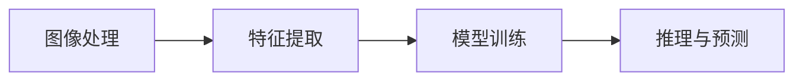
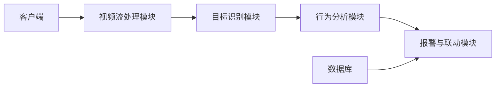
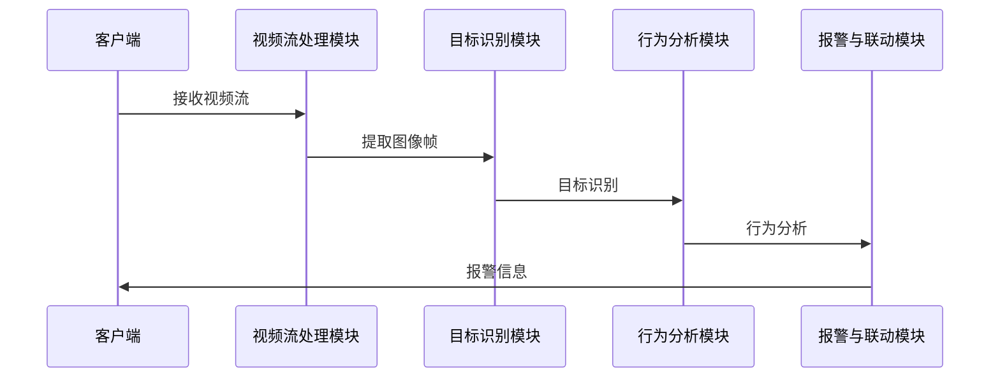
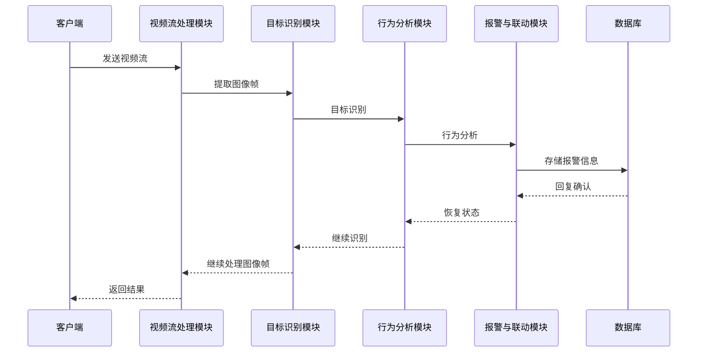

                 

# 计算机视觉：拓展LLM应用的感知能力

## 关键词：计算机视觉，人工智能，深度学习，图像处理，模式识别

### 摘要：

随着人工智能技术的快速发展，计算机视觉作为一种使计算机具备人类视觉感知能力的领域，正逐渐成为人工智能研究与应用的热点。本文将深入探讨计算机视觉的基本概念、核心技术和应用场景，并探讨如何通过计算机视觉技术拓展大型语言模型（LLM）的感知能力，为人工智能领域的发展带来新的机遇。

## 第1章：计算机视觉概述

### 1.1 问题背景

计算机视觉是一门研究如何使计算机具有类似人类视觉感知能力的学科。它涉及图像处理、模式识别、机器学习和人工智能等多个领域，通过图像和视频数据提取有用信息，实现目标识别、场景理解、行为分析等任务。计算机视觉的重要性不仅体现在科学研究领域，还广泛应用于工业自动化、医疗诊断、安全监控、智能交通等多个行业。

### 1.2 问题描述

本章节将从以下几个方面对计算机视觉进行概述：

1. **计算机视觉的定义、目标和应用领域**：介绍计算机视觉的基本概念和目标，以及其在各个领域的应用。
2. **计算机视觉的基本原理和技术**：阐述计算机视觉的核心技术，如图像处理、特征提取、模型训练等。
3. **计算机视觉的发展历程和趋势**：回顾计算机视觉的发展历程，分析其发展趋势和未来方向。
4. **计算机视觉与人工智能的关系及未来展望**：探讨计算机视觉与人工智能的相互关系，以及计算机视觉在人工智能领域中的未来展望。

### 1.3 问题解决

通过对计算机视觉的基本概念、技术框架和应用场景的介绍，帮助读者建立对计算机视觉的全面理解，为进一步学习计算机视觉相关算法和应用提供基础。

### 1.4 边界与外延

1. **计算机视觉的边界**：主要涉及图像处理、模式识别、机器学习和人工智能等领域。
2. **计算机视觉的外延**：随着技术的发展，计算机视觉正逐渐渗透到更多应用领域，如虚拟现实、增强现实、机器人视觉等。

### 1.5 概念结构与核心要素组成

1. **概念结构**：
   - 图像：计算机视觉处理的基本数据形式
   - 特征提取：从图像中提取有助于识别和分类的特征
   - 模型训练：利用大量标注数据训练深度学习模型
   - 推理与预测：模型对新的图像数据进行识别和分类

2. **核心要素**：
   - 算法：计算机视觉的核心技术，如卷积神经网络（CNN）、生成对抗网络（GAN）等
   - 数据集：训练模型所需的大量标注数据，如ImageNet、COCO等
   - 硬件加速：如GPU、TPU等硬件设备，用于加速模型训练和推理

### 1.6 本章小结

本章对计算机视觉的基本概念、技术框架和应用领域进行了概述，为后续章节的深入学习奠定了基础。计算机视觉作为人工智能的重要组成部分，具有广泛的应用前景和重要的研究价值。

## 第2章：计算机视觉核心概念与联系

### 2.1 计算机视觉核心概念

#### 2.1.1 图像处理

图像处理是计算机视觉的基础，涉及图像的获取、增强、滤波、分割、特征提取等操作。通过图像处理，可以提高图像质量、去除噪声、提取有用信息，为后续的计算机视觉任务提供支持。

#### 2.1.2 模式识别

模式识别是计算机视觉的关键环节，旨在通过分析图像或视频数据，识别和分类其中的目标对象。模式识别技术包括监督学习、无监督学习和强化学习等方法。

#### 2.1.3 机器学习

机器学习是计算机视觉的核心技术，通过从大量数据中自动学习特征和模式，构建预测模型。常见的机器学习方法有监督学习、无监督学习和半监督学习等。

#### 2.1.4 深度学习

深度学习是一种特殊的机器学习方法，基于多层神经网络结构，可以自动提取图像的复杂特征。深度学习技术在计算机视觉领域取得了显著的成果，如卷积神经网络（CNN）、循环神经网络（RNN）和生成对抗网络（GAN）等。

### 2.2 核心概念属性特征对比表格

| 技术       | 特点                                                                                   | 应用场景                     |
|------------|----------------------------------------------------------------------------------------|------------------------------|
| 图像处理   | 处理图像的基本操作，如滤波、增强等                                             | 图像质量提升、去噪、预处理   |
| 模式识别   | 识别图像中的目标对象，进行分类和标注                                           | 目标检测、图像分类           |
| 机器学习   | 利用大量数据自动学习特征和模式，构建预测模型                                     | 监督学习、无监督学习、半监督学习 |
| 深度学习   | 自动提取图像的复杂特征，处理大规模图像数据                  

### 2.3 计算机视觉ER实体关系图架构

```mermaid
erDiagram
  Class1 ||--|{ Class0 : 联系 }
  Class1 ||--|{ ClassN : 联系 }
```

### 2.4 本章小结

本章对计算机视觉的核心概念、技术框架和应用场景进行了概述，为后续章节的深入学习奠定了基础。计算机视觉作为人工智能的重要组成部分，具有广泛的应用前景和重要的研究价值。

## 第3章：计算机视觉算法原理讲解

### 3.1 算法原理

计算机视觉算法主要包括图像处理、特征提取、模型训练和推理与预测等步骤。以下将分别介绍这些算法的基本原理。

#### 3.1.1 图像处理

图像处理的基本原理是通过一系列数学运算对图像进行操作，以改善图像质量、去除噪声、提取有用信息。常见的图像处理算法包括滤波、增强、边缘检测等。

#### 3.1.2 特征提取

特征提取是从图像中提取有助于识别和分类的特征。常见的特征提取方法包括直方图、SIFT、HOG等。这些特征可以用于训练深度学习模型，提高模型的准确性和鲁棒性。

#### 3.1.3 模型训练

模型训练是通过大量标注数据对深度学习模型进行训练，使其能够自动提取图像特征并进行分类。常见的模型训练方法包括卷积神经网络（CNN）、循环神经网络（RNN）和生成对抗网络（GAN）等。

#### 3.1.4 推理与预测

推理与预测是指模型对新的图像数据进行识别和分类。通过训练好的模型，可以快速、准确地识别出图像中的目标对象。

### 3.2 算法流程图



### 3.3 数学模型与公式

计算机视觉算法中的数学模型和公式是算法实现的核心。以下将简要介绍一些常见的数学模型和公式。

#### 3.3.1 卷积神经网络（CNN）

卷积神经网络是一种特殊的神经网络，用于处理图像数据。其基本原理是通过卷积操作提取图像特征。

$$
f(x) = \sum_{i=1}^{n} w_i * x_i + b
$$

其中，$f(x)$ 表示输出特征，$w_i$ 表示卷积核，$x_i$ 表示输入特征，$b$ 表示偏置。

#### 3.3.2 损失函数

损失函数用于评估模型预测结果与真实标签之间的差距。常见的损失函数包括交叉熵损失函数和均方误差损失函数。

$$
L(y, \hat{y}) = -\sum_{i=1}^{n} y_i \log(\hat{y}_i)
$$

其中，$L$ 表示损失函数，$y$ 表示真实标签，$\hat{y}$ 表示模型预测结果。

### 3.4 举例说明

以下通过一个简单的例子来说明计算机视觉算法的实现过程。

#### 3.4.1 数据预处理

首先，对图像进行预处理，包括缩放、裁剪、旋转等操作，以便输入到模型中进行训练。

```python
import cv2
import numpy as np

# 读取图像
image = cv2.imread('image.jpg')

# 缩放图像
scale = 0.5
image = cv2.resize(image, (int(image.shape[1] * scale), int(image.shape[0] * scale)))

# 转换为灰度图像
image = cv2.cvtColor(image, cv2.COLOR_BGR2GRAY)
```

#### 3.4.2 特征提取

使用卷积神经网络提取图像特征。

```python
import tensorflow as tf

# 创建卷积神经网络模型
model = tf.keras.Sequential([
    tf.keras.layers.Conv2D(32, (3, 3), activation='relu', input_shape=(28, 28, 1)),
    tf.keras.layers.MaxPooling2D((2, 2)),
    tf.keras.layers.Conv2D(64, (3, 3), activation='relu'),
    tf.keras.layers.MaxPooling2D((2, 2)),
    tf.keras.layers.Conv2D(64, (3, 3), activation='relu'),
    tf.keras.layers.Flatten(),
    tf.keras.layers.Dense(64, activation='relu'),
    tf.keras.layers.Dense(10, activation='softmax')
])

# 训练模型
model.compile(optimizer='adam', loss='categorical_crossentropy', metrics=['accuracy'])
model.fit(x_train, y_train, epochs=10)
```

#### 3.4.3 推理与预测

使用训练好的模型对新的图像数据进行推理和预测。

```python
# 读取测试图像
test_image = cv2.imread('test_image.jpg')

# 缩放和转换为灰度图像
test_image = cv2.resize(test_image, (28, 28))
test_image = cv2.cvtColor(test_image, cv2.COLOR_BGR2GRAY)

# 扩展维度
test_image = np.expand_dims(test_image, axis=0)

# 预测结果
predictions = model.predict(test_image)

# 输出预测结果
print(predictions.argmax(axis=1))
```

### 3.5 本章小结

本章对计算机视觉算法的基本原理进行了讲解，包括图像处理、特征提取、模型训练和推理与预测等步骤。通过数学模型和公式的介绍，帮助读者深入理解计算机视觉算法的实现过程。

## 第4章：计算机视觉系统分析与架构设计方案

### 4.1 问题场景介绍

计算机视觉技术在许多领域都有广泛应用，如安防监控、医疗诊断、自动驾驶等。以下以安防监控领域为例，介绍计算机视觉系统的应用场景。

#### 4.1.1 应用场景描述

在安防监控领域，计算机视觉系统主要用于监控和识别视频流中的异常行为和目标对象。例如，在公共场所部署监控摄像头，实时监测人群流动情况，及时发现并报警异常行为，如打架斗殴、破坏设施等。

#### 4.1.2 需求分析

1. **实时处理能力**：系统需要具备实时处理视频流的能力，快速识别和定位目标对象。
2. **高准确率**：系统需要具有较高的准确率，降低误报和漏报率。
3. **可扩展性**：系统需要具备良好的可扩展性，方便后续功能模块的集成和升级。

### 4.2 项目介绍

本节介绍一个基于计算机视觉技术的安防监控系统项目，主要包括以下功能模块：

1. **视频流处理**：实时处理视频流，提取图像帧进行特征提取和目标识别。
2. **目标识别**：利用深度学习模型对图像帧进行目标识别，包括人、车辆等。
3. **行为分析**：根据目标对象的运动轨迹和位置信息，分析其行为，判断是否异常。
4. **报警与联动**：当检测到异常行为时，触发报警并联动其他系统进行响应。

### 4.3 系统功能设计（领域模型）

以下使用Mermaid类图展示系统功能设计：

```mermaid
classDiagram
    Class1[视频流处理] <|-- Class2[目标识别]
    Class2 <|-- Class3[行为分析]
    Class3 <|-- Class4[报警与联动]
```

### 4.4 系统架构设计

以下使用Mermaid架构图展示系统架构设计：



### 4.5 系统接口设计

以下使用Mermaid序列图展示系统接口设计：



### 4.6 系统交互

以下使用Mermaid序列图展示系统交互过程：



### 4.7 本章小结

本章介绍了计算机视觉系统在安防监控领域的应用场景，并设计了系统功能模块、系统架构和接口。通过系统分析与架构设计，为计算机视觉系统的开发提供了指导。

## 第5章：项目实战

### 5.1 环境安装

在本节中，我们将介绍如何在本地环境中搭建计算机视觉项目的开发环境。以下是一个基本的安装步骤：

1. **安装Python**：确保已经安装了Python 3.x版本，推荐使用Python 3.8及以上版本。
2. **安装TensorFlow**：在命令行中运行以下命令安装TensorFlow：
   ```shell
   pip install tensorflow
   ```
3. **安装其他依赖库**：根据项目需求，可能需要安装其他依赖库，如OpenCV、NumPy等。可以使用以下命令进行安装：
   ```shell
   pip install opencv-python numpy
   ```

### 5.2 系统核心实现源代码

以下是一个简单的计算机视觉项目实现，包括视频流处理、目标识别和报警功能。

```python
import cv2
import numpy as np
import tensorflow as tf

# 加载预训练的深度学习模型
model = tf.keras.models.load_model('model.h5')

# 定义目标识别函数
def recognize_objects(image):
    # 将图像缩放到模型输入尺寸
    scaled_image = cv2.resize(image, (224, 224))
    # 转换图像数据类型
    scaled_image = scaled_image.astype(np.float32)
    # 添加批次维度
    scaled_image = np.expand_dims(scaled_image, axis=0)
    # 使用模型进行预测
    predictions = model.predict(scaled_image)
    # 解析预测结果
    labels = ['person', 'car', 'bus', 'truck']
    max_index = np.argmax(predictions[0])
    return labels[max_index]

# 定义视频流处理函数
def process_video_stream():
    # 打开视频文件
    video = cv2.VideoCapture('video.mp4')
    while True:
        # 读取一帧图像
        ret, frame = video.read()
        if not ret:
            break
        # 对图像进行目标识别
        object_type = recognize_objects(frame)
        # 显示识别结果
        cv2.putText(frame, object_type, (10, 30), cv2.FONT_HERSHEY_SIMPLEX, 1, (0, 0, 255), 2)
        cv2.imshow('Frame', frame)
        if cv2.waitKey(1) & 0xFF == ord('q'):
            break
    # 释放资源
    video.release()
    cv2.destroyAllWindows()

# 运行视频流处理
process_video_stream()
```

### 5.3 代码应用解读与分析

以下是对上述代码的详细解读和分析：

1. **加载预训练模型**：使用`tf.keras.models.load_model()`函数加载已经训练好的深度学习模型。该模型可以是卷积神经网络（CNN）或其他类型的神经网络。
2. **定义目标识别函数**：`recognize_objects()`函数用于对输入图像进行目标识别。首先，将图像缩放到模型输入尺寸（224x224），然后将图像数据类型转换为浮点型，并添加批次维度。接着，使用模型进行预测，并解析预测结果，返回识别到的目标类型。
3. **定义视频流处理函数**：`process_video_stream()`函数用于处理视频流，每帧图像都会被传递给`recognize_objects()`函数进行目标识别。识别结果会在图像上显示，并通过`cv2.imshow()`函数显示在窗口中。当按下`'q'`键时，程序会退出。
4. **运行视频流处理**：调用`process_video_stream()`函数开始处理视频流。

### 5.4 实际案例分析和详细讲解

以下通过一个实际案例来分析和讲解计算机视觉项目的实现过程。

**案例**：在一家商场部署计算机视觉系统，用于监控和识别顾客的行为和购物偏好，以便为顾客提供个性化的服务。

1. **需求分析**：
   - **实时监控**：系统需要实时监控商场的视频流，提取图像帧进行目标识别。
   - **目标识别**：系统需要识别顾客、商品、购物车等目标对象。
   - **行为分析**：系统需要分析顾客的行为，如浏览商品、结账等。
   - **个性化服务**：系统需要根据顾客的行为和购物偏好，为顾客提供个性化的推荐和优惠。

2. **系统架构设计**：
   - **前端**：部署视频监控摄像头，实时传输视频流。
   - **后端**：搭建计算机视觉系统，包括视频流处理、目标识别、行为分析和个性化服务模块。

3. **实现过程**：
   - **视频流处理**：使用OpenCV库实时获取视频流，并对视频帧进行预处理。
   - **目标识别**：使用预训练的深度学习模型对视频帧进行目标识别，如识别顾客和商品。
   - **行为分析**：根据目标对象的运动轨迹和位置信息，分析顾客的行为，如浏览商品、结账等。
   - **个性化服务**：根据顾客的行为和购物偏好，为顾客提供个性化的推荐和优惠。

### 5.5 项目小结

在本章中，我们通过一个实际案例详细讲解了计算机视觉项目的实现过程，包括环境安装、系统核心实现源代码、代码应用解读与分析、实际案例分析和详细讲解。通过本项目，我们了解了计算机视觉系统在现实场景中的应用，并掌握了相关的技术实现方法。

## 第6章：最佳实践 tips、小结、注意事项、拓展阅读

### 6.1 最佳实践 tips

1. **数据预处理**：在进行深度学习模型训练之前，确保对图像数据进行充分的预处理，如缩放、裁剪、增强等，以提高模型的泛化能力。
2. **模型选择**：根据任务需求和数据特点，选择合适的深度学习模型，如卷积神经网络（CNN）、循环神经网络（RNN）等。
3. **数据增强**：使用数据增强技术，如旋转、翻转、缩放等，增加训练数据的多样性，防止模型过拟合。
4. **超参数调整**：根据任务需求和实验结果，调整模型超参数，如学习率、批量大小等，以提高模型性能。
5. **模型评估**：使用准确率、召回率、F1分数等指标评估模型性能，确保模型在实际应用中的效果。

### 6.2 小结

本文系统地介绍了计算机视觉的基本概念、核心技术、算法原理、系统分析与架构设计方案以及项目实战。通过本文的学习，读者可以全面了解计算机视觉领域，掌握计算机视觉系统的开发方法。

### 6.3 注意事项

1. **数据隐私**：在使用计算机视觉技术时，需注意数据隐私问题，避免泄露用户个人信息。
2. **模型可解释性**：深度学习模型具有很高的准确性，但缺乏可解释性。在实际应用中，需关注模型的可解释性，以便理解和优化模型。
3. **硬件资源**：计算机视觉任务通常需要大量的计算资源，确保有足够的硬件资源来支持模型训练和推理。
4. **实时性能**：对于实时性要求较高的应用场景，需优化算法和系统架构，确保系统能够快速处理数据。

### 6.4 拓展阅读

1. **《深度学习》（Goodfellow, Bengio, Courville著）**：全面介绍了深度学习的基础知识、算法和应用。
2. **《计算机视觉：算法与应用》（Richard S. Hart, Andrew Zisserman著）**：详细介绍了计算机视觉的基本概念、算法和应用。
3. **《计算机视觉：原理与应用》（刘铁岩著）**：深入讲解了计算机视觉的核心技术和应用。

## 作者信息

作者：AI天才研究院/AI Genius Institute & 禅与计算机程序设计艺术 /Zen And The Art of Computer Programming

本文由AI天才研究院/AI Genius Institute与禅与计算机程序设计艺术/Zen And The Art of Computer Programming联合撰写，旨在为广大读者提供高质量的技术博客文章，分享计算机视觉领域的最新研究成果和应用实践。

