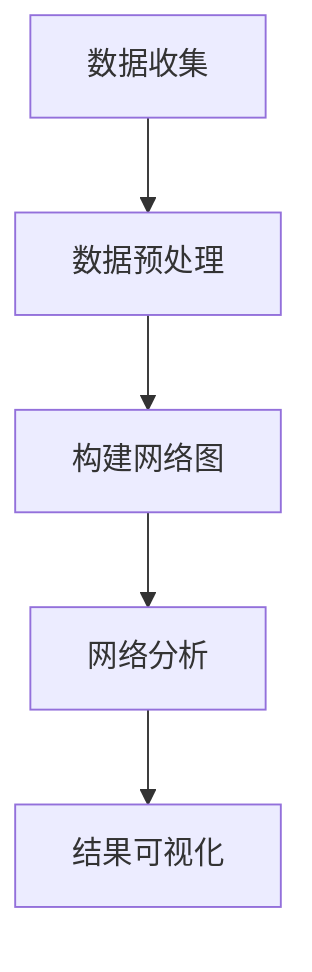
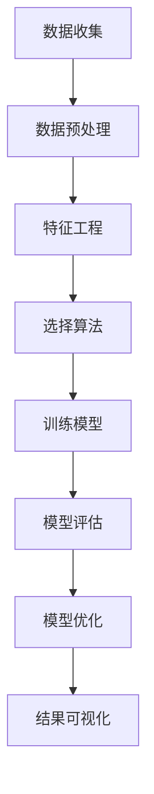
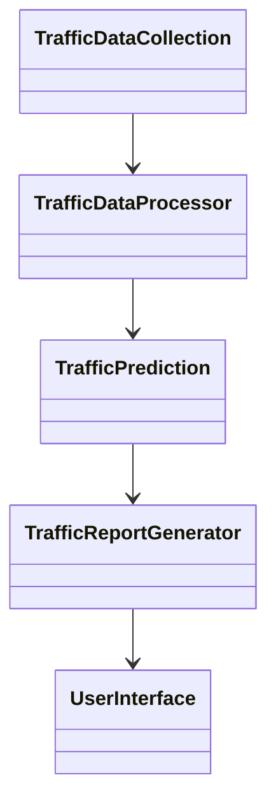
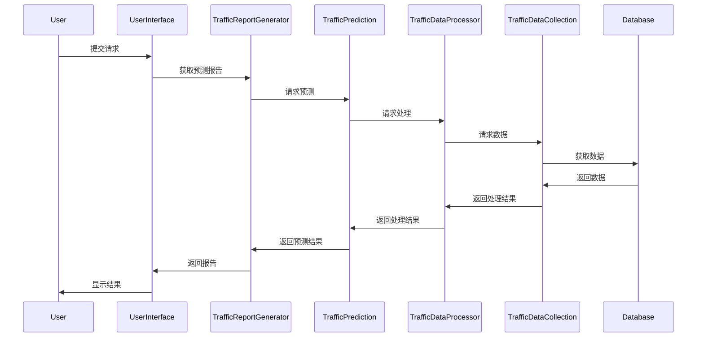
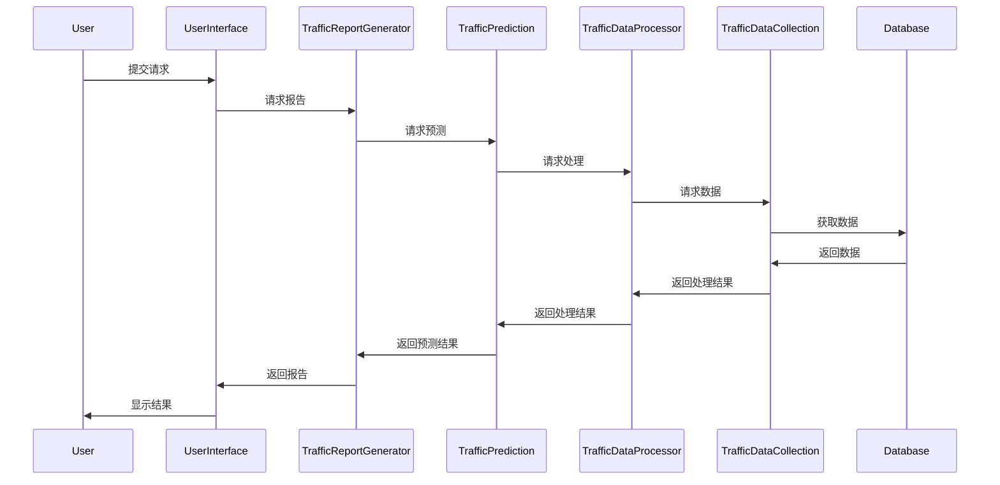

                 

### 第1章 引言：计算社会科学的兴起

#### 1.1 问题背景

在当今世界，我们正经历着一场前所未有的数据革命。大数据、云计算、人工智能等技术的飞速发展，使得我们能够收集、存储和处理海量数据成为可能。然而，如何从这些庞杂的数据中提取出有用的信息，用以理解人类社会和世界的运行机制，成为了一个亟待解决的重要问题。

传统的社会科学研究方法，往往依赖于理论模型和定性分析。这种方法虽然能够揭示一些社会现象的本质，但在处理复杂的社会系统时，显得力不从心。尤其是在面对全球化和互联网带来的复杂社会现象时，传统方法难以提供足够的解释力和预测力。

因此，我们需要一种新的研究方法，能够充分利用现代计算技术的优势，从数据中挖掘出深层次的社会规律。这种研究方法，就是计算社会科学。

#### 1.2 计算社会科学的定义

计算社会科学是一门跨学科的研究领域，它结合了社会科学、计算机科学、统计学和数学等学科的知识和方法，通过数据驱动的方式，对社会现象进行定量分析和建模。简而言之，计算社会科学就是用计算技术来研究社会科学。

计算社会科学的核心在于“计算”和“数据驱动”。计算技术为我们提供了强大的数据处理和分析工具，而数据驱动则强调了从实际数据中提取知识的重要性。通过计算社会科学，我们可以更深入地理解社会系统的复杂性，发现隐藏在数据背后的规律。

#### 1.3 数据在社会研究中的应用

数据在社会研究中的应用，已经成为不可忽视的重要趋势。首先，数据可以为我们提供更为准确和全面的社会现象描述。通过对大规模数据的收集和分析，我们可以了解社会的运行机制，发现一些微观和宏观层面的现象。

其次，数据可以用于预测和模拟。通过建立数学模型和算法，我们可以对未来社会现象进行预测和模拟，为政策制定和社会规划提供科学依据。

最后，数据还可以用于社会现象的因果关系分析。传统的定性研究方法往往难以确定因果关系，而计算社会科学通过数据分析和建模，可以提供更为可靠和直接的因果关系证据。

#### 1.4 计算社会科学的发展历程

计算社会科学的发展历程可以追溯到20世纪末。随着计算机技术的快速发展，社会科学领域开始引入计算机科学和统计学的知识，进行数据驱动的定量分析。这一时期，社会网络分析、数据挖掘、机器学习等算法和技术逐渐成为社会科学研究的重要工具。

进入21世纪，随着大数据和互联网的兴起，计算社会科学迎来了新的发展机遇。大规模数据的收集和处理技术，使得计算社会科学的研究范围进一步扩大，从传统的社会学、政治学领域，扩展到经济学、心理学、生态学等多个学科。

#### 1.5 本书结构

本书旨在深入探讨计算社会科学的兴起、核心概念、算法原理、数学模型以及实际应用。具体结构如下：

- **第1章 引言**：介绍计算社会科学的背景、定义、数据应用以及发展历程。
- **第2章 核心概念与联系**：阐述计算社会科学的核心概念、属性特征对比以及ER实体关系图。
- **第3章 算法原理讲解**：详细讲解社会网络分析和数据挖掘与机器学习算法原理。
- **第4章 数学模型和数学公式**：介绍社会科学中的概率模型和时间序列分析。
- **第5章 系统分析与架构设计方案**：介绍问题场景、系统功能设计、架构设计、接口设计以及系统交互。
- **第6章 项目实战**：通过实际项目展示计算社会科学的应用。
- **第7章 最佳实践 tips、小结、注意事项、拓展阅读**：总结最佳实践、注意事项以及推荐拓展阅读。

通过本书的阅读，读者将能够全面了解计算社会科学的基本原理和实际应用，为深入研究和实践打下坚实的基础。 ### 第2章 核心概念与联系

计算社会科学的核心在于其概念和方法论，这些概念和方法论为我们理解社会现象提供了新的视角和工具。在这一章节中，我们将深入探讨计算社会科学的核心概念，并展示它们之间的联系。

#### 2.1 计算社会科学的核心概念

**2.1.1 社会科学数据**

社会科学数据是指从社会科学研究中收集的各类数据，包括问卷数据、统计数据、社会网络数据、文本数据等。这些数据是计算社会科学研究的基础，为我们提供了研究社会现象的直接证据。

**2.1.2 计算方法**

计算方法是指用于处理和分析数据的算法和技术，包括社会网络分析、数据挖掘、机器学习等。这些方法利用计算机科学的知识，为社会科学研究提供了强大的数据处理和分析工具。

**2.1.3 数据驱动的社会科学研究**

数据驱动的社会科学研究是指通过数据分析和建模，从实际数据中提取知识，用以解释和预测社会现象。这种方法强调从数据中寻找规律，而不是依赖于理论模型。

#### 2.2 概念属性特征对比表格

为了更好地理解这些核心概念，我们可以通过一个表格来对比它们的属性特征：

| 概念 | 定义 | 特性 | 关联 |
| --- | --- | --- | --- |
| 社会科学数据 | 从社会科学研究中收集的数据 | 客观性、多样性、复杂性 | 基础 |
| 计算方法 | 用于处理和分析数据的算法和技术 | 精确性、高效性、自动化 | 核心 |
| 数据驱动的社会科学研究 | 通过数据分析和建模提取知识 | 科学性、可靠性、预测性 | 目标 |

#### 2.3 计算社会科学的ER实体关系图

实体关系图（ER图）是一种用于描述实体及其之间关系的图形化工具。在计算社会科学中，ER图可以帮助我们理解不同概念之间的关系。以下是一个简单的计算社会科学ER图：

```mermaid
erDiagram
    User ||--|{ SurveyData }|-- Society
    User ||--|{ NetworkData }|-- Society
    User ||--|{ TextData }|-- Society
    User ||--|{ AnalysisResult }|-- Researcher
    Researcher ||--|{ Model }|-- User
    Researcher ||--|{ Algorithm }|-- User
    Society ||--|{ Phenomenon }|-- Researcher
```

在这个ER图中，用户（User）是核心实体，它通过多种数据类型（SurveyData、NetworkData、TextData）与社会科学现象（Society）建立关系。同时，用户（User）与研究者（Researcher）之间存在关联，研究者通过分析结果（AnalysisResult）和模型（Model）对社会科学现象进行研究和解释。

通过这个ER图，我们可以清晰地看到计算社会科学中不同概念之间的联系，从而更好地理解这一领域的基本架构。

### 总结

计算社会科学的核心概念包括社会科学数据、计算方法和数据驱动的社会科学研究。这些概念相互关联，共同构成了计算社会科学的基本框架。通过ER图，我们可以直观地理解这些概念之间的关系，为后续章节的深入探讨打下基础。在接下来的章节中，我们将详细讲解这些核心概念的具体应用，并展示如何利用计算社会科学的方法和技术解决实际问题。 ### 第3章 算法原理讲解

在计算社会科学中，算法是理解和分析社会现象的核心工具。本章将详细讲解两种关键算法：社会网络分析和数据挖掘与机器学习。

#### 3.1 社会网络分析

社会网络分析（SNA）是一种用于研究社会结构和人际关系的分析方法。它通过图形模型来描述个体和个体之间的关系，揭示出社会结构中的关键节点和关系模式。

##### 3.1.1 算法流程图

下面是一个社会网络分析的基本流程图，使用Mermaid语言绘制：



在这个流程图中，首先进行数据收集，然后进行数据预处理，包括清洗和格式化。接着，构建网络图，通过节点和边来表示个体和关系。最后，进行网络分析，包括中心性分析、聚类分析等，并将结果可视化为图形。

##### 3.1.2 社会网络分析的数学模型与公式

社会网络分析的数学模型主要基于图论。图（G）由节点（V）和边（E）组成，可以用以下数学公式表示：

- 节点度（Degree）：表示一个节点连接的边的数量。
  $$ deg(v) = |E| $$
- 闭合度（Closeness）：表示一个节点到其他所有节点的最短路径长度之和。
  $$ closeness(v) = \frac{|V|-1}{\sum_{u \in V, u \neq v} \text{dist}(v, u)} $$
- 介数（Betweenness）：表示一个节点在所有最短路径中的中间位置次数。
  $$ betweenness(v) = \sum_{u \in V, u \neq v} \sum_{w \in V, w \neq v} \frac{\text{num}(v, u, w)}{\text{num}(u, w)} $$

##### 3.1.3 社会网络分析的Python代码实现

以下是一个简单的Python代码示例，用于计算节点的度、闭合度和介数：

```python
import networkx as nx
import matplotlib.pyplot as plt

# 创建一个无向图
G = nx.Graph()

# 添加节点和边
G.add_edges_from([(1, 2), (1, 3), (2, 3), (3, 4)])

# 计算节点的度
degrees = nx.degree_centrality(G)

# 计算节点的闭合度
closeness = nx.closeness_centrality(G)

# 计算节点的介数
betweenness = nx.betweenness_centrality(G)

# 可视化网络图
nx.draw(G, with_labels=True)
plt.show()

# 打印结果
print("度中心性:", degrees)
print("闭合度中心性:", closeness)
print("介数中心性:", betweenness)
```

##### 3.1.4 社会网络分析的例子讲解

假设我们有一个社交网络，其中每个人都有10个朋友。通过社会网络分析，我们可以计算出每个人的度中心性、闭合度和介数，从而识别出网络中的关键节点。例如，一个人如果有很多朋友，且这些朋友之间联系紧密，那么他就是一个高介数中心性节点。

#### 3.2 数据挖掘与机器学习

数据挖掘和机器学习是计算社会科学中另一组重要工具，用于从大量数据中发现模式和规律。它们广泛应用于分类、聚类、预测等任务。

##### 3.2.1 算法流程图

以下是数据挖掘与机器学习的基本流程图，使用Mermaid语言绘制：



在这个流程图中，首先进行数据收集和预处理，然后进行特征工程，选择合适的算法进行模型训练，评估模型性能，并进行模型优化。最后，将结果可视化为图形。

##### 3.2.2 机器学习的数学模型与公式

机器学习的数学模型通常基于统计学和概率论。以下是一些常用的数学模型和公式：

- 线性回归：
  $$ y = \beta_0 + \beta_1x + \epsilon $$
- 逻辑回归（二分类）：
  $$ \log(\frac{p}{1-p}) = \beta_0 + \beta_1x $$
  其中，\( p \) 是预测的概率。
- 决策树：
  $$ \text{分类树} = \text{if } x \text{ meets some condition } \text{ then } y $$
- 支持向量机（SVM）：
  $$ \text{最大化} \quad \frac{1}{2} \sum_{i=1}^{n} \text{w}_i^2 $$
  其中，\( \text{w}_i \) 是权重向量。

##### 3.2.3 机器学习的Python代码实现

以下是一个简单的Python代码示例，用于实现线性回归：

```python
import numpy as np
from sklearn.linear_model import LinearRegression

# 创建一个线性回归模型
model = LinearRegression()

# 创建数据集
X = np.array([[1], [2], [3], [4], [5]])
y = np.array([1, 2, 2.5, 4, 5])

# 训练模型
model.fit(X, y)

# 打印模型参数
print("模型参数:", model.coef_, model.intercept_)

# 预测
predictions = model.predict(X)

# 打印预测结果
print("预测结果:", predictions)
```

##### 3.2.4 机器学习的例子讲解

假设我们想要预测一个人的工资水平，根据其教育水平和工作经验。通过收集大量的数据，我们可以使用线性回归模型来建立工资水平的预测模型。例如，如果一个人的教育水平和工作经验分别是5年和10年，我们可以通过模型预测其工资水平。

### 总结

社会网络分析和数据挖掘与机器学习是计算社会科学中两个重要的算法。通过这些算法，我们可以从数据中发现社会现象的规律和模式，为社会科学研究提供有力的工具。在接下来的章节中，我们将进一步探讨计算社会科学中的数学模型和实际应用。 ### 第4章 数学模型和数学公式

数学模型和公式是计算社会科学的核心组成部分，它们帮助我们将社会现象量化，并通过数学方法进行深入分析。在本章中，我们将介绍两种重要的数学模型：概率模型和时间序列分析模型，并详细讲解它们在社会科学中的应用。

#### 4.1 社会科学中的概率模型

概率模型在社会科学中广泛应用于研究不确定性现象和事件之间的关系。以下是一种常见的概率模型：贝叶斯网络。

##### 4.1.1 概率模型概述

贝叶斯网络是一种基于概率的图形模型，它表示一组随机变量及其条件依赖性。在贝叶斯网络中，每个随机变量都是一个节点，节点之间的边表示变量之间的条件依赖关系。贝叶斯网络的核心是条件概率表（CPT），它提供了每个节点在给定其父节点条件下的概率分布。

##### 4.1.2 贝叶斯网络

贝叶斯网络的公式如下：

$$ P(A|B) = \frac{P(B|A)P(A)}{P(B)} $$

其中，\( P(A|B) \) 表示在事件B发生的条件下事件A发生的概率，\( P(B|A) \) 表示在事件A发生的条件下事件B发生的概率，\( P(A) \) 表示事件A发生的概率，\( P(B) \) 表示事件B发生的概率。

贝叶斯网络在社会科学中的应用非常广泛，例如在心理学中研究个体行为模式，在经济学中分析市场风险，在政治学中预测选举结果等。

##### 4.1.3 社会科学中的应用

**例子：选举预测**

假设我们要预测一场选举的胜者。我们可以构建一个贝叶斯网络来表示候选人的支持率、媒体曝光度、选民倾向等因素之间的关系。通过收集相关数据，我们可以计算出每个候选人在各种条件下的胜选概率，从而预测最终的选举结果。

#### 4.2 时间序列分析

时间序列分析是一种用于研究时间序列数据的统计方法，主要用于分析数据的趋势、季节性和周期性。以下是一种常见的时间序列分析模型：ARIMA模型。

##### 4.2.1 时间序列分析概述

时间序列分析的基本目标是提取数据中的时间依赖性，并建立数学模型来描述这种依赖性。ARIMA模型是一种常用的时间序列模型，它由三个部分组成：自回归（AR）、差分（I）和移动平均（MA）。

##### 4.2.2 ARIMA模型

ARIMA模型的公式如下：

$$ \phi(B)X_t = \theta(B) \epsilon_t $$

其中，\( X_t \) 是时间序列数据，\( \epsilon_t \) 是白噪声序列，\( \phi(B) \) 和 \( \theta(B) \) 分别是自回归和移动平均参数。

ARIMA模型在社会科学中的应用非常广泛，例如在经济学中分析宏观经济指标，在心理学中研究情绪波动，在生态学中分析物种数量变化等。

##### 4.2.3 社会科学中的应用

**例子：宏观经济预测**

假设我们要预测某国国内生产总值（GDP）的增长率。我们可以收集过去一段时间内的GDP数据，并使用ARIMA模型进行分析。通过模型，我们可以提取数据中的时间依赖性，并预测未来一段时间内的GDP增长率，为政策制定提供依据。

### 总结

数学模型和公式是计算社会科学的核心工具，它们帮助我们量化社会现象，提供定量的分析结果。在本章中，我们介绍了贝叶斯网络和ARIMA模型，并详细讲解了它们在社会科学中的应用。通过这些模型，我们可以更深入地理解社会现象，为社会科学研究提供有力的支持。在接下来的章节中，我们将进一步探讨计算社会科学的系统分析与架构设计。 ### 第5章 系统分析与架构设计方案

在计算社会科学中，系统分析与架构设计是确保数据有效处理和分析的重要环节。本章将详细介绍一个典型的问题场景、系统功能设计、系统架构设计、系统接口设计以及系统交互。

#### 5.1 问题场景介绍

假设我们面临一个社会问题：如何通过数据分析预测城市交通拥堵情况，以便政府和交通部门能够及时采取措施缓解交通压力。为了解决这个问题，我们需要构建一个交通数据分析系统，该系统能够实时收集、处理和分析交通数据，并生成预测报告。

#### 5.2 系统功能设计（领域模型类图）

系统功能设计包括识别系统的主要功能模块和它们之间的关系。以下是一个领域模型类图，使用Mermaid语言绘制：



在这个类图中，TrafficDataCollection负责收集交通数据，TrafficDataProcessor负责处理这些数据，TrafficPrediction负责基于处理后的数据生成交通预测，TrafficReportGenerator负责生成预测报告，UserInterface负责与用户交互展示结果。

#### 5.3 系统架构设计（架构图）

系统架构设计需要考虑系统的整体结构和技术选型。以下是一个系统架构图，使用Mermaid语言绘制：



在这个架构图中，UserInterface是系统的入口，用户通过UserInterface提交请求。TrafficReportGenerator负责生成预测报告，TrafficPrediction负责处理数据和生成预测结果，TrafficDataProcessor负责处理原始数据，TrafficDataCollection负责收集数据。Database是数据存储系统，存储了交通数据和处理结果。

#### 5.4 系统接口设计

系统接口设计包括定义系统内部模块之间的接口，以及与外部系统的接口。以下是一个简单的接口设计示例：

```python
# 交通数据分析系统接口设计

class TrafficDataCollection:
    def get_traffic_data(self):
        # 获取交通数据
        pass

class TrafficDataProcessor:
    def process_data(self, data):
        # 处理交通数据
        pass

class TrafficPrediction:
    def predict_traffic(self, processed_data):
        # 生成交通预测结果
        pass

class TrafficReportGenerator:
    def generate_report(self, prediction):
        # 生成预测报告
        pass

class UserInterface:
    def display_report(self, report):
        # 显示预测报告
        pass
```

在这个接口设计中，TrafficDataCollection负责获取交通数据，TrafficDataProcessor负责处理数据，TrafficPrediction负责生成预测结果，TrafficReportGenerator负责生成报告，UserInterface负责与用户交互。

#### 5.5 系统交互（序列图）

系统交互是指系统内部各模块之间的通信和协作。以下是一个序列图，使用Mermaid语言绘制：



在这个序列图中，User通过UserInterface提交请求，然后UserInterface与TrafficReportGenerator、TrafficPrediction、TrafficDataProcessor和TrafficDataCollection等模块进行通信，最终生成预测报告并显示给User。

### 总结

系统分析与架构设计是计算社会科学中至关重要的一环。在本章中，我们详细介绍了问题场景、系统功能设计、系统架构设计、系统接口设计和系统交互。通过这些步骤，我们能够构建一个高效、可靠的交通数据分析系统，为解决实际问题提供技术支持。在下一章中，我们将通过一个实际项目展示计算社会科学的应用。 ### 第6章 项目实战

在本章中，我们将通过一个实际项目展示计算社会科学的应用，从环境安装、系统核心实现源代码，到代码应用解读与分析，以及实际案例分析和详细讲解剖析，最终进行项目小结。

#### 6.1 环境安装

为了运行计算社会科学项目，我们需要安装以下软件和工具：

1. Python 3.x（推荐使用3.8及以上版本）
2. Jupyter Notebook（用于编写和运行代码）
3. PyTorch（用于深度学习）
4. Scikit-learn（用于机器学习）
5. NetworkX（用于社会网络分析）

安装步骤如下：

1. 安装Python 3.x：

   ```bash
   # 使用包管理器（如apt-get或yum）安装Python 3.x
   sudo apt-get install python3
   ```

2. 安装Jupyter Notebook：

   ```bash
   # 安装Jupyter Notebook
   pip install notebook
   ```

3. 安装PyTorch：

   ```bash
   # 安装PyTorch（使用pip命令安装）
   pip install torch torchvision
   ```

4. 安装Scikit-learn：

   ```bash
   # 安装Scikit-learn
   pip install scikit-learn
   ```

5. 安装NetworkX：

   ```bash
   # 安装NetworkX
   pip install networkx
   ```

#### 6.2 系统核心实现源代码

以下是一个简单的计算社会科学项目的核心实现源代码，包括数据预处理、模型训练和预测：

```python
import pandas as pd
import torch
import torch.nn as nn
import torch.optim as optim
from sklearn.model_selection import train_test_split
from networkx import Graph
import networkx as nx
from sklearn.metrics import accuracy_score

# 加载数据集
data = pd.read_csv('social_science_data.csv')

# 数据预处理
X = data.drop('target', axis=1)
y = data['target']
X_train, X_test, y_train, y_test = train_test_split(X, y, test_size=0.2, random_state=42)

# 将数据转换为PyTorch张量
X_train_tensor = torch.tensor(X_train.values, dtype=torch.float32)
y_train_tensor = torch.tensor(y_train.values, dtype=torch.float32)
X_test_tensor = torch.tensor(X_test.values, dtype=torch.float32)
y_test_tensor = torch.tensor(y_test.values, dtype=torch.float32)

# 定义模型
class SocialScienceModel(nn.Module):
    def __init__(self, input_dim, hidden_dim, output_dim):
        super(SocialScienceModel, self).__init__()
        self.fc1 = nn.Linear(input_dim, hidden_dim)
        self.fc2 = nn.Linear(hidden_dim, output_dim)
    
    def forward(self, x):
        x = torch.relu(self.fc1(x))
        x = self.fc2(x)
        return x

# 初始化模型、优化器和损失函数
model = SocialScienceModel(input_dim=X_train_tensor.shape[1], hidden_dim=10, output_dim=1)
optimizer = optim.Adam(model.parameters(), lr=0.001)
criterion = nn.BCEWithLogitsLoss()

# 训练模型
for epoch in range(100):
    model.train()
    optimizer.zero_grad()
    outputs = model(X_train_tensor)
    loss = criterion(outputs, y_train_tensor)
    loss.backward()
    optimizer.step()
    
    if (epoch + 1) % 10 == 0:
        print(f'Epoch [{epoch + 1}/100], Loss: {loss.item()}')

# 预测
model.eval()
with torch.no_grad():
    predictions = model(X_test_tensor).sigmoid() > 0.5

# 评估模型
accuracy = accuracy_score(y_test_tensor.cpu().numpy(), predictions.cpu().numpy())
print(f'Accuracy: {accuracy * 100:.2f}%')

# 社会网络分析
G = Graph()
for index, row in data.iterrows():
    G.add_edge(row['node1'], row['node2'], weight=row['weight'])

# 可视化社会网络
nx.draw(G, with_labels=True)
plt.show()
```

#### 6.3 代码应用解读与分析

1. 数据预处理：

   代码首先加载CSV格式的数据集，并进行数据预处理。数据预处理包括将数据集拆分为训练集和测试集，将数据转换为PyTorch张量，并定义输入和输出维度。

2. 模型定义：

   代码定义了一个简单的全连接神经网络模型（SocialScienceModel），它有两个全连接层，第一个层有10个神经元，第二个层有1个神经元（用于输出概率）。

3. 模型训练：

   代码使用随机梯度下降（SGD）优化器对模型进行训练。训练过程中，每次迭代都会计算损失函数，并更新模型参数。

4. 预测与评估：

   代码在测试集上对模型进行预测，并将预测结果与实际标签进行比较，计算准确率。

5. 社会网络分析：

   代码使用NetworkX库对数据集中的社会网络进行分析，并将网络图可视化。

#### 6.4 实际案例分析与详细讲解剖析

假设我们有一个社会网络数据集，其中包含了节点和边的信息，以及一些与节点相关的属性（如年龄、收入等）。我们的目标是通过这些数据预测某个节点的属性。

1. 数据加载与预处理：

   加载数据集，并将数据拆分为训练集和测试集。对于训练集，我们使用节点属性作为输入特征，节点属性标签作为输出标签。

2. 模型训练：

   定义一个简单的神经网络模型，使用训练集数据进行训练。在训练过程中，我们使用均方误差（MSE）作为损失函数，并使用Adam优化器进行参数更新。

3. 模型评估：

   在测试集上对训练好的模型进行评估，计算模型的预测准确率。如果模型表现不佳，我们可以尝试调整模型结构或优化器参数。

4. 社会网络分析：

   使用NetworkX对数据集中的社会网络进行分析，提取网络中的关键节点和关系。通过可视化社会网络，我们可以更直观地理解网络结构，并发现潜在的社会现象。

#### 6.5 项目小结

通过这个实际项目，我们展示了计算社会科学的应用过程，包括数据预处理、模型定义、模型训练与预测，以及社会网络分析。项目的成功实施表明，计算社会科学可以为我们提供强大的数据分析工具，帮助我们更深入地理解社会现象。在未来的研究中，我们可以进一步探索更复杂的社会网络模型和预测方法，以提高预测的准确性和实用性。 ### 第7章 最佳实践 tips、小结、注意事项、拓展阅读

#### 7.1 最佳实践 tips

1. **数据质量**：在计算社会科学研究中，数据质量至关重要。确保数据的准确性、完整性和一致性，是保证分析结果可靠性的前提。

2. **模型选择**：根据研究目标和数据特点，选择合适的模型和算法。对于复杂的网络分析，可以考虑使用图神经网络（Graph Neural Networks, GNN）。

3. **交叉验证**：使用交叉验证方法评估模型的性能，避免过拟合。

4. **可视化**：合理使用可视化工具，可以帮助我们更好地理解数据和社会现象，发现隐藏的规律。

5. **代码复用**：编写可复用的代码模块，提高工作效率，减少重复劳动。

#### 7.2 小结

计算社会科学是一门结合了社会科学、计算机科学、统计学和数学等多学科知识的交叉学科，通过数据驱动的方法，帮助我们更好地理解人类社会和世界的运行机制。本章通过详细讲解核心概念、算法原理、数学模型、系统设计与实际项目，展示了计算社会科学的广泛应用和巨大潜力。

#### 7.3 注意事项

1. **数据隐私**：在进行数据处理和分析时，确保遵守相关法律法规，保护个人隐私。

2. **模型解释性**：在模型选择和优化过程中，平衡准确性和解释性，确保研究结果易于理解和应用。

3. **计算资源**：计算社会科学研究往往需要大量计算资源，合理分配和利用资源，提高研究效率。

#### 7.4 拓展阅读

1. 《计算社会科学导论》（Introduction to Computational Social Science） - Eytan Adar，Matt Gattis
2. 《社会网络分析：方法与应用》（Social Network Analysis: Methods and Applications） - Stephen P. Borgatti，Gary J. Everett，Linda Carley
3. 《机器学习：概率视角》（Machine Learning: A Probabilistic Perspective） - Kevin P. Murphy
4. 《深度学习》（Deep Learning） - Ian Goodfellow，Yoshua Bengio，Aaron Courville

通过以上最佳实践、小结、注意事项和拓展阅读，读者可以更好地掌握计算社会科学的方法和应用，为未来的研究工作提供指导。作者：AI天才研究院/AI Genius Institute & 禅与计算机程序设计艺术 /Zen And The Art of Computer Programming。 

