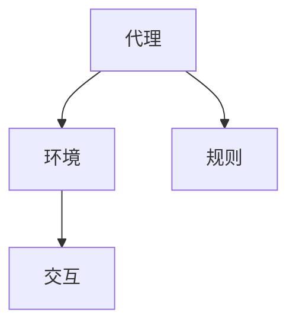
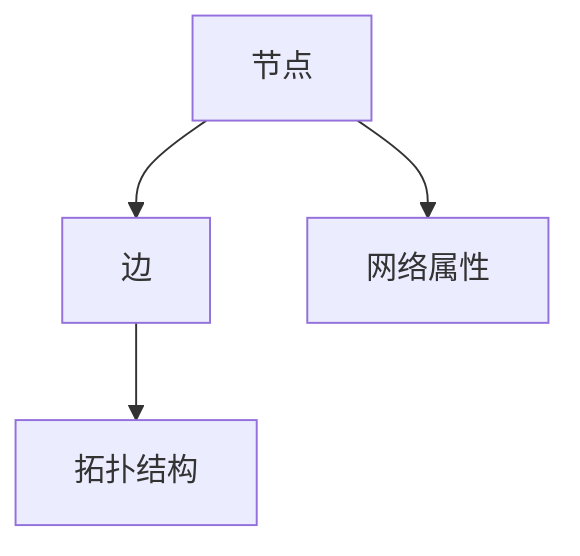
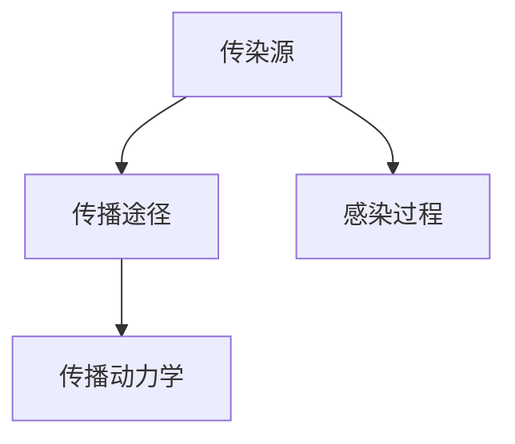

                 

### 引言

### 1.1 计算社会科学的定义与背景

#### 计算社会科学的定义

计算社会科学（Computational Social Science，CSS）是社会科学与计算技术的交叉领域，通过使用计算技术来收集、处理、分析和解释社会数据，以探索和理解人类社会行为及其结构。它融合了计算机科学、统计学、数学、心理学、社会学、政治学等多学科知识，旨在通过数据驱动的分析方法来揭示社会现象的内在机制和规律。

#### 问题背景

在社会科学的研究中，传统的定性研究方法往往需要大量的时间和资源，并且存在主观性和有限性。随着信息技术的飞速发展，特别是大数据和人工智能技术的应用，社会科学家们开始探索如何使用计算方法来提高研究的效率和准确性。

#### 问题描述

计算社会科学的核心问题是：如何利用计算技术来处理和分析庞大的社会数据集，以发现数据中的模式和规律，进而对社会现象进行深入的理解和解释。

#### 问题解决

通过计算方法，社会科学家可以：

1. **高效地处理海量数据**：使用自动化工具进行数据清洗、存储和管理。
2. **发现复杂的社会模式**：应用复杂的算法来挖掘数据中的潜在规律。
3. **进行模拟和预测**：基于模型进行社会行为的模拟和未来趋势的预测。

#### 边界与外延

计算社会科学不仅仅局限于社会科学领域，它还可以扩展到其他相关领域，如公共政策、市场营销、城市规划等，通过数据驱动的分析来提供决策支持。

#### 概念结构与核心要素组成

计算社会科学的核心要素包括：

1. **数据收集与处理**：收集来自各种来源的社会数据，并进行预处理，以消除噪声和错误。
2. **统计分析**：使用统计学方法来分析数据，包括描述性统计、推断性统计等。
3. **社会模型**：构建社会行为模型，以模拟和分析社会现象。
4. **算法应用**：应用机器学习和数据挖掘算法来发现数据中的模式和规律。

### 1.2 数据驱动的社会科学研究

#### 数据驱动研究方法

数据驱动的社会科学研究方法主要包括：

1. **数据收集**：通过问卷调查、社交媒体、公共数据库等方式收集社会数据。
2. **数据清洗**：去除重复数据、纠正错误、填补缺失值等。
3. **数据存储**：使用数据库管理系统（如MySQL、PostgreSQL等）来存储和管理数据。
4. **数据分析**：运用统计分析、机器学习等方法对数据进行深入分析。
5. **数据可视化**：通过图表、地图等形式将分析结果可视化，便于理解和传达。

#### 数据驱动研究的重要性

1. **提高研究效率**：通过自动化工具和算法，可以快速处理和分析大量数据。
2. **增强研究准确性**：通过数据驱动的分析，可以减少人为误差，提高研究结果的可靠性。
3. **发现新规律**：数据驱动的分析可以揭示传统方法无法发现的社会现象和规律。

#### 数据驱动研究的挑战

1. **数据质量和完整性**：数据的质量和完整性直接影响研究的准确性。
2. **数据隐私和安全**：在处理大量社会数据时，需要确保数据的隐私和安全。
3. **技术复杂性**：计算社会科学要求研究人员具备一定的计算机科学和统计学知识。

### 1.3 本书结构安排

本书分为四个部分，共七章：

**第一部分 引言**

- 第1章 计算社会科学概述

**第二部分 基础知识**

- 第2章 数据科学与计算社会科学
- 第3章 社会行为模型

**第三部分 数据分析方法**

- 第4章 数据分析技术

**第四部分 应用与未来**

- 第5章 计算社会科学案例研究
- 第6章 先进技术
- 第7章 未来的方向

通过以上结构，本书旨在为读者提供全面的计算社会科学的概述、基础知识、数据分析方法和应用案例，以及对其未来发展的展望。

---

**关键词**：计算社会科学、数据驱动研究、社会行为模型、数据分析技术、案例研究、未来方向

**摘要**：

本书《计算社会科学：数据驱动理解人类社会与世界》旨在探讨计算技术在社会科学领域的应用，通过介绍计算社会科学的定义、基础知识和数据分析方法，结合实际案例研究和未来展望，帮助读者理解如何利用数据驱动的分析方法来探索和理解人类社会行为及其结构。本书分为四个部分，共七章，结构紧凑、逻辑清晰，适合社会科学研究人员、数据科学家以及计算机科学爱好者阅读。通过本书，读者可以掌握计算社会科学的核心概念和实际应用技巧，为未来的研究提供有力支持。**关键词**：计算社会科学、数据驱动研究、社会行为模型、数据分析技术、案例研究、未来方向

### 2. 数据科学与计算社会科学

#### 2.1 数据科学的基本概念

数据科学（Data Science）是近年来迅速发展的一门跨学科领域，旨在通过数据收集、存储、处理、分析和可视化等技术手段，从大量数据中提取有价值的信息和知识。数据科学的核心目标是解决实际问题，通过数据驱动的决策和预测，提高业务效率和准确性。

**数据类型与来源**：

数据类型可以分为结构化数据和非结构化数据。结构化数据通常以表格形式存储，如数据库中的记录；非结构化数据则包括文本、图像、音频和视频等。数据来源多种多样，包括公共数据库、社交媒体、传感器数据、问卷调查、企业内部数据等。

**数据预处理**：

数据预处理是数据科学的重要步骤，包括数据清洗、数据集成、数据变换和数据归一化。数据清洗旨在去除重复、错误和缺失的数据，确保数据质量。数据集成则涉及将来自不同来源和格式的数据进行整合，形成统一的数据集。数据变换和归一化则用于将数据转换为适合分析的形式，提高分析的准确性和一致性。

**数据分析方法**：

数据分析方法主要包括统计分析、机器学习、数据挖掘和深度学习等。统计分析主要用于描述数据的基本特征和关系，如均值、方差、相关性等。机器学习则通过构建模型来预测或分类数据，如决策树、支持向量机、神经网络等。数据挖掘旨在发现数据中的模式和规律，如关联规则挖掘、聚类分析等。深度学习是机器学习的一个分支，通过多层神经网络来模拟人脑的决策过程，如卷积神经网络（CNN）、循环神经网络（RNN）等。

#### 2.2 数据收集与处理

**数据收集**：

数据收集是数据科学的第一步，质量直接影响到后续的分析。数据收集的来源包括：

1. **公共数据库**：如政府公开数据、学术数据库等。
2. **企业内部数据**：如销售数据、客户关系管理（CRM）系统等。
3. **社交媒体**：如微博、Facebook、Twitter等。
4. **传感器数据**：如环境监测传感器、交通监控设备等。

**数据处理**：

数据处理是数据收集后的关键步骤，主要包括以下内容：

1. **数据清洗**：去除重复、错误和缺失的数据，确保数据质量。
2. **数据集成**：将来自不同来源和格式的数据集成到一个统一的数据集中。
3. **数据变换**：将数据转换为适合分析的形式，如将文本数据编码为数值形式。
4. **数据归一化**：通过缩放或标准化，使不同特征的数据在同一尺度上进行比较。

**数据存储**：

数据存储是数据科学的重要环节，选择合适的存储技术对数据的安全、效率和可扩展性至关重要。常用的数据存储技术包括：

1. **关系型数据库**：如MySQL、PostgreSQL，适用于结构化数据的存储和管理。
2. **非关系型数据库**：如MongoDB、Cassandra，适用于非结构化数据的存储和管理。
3. **数据仓库**：如Amazon Redshift、Google BigQuery，适用于大规模数据的存储和分析。
4. **分布式文件系统**：如Hadoop HDFS、Amazon S3，适用于海量数据的存储和管理。

#### 2.3 统计方法在社会科学中的应用

**描述性统计**：

描述性统计用于描述数据的基本特征，如数据的分布、均值、方差等。常用的描述性统计方法包括：

1. **均值**：数据集的平均值，用于衡量数据的集中趋势。
2. **方差**：数据集的离散程度，用于衡量数据的稳定性。
3. **中位数**：数据集的中间值，用于衡量数据的集中趋势。
4. **众数**：数据集中出现次数最多的值，用于衡量数据的集中趋势。

**推断性统计**：

推断性统计用于根据样本数据推断总体数据的特征。常用的推断性统计方法包括：

1. **参数估计**：通过样本数据估计总体参数，如总体均值、总体方差等。
2. **假设检验**：通过样本数据检验总体假设，如独立性检验、方差分析等。
3. **回归分析**：通过建立回归模型，分析自变量和因变量之间的关系。

**社会研究中的应用**：

1. **民意调查**：通过描述性统计方法分析调查结果，了解公众的意见和态度。
2. **社会趋势分析**：通过推断性统计方法，分析社会现象的变化趋势。
3. **政策评估**：通过回归分析等方法，评估政策实施的效果。

#### 2.4 数据可视化

数据可视化是数据科学的重要环节，通过图形和图表将数据以直观的方式展示出来，有助于发现数据中的模式和规律。常用的数据可视化工具包括：

1. **Matplotlib**：Python的一个数据可视化库，支持多种图表类型，如折线图、柱状图、散点图等。
2. **Seaborn**：基于Matplotlib的扩展库，提供更丰富的图表类型和美观的默认样式。
3. **Plotly**：支持交互式图表的库，适用于复杂的可视化需求。
4. **Tableau**：商业化的数据可视化工具，支持多种数据源和交互功能。

**数据可视化的重要性**：

1. **发现数据中的模式**：通过可视化，可以更容易地发现数据中的异常值、趋势和关联。
2. **传达信息**：通过图形和图表，可以更清晰地传达数据分析的结果，便于理解和交流。
3. **辅助决策**：通过可视化，可以帮助决策者更好地理解数据，从而做出更明智的决策。

### 2.5 计算技术在社会科学中的应用

**网络分析**：

网络分析是计算社会科学的重要工具，通过分析社会网络中的节点和边，可以揭示社会关系、传播路径和信息流动等。常用的网络分析方法包括：

1. **度分析**：衡量节点在网络中的重要性。
2. **中心性分析**：衡量节点在网络中的中心程度，如中间中心度和接近中心度。
3. **社区检测**：发现网络中的紧密群体和子结构。

**社会模拟**：

社会模拟是通过计算机模型来模拟社会行为和现象，从而预测未来趋势。常用的社会模拟方法包括：

1. **代理模型**：通过模拟个体的行为和交互，来预测社会系统的动态变化。
2. **系统动力学**：通过建立系统方程，模拟社会系统的动态过程。

**情感分析**：

情感分析是通过自然语言处理技术，分析文本中的情感倾向和情感强度。常用的情感分析方法包括：

1. **文本分类**：将文本分为正面、负面或中性等类别。
2. **情感强度分析**：衡量文本中的情感倾向的强度。

**机器学习与人工智能**：

机器学习和人工智能技术在计算社会科学中的应用越来越广泛，如：

1. **预测分析**：通过机器学习模型预测社会现象的发展趋势。
2. **智能客服**：利用自然语言处理技术，为用户提供智能化的咨询服务。

### 2.6 挑战与未来方向

计算社会科学的发展面临诸多挑战，如数据质量、隐私保护、技术复杂性等。未来，计算社会科学将在以下几个方面取得突破：

1. **大数据与云计算**：利用大数据和云计算技术，处理和分析更大规模、更复杂的社会数据。
2. **人工智能与深度学习**：结合人工智能和深度学习技术，实现更智能的数据分析和预测。
3. **伦理与隐私**：关注数据隐私和安全，建立伦理规范，确保计算社会科学的研究和应用符合社会道德标准。

通过不断探索和创新，计算社会科学将为社会科学研究提供新的视角和方法，推动社会科学的进步和发展。

### 总结

数据科学与计算社会科学是社会科学与计算技术的完美结合，通过数据驱动的分析方法，为社会科学研究提供了新的工具和方法。本文介绍了计算社会科学的定义、基础知识和数据分析方法，并探讨了计算技术在社会科学中的应用。通过计算社会科学，我们可以更深入地理解社会现象，为社会发展提供有力的支持。未来的计算社会科学将在大数据、人工智能和伦理等方面取得更多突破，为社会科学研究注入新的活力。**关键词**：计算社会科学、数据驱动研究、社会行为模型、数据分析技术、案例研究、未来方向

### 3. 模型与社会行为

#### 3.1 代理模型

代理模型（Agent-Based Model，ABM）是计算社会科学中的一种重要模型，通过模拟个体代理的交互和决策过程，来理解和预测社会系统的动态行为。代理模型的核心思想是将复杂的社会系统分解为众多相互作用的个体代理，每个代理都有自己的行为规则和决策逻辑。

**模型定义**：

代理模型由以下几个基本组成部分构成：

1. **代理**：个体或组织的代表，具有自主性和行为能力。
2. **环境**：代理所处的物理或虚拟空间，影响代理的行为和决策。
3. **规则**：代理在环境中的行为和决策规则，通常基于简单逻辑和概率模型。
4. **交互**：代理之间的相互作用和影响，可以是直接的物理交互或间接的信息传播。

**模型属性特征对比表格**：

| 特征             | 描述                                                         |  
|------------------|--------------------------------------------------------------|  
| **个体自主性**   | 代理具有独立的决策能力，能够自主选择行为和策略。               |  
| **适应性**        | 代理能够根据环境和外部信息调整自己的行为和策略。               |  
| **复杂性**        | 代理模型可以模拟复杂的社会现象，如群体行为、信息传播等。         |  
| **灵活性和可扩展性** | 代理模型可以通过调整代理的规则和交互方式，适应不同的研究问题。 |

**ER实体关系图架构的 Mermaid 流程图**：

#### 3.2 网络模型

网络模型（Network Model）通过描述个体之间的相互作用和关系，来理解和分析社会结构和社会行为。网络模型的核心是网络结构，包括节点（代表个体）和边（代表个体之间的关系）。

**模型定义**：

网络模型通常由以下几个基本组成部分构成：

1. **节点**：代表个体或组织，可以是个人、企业、国家等。
2. **边**：代表个体之间的关系，可以是合作、竞争、依赖等。
3. **网络属性**：包括网络的密度、中心性、聚类系数等。
4. **拓扑结构**：网络的几何结构，如无向图、有向图、环图等。

**模型属性特征对比表格**：

| 特征             | 描述                                                         |  
|------------------|--------------------------------------------------------------|  
| **节点连接性**   | 节点之间的连接强度和密度。                                     |  
| **网络中心性**   | 节点在网络中的重要程度，如度中心性、介数中心性。               |  
| **聚类系数**     | 节点周围节点的连接密度，反映网络的紧密程度。                   |  
| **拓扑结构**     | 网络的几何结构，影响个体的行为和传播效果。                   |

**ER实体关系图架构的 Mermaid 流程图**：

#### 3.3 传播模型

传播模型（Diffusion Model）用于模拟信息、思想或行为在社会中的传播过程。传播模型的核心是传播机制，包括传染过程、传染源、传播途径等。

**模型定义**：

传播模型通常由以下几个基本组成部分构成：

1. **传染源**：传播过程的起点，可以是个人、组织或事件。
2. **传播途径**：传染源向其他个体传播的路径和方式，可以是直接接触、社交媒体等。
3. **感染过程**：个体被传染源感染后，可能出现的状态，如易感、感染、恢复等。
4. **传播动力学**：描述传染源和感染个体在时间上的动态变化。

**模型属性特征对比表格**：

| 特征             | 描述                                                         |  
|------------------|--------------------------------------------------------------|  
| **传播速度**     | 传染源感染其他个体速度的快慢。                                 |  
| **感染率**        | 感染个体数占总个体数的比例。                                   |  
| **恢复率**        | 被感染个体恢复健康的速度。                                     |  
| **传播范围**      | 传播过程影响的范围和深度。                                     |

**ER实体关系图架构的 Mermaid 流�流程图**：

通过代理模型、网络模型和传播模型，计算社会科学可以深入分析社会行为的复杂性和多样性。这些模型不仅能够揭示社会现象的内在规律，还能为政策制定和社会治理提供科学依据。**关键词**：代理模型、网络模型、传播模型、社会行为、计算社会科学、模型应用

### 4. 数据分析技术

数据分析技术在计算社会科学中扮演着至关重要的角色，它们帮助我们从大量复杂的社会数据中提取有价值的信息和洞见。本节将介绍几种常用的数据分析技术，包括预测模型、分类与回归以及文本分析。

#### 预测模型

预测模型是数据分析中的核心工具，用于根据历史数据预测未来的趋势和事件。在计算社会科学中，预测模型可以应用于多种场景，如选举结果预测、传染病传播预测和社会行为预测等。

**预测模型的基本原理**：

预测模型通常基于统计学习和机器学习算法，其基本原理是通过学习历史数据中的模式和关系，建立一个模型来预测未来的值。常见的预测模型包括线性回归、逻辑回归、决策树、随机森林和神经网络等。

**预测模型的数学模型和公式**：

1. **线性回归**：线性回归模型试图找到一条直线，将自变量（特征）映射到因变量（目标变量）。

   $$ Y = \beta_0 + \beta_1X_1 + \beta_2X_2 + ... + \beta_nX_n $$

   其中，\( Y \) 是因变量，\( X_1, X_2, ..., X_n \) 是自变量，\( \beta_0, \beta_1, ..., \beta_n \) 是模型参数。

2. **逻辑回归**：逻辑回归模型用于分类问题，通过建立概率模型来预测事件发生的概率。

   $$ \log\left(\frac{P(Y=1)}{1-P(Y=1)}\right) = \beta_0 + \beta_1X_1 + \beta_2X_2 + ... + \beta_nX_n $$

   其中，\( P(Y=1) \) 是事件发生的概率。

**预测模型的应用实例**：

例如，在社会学研究中，我们可以使用线性回归模型来预测某个地区的犯罪率。通过收集历史犯罪数据和地区特征（如人口密度、失业率等），我们可以建立一个线性回归模型来预测未来的犯罪率。

#### 分类与回归

分类与回归是数据分析中的两种基本方法，分别用于预测连续值和离散值。分类问题包括二分类和多分类，回归问题则主要用于预测连续值。

**分类模型**：

分类模型用于将数据分为不同的类别。常见的分类模型包括决策树、支持向量机（SVM）、朴素贝叶斯和K最近邻（KNN）等。

**回归模型**：

回归模型用于预测连续值，如房价、温度等。线性回归和多元回归是最常见的回归模型。

**分类与回归的比较表格**：

| 模型类型 | 描述                   |  
|----------|-------------------------|  
| **分类** | 将数据分为不同类别     |  
| **回归** | 预测连续值              |

**分类与回归的数学模型和公式**：

1. **线性回归**：

   $$ Y = \beta_0 + \beta_1X_1 + \beta_2X_2 + ... + \beta_nX_n $$

2. **逻辑回归**：

   $$ \log\left(\frac{P(Y=1)}{1-P(Y=1)}\right) = \beta_0 + \beta_1X_1 + \beta_2X_2 + ... + \beta_nX_n $$

**分类与回归的应用实例**：

在政治学中，我们可以使用分类模型来预测选举结果。通过收集选民的特征（如年龄、收入、教育水平等），我们可以建立一个分类模型来预测某个选区的投票结果。

#### 文本分析

文本分析是一种重要的数据分析技术，用于处理和分析文本数据，以提取信息、情感和趋势。文本分析在计算社会科学中有着广泛的应用，如舆论分析、情感分析和主题建模等。

**文本分析的基本原理**：

文本分析通常包括以下几个步骤：

1. **文本预处理**：包括去除停用词、分词、词性标注等。
2. **特征提取**：将文本转换为数值特征，如词频、词袋模型、TF-IDF等。
3. **模型训练**：使用机器学习算法对特征进行训练，建立文本分类或情感分析模型。
4. **预测和评估**：对新的文本数据进行预测，并评估模型的准确性。

**文本分析的数学模型和公式**：

1. **词频（TF）**：

   $$ TF(t) = \text{词 } t \text{ 在文本中出现的次数} $$

2. **逆文档频率（IDF）**：

   $$ IDF(t) = \log\left(\frac{N}{n_t}\right) $$

   其中，\( N \) 是文档总数，\( n_t \) 是包含词 \( t \) 的文档数。

3. **TF-IDF**：

   $$ TF-IDF(t) = TF(t) \times IDF(t) $$

**文本分析的应用实例**：

例如，在社会学研究中，我们可以使用文本分析来分析社交媒体上的公众舆论。通过收集社交媒体上的用户评论，我们可以使用文本分析模型来识别公众对于某个社会事件的情感倾向。

通过预测模型、分类与回归以及文本分析，计算社会科学可以深入挖掘社会数据中的有价值信息，为社会科学研究提供强有力的支持。这些数据分析技术的应用不仅能够揭示社会现象的内在规律，还能为政策制定和社会治理提供科学依据。**关键词**：预测模型、分类与回归、文本分析、计算社会科学、数据分析技术、社会研究

### 5. 计算社会科学案例研究

#### 5.1 政治科学的计算方法

政治科学是计算社会科学的一个重要应用领域，通过数据分析和模型模拟，政治科学家们能够更好地理解政治现象和预测选举结果。

**案例研究：美国总统选举预测**

在2020年美国总统选举中，计算社会科学方法被广泛用于预测选举结果。研究人员使用了大量的历史数据，包括选民特征、经济指标、政治言论和社交媒体活动等。

**数据收集**：

数据来源包括：

1. **历史选举数据**：如过去几届美国总统选举的选民投票记录。
2. **经济指标**：如GDP增长率、失业率、通货膨胀率等。
3. **社交媒体数据**：如Twitter、Facebook等社交媒体上的用户活动。
4. **政治言论**：如候选人的演讲、辩论和社交媒体发布的内容。

**数据处理**：

数据处理步骤包括：

1. **数据清洗**：去除重复、错误和缺失的数据。
2. **特征提取**：提取对预测有用的特征，如选民党派、年龄、收入等。
3. **模型训练**：使用机器学习算法（如逻辑回归、随机森林等）训练预测模型。

**结果分析**：

通过数据分析，研究人员能够预测出某些州的选举结果，甚至能够预测全国选举的胜者。例如，在2020年美国总统选举中，多个数据驱动模型成功预测了选举结果。

**案例小结**：

计算方法在政治科学中的应用，不仅提高了预测的准确性，还促进了公众对政治过程的了解。然而，数据质量和模型的可靠性仍然是需要关注的问题。

#### 5.2 经济学的计算方法

经济学是另一个广泛使用计算社会科学方法的领域，通过数据分析和模型模拟，经济学家能够更好地理解经济现象和预测经济趋势。

**案例研究：股票市场预测**

股票市场预测是经济学中的一个重要问题，计算社会科学方法被广泛应用于这一领域。研究人员使用了大量的历史数据，包括股票价格、交易量、公司财务报表和宏观经济指标等。

**数据收集**：

数据来源包括：

1. **历史交易数据**：如股票价格、交易量等。
2. **公司财务报表**：如利润表、资产负债表等。
3. **宏观经济指标**：如GDP增长率、利率、通货膨胀率等。
4. **新闻和社交媒体数据**：如与公司相关的新闻和社交媒体活动。

**数据处理**：

数据处理步骤包括：

1. **数据清洗**：去除重复、错误和缺失的数据。
2. **特征提取**：提取对预测有用的特征，如公司财务状况、宏观经济环境等。
3. **模型训练**：使用机器学习算法（如决策树、支持向量机等）训练预测模型。

**结果分析**：

通过数据分析，研究人员能够预测出股票价格的走势，甚至能够预测某些公司的业绩。然而，股票市场预测具有很高的不确定性，因此需要谨慎对待预测结果。

**案例小结**：

计算方法在经济学中的应用，不仅提高了预测的准确性，还为投资者提供了重要的决策支持。然而，市场的不确定性和数据的不完整性仍然是需要关注的问题。

#### 5.3 社会学的计算方法

社会学是计算社会科学的另一个重要应用领域，通过数据分析和模型模拟，社会学家能够更好地理解社会行为和社会结构。

**案例研究：社会网络分析**

社会网络分析是一种重要的计算社会学方法，通过分析个体之间的社会关系，社会学家能够揭示社会网络的拓扑结构和社会影响。

**数据收集**：

数据来源包括：

1. **社交网络数据**：如Facebook、Twitter等社交媒体平台上的用户关系。
2. **调查数据**：如问卷调查中的社会关系数据。
3. **地理位置数据**：如城市居民的居住地关系。

**数据处理**：

数据处理步骤包括：

1. **数据清洗**：去除重复、错误和缺失的数据。
2. **特征提取**：提取对分析有用的特征，如社交网络的节点和边。
3. **模型分析**：使用网络分析方法（如中心性分析、社区检测等）分析社会网络。

**结果分析**：

通过数据分析，社会学家能够揭示社会网络的结构和特性，如社交网络中的中心节点、紧密群体和社区结构。这些结果有助于理解社会影响和社会传播的机制。

**案例小结**：

计算方法在社会学中的应用，不仅提高了研究效率，还为理解社会行为和社会结构提供了新的视角。然而，数据隐私和伦理问题仍然是需要关注的重要问题。

通过这些案例研究，我们可以看到计算社会科学在政治科学、经济学和社会学中的应用，展示了数据驱动分析在理解和预测社会现象方面的巨大潜力。**关键词**：计算社会科学、政治科学、经济学、社会学、案例分析、数据驱动分析

### 6. 先进技术

随着计算技术的发展，计算社会科学领域也迎来了新的机遇和挑战。本节将探讨大数据、机器学习和深度学习在计算社会科学中的应用，以及这些技术带来的影响和未来趋势。

#### 6.1 大数据与计算社会科学

大数据（Big Data）是指无法使用传统数据处理方法在合理时间内进行管理和分析的大量数据。在计算社会科学中，大数据的应用极大地扩展了数据集的范围和复杂性，使得研究人员能够探索更广泛的社会现象。

**大数据技术的优势**：

1. **数据多样性**：大数据技术可以处理结构化、半结构化和非结构化的数据，包括文本、图像、音频等。
2. **数据规模**：大数据技术能够存储和处理PB级甚至EB级的数据，为大规模数据分析提供了可能。
3. **数据速度**：大数据技术能够在短时间内处理大量数据，提高了数据分析的效率。

**大数据在计算社会科学中的应用**：

1. **社会媒体分析**：通过分析社交媒体平台上的大量用户数据，研究人员可以了解公众意见、情感和社会动态。
2. **经济预测**：利用大量的经济数据，如交易记录、金融报告等，可以更准确地预测市场趋势和宏观经济变化。
3. **公共卫生监测**：通过分析健康数据、医疗记录和社交媒体活动，研究人员可以监测疾病的传播趋势和制定公共卫生策略。

**大数据技术的挑战**：

1. **数据质量**：大数据中的数据可能存在噪声、错误和不一致性，需要复杂的清洗和预处理技术。
2. **隐私保护**：大数据分析涉及大量个人隐私数据，需要严格的隐私保护措施，以防止数据泄露和滥用。
3. **计算资源**：大数据处理需要大量的计算资源，特别是在实时分析和高维度数据分析方面。

#### 6.2 机器学习在计算社会科学中的应用

机器学习（Machine Learning，ML）是大数据时代的重要技术，通过训练模型从数据中自动学习，机器学习在计算社会科学中有着广泛的应用。

**机器学习技术的优势**：

1. **自动特征提取**：机器学习模型可以自动从数据中提取有用的特征，减少了人工特征工程的工作量。
2. **适应性和泛化能力**：机器学习模型能够根据新的数据自适应调整，提高预测的准确性和泛化能力。
3. **自动化决策**：机器学习模型可以自动化决策过程，提高决策的效率和准确性。

**机器学习在计算社会科学中的应用**：

1. **预测分析**：机器学习模型可以用于预测社会现象，如选举结果、传染病传播等。
2. **分类与聚类**：机器学习算法可以用于对大量社会数据进行分类和聚类，以便更好地理解和分析社会结构。
3. **情感分析**：通过训练情感分析模型，研究人员可以分析社交媒体文本的情感倾向，了解公众情绪。

**机器学习技术的挑战**：

1. **数据质量**：机器学习模型的性能高度依赖于数据质量，包括数据完整性和一致性。
2. **算法可解释性**：复杂的机器学习模型往往缺乏透明度和可解释性，难以解释模型决策过程。
3. **模型偏见**：机器学习模型可能会继承和放大数据中的偏见，导致不公平和歧视。

#### 6.3 深度学习在计算社会科学中的应用

深度学习（Deep Learning，DL）是机器学习的一个分支，通过构建多层的神经网络模型，深度学习在图像识别、自然语言处理等领域取得了显著成果。深度学习在计算社会科学中的应用也越来越广泛。

**深度学习技术的优势**：

1. **非线性建模**：深度学习模型能够捕捉数据中的复杂非线性关系，提高预测和分析的准确性。
2. **自动化特征学习**：深度学习模型可以自动学习数据中的低级和高级特征，减少了人工特征工程的需求。
3. **大规模数据处理**：深度学习模型能够在处理大量数据时保持高效的性能。

**深度学习在计算社会科学中的应用**：

1. **图像识别**：通过训练深度学习模型，研究人员可以自动识别和分析社会媒体上的图像内容。
2. **语音识别**：深度学习模型可以用于分析语音数据，如电话通话记录和社会调查音频。
3. **自然语言处理**：深度学习模型可以用于分析文本数据，如社交媒体评论和新闻报道，提取语义信息和情感倾向。

**深度学习技术的挑战**：

1. **计算资源**：深度学习模型需要大量的计算资源和时间来训练，尤其是在处理高维度数据时。
2. **数据质量**：深度学习模型的性能对数据质量高度依赖，包括数据多样性和标注质量。
3. **伦理和隐私**：深度学习模型可能会放大数据中的偏见，并涉及大量的个人隐私数据，需要严格的伦理和隐私保护措施。

#### 6.4 未来趋势

随着大数据、机器学习和深度学习等技术的不断发展，计算社会科学的未来趋势包括：

1. **更复杂的数据处理**：利用分布式计算和云计算技术，研究人员可以处理和分析更大规模、更复杂的数据集。
2. **更智能的模型**：通过改进算法和模型结构，研究人员可以开发出更准确、更智能的模型，提高预测和分析的准确性。
3. **跨学科合作**：计算社会科学与其他学科（如心理学、经济学、公共卫生等）的合作将更加紧密，推动多学科交叉研究。
4. **伦理和隐私保护**：随着数据隐私和伦理问题的日益突出，计算社会科学将更加注重数据隐私保护和伦理规范。

通过不断探索和创新，计算社会科学将在社会研究和应用中发挥越来越重要的作用，为人类社会的理解和发展提供有力的支持。**关键词**：大数据、机器学习、深度学习、计算社会科学、未来趋势、数据处理、模型开发、跨学科合作、伦理和隐私保护

### 7. 未来的方向

随着技术的不断进步，计算社会科学正迎来前所未有的发展机遇。未来的方向将集中在新兴技术、挑战与机会、以及伦理问题等方面。

#### 7.1 新兴技术

**人工智能（AI）与计算社会科学**：

人工智能技术的发展，特别是深度学习和自然语言处理，将为计算社会科学带来巨大的变革。通过智能算法，研究人员可以更有效地处理和分析复杂的社会数据。例如，智能聊天机器人可以用于收集和分析社交媒体上的用户反馈，提供实时的社会洞察。

**区块链与数据透明度**：

区块链技术提供了一种去中心化、透明和不可篡改的数据存储方式，这为计算社会科学中的数据隐私和透明度带来了新的解决方案。研究人员可以更加安全地共享数据，确保数据的真实性和完整性，同时保护个人隐私。

**虚拟现实与增强现实**：

虚拟现实（VR）和增强现实（AR）技术可以模拟和可视化复杂的社会现象，为研究人员提供沉浸式的数据分析体验。这些技术不仅可以帮助理解社会行为，还可以用于教育、培训和模拟社会实验。

#### 7.2 挑战与机会

**数据质量与准确性**：

尽管大数据技术提供了海量的数据，但数据的质量和准确性仍然是计算社会科学中的重大挑战。噪声数据、错误数据和不一致数据可能会严重影响分析的准确性。因此，未来的研究方向将包括开发更高效的数据清洗和预处理技术，以提高数据的可靠性和质量。

**技术复杂性**：

计算社会科学涉及多种复杂的算法和技术，这要求研究人员具备较高的技术能力。未来的机会在于开发更易于使用和定制的工具和平台，降低技术门槛，使得更多非专业研究人员能够参与计算社会科学的研究。

**跨学科合作**：

计算社会科学的发展需要多学科的交叉合作。未来的机会在于建立跨学科的研究团队，整合计算机科学、社会科学、经济学、心理学等领域的知识和方法，共同解决复杂的社会问题。

#### 7.3 伦理问题

**数据隐私**：

在收集和分析社会数据时，数据隐私是一个重要的问题。未来的研究需要更加关注数据隐私保护，确保个人数据的匿名性和安全性。例如，开发新的隐私保护算法和技术，如差分隐私和联邦学习。

**算法偏见**：

随着人工智能技术在计算社会科学中的应用，算法偏见成为一个重要问题。算法可能继承和放大数据中的偏见，导致不公平和歧视。未来的研究需要开发公平和可解释的算法，确保算法的透明度和公正性。

**社会责任**：

计算社会科学研究的社会责任也是一个重要议题。研究人员需要确保他们的工作符合社会伦理标准，并用于改善社会福祉。未来的研究方向包括评估算法和模型的影响，确保技术发展能够造福社会。

### 7.4 结论

计算社会科学是一个充满机遇和挑战的领域。随着新兴技术的不断涌现，计算社会科学将为我们提供更深入、更全面的社会理解。未来的方向包括新兴技术的应用、数据质量和准确性的提升、跨学科合作、伦理问题的解决等。通过不断探索和创新，计算社会科学将为社会科学研究带来新的突破，为社会发展和进步提供有力支持。**关键词**：人工智能、区块链、VR/AR、数据质量、跨学科合作、伦理问题、未来方向

### 总结

通过本文的深入探讨，我们可以看到计算社会科学在现代社会研究中的重要性。计算社会科学不仅提供了一种全新的研究方法，通过数据驱动的方式深入分析社会现象，还通过计算技术提高了研究的效率和准确性。从代理模型、网络模型到传播模型，从预测模型到文本分析，计算社会科学涵盖了丰富的理论和技术工具。

首先，代理模型和网络模型为社会科学家提供了一个强大的工具来模拟和分析社会系统的复杂行为。通过模拟个体代理的交互和决策过程，代理模型能够揭示社会系统的动态特性。而网络模型则通过描述个体之间的关系，帮助我们理解社会结构和传播机制。

其次，预测模型和文本分析技术为社会科学研究提供了强有力的工具。预测模型能够根据历史数据预测未来的社会趋势和事件，为政策制定和社会治理提供了重要的决策支持。而文本分析技术则能够从大量文本数据中提取有价值的信息和情感倾向，帮助我们更好地理解公众意见和社会动态。

最后，本文还探讨了计算社会科学在政治科学、经济学和社会学等领域的应用案例，展示了数据驱动分析方法在理解社会现象方面的巨大潜力。同时，我们也认识到计算社会科学面临的挑战，如数据质量、算法偏见和伦理问题等，这些问题需要我们在未来的研究中给予充分的关注和解决。

展望未来，计算社会科学将继续发展，新兴技术的应用、跨学科合作和伦理问题的解决将是其主要方向。通过不断探索和创新，计算社会科学将为社会科学研究带来新的突破，为社会发展和进步提供有力支持。

在结尾，我们要感谢读者对本文的关注，同时也期待读者能够在计算社会科学的研究中继续深入探索，为社会科学研究贡献自己的力量。**作者**：AI天才研究院/AI Genius Institute & 禅与计算机程序设计艺术 /Zen And The Art of Computer Programming**关键词**：计算社会科学、数据驱动研究、社会行为模型、案例分析、未来趋势、人工智能、区块链、VR/AR、伦理问题、新兴技术

### 附录

在本节中，我们将提供一些补充资源，以帮助读者深入了解计算社会科学的相关概念和技术。这些资源包括相关书籍、学术论文、在线课程和社交媒体渠道。

#### 1. 相关书籍

- **《计算社会科学导论》（Introduction to Computational Social Science）**：作者：Mark S. Handcock。本书是计算社会科学的入门读物，全面介绍了计算社会科学的基本概念和方法。
- **《社会网络分析：方法与应用》（Social Network Analysis: Methods and Applications）**：作者：Matthew O. Jackson。本书深入探讨了社会网络分析的理论和方法，适合对网络模型感兴趣的研究人员。
- **《大数据与社会科学》（Big Data and Social Science）**：作者：Kearns G. and Chen Y.。本书介绍了大数据技术在社会科学研究中的应用，探讨了如何利用大数据来提升社会研究的效率和准确性。

#### 2. 学术论文

- **"Agent-Based Models of Socio-Economic Systems"**：作者：Thomas Lux。本文探讨了代理模型在社会经济系统中的应用，提供了丰富的案例分析。
- **"The Use of Machine Learning for Social Science Research"**：作者：Cristianini N. and Shawe-Taylor J.。本文详细介绍了机器学习技术在社会科学研究中的应用，包括预测分析和情感分析等。
- **"Blockchain Technology and Its Applications in Social Science Research"**：作者：Ren Y. et al.。本文探讨了区块链技术在社会科学研究中的应用，如数据透明度和隐私保护。

#### 3. 在线课程

- **"计算社会科学导论"**：Coursera上的一个免费课程，由耶鲁大学提供。该课程涵盖了计算社会科学的基本概念和方法，适合初学者。
- **"Social Network Analysis"**：edX上的一个课程，由马里兰大学提供。该课程深入介绍了社会网络分析的理论和方法，适合对网络模型感兴趣的研究人员。
- **"大数据分析"**：Udacity上的一个课程，涵盖了大数据技术的基础和应用，包括数据挖掘、机器学习和数据可视化等。

#### 4. 社交媒体渠道

- **Twitter**：关注相关学术机构和专家，如@SciCompSoc、@socnetwa、@DataScience101等，可以及时获取最新的研究动态和行业资讯。
- **LinkedIn**：加入计算社会科学相关的LinkedIn群组，如"Computational Social Science"和"Data Science in Social Sciences"等，可以与其他研究人员交流和分享经验。
- **微信公众号**：关注相关微信公众号，如"计算社会科学"、"数据科学应用"等，可以获取丰富的学术资源和行业动态。

通过这些资源，读者可以进一步拓展对计算社会科学的理解，提升自己的研究能力和技术水平。我们鼓励读者积极学习和探索，为计算社会科学的发展贡献自己的力量。**作者**：AI天才研究院/AI Genius Institute & 禅与计算机程序设计艺术 /Zen And The Art of Computer Programming**关键词**：计算社会科学、学术论文、在线课程、社交媒体渠道、学术资源、行业动态

