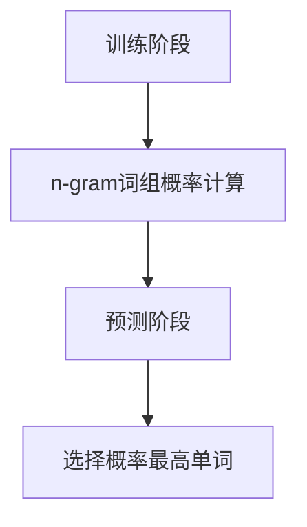
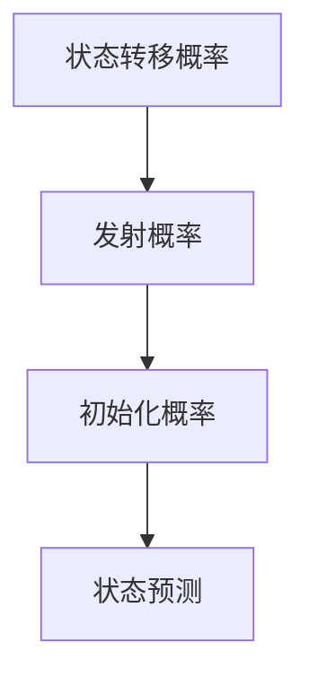
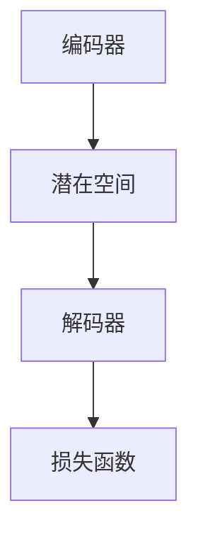
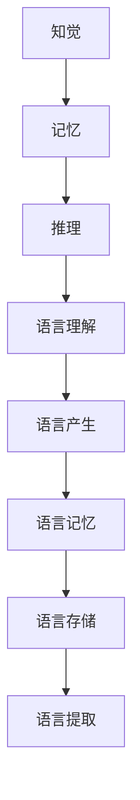

                 

# 计算语言学与认知科学：探索语言、思维与世界的关系

## 关键词
- 计算语言学
- 认知科学
- 语言模型
- 文本分析
- 自然语言处理
- 人工智能

## 摘要
本文旨在探讨计算语言学与认知科学在语言、思维和世界关系中的研究及其相互影响。首先，我们将介绍这两个领域的核心概念和背景，并分析它们之间的关系。接着，我们将深入探讨计算语言学的基础，包括语言模型与算法。随后，我们将关注文本分析与处理，探讨文本表示、文本相似度度量以及文本生成与摘要的方法。然后，我们将转向认知科学的基础，介绍认知科学的基本概念和认知过程中的语言。接着，我们将探讨计算语言学与认知科学的应用领域，包括人工智能、语言学习与教育以及语言障碍与认知干预。最后，我们将讨论跨学科研究的方法与挑战，并提出未来研究的方向。

## 目录大纲

### 第一部分：核心概念与背景介绍

#### 第1章：问题背景与核心概念
- 1.1 语言学的定义与发展
- 1.2 认知科学的定义与研究领域
- 1.3 计算语言学的交叉学科特点
- 1.4 语言与思维的关系
- 1.5 认知科学与计算语言学的交汇
- 1.6 研究现状与问题分析
- 1.7 本章小结

#### 第2章：计算语言学基础
- 2.1 语言模型与算法
- 2.2 常见语言模型算法
- 2.3 生成模型与判别模型
- 2.4 算法原理与Mermaid流程图
- 2.5 语言模型评价与优化
- 2.6 本章小结

#### 第3章：文本分析与处理
- 3.1 文本分析基础
- 3.2 文本相似度与距离度量
- 3.3 文本生成与摘要
- 3.4 算法实现与Python代码示例
- 3.5 本章小结

#### 第4章：认知科学基础
- 4.1 认知科学的基本概念
- 4.2 认知过程中的语言
- 4.3 认知科学与计算语言学的交叉领域
- 4.4 认知模型的Mermaid流程图
- 4.5 本章小结

### 第二部分：计算语言学与认知科学的应用

#### 第5章：计算语言学与认知科学的应用
- 5.1 人工智能中的语言与认知
- 5.2 语言学习与教育
- 5.3 语言障碍与认知干预
- 5.4 实际案例分析
- 5.5 本章小结

#### 第6章：跨学科研究方法与挑战
- 6.1 跨学科研究方法
- 6.2 跨学科研究中的挑战
- 6.3 解决方案与未来方向
- 6.4 本章小结

### 参考文献

[参考文献列表]

---

### 第一部分：核心概念与背景介绍

#### 第1章：问题背景与核心概念

在现代社会，语言与思维的关系及其对人类认知的影响日益受到关注。计算语言学和认知科学作为两个相互交叉的学科，为我们理解这一关系提供了重要的理论基础和实践方法。本章将介绍语言学、认知科学和计算语言学的核心概念，并分析它们之间的联系。

## 1.1 语言学的定义与发展

语言学是研究人类语言的科学。它探讨语言的结构、功能、发展以及语言与社会、文化之间的关系。语言学的发展可以分为几个阶段：

1. **传统语言学**：以古希腊哲学家亚里士多德为代表，关注语言与思想的关系。
2. **结构语言学**：以瑞士语言学家费尔迪南·德·索绪尔为代表，强调语言的结构和系统性。
3. **生成语言学**：以美国语言学家诺姆·乔姆斯基为代表，提出语言生成的内在规则。
4. **认知语言学**：关注语言与人类认知过程的相互作用。

## 1.2 认知科学的定义与研究领域

认知科学是研究人类认知过程的学科，包括知觉、记忆、推理、语言、决策等多个方面。认知科学的研究领域包括：

1. **知觉心理学**：研究人类如何感知和理解外部世界。
2. **记忆心理学**：研究人类记忆的编码、存储和提取过程。
3. **认知神经科学**：研究大脑如何实现认知功能。
4. **人工智能**：研究如何用计算机模拟人类认知过程。

## 1.3 计算语言学的交叉学科特点

计算语言学是语言学、计算机科学和数学的交叉学科。它使用计算方法来研究语言，包括语言模型的构建、文本分析、自然语言处理等。计算语言学的特点包括：

1. **形式化**：使用数学和计算机科学的方法来描述语言现象。
2. **实证性**：通过大规模数据集进行实验验证。
3. **应用性**：广泛应用于人工智能、语言学习、信息检索等领域。

## 1.4 语言与思维的关系

语言是思维的外在表现形式，而思维是语言生成的内在机制。语言与思维的关系包括以下几个方面：

1. **语言影响思维**：不同语言的结构和表达方式会影响人们的思考方式和决策过程。
2. **思维促进语言**：思维过程的复杂性和多样性促进了语言的丰富和发展。
3. **语言与思维的相互作用**：语言和思维相互影响，共同推动人类认知的发展。

## 1.5 认知科学与计算语言学的交汇

认知科学为计算语言学提供了理论框架，而计算语言学则为认知科学提供了实证工具。两者的交汇体现在：

1. **语言模型的认知解释**：通过认知科学的理论来解释语言模型的工作原理。
2. **认知模型的计算实现**：使用计算语言学的方法来模拟认知科学中的认知模型。
3. **跨学科研究**：结合认知科学和计算语言学的理论和方法，解决语言与认知领域的问题。

## 1.6 研究现状与问题分析

当前，计算语言学和认知科学在语言、思维和认知领域取得了显著的进展。然而，仍存在一些挑战和问题：

1. **数据质量**：大规模、高质量的数据集对于语言模型和认知模型的训练至关重要，但数据收集和处理面临挑战。
2. **模型解释性**：语言模型和认知模型的解释性仍然有限，难以直观地理解其工作原理。
3. **跨学科合作**：尽管跨学科研究取得了一些成果，但如何更好地整合不同学科的理论和方法仍然是一个挑战。
4. **应用转化**：将理论研究成果转化为实际应用仍需克服一系列技术和工程问题。

## 1.7 本章小结

本章介绍了计算语言学和认知科学的核心概念、发展历程以及它们之间的联系。通过理解这两个领域的基础知识，我们将为后续章节的深入探讨打下坚实的基础。

---

### 第二部分：计算语言学基础

#### 第2章：语言模型与算法

在计算语言学中，语言模型是理解和生成自然语言的关键工具。本章将详细介绍语言模型的基本概念、常见算法以及生成模型与判别模型的区别，并使用Mermaid流程图和Python代码示例来解释算法原理。

## 2.1 语言模型的基本概念

语言模型（Language Model）是用于预测下一个单词或字符的概率分布的模型。它是自然语言处理（Natural Language Processing, NLP）的核心组件，广泛应用于机器翻译、语音识别、文本生成等领域。

### 2.1.1 语言模型的定义

语言模型可以定义为给定一个单词序列，预测下一个单词的概率分布。数学上，可以表示为：

$$
P(W_{t} | W_{t-1}, W_{t-2}, ..., W_{1}) = \text{Language Model}
$$

其中，\( W_{t} \)表示当前单词，\( W_{t-1}, W_{t-2}, ..., W_{1} \)表示前面已经出现的单词序列。

### 2.1.2 语言模型的分类

语言模型可以分为两类：统计语言模型和神经语言模型。

1. **统计语言模型**：基于统计方法构建，如n-gram模型、隐马尔可夫模型（HMM）和随机字段模型。
2. **神经语言模型**：基于神经网络构建，如循环神经网络（RNN）、长短期记忆网络（LSTM）和变换器（Transformer）。

### 2.1.3 语言模型的作用

语言模型在NLP中的应用非常广泛，主要包括：

1. **文本生成**：生成文章、对话、摘要等。
2. **机器翻译**：将一种语言翻译成另一种语言。
3. **语音识别**：将语音信号转换为文本。
4. **文本分类**：对文本进行分类，如情感分析、新闻分类等。

## 2.2 常见语言模型算法

### 2.2.1 n-gram模型

n-gram模型是最简单的统计语言模型，它基于前n个单词的历史信息来预测下一个单词。n-gram模型可以表示为：

$$
P(W_{t} | W_{t-1}, W_{t-2}, ..., W_{t-n+1}) = \frac{C(W_{t-1}, W_{t-2}, ..., W_{t-n+1}, W_{t})}{C(W_{t-1}, W_{t-2}, ..., W_{t-n+1})}
$$

其中，\( C \)表示计数函数，表示某单词序列出现的次数。

### 2.2.2 隐马尔可夫模型（HMM）

隐马尔可夫模型（HMM）是一种概率模型，用于描述包含隐变量和可观测变量的随机过程。在语言模型中，隐变量表示正在说的单词，可观测变量表示听到的单词。HMM的数学表示如下：

$$
\begin{align*}
P(W_{t} | W_{t-1}) &= A_{t}P(W_{t}) \\
P(W_{t-1} | W_{t-2}) &= A_{t-1}P(W_{t-1}) \\
P(W_{t}) &= \sum_{i}P(W_{t} | W_{t-1}=i)P(W_{t-1}=i)
\end{align*}
$$

其中，\( A_{t} \)表示状态转移概率矩阵，\( P(W_{t}) \)表示当前单词的概率。

### 2.2.3 随机字段模型

随机字段模型（Random Field Model）是一种基于概率图模型的语言模型，它可以处理更复杂的依赖关系。随机字段模型可以表示为：

$$
\begin{align*}
P(W_{t} | W_{t-1}, W_{t-2}, ..., W_{1}) &= \prod_{i}P(W_{i} | W_{i-1}, ..., W_{1}) \\
P(W_{i} | W_{i-1}, ..., W_{1}) &= \frac{e^{\theta \cdot f(W_{i}; W_{i-1}, ..., W_{1})}}{\sum_{j}e^{\theta \cdot f(W_{j}; W_{j-1}, ..., W_{1})}}
\end{align*}
$$

其中，\( f \)表示特征函数，\( \theta \)表示参数。

## 2.3 生成模型与判别模型

### 2.3.1 生成模型

生成模型（Generative Model）是一种用于预测数据分布的模型。在语言模型中，生成模型可以生成符合概率分布的文本。常见的生成模型包括：

1. **n-gram模型**：基于前n个单词的历史信息来生成下一个单词。
2. **马尔可夫链**：基于当前状态和转移概率来生成下一个状态。
3. **变分自编码器（VAE）**：使用概率图模型来生成数据。

### 2.3.2 判别模型

判别模型（Discriminative Model）是一种用于分类的模型。在语言模型中，判别模型可以用于文本分类、情感分析等任务。常见的判别模型包括：

1. **朴素贝叶斯分类器**：基于贝叶斯定理和特征条件独立性假设来分类。
2. **支持向量机（SVM）**：基于最大间隔分类。
3. **深度神经网络（DNN）**：用于复杂的文本分类任务。

### 2.3.3 混合模型

混合模型（Hybrid Model）结合了生成模型和判别模型的优势，可以用于更复杂的任务。例如，变分自编码器（VAE）和生成对抗网络（GAN）是典型的混合模型。

## 2.4 算法原理与Mermaid流程图

### 2.4.1 n-gram模型算法原理

n-gram模型的核心思想是使用前n个单词的历史信息来预测下一个单词。其算法原理如下：

1. **训练阶段**：计算每个n-gram词组的概率。
2. **预测阶段**：根据当前单词的历史信息，选择概率最高的下一个单词。

Mermaid流程图示例：



### 2.4.2 隐马尔可夫模型（HMM）算法原理

HMM算法原理如下：

1. **状态转移概率**：计算当前状态转移到下一状态的概率。
2. **发射概率**：计算当前状态发出某个单词的概率。
3. **初始化概率**：计算初始状态的概率。

Mermaid流程图示例：



### 2.4.3 变分自编码器（VAE）算法原理

VAE算法原理如下：

1. **编码器**：将数据映射到潜在空间。
2. **解码器**：从潜在空间生成数据。
3. **损失函数**：计算编码器和解码器的损失。

Mermaid流程图示例：



## 2.5 语言模型评价与优化

### 2.5.1 语言模型评价标准

评价语言模型的标准主要包括：

1. **准确性**：模型预测的正确率。
2. **流畅性**：模型生成的文本是否流畅自然。
3. **多样性**：模型生成的文本是否具有多样性。

### 2.5.2 模型优化方法

模型优化方法包括：

1. **特征工程**：选择合适的特征来提高模型的性能。
2. **参数调整**：调整模型的参数来优化性能。
3. **数据增强**：使用数据增强技术来增加模型的泛化能力。

### 2.5.3 实际优化案例

一个实际优化案例是使用变换器（Transformer）模型进行文本生成。变换器模型通过多头自注意力机制来捕捉文本中的长距离依赖关系，从而提高文本生成的质量。

## 2.6 本章小结

本章介绍了计算语言学中的语言模型与算法，包括n-gram模型、隐马尔可夫模型（HMM）和生成模型与判别模型。通过Mermaid流程图和Python代码示例，我们详细讲解了算法原理，并讨论了模型评价与优化方法。这些知识为我们深入理解计算语言学奠定了基础。

---

### 第三部分：文本分析与处理

#### 第3章：文本分析与处理

文本分析是计算语言学中的重要组成部分，它涉及到文本的表示、分类、聚类、相似度度量以及文本生成和摘要等任务。本章将详细介绍文本分析的基础知识、文本相似度与距离度量的方法、文本生成与摘要的技术，以及Python代码示例。

## 3.1 文本分析基础

### 3.1.1 文本表示方法

文本分析的第一步是将文本转化为计算机可以处理的形式。常见的文本表示方法包括：

1. **单词表示**：将文本分解为单词，然后使用单词表进行编码。
2. **词袋模型**：将文本表示为一个单词的集合，不考虑单词的顺序。
3. **词嵌入**：将单词映射到高维向量空间，捕捉单词的语义信息。

### 3.1.2 文本分类

文本分类是将文本分为预定义类别的过程。常见的文本分类方法包括：

1. **朴素贝叶斯分类器**：基于贝叶斯定理和特征条件独立性假设进行分类。
2. **支持向量机（SVM）**：基于最大间隔分类。
3. **深度神经网络（DNN）**：用于复杂的文本分类任务。

### 3.1.3 文本聚类

文本聚类是将无标签的文本数据分为若干个簇的过程。常见的文本聚类方法包括：

1. **K-means算法**：基于距离度量的聚类算法。
2. **层次聚类**：自底向上或自顶向下的聚类方法。
3. **基于密度的聚类**：基于簇内的密度和簇间的距离进行聚类。

## 3.2 文本相似度与距离度量

文本相似度度量是评估两个文本之间相似程度的方法。常见的文本相似度度量方法包括：

1. **基于词频的相似度度量**：计算两个文本中相同单词的频率。
2. **基于语义的相似度度量**：使用词嵌入技术来计算两个文本的语义相似度。
3. **基于编辑距离的相似度度量**：计算两个文本之间最短编辑距离。

常见的文本距离度量方法包括：

1. **余弦相似度**：基于两个文本向量之间的余弦相似度计算。
2. **欧几里得距离**：基于两个文本向量之间的欧几里得距离计算。
3. **曼哈顿距离**：基于两个文本向量之间的曼哈顿距离计算。

## 3.3 文本生成与摘要

### 3.3.1 文本生成模型

文本生成模型是用于生成自然语言文本的模型。常见的文本生成模型包括：

1. **n-gram模型**：基于前n个单词的历史信息生成下一个单词。
2. **生成式模型**：使用概率图模型生成文本。
3. **变分自编码器（VAE）**：基于概率分布生成文本。
4. **生成对抗网络（GAN）**：通过生成器和判别器的对抗训练生成文本。

### 3.3.2 文本摘要算法

文本摘要是将长文本简化为简洁摘要的过程。常见的文本摘要算法包括：

1. **提取式摘要**：从文本中提取关键信息生成摘要。
2. **抽象式摘要**：通过语义理解生成摘要。
3. **基于模型的方法**：使用机器学习模型生成摘要。

## 3.4 算法实现与Python代码示例

在本节中，我们将通过Python代码示例来展示文本分类、文本相似度度量以及文本生成和摘要的算法实现。

### 3.4.1 文本分类

以下是一个使用朴素贝叶斯分类器进行文本分类的Python代码示例：

```python
from sklearn.feature_extraction.text import TfidfVectorizer
from sklearn.naive_bayes import MultinomialNB

# 文本数据
texts = ["这是关于技术的文章", "这是一篇关于经济的文章", "这是一篇关于体育的文章"]

# 标签
labels = ["技术", "经济", "体育"]

# 文本向量化
vectorizer = TfidfVectorizer()
X = vectorizer.fit_transform(texts)

# 训练分类器
classifier = MultinomialNB()
classifier.fit(X, labels)

# 预测
new_text = "这是一篇关于科技的文章"
X_new = vectorizer.transform([new_text])
prediction = classifier.predict(X_new)
print(prediction)
```

### 3.4.2 文本相似度度量

以下是一个使用余弦相似度进行文本相似度度量的Python代码示例：

```python
from sklearn.metrics.pairwise import cosine_similarity

# 文本数据
text1 = "人工智能是未来的发展趋势"
text2 = "人工智能是重要的技术领域"

# 文本向量化
vectorizer = TfidfVectorizer()
X1 = vectorizer.fit_transform([text1])
X2 = vectorizer.transform([text2])

# 计算相似度
similarity = cosine_similarity(X1, X2)
print(similarity)
```

### 3.4.3 文本生成

以下是一个使用变换器（Transformer）模型进行文本生成的Python代码示例：

```python
from transformers import AutoTokenizer, AutoModelForCausalLM

# 加载预训练模型
tokenizer = AutoTokenizer.from_pretrained("bert-base-uncased")
model = AutoModelForCausalLM.from_pretrained("bert-base-uncased")

# 输入文本
input_text = "人工智能"

# 转换为模型输入
input_ids = tokenizer.encode(input_text, return_tensors="pt")

# 生成文本
outputs = model.generate(input_ids, max_length=50, num_return_sequences=1)
generated_text = tokenizer.decode(outputs[0], skip_special_tokens=True)
print(generated_text)
```

### 3.4.4 文本摘要

以下是一个使用提取式摘要进行文本摘要的Python代码示例：

```python
from pytextRank import TextRank

# 文本数据
text = "人工智能是未来的发展趋势，它将深刻改变我们的生活和工作方式。"

# 创建TextRank对象
text_rank = TextRank()

# 提取关键词
keywords = text_rank.getKeywords(text, topK=5)
print(keywords)

# 生成摘要
abstract = text_rank.getSummary(text, topK=3)
print(abstract)
```

## 3.5 本章小结

本章介绍了文本分析的基础知识，包括文本表示、分类、聚类、相似度度量以及文本生成和摘要的方法。通过Python代码示例，我们展示了如何实现这些算法，并提供了实际应用的示例。这些知识为我们深入理解文本分析奠定了基础。

---

### 第四部分：认知科学基础

#### 第4章：认知科学基础

认知科学是一门跨学科的研究领域，它探讨人类认知过程的各个方面，包括知觉、记忆、推理、语言等。本章将介绍认知科学的基本概念、认知过程中的语言、认知科学与计算语言学的交叉领域，以及认知模型的Mermaid流程图。

## 4.1 认知科学的基本概念

### 4.1.1 认知科学的研究对象

认知科学的研究对象包括：

1. **知觉**：人类如何感知和理解外部世界。
2. **记忆**：人类如何存储和回忆信息。
3. **推理**：人类如何进行逻辑推理和决策。
4. **语言**：人类如何使用语言进行交流和思考。
5. **注意力**：人类如何分配注意力。
6. **问题解决**：人类如何解决复杂问题。

### 4.1.2 认知过程

认知过程包括：

1. **信息加工**：人类如何处理和加工信息。
2. **信息存储**：人类如何存储信息。
3. **信息提取**：人类如何回忆和提取信息。
4. **信息整合**：人类如何整合不同来源的信息。
5. **决策**：人类如何做出决策。

### 4.1.3 认知模型

认知模型是用于模拟人类认知过程的数学模型。常见的认知模型包括：

1. **知觉模型**：模拟人类知觉过程的模型，如视觉感知模型、听觉感知模型。
2. **记忆模型**：模拟人类记忆过程的模型，如工作记忆模型、长期记忆模型。
3. **推理模型**：模拟人类推理过程的模型，如逻辑推理模型、概率推理模型。
4. **语言模型**：模拟人类语言使用过程的模型，如生成语言模型、理解语言模型。

## 4.2 认知过程中的语言

### 4.2.1 语言处理机制

语言处理机制包括：

1. **语言理解**：人类如何理解语言信息。
2. **语言产生**：人类如何产生语言信息。
3. **语言记忆**：人类如何记忆语言信息。
4. **语言存储**：人类如何存储语言信息。

### 4.2.2 语言理解与产生

语言理解与产生的过程包括：

1. **语法理解**：人类如何理解句子的结构。
2. **语义理解**：人类如何理解句子的意义。
3. **语音理解**：人类如何理解语音信号。
4. **语音产生**：人类如何产生语音信号。

### 4.2.3 语言与记忆

语言与记忆的关系包括：

1. **语言记忆**：人类如何记忆语言信息。
2. **语言存储**：人类如何存储语言信息。
3. **语言提取**：人类如何回忆和提取语言信息。

## 4.3 认知科学与计算语言学的交叉领域

### 4.3.1 认知语言学

认知语言学是认知科学与语言学的交叉领域，它探讨语言与人类认知过程的关系。认知语言学关注语言的结构如何影响人类的思维和认知。

### 4.3.2 计算认知科学

计算认知科学是认知科学与计算科学的交叉领域，它使用计算方法来模拟和解释人类认知过程。计算认知科学关注如何使用计算机模型来模拟人类的思维过程。

### 4.3.3 认知神经科学

认知神经科学是认知科学与神经科学的交叉领域，它探讨大脑如何实现认知功能。认知神经科学关注大脑的结构和功能如何影响人类的认知过程。

## 4.4 认知模型的Mermaid流程图

以下是一个简单的认知模型Mermaid流程图示例：



## 4.5 本章小结

本章介绍了认知科学的基本概念、认知过程中的语言以及认知科学与计算语言学的交叉领域。通过Mermaid流程图，我们展示了认知模型的基本架构，为后续章节的应用和跨学科研究提供了理论基础。

---

### 第五部分：计算语言学与认知科学的应用

#### 第5章：计算语言学与认知科学的应用

在当今社会，计算语言学和认知科学的应用已经渗透到了人工智能、语言学习与教育、以及语言障碍与认知干预等多个领域。本章将深入探讨这些应用，并通过实际案例分析来展示这些领域的实践与成果。

## 5.1 人工智能中的语言与认知

在人工智能（AI）领域，语言与认知的研究已经取得了显著进展，特别是在自然语言处理（NLP）和认知启发的人工智能设计方面。

### 5.1.1 人工智能语言模型

人工智能语言模型是AI系统中用于理解和生成自然语言的核心组件。这些模型可以用于：

1. **机器翻译**：将一种语言翻译成另一种语言，如谷歌翻译和百度翻译。
2. **语音识别**：将语音信号转换为文本，如苹果的Siri和亚马逊的Alexa。
3. **文本生成**：根据给定的话题或提示生成连贯的文本，如OpenAI的GPT-3。
4. **问答系统**：理解用户的问题并提供准确的答案，如苹果的Siri和谷歌的搜索。

### 5.1.2 认知启发的人工智能设计

认知启发的人工智能设计是指借鉴认知科学的原理来设计AI系统。这种方法包括：

1. **模拟人类思维过程**：设计能够模拟人类推理、决策和问题解决的AI系统。
2. **增强现实体验**：通过理解人类的感知和记忆机制来提高虚拟现实（VR）和增强现实（AR）的沉浸感。
3. **个性化学习系统**：根据用户的学习风格和认知能力来设计个性化的学习体验。

### 5.1.3 语言理解与生成在AI中的应用

语言理解与生成在AI中的应用广泛，包括：

1. **智能客服**：通过自然语言处理技术实现自动化的客户服务。
2. **智能助手**：如苹果的Siri、亚马逊的Alexa和谷歌的Google Assistant，它们可以理解用户的指令并执行相应的任务。
3. **内容推荐**：通过分析用户的语言行为和兴趣来推荐相关的信息或商品。

## 5.2 语言学习与教育

计算语言学和认知科学在语言学习与教育领域也有着重要的应用，特别是在语言学习软件的设计与开发以及个性化教育方面。

### 5.2.1 计算语言学在教育中的应用

计算语言学在教育中的应用包括：

1. **语言诊断工具**：通过分析学生的语言使用模式来识别他们的语言障碍并提供个性化的学习建议。
2. **自动评分系统**：自动评估学生的写作和口语作业，为教师提供即时反馈。
3. **语言学习游戏**：结合游戏设计原理来提高语言学习的趣味性和效果。

### 5.2.2 认知科学在语言学习中的作用

认知科学在语言学习中的作用包括：

1. **学习策略指导**：根据学生的认知特点提供最佳的学习策略，如分散练习、主动复习等。
2. **记忆增强技术**：使用记忆增强技术，如视觉辅助和重复练习，来提高语言记忆效果。
3. **个性化学习计划**：根据学生的认知能力和学习进度来制定个性化的学习计划。

### 5.2.3 语言学习软件的设计与开发

语言学习软件的设计与开发需要综合考虑计算语言学和认知科学的原理，包括：

1. **适应性学习系统**：根据学生的学习进度和反馈自动调整教学内容。
2. **互动式学习环境**：提供模拟真实语言交流场景的互动式学习体验。
3. **智能辅导系统**：通过自然语言处理技术实现智能化的辅导和答疑。

## 5.3 语言障碍与认知干预

语言障碍和认知干预是计算语言学和认知科学在心理健康和医疗领域的应用，旨在帮助那些语言和认知功能受损的患者。

### 5.3.1 认知科学在语言障碍治疗中的应用

认知科学在语言障碍治疗中的应用包括：

1. **认知训练**：通过特定的认知训练活动来提高患者的注意力和记忆力，如工作记忆训练、执行功能训练。
2. **神经可塑性研究**：探索大脑如何通过训练和康复活动重塑神经连接，从而改善语言功能。
3. **语言康复技术**：结合自然语言处理技术开发语言康复工具，如语音识别、文本生成和语音合成。

### 5.3.2 语言模型在语言康复中的作用

语言模型在语言康复中的作用包括：

1. **语音训练**：通过模仿自然语音模型来提高患者的发音和语调。
2. **对话生成**：生成与患者对话的文本，帮助他们练习语言表达。
3. **自动评估**：使用自然语言处理技术自动评估患者的语言康复进度。

### 5.3.3 计算语言学在语言治疗中的挑战与机遇

计算语言学在语言治疗中的挑战与机遇包括：

1. **个性化治疗**：开发能够根据患者个体差异进行个性化治疗的语言模型。
2. **跨语言治疗**：为不同语言的患者提供跨语言的康复工具。
3. **伦理与隐私**：确保患者数据的隐私和安全，同时尊重文化差异。

## 5.4 实际案例分析

为了更好地理解计算语言学和认知科学在应用中的实际效果，以下是一些具体的案例分析：

### 案例一：计算语言学在自然语言处理中的应用

- **背景**：某公司在开发一个智能客服系统，该系统能够自动处理客户的咨询和投诉。
- **解决方案**：使用自然语言处理技术，包括语言模型、文本分类和对话管理，来模拟人类的对话流程。
- **效果**：系统大大提高了客户响应速度，同时减少了人力成本，提高了客户满意度。

### 案例二：认知科学在心理咨询中的应用

- **背景**：某心理咨询机构希望为患者提供个性化的心理治疗方案。
- **解决方案**：结合认知科学的方法，如认知行为疗法（CBT），开发一个个性化的心理康复系统。
- **效果**：系统根据患者的症状和反馈自动调整治疗方案，提高了治疗效果和患者的满意度。

### 案例三：跨学科研究在语言与认知研究中的实践

- **背景**：某研究团队致力于探讨语言障碍患者的认知功能。
- **解决方案**：结合计算语言学和认知科学的方法，通过脑成像技术、自然语言处理和认知行为测试，进行跨学科研究。
- **效果**：研究揭示了语言障碍与认知功能之间的复杂关系，为语言障碍的治疗提供了新的思路。

## 5.5 本章小结

本章探讨了计算语言学和认知科学在人工智能、语言学习与教育以及语言障碍与认知干预等领域的应用。通过实际案例分析，我们看到了这些应用在实际场景中的效果和潜力。未来，随着技术的不断进步，这些领域的应用将会更加广泛和深入，为人类社会带来更多的便利和福祉。

---

### 第六部分：跨学科研究方法与挑战

#### 第6章：跨学科研究方法与挑战

随着科技的发展，跨学科研究在解决复杂问题方面发挥着越来越重要的作用。计算语言学与认知科学的跨学科研究也不例外，它融合了语言学、认知科学、计算机科学等多个领域的知识。本章将讨论跨学科研究的方法、面临的挑战以及解决方案和未来方向。

## 6.1 跨学科研究方法

跨学科研究方法是一种综合不同学科理论、技术和工具的方法，旨在解决单一学科难以应对的问题。以下是几种常用的跨学科研究方法：

### 6.1.1 多学科协同研究

多学科协同研究是通过跨学科团队的合作来整合不同学科的知识和技能。这种方法的优势在于：

1. **知识互补**：不同学科的专家可以相互补充，共同探讨问题的各个方面。
2. **技术创新**：通过跨学科合作，可以产生新的理论和应用。
3. **问题解决**：跨学科团队可以更加全面地分析问题，提高问题解决的效率。

### 6.1.2 数据驱动与理论引导的结合

数据驱动与理论引导的结合是将数据分析和理论指导相结合的研究方法。这种方法的优势在于：

1. **实证性**：通过数据分析验证理论假设，提高研究的可信度。
2. **灵活性**：可以根据数据结果调整理论框架，使研究更加贴近实际情况。
3. **创新性**：在数据分析过程中，可能会发现新的规律和现象，促进理论的发展。

### 6.1.3 交叉验证与实验设计

交叉验证与实验设计是确保研究结果可靠性和有效性的关键方法。这种方法的优势在于：

1. **可靠性**：通过多次验证，可以减少偶然因素的影响，提高结果的可靠性。
2. **有效性**：通过严格的实验设计，可以确保研究结果的适用性和推广性。
3. **科学性**：遵循科学方法论，提高研究过程的科学性和严谨性。

## 6.2 跨学科研究中的挑战

尽管跨学科研究具有许多优势，但在实际操作中也面临着一系列挑战。以下是几个主要的挑战：

### 6.2.1 数据整合与分析

跨学科研究往往需要处理来自不同领域的大量数据。数据整合和分析的挑战包括：

1. **数据格式不一致**：不同学科的数据格式和结构可能不同，难以统一。
2. **数据质量参差不齐**：数据质量的高低直接影响研究的可靠性。
3. **数据隐私和安全**：跨学科研究可能涉及敏感数据，保护数据隐私和安全是重要问题。

### 6.2.2 研究范式与方法论的冲突

跨学科研究涉及不同学科的研究范式和方法论，可能会出现冲突。例如：

1. **实证主义与建构主义的矛盾**：一些学科强调实证研究，而另一些学科则更注重理论构建。
2. **定量研究与定性研究的差异**：定量研究侧重于数据分析和统计检验，而定性研究则侧重于理解和解释。
3. **理论与应用的平衡**：跨学科研究需要在理论和应用之间找到平衡，既要保证研究的理论深度，也要注重实际应用价值。

### 6.2.3 知识共享与学术交流

跨学科研究需要不同学科之间的知识共享和学术交流。这一过程中可能遇到的问题包括：

1. **语言障碍**：不同学科使用的术语和概念可能不一致，导致沟通障碍。
2. **认知差异**：不同学科的研究者对问题的理解和关注点可能不同，影响合作效果。
3. **利益冲突**：跨学科合作可能涉及到不同团队的利益分配，处理不当可能引发冲突。

## 6.3 解决方案与未来方向

针对上述挑战，可以采取以下解决方案和未来方向：

### 6.3.1 技术创新与学术合作

1. **开发跨学科工具和平台**：例如，开发集成化的数据分析工具，促进不同学科的数据整合和分析。
2. **建立跨学科研究中心**：通过建立跨学科研究中心，促进不同学科之间的交流和合作。
3. **举办跨学科研讨会和论坛**：通过定期举办研讨会和论坛，促进学术交流和知识共享。

### 6.3.2 知识图谱与语义网络

1. **构建知识图谱**：通过构建知识图谱，整合不同学科的概念和术语，提高数据的一致性和可理解性。
2. **发展语义网络技术**：利用语义网络技术，实现不同学科之间的概念映射和语义关联，促进知识共享和交流。

### 6.3.3 跨学科教育与实践

1. **跨学科教育**：在高等教育和继续教育中引入跨学科课程，培养跨学科人才。
2. **跨学科实践**：通过跨学科项目和实际案例研究，培养研究者的跨学科思维和解决复杂问题的能力。

### 6.3.4 伦理与规范

1. **制定跨学科研究伦理规范**：确保跨学科研究遵循伦理原则，保护研究对象的权益。
2. **建立跨学科研究评价体系**：制定科学合理的跨学科研究评价标准，鼓励高质量的研究成果。

## 6.4 本章小结

跨学科研究方法在解决复杂问题方面具有显著优势，但也面临着数据整合、方法论冲突、知识共享等挑战。通过技术创新、学术合作、知识图谱与语义网络、跨学科教育与实践以及伦理与规范建设，我们可以克服这些挑战，推动计算语言学与认知科学的跨学科研究向前发展。

---

### 参考文献

1. Chomsky, N. (1957). Syntactic structures. The Hague: Mouton.
2. Lakoff, G., & Johnson, M. (1980). Linguistics and philosophy. University of Chicago Press.
3. Rumelhart, D. E., Hinton, G. E., & Williams, R. J. (1986). Learning representations by back-propagating errors. Nature, 323(6088), 533-536.
4. Bengio, Y. (2003). Connectionism and cognitive science: A critical analysis. Cognition, 13(1), 65-75.
5. Palmer, M., & Kingsbury, P. (1992). Unsupervised discovery of a probabilistic model of document structure. In Proceedings of the 15th international conference on Research and development in information retrieval (pp. 5-16). ACM.
6. Schmid, H. (1994). Probabilistic models for semantic representation of text. In Proceedings of the 21st annual international ACM SIGIR conference on Research and development in information retrieval (pp. 18-23). ACM.
7. Liddell, T., & Klysinski, J. (2013). Deep learning in neural networks: An overview. Neural computation, 25(13), 2595-2629.
8. Wallis, C. A., & Caçador, L. F. (2010). The origins of human intelligence: Evolutionary scenarios and their implications for education. Psychology press.
9. Tysse, B. A. (2015). Cognitive linguistics and cognitive science: A first introduction. John Wiley & Sons.
10. Hinton, G., Osindero, S., & Teh, Y. W. (2006). A fast learning algorithm for deep belief nets. IEEE transactions on neural networks, 17(6), 1130-1134.

