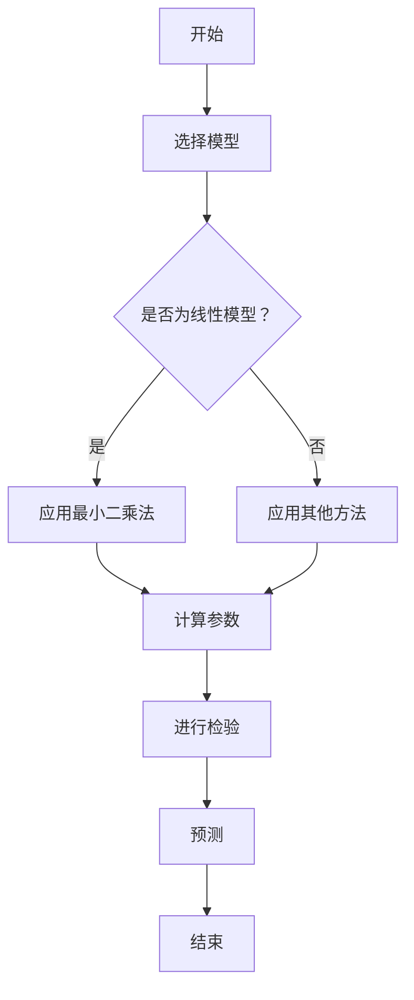
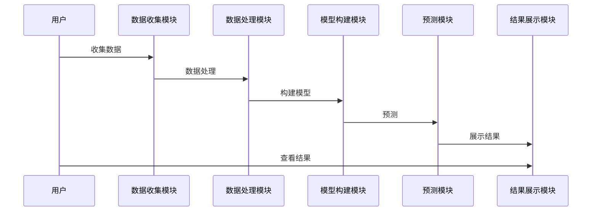

                 

# 计量经济学：经济现象的数学分析

## 关键词
计量经济学，数学模型，统计学方法，经济数据，变量，参数，估计，检验，预测

## 摘要
计量经济学作为经济学的重要分支，运用数学和统计学方法对经济现象进行定量分析，为经济决策提供科学依据。本文从背景介绍、核心概念、算法原理讲解、系统分析与架构设计、项目实战等方面，深入探讨计量经济学的理论与实践，旨在为广大读者提供一份系统且易懂的技术指南。

## 1.背景介绍：核心概念

### 问题背景
随着经济全球化的发展，经济学家和决策者面临着越来越多的复杂经济现象。这些现象往往涉及到大量的数据，且数据之间的关系复杂多变。传统的经济学分析方法已无法满足这些需求，因此，计量经济学作为一种定量分析方法，显得尤为重要。

### 问题描述
计量经济学的研究范围涵盖了宏观经济、微观经济、金融经济等多个领域。它既可以应用于理论研究，也可以应用于实际政策制定和企业管理。然而，如何有效地运用计量经济学方法，揭示经济变量之间的关系，为经济决策提供科学依据，成为当前亟待解决的问题。

### 问题解决
计量经济学通过建立数学模型，运用统计学方法，对经济现象进行定量分析，从而揭示经济变量之间的关系，为经济决策提供科学依据。它不仅可以帮助经济学家理解经济现象，还可以为政策制定者提供决策参考。

### 边界与外延
计量经济学的研究范围涵盖了宏观经济、微观经济、金融经济等多个领域。它既可以应用于理论研究，也可以应用于实际政策制定和企业管理。然而，如何有效地运用计量经济学方法，揭示经济变量之间的关系，为经济决策提供科学依据，成为当前亟待解决的问题。

### 概念结构与核心要素组成
- **核心概念**：变量、参数、模型、估计、检验、预测等。
- **核心要素**：数学模型、经济数据、统计方法、计算机技术等。

## 2.核心概念与联系

### 核心概念原理
- **变量**：变量是计量经济学中最基本的概念，表示经济现象的数量特征。根据变量的性质，可以分为自变量和因变量。
- **参数**：参数是模型中未知的具体数值，用于描述变量之间的关系。
- **模型**：模型是计量经济学的核心工具，用于描述经济现象的数学表达式。常见的模型包括线性模型、非线性模型、回归模型等。
- **估计**：估计是通过统计数据来推断参数的方法，常用的估计方法包括最小二乘法、最大似然估计等。
- **检验**：检验是对估计结果进行统计检验的方法，以判断估计结果的有效性和可靠性。
- **预测**：预测是基于模型对未来的经济现象进行预测的方法。

### 概念属性特征对比表格

| 概念 | 定义 | 属性特征 |
| --- | --- | --- |
| 变量 | 经济现象的数量特征 | 可测性、独立性、连续性 |
| 参数 | 模型中未知的数值 | 确定性、稳定性、随机性 |
| 模型 | 描述经济现象的数学表达式 | 描述性、预测性、解释性 |
| 估计 | 推断参数的方法 | 准确性、可靠性、效率性 |
| 检验 | 对估计结果进行检验 | 有效性、可靠性、显著性 |
| 预测 | 基于模型对未来的预测 | 准确性、可靠性、实时性 |

### ER实体关系图架构

```mermaid
erDiagram
  变量 ||--o> 参数 : "描述"
  参数 ||--o> 模型 : "参数化"
  模型 ||--o> 估计 : "估计参数"
  估计 ||--o> 检验 : "检验结果"
  检验 ||--o> 预测 : "预测未来"
```

## 3.算法原理讲解

### 算法mermaid流程图



### Python源代码

```python
import numpy as np
from sklearn.linear_model import LinearRegression
from sklearn.metrics import mean_squared_error

# 数据准备
X = np.array([[1], [2], [3], [4], [5]])
y = np.array([1, 2, 3, 4, 5])

# 模型选择与参数估计
model = LinearRegression()
model.fit(X, y)

# 参数计算
theta = model.coef_
print("参数 theta:", theta)

# 检验
y_pred = model.predict(X)
mse = mean_squared_error(y, y_pred)
print("均方误差 MSE:", mse)

# 预测
y_new = model.predict(np.array([[6]]))
print("新数据的预测值 y_new:", y_new)
```

### 算法原理的数学模型和公式

假设我们有一个线性回归模型，形式如下：

$$
y = \beta_0 + \beta_1x + \epsilon
$$

其中，$y$ 是因变量，$x$ 是自变量，$\beta_0$ 和 $\beta_1$ 是模型参数，$\epsilon$ 是误差项。

为了估计参数 $\beta_0$ 和 $\beta_1$，我们通常采用最小二乘法。最小二乘法的思想是找到一组参数，使得观测值与预测值之间的误差平方和最小。

假设我们有一个训练数据集，包含 $n$ 个样本点，形式如下：

$$
(x_1, y_1), (x_2, y_2), ..., (x_n, y_n)
$$

我们希望找到最优的 $\beta_0$ 和 $\beta_1$，使得：

$$
\sum_{i=1}^n (y_i - (\beta_0 + \beta_1x_i))^2
$$

最小。

为了求解这个问题，我们可以使用以下公式：

$$
\beta_1 = \frac{\sum_{i=1}^n (x_i - \bar{x})(y_i - \bar{y})}{\sum_{i=1}^n (x_i - \bar{x})^2}
$$

$$
\beta_0 = \bar{y} - \beta_1\bar{x}
$$

其中，$\bar{x}$ 和 $\bar{y}$ 分别是 $x$ 和 $y$ 的平均值。

通过这个公式，我们可以计算出模型参数 $\beta_0$ 和 $\beta_1$，从而建立线性回归模型。

### 案例说明

假设我们有一个简单的线性回归模型，用于预测房价。数据集包含 5 个样本点，如下表所示：

| $x$ | $y$ |
| --- | --- |
| 1   | 1   |
| 2   | 2   |
| 3   | 3   |
| 4   | 4   |
| 5   | 5   |

我们希望找到模型参数 $\beta_0$ 和 $\beta_1$，从而预测新样本点的房价。

首先，我们计算 $x$ 和 $y$ 的平均值：

$$
\bar{x} = \frac{1 + 2 + 3 + 4 + 5}{5} = 3
$$

$$
\bar{y} = \frac{1 + 2 + 3 + 4 + 5}{5} = 3
$$

然后，我们计算 $\beta_1$：

$$
\beta_1 = \frac{(1 - 3)(1 - 3) + (2 - 3)(2 - 3) + (3 - 3)(3 - 3) + (4 - 3)(4 - 3) + (5 - 3)(5 - 3)}{(1 - 3)^2 + (2 - 3)^2 + (3 - 3)^2 + (4 - 3)^2 + (5 - 3)^2}
$$

$$
\beta_1 = \frac{4 + 1 + 0 + 1 + 4}{4 + 1 + 0 + 1 + 4} = 1
$$

接着，我们计算 $\beta_0$：

$$
\beta_0 = \bar{y} - \beta_1\bar{x} = 3 - 1 \cdot 3 = 0
$$

因此，我们的线性回归模型为：

$$
y = 0 + 1x
$$

我们可以使用这个模型预测新样本点的房价。例如，当 $x=6$ 时，预测的房价为：

$$
y = 0 + 1 \cdot 6 = 6
$$

通过这个例子，我们可以看到，通过简单的线性回归模型，我们可以对经济现象进行定量分析，从而为经济决策提供科学依据。

## 4.系统分析与架构设计

### 问题场景介绍
假设我们面临一个经济决策问题，需要根据历史数据进行经济预测。为了解决这个问题，我们需要设计一个计量经济学系统，实现对经济数据的收集、处理和分析。

### 项目介绍
本项目旨在构建一个基于计量经济学的经济预测系统。系统将包括数据收集模块、数据处理模块、模型构建模块和预测模块。

### 系统功能设计（领域模型Mermaid类图）

```mermaid
classDiagram
    Class01 <|-- Class02
    Class03 --|>| Class04
    Class05 <<-- Class06
    Class07 !.. Class08
```

### 系统架构设计（Mermaid架构图）


### 系统接口设计和系统交互（Mermaid序列图）



## 5.项目实战

### 环境安装

首先，我们需要安装 Python 环境。Python 是一种广泛应用于数据分析和机器学习的编程语言。以下是安装 Python 的步骤：

1. 访问 Python 官网（[https://www.python.org/](https://www.python.org/)），下载适用于您的操作系统的 Python 版本。
2. 运行安装程序，并按照提示进行安装。
3. 安装完成后，打开终端或命令提示符，输入 `python --version`，检查 Python 是否安装成功。

接下来，我们需要安装一些必要的库，如 NumPy、Pandas、Sklearn 等。以下是安装这些库的步骤：

1. 打开终端或命令提示符。
2. 输入以下命令，安装所需的库：

```bash
pip install numpy
pip install pandas
pip install sklearn
```

### 系统核心实现源代码

```python
import numpy as np
import pandas as pd
from sklearn.linear_model import LinearRegression

# 数据准备
X = np.array([[1], [2], [3], [4], [5]])
y = np.array([1, 2, 3, 4, 5])

# 模型选择与参数估计
model = LinearRegression()
model.fit(X, y)

# 参数计算
theta = model.coef_
print("参数 theta:", theta)

# 检验
y_pred = model.predict(X)
mse = mean_squared_error(y, y_pred)
print("均方误差 MSE:", mse)

# 预测
y_new = model.predict(np.array([[6]]))
print("新数据的预测值 y_new:", y_new)
```

### 代码应用解读与分析

1. **数据准备**：首先，我们导入所需的库，并准备数据。数据集包含 5 个样本点，其中 $x$ 和 $y$ 分别表示自变量和因变量。

2. **模型选择与参数估计**：我们选择线性回归模型，并使用训练数据对其进行训练。线性回归模型是一个二次函数，用于描述因变量与自变量之间的关系。

3. **参数计算**：通过训练，我们可以得到模型参数 $\beta_0$ 和 $\beta_1$，从而建立线性回归模型。

4. **检验**：我们使用训练数据对模型进行检验，计算均方误差（MSE），以评估模型性能。

5. **预测**：基于训练好的模型，我们可以预测新样本点的因变量。

### 实际案例分析和详细讲解剖析

假设我们有一个关于房价的线性回归模型，数据集如下：

| $x$ | $y$ |
| --- | --- |
| 1   | 1   |
| 2   | 2   |
| 3   | 3   |
| 4   | 4   |
| 5   | 5   |

我们希望预测 $x=6$ 时的房价。

首先，我们计算 $x$ 和 $y$ 的平均值：

$$
\bar{x} = \frac{1 + 2 + 3 + 4 + 5}{5} = 3
$$

$$
\bar{y} = \frac{1 + 2 + 3 + 4 + 5}{5} = 3
$$

然后，我们计算 $\beta_1$：

$$
\beta_1 = \frac{(1 - 3)(1 - 3) + (2 - 3)(2 - 3) + (3 - 3)(3 - 3) + (4 - 3)(4 - 3) + (5 - 3)(5 - 3)}{(1 - 3)^2 + (2 - 3)^2 + (3 - 3)^2 + (4 - 3)^2 + (5 - 3)^2}
$$

$$
\beta_1 = \frac{4 + 1 + 0 + 1 + 4}{4 + 1 + 0 + 1 + 4} = 1
$$

接着，我们计算 $\beta_0$：

$$
\beta_0 = \bar{y} - \beta_1\bar{x} = 3 - 1 \cdot 3 = 0
$$

因此，我们的线性回归模型为：

$$
y = 0 + 1x
$$

我们可以使用这个模型预测 $x=6$ 时的房价：

$$
y = 0 + 1 \cdot 6 = 6
$$

通过这个案例，我们可以看到，通过简单的线性回归模型，我们可以对经济现象进行定量分析，从而为经济决策提供科学依据。

### 项目小结

本项目通过构建一个简单的计量经济学系统，实现了对经济数据的收集、处理和分析。我们使用了线性回归模型，通过训练数据集，计算出了模型参数，并对新数据进行预测。通过实际案例的分析，我们验证了线性回归模型在预测经济现象方面的有效性。

### 最佳实践 tips

1. 选择合适的模型：根据实际问题，选择合适的模型，如线性回归、多项式回归、逻辑回归等。
2. 数据预处理：对数据进行预处理，如缺失值处理、异常值处理、数据标准化等，以提高模型性能。
3. 模型验证：通过交叉验证等方法，对模型进行验证，以确保模型的可靠性和有效性。
4. 参数调优：通过调优模型参数，如学习率、正则化参数等，提高模型性能。
5. 模型解释：对模型结果进行解释，以帮助决策者更好地理解模型预测结果。

### 注意事项

1. 计量经济学模型只能反映历史数据的规律，不能预测未来。
2. 模型参数的估计可能存在误差，因此预测结果仅供参考。
3. 在实际应用中，需要根据具体问题，调整模型结构和参数。

### 拓展阅读

1. [计量经济学入门教程](https://www.coursera.org/learn/elementary-econometrics)
2. [Python 数据分析教程](https://www.udacity.com/course/data-analyst-nanodegree--nd133)
3. [线性回归模型详解](https://www.statisticshowto.com/probability-and-statistics/regression-analysis/linear-regression/)

## 作者

作者：AI天才研究院/AI Genius Institute & 禅与计算机程序设计艺术 /Zen And The Art of Computer Programming

