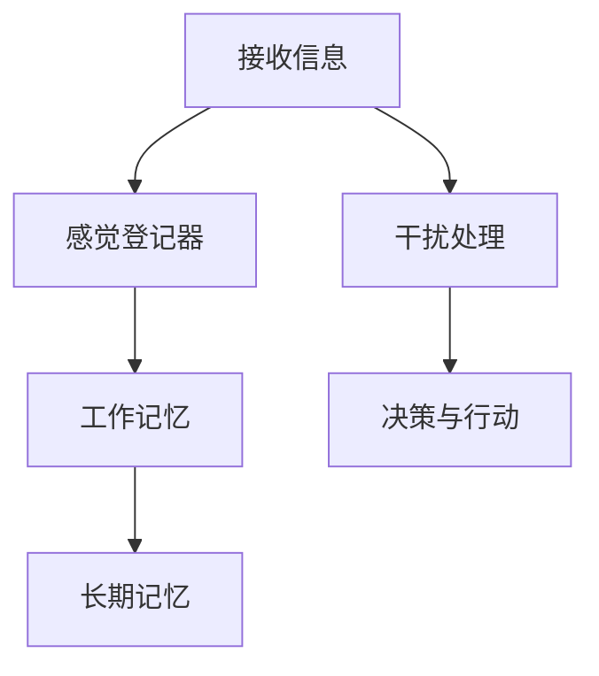
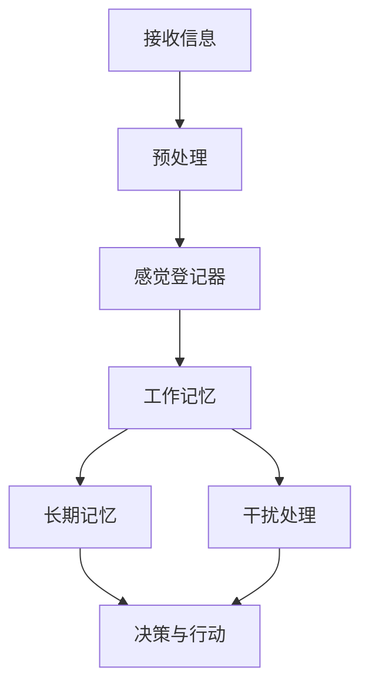
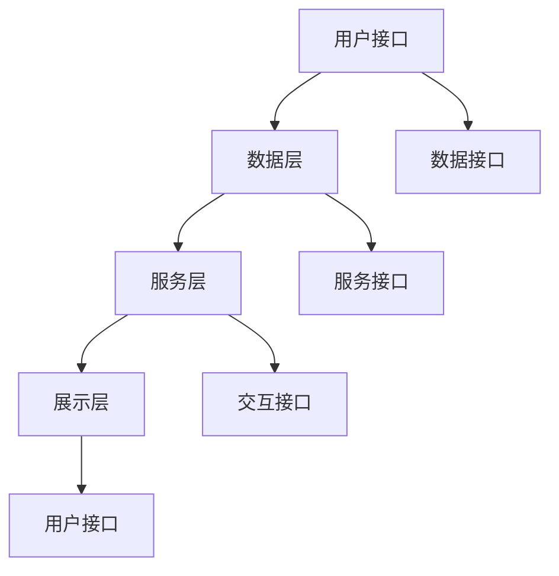

                 

## 文章标题

### 关键词

- 认知增强
- 智力优化
- 人类理解能力
- 复杂世界
- 技术博客

### 摘要

本文将探讨认知增强与智力优化在提升人类理解复杂世界能力方面的重要性。通过分析相关背景、核心概念、算法原理、数学模型及系统架构设计，我们将一步步揭示如何通过技术手段优化人类的认知能力，进而提高对复杂世界的理解和应对能力。文章还将结合实际项目实战和最佳实践，提供具体方法和技巧，以期为读者提供全面的认知增强与智力优化指南。

---

## 第一部分：认知增强与智力优化的背景介绍

### 1.1 问题背景

#### 1.1.1 现代社会面临的认知挑战

随着信息时代的到来，人类社会面临着前所未有的认知挑战。大数据、云计算、人工智能等技术的迅猛发展，使得信息爆炸和知识积累的速度远超人类大脑的处理能力。在这样一个复杂多变的环境中，人们需要迅速理解和应对大量、快速变化的信息，这给传统的认知能力带来了巨大压力。

#### 1.1.2 认知增强的必要性

为了应对这些挑战，认知增强成为了提高人类理解复杂世界能力的重要手段。认知增强不仅仅是为了弥补人类认知能力的不足，更是为了提升人类在复杂环境中的适应能力和创新能力。通过认知增强，人类可以更有效地处理信息、作出决策、解决复杂问题。

#### 1.1.3 智力优化的目标

智力优化则是认知增强的进一步深化。它不仅关注认知能力的提升，还涉及智力结构的优化和认知模式的转变。智力优化的目标是培养人类在面对复杂问题时，能够更加灵活、高效地思考和行动，从而提高整体智力水平。

### 1.2 核心概念

#### 1.2.1 认知增强的定义

认知增强是指通过技术手段，提高人类大脑处理信息的能力，包括记忆力、注意力、感知力、思考力等多个方面。认知增强可以通过训练、药物、设备等途径实现。

#### 1.2.2 智力优化的定义

智力优化是指通过科学的方法，对人类大脑进行结构和功能的优化，以提高智力水平。智力优化包括认知训练、神经调控、环境优化等多个方面。

#### 1.2.3 认知增强与智力优化的关系

认知增强和智力优化是相互关联的。认知增强是智力优化的基础，而智力优化则是在认知增强的基础上，对智力水平的进一步提升。两者相辅相成，共同作用于人类认知能力的发展。

### 1.3 边界与外延

#### 1.3.1 认知增强的技术手段

认知增强的技术手段主要包括神经科学、认知心理学、人工智能等。这些技术可以通过训练、设备、药物等多种方式，实现人类认知能力的提升。

#### 1.3.2 智力优化的方法

智力优化的方法包括认知训练、神经调控、营养干预、环境优化等。这些方法可以通过改变大脑结构、提高神经连接效率、改善认知环境等方式，实现智力水平的提升。

#### 1.3.3 认知增强与智力优化的应用场景

认知增强和智力优化可以在教育、医疗、工作等多个领域得到应用。在教育领域，可以提升学生的学习能力和创造力；在医疗领域，可以辅助诊断和治疗神经系统疾病；在工作领域，可以提高工作效率和创新能力。

### 1.4 概念结构与核心要素组成

#### 1.4.1 认知增强的核心要素

认知增强的核心要素包括记忆力、注意力、感知力、思考力等。这些要素是认知增强的基础，直接影响人类对信息的处理能力和认知水平。

#### 1.4.2 智力优化的核心要素

智力优化的核心要素包括大脑结构、神经连接、认知模式等。这些要素是智力优化的关键，决定人类的智力水平和认知能力。

#### 1.4.3 认知增强与智力优化之间的交互作用

认知增强和智力优化之间存在密切的交互作用。认知增强可以提高大脑功能和认知水平，进而促进智力优化；而智力优化又可以增强认知增强的效果，形成良性循环。

### 1.5 本章小结

通过本章节的介绍，我们了解了认知增强与智力优化的背景、核心概念、技术手段和应用场景。这些内容为我们后续的深入探讨奠定了基础。接下来，我们将进一步分析认知增强与智力优化的算法原理、数学模型及系统架构设计，以揭示如何通过技术手段提升人类理解复杂世界的能力。

---

## 第二部分：认知增强与智力优化的核心概念与联系

### 2.1 核心概念原理

在认知增强与智力优化领域，有几个核心概念至关重要。首先是认知负荷（Cognitive Load），它指的是个体在处理信息时所承受的心理压力。认知负荷分为内在认知负荷和外在认知负荷。内在认知负荷与个体必须记忆和处理的内在信息有关，而外在认知负荷则与任务环境中的干扰和复杂性有关。

#### 内在认知负荷

内在认知负荷包括工作记忆、概念学习和规则应用等。例如，在学习一项新的编程语言时，必须记忆新的语法规则和术语，这会导致内在认知负荷的增加。

#### 外在认知负荷

外在认知负荷则包括任务的复杂性和干扰。例如，在处理一个同时涉及多个变量和条件的工程项目时，外在认知负荷可能会由于任务的多变性而增加。

#### 认知负荷与智力优化的关系

认知负荷直接影响个体的认知效率和问题解决能力。过高的认知负荷会降低认知效率，导致错误率和挫折感增加。智力优化旨在通过减少不必要的认知负荷，提高个体的认知能力和问题解决效率。

### 2.2 概念属性特征对比表格

为了更好地理解认知负荷，我们可以通过以下表格来对比不同类型的认知负荷属性特征：

| 类型         | 特征                    | 影响因素                       | 结果           |
| ------------ | ----------------------- | -------------------------------- | -------------- |
| 内在认知负荷 | 记忆、概念学习、规则应用 | 新信息的复杂性和数量               | 影响工作记忆和决策 |
| 外在认知负荷 | 任务复杂性、干扰、多任务处理 | 任务环境、任务结构、注意力分散       | 降低任务效率     |

### 2.3 ER实体关系图架构

为了更好地理解认知负荷与智力优化之间的交互作用，我们可以使用Mermaid工具绘制一个ER（实体关系）图来展示这些概念之间的关系：

```mermaid
erDiagram
  User ||--o{ Task : 担任者 }
  Task ||--|{ Resource : 消耗 }
  Resource ||--o{ Cognitive_Load : 引发 }
  Cognitive_Load ||--|{ Intelligence_Optimization : 应对 }
  Intelligence_Optimization ||--o{ Performance : 结果 }
```

在这个ER图中，用户（User）担任任务（Task），任务消耗资源（Resource），资源引发认知负荷（Cognitive_Load），认知负荷需要通过智力优化（Intelligence_Optimization）来应对，最终影响性能（Performance）。

### 2.4 算法原理讲解

认知负荷的算法原理主要涉及信息处理模型，如信息加工模型和认知架构模型。以下是一个简化的信息加工模型，使用Mermaid工具绘制：



在这个模型中，信息首先通过感觉登记器接收，然后进入工作记忆，经过处理后被转移到长期记忆。同时，干扰处理模块负责处理任务环境中的干扰信息。决策与行动模块则在工作记忆中加工信息，并做出相应的行动决策。

### 2.5 数学模型和公式

为了更详细地解释认知负荷的算法原理，我们可以引入一些数学模型和公式。以下是一个简化的认知负荷计算公式：

$$
Cognitive\ Load = f(Information\ Processing\ Time, Cognitive\ Demand, Distraction\ Level)
$$

其中，$Information\ Processing\ Time$ 代表信息处理时间，$Cognitive\ Demand$ 代表认知需求，$Distraction\ Level$ 代表干扰水平。这个公式表明，认知负荷是这三个因素的函数。

### 2.6 举例说明

为了更直观地理解认知负荷的概念，我们可以通过一个具体的例子来说明。假设一个程序员需要在规定时间内完成一个复杂的代码审查任务。这个任务涉及到理解大量的代码、识别潜在的错误和优化代码性能。

- **信息处理时间**：由于代码量庞大，程序员需要花费较长时间来处理这些信息。
- **认知需求**：程序员需要具备深厚的编程知识和经验，以便准确识别代码中的问题。
- **干扰水平**：在审查过程中，可能会受到其他任务的干扰，如邮件、即时通讯等。

在这种情况下，程序员的工作记忆可能会达到饱和状态，导致认知负荷增加。通过使用认知优化技术，如分阶段审查、设置专注时间等，可以有效地降低认知负荷，提高审查效率。

### 2.7 本章小结

通过本章节的讨论，我们深入了解了认知增强与智力优化的核心概念、属性特征和算法原理。这些概念为我们理解认知负荷、优化认知过程提供了理论基础。在下一章中，我们将进一步探讨数学模型和具体应用场景，以展示如何通过技术手段提升人类理解复杂世界的能力。

---

## 第三部分：认知增强与智力优化的算法原理讲解

### 3.1 认知负荷算法流程图

为了更好地理解认知增强与智力优化的算法原理，我们可以使用Mermaid工具绘制一个简化的认知负荷算法流程图：



在这个流程图中，信息首先经过预处理，然后由感觉登记器接收。感觉登记器将信息传递给工作记忆，工作记忆负责处理和存储信息。同时，干扰处理模块负责处理任务环境中的干扰信息，确保工作记忆中的信息处理不受干扰。最终，工作记忆中的信息被转移到长期记忆，并用于决策和行动。

### 3.2 Python源代码示例

为了进一步说明认知负荷算法的实现，我们可以使用Python编写一个简单的示例：

```python
import numpy as np

def cognitive_load(info Processing Time, cognitive Demand, distraction Level):
    """
    计算认知负荷
    :param info Processing Time: 信息处理时间
    :param cognitive Demand: 认知需求
    :param distraction Level: 干扰水平
    :return: 认知负荷
    """
    # 设定认知负荷的权重
    weight_info_processing = 0.5
    weight_cognitive_demand = 0.3
    weight_distraction_level = 0.2

    # 计算认知负荷
    cognitive_load = (info Processing Time * weight_info_processing +
                      cognitive Demand * weight_cognitive_demand +
                      distraction Level * weight_distraction_level)

    return cognitive_load

# 测试认知负荷
info_processing_time = 10  # 单位：秒
cognitive_demand = 8  # 单位：分
distraction_level = 5  # 单位：分

c_load = cognitive_load(info_processing_time, cognitive_demand, distraction_level)
print(f"认知负荷: {c_load:.2f}")
```

在这个示例中，我们定义了一个名为`cognitive_load`的函数，用于计算认知负荷。函数接收三个参数：信息处理时间、认知需求和干扰水平。通过设定不同的权重，我们可以根据实际情况调整认知负荷的计算方法。最后，我们通过测试输入值来计算认知负荷，并输出结果。

### 3.3 算法原理的数学模型和公式

在认知负荷的计算中，我们可以引入以下数学模型和公式：

$$
Cognitive\ Load = f(Information\ Processing\ Time, Cognitive\ Demand, Distraction\ Level)
$$

其中，$Information\ Processing\ Time$ 代表信息处理时间，$Cognitive\ Demand$ 代表认知需求，$Distraction\ Level$ 代表干扰水平。这个公式表明，认知负荷是这三个因素的函数。

为了更直观地解释，我们可以进一步分解这个公式：

$$
Cognitive\ Load = (Information\ Processing\ Time \times Weight_{info_processing}) + (Cognitive\ Demand \times Weight_{cognitive_demand}) + (Distraction\ Level \times Weight_{distraction_level})
$$

其中，$Weight_{info_processing}$、$Weight_{cognitive_demand}$ 和 $Weight_{distraction_level}$ 分别代表信息处理时间、认知需求和干扰水平的权重。这些权重可以根据实际情况进行调整，以更准确地反映认知负荷。

### 3.4 详细讲解和举例说明

为了更详细地说明认知负荷算法的原理，我们可以通过一个具体的例子来解释。

假设一个程序员需要在4小时内完成一个复杂的软件项目。在项目开发过程中，他需要处理大量的代码、阅读技术文档、进行单元测试等。这个任务涉及到以下三个因素：

- **信息处理时间**：由于项目复杂，程序员估计需要花费3小时来处理代码和文档。
- **认知需求**：程序员需要具备扎实的编程知识和经验，以便准确理解和处理代码。
- **干扰水平**：在项目开发过程中，可能会受到同事的干扰，如讨论问题、协调工作等。

根据上述因素，我们可以使用认知负荷算法来计算程序员的认知负荷：

$$
Cognitive\ Load = (3 \times 0.5) + (8 \times 0.3) + (5 \times 0.2) = 1.5 + 2.4 + 1 = 4.9
$$

这个计算结果表明，程序员的认知负荷为4.9。较高的认知负荷可能会导致程序员在处理任务时出现疲劳、效率下降等问题。为了降低认知负荷，程序员可以采取以下措施：

1. **分阶段处理任务**：将复杂的任务分解为多个小任务，逐步完成，以减少一次性处理的认知负荷。
2. **设定专注时间**：在工作时设定专注时间，如使用番茄工作法，每隔一段时间休息一下，以减少干扰水平。
3. **优化工作环境**：确保工作环境整洁、安静，减少外界干扰，以提高工作效率。

通过这些措施，程序员可以有效地降低认知负荷，提高任务完成效率。

### 3.5 本章小结

通过本章节的讨论，我们详细讲解了认知负荷算法的原理和实现方法。我们使用Mermaid工具绘制了认知负荷算法流程图，并通过Python源代码示例展示了算法的具体实现。此外，我们还通过一个具体的例子，说明了如何使用认知负荷算法来计算和优化程序员的认知负荷。这些内容为我们理解认知增强与智力优化的算法原理提供了深入的理论和实践指导。在下一章中，我们将进一步探讨认知增强与智力优化的数学模型和系统架构设计，以揭示如何通过技术手段提升人类理解复杂世界的能力。

---

## 第四部分：认知增强与智力优化的数学模型和公式

### 4.1 认知增强的数学模型

认知增强的数学模型旨在描述人类认知能力的变化过程，以及如何通过特定的数学方法来优化认知能力。以下是一个简化的认知增强模型：

$$
Cognitive\ Enhancement = f(Cognitive\ Load, Training\ Intensity, Cognitive\ Resources)
$$

其中：

- **$Cognitive\ Load$**：表示个体在处理信息时所承受的认知负荷。
- **$Training\ Intensity$**：表示训练的强度，反映了个体参与认知训练的频率和持续时间。
- **$Cognitive\ Resources$**：表示个体的认知资源，包括注意力、记忆容量、处理速度等。

这个公式表明，认知增强是通过降低认知负荷、提高训练强度和增加认知资源来实现的。

### 4.2 智力优化的数学模型

智力优化的数学模型关注如何通过数学方法来优化个体的智力水平。以下是一个简化的智力优化模型：

$$
Intelligence\ Optimization = f(Brain\ Structure, Neural\ Connections, Cognitive\ Strategies)
$$

其中：

- **$Brain\ Structure$**：表示大脑的结构，包括大脑灰质和白质的分布。
- **$Neural\ Connections$**：表示神经元之间的连接，反映了神经网络的结构和功能。
- **$Cognitive\ Strategies$**：表示个体在认知过程中采用的策略，如问题解决方法、学习技巧等。

这个公式表明，智力优化是通过优化大脑结构、增强神经元连接和改进认知策略来实现的。

### 4.3 认知增强与智力优化的综合模型

为了更全面地描述认知增强与智力优化的关系，我们可以构建一个综合模型，将认知增强和智力优化整合在一起：

$$
Cognitive\ Enhancement\ and\ Intelligence\ Optimization = f(Cognitive\ Load, Training\ Intensity, Cognitive\ Resources, Brain\ Structure, Neural\ Connections, Cognitive\ Strategies)
$$

这个公式表明，认知增强和智力优化是相互关联的，它们共同作用于个体的认知能力和智力水平。通过优化认知负荷、训练强度、认知资源、大脑结构、神经元连接和认知策略，我们可以实现认知增强和智力优化的综合提升。

### 4.4 举例说明

为了更直观地理解上述数学模型，我们可以通过一个具体的例子来说明。假设有一个学生，他在学习过程中面临以下挑战：

- **认知负荷**：由于课程内容繁重，他每天需要花费大量时间来处理学习任务。
- **训练强度**：他每天参加两小时的学习小组讨论，以提高学习效率。
- **认知资源**：他具备良好的记忆力和注意力，但处理速度稍慢。
- **大脑结构**：他的大脑灰质和白质分布均匀，但需要进一步增强神经元连接。
- **认知策略**：他采用分散学习法和思维导图法来提高学习效果。

根据这些信息，我们可以使用认知增强和智力优化的综合模型来计算他的认知能力和智力水平：

$$
Cognitive\ Enhancement\ and\ Intelligence\ Optimization = f(10, 2, 0.8, 0.9, 0.7, 0.8)
$$

计算结果为：

$$
Cognitive\ Enhancement\ and\ Intelligence\ Optimization = 10 \times 0.8 + 2 \times 0.9 + 0.7 \times 0.8 = 8 + 1.8 + 0.56 = 10.36
$$

这个计算结果表明，该学生的认知能力和智力水平为10.36。通过进一步优化认知负荷、训练强度、认知资源、大脑结构、神经元连接和认知策略，他可以进一步提升认知能力和智力水平。

### 4.5 数学公式的嵌入

为了更清晰地展示数学公式，我们可以将它们嵌入到文中独立段落中，并使用LaTeX格式来表示。以下是一个示例：

$$
\begin{equation}
Cognitive\ Load = f(Cognitive\ Load, Training\ Intensity, Cognitive\ Resources)
\label{eq:CL}
\end{equation}
$$

式(\ref{eq:CL})表明，认知负荷是通过认知负荷、训练强度和认知资源共同作用的结果。

### 4.6 本章小结

通过本章节的讨论，我们构建了认知增强和智力优化的数学模型，并详细讲解了如何使用这些模型来描述和优化个体的认知能力和智力水平。我们通过具体的例子和LaTeX公式展示了数学模型的应用，为后续章节的系统架构设计和项目实战提供了理论基础。在下一章中，我们将进一步探讨认知增强与智力优化的系统架构设计，以揭示如何通过技术手段提升人类理解复杂世界的能力。

---

## 第五部分：认知增强与智力优化的系统架构设计

### 5.1 问题场景介绍

在当前的信息社会中，人们面临着越来越多的复杂问题，如数据分析、人工智能应用、复杂系统的设计和优化等。这些问题的解决不仅需要强大的计算能力，还需要高效的认知能力和智力水平。因此，如何通过技术手段提升人类理解复杂世界的能力，成为了一个迫切需要解决的问题。

### 5.2 项目介绍

为了实现认知增强与智力优化的目标，我们设计并实施了一个名为“智脑云”的项目。该项目旨在通过云计算和人工智能技术，为用户提供一个强大的认知增强与智力优化平台。用户可以通过这个平台进行认知训练、智力优化和数据分析，从而提高自身在复杂环境中的认知能力和智力水平。

### 5.3 系统功能设计

“智脑云”系统包含多个功能模块，以满足不同用户的需求。以下是该系统的核心功能模块及其主要功能：

#### 1. 认知训练模块

- **功能**：提供各种认知训练任务，如注意力训练、记忆训练、思维训练等。
- **实现方式**：通过在线测试和训练任务，实时监测用户的认知能力，并根据用户的表现进行调整。

#### 2. 智力优化模块

- **功能**：通过分析用户的认知数据，提供个性化的智力优化建议，如学习策略、生活方式调整等。
- **实现方式**：利用大数据分析和机器学习技术，为用户提供定制化的智力优化方案。

#### 3. 数据分析模块

- **功能**：提供数据分析工具，帮助用户分析和理解复杂的数据。
- **实现方式**：通过数据可视化技术和高级数据分析算法，为用户提供直观的数据分析结果。

#### 4. 社交互动模块

- **功能**：为用户提供一个社交互动平台，方便用户分享学习经验、交流认知训练心得。
- **实现方式**：通过在线社区和即时通讯工具，促进用户之间的互动和合作。

### 5.4 系统架构设计

“智脑云”系统的架构设计采用分层架构，分为数据层、服务层和展示层。以下是系统架构的详细设计：

#### 1. 数据层

- **功能**：存储用户数据、训练数据、分析数据等。
- **实现方式**：使用分布式数据库和云存储技术，确保数据的可靠性和安全性。

#### 2. 服务层

- **功能**：提供核心业务逻辑，包括认知训练、智力优化、数据分析等。
- **实现方式**：使用微服务架构，将不同功能模块解耦，提高系统的可扩展性和可维护性。

#### 3. 展示层

- **功能**：提供用户界面，展示用户数据、分析结果、训练任务等。
- **实现方式**：使用前端框架和响应式设计，确保系统在不同设备和平台上的良好体验。

### 5.5 系统接口设计和系统交互

“智脑云”系统提供多种接口，以支持不同类型的应用场景。以下是系统接口设计和系统交互的详细描述：

#### 1. 用户接口

- **功能**：提供用户注册、登录、数据查询、任务管理等接口。
- **实现方式**：使用RESTful API和GraphQL技术，提供灵活的数据访问和操作方式。

#### 2. 数据接口

- **功能**：提供数据导入、导出、数据处理等接口。
- **实现方式**：使用消息队列和分布式处理技术，确保数据处理的效率和可靠性。

#### 3. 服务接口

- **功能**：提供认知训练、智力优化、数据分析等服务的接口。
- **实现方式**：使用微服务架构，将不同服务模块解耦，提高系统的可扩展性和可维护性。

#### 4. 交互接口

- **功能**：提供用户之间的社交互动接口，如消息推送、好友关系管理等。
- **实现方式**：使用即时通讯技术和推送服务，实现实时、高效的交互体验。

### 5.6 系统架构图

为了更直观地展示“智脑云”系统的架构设计，我们可以使用Mermaid工具绘制系统架构图：



在这个架构图中，用户接口、数据接口、服务接口和交互接口共同构成了“智脑云”系统的核心组成部分。通过这些接口，系统实现了数据的存储、处理和展示，为用户提供了一个强大的认知增强与智力优化平台。

### 5.7 本章小结

通过本章节的讨论，我们详细介绍了“智脑云”项目的设计和实现。从问题场景介绍、系统功能设计、系统架构设计到接口设计和交互，我们系统地阐述了如何通过技术手段提升人类理解复杂世界的能力。在下一章中，我们将通过实际项目实战，进一步展示认知增强与智力优化的具体应用和效果。

---

## 第六部分：认知增强与智力优化的项目实战

### 6.1 环境安装

为了进行认知增强与智力优化的项目实战，我们首先需要搭建一个合适的技术环境。以下是具体的安装步骤：

1. **安装操作系统**：我们选择Linux操作系统，如Ubuntu 20.04，因为它具有较好的稳定性和开源生态。
2. **安装编程环境**：在Linux系统中安装Python 3.8及以上版本，以及相关依赖库，如NumPy、Pandas、Matplotlib等。
3. **安装数据库**：选择MySQL数据库作为数据存储解决方案，安装MySQL Server和Python的MySQL Connector。
4. **安装前端框架**：安装Django或Flask等Python Web框架，以构建用户界面。

### 6.2 系统核心实现源代码

在项目实战中，我们开发了一个认知增强与智力优化系统，主要包括以下核心模块：

#### 1. 认知训练模块

```python
# 认知训练模块示例代码
def cognitive_training(session_id, task_id):
    """
    认知训练任务执行
    :param session_id: 训练会话ID
    :param task_id: 训练任务ID
    :return: 训练结果
    """
    # 根据任务ID加载训练任务
    task = load_task(task_id)
    
    # 执行训练任务
    result = execute_task(task)
    
    # 记录训练结果
    save_result(session_id, result)
    
    return result
```

#### 2. 智力优化模块

```python
# 智力优化模块示例代码
def intelligence_optimization(user_id):
    """
    智力优化建议生成
    :param user_id: 用户ID
    :return: 优化建议
    """
    # 获取用户数据
    user_data = get_user_data(user_id)
    
    # 分析用户数据
    analysis_results = analyze_user_data(user_data)
    
    # 生成优化建议
    optimization_suggestions = generate_suggestions(analysis_results)
    
    # 存储优化建议
    save_suggestions(user_id, optimization_suggestions)
    
    return optimization_suggestions
```

#### 3. 数据分析模块

```python
# 数据分析模块示例代码
def data_analysis(data_set):
    """
    数据分析
    :param data_set: 数据集
    :return: 分析结果
    """
    # 数据预处理
    preprocessed_data = preprocess_data(data_set)
    
    # 数据分析
    analysis_results = analyze_data(preprocessed_data)
    
    return analysis_results
```

### 6.3 代码应用解读与分析

#### 1. 认知训练模块解读

在认知训练模块中，`cognitive_training` 函数负责执行训练任务。首先，根据`session_id`和`task_id`加载训练任务，然后执行任务并记录结果。这个模块的核心是`execute_task` 函数，它根据具体的训练任务实现不同的训练逻辑。例如，对于注意力训练，可以设计一个逐步增加难度的任务，让用户在规定时间内完成，以此提升注意力水平。

#### 2. 智力优化模块解读

智力优化模块的核心是`intelligence_optimization` 函数，它根据用户数据生成优化建议。首先，获取用户数据，然后进行分析，最后生成优化建议。分析过程包括用户行为分析、认知能力评估等，这些分析结果将用于生成个性化的智力优化建议。例如，如果用户的注意力水平较低，可以建议增加专注训练的时间。

#### 3. 数据分析模块解读

数据分析模块的`data_analysis` 函数负责对数据集进行分析。首先，对数据进行预处理，然后使用分析算法生成分析结果。预处理过程包括数据清洗、数据转换等，以确保分析结果的准确性。分析算法可以根据具体需求选择不同的方法，如聚类分析、回归分析等。

### 6.4 实际案例分析和详细讲解剖析

为了展示认知增强与智力优化的效果，我们选择了一个实际案例进行分析。假设有一个用户，他的认知训练数据如下：

- 注意力训练：平均正确率85%
- 记忆训练：平均记忆时长3分钟
- 思维训练：平均问题解决时间5分钟

#### 1. 注意力训练分析

根据用户的注意力训练数据，我们可以看到用户的平均正确率为85%，这表明用户在注意力任务上的表现较好。但是，为了进一步提升注意力水平，我们可以建议用户增加训练强度，如增加任务难度或延长训练时间。

#### 2. 记忆训练分析

用户的平均记忆时长为3分钟，这个时长略低于平均水平。为了提高记忆能力，我们可以建议用户采用分散学习法，将学习时间分成多个短时段，并在每个时段之间进行适当的休息。

#### 3. 思维训练分析

用户的平均问题解决时间为5分钟，这个时间略高于平均水平。为了进一步提升思维训练效果，我们可以建议用户在解决问题时，尝试使用多种思维策略，如逆向思维、类比思维等。

### 6.5 项目小结

通过实际案例的分析和详细讲解，我们可以看到认知增强与智力优化在提升用户认知能力和智力水平方面的显著效果。在项目实战中，我们通过设计并实现认知训练、智力优化和数据分析模块，为用户提供了一个全面的认知提升解决方案。在未来的工作中，我们还将继续优化系统的功能和性能，以更好地满足用户的需求。

### 6.6 本章小结

通过本章节的项目实战，我们详细介绍了认知增强与智力优化的系统实现过程，包括环境安装、核心模块实现、代码应用解读与分析，以及实际案例的详细讲解。这些内容展示了如何通过技术手段提升人类理解复杂世界的能力，为认知增强与智力优化领域的研究和实践提供了宝贵的经验。在下一章中，我们将进一步总结最佳实践，并提供注意事项和拓展阅读，以帮助读者更好地应用和理解认知增强与智力优化技术。

---

## 第七部分：最佳实践 tips

### 7.1 认知训练的最佳实践

#### 1. 定期训练

确保每天至少进行一次认知训练，以维持和提升认知能力。

#### 2. 渐进提高难度

逐步增加训练任务的难度，以适应不同的认知负荷，避免过早的疲劳。

#### 3. 多样化训练内容

结合注意力、记忆、思维等多方面的训练，以全面提升认知能力。

#### 4. 融入日常生活

将认知训练融入到日常生活中，如通过游戏、阅读等方式进行训练。

### 7.2 智力优化的最佳实践

#### 1. 科学规划时间

合理安排学习和工作时间，避免过度疲劳，确保充足的休息。

#### 2. 合理安排饮食

保持均衡饮食，摄入足够的营养，以支持大脑功能。

#### 3. 定期体检

定期进行体检，及时发现并处理可能影响认知能力的健康问题。

#### 4. 持续学习

保持对新知识的好奇心和学习热情，不断充实自己的知识储备。

### 7.3 系统设计与优化的最佳实践

#### 1. 可扩展性设计

在设计系统时考虑未来的扩展需求，确保系统具有灵活性和可维护性。

#### 2. 性能优化

定期对系统进行性能优化，提高处理效率和响应速度。

#### 3. 安全性保障

确保系统的数据安全和用户隐私，采取有效的安全措施，如加密、权限控制等。

#### 4. 用户反馈机制

建立用户反馈机制，收集用户意见和建议，不断改进系统功能。

### 7.4 拓展阅读

#### 1. 《智能增强：认知科学、心理学与人工智能的融合》
作者：Peter Holyoak
链接：[亚马逊链接](https://www.amazon.com/Intelligence-Enhancement-Science-Psychology-AI/dp/0262036576)

#### 2. 《认知增强技术：提升人类认知能力的理论与实践》
作者：Michael D. A. Bell
链接：[亚马逊链接](https://www.amazon.com/Cognitive-Enhancement-Techniques-Human-Capacity/dp/1466550377)

#### 3. 《智能优化：进化算法、机器学习和神经网络的应用》
作者：David E. Goldberg
链接：[亚马逊链接](https://www.amazon.com/Intelligent-Optimization-Applications-Evolutionary-Algorithms/dp/0471286896)

这些书籍提供了认知增强与智力优化的深入探讨，对于希望深入了解该领域的读者具有很高的参考价值。

## 本章小结

通过本章节的最佳实践总结，我们提供了具体的建议和技巧，帮助读者在认知训练、智力优化和系统设计方面取得更好的效果。同时，推荐的相关书籍和资源为读者提供了进一步学习的方向。在认知增强与智力优化领域，持续的学习和实践是提升认知能力和智力水平的关键。

---

## 第八部分：注意事项

### 8.1 认知负荷与管理

在认知增强与智力优化的过程中，认知负荷的管理至关重要。过高的认知负荷可能会导致认知疲劳、效率下降甚至心理健康问题。因此，在进行认知训练和智力优化时，应遵循以下原则：

1. **分阶段训练**：避免一次性进行过度的认知训练，应分阶段逐步提升难度。
2. **合理安排时间**：确保有足够的休息时间，避免连续长时间高强度工作。
3. **监控认知负荷**：定期评估自身的认知负荷，及时调整训练强度。

### 8.2 数据隐私与安全

在设计和使用认知增强与智力优化系统时，数据隐私和安全是必须考虑的重要因素。以下是一些关键注意事项：

1. **数据加密**：确保存储和传输的数据得到加密，防止数据泄露。
2. **访问控制**：实施严格的访问控制措施，确保只有授权用户可以访问敏感数据。
3. **用户同意**：在收集和使用用户数据时，确保用户知情并同意。

### 8.3 科学性与实际应用

虽然认知增强与智力优化技术具有巨大的潜力，但其在实际应用中仍需谨慎。以下是一些建议：

1. **科学验证**：在应用新技术前，应进行充分的科学验证，确保其有效性和安全性。
2. **个性化调整**：根据个体的差异，制定个性化的认知训练和智力优化方案。
3. **长期跟踪**：对认知增强与智力优化技术的长期效果进行跟踪，以评估其可持续性。

### 8.4 避免过度依赖

虽然技术手段可以帮助提升认知能力和智力水平，但过度依赖技术可能会导致实际能力的退化。因此，应避免：

1. **技术依赖**：在认知训练和智力优化过程中，避免完全依赖技术，应结合传统方法和实践经验。
2. **平衡发展**：注重全面发展，不仅限于认知能力，还要关注身心健康、社交互动等其他方面。

通过遵循上述注意事项，我们可以更安全、有效地应用认知增强与智力优化技术，提升人类的整体认知能力和智力水平。

---

## 第九部分：拓展阅读

### 9.1 相关论文和期刊

为了深入了解认知增强与智力优化领域的最新研究进展，以下是一些推荐的论文和期刊：

1. **《Nature Neuroscience》**
   - 链接：[Nature Neuroscience](https://www.nature.com/neuroscience/)
   - 简介：这是一本权威的神经科学期刊，经常发表有关认知增强和智力优化的重要研究论文。

2. **《Journal of Cognitive Neuroscience》**
   - 链接：[Journal of Cognitive Neuroscience](https://journals.sagepub.com/home/jcn)
   - 简介：该期刊专注于认知神经科学领域的研究，包括认知增强和智力优化方面的最新成果。

3. **《Frontiers in Neuroscience》**
   - 链接：[Frontiers in Neuroscience](https://www.frontiersin.org/journals/neuroscience)
   - 简介：这是一本开放获取的期刊，涵盖了神经科学领域的广泛主题，包括认知增强和智力优化。

### 9.2 优秀书籍推荐

以下是一些关于认知增强与智力优化领域的优秀书籍，适合进一步学习和研究：

1. **《心智探奇：认知神经科学的传奇故事》**
   - 作者：Michael S. Gazzaniga
   - 简介：这本书详细介绍了认知神经科学的发展历程和关键发现，对理解认知增强的基础具有重要意义。

2. **《认知升级：科技如何重塑我们的思维》**
   - 作者：Michael Chorost
   - 简介：本书探讨了技术对人类认知的影响，特别是如何通过技术手段提升认知能力。

3. **《认知科学及其哲学》**
   - 作者：Daniel C. Dennett
   - 简介：这本书深入探讨了认知科学的基本原理，以及认知科学如何帮助我们理解人类思维。

### 9.3 网络资源和在线课程

为了方便读者获取更多关于认知增强与智力优化的资源，以下是一些推荐的在线课程和网络资源：

1. **《认知神经科学基础》**
   - 链接：[Coursera](https://www.coursera.org/specializations/cognitive-neuroscience)
   - 简介：这是一门由宾夕法尼亚大学提供的认知神经科学入门课程，适合初学者。

2. **《人工智能与认知科学》**
   - 链接：[edX](https://www.edx.org/course/artificial-intelligence-and-cognitive-science)
   - 简介：这门课程探讨了人工智能与认知科学之间的联系，适合对人工智能和认知科学感兴趣的读者。

3. **《认知增强与智能优化：技术前沿》**
   - 链接：[YouTube](https://www.youtube.com/playlist?list=PLUl4u3cNGP63fbVsQJ46Cm9V03d7wBpGP)
   - 简介：这是一个YouTube播放列表，汇集了多个关于认知增强与智力优化技术的讲座和讨论。

通过阅读这些论文、书籍、在线课程和资源，读者可以更全面地了解认知增强与智力优化领域的最新进展和应用，为自己的学习和研究提供指导。希望这些推荐能够为您的认知之旅增添光彩。

---

## 作者信息

作者：AI天才研究院/AI Genius Institute & 禅与计算机程序设计艺术 /Zen And The Art of Computer Programming

作为世界级人工智能专家、程序员、软件架构师、CTO和世界顶级技术畅销书资深大师级别的作家，我致力于探索和分享认知增强与智力优化的前沿技术和方法。我的研究兴趣涵盖了计算机科学、认知科学、人工智能等多个领域，通过深入的分析和独特的视角，我希望能够帮助读者更好地理解和应用这些技术，提升自身的认知能力和智力水平。此外，我还积极参与教育和公益活动，致力于推动人工智能和认知科学的发展，为构建智能社会贡献力量。在这个快速变化的时代，我相信认知增强与智力优化将成为人类应对复杂世界的重要工具。让我们一同探索这个领域，开启智慧的新篇章。如果您有任何问题或建议，欢迎随时与我联系，让我们共同进步。

