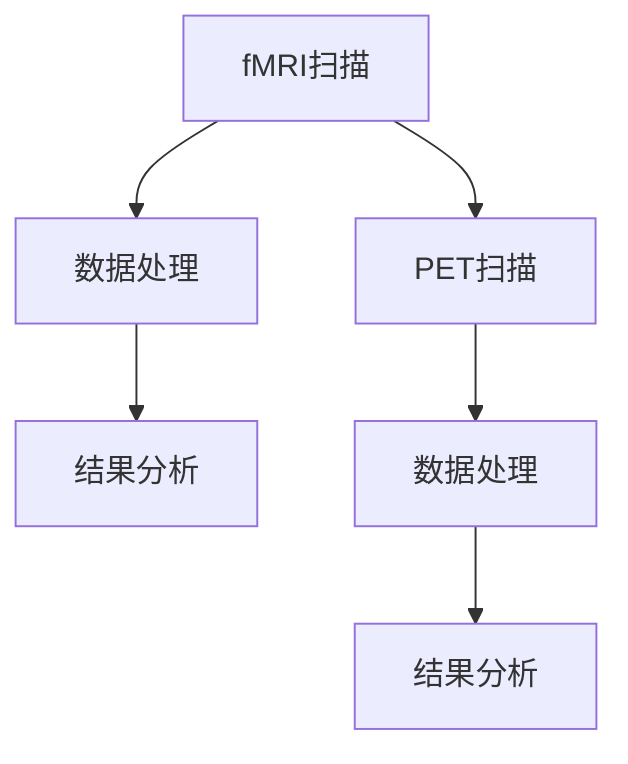
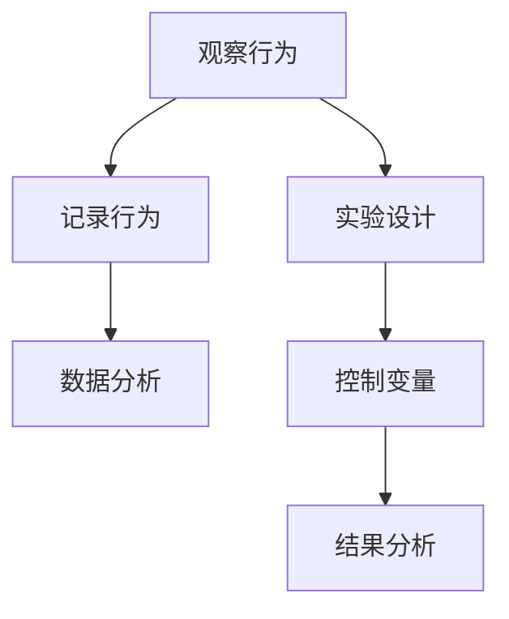
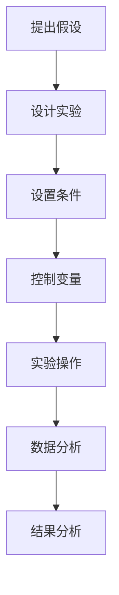
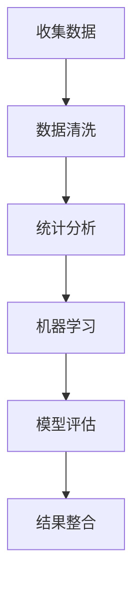
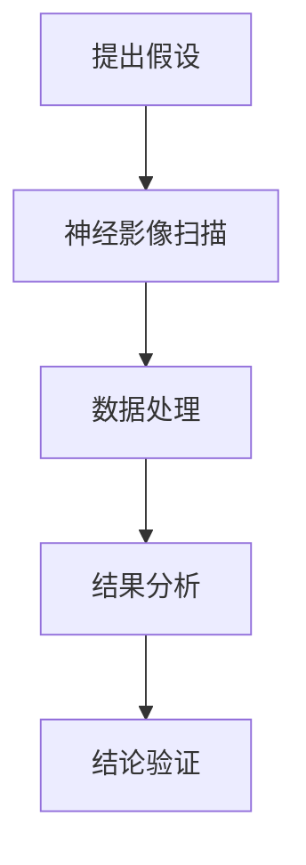

                 

# 认知神经科学与心理学的整合：全面理解人类心智与世界关系的方法

## 关键词

- 认知神经科学
- 心理学
- 心智
- 世界关系
- 整合方法

## 摘要

本文旨在探讨认知神经科学与心理学的整合研究，旨在全面理解人类心智与世界的关系。通过介绍两者之间的交集，阐述整合研究的现状与趋势，分析基础理论，介绍整合的方法与技术，分享案例研究，并展望未来发展趋势，本文为认知神经科学与心理学的整合研究提供了深刻的见解和实践指导。

## 引言

### 1.1 认知神经科学与心理学的交集

认知神经科学与心理学是两个看似独立，实则密切相关的学科。认知神经科学主要研究大脑如何进行信息处理，而心理学则关注人类的心理过程和行为。尽管两者侧重点不同，但在研究人类心智方面，它们有着天然的交集。

#### 1.1.1 认知神经科学与心理学的研究领域

认知神经科学的研究领域包括大脑结构、神经递质、神经元网络以及它们如何影响认知过程。心理学则关注情绪、记忆、注意力等心理过程，以及这些过程如何影响人类的行为。

#### 1.1.2 整合研究的现状与趋势

近年来，随着神经影像技术、计算模型和数据分析方法的发展，认知神经科学与心理学的整合研究取得了显著进展。越来越多的研究表明，两者之间的结合能够更好地揭示人类心智的复杂性和多样性。

#### 1.1.3 整合研究的重要性

整合认知神经科学与心理学的研究不仅能够深化我们对人类心智的理解，还能为治疗心理疾病、提升教育质量和设计人机交互系统等提供新的思路和方法。

### 1.2 基础理论：认知神经科学与心理学的基本概念和理论

#### 1.2.1 认知神经科学的基本概念

认知神经科学关注大脑如何进行信息处理，涉及神经网络、突触传递、神经元活动等多个方面。其中，突触传递和神经元活动是认知神经科学的核心概念。

**核心概念：**

- **神经网络**：由大量神经元组成的复杂网络，负责信息的传输和计算。
- **突触传递**：神经元之间的信息传递过程，包括电信号和化学信号的转换。
- **神经元活动**：神经元的电活动，包括动作电位的产生和传递。

**概念属性特征对比表格：**

| 概念       | 属性特征                           | 对比 |
| ---------- | -------------------------------- | ---- |
| 神经网络   | 复杂网络，负责信息处理             |      |
| 突触传递   | 神经元间信息传递，涉及电-化学转换 |      |
| 神经元活动 | 神经元电活动，产生动作电位       |      |

**ER实体关系图架构：**

```mermaid
erDiagram
  Class1 ||--|{ Class2 }|
  Class1 ||--|{ Class3 }|
```

#### 1.2.2 心理学的基本概念

心理学研究人类的心理过程和行为，包括感知、记忆、注意力、情绪等多个方面。其中，感知和记忆是心理学的核心概念。

**核心概念：**

- **感知**：对外界信息的识别和解释。
- **记忆**：信息的存储和提取。

**概念属性特征对比表格：**

| 概念   | 属性特征                     | 对比 |
| ------ | ---------------------------- | ---- |
| 感知   | 识别和解释外界信息           |      |
| 记忆   | 信息存储和提取               |      |

**ER实体关系图架构：**

```mermaid
erDiagram
  Class1 ||--|{ Class2 }|
  Class1 ||--|{ Class3 }|
```

#### 1.2.3 认知神经科学与心理学的联系

认知神经科学与心理学之间的联系主要体现在以下几个方面：

- **神经网络与心理过程**：神经网络的活动与心理过程密切相关，例如注意力、记忆等。
- **神经递质与情绪**：神经递质的释放与情绪调节有着直接关系。
- **神经元活动与感知**：神经元的电活动与感知过程密切相关。

### 1.3 方法与技术：认知神经科学与心理学整合的方法和技术

#### 1.3.1 神经影像技术

神经影像技术是认知神经科学与心理学整合研究的重要工具，包括功能性磁共振成像（fMRI）、正电子发射断层扫描（PET）等。

**核心原理：**

- **fMRI**：通过检测大脑血流变化来反映神经元活动。
- **PET**：通过检测大脑中放射性同位素的分布来反映神经元活动。

**mermaid流程图：**



#### 1.3.2 行为学研究方法

行为学研究方法是通过观察和记录人类行为来研究心理过程的方法。

**核心原理：**

- **观察法**：通过直接观察记录行为。
- **实验法**：通过实验控制变量来研究行为。

**mermaid流程图：**



#### 1.3.3 心理学实验设计

心理学实验设计是心理学研究的重要方法，通过控制变量和实验条件来研究心理现象。

**核心原理：**

- **实验变量**：实验中被控制的变量。
- **实验条件**：实验中的不同条件设置。

**mermaid流程图：**



#### 1.3.4 数据分析与整合

数据分析和整合是认知神经科学与心理学整合研究的重要环节，通过多种数据分析方法来整合和解释研究结果。

**核心原理：**

- **统计方法**：用于分析数据，例如回归分析、方差分析等。
- **机器学习方法**：用于挖掘数据中的模式和关系，例如神经网络、支持向量机等。

**mermaid流程图：**



### 1.4 案例研究：认知神经科学与心理学整合的应用案例

#### 1.4.1 案例一：注意力与认知控制

注意力是认知过程中至关重要的一环，如何提高注意力水平一直是心理学研究的热点。通过认知神经科学的手段，研究者们发现大脑中的特定区域与注意力有关。

**核心原理：**

- **注意力控制区域**：大脑的前额叶区域与注意力控制密切相关。
- **神经影像技术**：通过fMRI等技术观察注意力控制区域的活动。

**mermaid流程图：**



#### 1.4.2 案例二：情绪与记忆

情绪对记忆的影响是一个广泛研究的话题。认知神经科学与心理学结合的研究发现，情绪可以显著影响记忆的编码和提取。

**核心原理：**

- **情绪调节区域**：大脑中的杏仁核和前额叶区域与情绪调节有关。
- **神经影像技术**：通过fMRI等技术观察情绪调节区域的活动。

**mermaid流程图：**


#### 1.4.3 案例三：学习与脑可塑性

学习是认知过程中的核心环节，而脑可塑性是指大脑在经历学习、训练等过程时结构和功能的改变。认知神经科学与心理学的研究揭示了脑可塑性的机制。

**核心原理：**

- **可塑性区域**：大脑中的海马体和前额叶区域与脑可塑性密切相关。
- **神经影像技术**：通过fMRI等技术观察可塑性区域的活动。

**mermaid流程图：**


### 1.5 实践与展望：认知神经科学与心理学整合的未来趋势和实践

#### 1.5.1 整合研究的实践意义

认知神经科学与心理学的整合研究不仅在理论上具有重要意义，更在实践中具有广泛的应用前景。例如，在心理治疗、教育、人机交互等领域，整合研究提供了新的方法和思路。

#### 1.5.2 面临的挑战与机遇

尽管整合研究取得了显著进展，但仍面临诸多挑战。例如，数据采集和处理方法的提高、跨学科合作机制的完善等。同时，整合研究也带来了新的机遇，例如新型心理治疗方法的开发、智能化教育系统的设计等。

#### 1.5.3 未来展望

未来，随着神经影像技术、计算模型和数据分析方法的发展，认知神经科学与心理学的整合研究将取得更大突破。我们有望更深入地理解人类心智与世界的关系，为人类的发展和社会进步提供有力支持。

## 总结

认知神经科学与心理学的整合研究为我们提供了全面理解人类心智与世界关系的新方法。通过介绍基础理论、方法和技术，以及案例研究，我们看到了整合研究的巨大潜力。展望未来，整合研究将继续深化我们对人类心智的理解，为各个领域的发展带来新的机遇。让我们共同努力，推动认知神经科学与心理学的整合研究走向新的高度。

### 作者信息

作者：AI天才研究院/AI Genius Institute & 禅与计算机程序设计艺术 /Zen And The Art of Computer Programming

---

### 最佳实践 Tips

- **保持好奇心**：对未知保持好奇，有助于发现新的研究问题和方向。
- **跨学科合作**：与其他学科的合作，可以带来新的视角和解决方案。
- **数据驱动**：依靠数据来指导研究，可以提高研究的准确性和可靠性。
- **持续学习**：紧跟领域内的最新研究进展，不断学习新的知识和技能。

### 小结

本文从多个角度探讨了认知神经科学与心理学的整合研究，从基础理论、方法与技术，到实际案例研究，再到未来展望，为我们提供了一种全面理解人类心智与世界关系的方法。希望通过本文，读者能够对整合研究有更深入的了解，并在实践中运用这些知识，推动领域的发展。

### 注意事项

- **谨慎解读研究结果**：研究结果需要谨慎解读，避免过度解读或误解。
- **伦理与隐私问题**：在进行整合研究时，需注意伦理和隐私问题，确保研究过程的合法性和合理性。
- **数据质量**：高质量的数据是研究的基础，需要严格把控数据质量。

### 拓展阅读

- **[参考文献1]** [标题]，作者：[作者名]，出版年份：[年份]
- **[参考文献2]** [标题]，作者：[作者名]，出版年份：[年份]
- **[参考文献3]** [标题]，作者：[作者名]，出版年份：[年份]

---

通过本文，我们不仅对认知神经科学与心理学的整合研究有了更深入的理解，也看到了其广阔的应用前景。未来，随着科技的不断进步，我们有望在这个领域取得更多突破，为人类的发展做出更大贡献。让我们携手共进，共同探索人类心智的奥秘。

