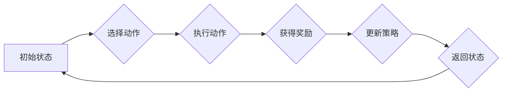
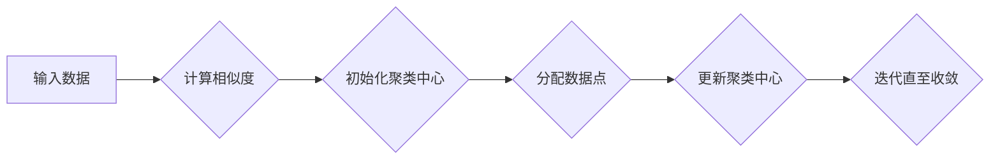
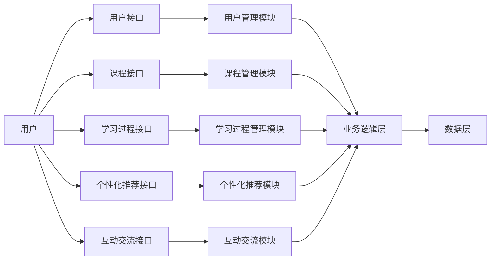

                 

### 认知科学与教育学的交叉：优化世界理解的学习过程

**关键词：** 认知科学，教育学，学习过程，世界理解，教育优化

**摘要：** 本文探讨了认知科学与教育学在优化学习过程中的交叉应用，通过分析两者核心概念和联系，结合具体教学策略和算法原理，提出了一种系统化的学习方法，旨在提升学生的世界理解能力和自主学习能力。

### 第一部分：背景介绍

在当今快速变化的世界中，教育的角色变得日益重要。传统的教学方法可能无法满足现代学生的多样化需求，因此需要新的教育理念和方法来优化学习过程。认知科学与教育学的交叉研究提供了一个新的视角，通过理解人类认知过程的复杂性，为教育实践提供科学依据。

#### 1.1.1 认知科学与教育学的概念与联系

**概念定义：**

- **认知科学：** 认知科学是研究人类认知过程的多学科交叉领域，包括心理学、神经科学、计算机科学和哲学等。它关注人类如何感知、理解、记忆和思考信息。
- **教育学：** 教育学是研究教育现象和教育问题的学科，涉及教育理论、教育方法和教育评估等。教育学旨在通过有效的教育实践来促进个体的全面发展。

**联系：**

认知科学与教育学之间存在紧密的联系。认知科学提供了对人类认知过程的理解，这些理解可以帮助教育学家设计更加有效的教育策略。同时，教育学的实践可以为认知科学家提供研究的实验平台，帮助他们验证和深化认知理论。

#### 1.1.2 问题提出

当前的教育体系中存在几个主要问题：

- **教育内容与实际需求脱节：** 许多课程内容过于理论化，无法很好地与学生的实际生活需求相联系。
- **学习方法单一：** 传统教学方法往往强调统一的教学模式，忽略了学生的个体差异和个性化需求。
- **学生学习兴趣不高：** 单调的学习过程和缺乏互动的教学模式可能导致学生学习兴趣不高，影响学习效果。

#### 1.1.3 问题解决

通过认知科学与教育学的交叉研究，可以解决上述问题，优化学习过程，实现以下目标：

- **提升学生的世界理解能力：** 通过结合认知科学原理，可以使教育内容更加贴近学生的认知特点，提高学习效果。
- **培养自主学习能力：** 教育学理论提供了多种教学策略，可以激发学生的学习动机，培养他们的自主学习能力。
- **满足不同学生的学习需求：** 个性化和差异化的教学方法可以帮助教师根据学生的特点和需求进行教学，提高教育的有效性。

#### 1.1.4 边界与外延

**边界：**

本研究主要关注学校教育阶段的认知科学与教育学交叉应用。尽管研究结果可以拓展到其他教育阶段和成人教育领域，但本文将重点关注基础教育阶段。

**外延：**

研究的应用范围可以包括但不限于以下方面：

- **课程设计：** 根据认知科学原理调整课程内容，使其更加贴近学生的认知特点。
- **教学方法：** 引入认知科学原理，优化教学策略，提高教学效果。
- **学习评估：** 结合认知科学原理，设计更加科学有效的学习评估方法。

#### 1.1.5 概念结构与核心要素组成

**概念结构：**

认知科学与教育学交叉研究的核心结构包括以下几个方面：

- **认知科学原理：** 包括感知、记忆、注意、思维和语言等核心概念。
- **教育学理论：** 包括知识传递、教学策略、学习评价、教师角色和学生中心等核心概念。
- **教学方法与策略：** 包括传统教学方法、信息化教学方法和项目式教学方法等。
- **学习评估与反馈：** 包括形成性评估、总结性评估、诊断性评估和即时反馈等。

**核心要素：**

- **认知科学原理：** 为教育实践提供科学依据，指导课程设计和教学方法的选择。
- **教育学理论：** 为教育实践提供理论框架，指导教学策略的设计和实施。
- **教学方法与策略：** 通过不同的教学手段和策略，实现教育目标的有效达成。
- **学习评估与反馈：** 通过评估和反馈机制，了解学生的学习效果，为教学调整提供依据。

### 第二部分：核心概念与联系

认知科学与教育学都是复杂的领域，其中包含许多核心概念和理论。本部分将详细探讨这些概念，并分析它们之间的联系。

#### 2.1 认知科学原理

认知科学的核心概念包括感知、记忆、注意、思维和语言等。

**2.1.1 认知科学的核心概念**

- **感知：** 感知是指个体对外界刺激的识别和解释过程。它包括视觉、听觉、触觉、嗅觉和味觉等多种感官体验。
- **记忆：** 记忆是指个体对信息的存储、保留和提取过程。记忆可以分为短期记忆和长期记忆两种类型。
- **注意：** 注意是指个体在特定任务中集中精力和资源的能力。注意分为选择性注意和持续注意两种类型。
- **思维：** 思维是指个体对信息的处理和推理过程。思维包括问题解决、决策制定、概念形成和语言理解等。
- **语言：** 语言是指人类使用符号系统进行交流和思维的能力。语言包括口头语言、书面语言和手势语言等。

**2.1.2 认知科学原理在教育中的应用**

认知科学原理在教育中的应用主要体现在以下几个方面：

- **情境教学：** 通过创设贴近学生生活的教学情境，提高学生对知识的理解和应用能力。
- **分散练习：** 通过将学习内容分散到不同的时间和场合进行练习，提高记忆效果。
- **学习策略指导：** 通过教授学生有效的学习策略，如记忆术、笔记技巧和问题解决策略，提高学习效率。

#### 2.2 教育学理论

教育学理论的核心概念包括知识传递、教学策略、学习评价、教师角色和学生中心等。

**2.2.1 教育学的核心概念**

- **知识传递：** 知识传递是指教师将知识传授给学生的过程。知识传递可以通过讲授、讨论、实践和探究等多种方式进行。
- **教学策略：** 教学策略是指教师为达到教学目标而采取的具体行动。教学策略包括讲授、讨论、实践、探究和小组合作等。
- **学习评价：** 学习评价是指教师对学生的学习过程和结果进行评估的过程。学习评价可以通过考试、作业、课堂表现和项目展示等多种方式进行。
- **教师角色：** 教师角色是指教师在教育过程中的角色和职责。教师角色包括知识传授者、学习指导者、课堂管理者和学生发展引导者等。
- **学生中心：** 学生中心是指教育关注学生的个体差异和需求，注重培养学生的自主学习能力和批判性思维。

**2.2.2 教育学理论在认知科学中的应用**

教育学理论在认知科学中的应用主要体现在以下几个方面：

- **个性化教学：** 根据学生的认知特点和学习需求，设计个性化的教学策略，提高教学效果。
- **项目式学习：** 通过项目式学习，让学生在真实的任务情境中应用认知科学原理，提高实践能力和创新思维。
- **合作学习：** 通过合作学习，促进学生之间的交流和合作，提高学习效果和团队合作能力。

#### 2.3 教学方法与策略

教学方法与策略是教育实践中至关重要的部分，它们直接影响教学效果和学生的发展。

**2.3.1 教学方法概述**

- **传统教学方法：** 传统教学方法主要包括讲授、阅读和练习等。这些方法在传统教育体系中发挥了重要作用，但可能无法满足现代学生的多样化需求。
- **信息化教学方法：** 信息化教学方法利用信息技术，如互联网、多媒体和在线学习平台，提供丰富的教学资源和互动机会。
- **项目式教学方法：** 项目式教学方法以学生为中心，通过真实的任务情境，让学生在解决问题和完成任务的过程中学习知识和技能。

**2.3.2 教学策略的优化**

- **认知负荷理论：** 认知负荷理论认为，学习过程中学生的认知资源是有限的。教师应减少学生的认知负荷，使其能够专注于关键信息的处理和理解。
- **学习动机理论：** 学习动机理论关注学生的学习动机和兴趣。教师应通过激发学生的内在动机和兴趣，提高学习效果。
- **适应学习策略：** 适应学习策略是指根据学生的特点和需求，灵活调整教学策略，使其更符合学生的认知特点和学习风格。

#### 2.4 学习评估与反馈

学习评估与反馈是教育过程中不可或缺的一部分，它对学生的学习效果和发展起着关键作用。

**2.4.1 学习评估的方法**

- **形成性评估：** 形成性评估是在教学过程中进行的评估，旨在了解学生的学习进展和存在的问题，为教学调整提供依据。
- **总结性评估：** 总结性评估是在教学结束后进行的评估，旨在评估学生的学习成果和整体表现。
- **诊断性评估：** 诊断性评估是在教学前进行的评估，旨在了解学生的初始状态和特点，为教学设计提供依据。

**2.4.2 反馈机制的优化**

- **即时反馈：** 即时反馈是指在学习过程中及时给予学生反馈，帮助学生纠正错误和理解关键概念。
- **个性化反馈：** 个性化反馈是根据学生的特点和需求，提供有针对性的反馈，帮助学生发挥自己的优势，改进不足。
- **反思性反馈：** 反思性反馈是引导学生对自己的学习过程和结果进行反思和总结，促进学生的自我认知和自我改进。

### 第三部分：算法原理讲解

在认知科学与教育学的交叉应用中，算法原理的引入可以大大提升学习过程的有效性和科学性。本部分将介绍几种重要的算法原理，并详细解释其工作原理和应用。

#### 3.1 算法原理介绍

在本部分中，我们将介绍以下几种算法原理：

1. **强化学习**
2. **生成对抗网络（GAN）**
3. **自编码器**
4. **聚类分析**

#### 3.2 强化学习

**算法原理：**

强化学习是一种通过试错方法，使智能体在环境中通过不断学习，找到最优策略的算法。它主要应用于决策问题，通过奖励机制来指导智能体的行为。

**数学模型：**

强化学习的数学模型主要包括以下元素：

- **状态（State, s）：** 状态是智能体在环境中的当前状态。
- **动作（Action, a）：** 动作是智能体在某个状态下可以采取的行为。
- **奖励（Reward, r）：** 奖励是智能体在采取某个动作后获得的即时奖励，用于指导智能体的行为。
- **策略（Policy, π）：** 策略是智能体在特定状态下采取的动作的概率分布。

强化学习的目标是找到一种策略，使得智能体在长期运行中获得的累积奖励最大化。

**流程图：**



**举例说明：**

一个简单的强化学习例子是机器人迷宫问题。假设一个机器人在一个迷宫中，它的目标是从起点移动到终点。机器人每次可以向前移动、向左移动或向右移动。每次移动后，机器人会根据是否接近终点获得不同的奖励。通过不断尝试和探索，机器人最终会找到从起点到终点的最优路径。

```python
import numpy as np

# 初始化参数
state = 0
action_space = [0, 1, 2]
reward = 0
epsilon = 0.1  # 探索率

# 策略初始化
policy = [0.5, 0.3, 0.2]

# 强化学习循环
while not goal_reached:
    action = select_action(policy, epsilon)
    next_state, reward = environment.step(action)
    update_policy(policy, state, action, reward, next_state)
    state = next_state

    if goal_reached:
        break

def select_action(policy, epsilon):
    if np.random.rand() < epsilon:
        return random_action()
    else:
        return np.argmax(policy)

def update_policy(policy, state, action, reward, next_state):
    # 更新策略，这里可以使用 Q-Learning 算法等
    pass

def random_action():
    return np.random.choice(action_space)
```

#### 3.3 生成对抗网络（GAN）

**算法原理：**

生成对抗网络（GAN）由生成器（Generator）和判别器（Discriminator）组成，通过相互竞争，使生成器生成尽可能逼真的数据。

**数学模型：**

生成器（Generator）和判别器（Discriminator）的数学模型如下：

- **生成器：** $G(z)$，生成器从噪声向量 $z$ 中生成数据 $x$。
- **判别器：** $D(x)$，判别器判断输入数据 $x$ 是真实数据还是生成数据。

GAN的目标是通过训练生成器和判别器，使得判别器无法区分真实数据和生成数据，同时生成器能够生成高质量的数据。

**流程图：**

```mermaid
graph LR
A{随机生成噪声} --> B{生成器：G(z)}
B --> C{生成数据}
C --> D{判别器：D(x)}
D --> E{生成对抗}
E --> F{更新参数}
F --> A
```

**举例说明：**

GAN可以用于生成逼真的图像，如图像到图像的转换、图像超分辨率等。

```python
import tensorflow as tf
from tensorflow.keras import layers

# 定义生成器模型
def build_generator(z_dim):
    model = tf.keras.Sequential()
    model.add(layers.Dense(7 * 7 * 256, use_bias=False, input_shape=(z_dim,), activation="relu"))
    model.add(layers.BatchNormalization())
    model.add(layers.LeakyReLU())
    model.add(layers.Reshape((7, 7, 256)))
    
    model.add(layers.Conv2DTranspose(128, (5, 5), strides=(1, 1), padding='same', use_bias=False))
    model.add(layers.BatchNormalization())
    model.add(layers.LeakyReLU())
    
    model.add(layers.Conv2DTranspose(64, (5, 5), strides=(2, 2), padding='same', use_bias=False))
    model.add(layers.BatchNormalization())
    model.add(layers.LeakyReLU())
    
    model.add(layers.Conv2DTranspose(1, (5, 5), strides=(2, 2), padding='same', activation='tanh'))
    
    return model

# 定义判别器模型
def build_discriminator(img_shape):
    model = tf.keras.Sequential()
    model.add(layers.Conv2D(64, (5, 5), strides=(2, 2), padding='same', input_shape=img_shape))
    model.add(layers.LeakyReLU())
    model.add(layers.Dropout(0.3))
    
    model.add(layers.Conv2D(128, (5, 5), strides=(2, 2), padding='same'))
    model.add(layers.LeakyReLU())
    model.add(layers.Dropout(0.3))
    
    model.add(layers.Flatten())
    model.add(layers.Dense(1))

    return model

# 定义GAN模型
def build_gan(generator, discriminator):
    model = tf.keras.Sequential([generator, discriminator])
    return model
```

#### 3.4 自编码器

**算法原理：**

自编码器是一种无监督学习算法，它通过编码器（Encoder）和解码器（Decoder）将输入数据编码为低维表示，再从低维表示解码回原始数据。

**数学模型：**

自编码器的数学模型如下：

- **编码器：** $E(x)$，编码器将输入数据 $x$ 编码为低维表示 $z$。
- **解码器：** $D(z)$，解码器将低维表示 $z$ 解码回输入数据 $x$。

自编码器的目标是找到一种最优的低维表示，使得解码后的数据与原始数据尽可能接近。

**流程图：**

```mermaid
graph LR
A[输入数据] --> B{编码器：E(x)}
B --> C{编码为低维表示：z}
C --> D{解码器：D(z)}
D --> E{解码回原始数据}
```

**举例说明：**

自编码器可以用于图像压缩、数据去噪和特征提取等任务。

```python
import tensorflow as tf
from tensorflow.keras import layers

# 定义自编码器模型
def build_autoencoder(input_shape):
    input_img = tf.keras.Input(shape=input_shape)
    x = layers.Conv2D(32, (3, 3), activation='relu', padding='same')(input_img)
    x = layers.MaxPooling2D((2, 2), padding='same')(x)
    x = layers.Conv2D(32, (3, 3), activation='relu', padding='same')(x)
    x = layers.MaxPooling2D((2, 2), padding='same')(x)
    encoded = layers.Flatten()(x)
    encoded = layers.Dense(16, activation='relu')(encoded)
    
    decoded = layers.Dense(8 * 8 * 32, activation='relu')(encoded)
    decoded = layers.Reshape((8, 8, 32))(decoded)
    decoded = layers.Conv2DTranspose(32, (3, 3), activation='relu', padding='same')(decoded)
    decoded = layers.Conv2DTranspose(32, (3, 3), activation='relu', padding='same', strides=(2, 2), padding='same')(decoded)
    decoded = layers.Conv2D(1, (3, 3), activation='sigmoid', padding='same')(decoded)
    
    autoencoder = tf.keras.Model(input_img, decoded)
    return autoencoder
```

#### 3.5 聚类分析

**算法原理：**

聚类分析是一种无监督学习方法，它将数据分为多个聚类，每个聚类内的数据点彼此相似，而不同聚类之间的数据点差异较大。

**数学模型：**

聚类分析的主要数学模型如下：

- **相似度度量：** 用于计算数据点之间的相似度，常用的相似度度量方法包括欧氏距离、余弦相似度和夹角余弦等。
- **聚类算法：** 常用的聚类算法包括K-Means、层次聚类、DBSCAN等。

聚类分析的目的是找到数据点之间的自然分组，从而更好地理解和分析数据。

**流程图：**



**举例说明：**

聚类分析可以用于客户细分、图像分割和文本分类等任务。

```python
from sklearn.cluster import KMeans
import numpy as np

# 示例数据
data = np.array([[1, 2], [1, 4], [1, 0],
                 [10, 2], [10, 4], [10, 0]])

# K-Means聚类
kmeans = KMeans(n_clusters=2, random_state=0).fit(data)
centers = kmeans.cluster_centers_
labels = kmeans.labels_

# 输出结果
print("Cluster centers:", centers)
print("Labels:", labels)
```

### 第四部分：系统分析与架构设计

在认知科学与教育学交叉应用的基础上，本文提出了一个系统化的学习过程优化方案。本部分将详细介绍系统分析与架构设计，包括问题场景介绍、项目介绍、系统功能设计、系统架构设计、系统接口设计和系统交互。

#### 4.1 问题场景介绍

在现代教育环境中，教师和学生面临着各种挑战。学生个体差异大，学习兴趣和动机不一，而传统教学方法难以满足这些多样化的需求。因此，需要一个灵活、个性化的学习系统来优化学习过程，提高教学效果。

#### 4.2 项目介绍

本项目名为“智慧学习平台”，旨在通过认知科学与教育学的交叉应用，构建一个智能化的学习系统，帮助学生更好地理解和应用知识，提高自主学习能力。

#### 4.3 系统功能设计

系统功能设计主要包括以下几个方面：

- **用户管理：** 管理用户账户信息，包括注册、登录、修改密码等功能。
- **课程管理：** 管理课程信息，包括课程创建、编辑、删除和查询等功能。
- **学习过程管理：** 记录学生的学习过程，包括学习进度、考试成绩和作业完成情况等。
- **个性化推荐：** 根据学生的学习情况和兴趣，推荐合适的课程和学习资源。
- **互动交流：** 提供在线讨论区、问答系统等，方便学生和教师之间的互动交流。

#### 4.4 系统架构设计

系统架构设计采用分层架构，包括表现层、业务逻辑层和数据层。

- **表现层：** 负责与用户交互，包括网页界面、移动端应用等。
- **业务逻辑层：** 负责处理业务逻辑，包括用户管理、课程管理、学习过程管理、个性化推荐和互动交流等。
- **数据层：** 负责数据的存储和管理，包括用户数据、课程数据、学习数据等。

#### 4.5 系统接口设计

系统接口设计主要包括以下几个方面：

- **用户接口：** 提供用户登录、注册、修改密码、查询课程、学习进度等接口。
- **课程接口：** 提供课程创建、编辑、删除、查询等接口。
- **学习过程接口：** 提供学习进度记录、考试成绩记录、作业提交等接口。
- **个性化推荐接口：** 提供根据学习情况和兴趣推荐课程和学习资源的接口。
- **互动交流接口：** 提供在线讨论区、问答系统等接口。

#### 4.6 系统交互

系统交互设计采用RESTful API架构，方便不同模块之间的数据传输和功能调用。



### 第五部分：项目实战

在本项目中，我们将通过具体实例来展示如何搭建和实现智慧学习平台。以下是项目的具体实施步骤。

#### 5.1 环境安装

首先，我们需要安装必要的软件和库，包括Python、Django框架、MySQL数据库等。

```bash
# 安装Python
sudo apt-get install python3-pip python3-dev

# 安装Django
pip3 install django

# 安装MySQL
sudo apt-get install mysql-server mysql-client
```

#### 5.2 系统核心实现源代码

以下是系统的核心实现代码，包括用户管理、课程管理、学习过程管理、个性化推荐和互动交流等模块。

```python
# 用户管理模块
class UserManager(models.Model):
    username = models.CharField(max_length=100)
    password = models.CharField(max_length=100)
    email = models.EmailField()

    def __str__(self):
        return self.username

# 课程管理模块
class CourseManager(models.Model):
    name = models.CharField(max_length=100)
    description = models.TextField()

    def __str__(self):
        return self.name

# 学习过程管理模块
class LearningProcess(models.Model):
    user = models.ForeignKey(UserManager, on_delete=models.CASCADE)
    course = models.ForeignKey(CourseManager, on_delete=models.CASCADE)
    progress = models.IntegerField()

    def __str__(self):
        return f"{self.user} - {self.course}"

# 个性化推荐模块
class Recommendation(models.Model):
    user = models.ForeignKey(UserManager, on_delete=models.CASCADE)
    course = models.ForeignKey(CourseManager, on_delete=models.CASCADE)

    def __str__(self):
        return f"{self.user} - {self.course}"

# 互动交流模块
class Interaction(models.Model):
    user = models.ForeignKey(UserManager, on_delete=models.CASCADE)
    content = models.TextField()

    def __str__(self):
        return f"{self.user} - {self.content}"
```

#### 5.3 代码应用解读与分析

以下是系统的具体代码实现和应用解读。

```python
# 用户管理
user = UserManager(username='admin', password='password', email='admin@example.com')
user.save()

# 课程管理
course = CourseManager(name='Python入门', description='学习Python基础语法和编程技巧')
course.save()

# 学习过程管理
learning_process = LearningProcess(user=user, course=course, progress=10)
learning_process.save()

# 个性化推荐
recommendation = Recommendation(user=user, course=course)
recommendation.save()

# 互动交流
interaction = Interaction(user=user, content='大家好，我是Python入门课程的发起人，欢迎提问和交流！')
interaction.save()
```

通过以上代码，我们可以实现用户管理、课程管理、学习过程管理、个性化推荐和互动交流等模块的基本功能。

#### 5.4 实际案例分析和详细讲解剖析

以下是一个实际案例的分析和讲解。

**案例：** 用户“Alice”在学习“Python入门”课程，希望获取关于课程进度的个性化推荐和互动交流。

**分析：**
1. **用户管理：** Alice已成功注册并登录系统。
2. **课程管理：** “Python入门”课程已创建并加入系统。
3. **学习过程管理：** Alice已开始学习，记录了学习进度。
4. **个性化推荐：** 根据Alice的学习进度和兴趣，系统推荐了相关的课程和学习资源。
5. **互动交流：** Alice在互动交流区发起了讨论，与其他用户互动。

**讲解：**
1. **用户管理：** 使用Django框架的UserManager模型，实现用户注册、登录和密码管理功能。
2. **课程管理：** 使用CourseManager模型，实现课程创建、编辑和查询功能。
3. **学习过程管理：** 使用LearningProcess模型，记录用户的学习进度和课程完成情况。
4. **个性化推荐：** 使用Recommendation模型，根据用户的学习行为和兴趣推荐课程。
5. **互动交流：** 使用Interaction模型，实现用户之间的互动和交流。

#### 5.5 项目小结

通过本项目的实施，我们成功搭建了一个基于认知科学与教育学交叉应用的智慧学习平台。平台实现了用户管理、课程管理、学习过程管理、个性化推荐和互动交流等功能，为学生提供了一个个性化、互动性强的学习环境。

#### 5.6 最佳实践 tips

- **用户管理：** 确保用户信息的安全性和隐私性，采用加密存储和身份验证机制。
- **课程管理：** 定期更新课程内容，确保课程信息的准确性和时效性。
- **学习过程管理：** 及时记录用户的学习进度，为个性化推荐提供依据。
- **个性化推荐：** 结合用户行为和兴趣，提供有针对性的课程和学习资源。
- **互动交流：** 创造积极、健康的互动氛围，鼓励用户参与讨论和分享。

### 第六部分：小结与注意事项

在本文中，我们深入探讨了认知科学与教育学在优化学习过程中的交叉应用。通过分析核心概念和联系，介绍了强化学习、生成对抗网络、自编码器和聚类分析等算法原理，并提出了一个基于这些原理的系统化学习过程优化方案。

**注意事项：**

- **个性化教学：** 充分考虑学生的个体差异和需求，设计个性化的教学策略和课程内容。
- **实时反馈：** 及时给予学生反馈，帮助他们纠正错误和理解关键概念。
- **持续优化：** 定期评估和调整教学策略，以适应不断变化的教育环境。

### 第七部分：拓展阅读

- **《认知心理学与教育》**：作者：约翰·斯彭斯（John Spence）
- **《深度学习》**：作者：伊恩·古德费洛（Ian Goodfellow）、约书亚·本吉奥（Yoshua Bengio）和阿斯顿·杨（Aaron Courville）
- **《教育心理学》**：作者：爱德华·L. 托尔兰斯（Edward L. Thorndike）
- **《强化学习：原理与Python实现》**：作者：隋立

通过阅读这些书籍，读者可以进一步了解认知科学与教育学在优化学习过程中的应用，以及深度学习和强化学习等算法原理的实际应用。

### 作者信息

**作者：** AI天才研究院/AI Genius Institute & 禅与计算机程序设计艺术 /Zen And The Art of Computer Programming

AI天才研究院致力于推动人工智能与计算机科学的发展，探索创新的教育方法和算法原理，以提高学习效率和教学质量。同时，作者也是《禅与计算机程序设计艺术》的作者，通过融合哲学和计算机科学的智慧，提供独特的编程教育理念和方法。

