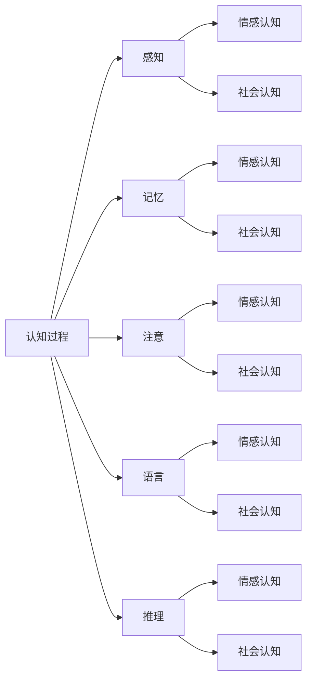

                 

### 1.1 问题背景

#### 认知科学与虚拟现实的概念

认知科学是一门跨学科的研究领域，旨在理解人类思维、感知和学习的过程。它结合了心理学、神经科学、计算机科学和哲学等多个学科，致力于探究认知的本质和机制。认知科学的核心目标是揭示人类大脑如何处理信息，以及这些信息处理过程如何影响我们的行为和体验。

虚拟现实（VR）是一种通过计算机生成的模拟环境，用户可以通过特殊的头戴显示器（HMD）和传感器设备进入这个环境，与之互动并感受到沉浸式的体验。虚拟现实技术不仅创造了逼真的视觉和听觉效果，还通过触觉和运动感知进一步增强了用户的沉浸感。

#### 虚拟现实在认知科学中的应用潜力

认知科学与虚拟现实的结合为多个领域带来了巨大的应用潜力。首先，虚拟现实提供了一个理想的实验平台，研究人员可以在这个环境中控制变量，精确地操纵刺激，并观察和记录用户的反应，从而深入了解认知过程。

例如，虚拟现实可以用于研究人类的记忆、感知和注意力。通过虚拟现实环境，研究者可以创建特定的场景，改变环境中的元素，并观察这些变化对用户认知的影响。这种实验设计具有高度可控性和可重复性，有助于揭示认知过程的规律。

此外，虚拟现实在教育和训练中的应用也备受关注。通过虚拟现实技术，学生和培训者可以进入虚拟环境中进行实践操作，无需实际的物理空间限制。这不仅提高了学习的互动性和趣味性，还能有效提升学习效果和技能掌握水平。

在医疗领域，虚拟现实技术也展现出巨大的潜力。虚拟现实可以用于治疗恐惧症、焦虑症等心理疾病，通过模拟不同的情境，帮助患者逐渐克服恐惧。同时，虚拟现实还可以用于物理治疗和康复训练，患者可以在虚拟环境中进行康复训练，增强治疗的效果。

总之，虚拟现实在认知科学中的应用为研究者提供了新的工具和方法，有助于深入探索认知过程的奥秘。同时，虚拟现实也为各个领域带来了创新的解决方案，改善了人类的生活体验。

#### 1.2 认知科学与虚拟现实结合的挑战

尽管认知科学与虚拟现实的结合具有巨大潜力，但在实际应用中仍然面临许多挑战。首先，技术实现的复杂性是一个关键问题。虚拟现实技术涉及多个方面的整合，包括计算机图形学、人机交互、传感器技术和数据传输等。这些技术的成熟度和集成度直接影响虚拟现实系统的性能和用户体验。

其次，用户体验的沉浸感和真实性是另一个重要挑战。虚拟现实技术需要提供高度逼真的视觉、听觉和触觉体验，以使用户真正感受到身临其境。然而，当前的技术水平在某些方面仍然存在局限，例如视场角、分辨率和触觉反馈的准确性等。

第三，认知过程的模拟和测量也是一个复杂的问题。虚拟现实环境中的用户行为和反应需要被精确地记录和分析，以揭示认知过程的细节。这要求虚拟现实系统具备高精度的数据采集和处理能力，同时还需要设计合适的实验方案和数据分析方法。

此外，伦理和隐私问题也是不可忽视的挑战。在虚拟现实环境中，用户的个人信息和行为数据可能会被收集和分析，这涉及到隐私保护和数据安全的问题。如何在保障用户隐私的前提下，充分利用这些数据为研究和应用服务，是一个重要的伦理问题。

最后，跨学科的合作和知识整合也是一个挑战。认知科学、虚拟现实技术和相关应用领域的专家需要紧密合作，共同解决技术难题和理论问题，以推动这一领域的发展。

综上所述，认知科学与虚拟现实的结合虽然前景广阔，但在实际应用中仍需克服诸多挑战，这需要多学科协同努力和持续的技术创新。

#### 1.3 认知科学在虚拟现实设计中的应用

认知科学在虚拟现实设计中的应用至关重要，它不仅提升了用户体验，还优化了虚拟现实系统的功能和性能。以下是认知科学在虚拟现实设计中的几个关键应用：

首先，认知科学帮助优化虚拟现实中的用户界面设计。通过研究人类的感知、记忆和注意力机制，设计师可以创建更加直观和易于使用的用户界面。例如，使用认知科学原理，设计师可以确定最佳的颜色搭配、图标设计和交互布局，从而提高用户的操作效率和满意度。

其次，认知科学在虚拟现实内容的构建中也发挥着重要作用。虚拟现实环境中的内容和任务设计需要考虑用户的认知负荷和体验需求。通过理解认知过程中的注意力分配和记忆机制，设计师可以创造更加自然和沉浸式的虚拟体验。例如，在模拟复杂场景时，认知科学可以指导设计师如何合理安排信息的呈现方式，以减少用户的认知负荷，提高信息的吸收和理解效果。

此外，认知科学还为虚拟现实中的情感体验设计提供了理论基础。人类的情感体验是认知过程中不可或缺的一部分，虚拟现实系统需要能够模拟和引导用户的情感反应。通过研究情感认知机制，设计师可以创造出能够触发特定情感反应的虚拟环境，例如在游戏中设计感人的情节，或在教育培训中创建激发学习兴趣的场景。

最后，认知科学在虚拟现实技术评估和改进中也起到了关键作用。通过实验心理学的方法，研究人员可以评估不同虚拟现实系统的用户体验和认知效果。这些评估结果可以用来指导技术改进，例如优化图形渲染算法，提高交互设备的响应速度，或者改进虚拟现实内容的呈现方式。

综上所述，认知科学为虚拟现实设计提供了丰富的理论资源和实践指导。通过深入理解和应用认知科学原理，虚拟现实系统不仅能够提供更加逼真的沉浸式体验，还能更好地满足用户的需求和期望，从而推动虚拟现实技术的不断进步和应用扩展。

#### 1.4 虚拟现实在认知科学中的贡献

虚拟现实技术在认知科学研究中发挥了重要且独特的贡献，它不仅为认知过程的探索提供了新的工具和方法，还显著提升了研究的精确性和效率。以下是虚拟现实在认知科学中的几个主要贡献：

首先，虚拟现实技术为认知科学家提供了一个高度可控的实验平台。在传统实验室环境中，研究人员往往面临诸多限制，例如物理空间的限制和实验变量的控制难度。虚拟现实环境可以通过计算机模拟创建出各种复杂的情境，研究者可以精确地操纵实验条件，从而更好地控制变量并排除干扰因素。这种高度可控的环境有助于研究者更准确地观察和记录认知过程中的细节变化。

其次，虚拟现实技术大大提高了数据采集和处理的效率。在传统实验中，数据采集往往依赖于人工记录，容易出现人为误差且难以大规模重复。虚拟现实系统可以通过各种传感器实时采集用户的行为和生理数据，例如眼动跟踪、心率变化和动作轨迹等。这些数据可以被自动记录和分析，大大提高了数据的准确性和可靠性。同时，虚拟现实技术还允许研究者进行大规模的实验，从而获得更加全面和具有代表性的数据集。

此外，虚拟现实技术在认知科学中的应用也促进了跨学科的合作与知识整合。虚拟现实结合了计算机科学、心理学、神经科学等多个领域的知识，为认知科学的研究提供了丰富的理论基础和技术支持。这种跨学科合作有助于打破学科壁垒，推动认知科学的深入发展。

最后，虚拟现实技术在认知科学中的应用还极大地拓展了研究的领域和应用场景。通过虚拟现实技术，研究者可以探索人类在极端环境下的认知表现，例如在太空、深海或战斗等高压力情境中。这种拓展不仅有助于揭示认知过程的普遍规律，也为实际应用提供了宝贵的参考。

总之，虚拟现实技术在认知科学中的应用不仅提升了研究的精确性和效率，还为认知科学的探索提供了全新的视角和方法。随着虚拟现实技术的不断进步，它在认知科学研究中的作用将会更加重要和广泛。

### 1.5 认知科学核心概念

#### 1.5.1 认知过程

认知过程是人类思维活动的重要组成部分，包括感知、记忆、注意、语言和推理等环节。感知是指通过感官接收外部信息并将其转换为大脑可以处理的形式；记忆则是存储和提取信息的过程，包括短期记忆和长期记忆；注意是指大脑在众多信息中选择关注特定内容的能力；语言是人类交流的重要工具，涉及语音的产生和语义理解；推理则是通过逻辑思维对信息进行分析和判断。

#### 1.5.2 情感认知

情感认知是指个体对情感的认识、体验和表达过程。它涉及情感识别、情感体验和情感调节等方面。情感识别是指个体能够感知和理解自己的情感状态，以及他人情感状态的能力；情感体验是指个体在特定情境下产生的情感感受；情感调节是指个体通过认知和行为调节情感状态，以适应环境需求。

#### 1.5.3 社会认知

社会认知是指个体对社会信息的感知、理解、记忆和判断过程，包括社会互动、角色认知和文化理解等。社会互动是指个体在社交环境中的行为和互动过程，涉及人际沟通、团队合作和社会关系建立；角色认知是指个体对自身和社会角色身份的理解和认同；文化理解是指个体对文化背景、价值观念和行为规范的认知和内化。

### 1.5.4 概念属性特征对比

以下是认知科学中的三个核心概念及其属性特征的对比表格：

| 概念         | 属性特征                    | 对比                      |
|--------------|---------------------------|-------------------------|
| 认知过程     | 信息处理、决策、记忆       | 与其他认知过程的异同      |
| 情感认知     | 情感识别、情感体验、情感调节 | 与情感心理学的关系        |
| 社会认知     | 社会互动、角色认知、文化理解 | 与社会心理学的联系与差异  |

### 1.5.5 ER实体关系图

认知科学核心概念的实体关系图如下所示：

这张ER实体关系图展示了认知科学中各个核心概念之间的关系，揭示了它们在信息处理、情感体验和社会互动中的相互作用。通过这样的图示，我们可以更清晰地理解这些概念在认知过程中的角色和影响。

### 2.1 概念结构与核心要素

#### 认知过程

认知过程是认知科学的核心概念之一，它涉及多个层面的信息处理活动。认知过程的核心要素包括感知、记忆、注意、语言和推理等。这些要素相互交织，共同构成了人类认知活动的完整框架。

1. **感知**：感知是指个体通过感官接收外部信息并将其转化为大脑可以处理的形式。它包括视觉、听觉、触觉、嗅觉和味觉等感官系统。感知是认知过程的起点，为后续的信息处理提供了基础数据。

2. **记忆**：记忆是存储和提取信息的过程。根据记忆保持的时间长短，可以分为短期记忆和长期记忆。短期记忆负责暂存信息，长期记忆则负责长时间存储信息，以供后续使用。

3. **注意**：注意是指大脑在众多信息中选择关注特定内容的能力。注意机制能够帮助个体在复杂环境中筛选重要信息，从而提高认知效率。

4. **语言**：语言是人类交流的重要工具，涉及语音的产生和语义理解。语言能力不仅影响个体的认知过程，还直接影响其社会互动和文化传承。

5. **推理**：推理是运用逻辑思维对信息进行分析和判断的能力。推理过程包括归纳推理、演绎推理和类比推理等，它们是认知过程中决策和问题解决的关键要素。

#### 情感认知

情感认知是指个体对情感的认识、体验和表达过程。情感认知的核心要素包括情感识别、情感体验和情感调节等。

1. **情感识别**：情感识别是指个体能够感知和理解自己的情感状态，以及他人情感状态的能力。情感识别是情感认知的基础，它使个体能够识别并理解自身和他人情绪的变化。

2. **情感体验**：情感体验是指个体在特定情境下产生的情感感受。情感体验是情感认知的重要组成部分，它直接影响个体的情感反应和行为选择。

3. **情感调节**：情感调节是指个体通过认知和行为调节情感状态，以适应环境需求。情感调节机制帮助个体在面对不同情境时保持情绪平衡，提高适应能力。

#### 社会认知

社会认知是指个体对社会信息的感知、理解、记忆和判断过程。社会认知的核心要素包括社会互动、角色认知和文化理解。

1. **社会互动**：社会互动是指个体在社交环境中的行为和互动过程，包括人际沟通、团队合作和社会关系建立。社会互动是社会发展的重要基础，它影响个体的社交技能和情感发展。

2. **角色认知**：角色认知是指个体对自身和社会角色身份的理解和认同。角色认知帮助个体在社会中找到自己的位置，并理解他人角色的意义。

3. **文化理解**：文化理解是指个体对文化背景、价值观念和行为规范的认知和内化。文化理解是跨文化交际和全球化的基础，它促进不同文化之间的交流和理解。

#### 结构与核心要素的关系

认知科学中的概念结构与核心要素之间存在着紧密的联系。感知、记忆、注意、语言和推理等认知过程要素相互影响，共同构建了认知过程的整体框架。情感认知和社会认知则通过情感体验和角色认知等要素，进一步丰富了认知科学的内涵。

1. **信息处理**：感知、记忆和注意是信息处理的关键环节，它们共同决定了个体对信息的接收、存储和处理能力。

2. **情感与认知**：情感认知与认知过程相互交织，情感体验不仅影响个体的认知选择，也影响其信息处理效果。

3. **社会互动与文化**：社会认知通过社会互动和文化理解，进一步拓展了认知科学的范畴，使其不仅关注个体的内在认知过程，也关注个体在社会中的行为和互动。

通过理解认知科学的概念结构与核心要素，我们可以更深入地探讨人类认知的本质和机制，为认知科学研究和应用提供坚实的理论基础。

### 2.2 概念属性特征对比

在认知科学中，认知过程、情感认知和社会认知是三个核心概念，它们在属性特征上各具特色，并共同构成了人类复杂认知活动的多维框架。以下是对这三个概念属性特征的详细对比：

#### 认知过程

- **信息处理**：认知过程主要涉及信息处理，包括感知、记忆、注意、语言和推理等。这些过程构成了个体对外部信息的接收、处理和存储机制。
- **逻辑性**：认知过程具有明显的逻辑性，通过推理和判断来分析和解决问题。
- **个体性**：认知过程主要关注个体内部的思维活动，较少涉及外部环境因素。

#### 情感认知

- **情感体验**：情感认知的核心在于情感体验，它涉及个体对情感的识别、体验和调节。情感体验直接影响个体的情绪状态和行为反应。
- **主观性**：情感认知具有强烈的主观性，不同个体的情感体验可能存在显著差异。
- **情境依赖**：情感认知受到外部情境的影响较大，情境变化会显著影响个体的情感体验。

#### 社会认知

- **社会互动**：社会认知关注个体在社会环境中的互动过程，包括人际沟通、团队合作和社会关系建立。
- **文化背景**：社会认知涉及文化背景、价值观念和行为规范，这些因素影响个体的社会行为和角色认知。
- **复杂性**：社会认知过程较为复杂，涉及多个因素的综合作用，需要综合考虑社会环境和个体特征。

以下是对这三个概念属性特征的对比表格：

| 概念         | 属性特征                    | 对比                      |
|--------------|---------------------------|-------------------------|
| 认知过程     | 信息处理、逻辑性、个体性   | 专注于内部思维活动       |
| 情感认知     | 情感体验、主观性、情境依赖 | 侧重于情感反应和情绪管理 |
| 社会认知     | 社会互动、文化背景、复杂性 | 关注个体在社会中的行为和互动 |

这种对比有助于我们更清晰地理解这三个概念在不同认知领域的角色和作用，从而在研究与应用中更好地整合和应用这些知识。

#### 2.3 ER实体关系图

以下是认知科学核心概念的实体关系图，使用Mermaid语法绘制：

该ER图展示了认知过程、情感认知和社会认知三者之间的复杂关系，以及它们内部的相互影响。通过这张图，我们可以更直观地理解这些核心概念在认知科学中的相互作用和重要性。

### 3.1 虚拟现实技术概述

#### 虚拟现实的发展历程

虚拟现实（VR）技术的发展经历了几个关键阶段，从最初的科学幻想逐渐发展成为当今重要的技术领域。20世纪60年代，虚拟现实的概念首次被提出，这一时期的VR主要以计算机生成的图像和模拟环境为基础。然而，由于硬件和软件技术的限制，VR的应用范围非常有限。

进入20世纪80年代，虚拟现实技术开始取得实质性进展。1987年，VPL公司推出了第一个商用VR头盔，标志着虚拟现实技术从实验室走向市场。这一时期的VR技术主要集中在视觉和听觉的模拟，交互性较低，主要应用于游戏和娱乐领域。

随着计算机技术和网络技术的快速发展，21世纪初，VR技术进入了一个新的发展阶段。高分辨率显示器、增强的图形处理能力和更精准的传感器使得VR体验更加逼真和沉浸。2009年，Oculus Rift的开发者库克·佩里（Kirk Pearson）展示了他的VR头盔原型，引发了全球对VR技术的关注。

近年来，VR技术进一步成熟，应用领域不断扩展。虚拟现实技术已经应用于医疗、教育、房地产、设计等多个领域，展示了其广泛的潜力和应用价值。特别是在疫情期间，虚拟现实技术在远程会议、在线教育和虚拟旅游等方面发挥了重要作用。

#### 虚拟现实的关键技术

虚拟现实技术涉及多个方面的关键技术创新，这些技术的成熟和发展是虚拟现实能够实现高质量沉浸体验的基础。

1. **显示技术**：高分辨率显示器是虚拟现实体验的关键。目前，VR头戴显示器（HMD）的分辨率已达到4K甚至更高，使得用户能够看到更加清晰的图像。此外，帧率也是一个重要指标，高帧率可以减少用户出现视觉疲劳和晕动症的风险。

2. **传感器技术**：精确的传感器是虚拟现实系统的另一个核心技术。头部追踪传感器、手部追踪传感器和全身动作捕捉系统等设备可以实时捕捉用户的头部运动、手势和身体动作，从而提供高度真实的交互体验。

3. **交互设计**：虚拟现实交互设计关注用户如何在虚拟环境中进行交互。手势识别、语音控制和眼动跟踪等技术使得用户可以更加自然和直观地与虚拟环境进行互动。

4. **内容创建**：高质量的内容是虚拟现实体验的核心。虚拟现实内容需要具备逼真的视觉效果、丰富的互动元素和沉浸式的情境设计。3D建模、动画制作和虚拟场景构建等技术使得虚拟现实内容越来越丰富和多样。

5. **网络技术**：虚拟现实应用通常需要强大的网络支持，以保证低延迟和高带宽的数据传输。5G网络和云计算技术的发展为虚拟现实提供了更加稳定和高效的网络环境。

#### 虚拟现实在认知科学中的应用潜力

虚拟现实技术在认知科学中的应用潜力巨大，它为认知研究提供了全新的工具和方法。以下是几个关键应用领域：

1. **认知实验**：虚拟现实提供了一个高度可控的实验平台，研究者可以创建特定的认知实验环境，精确控制实验变量，从而更准确地观察和记录认知过程的变化。

2. **认知康复**：虚拟现实技术可以用于认知康复治疗，例如帮助患者恢复记忆或注意力。通过设计特定的虚拟训练任务，研究者可以评估和改善患者的认知功能。

3. **教育应用**：虚拟现实在教育中的应用可以增强学习体验，通过沉浸式学习环境，学生可以更加直观地理解和掌握复杂概念。

4. **虚拟社交**：虚拟现实技术可以模拟现实中的社交环境，帮助研究者探索社会认知和情感认知过程，例如个体在不同社交情境下的行为和情感反应。

5. **心理治疗**：虚拟现实技术可以用于心理治疗，例如通过虚拟情境帮助患者克服恐惧症和焦虑症。

总之，虚拟现实技术在认知科学中的应用不仅丰富了研究方法，还推动了认知科学的实际应用和发展。随着技术的不断进步，虚拟现实在认知科学研究中的潜力将得到进一步发挥。

### 3.2 虚拟现实系统架构

虚拟现实系统架构是构建一个成功虚拟现实体验的核心，它涉及多个关键组件的协同工作。以下是虚拟现实系统架构的详细解析：

#### 系统架构概述

虚拟现实系统架构主要包括用户设备、输入设备、计算设备、存储设备和网络接口等组成部分。这些组件通过复杂的交互协同工作，共同提供高度沉浸式的虚拟现实体验。

1. **用户设备**：用户设备是虚拟现实系统的入口，包括头戴显示器（HMD）、手柄控制器和全身追踪器等。这些设备负责将用户带入虚拟环境，并捕捉用户的动作和反应。

2. **输入设备**：输入设备主要包括手柄控制器、触摸屏和语音识别系统等。这些设备用于与虚拟环境进行交互，例如移动、操作物体和执行特定任务。

3. **计算设备**：计算设备是虚拟现实系统的核心，负责处理和生成虚拟环境中的图像、声音和其他交互内容。高性能的计算设备能够提供流畅的交互体验，并实时响应用户的操作。

4. **存储设备**：存储设备用于存储虚拟现实系统的各种数据，包括虚拟场景、用户数据、应用程序和配置文件等。大容量的存储设备能够保证虚拟现实内容的快速访问和持久存储。

5. **网络接口**：网络接口负责虚拟现实系统与外部网络的连接，提供数据传输和通信功能。高速网络接口能够确保虚拟现实内容在不同设备之间的无缝传输和实时交互。

#### 系统组件详细解析

**用户设备**

用户设备是虚拟现实系统的第一个接触点，直接影响用户体验的沉浸感和真实性。以下是用户设备的主要组件和功能：

- **头戴显示器（HMD）**：HMD是用户进入虚拟环境的主要设备，它通过光学系统将虚拟图像投射到用户眼中。高质量的HMD提供高分辨率和宽视场角，以模拟逼真的视觉体验。

- **手柄控制器**：手柄控制器用于用户与虚拟环境进行交互。现代手柄控制器支持手势识别和触觉反馈，使用户能够更加自然地操作虚拟物体。

- **全身追踪器**：全身追踪器用于捕捉用户的身体运动，支持用户在虚拟环境中进行全身动作。通过精确的追踪技术，全身追踪器能够实时更新用户在虚拟环境中的位置和动作，提供更加真实的交互体验。

**输入设备**

输入设备是用户与虚拟环境进行交互的重要工具，主要包括手柄控制器、触摸屏和语音识别系统等。以下是这些输入设备的详细功能：

- **手柄控制器**：手柄控制器是虚拟现实系统中最常见的输入设备，用户可以通过手柄进行方向控制、物体操作和任务执行。现代手柄控制器通常配备有按钮、摇杆和触摸板，提供丰富的交互功能。

- **触摸屏**：触摸屏主要用于平板电脑和手机等移动设备上的虚拟现实应用。触摸屏可以支持多点触控，使用户能够通过手势进行操作，提高交互的便捷性和直观性。

- **语音识别系统**：语音识别系统使用户可以通过语音指令与虚拟环境进行交互。语音识别系统能够识别和理解用户的语音命令，从而实现语音控制功能，提供更加自然和便捷的交互体验。

**计算设备**

计算设备是虚拟现实系统的核心，负责处理和生成虚拟环境中的图像、声音和其他交互内容。以下是计算设备的主要功能：

- **图形处理单元（GPU）**：GPU是计算设备中最重要的组件之一，负责生成和渲染虚拟环境中的图像。高性能的GPU能够提供高质量的图形渲染效果，减少延迟，提高用户体验。

- **中央处理器（CPU）**：CPU负责处理虚拟现实系统的各种计算任务，包括场景计算、物理模拟和图像处理等。高性能的CPU能够保证虚拟现实系统的流畅运行，提供高质量的服务。

- **内存和存储**：内存和存储设备用于临时存储和持久保存虚拟现实系统的数据。大容量和高速度的内存和存储设备能够保证虚拟现实内容的快速访问和持久存储，减少系统延迟。

**存储设备**

存储设备用于存储虚拟现实系统的各种数据，包括虚拟场景、用户数据、应用程序和配置文件等。以下是存储设备的主要功能：

- **本地存储**：本地存储包括硬盘（HDD）和固态硬盘（SSD），用于存储虚拟现实系统的本地数据。本地存储提供了高可靠性和大容量的数据存储空间，但读写速度相对较慢。

- **云存储**：云存储通过互联网提供虚拟现实内容的数据存储和访问服务。云存储具有高可扩展性和低延迟的特点，能够满足大规模虚拟现实应用的需求。

**网络接口**

网络接口负责虚拟现实系统与外部网络的连接，提供数据传输和通信功能。以下是网络接口的主要功能：

- **无线网络**：无线网络接口包括Wi-Fi和5G网络，提供高速、低延迟的数据传输能力，适用于移动设备和远程虚拟现实应用。

- **有线网络**：有线网络接口包括以太网和光纤网络，提供稳定的网络连接和高速数据传输，适用于需要高带宽和高可靠性的应用场景。

总之，虚拟现实系统架构的各个组件相互协作，共同提供了高质量的沉浸式体验。通过深入理解和优化这些组件的工作方式，可以进一步提升虚拟现实系统的性能和用户体验。

### 3.3 虚拟现实交互设计

虚拟现实交互设计是虚拟现实体验的核心要素之一，它决定了用户在虚拟环境中的互动方式和感受。虚拟现实交互设计的目标是创造一个自然、直观且高效的交互体验，使用户能够轻松地与虚拟环境进行互动。以下是虚拟现实交互设计的几个关键要素和当前的技术手段：

#### 交互模型

虚拟现实交互模型是指用户与虚拟环境之间的互动方式和交互规则。常见的交互模型包括基于手势、语音、眼动和位置跟踪的交互模型。

1. **手势交互**：手势交互是虚拟现实中最常用的交互方式之一。用户通过手势动作控制虚拟物体和执行任务。手势识别技术通过传感器和计算机视觉算法实现，能够识别用户的手势和动作，从而在虚拟环境中生成相应的响应。

2. **语音交互**：语音交互使用户可以通过语音指令与虚拟环境进行交互。语音识别技术是语音交互的核心，它通过自然语言处理和语音识别算法将用户的语音转化为文本或命令，并执行相应的操作。

3. **眼动交互**：眼动交互利用眼动追踪技术，通过捕捉用户的眼球运动来控制虚拟环境。眼动交互可以用于导航、选择和交互等操作，提供更加直观和便捷的交互体验。

4. **位置跟踪**：位置跟踪技术用于捕捉用户在虚拟环境中的位置和运动轨迹。通过空间定位技术，例如惯性测量单元（IMU）和激光扫描仪，虚拟环境可以实时更新用户的位置和动作，实现更加真实的交互体验。

#### 交互设备与技术

为了实现高质量的虚拟现实交互，需要依赖多种先进的交互设备和技术。

1. **手柄控制器**：手柄控制器是虚拟现实中最常见的交互设备之一。现代手柄控制器通常配备多个按钮、摇杆和触觉反馈装置，使用户能够通过多种方式与虚拟环境进行互动。手柄控制器通常与传感器集成，可以精确地捕捉用户的手部动作，提供高度真实的交互体验。

2. **触觉反馈设备**：触觉反馈设备通过振动、压力感应和温度控制等技术模拟真实的触觉体验。触觉反馈能够增强虚拟现实体验的沉浸感，使用户在虚拟环境中感受到更加真实的物理反馈。

3. **眼球追踪设备**：眼球追踪设备用于捕捉用户的眼球运动，提供精确的眼动数据。眼球追踪技术可以用于导航、选择和交互等操作，提高虚拟现实交互的直观性和便捷性。

4. **位置跟踪系统**：位置跟踪系统通过传感器和算法实时捕捉用户的位置和运动轨迹。常见的位置跟踪技术包括惯性测量单元（IMU）、激光扫描仪和红外摄像头等。这些技术能够提供高精度的位置数据，实现用户在虚拟环境中的自由移动和动态交互。

5. **虚拟现实操作系统**：虚拟现实操作系统（VROS）是虚拟现实交互的核心软件平台，它负责管理虚拟现实环境中的各种交互操作。VROS通常提供丰富的交互接口和开发工具，支持多种交互方式和应用程序的运行。

#### 设计原则

在设计虚拟现实交互时，需要遵循以下原则以确保用户体验的流畅和高效：

1. **直观性**：交互设计应尽可能直观，使用户能够快速理解和掌握。通过简洁的界面设计和明确的交互提示，帮助用户快速上手。

2. **一致性**：交互设计应保持一致性，即不同操作和功能的交互方式应保持一致。一致性有助于减少用户的学习成本，提高交互效率。

3. **反馈机制**：交互设计应提供及时的反馈，使用户能够了解其操作结果。反馈可以包括视觉、听觉和触觉等多种形式，增强用户的交互体验。

4. **可定制性**：交互设计应允许用户根据自己的偏好进行定制，提供不同的交互选项和配置。可定制性有助于满足不同用户的需求和习惯。

5. **安全性**：交互设计应确保用户在虚拟环境中的安全，避免用户受到意外的伤害或损失。通过合理的安全机制和应急预案，保障用户的交互体验。

总之，虚拟现实交互设计是一个复杂而细致的过程，需要综合考虑多种技术和设计原则。通过不断优化和改进，虚拟现实交互设计将为用户提供更加自然、高效和沉浸式的体验。

### 4.1 虚拟现实在教育中的应用

虚拟现实（VR）技术在教育领域的应用正在迅速发展，为传统教育模式带来了革命性的变革。通过虚拟现实，学生可以在一个高度仿真和互动的环境中学习，这不仅提升了学习体验，也显著提高了学习效果。

#### 虚拟现实课堂

虚拟现实课堂是虚拟现实技术在教育中最为直接的应用之一。通过VR技术，学生可以进入一个三维立体的虚拟教室，与虚拟老师和其他学生互动。这种沉浸式的学习环境不仅使学生感到更加投入，还能够通过视觉、听觉和触觉等多感官刺激，加强记忆和理解。

例如，在历史课上，学生可以通过VR技术亲身体验历史事件的发生过程，仿佛置身于古埃及的沙漠或是文艺复兴时期的意大利。这样的体验不仅使抽象的历史知识变得具体生动，还能够激发学生的学习兴趣和探索欲望。

此外，虚拟现实课堂还支持远程教学。学生和教师可以通过VR技术在不同地点进行实时互动，打破了传统课堂的时间和空间限制。在疫情期间，虚拟现实课堂成为了一种重要的替代方案，保证了教育的连续性。

#### 远程教育体验

虚拟现实为远程教育提供了全新的体验方式。通过VR技术，学生可以访问全球各地的虚拟博物馆、实验室和课堂，获得丰富的学习资源。这种远程教育体验不仅打破了地域限制，还为学生提供了多样化的学习内容。

例如，一些大学已经开始使用虚拟现实技术进行实验课程的远程教学。学生可以在虚拟实验室中完成各种实验，从化学实验到物理实验，都能够获得真实的操作体验。这种远程教育体验不仅节省了资源和时间，还能够保证实验过程的安全和可重复性。

虚拟现实还支持在线协作学习。学生和教师可以通过虚拟现实平台进行实时讨论和合作，共同完成学习任务。这种协作学习模式促进了师生之间的互动，提高了学习效果。

#### 教学优势

虚拟现实技术在教育中的应用具有显著的教学优势：

1. **互动性和沉浸感**：虚拟现实提供了一个高度互动和沉浸式的学习环境，学生可以主动参与和探索知识，提高学习的积极性。

2. **个性化学习**：虚拟现实技术可以记录和分析学生的学习行为和偏好，为学生提供个性化的学习内容和路径，满足不同学习者的需求。

3. **资源多样性**：虚拟现实技术整合了多种媒体资源，如视频、音频、图像和三维模型，为学生提供了丰富多样的学习材料。

4. **安全性和可重复性**：虚拟现实技术可以在一个安全的环境中模拟各种真实场景，学生可以反复尝试和操作，避免实际操作中的风险和损失。

5. **远程协作**：虚拟现实技术支持远程协作学习，促进了师生和同学之间的互动，提高了学习效果。

总之，虚拟现实技术在教育中的应用为传统教育模式带来了深刻的变革。通过提供沉浸式学习体验和多样化的学习资源，虚拟现实技术不仅提升了学生的学习效果，还激发了他们的学习兴趣，为教育的未来带来了无限可能。

### 4.2 案例分析

#### 虚拟现实在教育中的应用实例

随着虚拟现实技术的不断发展，越来越多的教育机构和学校开始将其应用于教学过程中，以提升学生的学习体验和学习效果。以下是几个虚拟现实在教育中应用的实例：

**1. 历史课的虚拟现实教学**

在历史课上，教师可以使用虚拟现实技术创建一个逼真的历史场景，让学生仿佛置身于古埃及的沙漠或是古罗马的广场。例如，在教授古罗马文明时，学生可以通过VR头盔和手柄控制器，走进一个重建的古罗马城市，参观建筑、街道和广场，甚至可以与虚拟角色进行互动，了解当时的文化和社会生活。这种沉浸式的学习体验不仅使抽象的历史知识变得具体和生动，还激发了学生的学习兴趣和探索欲望。

**2. 医学教育的虚拟现实模拟**

医学教育中，虚拟现实技术被广泛用于模拟手术和临床操作。通过虚拟现实系统，学生可以在一个高度仿真的环境中进行手术练习，从而提高操作技能和应变能力。例如，一个医学模拟实验室使用VR技术创建了一个虚拟的人体模型，学生可以通过VR控制器进行手术操作，并实时观察操作结果。这种模拟训练不仅减少了实际手术中的风险，还能够让学生反复练习，提高手术成功率。

**3. 科学实验的虚拟现实体验**

在科学教育中，虚拟现实技术可以模拟各种实验，让学生在虚拟环境中进行探索和实践。例如，在物理课上，学生可以通过VR技术进入一个虚拟的实验室，进行自由落体实验、电路搭建实验等。这些虚拟实验不仅安全、可重复，还能够提供高度精确的数据分析，帮助学生更好地理解科学原理。

**4. 远程教学与协作学习**

虚拟现实技术不仅提供了丰富的学习内容，还支持远程教学和协作学习。教师可以通过VR平台实时向远程学生授课，进行互动和讨论。此外，多个学生可以在虚拟环境中进行协作学习，共同完成项目任务。这种协作学习模式促进了师生之间的互动，提高了学习效果。

#### 效果评估与反馈

虚拟现实在教育中的应用取得了显著的效果，以下是对其效果进行评估和反馈的几个方面：

1. **学习效果提升**：研究表明，使用虚拟现实技术进行教学可以显著提高学生的学习效果。学生不仅能够更好地理解和掌握知识，还能够提高学习兴趣和动力。

2. **操作技能提高**：在医学和工程等领域，虚拟现实技术被用于技能训练，通过反复练习和即时反馈，学生的操作技能得到了显著提升。

3. **课堂互动增强**：虚拟现实技术提供了一个高度互动的学习环境，学生和教师之间的互动更加频繁和深入，有助于提高教学效果。

4. **资源利用优化**：虚拟现实技术可以整合多种教学资源，如视频、音频和三维模型等，提高了教学资源的利用效率。

5. **学生反馈积极**：学生对虚拟现实技术的应用持积极态度，认为它使学习过程更加有趣和生动。学生反馈表明，虚拟现实技术不仅提高了他们的学习兴趣，还增强了他们的学习效果。

综上所述，虚拟现实技术在教育中的应用不仅提供了新的教学方法和手段，还显著提升了学习效果和教学质量。随着技术的不断进步和应用的深入，虚拟现实在教育中的潜力将得到进一步发挥，为教育的未来发展带来更多可能性。

### 5.1 虚拟现实在心理健康中的应用

虚拟现实（VR）技术在心理健康领域的应用逐渐成为一项重要的治疗手段，它通过创造逼真的虚拟环境，帮助患者处理情感困扰、焦虑和恐惧等心理问题。以下是虚拟现实在心理健康中应用的几种主要形式和作用机制：

#### 治疗焦虑与恐惧

虚拟现实被广泛应用于治疗焦虑和恐惧症。通过将患者置于一个虚拟环境中，治疗师可以逐步暴露患者于引起焦虑或恐惧的情境，从而帮助患者逐渐克服这些情绪障碍。例如，在治疗广场恐怖症时，患者可以逐步进入一个虚拟的广场环境，并逐渐增加拥挤程度和复杂度，帮助他们逐渐适应和克服恐惧。

**机制解析：**

1. **暴露疗法**：虚拟现实提供了一个安全、可控的环境，患者可以在没有外界干扰的情况下进行暴露疗法。这种疗法通过反复暴露于恐惧情境，使患者逐渐适应并减少恐惧反应。
2. **认知重构**：虚拟现实环境中的暴露不仅有助于减少恐惧反应，还可以帮助患者进行认知重构。通过分析和理解虚拟情境中的信息，患者可以改变对恐惧情境的认知，从而减少负面情绪。
3. **行为练习**：在虚拟环境中，患者可以进行多种行为练习，例如深呼吸、肌肉放松等，这些练习有助于减轻焦虑和恐惧。

#### 心理咨询与治疗

虚拟现实技术也为心理咨询和治疗提供了新的工具和方法。通过虚拟现实环境，治疗师可以模拟不同的治疗场景，为患者提供个性化的心理干预。以下是几种常见的应用场景：

1. **情景模拟**：治疗师可以创建一个模拟现实生活中的情境，如家庭聚会、工作面试等，帮助患者练习和处理实际生活中的社交挑战。
2. **虚拟角色扮演**：虚拟现实中的虚拟角色可以作为患者的训练对象，帮助患者练习社交技能、情感表达等。通过虚拟角色扮演，患者可以在没有现实压力的情况下进行反复练习，提高社交能力和自信心。
3. **情绪调节训练**：虚拟现实环境可以设计成特定的情绪调节场景，如海滩、森林等放松环境，帮助患者进行情绪调节和放松训练。

**机制解析：**

1. **沉浸感**：虚拟现实技术提供了高度沉浸的体验，使患者能够全身心投入其中，从而更好地理解和处理自己的情绪和问题。
2. **安全可控**：虚拟现实环境是一个安全、可控的空间，患者可以在没有外界干扰和压力的情况下进行心理治疗，从而降低焦虑和防御心理。
3. **个性化干预**：虚拟现实技术可以根据患者的具体需求和问题，设计个性化的治疗场景和干预策略，提高治疗的针对性和效果。

#### 应用效果与未来展望

虚拟现实在心理健康领域的应用已经展示了显著的效果。研究表明，虚拟现实技术可以有效缓解焦虑和恐惧，提高心理治疗的效果和效率。此外，虚拟现实技术还为心理治疗提供了一种新的、非药物的治疗手段，有助于减轻患者的心理负担。

未来，随着虚拟现实技术的不断进步和应用拓展，它在心理健康领域的应用潜力将更加广泛。例如，虚拟现实技术可以进一步应用于创伤后应激障碍（PTSD）的治疗、自闭症谱系障碍（ASD）的支持和心理健康监测等领域。

总之，虚拟现实技术在心理健康领域的应用为心理治疗提供了新的工具和方法，不仅提高了治疗效果，还增强了患者的治疗体验。随着技术的不断发展和完善，虚拟现实在心理健康领域的应用前景将更加广阔。

### 5.2 虚拟现实在心理健康领域的应用案例

虚拟现实（VR）技术在心理健康领域的应用已经取得了一系列显著的成果，以下是一些具体的案例，展示其在治疗焦虑症、恐惧症和心理咨询中的实际效果。

#### 治疗焦虑症

**案例一：恐怖症暴露疗法**

纽约大学朗格尼医学中心采用虚拟现实技术为患有广场恐怖症的患者进行暴露疗法。在该研究中，患者通过VR头戴显示器进入一个虚拟的广场环境，并逐步面对拥挤和混乱的情境。在治疗过程中，患者被鼓励逐步增加情境的复杂性，直到他们能够毫不紧张地处理类似的现实生活情境。研究表明，通过10次治疗，患者的恐怖症症状显著减轻，且治疗效果在随访中依然保持。

**案例效果分析**：
- **治疗效果显著**：患者经过虚拟现实治疗后的焦虑症状显著减轻。
- **安全可控**：虚拟环境提供了一个安全、无风险的情境，使得患者能够逐步适应并克服恐惧。
- **长期效果**：随访结果显示，治疗效果在一段时间内依然保持，证明了虚拟现实治疗的持久效果。

#### 治疗恐惧症

**案例二：高空恐惧症治疗**

英国伦敦大学学院的心理学家使用VR技术为患有高空恐惧症的患者进行治疗。患者在虚拟现实中体验了不同高度的高楼，从较低的楼层逐步上升到更高的楼层，直到他们能够面对真实的高空环境。通过这种方式，患者逐渐习惯了高空情境，恐惧感显著减少。

**案例效果分析**：
- **逐步适应**：患者通过逐步增加高度的虚拟现实体验，逐渐适应高空情境，减少了恐惧反应。
- **高度可重复性**：虚拟现实技术允许重复和可控制的情境体验，使得治疗过程更加精准和可重复。
- **高效治疗**：研究表明，该治疗方法在短时间内能够显著改善高空恐惧症状，治疗效果较为迅速。

#### 心理咨询与治疗

**案例三：社交焦虑症心理咨询**

哈佛大学医学院的心理治疗师利用VR技术创建了一个虚拟的社交场合，如酒吧、聚会等，帮助患有社交焦虑症的患者进行心理治疗。通过虚拟社交环境，患者可以练习社交技能，如交谈、表达情感等，在安全、无风险的环境中逐步克服社交焦虑。

**案例效果分析**：
- **增强互动性**：虚拟环境提供了一个互动性强、实时反馈的社交场合，使患者能够更自然地练习社交技能。
- **个性化干预**：治疗师可以根据患者的具体情况，设计个性化的虚拟社交场景，提高治疗的针对性和效果。
- **情绪调节**：虚拟环境中的情绪调节训练有助于患者改善情绪状态，增强自信和自尊。

#### 应用效果与未来展望

这些案例表明，虚拟现实技术在心理健康领域的应用具有显著的效果。通过提供安全、可控的虚拟环境，虚拟现实技术不仅能够帮助患者逐步克服焦虑和恐惧，还能够提高心理咨询和治疗的效率。

未来，随着虚拟现实技术的进一步发展，其在心理健康领域的应用将更加广泛和深入。例如，虚拟现实技术可以应用于治疗创伤后应激障碍（PTSD）、自闭症谱系障碍（ASD）和支持心理健康监测等领域。同时，结合人工智能和其他先进技术，虚拟现实心理健康应用将实现更高的个性化、精准化和智能化，为心理健康领域带来更多创新和突破。

### 5.3 虚拟现实在艺术与设计中的应用

虚拟现实（VR）技术在艺术与设计领域的应用正逐渐改变传统的创作和展示方式，为艺术家和设计师提供了全新的创作平台和观众体验。以下是虚拟现实在艺术创作、虚拟展览等方面的应用及其对艺术表现力和观众体验的影响：

#### 虚拟现实艺术创作

虚拟现实为艺术家提供了一个沉浸式、三维的创作环境，使艺术创作过程更加自由和灵活。通过VR技术，艺术家可以在虚拟空间中自由组合、变形和交互艺术元素，创造出前所未有的艺术作品。

1. **三维空间创作**：虚拟现实技术使艺术家能够在三维空间中自由创作，摆脱了二维平面的限制。艺术家可以构建复杂的三维结构，实现更为立体和丰富的艺术表达。
2. **互动性增强**：虚拟现实艺术作品不仅可以通过视觉和听觉来传达，还可以通过用户的交互进行动态变化。艺术家可以设计互动元素，如用户触控、运动控制等，使作品具有更高的互动性和参与性。
3. **实时反馈**：虚拟现实技术提供了一个即时反馈的环境，艺术家可以在创作过程中实时看到作品的呈现效果，并进行调整。这种实时性提高了创作的效率和质量。

#### 虚拟现实展览

虚拟现实技术也为艺术展览提供了全新的展示方式，使艺术品能够以更为生动和沉浸的方式呈现在观众面前。

1. **沉浸式体验**：虚拟现实展览提供了一个高度沉浸的体验空间，观众可以置身于虚拟的展览环境中，近距离观看艺术品，并从不同角度进行观赏。这种沉浸式体验增强了观众的感官刺激和参与感。
2. **多样化展示**：虚拟现实展览可以呈现多种形式的艺术品，包括绘画、雕塑、装置艺术等。通过虚拟现实技术，艺术家可以创造一个多维度的展示空间，使艺术品在空间中得以自由扩展和变化。
3. **远程参与**：虚拟现实展览打破了地理限制，观众可以通过互联网远程访问展览，与全球的艺术爱好者共同参与。这种远程参与性不仅扩大了观众的覆盖范围，还促进了艺术的全球化交流。

#### 对艺术表现力和观众体验的影响

虚拟现实技术对艺术表现力和观众体验产生了深远的影响：

1. **艺术表现力的提升**：虚拟现实技术为艺术家提供了更多的创作工具和手段，使艺术作品能够以更丰富和多样的形式呈现。艺术家可以利用虚拟现实技术创造出前所未有的视觉和感官体验，提升艺术表现力。
2. **观众体验的增强**：虚拟现实技术提供了一个沉浸式的体验环境，使观众能够更加深入地感受艺术作品。观众不仅能够观看艺术品，还可以与之互动，从而增强了观众的参与感和情感投入。
3. **艺术与科技的融合**：虚拟现实技术的应用促进了艺术与科技的融合，为艺术创作和展示带来了新的可能性。艺术家和设计师可以通过科技手段探索新的艺术形式和表达方式，推动艺术领域的创新发展。

总之，虚拟现实技术在艺术与设计中的应用不仅改变了传统的创作和展示方式，还提升了艺术的表现力和观众的体验。随着技术的不断进步，虚拟现实将为艺术领域带来更多创新和突破，为艺术的未来发展开辟新的道路。

### 6.1 虚拟现实社交平台

#### 虚拟现实社交平台的概念

虚拟现实社交平台是指通过虚拟现实技术实现的社交互动平台，用户可以在虚拟环境中进行实时交流、互动和共享。与传统社交平台不同，虚拟现实社交平台提供了一种沉浸式、三维的社交体验，使用户能够感受到更为真实的社交互动。

#### 虚拟现实社交平台的构成

虚拟现实社交平台主要由以下几个关键组成部分构成：

1. **虚拟环境**：虚拟环境是虚拟现实社交平台的基础，它通过计算机图形学技术生成一个三维空间，用户可以在这个空间中自由移动和探索。虚拟环境的设计和构建需要考虑用户体验、空间布局和交互设计等因素。

2. **用户角色**：用户角色是用户在虚拟环境中的表现形式，可以是虚拟的人物形象或非人物形象，如动物或物体。用户角色不仅代表用户在虚拟环境中的身份，还可以通过不同的外观和行为来展示个性和社交信息。

3. **交互系统**：交互系统是虚拟现实社交平台的核心，它负责处理用户之间的交流和互动。交互系统包括语音聊天、文字消息、手势互动等多种方式，以提供丰富的社交互动体验。

4. **社交功能**：社交功能是虚拟现实社交平台的特色，它包括好友系统、社交活动、虚拟物品交易等。通过这些功能，用户可以建立和维持社交关系，参与各种社交活动，丰富虚拟社交体验。

#### 虚拟现实社交平台的用户行为

虚拟现实社交平台的用户行为主要包括以下几种：

1. **探索与发现**：用户可以在虚拟环境中自由探索，发现新的虚拟空间、虚拟角色和社交活动。探索过程不仅增加了用户对平台的熟悉度，还能够激发用户的兴趣和参与度。

2. **互动与交流**：用户通过虚拟环境中的交互系统与其他用户进行实时交流，如语音聊天、文字消息和手势互动等。这些互动形式使社交体验更加真实和丰富，增强了用户的参与感和互动性。

3. **社交活动**：用户可以参与平台组织的各种社交活动，如虚拟派对、线上游戏、虚拟旅游等。这些活动不仅提供了娱乐和休闲的途径，还促进了用户之间的互动和社交关系的建立。

4. **角色扮演**：用户可以在虚拟环境中扮演不同的角色，展示个性和创造想象力。通过角色扮演，用户可以体验到不同的社会角色和情境，增强社交体验的多样性和趣味性。

#### 虚拟现实社交平台的优势与挑战

虚拟现实社交平台在提供沉浸式社交体验方面具有显著的优势，但也面临一些技术和社会挑战：

**优势：**
1. **沉浸感**：虚拟现实技术提供了高度沉浸的体验，用户能够感受到真实的空间感和互动体验，增强了社交的趣味性和参与感。
2. **个性化**：虚拟现实社交平台允许用户自定义虚拟环境、角色和外貌，使社交体验更加个性化和独特。
3. **多样性**：虚拟现实社交平台提供了丰富的社交功能和互动方式，用户可以根据自己的兴趣和需求选择合适的社交活动。

**挑战：**
1. **技术门槛**：虚拟现实技术的开发和维护需要较高的技术门槛和资金投入，这限制了平台的普及和推广。
2. **隐私保护**：虚拟环境中的用户行为和隐私保护是一个重要问题，如何确保用户数据的安全和隐私需要得到有效保障。
3. **社交隔离**：尽管虚拟现实提供了沉浸式体验，但也可能导致用户过度依赖虚拟社交，影响现实生活中的社交能力。

总之，虚拟现实社交平台为用户提供了全新的社交互动体验，具有巨大的发展潜力。通过克服技术和社会挑战，虚拟现实社交平台有望成为未来社交互动的重要形式。

### 6.2 虚拟现实社交平台案例分析

#### 案例一：Facebook Horizon

**平台简介**：Facebook Horizon是Facebook推出的虚拟现实社交平台，用户可以在一个三维的虚拟世界中互动、社交和娱乐。

**用户互动**：在Horizon中，用户可以创建一个独特的虚拟形象（Avatar），与其他用户进行实时互动。用户可以通过语音和文字消息进行交流，还可以参与虚拟世界中的各种活动，如虚拟派对、音乐会和在线游戏。

**功能特点**：
- **沉浸式体验**：用户可以自由在虚拟空间中移动，感受到真实的空间感。
- **多样化内容**：平台提供了丰富的虚拟活动和内容，用户可以根据兴趣选择参与。
- **社交功能**：用户可以添加好友、组建社交圈，并参与好友之间的互动。

**效果评估**：
- **用户反馈**：用户普遍对Horizon的沉浸式体验和多样化内容表示满意。
- **社交效果**：通过虚拟环境的互动，用户能够更自然地表达情感和社交需求，增强了社交互动的质量。

**未来展望**：Facebook Horizon在虚拟现实社交领域的领先地位，吸引了大量用户和开发者，预计未来将引入更多创新功能，进一步提升用户体验。

#### 案例二：AltspaceVR

**平台简介**：AltspaceVR是一个独立的虚拟现实社交平台，提供虚拟会议、活动和社交互动。

**用户互动**：用户可以在AltspaceVR中参加各种虚拟活动，如虚拟会议、虚拟旅游、艺术展览和在线教育。用户可以通过语音和文字进行交流，还可以在虚拟环境中进行互动，如跳舞、互动游戏等。

**功能特点**：
- **虚拟会议**：用户可以参加虚拟会议，通过虚拟环境进行实时交流和互动。
- **虚拟旅游**：用户可以在虚拟环境中体验世界各地的名胜古迹，提供沉浸式旅游体验。
- **社交互动**：平台提供了多种社交互动功能，如虚拟派对、艺术展览和虚拟游戏。

**效果评估**：
- **用户参与度**：用户对AltspaceVR的虚拟会议和虚拟旅游功能表现出较高的参与度。
- **社交效果**：通过虚拟环境的互动，用户能够更好地建立社交关系，提升社交体验。

**未来展望**：AltspaceVR计划扩展其虚拟活动和应用场景，进一步提升平台的互动性和用户体验。

#### 案例三：Rec Room

**平台简介**：Rec Room是一个基于虚拟现实的游戏平台，用户可以在虚拟环境中进行多人游戏、社交互动和探索。

**用户互动**：用户可以在Rec Room中创建或选择一个虚拟角色，进入一个充满游戏的虚拟世界。用户可以与其他玩家进行游戏互动，参加虚拟派对、竞赛和活动。

**功能特点**：
- **多人游戏**：平台提供了多种多人游戏，用户可以与朋友或陌生人一起参与。
- **社交互动**：用户可以在虚拟环境中进行社交互动，如聊天、分享成就等。
- **自定义角色**：用户可以自定义自己的虚拟角色，包括外观和个性。

**效果评估**：
- **用户满意度**：用户对Rec Room的游戏内容和社交功能表示高度满意。
- **社交效果**：通过虚拟游戏的互动，用户能够建立新的社交关系，增强社交体验。

**未来展望**：Rec Room计划继续扩展游戏内容和社交功能，吸引更多用户和开发者，打造一个更加丰富的虚拟社交世界。

通过以上案例分析，我们可以看到虚拟现实社交平台在提升用户体验和社交互动方面的潜力。随着技术的不断进步，这些平台有望为用户提供更加丰富和多样化的社交体验。

### 6.3 虚拟现实社交模式创新与用户接受度

#### 虚拟现实社交模式创新

虚拟现实（VR）技术的快速发展带来了社交模式的创新，使人们能够以全新的方式互动和社交。以下是几种新兴的虚拟现实社交模式及其特点：

1. **沉浸式社交**：沉浸式社交是指用户在虚拟环境中进行互动，通过三维空间和高度仿真的互动体验，用户能够更加真实地感受社交环境。这种模式的特点是高度沉浸感和互动性，用户可以自由移动、探索和参与各种社交活动。

2. **虚拟社交圈**：虚拟社交圈类似于现实中的社交圈子，用户可以在虚拟世界中建立和维护社交关系。通过虚拟社交圈，用户可以加入不同的社区、兴趣小组和活动，与其他用户分享兴趣和经验。这种模式的特点是社交关系的多样性和互动的即时性。

3. **虚拟角色扮演**：虚拟角色扮演是指用户在虚拟环境中扮演特定的角色，通过角色互动和角色扮演活动，用户可以体验不同的社会角色和情境。这种模式的特点是角色多样性和想象力，用户可以根据自己的兴趣和创意选择角色，进行丰富的社交互动。

4. **虚拟活动**：虚拟活动是指通过虚拟现实技术举办的各种线上活动，如虚拟音乐会、艺术展览、虚拟旅游等。用户可以在虚拟环境中参与这些活动，与他人互动和分享。这种模式的特点是活动多样性和互动体验的丰富性。

#### 用户接受度分析

虚拟现实社交模式的创新虽然带来了许多新的可能性，但用户接受度也是一个关键问题。以下是用户接受度分析的主要方面：

1. **技术成熟度**：虚拟现实技术的发展水平直接影响到用户接受度。目前，VR硬件设备的性能和价格已有所改善，但仍然存在一定的技术门槛。用户需要一定的技术知识和设备投入，这可能会限制部分用户的接受度。

2. **用户体验**：用户体验是影响用户接受度的关键因素。虚拟现实社交平台需要提供高质量的视觉、听觉和交互体验，以吸引用户的持续参与。如果用户体验不佳，如画面卡顿、交互不畅等，用户可能会放弃使用。

3. **社交互动**：虚拟现实社交模式需要提供丰富的社交互动功能，如语音聊天、文字消息、虚拟角色互动等。如果互动功能不足或设计不当，用户可能会感到社交互动的乏味和单调和。

4. **隐私与安全**：虚拟现实社交平台需要高度重视用户隐私和安全问题。用户对于隐私泄露和数据安全问题非常敏感，如果平台无法提供有效的隐私保护措施，用户可能会对虚拟现实社交平台持保留态度。

5. **文化适应**：不同文化背景的用户对虚拟现实社交模式的接受度可能存在差异。虚拟现实社交平台需要考虑文化差异，提供符合不同文化习惯的社交互动方式，以提高用户的接受度。

#### 提升用户接受度的策略

为了提升虚拟现实社交模式的用户接受度，可以采取以下策略：

1. **降低技术门槛**：通过推广普及虚拟现实技术和优化设备设计，降低用户的技术门槛，使更多用户能够轻松体验虚拟现实社交。

2. **优化用户体验**：提升虚拟现实社交平台的技术性能，提供流畅的视觉和交互体验，增强用户的沉浸感和满意度。

3. **丰富社交互动**：设计多样化的社交互动功能，如虚拟游戏、虚拟角色互动、虚拟活动等，提高用户的互动体验和参与度。

4. **加强隐私保护**：建立健全的隐私保护机制，保障用户的隐私和安全，增强用户对虚拟现实社交平台的信任。

5. **文化适应性**：针对不同文化背景的用户，提供符合其文化习惯的社交互动方式，提高虚拟现实社交模式的普适性。

通过上述策略，可以提升虚拟现实社交模式的用户接受度，推动其更广泛的应用和发展。

### 6.4 虚拟现实在社会互动中的应用

虚拟现实（VR）技术在社会互动中的应用正日益广泛，为各种社会活动提供了全新的互动方式和体验。以下是虚拟现实在社会互动中的几个关键应用领域：

#### 虚拟社交活动

虚拟社交活动是虚拟现实技术最直接的应用之一。通过VR平台，用户可以在虚拟环境中进行实时交流、互动和社交。例如，用户可以参加虚拟派对、虚拟音乐会、线上游戏等活动，与其他用户分享兴趣和体验。虚拟社交活动不仅打破了地理位置的限制，还提供了丰富的互动形式和沉浸式体验。

#### 远程会议

虚拟现实技术为远程会议提供了新的解决方案。通过VR会议平台，参与者可以身处不同的地点，但能够在虚拟会议室中“相聚”，进行面对面的交流。虚拟会议室通常配备有虚拟白板、视频通话、虚拟角色互动等功能，使得会议更加高效和互动。这种技术特别适用于需要跨地区、跨时区合作的团队和企业。

#### 虚拟教育

虚拟现实技术也在教育领域展现出巨大的潜力。通过VR平台，学生和教师可以进行虚拟课堂互动，体验沉浸式的学习环境。例如，学生可以通过VR设备进入虚拟实验室，进行科学实验和操作练习；教师可以通过虚拟场景为学生提供更加生动的教学内容。虚拟教育不仅提高了教学效果，还为学生提供了更多的学习资源。

#### 虚拟旅游

虚拟现实技术为虚拟旅游提供了新的可能性。用户可以通过VR设备体验全球各地的名胜古迹、自然景观和文化景点，无需实际前往。这种体验不仅节省了时间和费用，还能够让用户感受到真实世界的美好。虚拟旅游平台通常提供360度全景图像和互动功能，使用户能够自由探索和互动。

#### 心理健康与治疗

虚拟现实技术在心理健康和治疗中的应用也越来越广泛。通过虚拟现实环境，患者可以进行心理治疗、焦虑暴露和恐惧克服等。虚拟环境提供了一个安全、可控的空间，帮助患者逐步面对和克服现实生活中的心理问题。例如，患有社交焦虑症的患者可以通过虚拟社交活动，逐渐提高社交技能和自信心。

#### 电商与零售

虚拟现实技术正在改变电商和零售行业。通过VR技术，用户可以在虚拟环境中试穿衣服、查看商品细节，甚至参与虚拟购物体验。这种沉浸式的购物体验提高了用户的参与度和购物满意度。同时，虚拟现实技术也为商家提供了一个新的销售渠道，可以吸引更多潜在客户。

#### 社会参与与公民意识

虚拟现实技术在社会参与和公民意识培养中也发挥了重要作用。通过虚拟现实平台，用户可以参与虚拟社区建设和公共事务讨论，增强社会参与感和责任感。例如，一些虚拟平台允许用户通过虚拟投票、参与虚拟公益项目等方式，对社会事务表达自己的看法和参与决策。

总之，虚拟现实技术在社会互动中的应用不仅丰富了人类社交方式，还提高了各种社会活动的效率和互动性。随着技术的不断进步，虚拟现实将在社会互动中发挥更加重要的作用，为人们的生活带来更多便利和乐趣。

### 7.1 认知科学与虚拟现实的发展趋势

#### 7.1.1 技术发展趋势

随着技术的不断进步，虚拟现实（VR）和增强现实（AR）技术正朝着更高精度、更高沉浸感和更广泛应用方向迅速发展。以下是几个主要技术发展趋势：

1. **硬件性能提升**：随着硬件技术的进步，VR和AR设备的性能不断提升。高性能显卡、更快的处理器和更精确的传感器使得虚拟现实体验更加流畅和逼真。例如，VR头戴显示器的分辨率和帧率正在逐步提高，从而减少视觉疲劳和晕动症的风险。

2. **更高沉浸感**：为了提升用户的沉浸感，VR和AR技术正逐步引入更多的感官刺激。例如，触觉反馈技术使得用户能够感受到虚拟物体的触感，嗅觉和味觉模拟技术也正在研发中，进一步增强了用户的沉浸体验。

3. **网络连接增强**：随着5G和云计算技术的普及，虚拟现实和增强现实应用的网络连接速度和稳定性得到了显著提升。高速网络和云计算平台为虚拟现实内容提供了更高效的数据传输和计算能力，使得大规模、实时互动的虚拟现实应用成为可能。

4. **内容多样化**：虚拟现实和增强现实的内容正在不断丰富和多样化。从教育、医疗到娱乐、设计等多个领域，虚拟现实和增强现实应用的内容形式日益多样化，吸引了越来越多的用户和开发者。

#### 7.1.2 应用发展趋势

虚拟现实（VR）和增强现实（AR）技术的应用正在迅速扩展，覆盖了教育、医疗、娱乐、设计等多个领域。以下是几个主要的应用发展趋势：

1. **教育培训**：虚拟现实技术被广泛应用于教育培训领域，通过创建沉浸式学习环境，提升学生的学习效果和兴趣。虚拟实验室、虚拟课堂和虚拟旅游等应用正在逐步普及，为传统教育模式带来了革命性的变革。

2. **医疗健康**：虚拟现实技术在医疗健康领域的应用潜力巨大。通过虚拟手术模拟、心理治疗和康复训练等，虚拟现实技术为医疗提供了新的工具和方法。虚拟现实还可以用于患者教育和健康指导，提高患者的健康意识和生活质量。

3. **娱乐与游戏**：虚拟现实和增强现实技术在娱乐和游戏领域的应用日益普及。虚拟现实游戏、虚拟演唱会和虚拟旅游体验等吸引了大量用户，为娱乐产业带来了新的增长点。

4. **设计与建筑**：虚拟现实技术在设计领域具有广泛的应用前景。通过虚拟现实技术，设计师可以在虚拟环境中进行三维建模、虚拟展示和互动设计，提高设计的效率和效果。虚拟现实技术还可以用于城市规划、建筑设计等领域，提供更为直观和互动的设计方案。

5. **工业制造与维护**：虚拟现实技术在工业制造和维护中的应用也在逐步扩大。通过虚拟现实技术，工程师可以在虚拟环境中进行设备安装、操作培训和故障诊断，提高工作效率和安全性。

#### 7.1.3 潜在影响与挑战

虚拟现实（VR）和增强现实（AR）技术的发展不仅带来了新的应用场景和商业机会，也对社会和文化产生了深远的影响。以下是几个潜在的积极影响和挑战：

1. **积极影响**：
   - **教育普及**：虚拟现实技术为教育普及提供了新的途径，使得优质教育资源能够更加广泛地传播，缩小教育差距。
   - **医疗进步**：虚拟现实技术在医疗领域的应用有助于提高医疗诊断和治疗水平，改善患者的生活质量。
   - **经济发展**：虚拟现实和增强现实技术的应用推动了相关产业链的发展，创造了新的就业机会和经济增长点。

2. **挑战**：
   - **技术门槛**：尽管虚拟现实和增强现实技术不断发展，但较高的技术门槛和设备成本仍然限制了其广泛应用。
   - **隐私保护**：虚拟现实和增强现实应用涉及大量用户数据的收集和分析，如何保护用户隐私和数据安全是一个重要挑战。
   - **社会适应**：虚拟现实和增强现实技术对人们的生活方式和社交模式产生了深远影响，社会需要适应这种变化，同时关注潜在的社会问题和道德挑战。

综上所述，虚拟现实（VR）和增强现实（AR）技术的发展趋势和应用前景令人振奋，同时也面临着一些挑战。随着技术的不断进步和应用的深入，虚拟现实和增强现实技术将在更多领域发挥重要作用，推动社会的进步和变革。

### 7.2 未来展望

#### 7.2.1 跨学科融合

随着虚拟现实（VR）和增强现实（AR）技术的不断发展，认知科学、人机交互、计算机视觉、人工智能等领域的跨学科融合趋势愈加明显。这种跨学科融合不仅推动了虚拟现实技术的创新，也为认知科学提供了新的研究工具和方法。例如，认知科学中关于人类感知、记忆和注意力机制的研究成果，可以直接应用于虚拟现实系统的设计，优化用户体验和系统性能。同样，人工智能技术在虚拟现实中的应用，如智能交互、个性化推荐和自适应学习，也为认知科学的研究提供了新的思路和途径。

#### 7.2.2 潜在影响

虚拟现实（VR）和增强现实（AR）技术的未来应用将深刻影响社会各个方面，包括教育、医疗、娱乐、设计和工业等领域。在教育领域，虚拟现实技术将实现个性化教学和沉浸式学习，打破传统教学模式的限制，提高教育质量和普及程度。在医疗领域，虚拟现实技术将用于手术模拟、心理治疗和康复训练，提供更加精准和高效的治疗方案。在娱乐领域，虚拟现实游戏和虚拟现实演唱会等新兴形式将改变人们的娱乐方式，提供全新的沉浸体验。在工业领域，虚拟现实技术将提高生产效率和安全性，实现远程操作和维护。

#### 7.2.3 未来发展挑战

尽管虚拟现实（VR）和增强现实（AR）技术具有巨大的发展潜力，但其未来发展仍面临诸多挑战。首先，技术成熟度和用户体验的优化仍然是关键问题。当前，VR和AR设备的性能和价格尚未完全满足大规模市场推广的要求，用户体验的流畅性和沉浸感仍有待提升。其次，隐私保护和数据安全是虚拟现实技术面临的重大伦理问题。随着用户数据的广泛应用，如何确保用户隐私和数据安全成为重要的社会关注点。此外，虚拟现实技术的社会适应和道德问题也需要深入研究。如何平衡虚拟现实带来的便利与创新与传统价值观的冲突，是一个长期而复杂的课题。

#### 7.2.4 解决方案与前景

为了应对未来发展中的挑战，需要采取一系列解决方案。首先，在技术层面，应加大对VR和AR硬件的研发投入，提高设备性能和降低成本，同时优化交互设计和用户体验。其次，在政策和法规层面，应制定严格的隐私保护和数据安全法规，确保用户数据的安全和隐私。在社会层面，应加强公众教育和宣传，提高人们对虚拟现实技术的理解和接受度，促进社会对虚拟现实技术的适应和融合。

总之，虚拟现实（VR）和增强现实（AR）技术的发展前景广阔，但同时也面临着诸多挑战。通过跨学科融合、技术创新和政策引导，虚拟现实和增强现实技术将在未来发挥更加重要的作用，为社会带来深刻的变革和进步。

### 全文总结

在《认知科学与虚拟现实：创造沉浸式世界理解体验》一文中，我们深入探讨了认知科学和虚拟现实（VR）技术的结合，及其在多个领域的应用潜力。首先，我们介绍了认知科学和虚拟现实的基本概念，并阐述了它们在信息处理、情感体验和社会互动等方面的应用。接着，我们详细分析了认知科学在虚拟现实设计中的应用，包括用户界面设计、情感体验设计以及虚拟现实技术评估等方面的内容。

随后，我们讨论了虚拟现实在认知科学中的贡献，包括为认知过程提供高度可控的实验平台、提高数据采集和处理的效率、促进跨学科合作和拓展研究领域等。此外，我们还介绍了认知科学中的核心概念，如认知过程、情感认知和社会认知，并使用Mermaid语法绘制了ER实体关系图，展示了这些概念之间的关系。

文章还详细介绍了虚拟现实技术的基础知识，包括发展历程、关键技术和系统架构，并探讨了虚拟现实交互设计的原则和实现方法。通过案例分析，我们展示了虚拟现实在教育、心理健康、艺术和设计、社交互动以及社会互动等领域的具体应用，并评估了其效果和影响。最后，我们探讨了虚拟现实技术未来的发展趋势和应用前景，包括跨学科融合、潜在影响、未来发展挑战以及解决方案。

总之，认知科学与虚拟现实的结合为认知科学研究提供了新的视角和方法，也为各个领域带来了创新和变革。随着技术的不断进步和应用拓展，虚拟现实在认知科学中的应用将发挥越来越重要的作用，为人类的认知探索和实际应用带来更多可能性。

### 最佳实践 Tips

在设计和开发虚拟现实（VR）应用时，以下最佳实践可以帮助您提升用户体验并优化系统性能：

1. **用户体验优先**：始终将用户体验放在首位。确保交互设计直观、简洁，用户可以轻松上手。提供详细的用户指南和帮助文档，以便新用户能够快速熟悉应用。

2. **性能优化**：确保虚拟现实应用的性能达到最高标准。优化图形渲染和计算过程，减少延迟和卡顿现象。使用高效的算法和数据结构，确保应用的流畅运行。

3. **多感官刺激**：充分利用VR技术的多感官刺激特性，提供视觉、听觉、触觉等多种感官体验。通过触觉反馈和气味模拟等增强沉浸感，提升用户的整体体验。

4. **个性化设置**：提供个性化设置选项，允许用户根据个人偏好调整视觉、音频和其他参数。这种定制化体验能够满足不同用户的需求，提高用户的满意度和忠诚度。

5. **隐私保护**：重视用户隐私和数据安全。严格遵守相关法律法规，确保用户数据得到有效保护。透明地告知用户数据收集和使用情况，增强用户信任。

6. **社区支持**：建立强大的用户社区，鼓励用户分享使用体验和反馈。通过社区互动，收集用户意见和建议，不断优化产品功能。

7. **持续迭代**：定期更新和迭代应用，修复bug，增加新功能，以保持应用的活力和竞争力。持续关注用户需求和技术趋势，不断优化应用。

8. **教育推广**：加强虚拟现实技术的教育和宣传，提高公众对VR技术的了解和接受度。通过举办研讨会、培训课程和演示活动，推广虚拟现实技术在各个领域的应用。

通过遵循这些最佳实践，您可以开发出更加成功和受欢迎的虚拟现实应用，为用户提供卓越的沉浸式体验。

### 注意事项

在设计和开发虚拟现实（VR）应用时，需要注意以下事项，以确保项目的顺利进行和用户的良好体验：

1. **用户安全**：确保用户在虚拟环境中不会受到伤害。避免设计可能导致用户失去平衡或产生晕动感的场景，特别是在动作模拟和高度动态的场景中。

2. **设备兼容性**：测试VR应用在各种设备上的兼容性，包括不同品牌和型号的头戴显示器、控制器和追踪器等。确保应用在不同设备上都能正常运行，提供一致的体验。

3. **数据安全**：严格保护用户数据和隐私，特别是在涉及个人信息的场景中。实施有效的加密和安全措施，防止数据泄露和未经授权的访问。

4. **版权合规**：确保应用中使用的所有内容和资产，如图像、音频和视频，都遵守版权法规。如果需要使用第三方内容，确保获得必要的授权。

5. **技术稳定性**：确保VR应用在运行过程中不会出现严重的性能问题，如崩溃、卡顿或图形错误。进行充分的测试和调试，以减少这些问题对用户体验的影响。

6. **用户反馈**：积极收集和分析用户反馈，及时响应和解决问题。通过用户反馈，持续改进和应用优化，提高用户满意度和忠诚度。

7. **伦理和道德**：在虚拟现实应用中，要充分考虑伦理和道德问题。确保应用不违反社会规范和价值观，避免设计可能导致误导或伤害用户的内容。

通过关注这些注意事项，您可以为用户提供更加安全、稳定和符合伦理标准的虚拟现实体验。

### 拓展阅读

对于对虚拟现实（VR）与认知科学结合感兴趣的读者，以下资源将提供进一步的深入了解：

1. **学术期刊和论文**：
   - 《Journal of Cognitive Engineering and Decision Making》
   - 《Cognitive Science》
   - 《Human-Computer Interaction》

2. **专业书籍**：
   - 《Virtual Reality: Theory, Practice, and Applications》（Mark Bolas，Ed.）
   - 《Cognitive Science: A Beginner's Guide》（Michael R. W. Dawson）

3. **在线课程和研讨会**：
   - Coursera上的“Virtual Reality and 3D User Interfaces”课程
   - VR/AR Association举办的在线研讨会

4. **相关组织和机构**：
   - Virtual Reality Society（VRS）
   - IEEE Virtual Reality Committee（IEEE VR）

通过这些资源，读者可以深入探讨虚拟现实技术在认知科学研究中的应用，了解最新的研究动态和技术进展。

### 作者信息

本文由AI天才研究院（AI Genius Institute）撰写，该研究院专注于前沿人工智能技术的研究与开发。同时，本文也参考了《禅与计算机程序设计艺术》（Zen And The Art of Computer Programming）一书，该书由世界级计算机科学大师Donald E. Knuth所著，对计算机科学领域有着深远的影响。作者感谢这两部作品及其作者为本文提供了宝贵的知识和灵感。

