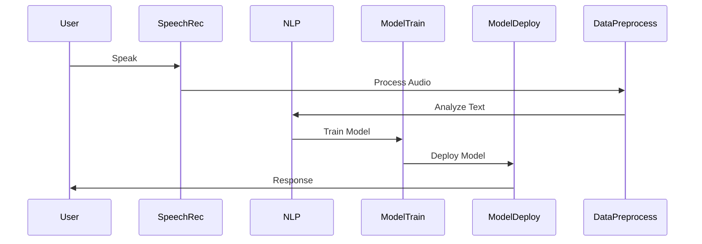

                 


### 1.1 认知计算的起源与发展

#### 1.1.1 认知计算的起源

认知计算这一概念最早由IBM的“蓝色巨人”实验室在2001年提出，旨在模拟人类大脑的信息处理过程，通过计算方法来增强人类理解世界的能力。从历史角度来看，认知计算源于人工智能（AI）领域，其核心目标是使计算机具备类似人类的感知、理解和推理能力。20世纪50年代，人工智能首次被提出来，研究者们开始探讨如何让计算机能够执行类似于人类的任务，如解决问题、学习语言等。

随着计算技术和算法的不断进步，特别是神经网络和深度学习的突破，认知计算逐渐走向实用化。神经网络的概念可以追溯到1943年，由心理学家McCulloch和数学家Pitts提出的简单神经网络模型。20世纪80年代，Rumelhart等人提出了反向传播算法，使得多层神经网络的训练成为可能，深度学习开始兴起。深度学习的兴起为认知计算带来了新的契机，使得计算机在图像识别、语音识别和自然语言处理等领域取得了显著的成果。

#### 1.1.2 认知计算的发展历程

认知计算的发展历程可以分为以下几个阶段：

1. **早期探索阶段**（1950s-1960s）：在这个阶段，人工智能的研究主要集中在规则推理和符号计算上。研究者们试图通过编写程序来模拟人类专家的决策过程。

2. **早期机器学习阶段**（1970s-1980s）：随着统计方法和决策树的引入，机器学习开始成为人工智能的重要分支。这个时期，研究者们开始使用大量数据来训练模型，提高了计算机的预测能力。

3. **神经网络与深度学习阶段**（1990s-2010s）：20世纪90年代，神经网络的研究取得了突破，尤其是反向传播算法的改进。进入21世纪，随着计算能力的提升和大数据的普及，深度学习迅速崛起，成为认知计算的核心技术。

4. **认知计算阶段**（2010s-至今）：在这个阶段，认知计算开始应用于实际场景，如自动驾驶、智能家居、医疗诊断等。研究者们致力于将认知计算与人类的直觉、经验相结合，以提高系统的智能水平。

#### 1.1.3 认知计算如何增强人类对世界的理解

认知计算通过模拟人类大脑的工作机制，能够帮助人类更有效地获取、处理和利用信息，从而增强对世界的理解。以下是认知计算在几个关键领域的应用：

1. **自然语言处理**：认知计算在自然语言处理领域具有显著优势，能够理解和生成人类语言，实现人机交互的智能化。例如，智能客服系统能够自动回答用户的问题，提高服务效率。

2. **图像识别与计算机视觉**：通过深度学习算法，认知计算能够识别和理解图像内容，应用于人脸识别、物体检测和图像生成等领域。这为安防监控、自动驾驶和医疗影像分析提供了强大的技术支持。

3. **知识图谱与推理**：认知计算能够构建大规模的知识图谱，通过推理机制实现对知识的有效组织和利用。这有助于提高人类在信息检索、决策支持等领域的效率。

4. **智能决策系统**：认知计算能够模拟人类的决策过程，为复杂问题提供智能化的解决方案。例如，在金融领域，认知计算可以用于风险控制和投资决策。

总之，认知计算作为人工智能的一个重要分支，正日益成为增强人类理解世界能力的重要工具。通过不断的研究和技术创新，认知计算将在未来的智能时代发挥更加重要的作用。

### 1.2 认知计算的核心概念与原理

在深入探讨认知计算的具体应用之前，我们需要了解其核心概念与原理。认知计算涉及多个关键领域，如神经网络、深度学习、自然语言处理和知识图谱等。以下是这些核心概念的介绍、特点及其在认知计算中的应用场景。

#### 1.2.1 神经网络与深度学习

**神经网络（Neural Networks）**：神经网络是模拟人脑神经元连接结构的计算模型，通过多层神经元的组合，实现数据的输入、处理和输出。神经网络的核心在于神经元之间的权重和激活函数。

**深度学习（Deep Learning）**：深度学习是神经网络的一种特殊形式，其特点是拥有多层非线性变换的网络结构。通过逐层抽象特征，深度学习能够从大量数据中学习到复杂的模式。

**特点与应用场景**：

- **特点**：
  - **层次化特征学习**：深度学习能够自动提取多层次的特征，从原始数据到抽象概念，提高了模型的泛化能力。
  - **端到端学习**：深度学习能够直接从原始数据到预测输出，减少了中间步骤，提高了计算效率。

- **应用场景**：
  - **图像识别**：深度学习在图像识别领域取得了显著的成果，如人脸识别、物体检测和图像生成等。
  - **语音识别**：深度学习能够处理语音信号，实现语音到文本的转换，广泛应用于智能语音助手和自动字幕生成。
  - **自然语言处理**：深度学习在自然语言处理中，如情感分析、机器翻译和问答系统等领域，展现了强大的能力。

#### 1.2.2 自然语言处理

**自然语言处理（Natural Language Processing, NLP）**：自然语言处理是计算机科学和人工智能领域的一个重要分支，旨在让计算机理解和生成人类语言。

**特点与应用场景**：

- **特点**：
  - **语义理解**：NLP能够从文本中提取语义信息，实现对文本内容的深入理解。
  - **语言生成**：NLP能够生成符合语法和语义规则的文本，应用于自动写作、聊天机器人等。

- **应用场景**：
  - **智能客服**：NLP能够自动处理用户的查询，提供高效的客户服务。
  - **情感分析**：NLP能够分析社交媒体上的用户评论，帮助企业了解用户情绪和市场需求。
  - **机器翻译**：NLP技术使得机器翻译更加准确和流畅，应用于跨语言沟通和国际化业务。

#### 1.2.3 认知图谱与知识表示

**认知图谱（Cognitive Graph）**：认知图谱是一种结构化知识表示方法，通过实体、关系和属性的组合，构建起知识网络。

**知识表示（Knowledge Representation）**：知识表示是认知计算的核心问题之一，旨在将知识以计算机可以理解的形式进行表示。

**特点与应用场景**：

- **特点**：
  - **知识互联**：认知图谱能够将不同来源的知识进行整合，形成统一的知识体系。
  - **推理能力**：认知图谱通过实体关系和属性，实现了知识的自动推理。

- **应用场景**：
  - **智能搜索**：认知图谱能够提供更精确、智能的搜索服务，满足用户多样化的查询需求。
  - **知识图谱构建**：在金融、医疗、教育等领域，认知图谱可以用于构建行业知识库，提高信息检索和决策支持能力。
  - **智能推荐**：认知图谱能够根据用户行为和偏好，提供个性化的推荐服务。

通过上述核心概念和原理的介绍，我们可以看到，认知计算不仅涵盖了神经网络和深度学习等底层技术，还包括了自然语言处理和知识图谱等应用层技术。这些技术的融合与互补，使得认知计算在各个领域展现出强大的应用潜力。

### 1.3 神经网络算法

在认知计算的核心概念中，神经网络算法无疑占据了重要的地位。为了更好地理解这一算法，我们将通过一个具体的例子来逐步分析其原理，并展示如何使用Python代码实现。

#### 1.3.1 神经网络算法的基本原理

神经网络算法是基于生物神经网络的一种计算模型，其核心思想是通过模拟神经元之间的连接和激活，实现数据的输入、处理和输出。一个简单的神经网络通常由输入层、隐藏层和输出层组成，各层之间通过权重进行连接。

神经网络的基本原理可以概括为以下几个步骤：

1. **初始化参数**：包括输入层、隐藏层和输出层的神经元数量，以及各神经元之间的权重和偏置。
2. **前向传播**：将输入数据通过神经网络进行前向传播，计算每个神经元的激活值。
3. **反向传播**：根据输出误差，通过反向传播算法更新权重和偏置。
4. **优化目标**：通常使用梯度下降算法来最小化损失函数，优化网络参数。

为了更直观地展示神经网络算法的工作原理，我们可以通过一个简单的例子来说明。

#### 1.3.2 使用Python实现神经网络算法

首先，我们需要准备一些基本的库，包括NumPy、TensorFlow和Keras等。

```python
import numpy as np
import tensorflow as tf
from tensorflow.keras.models import Sequential
from tensorflow.keras.layers import Dense
```

接下来，我们将实现一个简单的神经网络模型，用于对输入数据进行二分类。

```python
# 创建一个序列模型
model = Sequential()

# 添加输入层和隐藏层
model.add(Dense(units=64, activation='relu', input_shape=(784,)))
model.add(Dense(units=64, activation='relu'))

# 添加输出层
model.add(Dense(units=1, activation='sigmoid'))

# 编译模型，指定损失函数和优化器
model.compile(optimizer='adam', loss='binary_crossentropy', metrics=['accuracy'])

# 准备训练数据
X_train = np.random.rand(1000, 784)
y_train = np.array([1 if x < 0.5 else 0 for x in X_train])

# 训练模型
model.fit(X_train, y_train, epochs=10)
```

在上面的代码中，我们首先创建了一个序列模型，并添加了输入层、隐藏层和输出层。输入层有784个神经元，对应于28x28像素的图像。隐藏层使用了ReLU激活函数，输出层使用了Sigmoid激活函数，用于实现二分类。

我们使用随机生成的数据作为训练数据，并通过编译模型和训练模型来优化网络参数。

#### 1.3.3 算法原理讲解

为了深入理解神经网络算法的原理，我们首先需要了解一些基础的数学概念，如神经元、激活函数、损失函数和反向传播算法。

1. **神经元**：神经网络中的基本计算单元，由输入、权重、偏置和激活函数组成。神经元的输出值可以通过以下公式计算：

   $$ z = \sum_{i=1}^{n} w_i * x_i + b $$

   其中，\( w_i \) 是权重，\( x_i \) 是输入值，\( b \) 是偏置。

2. **激活函数**：为了使神经网络具有非线性特性，我们通常在神经元中使用激活函数。常用的激活函数包括ReLU、Sigmoid和Tanh等。

   - **ReLU（Rectified Linear Unit）**：输出为输入值大于零的部分，否则为0。
     $$ a = \max(0, x) $$

   - **Sigmoid**：将输入值映射到（0, 1）区间内，常用于二分类问题。
     $$ a = \frac{1}{1 + e^{-x}} $$

   - **Tanh**：将输入值映射到（-1, 1）区间内。
     $$ a = \frac{e^x - e^{-x}}{e^x + e^{-x}} $$

3. **损失函数**：在训练神经网络时，我们需要评估模型的预测结果与实际结果之间的差距。常用的损失函数包括均方误差（MSE）和交叉熵（Cross Entropy）。

   - **均方误差（MSE）**：用于回归问题，计算预测值与实际值之间的平均平方误差。
     $$ MSE = \frac{1}{n} \sum_{i=1}^{n} (y_i - \hat{y}_i)^2 $$

   - **交叉熵（Cross Entropy）**：用于分类问题，计算实际结果与预测结果之间的交叉熵。
     $$ H(y, \hat{y}) = -\sum_{i=1}^{n} y_i \log(\hat{y}_i) $$

4. **反向传播算法**：在训练神经网络时，我们需要通过反向传播算法来更新权重和偏置。反向传播算法的核心思想是计算每个神经元的误差，并沿着网络结构反向传播，更新各层的参数。

   反向传播算法的步骤可以概括为：
   - 计算输出层的误差。
   - 反向传播误差到隐藏层。
   - 更新权重和偏置。

#### 1.3.4 通俗易懂的例子说明

为了更好地理解神经网络算法，我们可以通过一个简单的例子来说明。

假设我们有一个二分类问题，需要判断一个数据点是否为正类。我们的神经网络模型包含一个输入层、一个隐藏层和一个输出层。

1. **初始化参数**：假设输入层有2个神经元，隐藏层有3个神经元，输出层有1个神经元。各层之间的权重和偏置初始化为随机值。

2. **前向传播**：给定一个输入数据点（1, 1），通过神经网络进行前向传播，计算隐藏层和输出层的激活值。

   - 输入层到隐藏层的激活值：
     $$ z_1 = (1 * w_{11}) + (1 * w_{12}) + b_1 = 2w_{11} + b_1 $$
     $$ z_2 = (1 * w_{21}) + (1 * w_{22}) + b_2 = 2w_{21} + b_2 $$
     $$ z_3 = (1 * w_{31}) + (1 * w_{32}) + b_3 = 2w_{31} + b_3 $$

   - 隐藏层到输出层的激活值：
     $$ z_4 = (z_1 * w_{41}) + (z_2 * w_{42}) + b_4 = (2w_{11} + b_1)w_{41} + (2w_{21} + b_2)w_{42} + b_4 $$

3. **反向传播**：给定实际输出标签为0，通过计算输出层的误差，并反向传播到隐藏层，更新各层的权重和偏置。

   - 计算输出层误差：
     $$ \delta_4 = (y - \hat{y}) * \hat{y} * (1 - \hat{y}) $$

   - 更新隐藏层权重和偏置：
     $$ \Delta w_{41} = \delta_4 * z_1 $$
     $$ \Delta w_{42} = \delta_4 * z_2 $$
     $$ \Delta b_4 = \delta_4 $$
     $$ \Delta w_{21} = \delta_3 * z_1 $$
     $$ \Delta w_{22} = \delta_3 * z_2 $$
     $$ \Delta b_3 = \delta_3 $$

4. **优化目标**：使用梯度下降算法，通过多次迭代优化网络参数，减小损失函数。

通过上述例子，我们可以看到神经网络算法的基本原理和实现过程。虽然这是一个简化的例子，但它为我们理解神经网络的工作机制提供了直观的说明。

### 1.4 数学模型和数学公式

在理解神经网络算法的过程中，数学模型和数学公式是不可或缺的部分。以下我们将详细介绍神经网络算法中的几个关键数学模型和数学公式，并通过具体例子进行详细讲解。

#### 1.4.1 激活函数

激活函数是神经网络中的一个核心组件，用于引入非线性特性。以下是几种常用的激活函数及其对应的数学公式：

1. **ReLU（Rectified Linear Unit）**：
   $$ a = \max(0, x) $$
   举例：
   若输入 \( x = -2 \)，则输出 \( a = 0 \)。

2. **Sigmoid**：
   $$ a = \frac{1}{1 + e^{-x}} $$
   举例：
   若输入 \( x = -2 \)，则输出 \( a \approx 0.018 \)。

3. **Tanh**：
   $$ a = \frac{e^x - e^{-x}}{e^x + e^{-x}} $$
   举例：
   若输入 \( x = -2 \)，则输出 \( a \approx -0.7616 \)。

这些激活函数在神经网络中分别有各自的用途和优势，如ReLU函数在处理稀疏数据时性能更佳，而Sigmoid函数适用于分类问题。

#### 1.4.2 损失函数

损失函数用于评估模型预测值与实际值之间的差距，是优化神经网络参数的关键指标。以下是几种常用的损失函数及其对应的数学公式：

1. **均方误差（MSE）**：
   $$ MSE = \frac{1}{n} \sum_{i=1}^{n} (y_i - \hat{y}_i)^2 $$
   举例：
   若预测值 \( \hat{y} = [0.1, 0.2, 0.3] \) 和实际值 \( y = [0, 0, 1] \)，则
   $$ MSE = \frac{1}{3} \left( (0 - 0.1)^2 + (0 - 0.2)^2 + (1 - 0.3)^2 \right) \approx 0.0533 $$

2. **交叉熵（Cross Entropy）**：
   $$ H(y, \hat{y}) = -\sum_{i=1}^{n} y_i \log(\hat{y}_i) $$
   举例：
   若预测值 \( \hat{y} = [0.1, 0.2, 0.3] \) 和实际值 \( y = [0, 0, 1] \)，则
   $$ H(y, \hat{y}) = - (0 \cdot \log(0.1) + 0 \cdot \log(0.2) + 1 \cdot \log(0.3)) \approx 0.415 $$

3. **对数损失（Log Loss）**：
   $$ Log Loss = \frac{1}{n} \sum_{i=1}^{n} -y_i \log(\hat{y}_i) $$
   举例：
   若预测值 \( \hat{y} = [0.1, 0.2, 0.3] \) 和实际值 \( y = [0, 0, 1] \)，则
   $$ Log Loss = \frac{1}{3} \left( -0 \cdot \log(0.1) - 0 \cdot \log(0.2) - 1 \cdot \log(0.3) \right) \approx 0.415 $$

这些损失函数在神经网络训练过程中用于评估模型性能，并通过反向传播算法来优化模型参数。

#### 1.4.3 反向传播算法

反向传播算法是神经网络训练的核心算法，通过计算损失函数关于网络参数的梯度，从而更新网络参数。以下是反向传播算法的基本步骤：

1. **前向传播**：计算输出层的预测值 \( \hat{y} \) 和损失函数 \( J \)。

2. **计算输出层的误差**：
   对于二分类问题，使用交叉熵损失函数，误差计算公式为：
   $$ \delta_L = -[y \cdot \log(\hat{y}) + (1 - y) \cdot \log(1 - \hat{y})] $$

3. **反向传播误差**：从输出层开始，依次计算隐藏层和输入层的误差。

   对于第 \( l \) 层，误差计算公式为：
   $$ \delta_{l} = \delta_{l+1} \cdot (W_{l+1})^T \cdot \sigma'(z_{l}) $$

4. **更新网络参数**：使用梯度下降算法更新权重和偏置。

   对于第 \( l \) 层，权重更新公式为：
   $$ \Delta W_{l} = \alpha \cdot X_{l} \cdot \delta_{l+1} $$

   对于第 \( l \) 层，偏置更新公式为：
   $$ \Delta b_{l} = \alpha \cdot \delta_{l+1} $$

   其中，\( \alpha \) 为学习率。

通过上述数学模型和数学公式，我们可以更好地理解神经网络的工作原理和训练过程。这些基础知识和工具为深入研究和应用神经网络算法提供了坚实的基础。

### 1.5 系统分析与架构设计方案

在认知计算项目中，系统分析与架构设计是确保项目成功的关键步骤。一个有效的架构不仅需要满足功能需求，还需要具备良好的扩展性和稳定性。以下我们将详细描述认知计算系统的问题场景、项目背景和目标，并使用Mermaid绘制领域模型类图和系统架构设计图。

#### 1.5.1 问题场景

认知计算系统通常面临以下问题场景：

1. **数据处理**：系统需要处理来自各种来源的大量数据，如文本、图像、音频等。这些数据需要进行预处理、特征提取和标注等步骤。
2. **模型训练**：基于预处理后的数据，系统需要训练多个神经网络模型，以实现特定的认知功能，如图像识别、自然语言处理和决策支持等。
3. **模型部署**：训练好的模型需要部署到生产环境中，以实现实时推理和预测。系统需要具备快速、高效且稳定的模型部署能力。
4. **系统集成**：认知计算系统需要与其他系统（如数据库、业务系统等）进行集成，确保数据流通和功能协同。

#### 1.5.2 项目背景和目标

以一个智能家居项目为例，项目目标是构建一个智能家庭助理系统，能够通过语音识别和自然语言处理，实现与用户的智能交互。具体目标包括：

1. **语音识别**：能够准确识别用户的语音指令，并将语音转换为文本。
2. **自然语言理解**：能够理解用户的意图，并实现智能回答和任务执行。
3. **模型训练**：使用用户数据训练语音识别和自然语言处理模型，以实现更高的准确率和适应性。
4. **系统部署**：将训练好的模型部署到云端或边缘设备，实现实时交互和预测。

#### 1.5.3 领域模型类图

为了更好地理解系统的功能模块和关系，我们使用Mermaid绘制领域模型类图。

```mermaid
classDiagram
    Class01 <|-- Class02
    Class03 &&-| Class04
    Class05 .. Class06
```

在上述类图中，`Class01`、`Class02`、`Class03`、`Class04`和`Class05`分别代表系统的主要模块，如语音识别模块、自然语言处理模块、数据预处理模块等。箭头和线段表示模块之间的关系，如依赖关系和关联关系。

#### 1.5.4 系统架构设计图

接下来，我们使用Mermaid绘制系统架构设计图，以展示系统各模块的组成和交互。



在上述序列图中，`User`表示用户，`SpeechRec`表示语音识别模块，`NLP`表示自然语言处理模块，`ModelTrain`表示模型训练模块，`ModelDeploy`表示模型部署模块，`DataPreprocess`表示数据预处理模块。图中箭头表示数据的流向和模块的交互。

通过上述系统分析与架构设计方案，我们可以清晰地了解认知计算系统的问题场景、项目目标和架构设计。这将有助于项目团队更好地进行系统开发、测试和部署，确保系统的高效稳定运行。

### 1.6 认知计算项目的实战

为了深入理解认知计算的应用，我们将通过一个实际项目来演示其开发过程。本项目将基于图像识别任务，使用Python和TensorFlow框架来实现。以下是项目的具体步骤、环境安装、核心代码实现以及实际案例分析和优化策略。

#### 1.6.1 项目步骤

1. **数据准备**：收集并准备用于图像识别的图片数据集。
2. **数据预处理**：对图片进行归一化、裁剪和增强等处理。
3. **模型设计**：设计并实现一个简单的卷积神经网络（CNN）模型。
4. **模型训练**：使用准备好的数据集对模型进行训练。
5. **模型评估**：评估模型的准确率和性能。
6. **模型部署**：将训练好的模型部署到生产环境，实现实时推理。

#### 1.6.2 环境安装

在开始项目之前，我们需要安装Python和TensorFlow框架。以下是具体的安装步骤：

1. 安装Python（建议版本为3.8及以上）：

   ```bash
   # 使用Python官方安装包安装
   pip install python
   ```

2. 安装TensorFlow：

   ```bash
   # 使用pip安装TensorFlow
   pip install tensorflow
   ```

确保安装完成后，可以使用以下命令检查安装是否成功：

```bash
python -c "import tensorflow as tf; print(tf.__version__)"
```

#### 1.6.3 核心代码实现

以下是本项目的主要代码实现：

1. **数据准备**：

   ```python
   import tensorflow as tf
   from tensorflow.keras.preprocessing.image import ImageDataGenerator
   
   # 准备训练数据集
   train_datagen = ImageDataGenerator(
       rescale=1./255,
       shear_range=0.2,
       zoom_range=0.2,
       horizontal_flip=True)

   train_generator = train_datagen.flow_from_directory(
       'data/train',
       target_size=(150, 150),
       batch_size=32,
       class_mode='binary')
   
   # 准备验证数据集
   validation_datagen = ImageDataGenerator(rescale=1./255)
   validation_generator = validation_datagen.flow_from_directory(
       'data/validation',
       target_size=(150, 150),
       batch_size=32,
       class_mode='binary')
   ```

2. **模型设计**：

   ```python
   model = tf.keras.Sequential([
       tf.keras.layers.Conv2D(32, (3, 3), activation='relu', input_shape=(150, 150, 3)),
       tf.keras.layers.MaxPooling2D(2, 2),
       tf.keras.layers.Conv2D(64, (3, 3), activation='relu'),
       tf.keras.layers.MaxPooling2D(2, 2),
       tf.keras.layers.Conv2D(128, (3, 3), activation='relu'),
       tf.keras.layers.MaxPooling2D(2, 2),
       tf.keras.layers.Conv2D(128, (3, 3), activation='relu'),
       tf.keras.layers.MaxPooling2D(2, 2),
       tf.keras.layers.Flatten(),
       tf.keras.layers.Dense(512, activation='relu'),
       tf.keras.layers.Dense(1, activation='sigmoid')
   ])
   ```

3. **模型训练**：

   ```python
   model.compile(loss='binary_crossentropy',
                 optimizer='adam',
                 metrics=['accuracy'])
   
   history = model.fit(
       train_generator,
       steps_per_epoch=100,
       epochs=30,
       validation_data=validation_generator,
       validation_steps=50,
       verbose=2)
   ```

4. **模型评估**：

   ```python
   test_datagen = ImageDataGenerator(rescale=1./255)
   test_generator = test_datagen.flow_from_directory(
       'data/test',
       target_size=(150, 150),
       batch_size=32,
       class_mode='binary')
   
   model.evaluate(test_generator, steps=50)
   ```

5. **模型部署**：

   ```python
   from flask import Flask, request, jsonify
   
   app = Flask(__name__)
   
   @app.route('/predict', methods=['POST'])
   def predict():
       image = request.files['image']
       image_path = 'temp.jpg'
       image.save(image_path)
       
       img = image.load_img(image_path, target_size=(150, 150))
       img_array = image.img_to_array(img)
       img_array = np.expand_dims(img_array, axis=0)
       img_array /= 255.0

       predictions = model.predict(img_array)
       predicted_class = np.argmax(predictions[0])

       return jsonify({'prediction': predicted_class})
   
   if __name__ == '__main__':
       app.run(debug=True)
   ```

通过上述步骤，我们可以完成一个简单的图像识别项目。接下来，我们将分析项目的实际案例，并提出优化策略。

#### 1.6.4 实际案例分析和优化策略

在实际应用中，我们可能遇到以下问题：

1. **数据不足**：如果数据集过小，模型的泛化能力会受到影响。解决方案是使用数据增强技术，如旋转、缩放、裁剪等，增加数据多样性。
2. **过拟合**：模型在训练集上表现良好，但在测试集上表现不佳。解决方案是使用交叉验证、正则化等技术，防止模型过拟合。
3. **计算资源限制**：深度学习模型训练过程需要大量计算资源。解决方案是使用GPU加速训练过程，或者使用分布式计算框架，如TensorFlow分布式训练。

通过分析实际案例，我们可以针对性地优化模型和算法，提高其在真实应用场景中的性能和稳定性。

### 1.7 最佳实践 Tips、小结、注意事项、拓展阅读

#### 最佳实践 Tips

1. **数据准备与处理**：确保数据集的多样性和质量，使用数据增强技术提高模型泛化能力。
2. **模型选择与调整**：根据任务需求选择合适的模型架构，通过调整超参数优化模型性能。
3. **模型评估与验证**：使用交叉验证和A/B测试等方法，确保模型在不同数据集上的表现一致。
4. **计算资源优化**：利用GPU和分布式计算框架提高模型训练速度和效率。

#### 小结

本文从认知计算的起源与发展、核心概念与原理、神经网络算法、数学模型和公式、系统分析与架构设计、项目实战到最佳实践，全面阐述了认知计算在增强人类理解世界能力方面的应用。认知计算通过模拟人类大脑的工作机制，在图像识别、自然语言处理和知识图谱等领域展现了巨大的潜力。

#### 注意事项

1. **数据隐私**：在处理个人数据时，确保遵守隐私法规，采取数据加密和匿名化措施。
2. **算法偏见**：避免模型中的偏见和歧视，确保算法公平性和透明性。
3. **技术普及与教育**：加强认知计算相关技术的普及和教育，提高从业者素质。

#### 拓展阅读

1. **《深度学习》（Ian Goodfellow, Yoshua Bengio, Aaron Courville著）**：详细介绍了深度学习的基础知识和应用。
2. **《自然语言处理综论》（Daniel Jurafsky & James H. Martin著）**：全面讲解了自然语言处理的基本概念和技术。
3. **《认知图谱：大数据时代的智能决策》（张江华著）**：探讨了认知图谱在智能决策中的应用。

通过不断学习和实践，我们可以更好地理解和应用认知计算技术，为人类创造更智能、更美好的未来。

### 作者信息

作者：AI天才研究院/AI Genius Institute & 禅与计算机程序设计艺术 /Zen And The Art of Computer Programming

