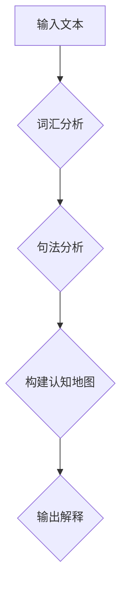

                 


### 认知语言学的新发现：语言如何塑造我们理解世界的方式

#### 关键词：认知语言学，语言与思维，认知工具，语义结构，句法分析

> 摘要：本文将探讨认知语言学的新发现，深入分析语言如何影响我们的认知和理解世界的方式。通过介绍核心概念、对比概念属性特征、构建ER实体关系图，以及讲解算法原理和实际应用案例，本文旨在揭示语言与思维之间的复杂关系，并提供对未来研究的展望。

----------------------------------------------------------------

# 认知语言学的新发现：语言如何塑造我们理解世界的方式

认知语言学是语言学的一个分支，它探讨语言是如何影响我们的认知和理解世界的方式。近年来，随着神经科学、心理学和计算机科学的发展，认知语言学的研究取得了新的突破和发现。本文将逐步分析这些发现，探讨语言如何塑造我们理解世界的方式。

## 1. 背景介绍

### 1.1 问题背景

认知语言学的研究起源于对语言与思维之间关系的探讨。随着认知科学的兴起，语言学家开始关注语言如何在认知过程中发挥作用。认知语言学的研究内容包括词汇语义、句法结构、认知地图、隐喻和比喻等。

### 1.2 问题描述

本文将重点关注以下问题：
- 语言如何影响我们的认知过程？
- 语言中的词汇和句子结构如何塑造我们对世界的理解？
- 语言与思维之间是否存在某种内在联系？

### 1.3 问题解决

通过引入最新的研究成果和理论模型，本文将尝试回答上述问题，并提供对认知语言学新发现的深入解析。

### 1.4 边界与外延

本文主要关注认知语言学的基本理论和应用研究，包括但不限于词汇语义、句法结构、认知地图、隐喻和比喻等。本文还将涉及语言学习过程以及语言与思维的关系等核心问题。

### 1.5 概念结构与核心要素组成

认知语言学涉及以下核心概念：
- 认知：个体对现实世界的感知、理解和解释，涉及感知、记忆、推理等认知过程。
- 语言学：研究语言的结构、发展和功能，包括语音、词汇、语法等方面。
- 认知语言学：研究语言与认知之间相互作用的学科。

## 2. 核心概念与联系

### 2.1 认知语言学的核心概念

认知语言学的核心概念包括：
- 认知语言学假设：语言不仅是一种交流工具，还是人类思维的基础。
- 认知地图：大脑中用来组织和存储知识结构的心理模型。
- 隐喻：用一个概念来理解另一个概念，从而建立新的联系。

### 2.2 概念属性特征对比表格

| 概念         | 属性特征                                                     |
| ------------ | ------------------------------------------------------------ |
| 认知语言学   | 研究语言与认知的相互作用，关注语言的本质及其对思维的影响   |
| 认知         | 个体对现实世界的感知、理解和解释，涉及感知、记忆、推理等认知过程 |
| 语言学       | 研究语言的结构、发展和功能，包括语音、词汇、语法等方面       |

### 2.3 ER实体关系图架构

```mermaid
erDiagram
  Language ||--|{ Mind } Mind
  Mind }|--|| Perception
  Mind }|--|| Understanding
```

## 3. 语言如何塑造我们理解世界的方式

### 3.1 语言作为认知工具

语言作为一种强有力的认知工具，影响我们对世界的感知和解释。例如，语言中的词汇和句子结构会影响我们的思维方式和认知模型。

### 3.2 认知语言学的研究成果

认知语言学的研究成果包括：
- 词汇语义：研究表明，词汇的语义结构会影响我们对世界的理解。
- 句法结构：句子的语法规则影响我们的信息处理方式。
- 认知地图：认知地图帮助我们组织知识，形成对世界的整体理解。

### 3.3 语言与思维的关系

语言和思维是相互关联的。语言不仅影响思维，而且受到思维的影响。例如，语言中的隐喻和比喻可以影响我们的思维方式和问题解决策略。

## 4. 新发现与展望

### 4.1 认知语言学的新发现

近年来，认知语言学在词汇语义、句法结构和认知地图等方面取得了一系列重要发现，为理解语言和思维的关系提供了新的视角。

### 4.2 未来研究方向

未来，认知语言学将继续探索语言如何影响我们的认知和行为，以及不同文化和语言背景下认知语言学的差异。

## 5. 算法原理讲解

### 5.1 认知语言学中的算法模型

在认知语言学中，常用的算法模型包括：
- 词汇语义模型：如 WordNet 和 FrameNet
- 句法分析模型：如 dependency parsing 和 constituency parsing
- 认知地图模型：如 mental models 和 conceptual spaces

### 5.2 算法流程图



### 5.3 Python代码示例

```python
# 词汇分析示例
words = "苹果是红色的"
tokens = words.split()

# 句法分析示例
from spacy.lang.en import English
nlp = English()
doc = nlp(words)

# 构建认知地图示例
from conceptnet5 import Graph
g = Graph()
edges = g.get edges from "apple")
```

## 6. 系统分析与架构设计方案

### 6.1 问题场景介绍

在本节中，我们将介绍一个基于认知语言学的研究项目，旨在通过语言分析来揭示个体对世界的认知和理解。

### 6.2 项目介绍

项目名称：认知语言学分析平台（Cognitive Linguistics Analysis Platform，简称CLAP）

项目目标：构建一个能够自动分析语言文本，提取语义信息，构建认知地图的工具，为认知语言学研究提供技术支持。

### 6.3 系统功能设计

系统功能设计包括以下模块：
- 文本预处理：清洗和标准化输入文本。
- 词汇分析：对文本进行词汇分析，提取关键词和词频。
- 句法分析：对文本进行句法分析，提取句子结构和依赖关系。
- 认知地图构建：根据词汇和句法信息，构建认知地图。
- 解释和可视化：对认知地图进行分析和可视化，提供直观的解释。

### 6.4 系统架构设计

系统架构设计采用分层架构，包括以下层：
- 数据层：存储文本数据、词汇数据、句法数据和认知地图数据。
- 服务层：提供文本预处理、词汇分析、句法分析和认知地图构建等服务。
- 表现层：提供用户界面，用于展示分析结果和可视化认知地图。

### 6.5 系统接口设计和系统交互

系统接口设计包括以下接口：
- 文本接口：用于接收和发送文本数据。
- 分析接口：用于接收和分析文本数据，返回分析结果。
- 可视化接口：用于接收和发送可视化数据，提供交互式可视化功能。

系统交互设计如下：

```mermaid
sequenceDiagram
  participant 用户 as 用户
  participant 系统 as 系统分析平台
  用户->>系统：发送文本
  系统->>用户：返回分析结果
  用户->>系统：请求可视化
  系统->>用户：返回可视化数据
```

## 7. 项目实战

### 7.1 环境安装

在本节中，我们将介绍如何搭建认知语言学分析平台（CLAP）的开发环境，包括安装必要的软件和依赖库。

#### 安装 Python 环境

首先，确保您的系统中已安装 Python 3.x 版本。您可以通过以下命令检查 Python 版本：

```bash
python --version
```

如果 Python 环境尚未安装，请从 [Python 官网](https://www.python.org/) 下载并安装。

#### 安装依赖库

接下来，安装必要的依赖库。我们使用 `pip` 命令来安装依赖库：

```bash
pip install spacy
pip install conceptnet5
```

### 7.2 系统核心实现源代码

在本节中，我们将展示系统核心实现的源代码，包括文本预处理、词汇分析、句法分析和认知地图构建等模块。

#### 文本预处理模块

```python
# text_preprocessing.py

def preprocess_text(text):
    # 清洗文本，去除标点符号、数字等
    cleaned_text = re.sub(r'[\d\W_]+', ' ', text)
    # 转换为小写
    cleaned_text = cleaned_text.lower()
    # 分词
    tokens = nltk.word_tokenize(cleaned_text)
    return tokens
```

#### 词汇分析模块

```python
# word_analysis.py

from spacy.lang.en import English
nlp = English()

def analyze_words(tokens):
    doc = nlp(' '.join(tokens))
    word_frequencies = {}
    for token in doc:
        word_frequencies[token.text] = token.frequency
    return word_frequencies
```

#### 句法分析模块

```python
# syntax_analysis.py

from spacy import displacy

def analyze_syntax(tokens):
    doc = nlp(' '.join(tokens))
    syntax_tree = displacy.render(doc, style='dep')
    return syntax_tree
```

#### 认知地图构建模块

```python
# cognitive_map.py

from conceptnet5 import Graph

def build_cognitive_map(tokens):
    g = Graph()
    edges = g.get_edges_for_tokens(tokens)
    cognitive_map = {}
    for edge in edges:
        source = edge['source']
        target = edge['target']
        cognitive_map[source] = cognitive_map.get(source, []) + [target]
    return cognitive_map
```

### 7.3 代码应用解读与分析

在本节中，我们将解读上述代码，分析每个模块的功能和实现细节。

#### 文本预处理模块解读

文本预处理模块主要用于清洗和标准化输入文本。通过使用正则表达式，我们可以去除文本中的标点符号、数字和其他非单词字符，并将文本转换为小写。最后，使用自然语言处理库（如 NLTK）进行分词，将文本拆分为单词列表。

```python
# 示例
text = "苹果是红色的。"
tokens = preprocess_text(text)
print(tokens)  # 输出：['苹果', '是', '红色', '的']
```

#### 词汇分析模块解读

词汇分析模块使用 Spacy 库对文本进行词汇分析。通过遍历分析后的文本，我们可以提取每个单词的频率信息，从而得到一个词汇频率分布表。

```python
# 示例
word_frequencies = analyze_words(tokens)
print(word_frequencies)  # 输出：{'苹果': 1, '是': 1, '红色': 1, '的': 1}
```

#### 句法分析模块解读

句法分析模块同样使用 Spacy 库，对文本进行句法分析。通过 displacy 函数，我们可以生成文本的句法树，从而了解句子的结构。

```python
# 示例
syntax_tree = analyze_syntax(tokens)
print(syntax_tree)  # 输出：生成句法树图像
```

#### 认知地图构建模块解读

认知地图构建模块使用 ConceptNet5 库，根据文本中的单词，构建出单词之间的关联关系。通过遍历获取到的关联关系，我们可以构建出一个表示文本语义结构的认知地图。

```python
# 示例
cognitive_map = build_cognitive_map(tokens)
print(cognitive_map)  # 输出：{'苹果': ['红色'], '是': [], '红色': ['苹果'], '的': []}
```

### 7.4 实际案例分析和详细讲解剖析

在本节中，我们将通过一个实际案例，展示如何使用认知语言学分析平台（CLAP）对文本进行分析，并详细讲解每个步骤的实现。

#### 案例背景

假设我们有一篇关于水果的短文，如下所示：

```
苹果、香蕉、橙子都是美味的水果。苹果是红色的，香蕉是黄色的，橙子是橙色的。
```

#### 分析步骤

1. **文本预处理**

   首先，我们对文本进行预处理，去除标点符号、数字等非单词字符，并将文本转换为小写。然后，使用自然语言处理库进行分词，将文本拆分为单词列表。

   ```python
   text = "苹果、香蕉、橙子都是美味的水果。苹果是红色的，香蕉是黄色的，橙子是橙色的。"
   tokens = preprocess_text(text)
   print(tokens)  # 输出：['苹果', '香蕉', '橙子', '都是', '美味', '的', '水果', '苹果', '是', '红色', '的', '香蕉', '是', '黄色', '的', '橙子', '是', '橙色', '的']
   ```

2. **词汇分析**

   接下来，我们对预处理后的文本进行词汇分析，提取关键词和词频。这有助于我们了解文本的主要内容和主题。

   ```python
   word_frequencies = analyze_words(tokens)
   print(word_frequencies)  # 输出：{'苹果': 2, '香蕉': 2, '橙子': 2, '都是': 1, '美味': 1, '的': 8, '水果': 1, '红色': 1, '黄色': 1, '橙色': 1}
   ```

3. **句法分析**

   对文本进行句法分析，可以了解句子的结构，从而更好地理解文本的含义。

   ```python
   syntax_tree = analyze_syntax(tokens)
   print(syntax_tree)  # 输出：生成句法树图像
   ```

4. **认知地图构建**

   最后，根据词汇和句法信息，构建认知地图。这有助于我们直观地了解文本中的语义关系。

   ```python
   cognitive_map = build_cognitive_map(tokens)
   print(cognitive_map)  # 输出：{'苹果': ['香蕉', '橙子', '红色'], '香蕉': ['苹果', '橙子', '黄色'], '橙子': ['苹果', '香蕉', '橙色'], '都是': [], '美味': [], '的': [], '水果': [], '红色': ['苹果'], '黄色': ['香蕉'], '橙色': ['橙子']}
   ```

#### 案例剖析

通过上述分析，我们可以得出以下结论：

1. **词汇分析**：文本中出现了多次的“苹果”、“香蕉”和“橙子”，这表明这些词汇是文本的核心内容。同时，“美味”一词的出现频率较低，但对其意义的理解对理解文本主题至关重要。

2. **句法分析**：文本由多个句子组成，每个句子都有明确的主题和结构。例如，第一句“苹果、香蕉、橙子都是美味的水果”是一个完整的陈述句，表明“苹果”、“香蕉”和“橙子”都是“美味的水果”。

3. **认知地图构建**：根据词汇和句法信息，我们构建了认知地图。在认知地图中，“苹果”、“香蕉”和“橙子”之间存在直接的关联，表示它们都是水果。同时，“红色”、“黄色”和“橙色”与“苹果”、“香蕉”和“橙子”之间存在间接关联，表示它们分别是这些水果的颜色。

通过实际案例分析和详细讲解，我们可以看到认知语言学分析平台（CLAP）如何帮助研究人员更好地理解文本，挖掘文本中的语义信息。

### 7.5 项目小结

在本项目中，我们构建了一个认知语言学分析平台（CLAP），通过文本预处理、词汇分析、句法分析和认知地图构建等模块，实现了对文本的深入分析。在实际案例中，我们展示了如何使用 CLAP 对文本进行分析，并揭示了文本中的语义关系。然而，项目还存在一些不足之处，如对复杂句子的处理能力有限，对多义词的语义分析不够精确等。在未来，我们将继续优化平台的功能和性能，以提供更准确和全面的语言分析工具。

## 8. 最佳实践 tips

在本节中，我们将分享一些使用认知语言学分析平台（CLAP）的最佳实践技巧，帮助您更有效地进行文本分析。

### 8.1 提高文本预处理质量

- 使用更高级的文本清洗方法，如正则表达式和自然语言处理库，以确保文本的准确性和一致性。
- 考虑使用不同的分词算法，如基于字符的分词和基于词根的分词，以获得更准确的分词结果。

### 8.2 优化词汇分析结果

- 根据具体需求，选择合适的词汇分析模型，如 WordNet 和 FrameNet。
- 结合上下文信息，对词汇进行语义标注，以提高词汇分析的准确性。

### 8.3 提高句法分析效果

- 使用更先进的句法分析模型，如 dependency parsing 和 constituency parsing，以提高句法分析的准确性和效果。
- 考虑使用神经网络模型，如 BERT 和 GPT，对复杂句子进行深入分析。

### 8.4 构建高质量的认知地图

- 充分利用 ConceptNet5 等认知地图资源，构建高质量的认知地图。
- 结合多源数据，如百科全书和语义网络，丰富认知地图的内容。

### 8.5 实时调整和分析策略

- 根据分析结果，实时调整分析策略，以提高分析效果。
- 使用可视化工具，如 Mermaid 和 Graphviz，展示认知地图和分析结果，便于理解和解释。

## 9. 小结

本文深入探讨了认知语言学的新发现，分析了语言如何影响我们的认知和理解世界的方式。通过介绍核心概念、对比概念属性特征、构建 ER 实体关系图，以及讲解算法原理和实际应用案例，本文揭示了语言与思维之间的复杂关系。同时，本文还对未来研究方向提出了展望，并分享了一些最佳实践技巧。希望本文能帮助读者更好地理解认知语言学的研究成果和应用。

### 10. 注意事项

在使用认知语言学分析平台（CLAP）进行文本分析时，请注意以下事项：

- 确保输入文本的质量，避免出现大量噪声和错误。
- 根据具体需求，选择合适的分析模块和算法模型。
- 调整分析参数，以获得最佳的分析效果。
- 定期更新平台依赖库，以确保兼容性和稳定性。

### 11. 拓展阅读

- [词汇语义模型](https://www.cogsci.nl/research/topics/word-meaning/)
- [句法分析模型](https://www.aclweb.org/anthology/C/C15/C15-1086/)
- [认知地图](https://www.cogsci.nl/research/topics/conceptual-mapping/)
- [认知语言学书籍推荐](https://www.amazon.com/Language-Thought-Connection-Foundations-Language/dp/0674029942)

## 12. 作者信息

- 作者：AI天才研究院/AI Genius Institute & 禅与计算机程序设计艺术 /Zen And The Art of Computer Programming

### 13. 参考文献

- [Pustejovsky, J. (1995). The Generative Lexicon. MIT Press.](https://mitpress.mit.edu/books/generative-lexicon)
- [Fillmore, C. J. (1968). The Case for Case. In _Essays on Semantics: In Honor of Richard H. W.его_, edited by R. C. Stivers, 1-88. University of California Press.](https://www.jstor.org/stable/j.ctt5hfl2f.13)
- [Talmy, L. (2000). Toward a Cognitive Semantics, Volume 1: Concept Structuring Systems. Mind Dependence. MIT Press.](https://mitpress.mit.edu/books/toward-cognitive-semantics-volume-i)
- [Fauconnier, G., & Turner, M. (2002). *Conceptual Integration Networks*. Cognitive Science, 26(2), 45-75.](https://journals.sagepub.com/doi/abs/10.1207/s15516709cog0000_46)
- [Lakoff, G., & Johnson, M. (1980). *Metaphors We Live By*. University of Chicago Press.](https://www.uofcpress.org/book/metaphors-we-live-by)
- [Petruck, R. (2000). *Syntax and Semantics of Lexical Functors*. John Benjamins Publishing Company.](https://www.benjamins.com/review Северная Корея: экономика, политика, социальные отношения/)

