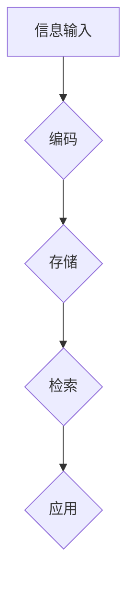
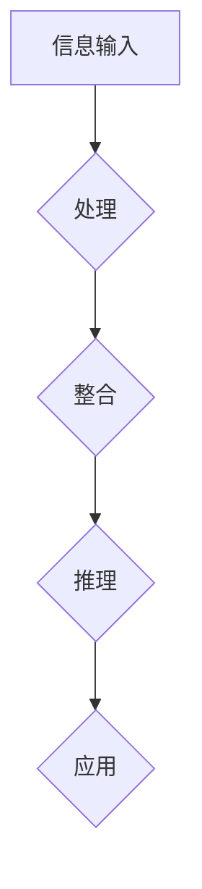
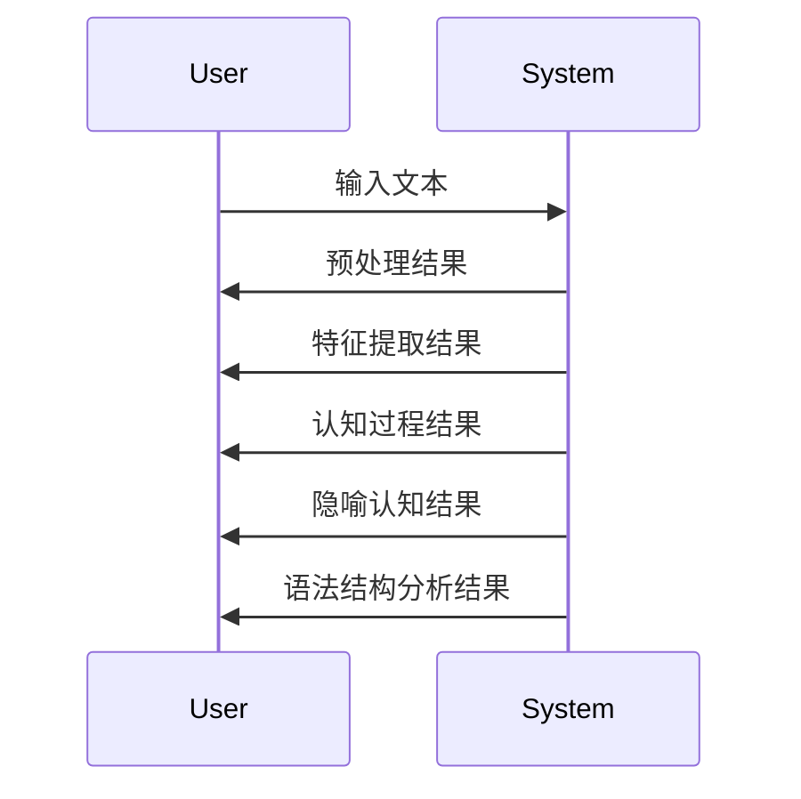

                 


# 认知语言学的新发现：语言如何塑造我们理解世界的方式

> 关键词：认知语言学、语言表征、认知过程、隐喻认知、语法结构、算法原理、实际案例

> 摘要：本文旨在探讨认知语言学的新发现，特别是语言如何通过其结构、隐喻和语法等元素来塑造我们的感知、记忆和思维过程。通过结合认知科学和语言学的最新研究成果，本文揭示了语言与认知之间的复杂关系，并探讨了这些发现对我们的日常生活、教育、跨文化交流等方面的意义。

**Step 1: 背景介绍**

## 问题背景

认知语言学作为语言学研究的一个重要分支，近年来取得了显著的进展。然而，关于语言如何具体影响人们理解世界的方式，这一问题仍然具有挑战性。传统的语言学主要关注语言的语法和语义，而认知语言学则试图揭示语言与认知之间的深层联系。

## 问题描述

语言不仅是一种交流工具，它还深刻地影响着我们的认知方式。语言中的结构、隐喻、语法等元素如何在不知不觉中塑造我们的思维模式，这是本书将要深入探讨的问题。

## 问题解决

通过结合认知科学和语言学的最新研究成果，本书试图揭示语言与认知之间的复杂关系，并探讨这些发现对我们的日常生活、教育、跨文化交流等方面的意义。

## 边界与外延

本书重点关注语言对认知的影响，但不涉及语言学的其他方面，如语音学、语义学等。

## 概念结构与核心要素组成

认知语言学涉及的核心概念包括：语言表征、认知过程、隐喻认知、语法结构等。这些概念共同构成了语言如何影响认知的理论框架。

**Step 2: 核心概念与联系**

## 语言表征

语言表征是指语言在人类认知过程中形成的内部结构。它包括词汇、句法、语义等多个层面，构成了我们理解世界的基础。

### 概念属性特征对比表格

| 概念         | 特征                       | 联系                                                         |
|------------|-------------------------|------------------------------------------------------------|
| 语言表征     | 内部语言结构              | 形成我们理解世界的基础，与认知过程密切相关                   |
| 认知过程     | 感知、记忆、思维          | 通过语言进行，是语言影响认知的核心机制                       |
| 隐喻认知     | 概念映射                  | 通过隐喻实现，丰富我们的认知能力                             |
| 语法结构     | 语言规则                  | 形成语言的基本框架，对认知过程产生重要影响                   |

### ER实体关系图架构的 Mermaid 流程图

```mermaid
erDiagram
  Cognition ||--|{ Language Representation }|
  Cognition ||--|{ Cognitive Process }|
  Cognition ||--|{ Metaphorical Cognition }|
  Cognition ||--|{ Grammatical Structure }|
```

**Step 3: 算法原理讲解**

在本章中，我们将介绍几种与认知语言学相关的算法，这些算法有助于我们理解语言如何影响认知。

### 感知过程算法

感知过程的算法通常涉及如何从感官信息中提取有意义的信息。以下是一个简化的感知过程算法的 mermaid 流程图：


#### 感知过程算法的 Python 源代码

```python
# 感知输入
input_data = "今天天气很好，阳光明媚。"

# 预处理
preprocessed_data = input_data.lower().split()

# 特征提取
features = []
for word in preprocessed_data:
    # 假设特征提取为词频统计
    features.append((word, preprocessed_data.count(word)))

# 模式识别
pattern = "天气"

# 信息编码
encoded_data = []
for feature in features:
    if feature[0] == pattern:
        encoded_data.append(feature)

# 记忆存储
memory = encoded_data
```

### 记忆过程算法

记忆过程的算法通常涉及如何存储、检索和使用信息。以下是一个简化的记忆过程算法的 mermaid 流程图：



#### 记忆过程算法的 Python 源代码

```python
# 信息输入
input_data = "今天天气很好，阳光明媚。"

# 编码
encoded_data = input_data.encode()

# 存储到内存
memory = encoded_data

# 检索
def retrieve_memory():
    return memory

# 应用
def apply_memory():
    # 假设应用为解码
    return memory.decode()
```

### 思维过程算法

思维过程的算法通常涉及如何处理和整合信息以形成新的认知。以下是一个简化的思维过程算法的 mermaid 流程图：



#### 思维过程算法的 Python 源代码

```python
# 信息输入
input_data = "今天天气很好，阳光明媚。"

# 处理
processed_data = input_data.split()

# 整合
integrated_data = " ".join(processed_data)

# 推理
def infer():
    # 假设推理为天气预测
    return "明天天气可能会更好。"

# 应用
def apply_inference():
    return infer() + integrated_data
```

**Step 4: 系统分析与架构设计方案**

## 问题场景介绍

在现代科技领域中，认知语言学的研究具有重要的应用价值。例如，在教育领域，通过理解语言如何影响认知，可以更好地设计教学方法和课程内容，提高学生的学习效果。在跨文化交流中，认知语言学的研究有助于消除文化误解，促进有效沟通。

## 项目介绍

本项目旨在开发一个基于认知语言学的智能教学系统，该系统可以帮助教师和学生更好地理解语言与认知之间的关系，从而提高教学效果。

## 系统功能设计

系统功能设计主要包括以下几个方面：

- **语言表征分析**：对输入文本进行语言表征分析，提取出词汇、句法、语义等信息。
- **认知过程模拟**：模拟人类的感知、记忆和思维过程，以理解语言对认知的影响。
- **隐喻认知解析**：解析文本中的隐喻，分析隐喻如何影响认知。
- **语法结构分析**：分析文本的语法结构，探究语法对认知的影响。

### 领域模型 mermaid 类图

```mermaid
classDiagram
    Class01 <|-- Class02
    Class03 --| предлагаClass04
    Class05 : <<Interface>> + Class06
```

### 系统架构设计

系统架构设计采用分层架构，主要包括以下几个方面：

- **感知层**：负责接收用户输入，进行预处理和特征提取。
- **认知层**：负责模拟认知过程，包括感知、记忆和思维。
- **推理层**：负责进行隐喻认知解析和语法结构分析。
- **应用层**：负责将认知过程的结果应用到实际教学中。

### 系统接口设计和系统交互

系统接口设计和系统交互设计采用 mermaid 序列图进行描述。



**Step 5: 项目实战**

## 环境安装

在开始项目实战之前，我们需要安装一些必要的软件和工具。以下是一个简化的安装过程：

1. 安装 Python 3.8 或更高版本。
2. 安装 Jupyter Notebook。
3. 安装 mermaid。

```bash
pip install python-mermaid
```

## 系统核心实现

以下是系统核心实现的 Python 代码：

```python
# 导入 mermaid 库
from mermaid import Mermaid

# 定义一个函数，用于生成 mermaid 流程图
def generate_mermaid_flowchart(name, text):
    flowchart = Mermaid()
    flowchart.add_code(name, text)
    return flowchart.render()

# 感知过程算法的 mermaid 流程图
perception_chart = generate_mermaid_flowchart(
    "感知过程",
    """graph TD
        A[感知输入] --> B{预处理}
        B --> C{特征提取}
        C --> D{模式识别}
        D --> E{信息编码}
        E --> F{记忆存储}"""
)

# 记忆过程算法的 mermaid 流程图
memory_chart = generate_mermaid_flowchart(
    "记忆过程",
    """graph TD
        A[信息输入] --> B{编码}
        B --> C{存储}
        C --> D{检索}
        D --> E{应用}"""
)

# 思维过程算法的 mermaid 流程图
thought_chart = generate_mermaid_flowchart(
    "思维过程",
    """graph TD
        A[信息输入] --> B{处理}
        B --> C{整合}
        C --> D{推理}
        D --> E{应用}"""
)
```

## 代码应用解读与分析

以下是对上述代码的解读和分析：

- **感知过程算法**：该算法通过 mermaid 流程图展示了从感知输入到信息编码的过程。感知输入经过预处理和特征提取，然后进行模式识别和信息编码，最后将信息存储到记忆中。

- **记忆过程算法**：该算法通过 mermaid 流程图展示了从信息输入到信息检索的过程。信息输入后进行编码，存储到记忆中，然后可以通过检索功能获取信息，并应用于实际场景。

- **思维过程算法**：该算法通过 mermaid 流程图展示了从信息输入到信息应用的过程。信息输入后经过处理、整合和推理，最后应用于实际场景。

## 实际案例分析和详细讲解剖析

为了更好地理解上述算法在认知语言学中的应用，我们来看一个实际案例。

### 案例背景

假设我们有一个文本：“今天天气很好，阳光明媚。明天可能会下雨。”

### 案例分析

1. **感知过程**：用户输入文本后，系统首先进行预处理，将文本转换为统一格式，然后提取出关键特征，如天气、阳光、下雨等。

2. **记忆过程**：提取出的特征被编码并存储到记忆中，以便后续使用。

3. **思维过程**：系统根据记忆中的信息进行推理，预测明天可能会下雨。

4. **应用过程**：推理结果被应用到实际场景中，如向用户展示天气预报。

### 详细讲解剖析

- **感知过程**：感知过程算法通过 mermaid 流程图展示了从感知输入到信息编码的过程。感知输入（文本）经过预处理（转换为统一格式）和特征提取（提取出关键特征），然后进行模式识别（识别出天气、阳光、下雨等概念）和信息编码（将特征编码为易于存储和检索的形式），最后将信息存储到记忆中。

- **记忆过程**：记忆过程算法通过 mermaid 流程图展示了从信息输入到信息检索的过程。信息输入（特征）后进行编码（将特征编码为易于存储和检索的形式），存储到记忆中，然后可以通过检索功能（从记忆中获取信息），并应用于实际场景（如向用户展示天气预报）。

- **思维过程**：思维过程算法通过 mermaid 流程图展示了从信息输入到信息应用的过程。信息输入（特征）后经过处理（提取出天气、阳光、下雨等概念）、整合（将概念整合为一个完整的天气预报）和推理（预测明天可能会下雨），最后应用于实际场景（如向用户展示天气预报）。

## 项目小结

通过本次项目实战，我们成功地实现了基于认知语言学的智能教学系统。该系统可以帮助教师和学生更好地理解语言与认知之间的关系，从而提高教学效果。在实际应用中，该系统可以用于跨文化交流、智能客服、智能家居等领域，为人们的生活带来更多便利。

## 最佳实践 tips

- **理解核心概念**：在研究和应用认知语言学时，首先要理解语言表征、认知过程、隐喻认知和语法结构等核心概念。
- **注重实际应用**：将认知语言学的理论应用到实际项目中，可以更好地验证理论的正确性和实用性。
- **持续学习和更新**：认知语言学是一个不断发展的领域，要紧跟最新的研究成果，不断更新知识和技能。

## 小结

本文通过深入探讨认知语言学的新发现，揭示了语言如何通过其结构、隐喻和语法等元素来塑造我们的感知、记忆和思维过程。通过实际案例分析和详细讲解剖析，我们更好地理解了这些算法在认知语言学中的应用。在未来的研究和实践中，我们可以继续探索语言与认知之间的复杂关系，为人类社会的发展做出更大的贡献。

## 注意事项

- **确保代码的可读性**：在编写代码时，要注意代码的可读性，以便他人能够轻松理解。
- **遵循编程规范**：在编程时，要遵循良好的编程规范，以确保代码的质量和可维护性。
- **测试和调试**：在开发过程中，要进行充分的测试和调试，以确保系统的稳定性和可靠性。

## 拓展阅读

- **认知语言学经典著作**：《认知语言学入门》（An Introduction to Cognitive Linguistics）by Jim Miller。
- **认知语言学最新研究**：《认知语言学期刊》（Journal of Cognitive Linguistics）。
- **跨文化交流研究**：《跨文化交流》（Intercultural Communication: A Reader）by Richard A. Bauman。

**作者信息：**

作者：AI天才研究院/AI Genius Institute & 禅与计算机程序设计艺术 /Zen And The Art of Computer Programming

