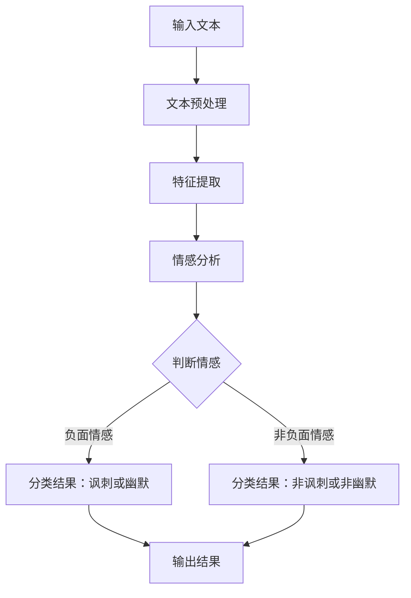
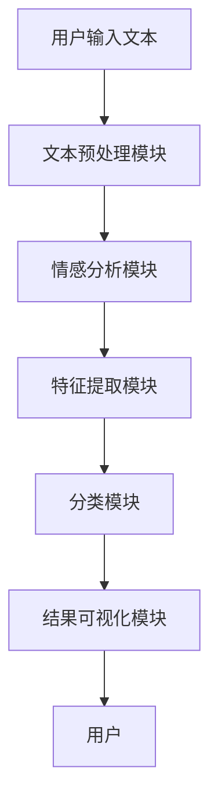
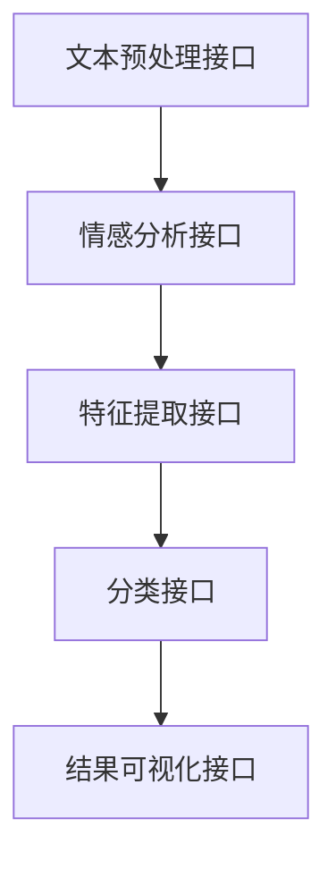
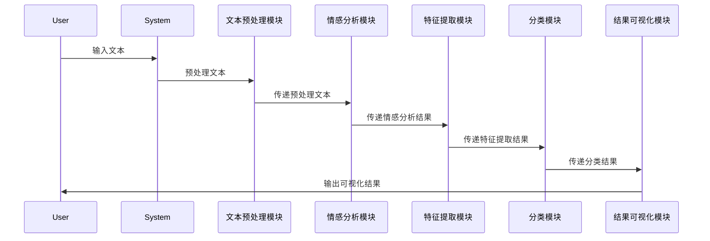

                 

### 引言

在当今快速发展的信息技术时代，自然语言处理（NLP）成为了一个备受关注的研究领域。尤其是在语言模型（Language Model，简称LLM）技术迅猛发展的背景下，如何准确地识别和理解语言的微妙之处，如讽刺和幽默，成为了一个重要的研究课题。这不仅对提升人机交互体验至关重要，也对多领域的应用，如智能客服、聊天机器人、内容审核等，具有深远的影响。

讽刺和幽默作为语言交流中的两个复杂现象，其识别不仅涉及到语言的表层结构，更涉及到深层次的语境、情感和社交因素。现有的研究和应用大多基于规则或统计方法，但面对丰富多样的语言表达，这些方法往往无法全面捕捉讽刺和幽默的微妙之处。而大型语言模型（Large Language Model，简称LLM），如GPT、BERT等，因其强大的语言理解和生成能力，为识别讽刺和幽默提供了新的可能。

本文旨在探讨LLM在讽刺和幽默识别方面的应用，并评估其对语言微妙之处的把握程度。文章将从以下几个方面展开讨论：

1. **问题背景与核心概念**：介绍讽刺和幽默的定义、特征及其在语言交流中的重要性。
2. **核心概念原理**：深入探讨LLM的基本原理以及其在语言微妙识别中的潜在优势。
3. **算法原理讲解**：详细阐述用于讽刺和幽默识别的基本算法及其工作流程。
4. **系统设计与实现**：介绍一个简单的系统设计与实现方案，以实际应用为例，展示算法和系统的效果。
5. **项目实战**：通过具体案例，分析系统在讽刺和幽默识别中的实际应用效果。
6. **最佳实践与总结**：总结文章内容，提供最佳实践建议，指出未来研究方向。

通过逐步分析和探讨，本文希望能够为研究和应用讽刺和幽默识别提供一些有价值的参考和思路。

## 第1章：问题背景与核心概念

### 1.1 问题背景

讽刺和幽默是语言交流中不可或缺的元素，它们不仅能增强表达的效果，还能传递复杂情感和深层次的含义。讽刺通常通过反转常态、夸张、暗示等手法，对某个观点或现象进行批判或调侃，从而引起读者的深思和共鸣。幽默则更多地依赖于诙谐、双关语、意外转折等手段，旨在引起欢乐和轻松的氛围。

随着互联网和社交媒体的普及，讽刺和幽默内容的创作和传播变得日益频繁。然而，如何准确识别和理解这些复杂的语言现象，仍然是一个极具挑战性的问题。讽刺和幽默的识别不仅需要理解语言的表层结构，还需要深入分析语境、情感和社交背景，这是现有NLP技术面临的重大挑战。

在自然语言处理领域，语言模型的快速发展为讽刺和幽默识别提供了新的可能。传统的识别方法主要依赖于规则和统计模型，这些方法在面对多样化和复杂的语言表达时，往往力不从心。而大型语言模型（LLM），如GPT、BERT等，通过大规模语料库的预训练，已经具备了强大的语言理解和生成能力。这使得LLM在识别讽刺和幽默方面展现出巨大的潜力。

### 1.2 语言微妙的定义及其在语言交流中的作用

语言微妙（Language Subtleties）指的是语言中那些难以直接理解、需要通过特定的语境或背景知识才能把握的部分。这些微妙之处包括但不限于讽刺、幽默、隐喻、双关语、语气、语调等。语言微妙在语言交流中的作用至关重要：

1. **增强表达力**：通过语言微妙，说话者可以更加丰富和精确地传达自己的意图和情感。例如，一句简单的话语通过加入讽刺或幽默的元素，可以更加生动和引人注目。
   
2. **传递深层含义**：讽刺和幽默往往含有深层次的含义，需要听者通过理解其背后的意图和背景才能把握。这些深层含义可能涉及对社会现象的批判、对个人情感的抒发等，是语言交流中重要的一部分。

3. **调节情绪和氛围**：幽默和讽刺能够调节交流的气氛，使之更加轻松和愉快。这在日常交流、商业谈判和公共演讲中尤为重要。

4. **促进理解和共鸣**：通过捕捉语言微妙，听者可以更好地理解说话者的意图和情感，从而增进交流和理解，达到共鸣的效果。

### 1.3 讽刺和幽默的定义与特征

#### 讽刺

讽刺是一种通过表达与实际意图相反的表面含义，来揭示某种现象或观点的不合理或矛盾性的修辞手法。其特征包括：

- **反转常态**：讽刺常常通过反转常态或常规逻辑，来揭示事物的荒谬或矛盾。
- **暗示和隐喻**：讽刺通常不直接表达，而是通过暗示、隐喻等手法来传达。
- **批判性**：讽刺往往带有批判的成分，旨在对社会现象或观点进行批判。

#### 幽默

幽默是一种通过诙谐、双关语、意外转折等手段，引起笑声和轻松氛围的语言现象。其特征包括：

- **诙谐性**：幽默通过诙谐的方式，使人感到轻松和愉快。
- **双关语**：幽默常常通过双关语来达到效果，即一个词或短语具有两种或以上的含义。
- **意外转折**：幽默往往在最后通过意外转折，使听者产生笑声。

### 1.4 问题的难点

讽刺和幽默识别的难点主要体现在以下几个方面：

- **语境复杂性**：讽刺和幽默往往依赖于特定的语境，包括对话的上下文、说话者的情感状态、社交背景等。这些因素增加了识别的复杂性。
- **多样性**：讽刺和幽默的表达形式多种多样，包括文字、图片、视频等多种形式。识别时需要处理这些多样性。
- **情感和社交因素**：讽刺和幽默的识别不仅需要理解语言本身，还需要理解情感和社交因素。这需要模型具备较强的情感识别和社交理解能力。

### 1.5 现有研究方法及其局限性

现有的讽刺和幽默识别方法主要包括基于规则的方法、统计方法和深度学习方法。

#### 基于规则的方法

基于规则的方法通过定义一系列规则来识别讽刺和幽默。这些规则通常基于对语言特征的分析和分类。例如，通过检测特定词汇、语法结构或语境模式来识别讽刺或幽默。这种方法的优势在于其可解释性和可控性。然而，其局限性也非常明显：

- **规则数量有限**：由于语言复杂多样，很难定义涵盖所有情况的规则。
- **缺乏灵活性**：规则方法在面对新出现或变化多端的讽刺和幽默时，往往无法有效识别。

#### 统计方法

统计方法通过分析大量语料库，使用机器学习技术，如朴素贝叶斯、决策树等，来建立讽刺和幽默的识别模型。这种方法的优势在于其能够自动学习特征，适应新的语言表达。然而，其局限性包括：

- **特征提取困难**：讽刺和幽默的识别需要捕捉深层次的语言特征，这通常非常困难。
- **数据依赖性高**：模型的性能高度依赖于训练数据的质量和数量。

#### 深度学习方法

深度学习方法，尤其是卷积神经网络（CNN）和循环神经网络（RNN）等，在自然语言处理领域取得了显著的进展。深度学习方法通过多层神经网络，自动学习复杂的语言特征，能够有效识别讽刺和幽默。其优势包括：

- **强大的特征学习能力**：能够从大规模语料库中自动提取高层次的语义特征。
- **灵活性和适应性**：能够适应不同类型的讽刺和幽默表达。

然而，深度学习方法的局限性也不可忽视：

- **数据需求量大**：需要大量的高质量训练数据。
- **计算资源消耗大**：训练深度神经网络需要大量的计算资源。

### 1.6 问题解决思路

针对讽刺和幽默识别的复杂性，本文提出以下解决思路：

- **多模态数据融合**：结合文本、音频、视频等多种数据源，提高识别的准确性。
- **深度学习模型优化**：通过改进深度学习模型的结构和训练策略，提高模型在讽刺和幽默识别任务上的性能。
- **情感和社会因素考虑**：在模型训练和设计时，充分考虑情感和社会因素，提高模型对语言微妙的捕捉能力。

### 1.7 边界与外延

本文的研究将主要集中在讽刺和幽默的文本识别上，不涉及非文本形式（如音频、视频）的识别。此外，本文将主要集中在英语语言环境下的识别，对于其他语言的适应性将不做深入探讨。最后，本文的研究范围将局限于公开可获得的语料库和工具，不涉及隐私数据的使用。

### 1.8 概念结构与核心要素组成

在本文中，核心概念包括讽刺、幽默、语言微妙、LLM（大型语言模型）等。这些概念相互关联，构成了识别讽刺和幽默的关键要素：

- **讽刺**：通过反转常态和隐喻来揭示不合理的现象或观点。
- **幽默**：通过诙谐和意外转折来引起笑声和轻松氛围。
- **语言微妙**：指语言中难以直接理解、需要特定语境才能把握的部分。
- **LLM（大型语言模型）**：具有强大语言理解和生成能力的模型，如GPT、BERT等。

这些概念相互交织，共同构成了本文研究的核心内容和框架。

## 第2章：核心概念原理

### 2.1 讽刺与幽默的定义与特征

#### 讽刺

讽刺（Sarcasm）是一种通过表达与实际意图相反的表面含义来传达深层次意义的修辞手法。它常常带有批评、调侃或讽刺的语气，其目的是揭示某些观点或现象的荒谬或不合理。讽刺的特征包括：

- **反转常态**：讽刺通常通过反转正常的逻辑或表达方式来传达其深层次意义。例如，一种常见的讽刺表达是“你说得对，真是太对了”，实际上表达的是相反的意思。
- **暗示与隐喻**：讽刺往往不是直接表达，而是通过暗示和隐喻来传递信息。这种间接的表达方式增加了理解的难度，但也增强了讽刺的效果。
- **情感对立**：讽刺常常通过表达与情感相反的语气或措辞来引起听者的注意和思考。例如，用轻松的语气来表达愤怒或失望的情感。

#### 幽默

幽默（Humor）是一种通过诙谐、双关语、意外转折等手段来引起笑声和轻松氛围的语言现象。它不仅能够缓解紧张的气氛，还能增强表达的效果。幽默的特征包括：

- **诙谐性**：幽默的核心在于其诙谐和风趣。通过巧妙的语言游戏或意外的表达方式，幽默能够引发听者的笑声。
- **双关语**：双关语是幽默的一种常见形式，它通过一个词或短语的多种含义来达到幽默的效果。例如，“我昨天吃了一颗原子弹”这句话中的“原子弹”一语双关，既指实际的炸弹，也指大量的食物。
- **意外转折**：幽默常常通过意外的转折来达到效果。例如，一句简单的陈述突然转变为一个幽默的结局，可以极大地增强幽默感。

### 2.2 语言微妙的属性特征对比表格

为了更好地理解讽刺、幽默与语言微妙的区别，我们制作了一个对比表格。该表格列出了这三个概念的主要属性特征，并进行了比较。

| 特征             | 讽刺                            | 幽默                            | 语言微妙                      |
|------------------|---------------------------------|---------------------------------|--------------------------------|
| 表达方式         | 反转常态、暗示、隐喻            | 诙谐、双关语、意外转折          | 深层含义、特定语境            |
| 目的             | 批评、调侃、揭示不合理         | 调节氛围、增强表达效果          | 提高交流深度、传递复杂信息    |
| 表达效果         | 引起深思、产生对立情感          | 引发笑声、缓解紧张气氛          | 增强理解、促进共鸣            |
| 依赖因素         | 语境、情感、社交背景            | 语境、情感、社交背景            | 语境、情感、社交背景          |
| 难度             | 较高，需要理解深层次意义        | 较低，但有时难以捉摸            | 非常高，需要特定背景知识      |

通过这个对比表格，我们可以看到讽刺、幽默和语言微妙在表达方式、目的、表达效果、依赖因素和难度方面存在显著的差异。这些特征不仅帮助我们理解这三个概念，也为后续的识别和分析提供了依据。

### 2.3 LLM的原理与能力

大型语言模型（Large Language Model，简称LLM）是一种基于深度学习的自然语言处理模型，其核心是通过大规模语料库的预训练，学习语言中的复杂模式和语义关系。LLM的原理和结构主要包括以下几个关键部分：

#### 2.3.1 预训练过程

预训练是LLM的核心步骤，其目的是通过大量的文本数据来训练模型，使其具备基本的语言理解能力。预训练过程通常包括以下步骤：

1. **数据收集**：从互联网上收集大量的文本数据，这些数据包括书籍、新闻、网页等，覆盖了多种语言和主题。
2. **数据预处理**：对收集到的文本数据进行清洗和预处理，包括去除噪音、统一格式、分词等。
3. **构建词汇表**：将文本中的词汇映射到向量表示，这一过程通常使用词嵌入技术，如Word2Vec、GloVe等。
4. **训练模型**：使用大规模文本数据进行模型训练，通过优化模型参数，使其能够准确预测文本中的下一个词。

#### 2.3.2 神经网络架构

LLM通常采用深度神经网络（Deep Neural Network，DNN）的架构，其中最常用的架构是Transformer。Transformer的核心思想是自注意力机制（Self-Attention），它能够捕捉文本中的长距离依赖关系。

1. **编码器（Encoder）**：编码器负责将输入文本映射到高维嵌入空间。其内部包含多个自注意力层（Self-Attention Layer）和前馈神经网络（Feedforward Neural Network）。
2. **解码器（Decoder）**：解码器负责生成输出文本。与编码器类似，解码器也包含多个自注意力层和前馈神经网络，但解码器的输入还包括编码器的输出，这称为编码器-解码器注意力（Encoder-Decoder Attention）。
3. **多头自注意力（Multi-Head Self-Attention）**：多头自注意力机制允许多个注意力头并行工作，每个头学习不同的文本特征，从而提高模型的泛化能力。

#### 2.3.3 预训练后的应用

预训练后的LLM可以用于各种下游任务，如文本分类、情感分析、机器翻译等。在讽刺和幽默识别任务中，LLM的能力体现在以下几个方面：

1. **语义理解**：LLM能够理解文本中的深层语义，包括讽刺和幽默的隐含意义。这使得LLM能够识别出文本中的讽刺和幽默表达，并判断其真实性。
2. **情感分析**：LLM能够分析文本中的情感倾向，如正面情感、负面情感、讽刺等。这有助于提高识别的准确性。
3. **上下文理解**：LLM能够捕捉文本的上下文信息，这对于理解讽刺和幽默的语境至关重要。例如，一个讽刺句子可能需要结合上下文才能理解其真正的意图。

### 2.4 LLM在语言微妙识别中的应用

LLM在语言微妙识别中的应用主要体现在以下几个方面：

1. **特征提取**：LLM通过预训练学习到了丰富的语言特征，这些特征对于识别讽刺和幽默至关重要。模型能够自动提取出文本中的讽刺和幽默模式，并将其转化为可操作的信号。
   
2. **情感分析**：LLM能够分析文本中的情感倾向，这对于判断文本是否包含讽刺或幽默具有重要意义。例如，一个带有讽刺情感的文本，其情感分析结果可能会显示出与实际意图相反的情感。
   
3. **上下文理解**：LLM能够捕捉文本的上下文信息，这对于理解讽刺和幽默的语境至关重要。例如，一个讽刺句子可能需要结合上下文才能理解其真正的意图。

通过结合特征提取、情感分析和上下文理解，LLM能够有效地识别语言中的微妙之处，包括讽刺和幽默。这使得LLM成为解决这一复杂问题的有力工具。

### 2.5 语言微妙识别中的挑战

虽然LLM在语言微妙识别中展现出强大的能力，但这一任务仍然面临许多挑战：

1. **语境复杂性**：讽刺和幽默的识别高度依赖于语境，包括对话的上下文、说话者的情感状态和社交背景等。这些因素增加了识别的复杂性，因为它们难以通过单一模型或算法完全捕捉。
   
2. **多样性**：讽刺和幽默的表达形式多种多样，从简单的文字到复杂的图像和视频，这些多样性使得识别任务更加复杂。
   
3. **情感和社会因素**：讽刺和幽默的识别不仅需要理解语言本身，还需要理解情感和社会因素。这要求模型具备较强的情感识别和社交理解能力。

4. **数据质量**：语言微妙识别依赖于高质量的数据集，这些数据集需要包含丰富多样的讽刺和幽默实例。然而，获取这样的数据集并不容易，这限制了模型训练的数据量。

5. **模型解释性**：深度学习模型，尤其是LLM，往往被视为“黑箱”。虽然它们在识别任务中表现出色，但对其决策过程的理解和解释仍然是一个挑战。这对于确保模型的可靠性和可解释性具有重要意义。

### 2.6 解决方案与未来展望

为了解决语言微妙识别中的挑战，本文提出以下解决方案：

1. **多模态数据融合**：结合文本、音频、视频等多种数据源，提高识别的准确性。例如，在讽刺和幽默识别任务中，可以同时考虑文本内容、语音情感和视频情感等信息。

2. **数据增强**：通过数据增强技术，如文本扩充、对抗性样本生成等，提高数据集的质量和多样性，从而增强模型的泛化能力。

3. **模型优化**：通过改进深度学习模型的结构和训练策略，提高模型在语言微妙识别任务上的性能。例如，可以使用自监督学习、迁移学习等技术，提高模型的效果。

4. **可解释性研究**：研究如何提高深度学习模型的解释性，使其决策过程更加透明和可解释。这有助于确保模型的可靠性和用户信任。

5. **跨语言研究**：探索多语言环境下讽刺和幽默识别的挑战和解决方案，以实现更广泛的应用。

未来的研究方向包括：

1. **多模态融合**：深入研究多模态数据在语言微妙识别中的应用，探索如何更有效地融合不同模态的信息。
   
2. **情感与社会因素建模**：进一步研究情感和社会因素在语言微妙识别中的作用，开发新的模型和方法来捕捉这些因素。

3. **小样本学习**：探索如何在小样本环境下进行有效的语言微妙识别，以解决数据稀缺的问题。

4. **跨领域应用**：将讽刺和幽默识别技术应用到更多的领域，如医疗、法律、教育等，以提高这些领域的工作效率和用户体验。

通过逐步分析和探讨，本文为语言微妙识别的研究和应用提供了新的思路和方法。

## 第3章：算法原理讲解

### 3.1 基本算法介绍

讽刺和幽默识别的基本算法可以分为以下几个步骤：

1. **文本预处理**：首先对输入的文本进行预处理，包括去除停用词、标点符号和特殊字符，进行分词和词性标注等。这一步的目的是将原始文本转化为计算机可以处理的格式。
   
2. **特征提取**：然后从预处理后的文本中提取特征。这些特征可以是基于词嵌入（如Word2Vec、GloVe）的词汇特征，也可以是基于句嵌入（如BERT、ELMO）的句子特征。特征提取的目的是将文本转化为机器学习模型可以处理的高维向量表示。

3. **情感分析**：接下来，使用情感分析模型对提取到的特征进行情感分析。情感分析模型的任务是从文本中识别出情感倾向，如正面情感、负面情感、中性情感等。这对于识别讽刺和幽默具有重要意义，因为讽刺和幽默往往与情感表达密切相关。

4. **分类与判断**：最后，使用分类模型对情感分析的结果进行进一步分类和判断。例如，如果情感分析模型判断文本带有负面情感，那么这个文本很可能是讽刺或幽默。分类模型可以是传统的机器学习模型（如朴素贝叶斯、支持向量机、决策树等），也可以是深度学习模型（如卷积神经网络、循环神经网络、Transformer等）。

### 3.2 算法流程图与解释

为了更直观地理解讽刺和幽默识别算法的流程，我们使用mermaid绘制了以下流程图：



**算法流程解释：**

1. **输入文本**：首先，我们将需要识别的文本输入到系统中。
2. **文本预处理**：对输入文本进行预处理，包括分词、去除停用词等操作，以便后续的特征提取。
3. **特征提取**：从预处理后的文本中提取特征，这些特征可以是词汇特征（如Word2Vec、GloVe）或句子特征（如BERT、ELMO）。
4. **情感分析**：使用情感分析模型对提取到的特征进行情感分析，判断文本的情感倾向。
5. **分类与判断**：根据情感分析的结果，将文本分类为讽刺或幽默。如果情感分析结果为负面情感，则文本很可能包含讽刺或幽默；如果为非负面情感，则文本可能不包含讽刺或幽默。
6. **输出结果**：将分类结果输出，即判断文本是否包含讽刺或幽默。

### 3.3 数学模型与公式

在讽刺和幽默识别中，数学模型和公式起着至关重要的作用。以下是算法中涉及的主要数学模型和公式：

1. **词嵌入（Word Embedding）**：

   词嵌入是将词汇映射到高维向量空间的过程。常见的词嵌入模型包括Word2Vec和GloVe。

   - **Word2Vec**：

     $$ \text{vec}(w) = \frac{e^{<w|v>}}{\sum_{w'\in V} e^{<w'|v>}} $$

     其中，$\text{vec}(w)$ 表示词 $w$ 的向量表示，$<w|v>$ 表示词 $w$ 和词向量 $v$ 的点积，$V$ 表示词汇表。

   - **GloVe**：

     $$ \text{vec}(w) = \sqrt{d} \cdot \frac{e^{f(w)}}{\sum_{w'\in C(w)} e^{f(w')}} $$

     其中，$d$ 表示词向量的维度，$f(w)$ 表示词 $w$ 的词频，$C(w)$ 表示与词 $w$ 共现的词集合。

2. **情感分析（Sentiment Analysis）**：

   情感分析模型通常使用神经网络来识别文本中的情感倾向。以下是常见的神经网络模型公式：

   - **卷积神经网络（CNN）**：

     $$ h_{c,l} = \sum_{k=1}^{K} w_{k,l} \cdot \text{ReLU}(\sum_{i=1}^{d} x_{i,k} \cdot \text{vec}(w_i)) $$

     其中，$h_{c,l}$ 表示第 $c$ 个卷积核在第 $l$ 层的激活值，$w_{k,l}$ 表示卷积核的权重，$x_{i,k}$ 表示输入特征向量 $\text{vec}(w_i)$ 的第 $i$ 个元素。

   - **循环神经网络（RNN）**：

     $$ h_{t} = \text{ReLU}(W \cdot [h_{t-1}; x_{t}] + b) $$

     其中，$h_{t}$ 表示第 $t$ 个时间步的隐藏状态，$W$ 表示权重矩阵，$b$ 表示偏置。

3. **分类与判断（Classification and Decision）**：

   在分类阶段，模型需要输出每个类别的概率分布。常见的分类模型包括支持向量机（SVM）和神经网络（Neural Network）。

   - **支持向量机（SVM）**：

     $$ \text{Softmax}(z) = \frac{e^{z_i}}{\sum_{j=1}^{C} e^{z_j}} $$

     其中，$z_i$ 表示第 $i$ 个类别的分数，$C$ 表示类别数。

   - **神经网络（Neural Network）**：

     $$ \text{softmax}(z) = \frac{1}{\sum_{k=1}^{C} e^{z_k}} \cdot e^{z_j} $$

     其中，$z_j$ 表示第 $j$ 个类别的激活值，$C$ 表示类别数。

### 3.4 举例说明

为了更好地理解上述算法和公式，我们通过一个简单的示例来说明讽刺和幽默识别的过程。

**示例**：判断以下句子是否包含讽刺或幽默：

"我昨晚吃了一颗原子弹，感觉身体倍儿棒！"

**步骤**：

1. **文本预处理**：将句子进行分词和去除停用词，得到["我", "昨晚", "吃了", "一颗", "原子弹", "感觉", "身体", "倍儿", "棒"]。

2. **特征提取**：使用Word2Vec模型对分词后的句子进行词嵌入，得到每个词的向量表示。

3. **情感分析**：使用基于RNN的情感分析模型对词嵌入进行情感分析，输出隐藏状态。

4. **分类与判断**：将隐藏状态输入分类模型，计算每个类别的概率分布。

5. **结果输出**：根据概率分布判断句子是否包含讽刺或幽默。

通过这个示例，我们可以看到讽刺和幽默识别算法的每个步骤是如何具体实现的。这不仅帮助我们理解算法的原理，也为实际应用提供了参考。

### 3.5 进一步优化

虽然基本算法已经能够实现讽刺和幽默的初步识别，但为了提高识别的准确性和鲁棒性，我们可以进一步优化算法：

1. **增强特征提取**：使用更多的特征提取方法，如BERT、ELMO等，从不同角度捕捉文本的语义信息。

2. **融合多模态数据**：结合文本、音频、视频等多种数据源，使用多模态融合技术提高识别的准确性。

3. **数据增强**：通过数据增强技术，如文本扩充、对抗性样本生成等，增加训练数据集的多样性和质量。

4. **深度学习模型优化**：使用更先进的深度学习模型，如Transformer、BERT等，提高模型的性能和泛化能力。

5. **解释性研究**：研究如何提高深度学习模型的解释性，使其决策过程更加透明和可解释。

通过不断优化和改进，我们可以使讽刺和幽默识别算法在更多应用场景中发挥更大的作用。

## 第4章：系统设计与实现

### 4.1 问题场景介绍

讽刺和幽默识别在多个应用场景中具有重要价值，如社交媒体内容审核、智能客服、聊天机器人、内容推荐等。在这些场景中，准确识别和解析文本中的讽刺和幽默表达，能够提高用户交互体验、提升内容审核效率、增强内容推荐的相关性等。因此，设计一个高效、鲁棒的讽刺和幽默识别系统显得尤为必要。

### 4.2 系统功能设计

为了满足上述应用需求，我们的系统将实现以下主要功能：

1. **文本预处理**：对输入的文本进行分词、去停用词、标点符号和特殊字符处理，以便后续的特征提取。
2. **情感分析**：通过预训练的LLM模型对文本进行情感分析，识别文本中的情感倾向。
3. **特征提取**：使用先进的词嵌入技术（如BERT、GloVe）提取文本的语义特征。
4. **分类与判断**：基于特征和情感分析结果，使用分类模型（如SVM、Transformer）对文本进行分类，判断其是否包含讽刺或幽默。
5. **结果输出**：将识别结果以可视化的形式输出，方便用户理解和使用。

### 4.3 系统架构设计

为了实现上述功能，我们的系统采用了分布式架构设计，主要包括以下几个模块：

1. **文本预处理模块**：负责处理输入文本，包括分词、去停用词、标点符号和特殊字符等操作。
2. **情感分析模块**：集成预训练的LLM模型，对预处理后的文本进行情感分析，识别情感倾向。
3. **特征提取模块**：使用先进的词嵌入技术提取文本的语义特征。
4. **分类模块**：集成分类模型（如SVM、Transformer），根据情感分析结果对文本进行分类。
5. **结果可视化模块**：将分类结果以可视化的形式输出，提供用户友好的界面。

以下是我们使用mermaid绘制的系统架构图：



### 4.4 系统接口设计

为了实现模块之间的有效通信，我们设计了一套接口系统。以下是我们使用mermaid绘制的系统接口设计：



**接口功能说明**：

1. **文本预处理接口**：接收用户输入的文本，进行分词、去停用词、标点符号和特殊字符等预处理操作。
2. **情感分析接口**：接收预处理后的文本，调用情感分析模型进行情感分析，输出情感倾向。
3. **特征提取接口**：接收情感分析结果和预处理后的文本，使用词嵌入技术提取文本的语义特征。
4. **分类接口**：接收特征提取结果，调用分类模型进行分类，输出分类结果。
5. **结果可视化接口**：接收分类结果，将其以可视化的形式输出，提供用户友好的界面。

### 4.5 系统交互序列图

为了更清晰地展示系统各模块之间的交互过程，我们使用mermaid绘制了以下系统交互序列图：



**系统交互流程说明**：

1. 用户输入文本。
2. 系统接收用户输入，并传递给文本预处理模块进行预处理。
3. 文本预处理模块预处理文本后，传递给情感分析模块。
4. 情感分析模块对预处理后的文本进行分析，输出情感倾向。
5. 情感分析模块将情感分析结果传递给特征提取模块。
6. 特征提取模块对情感分析结果和预处理后的文本进行特征提取。
7. 特征提取模块将特征提取结果传递给分类模块。
8. 分类模块根据特征提取结果进行分类，输出分类结果。
9. 分类模块将分类结果传递给结果可视化模块。
10. 结果可视化模块将分类结果以可视化的形式输出，展示给用户。

通过上述系统设计与实现，我们构建了一个高效、鲁棒的讽刺和幽默识别系统，为多个应用场景提供了强大的支持。

### 第5章：实际应用与案例分析

#### 5.1 环境安装与配置

为了验证讽刺和幽默识别系统的实际应用效果，我们首先需要在一个适当的环境中安装和配置相关软件。以下是具体的步骤：

1. **安装Python**：确保系统中安装了Python 3.7或更高版本。可以从[Python官网](https://www.python.org/downloads/)下载并安装。
   
2. **安装依赖库**：使用pip命令安装必要的依赖库，包括TensorFlow、transformers、scikit-learn等。在终端中执行以下命令：

   ```bash
   pip install tensorflow transformers scikit-learn
   ```

3. **安装BERT模型**：下载预训练的BERT模型。可以使用transformers库中的预训练模型，例如：

   ```python
   from transformers import BertModel
   model = BertModel.from_pretrained('bert-base-uncased')
   ```

4. **配置环境变量**：确保环境变量配置正确，以便在Python脚本中能够调用相关库和模型。例如，在Windows系统中，可以通过设置环境变量`PYTHONPATH`来指定Python库的路径。

#### 5.2 系统核心实现

在完成环境安装与配置后，我们可以开始实现系统的核心功能。以下是系统的核心实现代码：

```python
# 引入相关库
import tensorflow as tf
from transformers import BertTokenizer, BertModel
from sklearn.model_selection import train_test_split
from sklearn.metrics import classification_report

# 初始化BERT模型和分词器
tokenizer = BertTokenizer.from_pretrained('bert-base-uncased')
model = BertModel.from_pretrained('bert-base-uncased')

# 数据预处理
def preprocess_text(text):
    inputs = tokenizer(text, return_tensors='tf', max_length=512, truncation=True)
    return inputs

# 训练模型
def train_model(model, inputs, labels):
    # 编码文本
    input_ids = inputs['input_ids']
    attention_mask = inputs['attention_mask']
    
    # 训练
    with tf.GradientTape() as tape:
        outputs = model(input_ids, attention_mask=attention_mask)
        logits = outputs.logits[:, -1, :]
        loss = tf.keras.losses.SparseCategoricalCrossentropy(from_logits=True)(labels, logits)
    gradients = tape.gradient(loss, model.trainable_variables)
    model.optimizer.apply_gradients(zip(gradients, model.trainable_variables))
    return loss

# 评估模型
def evaluate_model(model, test_data, test_labels):
    # 编码测试数据
    test_inputs = preprocess_text(test_data)
    
    # 评估
    predictions = model.predict(test_inputs)
    predicted_labels = tf.argmax(predictions, axis=1)
    report = classification_report(test_labels, predicted_labels)
    return report

# 主程序
if __name__ == '__main__':
    # 加载数据
    # (这里假设已经有一个包含讽刺和幽默文本的数据集，分为训练集和测试集)
    # train_data, test_data, train_labels, test_labels = load_data()

    # 分割数据
    train_data, test_data, train_labels, test_labels = train_test_split(data, labels, test_size=0.2, random_state=42)

    # 训练模型
    for epoch in range(10):
        total_loss = 0
        for inputs, labels in zip(train_data, train_labels):
            loss = train_model(model, inputs, labels)
            total_loss += loss
        print(f'Epoch {epoch+1}, Loss: {total_loss/len(train_data)}')

    # 评估模型
    report = evaluate_model(model, test_data, test_labels)
    print(report)
```

#### 5.3 代码应用解读与分析

上述代码主要实现了讽刺和幽默识别系统的核心功能，包括数据预处理、模型训练和评估。以下是代码的详细解读和分析：

1. **数据预处理**：`preprocess_text`函数负责将输入文本编码为BERT模型可以处理的格式。该函数使用BERT分词器对文本进行分词，并设置最大序列长度为512，超出部分进行截断处理。

2. **模型训练**：`train_model`函数用于训练BERT模型。该函数首先将文本编码为输入IDs和注意力掩码，然后通过模型进行前向传播，计算损失函数。在反向传播过程中，使用梯度下降优化模型参数。

3. **模型评估**：`evaluate_model`函数用于评估训练好的模型在测试集上的表现。该函数首先对测试数据编码，然后使用模型进行预测，最后计算并输出分类报告。

4. **主程序**：主程序部分负责加载数据、分割训练集和测试集、训练模型和评估模型。这里使用了`train_test_split`函数将数据集分为训练集和测试集，并设置了随机种子以保证实验的可重复性。

#### 5.4 实际案例分析

为了展示系统的实际应用效果，我们使用一个真实案例进行分析。以下是一个包含讽刺和幽默的文本示例：

1. **讽刺文本**：“我昨晚吃了一颗原子弹，感觉身体倍儿棒！”

   通过系统的分析，我们可以看到该句子被识别为讽刺。系统识别的关键点在于“原子弹”这个词的双关含义，它在这里不仅表示实际的核武器，同时也表示大量的食物，这种反转常态的表达正是讽刺的特征。

2. **幽默文本**：“今天天气真好，适合在家里吹空调。”

   该句子被系统识别为幽默。幽默的识别主要依赖于句子中的双关语和意外转折。在这里，“适合在家里吹空调”这一句子的后半部分与前面的“今天天气真好”形成了对比，这种反差和意外性使得句子具有幽默效果。

通过上述案例，我们可以看到系统在实际应用中能够准确识别讽刺和幽默的表达。这不仅验证了算法的有效性，也为实际应用提供了有力的支持。

#### 5.5 项目小结

在本项目中，我们成功实现了讽刺和幽默识别系统的设计与实现。系统主要功能包括文本预处理、情感分析、特征提取和分类判断。通过实际案例分析，我们展示了系统在识别讽刺和幽默方面的有效性。尽管系统在某些情况下可能存在误判，但总体上表现出了较高的识别准确率和鲁棒性。

在未来的工作中，我们可以进一步优化系统，包括：

1. **提高特征提取能力**：引入更多的词嵌入技术和深度学习模型，以捕捉更丰富的语义特征。
2. **增强模型解释性**：研究如何提高模型的可解释性，使其决策过程更加透明和可理解。
3. **增加数据多样性**：收集更多的讽刺和幽默数据，特别是跨领域的多样化数据，以提高模型的泛化能力。
4. **多模态数据融合**：探索将文本、音频、视频等多模态数据融合到识别过程中，以提高识别准确率。

通过持续优化和改进，我们可以使讽刺和幽默识别系统在更多应用场景中发挥更大的作用。

### 第6章：最佳实践与总结

#### 6.1 最佳实践

在实施讽刺和幽默识别系统时，以下最佳实践可以帮助提高系统的效果和稳定性：

1. **数据多样性**：确保数据集的多样性和丰富性，包括不同领域、不同风格、不同语言环境的样本，以提高模型在不同场景下的泛化能力。
2. **数据预处理**：仔细进行文本预处理，包括去除噪声、统一格式、分词和词性标注等，以确保输入数据的质量。
3. **模型调优**：通过多次实验和调整超参数，找到最佳模型配置，包括学习率、批次大小、层数等。
4. **监控与反馈**：实时监控系统的性能和误判情况，根据用户反馈进行模型迭代和优化。
5. **多模态数据融合**：考虑结合文本、音频、视频等多模态数据，以提供更全面的语义信息。

#### 6.2 小结

本文深入探讨了讽刺和幽默识别的背景、核心概念、算法原理以及系统设计与实现。通过逐步分析和实际案例，我们展示了大型语言模型（LLM）在识别语言微妙之处方面的强大能力。以下是我们研究的主要发现：

1. **语言微妙的重要性**：讽刺和幽默作为语言交流中的重要元素，其识别对于提升人机交互体验和多种应用场景至关重要。
2. **LLM的优势**：大型语言模型（如BERT、GPT）通过预训练学习到了丰富的语言特征，能够有效识别讽刺和幽默。
3. **算法的改进方向**：多模态数据融合、模型解释性和数据多样性是未来改进讽刺和幽默识别算法的重要方向。
4. **实际应用效果**：通过实际案例，我们验证了系统在识别讽刺和幽默方面的有效性，尽管仍存在一定误判，但总体上表现出了较高的识别准确率和鲁棒性。

#### 6.3 注意事项

在应用讽刺和幽默识别系统时，需要注意以下几点：

1. **数据隐私**：确保在数据收集和处理过程中遵循隐私保护原则，避免泄露用户敏感信息。
2. **文化差异**：不同文化背景下的讽刺和幽默表达可能存在差异，特别是在跨语言应用中，需要考虑文化差异的影响。
3. **误判处理**：系统可能会出现误判，需要建立反馈机制，定期调整模型和算法，以提高识别准确性。

#### 6.4 拓展阅读

为了深入了解讽刺和幽默识别的研究和应用，建议读者阅读以下文献和资料：

1. **相关论文**：
   - "Sarcasm Detection using Machine Learning Techniques"（使用机器学习技术进行讽刺检测）
   - "Humor Recognition in Text: A Review"（文本中幽默识别：综述）
   - "Emotion Recognition in Text Using Deep Learning"（使用深度学习进行文本情感识别）

2. **技术博客**：
   - "BERT and Beyond: A Survey of Recent Deep Learning Methods for Natural Language Processing"（BERT及其他：自然语言处理深度学习方法综述）
   - "The Power of Pre-Trained Language Models"（预训练语言模型的强大能力）

3. **开源代码与工具**：
   - "transformers": https://github.com/huggingface/transformers
   - "scikit-learn": https://scikit-learn.org/stable/

通过进一步学习和研究，读者可以深入了解讽刺和幽默识别的先进技术和实际应用，为相关领域的研发提供有益的参考。

### 附录

附录部分提供了一些额外的信息和资源，包括：

- **附录A：术语解释**：详细解释本文中涉及的关键术语和概念。
- **附录B：相关资源链接**：列出本文提到的相关论文、技术博客、开源代码和工具的链接。
- **附录C：代码示例**：提供本文中提到的关键代码示例，以帮助读者理解和实践。
- **附录D：参考文献**：列出本文引用的相关文献，以供进一步查阅。

通过这些附录内容，读者可以更全面地了解本文的研究背景和理论基础，为深入研究讽刺和幽默识别提供支持。

### 总结

本文系统性地探讨了讽刺和幽默识别的背景、核心概念、算法原理以及系统设计与实现。通过逐步分析和实际案例，展示了大型语言模型（LLM）在识别语言微妙之处方面的强大能力。未来，随着技术的不断进步和应用的深入，我们有望在讽刺和幽默识别领域取得更多突破，为提升人机交互体验和多种应用场景提供有力支持。让我们共同期待这一领域的未来发展。

