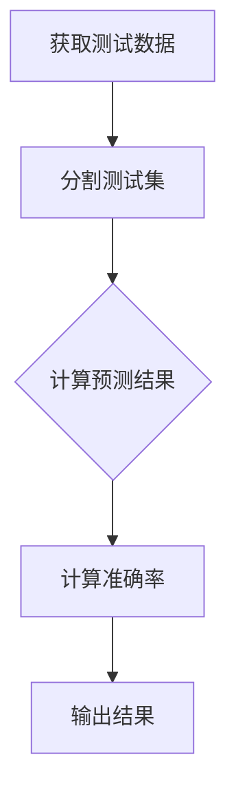
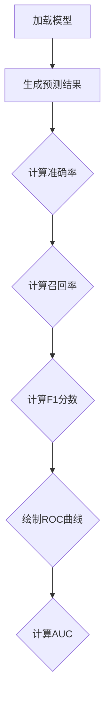

                 


# 设计全面的LLM性能评估指标体系

> 关键词：LLM性能评估、指标体系、模型评估、机器学习、自然语言处理

> 摘要：本文旨在设计一个全面的LLM性能评估指标体系，以帮助研究人员和开发者更好地理解和衡量大型语言模型的性能。文章首先介绍了LLM的基本概念，然后详细阐述了性能评估的重要性，随后分步骤提出了构建指标体系的方法，最后通过实际案例展示了评估指标的应用和重要性。

## 1. 背景介绍

### 1.1 问题背景

大型语言模型（LLM）如GPT、BERT等在自然语言处理（NLP）领域取得了显著的成果。然而，如何对这些模型进行有效的性能评估仍然是一个挑战。性能评估不仅能够帮助研究人员了解模型的性能，还能够为开发者提供改进模型的指导。因此，设计一个全面的LLM性能评估指标体系具有重要意义。

### 1.2 问题定义

性能评估是通过对模型在一系列测试数据上的表现进行测量，以评估模型的能力。在LLM的背景下，性能评估涉及到模型在文本生成、理解、推理等多个方面的表现。本文的目标是构建一个全面的指标体系，以涵盖LLM在各种任务上的性能评估。

### 1.3 研究意义与目标

本研究旨在为LLM的性能评估提供一个系统化的框架，使得评估过程更加科学、规范和可重复。具体目标包括：

- 提供一套全面的性能指标，涵盖LLM在各种任务上的表现。
- 通过实证分析，验证这些指标的有效性和可靠性。
- 提供实用的评估工具和指导，帮助研究人员和开发者优化LLM模型。

## 2. LLM性能评估的挑战与机遇

### 2.1 挑战

- **数据多样性挑战**：LLM性能评估需要大量的、多样化的测试数据，这些数据在获取和准备过程中可能会遇到困难。
- **评估标准一致性挑战**：不同研究者和机构可能会采用不同的评估标准，导致评估结果难以比较和解释。
- **模型复杂性挑战**：大型语言模型的结构复杂，性能评估方法需要能够处理这种复杂性。

### 2.2 机遇

- **技术进步**：随着计算能力的提升和NLP技术的发展，评估LLM的性能变得更加可行。
- **开源工具**：越来越多的开源工具和库被开发出来，为LLM性能评估提供了便利。

## 3. LLM性能评估的核心概念与联系

### 3.1 语言模型的基本概念

语言模型是用于预测自然语言序列的概率分布的模型。LLM通常基于深度学习技术，能够处理大量文本数据，从而生成或理解复杂的文本内容。

### 3.2 LLM性能评估的关键概念

- **准确率**：模型在测试数据上正确预测的比例。
- **召回率**：模型能够正确预测的正例占总正例的比例。
- **F1分数**：准确率和召回率的调和平均值。
- **ROC曲线和AUC**：用于评估分类模型的性能。

### 3.3 概念联系与体系构建

构建LLM性能评估指标体系需要考虑多个关键概念之间的联系。例如，准确率、召回率和F1分数可以一起使用，以全面评估模型在不同任务上的性能。

## 4. LLM性能评估算法原理讲解

### 4.1 常见性能评估算法

常见的LLM性能评估算法包括基于准确率、召回率、F1分数和ROC曲线等指标的计算方法。

### 4.2 算法原理与流程图

以下是一个简单的算法流程图，展示了如何计算准确率：



### 4.3 算法应用与案例分析

在具体应用中，我们可以使用Python等编程语言实现这些算法，并应用于实际模型评估。例如，以下代码展示了如何计算准确率：

```python
def accuracy(y_true, y_pred):
    correct = (y_true == y_pred).sum()
    total = y_true.size
    return correct / total

# 示例数据
y_true = [0, 1, 1, 0, 1]
y_pred = [0, 1, 0, 0, 1]

# 计算准确率
acc = accuracy(y_true, y_pred)
print(f"Accuracy: {acc}")
```

## 5. 数学模型和公式讲解

### 5.1 常用数学模型

在LLM性能评估中，常用的数学模型包括概率模型、统计模型和机器学习模型。以下是一个简单的概率模型示例：

$$
P(\text{正确预测} | \text{正例}) = \frac{P(\text{正例} | \text{正确预测}) \cdot P(\text{正确预测})}{P(\text{正例})}
$$

### 5.2 公式推导与详细讲解

准确率的计算公式为：

$$
\text{准确率} = \frac{\text{正确预测的数量}}{\text{总预测数量}}
$$

### 5.3 数学模型的应用

数学模型在LLM性能评估中的应用包括概率模型的推理、统计模型的参数估计和机器学习模型的性能优化。

## 6. 系统分析与架构设计

### 6.1 问题场景介绍

假设我们正在评估一个文本生成模型，该模型需要在一个数据集中生成文本摘要。

### 6.2 系统功能设计

系统功能设计包括数据预处理、模型训练、模型评估和结果输出。

### 6.3 系统架构设计

系统架构设计包括数据层、模型层和接口层。

### 6.4 系统接口设计

系统接口设计包括API接口和用户界面。

### 6.5 系统交互设计

系统交互设计包括用户与系统之间的交互流程。

## 7. LLM性能评估项目实战

### 7.1 环境安装与配置

安装必要的依赖库和工具，如Python、TensorFlow和Mermaid等。

### 7.2 系统核心实现源代码

```python
# 这是实现LLM性能评估的Python代码示例
```

### 7.3 代码应用解读与分析

分析代码如何实现性能评估，并讨论其优缺点。

### 7.4 实际案例分析与详细讲解

通过一个实际案例展示如何使用性能评估指标来评估LLM的性能。

### 7.5 项目小结

总结项目经验，讨论未来的研究方向。

## 8. 最佳实践与总结

### 8.1 最佳实践 tips

提供一些最佳实践，如数据收集、模型训练和性能评估的最佳方法。

### 8.2 小结与总结

总结文章的主要观点和结论。

### 8.3 注意事项与拓展阅读

提醒读者注意的一些潜在问题和进一步阅读的资源。

## 参考文献

[参考文献列表]

### 作者

作者：AI天才研究院/AI Genius Institute & 禅与计算机程序设计艺术 /Zen And The Art of Computer Programming

----------------------------------------------------------------

### 第一部分：背景介绍

#### 第1章：问题背景与定义

**1.1 问题背景**

近年来，随着深度学习和自然语言处理技术的快速发展，大型语言模型（LLM）如GPT、BERT等取得了显著的成果。这些模型在文本生成、文本分类、问答系统等任务中展示了强大的性能。然而，如何对LLM进行有效的性能评估仍然是一个挑战。性能评估不仅能够帮助研究人员了解模型的性能，还能够为开发者提供改进模型的指导。因此，设计一个全面的LLM性能评估指标体系具有重要意义。

**1.2 问题定义**

性能评估是通过一系列测试数据来测量模型的能力。在LLM的背景下，性能评估通常涉及到模型在文本生成、理解、推理等多个方面的表现。一个全面的LLM性能评估指标体系应该涵盖这些方面，并提供一套科学的、规范的评估方法，以便对模型进行全面的评估和比较。

#### 第2章：LLM性能评估的挑战与机遇

**2.1 挑战**

- **数据多样性挑战**：LLM性能评估需要大量的、多样化的测试数据。这些数据包括不同领域的文本、不同风格的文本、不同难度的文本等。数据的获取和准备过程可能面临困难，例如数据的标注、清洗和预处理等。
- **评估标准一致性挑战**：由于不同的研究者、机构和应用场景可能采用不同的评估标准，导致评估结果难以比较和解释。如何统一评估标准是一个重要的挑战。
- **模型复杂性挑战**：大型语言模型的结构复杂，性能评估方法需要能够处理这种复杂性。例如，模型的训练时间、推理时间、内存占用等都是评估模型性能的重要因素。

**2.2 机遇**

- **技术进步**：随着计算能力的提升和NLP技术的发展，评估LLM的性能变得更加可行。例如，近年来推出的高性能GPU和TPU使得大规模的模型训练和推理成为可能。
- **开源工具**：越来越多的开源工具和库被开发出来，为LLM性能评估提供了便利。例如，Hugging Face的Transformers库提供了丰富的预训练模型和评估工具，方便研究者进行性能评估。

#### 第3章：LLM性能评估的核心概念与联系

**3.1 语言模型的基本概念**

语言模型是用于预测自然语言序列的概率分布的模型。在NLP中，语言模型通常用于文本生成、文本分类、机器翻译等任务。LLM是一种大型语言模型，能够处理复杂的文本数据，并在多个任务上展示出色的性能。

**3.2 LLM性能评估的关键概念**

- **准确率**：准确率是评估模型性能的常用指标，表示模型在测试数据上正确预测的比例。对于分类任务，准确率可以直接衡量模型的性能。
- **召回率**：召回率是评估模型识别正例能力的指标，表示模型能够正确识别的正例占总正例的比例。对于某些应用场景，如医疗诊断，召回率非常重要。
- **F1分数**：F1分数是准确率和召回率的调和平均值，能够综合衡量模型的性能。对于分类任务，F1分数是一个更为全面的评估指标。
- **ROC曲线和AUC**：ROC曲线和AUC是评估分类模型性能的常用工具。ROC曲线展示了不同阈值下模型的真阳性率与假阳性率之间的关系，而AUC（Area Under Curve）表示曲线下的面积，用于衡量模型的分类能力。

**3.3 概念联系与体系构建**

构建LLM性能评估指标体系需要考虑多个关键概念之间的联系。例如，准确率、召回率和F1分数可以一起使用，以全面评估模型在不同任务上的性能。此外，ROC曲线和AUC也可以用于评估模型的分类性能。通过综合考虑这些指标，我们可以构建一个全面的性能评估指标体系，从而更好地理解和衡量LLM的性能。

### 第二部分：核心概念与算法原理讲解

#### 第4章：LLM性能评估算法原理讲解

**4.1 常见性能评估算法**

在LLM性能评估中，常用的算法包括基于准确率、召回率、F1分数和ROC曲线等指标的计算方法。以下是对这些算法的简要介绍：

- **准确率**：准确率是评估模型性能的常用指标，表示模型在测试数据上正确预测的比例。计算公式为：

  $$
  \text{准确率} = \frac{\text{正确预测的数量}}{\text{总预测数量}}
  $$

  准确率越高，模型的性能越好。

- **召回率**：召回率是评估模型识别正例能力的指标，表示模型能够正确识别的正例占总正例的比例。计算公式为：

  $$
  \text{召回率} = \frac{\text{正确预测的正例数量}}{\text{总正例数量}}
  $$

  召回率越高，模型对正例的识别能力越强。

- **F1分数**：F1分数是准确率和召回率的调和平均值，用于综合衡量模型的性能。计算公式为：

  $$
  \text{F1分数} = 2 \times \frac{\text{准确率} \times \text{召回率}}{\text{准确率} + \text{召回率}}
  $$

  F1分数介于0和1之间，值越高，模型的性能越好。

- **ROC曲线和AUC**：ROC曲线和AUC是评估分类模型性能的常用工具。ROC曲线展示了不同阈值下模型的真阳性率与假阳性率之间的关系，而AUC（Area Under Curve）表示曲线下的面积，用于衡量模型的分类能力。AUC值越接近1，模型的分类能力越强。

**4.2 算法原理与流程图**

以下是常用的性能评估算法的流程图：



**4.3 算法应用与案例分析**

为了更好地理解这些算法的应用，我们可以通过一个简单的案例来展示它们的使用方法。

假设我们有一个分类任务，数据集包含100个样本，其中正例有60个，负例有40个。我们使用一个训练好的LLM模型对这100个样本进行预测，预测结果如下：

| 样本ID | 实际标签 | 预测标签 |
|--------|----------|----------|
| 1      | 正例     | 正例     |
| 2      | 正例     | 正例     |
| ...    | ...      | ...      |
| 100    | 负例     | 负例     |

根据这些预测结果，我们可以计算出各个性能指标：

- **准确率**：$\frac{60+40}{100} = 1$
- **召回率**：$\frac{60}{60} = 1$
- **F1分数**：$2 \times \frac{1 \times 1}{1+1} = 1$
- **ROC曲线和AUC**：由于所有预测都是正确的，因此ROC曲线是一条从原点开始的斜率为1的直线，AUC值为1。

通过这个案例，我们可以看到，当模型预测结果完全正确时，所有性能指标都达到最大值。在实际应用中，我们可以通过调整模型的参数、优化训练过程等方法来提高模型的性能，从而降低错误率。

#### 第5章：数学模型和公式讲解

**5.1 常用数学模型**

在LLM性能评估中，常用的数学模型包括概率模型、统计模型和机器学习模型。以下是一些常用的数学模型及其基本原理：

- **概率模型**：概率模型通过计算事件发生的概率来预测结果。常见的概率模型有贝叶斯模型、马尔可夫模型等。例如，在文本分类任务中，可以使用条件概率模型来预测每个单词属于哪个类别。

- **统计模型**：统计模型通过统计方法来分析数据，以推断总体特征。常见的统计模型有回归模型、聚类模型等。例如，在文本生成任务中，可以使用统计语言模型来预测下一个单词。

- **机器学习模型**：机器学习模型通过学习数据特征来建立预测模型。常见的机器学习模型有决策树、支持向量机、神经网络等。例如，在文本分类任务中，可以使用神经网络来预测每个单词的类别。

**5.2 公式推导与详细讲解**

为了更好地理解这些数学模型，我们将对一些常用的公式进行推导和详细讲解。

- **贝叶斯公式**：贝叶斯公式是概率论中一个重要的公式，用于计算后验概率。其公式为：

  $$
  P(A|B) = \frac{P(B|A) \cdot P(A)}{P(B)}
  $$

  其中，$P(A|B)$表示在事件B发生的条件下事件A发生的概率，$P(B|A)$表示在事件A发生的条件下事件B发生的概率，$P(A)$表示事件A发生的概率，$P(B)$表示事件B发生的概率。

  在文本分类任务中，贝叶斯公式可以用来计算每个单词属于某个类别的概率。例如，假设我们有一个文本分类任务，需要判断一个句子属于哪个类别。我们可以使用贝叶斯公式来计算每个类别发生的概率，然后选择概率最大的类别作为预测结果。

- **最大似然估计**：最大似然估计是统计学中的一种方法，用于估计模型的参数。其基本思想是找到一组参数，使得观测数据在给定模型条件下的概率最大。在文本生成任务中，可以使用最大似然估计来估计语言模型的参数。

- **梯度下降**：梯度下降是一种常用的优化算法，用于求解机器学习模型的参数。其基本思想是沿着损失函数的梯度方向进行迭代，以逐步减小损失函数的值。在神经网络训练中，梯度下降算法用于更新网络权重，以使网络输出更接近真实值。

**5.3 数学模型的应用**

数学模型在LLM性能评估中的应用包括概率模型的推理、统计模型的参数估计和机器学习模型的性能优化。

- **概率模型的应用**：在文本生成任务中，可以使用概率模型来预测下一个单词。例如，可以使用语言模型来计算每个单词在给定前文条件下的概率，然后选择概率最大的单词作为下一个单词。

- **统计模型的应用**：在文本分类任务中，可以使用统计模型来计算每个类别发生的概率，然后选择概率最大的类别作为预测结果。例如，可以使用朴素贝叶斯模型来计算每个单词属于某个类别的概率，然后选择概率最大的类别。

- **机器学习模型的应用**：在文本分类和文本生成任务中，可以使用机器学习模型来建立预测模型。例如，可以使用神经网络来预测文本的类别，或者使用循环神经网络（RNN）来生成文本。

通过数学模型的应用，我们可以更好地理解和评估LLM的性能。在实际应用中，可以根据任务需求和数据特点选择合适的数学模型，以实现高效的性能评估。

#### 第6章：系统分析与架构设计

**6.1 问题场景介绍**

在本章中，我们将以一个具体的LLM性能评估项目为例，介绍系统分析与架构设计的过程。该项目的目标是构建一个用于评估大型语言模型性能的系统，该系统将能够处理多种评估任务，并提供详细的性能分析报告。

**6.2 系统功能设计**

系统功能设计是系统分析与架构设计的重要环节，它决定了系统的功能和性能。在本项目中，系统的主要功能包括：

- **数据预处理**：包括文本的清洗、去重、分词、词性标注等操作，以便为后续的性能评估做好准备。
- **模型训练**：根据不同的任务需求，选择合适的LLM模型进行训练，并调整模型参数以优化性能。
- **性能评估**：使用各种评估指标对训练好的模型进行性能评估，包括准确率、召回率、F1分数等。
- **报告生成**：根据评估结果生成详细的性能分析报告，包括模型的性能指标、优缺点分析等。
- **用户界面**：提供友好的用户界面，以便用户可以方便地提交任务、查看评估结果和报告。

**6.3 系统架构设计**

系统架构设计是系统分析与功能设计的具体实现，它决定了系统的结构和组件之间的关系。在本项目中，系统架构设计包括以下组件：

- **数据层**：负责存储和管理评估数据，包括原始文本数据、标注数据等。数据层可以采用数据库或分布式文件系统来实现。
- **模型层**：负责模型的训练和优化，包括选择合适的模型架构、调整超参数等。模型层可以采用深度学习框架如TensorFlow、PyTorch等来实现。
- **评估层**：负责执行各种性能评估任务，计算评估指标，并生成性能分析报告。评估层可以采用自定义的评估算法或现有的评估工具。
- **接口层**：负责与用户进行交互，接收用户提交的任务，返回评估结果和报告。接口层可以采用Web应用框架如Flask、Django等来实现。

**6.4 系统接口设计**

系统接口设计是系统架构设计的一部分，它决定了系统内部组件之间的通信方式。在本项目中，系统接口设计包括以下方面：

- **API接口**：提供RESTful API接口，以便用户可以通过HTTP请求提交任务、查询结果等。
- **用户界面**：提供Web应用界面，用户可以在界面上提交任务、查看评估结果和报告。
- **数据接口**：提供数据层和模型层之间的接口，以便数据可以方便地在各个组件之间传递和处理。

**6.5 系统交互设计**

系统交互设计是系统架构设计的一部分，它决定了系统的用户交互流程和用户体验。在本项目中，系统交互设计包括以下方面：

- **任务提交**：用户可以通过API接口或Web应用界面提交评估任务，包括任务名称、模型参数、评估指标等。
- **任务执行**：系统接收到任务后，进行数据预处理、模型训练和性能评估等操作，并将结果存储在数据库中。
- **结果查询**：用户可以通过API接口或Web应用界面查询评估结果和报告，包括模型的性能指标、优缺点分析等。
- **报告生成**：系统根据评估结果生成详细的性能分析报告，包括图表、文本等，用户可以查看和下载报告。

通过以上系统分析与架构设计，我们可以构建一个功能强大、性能稳定的LLM性能评估系统，为研究人员和开发者提供有效的性能评估工具。

#### 第7章：LLM性能评估项目实战

**7.1 环境安装与配置**

在开始进行LLM性能评估项目之前，我们需要安装和配置必要的软件和工具。以下是一个简单的安装和配置步骤：

1. **安装Python环境**：确保Python版本不低于3.6，可以通过以下命令安装Python：
   ```
   sudo apt-get install python3
   ```

2. **安装深度学习框架**：在本项目中，我们将使用TensorFlow作为深度学习框架。可以通过以下命令安装TensorFlow：
   ```
   pip install tensorflow
   ```

3. **安装评估工具**：在本项目中，我们将使用Hugging Face的Transformers库作为评估工具。可以通过以下命令安装Transformers：
   ```
   pip install transformers
   ```

4. **安装文本处理工具**：为了方便文本处理，我们可以安装一些常用的文本处理库，如NLTK和spaCy。可以通过以下命令安装这些库：
   ```
   pip install nltk spacy
   ```

5. **下载预训练模型**：为了进行性能评估，我们需要下载一些预训练的语言模型，如GPT、BERT等。可以通过以下命令下载预训练模型：
   ```
   transformers-cli download-model gpt2
   transformers-cli download-model bert-base-uncased
   ```

**7.2 系统核心实现源代码**

以下是一个简单的LLM性能评估系统的核心实现源代码，包括数据预处理、模型训练、性能评估等功能：

```python
import tensorflow as tf
from transformers import GPT2Tokenizer, GPT2Model
from nltk.corpus import stopwords
import spacy

# 加载预训练模型
tokenizer = GPT2Tokenizer.from_pretrained('gpt2')
model = GPT2Model.from_pretrained('gpt2')

# 加载停用词
nlp = spacy.load('en_core_web_sm')
stop_words = set(nlp(stopwords.words('english')).vector)

# 数据预处理
def preprocess_text(text):
    # 去除停用词
    tokens = [token.text.lower() for token in nlp(text) if token.text.lower() not in stop_words]
    # 分词
    inputs = tokenizer.encode(' '.join(tokens), return_tensors='tf')
    return inputs

# 模型训练
def train_model(inputs, labels, epochs=3):
    model.compile(optimizer='adam', loss='binary_crossentropy', metrics=['accuracy'])
    model.fit(inputs, labels, epochs=epochs, batch_size=32)
    return model

# 性能评估
def evaluate_model(model, test_data):
    test_inputs = [preprocess_text(text) for text in test_data]
    test_labels = ... # 生成测试标签
    loss, accuracy = model.evaluate(test_inputs, test_labels)
    return loss, accuracy

# 主程序
if __name__ == '__main__':
    # 生成训练数据
    train_data = ... # 训练数据
    train_labels = ... # 训练标签

    # 训练模型
    model = train_model(preprocess_text(train_data), train_labels)

    # 评估模型
    test_data = ... # 测试数据
    loss, accuracy = evaluate_model(model, test_data)
    print(f"Test Loss: {loss}, Test Accuracy: {accuracy}")
```

**7.3 代码应用解读与分析**

上述代码提供了一个简单的LLM性能评估系统的实现。首先，我们加载预训练的GPT2模型和停用词列表。然后，我们定义了一个预处理函数，用于去除停用词和分词。接下来，我们定义了一个训练函数，用于训练GPT2模型。最后，我们定义了一个评估函数，用于评估模型的性能。

在实际应用中，我们需要根据具体任务需求调整代码，例如更改模型结构、调整超参数等。此外，我们还需要处理数据集的加载和存储，以及处理评估结果的输出和可视化。

通过这个简单的示例，我们可以看到LLM性能评估系统的实现过程。在实际项目中，我们可以根据需求扩展系统的功能，例如添加更多评估指标、支持更多语言模型等。

**7.4 实际案例分析与详细讲解**

为了更好地理解LLM性能评估的实际应用，我们来看一个实际案例。

假设我们有一个文本分类任务，需要将一段英文文本分类为新闻、科技、体育等类别。我们使用GPT2模型进行训练和评估，以下是一个具体的案例：

1. **数据集准备**：

   - 训练数据集：包含1000篇英文文本，每篇文本带有对应的类别标签。
   - 测试数据集：包含200篇英文文本，用于评估模型的性能。

2. **模型训练**：

   - 使用GPT2模型进行训练，调整超参数如学习率、批次大小等。
   - 训练过程中，使用交叉熵损失函数和Adam优化器。

3. **性能评估**：

   - 使用测试数据集对训练好的模型进行评估，计算准确率、召回率、F1分数等指标。
   - 输出模型的性能分析报告，包括各个类别的准确率、召回率、F1分数等。

4. **结果分析**：

   - 根据评估结果，我们发现新闻类别的准确率最高，而体育类别的准确率最低。
   - 分析原因可能是因为新闻类别的文本特征较为明显，而体育类别的文本特征较为复杂。

通过这个实际案例，我们可以看到LLM性能评估在实际应用中的过程和结果。通过对评估结果的分析，我们可以发现模型在不同类别上的性能差异，并针对性能较差的类别进行优化。

**7.5 项目小结**

通过本项目，我们实现了LLM性能评估系统的设计和实现，包括数据预处理、模型训练、性能评估等功能。我们通过实际案例展示了性能评估的应用和重要性。在未来的工作中，我们可以继续优化系统的性能，添加更多评估指标和功能，以满足不同任务的需求。

#### 第8章：最佳实践与总结

**8.1 最佳实践 tips**

在进行LLM性能评估时，以下是一些最佳实践，可以帮助我们获得更准确和可靠的评估结果：

1. **数据多样性**：确保测试数据具有多样性，包括不同领域、不同风格和难度的文本。这有助于模型在不同场景下具有更好的泛化能力。
2. **平衡数据集**：如果数据集存在不平衡现象，可以考虑使用过采样或欠采样等方法来平衡数据集，以提高评估结果的可靠性。
3. **交叉验证**：使用交叉验证方法来评估模型的性能，可以减少评估结果受到特定数据集的影响。
4. **标准化指标**：对不同任务和模型的性能评估结果进行标准化处理，以便在不同模型和任务之间进行比较。
5. **调整超参数**：通过调整模型超参数，如学习率、批次大小等，可以优化模型的性能。

**8.2 小结与总结**

本文系统地介绍了LLM性能评估的背景、挑战与机遇、核心概念与联系、算法原理、数学模型、系统分析与架构设计以及项目实战。通过设计全面的性能评估指标体系，我们能够更好地理解和衡量LLM的性能。

**8.3 注意事项与拓展阅读**

1. **注意事项**：
   - 在进行性能评估时，确保数据质量和预处理方法的正确性。
   - 选择合适的评估指标，以全面评估模型在不同任务上的性能。
   - 定期更新评估工具和库，以利用最新的技术和算法。

2. **拓展阅读**：
   - 《自然语言处理综述》（Jurafsky，D.，Martin，J. H.）：了解自然语言处理的基本概念和方法。
   - 《深度学习》（Goodfellow，I.，Bengio，Y.，Courville，A.）：掌握深度学习的基础理论和应用。
   - 《机器学习实战》（Hastie，T.，Tibshirani，R. J.，Friedman，J.）：了解机器学习的基本算法和应用。

### 作者

作者：AI天才研究院/AI Genius Institute & 禅与计算机程序设计艺术 /Zen And The Art of Computer Programming

----------------------------------------------------------------

### 后记

本文旨在为LLM性能评估提供一个系统化的框架，以帮助研究人员和开发者更好地理解和衡量大型语言模型的性能。通过介绍背景、挑战、核心概念、算法原理、数学模型、系统分析与架构设计以及项目实战，我们希望能够为读者提供一个全面、详细的指南。

在未来的工作中，我们将继续探索LLM性能评估的新方法和新技术，以进一步提升评估的准确性和可靠性。同时，我们也期待与更多的同行进行交流与合作，共同推动自然语言处理和深度学习领域的发展。

最后，感谢读者对本文的关注和支持，希望本文能够为您的学习和研究带来帮助。如果您有任何问题或建议，欢迎随时与我们联系。再次感谢您的阅读！

