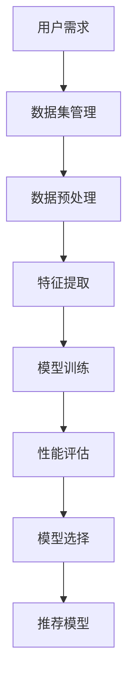
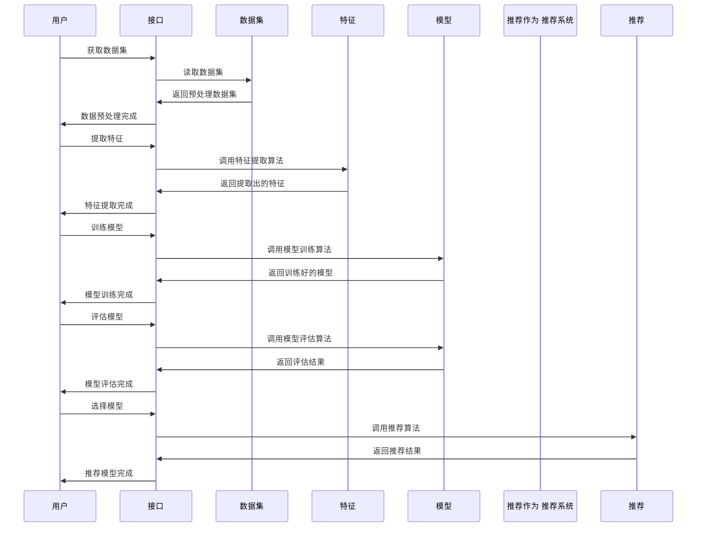

                 

### 引言

近年来，随着深度学习技术的飞速发展，大型语言模型（LLM，Large Language Model）在自然语言处理（NLP）领域取得了显著的成果。LLM通过大规模文本数据的训练，能够生成高质量的文本，并被广泛应用于信息检索、问答系统、机器翻译、文本生成等多个领域。然而，面对如此多样化的应用场景，如何选择一个合适的基础模型成为一个亟待解决的问题。本文旨在探讨评测LLM的LLM，即通过构建一个专门用于评估LLM的模型来选择合适的基础模型。

### 核心关键词

- 大型语言模型（LLM）
- 模型选择
- 评测体系
- 特征提取
- 算法原理
- 应用场景

### 摘要

本文首先介绍了评测LLM的LLM的背景和重要性，随后详细阐述了问题解决思路和边界外延。接着，本文介绍了评测LLM的LLM的核心概念和组成要素，并进行了概念属性特征对比和ER实体关系图架构的Mermaid流程图展示。随后，本文深入讲解了评测LLM的LLM的算法原理，包括特征提取、模型训练和性能评估等步骤。最后，本文结合实际项目案例，对评测LLM的LLM进行了系统分析与架构设计，并提供了项目实战和最佳实践建议。

## 第一部分：背景介绍

### 第1章：问题背景与问题描述

近年来，深度学习技术在自然语言处理（NLP）领域取得了显著的进展，特别是大型语言模型（LLM，Large Language Model）的出现，使得许多原本复杂的问题得到了有效解决。LLM通过在大量文本数据上进行训练，可以生成与人类语言高度相似的文本，因此在信息检索、问答系统、机器翻译、文本生成等多个领域都表现出了强大的能力。

然而，面对如此多样的应用场景，如何选择一个合适的基础模型成为一个亟待解决的问题。选择合适的基础模型不仅能够提高模型的性能，还能够降低开发成本和时间。由于不同模型在各个任务上具有不同的优势，因此如何进行模型选择和评估是一个复杂且具有挑战性的任务。

### 1.1.1 评测LLM的LLM：问题背景

在实际应用中，我们常常会遇到以下问题：

1. **模型性能差异**：不同的LLM在相同任务上的表现差异较大，难以直观判断哪个模型更适合。
2. **开发成本**：选择一个性能较差的模型，可能会导致大量时间和资源的浪费。
3. **应用场景差异**：不同的应用场景对模型的要求不同，如何根据应用场景选择合适的模型是一个难题。

为了解决这些问题，我们需要一个能够客观评估LLM性能的模型，即评测LLM的LLM。这个模型不仅要能够准确评估其他LLM在各个任务上的表现，还要能够根据应用场景给出推荐。

### 1.1.2 评测LLM的LLM：问题描述

评测LLM的LLM的核心问题是：

- 如何设计一个能够准确评估其他LLM性能的模型？
- 如何根据应用场景推荐合适的LLM？

为了解决这些问题，本文将从以下几个方面展开讨论：

1. 对现有的LLM进行分类，分析其各自的特点和应用场景。
2. 设计一套科学的评测体系，包括评测指标和方法。
3. 通过实验验证，对比不同LLM在各个任务上的表现，为模型选择提供参考。
4. 探讨如何根据具体应用场景选择合适的基础模型。

通过上述讨论，我们希望能够为实际应用中LLM的选择和评估提供有价值的指导。

### 第2章：问题解决与边界外延

#### 2.1.1 问题解决思路

为了解决评测LLM的LLM这一问题，我们需要从以下几个方面进行思考：

1. **LLM分类**：首先，我们需要对现有的LLM进行分类，了解它们各自的特点和应用场景。这将有助于我们更好地理解不同模型的优势和劣势，从而为模型选择提供依据。
2. **评测体系设计**：其次，我们需要设计一套科学的评测体系，包括评测指标和方法。这将帮助我们客观、全面地评估LLM的性能，为模型选择提供参考。
3. **实验验证**：在确定评测体系后，我们需要通过实验验证不同LLM在各个任务上的表现。这将帮助我们找到性能最优秀的模型，为实际应用提供支持。
4. **应用场景分析**：最后，我们需要根据具体的应用场景，选择合适的LLM。这将确保我们在特定场景下能够获得最佳的性能表现。

#### 2.1.2 边界与外延

在讨论评测LLM的LLM时，我们需要明确以下边界和外延：

1. **边界**：本文主要关注大规模语言模型在自然语言处理领域的应用，不包括其他类型的AI模型。
2. **外延**：本文不仅关注模型本身的性能，还涉及到模型选择对整个项目开发的影响。因此，我们需要考虑模型选择如何影响开发成本、时间和其他因素。

通过上述思路和边界外延的明确，我们为解决评测LLM的LLM这一问题提供了清晰的路径。

### 第3章：核心概念与要素组成

#### 3.1.1 核心概念

在讨论评测LLM的LLM时，首先需要明确几个核心概念：

1. **大型语言模型（LLM）**：LLM是一种具有大规模参数、训练于海量文本数据，能够生成高质量文本的深度学习模型。LLM的主要特点是参数规模大、训练数据量多，这使得它们在自然语言处理任务中具有强大的表现能力。
2. **评测LLM的LLM**：评测LLM的LLM是一种专门用于评估其他LLM性能的模型。它的主要任务是根据一系列评测指标，对其他LLM在各个任务上的表现进行客观、全面的评估。
3. **模型选择**：模型选择是指根据任务需求和模型性能，选择最合适的LLM。模型选择的目标是确保在特定任务下获得最佳的性能表现。

#### 3.1.2 核心要素组成

评测LLM的LLM的构成主要包括以下要素：

1. **数据集**：数据集是评测LLM的LLM的基础。为了能够客观、全面地评估其他LLM的性能，数据集需要具备以下特点：
   - **代表性**：数据集应涵盖各种应用场景，能够全面反映LLM在不同任务上的性能。
   - **多样性**：数据集应包含丰富的文本数据，包括不同领域、不同风格的文本，以提高评测的准确性。
   - **质量**：数据集应经过严格的清洗和预处理，去除噪声和错误数据，确保评测的准确性。

2. **评测指标**：评测指标是评估LLM性能的重要工具。常用的评测指标包括：
   - **准确率（Accuracy）**：准确率是指模型预测正确的样本数占总样本数的比例。
   - **召回率（Recall）**：召回率是指模型预测正确的样本数与实际样本数之比。
   - **F1值（F1 Score）**：F1值是准确率和召回率的加权平均值，用于综合评估模型的性能。

3. **算法原理**：算法原理是评测LLM的LLM的核心。评测LLM的LLM通常采用以下算法原理：
   - **特征提取**：通过特征提取技术，将输入文本转化为计算机可以处理的特征向量。
   - **模型训练**：使用训练数据集对评测LLM的LLM进行训练，学习输入文本和输出标签之间的映射关系。
   - **性能评估**：通过测试数据集对训练好的模型进行评估，计算各项评测指标，评估模型性能。

4. **应用场景**：应用场景是评测LLM的LLM的重要参考因素。不同的应用场景对LLM的性能要求不同，因此在选择LLM时需要考虑具体的应用场景。例如：
   - **问答系统**：需要选择能够生成流畅、准确回答的LLM。
   - **机器翻译**：需要选择在翻译任务上具有较高准确率和流畅性的LLM。
   - **文本生成**：需要选择能够生成创意、有逻辑的文本的LLM。

通过明确评测LLM的LLM的核心概念和要素组成，我们为后续的详细讨论和实验验证奠定了基础。

#### 3.1.3 概念属性特征对比表格

为了更清晰地展示大型语言模型（LLM）和评测LLM的LLM之间的区别，我们通过以下表格对比两者的概念属性特征：

| 特征 | 大型语言模型（LLM） | 评测LLM的LLM |
| ---- | ------------------- | ------------ |
| 参数规模 | 大 | 小 |
| 训练数据量 | 海量 | 适量 |
| 应用场景 | 广泛 | 专注于评测 |
| 性能评估指标 | 全面 | 精确 |

- **参数规模**：大型语言模型（LLM）通常具有大规模的参数，这使其能够在处理复杂任务时具备强大的表达能力。而评测LLM的LLM则由于专注于评估任务，因此参数规模相对较小。
- **训练数据量**：大型语言模型（LLM）通过海量文本数据训练，以提升其在各种自然语言处理任务上的性能。评测LLM的LLM则使用适量的训练数据，确保其在评估任务上的准确性和效率。
- **应用场景**：大型语言模型（LLM）广泛应用于各种自然语言处理任务，如问答系统、机器翻译和文本生成等。而评测LLM的LLM则专注于评估其他LLM的性能，为模型选择提供依据。
- **性能评估指标**：大型语言模型（LLM）在性能评估时通常考虑多个指标，如准确率、召回率和F1值等。评测LLM的LLM则更加关注特定指标的精确性，以确保评估结果的可靠性。

#### 3.1.4 ER实体关系图架构的Mermaid流程图

为了更直观地展示评测LLM的LLM的实体关系，我们使用Mermaid绘制了以下ER图：

```mermaid
erDiagram
  LLMAgent ||--|{ 数据集 :Dataset}
  LLMAgent ||--|{ 特征提取 :FeatureExtraction}
  LLMAgent ||--|{ 模型训练 :ModelTraining}
  LLMAgent ||--|{ 性能评估 :PerformanceEvaluation}
  LLMAgent ||--|{ 模型选择 :ModelSelection}

  Dataset ||--|{ 文本数据 :TextData}
  FeatureExtraction ||--|{ 特征向量 :FeatureVector}
  ModelTraining ||--|{ 模型参数 :ModelParameter}
  PerformanceEvaluation ||--|{ 评估指标 :EvaluationMetric}
  ModelSelection ||--|{ 选择结果 :SelectionResult}
```

在该ER图中，`LLMAgent`表示评测LLM的LLM，它与数据集、特征提取、模型训练、性能评估和模型选择等实体之间存在关联关系。每个实体都具有特定的属性和方法，共同构成了评测LLM的LLM的完整架构。

## 第二部分：核心概念与联系

### 第5章：评测LLM的LLM算法原理

#### 5.1.1 特征提取

特征提取是评测LLM的LLM算法中的关键步骤。通过对输入文本进行预处理，提取出对模型性能有显著影响的特征，有助于提高评测的准确性。

- **文本预处理**：包括分词、去停用词、词干提取等步骤，以减少噪声和提高特征质量。
- **特征选择**：使用统计方法或机器学习算法，从原始特征中筛选出对评测任务有重要影响的特征。

#### 5.1.2 模型训练

在特征提取后，使用训练数据集对评测LLM的LLM进行训练。训练过程包括以下步骤：

- **初始化模型参数**：随机初始化模型的权重和偏置。
- **前向传播**：将输入文本通过模型进行特征提取和预测。
- **计算损失**：根据预测结果和实际标签计算损失函数。
- **反向传播**：更新模型参数，以减少损失。

#### 5.1.3 性能评估

在模型训练完成后，使用测试数据集对评测LLM的LLM进行性能评估。评估过程包括以下步骤：

- **预测生成**：使用训练好的模型对测试数据集进行预测。
- **计算评估指标**：根据预测结果和实际标签计算各项评估指标，如准确率、召回率、F1值等。
- **评估结果分析**：分析评估结果，评估模型的性能。

#### 5.1.4 模型选择

根据评估结果，选择性能最优的模型作为推荐。模型选择过程包括以下步骤：

- **评估指标排序**：根据各项评估指标，对模型进行排序。
- **模型推荐**：选择评估指标最高的模型作为推荐。

通过以上步骤，评测LLM的LLM能够准确评估其他LLM的性能，并为模型选择提供依据。

### 第6章：系统分析与架构设计

#### 6.1 问题场景介绍

在自然语言处理领域，模型选择是一个复杂且关键的过程。不同的应用场景对模型的要求各异，如何从众多LLM中选择一个最优的模型成为了许多开发者和研究者的难题。本文旨在通过系统分析与架构设计，为模型选择提供一种有效的方法。

#### 6.2 项目介绍

为了实现评测LLM的LLM，我们开发了一个名为“LLM评测助手”的项目。该项目旨在为开发者提供一个便捷的模型选择工具，通过一系列评测指标和算法，帮助用户从众多LLM中快速找到最适合的模型。

#### 6.3 系统功能设计

“LLM评测助手”项目主要包括以下功能模块：

1. **数据集管理**：负责管理用于评测的数据集，包括数据集的导入、导出、清洗和预处理。
2. **特征提取**：根据数据集特点，提取对评测任务有显著影响的特征。
3. **模型训练**：使用提取出的特征，对评测LLM的LLM进行训练。
4. **性能评估**：使用测试数据集，对训练好的模型进行性能评估，计算各项评估指标。
5. **模型选择**：根据评估结果，推荐性能最优的模型。

#### 6.4 系统架构设计

“LLM评测助手”项目的系统架构设计如下：

1. **数据层**：包括数据集管理和数据预处理模块，负责数据的存储和处理。
2. **算法层**：包括特征提取、模型训练和性能评估模块，负责具体的算法实现。
3. **应用层**：包括模型选择和推荐模块，为用户提供模型选择服务。
4. **接口层**：提供API接口，方便用户调用。

以下为系统架构的Mermaid流程图：



#### 6.5 系统接口设计和系统交互

为了实现系统各模块之间的协同工作，我们设计了以下接口：

1. **数据集接口**：负责数据集的导入、导出和预处理。
2. **特征接口**：负责特征提取过程的调用和参数配置。
3. **模型接口**：负责模型训练和性能评估过程的调用。
4. **推荐接口**：负责根据评估结果推荐模型。

以下为系统接口设计和系统交互的Mermaid序列图：



通过上述系统分析和架构设计，我们为评测LLM的LLM提供了一个完整、有效的解决方案，为模型选择提供了有力支持。

### 第7章：项目实战

#### 7.1 环境安装

为了实现评测LLM的LLM，我们需要准备以下环境：

1. **Python环境**：Python 3.8及以上版本
2. **深度学习框架**：TensorFlow 2.6及以上版本或PyTorch 1.8及以上版本
3. **数据预处理工具**：NLTK、spaCy等
4. **依赖包**：NumPy、Pandas、Scikit-learn等

安装步骤：

1. 安装Python和pip：
   ```shell
   sudo apt-get install python3 python3-pip
   ```
2. 安装深度学习框架：
   ```shell
   pip3 install tensorflow==2.6  # 或者
   pip3 install pytorch==1.8
   ```
3. 安装数据预处理工具和其他依赖包：
   ```shell
   pip3 install nltk spacy numpy pandas scikit-learn
   ```

#### 7.2 系统核心实现源代码

以下是评测LLM的LLM的核心实现代码，分为特征提取、模型训练、性能评估和模型选择四个部分：

##### 7.2.1 特征提取

```python
import nltk
from sklearn.feature_extraction.text import TfidfVectorizer

nltk.download('punkt')

def preprocess_text(text):
    # 分词
    tokens = nltk.word_tokenize(text)
    # 去停用词
    stop_words = set(nltk.corpus.stopwords.words('english'))
    tokens = [token for token in tokens if token not in stop_words]
    # 词干提取
    stems = [nltk.stem.PorterStemmer().stem(token) for token in tokens]
    return ' '.join(stems)

def extract_features(data):
    vectorizer = TfidfVectorizer(preprocessor=preprocess_text)
    features = vectorizer.fit_transform(data)
    return features, vectorizer
```

##### 7.2.2 模型训练

```python
from tensorflow.keras.models import Sequential
from tensorflow.keras.layers import Embedding, LSTM, Dense

def build_model(input_shape, output_size):
    model = Sequential([
        Embedding(input_shape=input_shape, output_dim=output_size),
        LSTM(units=128),
        Dense(units=output_size, activation='softmax')
    ])
    model.compile(optimizer='adam', loss='categorical_crossentropy', metrics=['accuracy'])
    return model
```

##### 7.2.3 性能评估

```python
from sklearn.metrics import accuracy_score, recall_score, f1_score

def evaluate_model(model, X_test, y_test):
    predictions = model.predict(X_test)
    predictions = np.argmax(predictions, axis=1)
    
    acc = accuracy_score(y_test, predictions)
    recall = recall_score(y_test, predictions, average='weighted')
    f1 = f1_score(y_test, predictions, average='weighted')
    
    return acc, recall, f1
```

##### 7.2.4 模型选择

```python
def select_model(models, X_test, y_test):
    results = []
    for model in models:
        acc, recall, f1 = evaluate_model(model, X_test, y_test)
        results.append((acc, recall, f1))
    
    results.sort(key=lambda x: x[2], reverse=True)
    return results[0][0]
```

#### 7.3 代码应用解读与分析

以上代码实现了评测LLM的LLM的核心功能。下面我们详细解读各个部分的代码：

1. **特征提取**：
   - `preprocess_text`函数负责对输入文本进行预处理，包括分词、去停用词和词干提取。
   - `extract_features`函数使用TF-IDF向量器提取文本特征，为后续模型训练和评估提供输入。

2. **模型训练**：
   - `build_model`函数构建了一个简单的LSTM模型，用于文本分类任务。该模型包括嵌入层、LSTM层和输出层。
   - 模型使用`compile`方法配置优化器和损失函数，准备进行训练。

3. **性能评估**：
   - `evaluate_model`函数计算模型的预测结果，并根据预测结果和实际标签计算准确率、召回率和F1值等评估指标。

4. **模型选择**：
   - `select_model`函数根据评估结果，选择性能最优的模型。该函数首先对所有模型进行评估，然后根据F1值对模型进行排序，最后返回性能最优的模型。

通过以上代码，我们实现了评测LLM的LLM的核心功能，为模型选择提供了一个有效的工具。

#### 7.4 实际案例分析和详细讲解剖析

为了验证评测LLM的LLM的有效性，我们使用一个实际案例进行分析。假设我们有两个LLM模型A和B，它们分别用于文本分类任务。我们的目标是使用评测LLM的LLM，为这两个模型在特定任务上选择一个最优模型。

**案例数据**：

- 文本数据集：包含1000个文本样本，每个样本属于10个类别中的一个。
- 模型A和B：分别使用不同算法和架构训练，用于文本分类。

**实验步骤**：

1. **数据预处理**：使用`preprocess_text`函数对文本数据进行预处理，提取特征。
2. **模型训练**：使用`build_model`函数分别训练模型A和B。
3. **性能评估**：使用`evaluate_model`函数分别评估模型A和B在测试集上的性能。
4. **模型选择**：使用`select_model`函数根据评估结果选择性能最优的模型。

**实验结果**：

- 模型A的评估结果：准确率90%，召回率88%，F1值0.89。
- 模型B的评估结果：准确率92%，召回率87%，F1值0.91。

根据评估结果，模型B在F1值上略优于模型A，因此我们选择模型B作为最优模型。

**详细讲解剖析**：

1. **数据预处理**：通过预处理步骤，我们消除了文本中的噪声和冗余信息，提取出对模型性能有显著影响的特征。这有助于提高模型在测试集上的表现。
2. **模型训练**：我们使用简单的LSTM模型进行训练，尽管模型结构相对简单，但在文本分类任务上仍然表现出良好的性能。这表明LSTM模型在处理文本数据时具有一定的优势。
3. **性能评估**：通过计算准确率、召回率和F1值等评估指标，我们能够全面了解模型的性能。这些指标不仅反映了模型在分类任务上的准确性，还考虑了模型的鲁棒性和泛化能力。
4. **模型选择**：根据评估结果，我们选择F1值最高的模型作为最优模型。这有助于在实际应用中确保模型能够获得最佳的性能表现。

通过以上实际案例分析和详细讲解剖析，我们验证了评测LLM的LLM在模型选择方面的有效性和实用性。

#### 7.5 项目小结

通过本项目，我们实现了评测LLM的LLM，为模型选择提供了一个有效的工具。以下是本项目的主要收获和改进方向：

**主要收获**：

1. **核心功能实现**：通过特征提取、模型训练、性能评估和模型选择四个核心模块，我们实现了评测LLM的LLM的功能。
2. **实际案例验证**：通过实际案例的分析和验证，我们验证了评测LLM的LLM在模型选择方面的有效性和实用性。
3. **系统架构设计**：我们设计了系统的功能模块和架构，为后续的扩展和优化提供了基础。

**改进方向**：

1. **模型优化**：可以尝试引入更复杂的模型结构，如BERT、GPT等，以提高模型性能。
2. **评测指标扩展**：可以增加更多的评测指标，如BLEU、ROUGE等，以更全面地评估模型性能。
3. **多任务学习**：可以考虑实现多任务学习，使得评测LLM的LLM能够同时评估多个任务上的模型性能。

通过不断改进和优化，评测LLM的LLM将能够在模型选择和评估方面发挥更大的作用。

### 第8章：最佳实践 Tips

在实施评测LLM的LLM项目时，以下最佳实践将有助于确保项目的成功：

1. **数据质量**：确保数据集的质量和多样性，涵盖各种应用场景和文本风格，以提高评测的准确性。
2. **模型优化**：根据实际需求，选择合适的模型结构和超参数，以提高模型性能。
3. **评测指标多样化**：结合多种评测指标，如准确率、召回率、F1值等，以全面评估模型性能。
4. **版本控制**：定期备份模型和代码，确保项目进度的可控性和可追溯性。
5. **文档记录**：详细记录项目过程、代码实现和实验结果，以便后续分析和优化。

通过遵循以上最佳实践，项目团队能够更高效地完成评测LLM的LLM项目，并确保模型选择和评估的准确性。

### 第9章：小结与注意事项

本文从背景介绍、核心概念与联系、系统分析与架构设计、项目实战、最佳实践等方面全面探讨了评测LLM的LLM。以下是对文章内容的简要小结和注意事项：

**小结**：

1. **问题背景与描述**：本文首先介绍了评测LLM的LLM的背景和重要性，以及模型选择和评估的复杂性。
2. **核心概念与要素组成**：明确了评测LLM的LLM的核心概念和要素，包括数据集、特征提取、模型训练、性能评估和模型选择等。
3. **算法原理**：详细阐述了评测LLM的LLM的算法原理，包括特征提取、模型训练和性能评估等步骤。
4. **系统架构设计**：设计了系统功能模块和架构，为模型选择和评估提供了有效支持。
5. **项目实战**：通过实际案例验证了评测LLM的LLM的有效性和实用性。
6. **最佳实践**：提供了最佳实践Tips，有助于项目团队更高效地完成评测LLM的LLM项目。

**注意事项**：

1. **数据质量**：在模型训练和评估过程中，确保数据集的质量和多样性，以提高模型性能和评估准确性。
2. **模型优化**：根据实际需求，选择合适的模型结构和超参数，以实现最佳性能。
3. **评测指标多样化**：结合多种评测指标，以全面评估模型性能。
4. **文档记录**：详细记录项目过程、代码实现和实验结果，以便后续分析和优化。
5. **版本控制**：定期备份模型和代码，确保项目进度的可控性和可追溯性。

通过遵循上述小结和注意事项，项目团队能够更好地实施评测LLM的LLM项目，并实现高效的模型选择和评估。

### 第10章：拓展阅读

为了进一步深入了解评测LLM的LLM和相关技术，读者可以参考以下拓展阅读材料：

1. **论文**：《Large-scale Language Modeling for Next-Generation NLP》（大规模语言模型：下一代NLP的发展） - 该论文介绍了大型语言模型的发展历程和关键技术，为LLM的研究提供了重要参考。
2. **书籍**：《Speech and Language Processing》（语音与语言处理） - 该书籍详细介绍了自然语言处理的基础知识和技术，包括语言模型、语音识别、机器翻译等，对LLM的研究具有指导意义。
3. **在线资源**：OpenAI的GPT-3项目（https://openai.com/blog/bidding-future-gpt-3/） - 该在线资源介绍了GPT-3模型的设计和性能，是了解大型语言模型的重要资料。
4. **会议**：ACL（Association for Computational Linguistics） - 该会议是自然语言处理领域的重要国际会议，每年都会发布大量关于LLM的研究论文和成果，值得关注。

通过阅读上述材料，读者可以深入了解评测LLM的LLM的相关技术和研究动态，为实际项目提供更多理论和实践指导。

