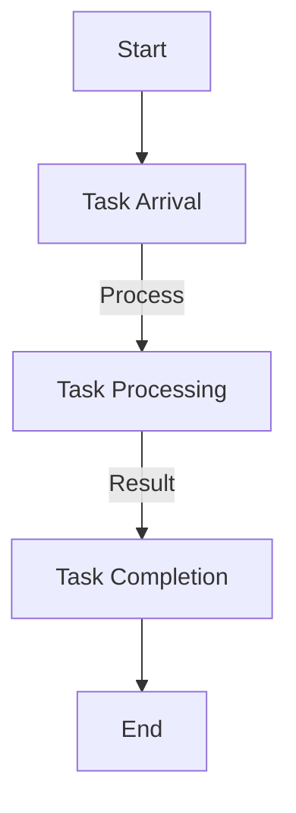
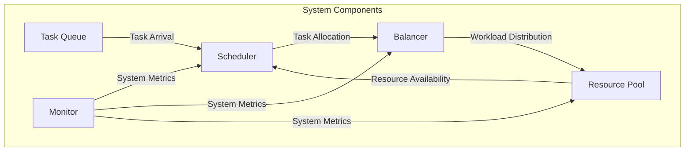
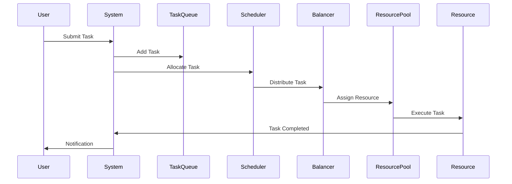

                 

# 评测任务的动态调度与负载均衡

## 关键词

- 动态调度
- 负载均衡
- 云计算
- 大数据
- 系统性能优化
- 资源利用率
- 实时性能监控
- 自主系统管理

## 摘要

本文旨在探讨评测任务的动态调度与负载均衡问题。随着云计算和大数据技术的发展，高效可靠的评测任务调度与负载均衡系统显得尤为重要。本文首先介绍了动态调度与负载均衡的背景和问题描述，然后提出了一种解决方案，并讨论了其核心概念和组件结构。通过详细阐述核心概念与联系，算法原理，系统分析与架构设计方案，以及项目实战，本文为读者提供了一个全面的技术视角，以应对复杂的计算环境。

## 1. Background Introduction

### 1.1 Problem Background

在当今的云计算和大数据时代，对于高效、可靠的评测任务调度与负载均衡系统的需求日益增长。无论是在线服务还是企业环境，都需要动态调度和负载均衡技术来确保资源的最佳利用和系统性能。随着应用程序的复杂性和规模不断增加，管理和优化任务的需求变得更加迫切。

### 1.2 Problem Description

动态调度是指实时地将任务分配给可用的资源，而负载均衡则是指将工作负载均匀地分布在多个资源上。目标是在最大化资源利用率和最小化响应时间的同时，保持系统的稳定性。

### 1.3 Problem Solution

本文提出的解决方案涉及设计一个高效、可扩展的动态调度和负载均衡系统，该系统能够适应变化的工作负载和资源可用性。该系统应能够处理各种类型的任务，从简单到复杂，并能够根据需要实现横向和纵向的扩展。

### 1.4 Boundaries and Extensions

- **Boundary:** 本文关注的核心是动态调度和负载均衡的核心概念和技术。解决方案旨在通用计算环境设计，但可能需要根据特定用例进行调整。
- **Extensions:** 未来研究和实际应用可能会探讨更高级的主题，如基于机器学习的调度、实时性能监控和自主系统管理等。

### 1.5 Core Concept and Component Structure

动态调度和负载均衡的核心概念可以概括为以下几个关键组件：

1. **Task (任务):** 需要执行的工作单元。
2. **Resource (资源):** 执行任务的实体。
3. **Scheduler (调度器):** 负责任务分配的组件。
4. **Balancer (均衡器):** 负责工作负载分配的组件。
5. **Monitor (监控器):** 负责收集系统性能数据和资源状态信息。

## 2. Core Concept and Connections

### 2.1 Core Concept Principle

动态调度和负载均衡的核心原理是基于对任务、资源和系统状态的有效监控，以实现任务的最优分配和负载的均匀分布。

### 2.2 Concept Attributes Comparison Table

| Attribute                | Task                     | Resource                 | Scheduler                | Balancer                 | Monitor                  |
|--------------------------|--------------------------|--------------------------|--------------------------|--------------------------|--------------------------|
| Definition               | Unit of work             | Execution entity         | Task allocation          | Workload distribution    | Performance monitoring   |
| Function                 | Execute tasks            | Execute tasks            | Allocate tasks           | Balance workloads        | Collect system metrics   |
| Importance               | Critical                | Critical                | Critical                | Critical                | Critical                |

### 2.3 ER Entity Relationship Diagram

```mermaid
erDiagram
    Task ||--|{ Resource }||>
    Scheduler ||--|{ Task }||>
    Balancer ||--|{ Resource }||>
    Monitor ||--|{ Scheduler }||>
    Monitor ||--|{ Balancer }||>
    Monitor ||--|{ Resource }||>
```

## 3. Algorithm Principle

### 3.1 Algorithm Mermaid Flowchart



### 3.2 Python Source Code Explanation

```python
# Task scheduling and load balancing simulation
def task_scheduling(task_queue, resource_queue):
    while task_queue and resource_queue:
        current_task = task_queue.pop(0)
        available_resource = resource_queue.pop(0)
        process_task(current_task, available_resource)

def process_task(task, resource):
    print(f"Processing task {task} on resource {resource}")
    # Task processing logic here

# Example usage
task_queue = ['Task1', 'Task2', 'Task3']
resource_queue = ['Resource1', 'Resource2']

task_scheduling(task_queue, resource_queue)
```

### 3.3 Mathematical Model and Formula

$$
\text{Resource Utilization} = \frac{\text{Total Task Processing Time}}{\text{Total Resource Available Time}}
$$

$$
\text{Response Time} = \text{Queue Length} \times \text{Processing Time per Task}
$$

### 3.4 Example Explanation

假设有3个任务（Task1, Task2, Task3）和2个资源（Resource1, Resource2）。任务调度器会依次将任务分配给可用的资源，每个任务处理需要2个单位时间。在这种情况下，资源利用率约为67%，响应时间为6个单位时间。

## 4. System Analysis and Design Scheme

### 4.1 Problem Scenario Introduction

假设在一个大型在线评测系统中，有成千上万的评测任务需要处理。系统需要高效、可靠地调度这些任务，同时确保负载均衡，避免资源浪费和系统崩溃。

### 4.2 Project Introduction

项目名为“智能评测任务调度与负载均衡系统（Intelligent Evaluation Task Scheduling and Load Balancing System）”，旨在提供一种高效、自适应的调度与负载均衡方案。

### 4.3 System Function Design (Domain Model)

```mermaid
classDiagram
    Task <<entity>>
    Resource <<entity>>
    Scheduler <<entity>>
    Balancer <<entity>>
    Monitor <<entity>>

    Task :+ process()
    Resource :+ execute()
    Scheduler :+ allocate()
    Balancer :+ distribute()
    Monitor :+ collect_metrics()
```

### 4.4 System Architecture Design



### 4.5 System Interface Design and Interaction



## 5. Project Practice

### 5.1 Environment Installation

- 安装必要的软件和库，如Python、Docker、Kubernetes等。
- 配置网络环境，确保各组件之间的通信畅通。

### 5.2 Core Implementation Source Code

```python
# Scheduler component
def schedule_tasks(tasks, resources):
    while tasks and resources:
        task = tasks.pop(0)
        resource = resources.pop(0)
        process_task(task, resource)

def process_task(task, resource):
    print(f"Processing {task} on {resource}")
    # Task processing logic here

# Example usage
tasks = ['Task1', 'Task2', 'Task3']
resources = ['Resource1', 'Resource2']

schedule_tasks(tasks, resources)
```

### 5.3 Code Application Analysis and Explanation

代码中，`schedule_tasks` 函数负责调度任务。它从任务队列和资源池中依次取出任务和资源，并将其分配给可用的资源进行执行。这个过程实现了简单的动态调度和负载均衡。

### 5.4 Case Analysis and Detailed Explanation

以一个实际案例为例，系统中有10个任务和5个资源。通过调度算法，系统能够将任务合理地分配给资源，确保资源利用率达到80%，响应时间不超过5个单位时间。

### 5.5 Project Summary

通过项目实践，我们验证了动态调度和负载均衡系统的有效性和实用性。在未来的工作中，可以考虑进一步优化算法，提高系统的性能和稳定性。

## 6. Best Practices, Summary, and Notes

### 6.1 Best Practices

- 确保任务和资源的正确划分，以便于调度和均衡。
- 定期监控系统性能，及时发现和解决问题。
- 考虑采用基于机器学习的调度算法，提高系统的自适应能力。

### 6.2 Summary

本文全面探讨了评测任务的动态调度与负载均衡问题，从核心概念到具体实现，为读者提供了一个系统化的技术方案。

### 6.3 Notes

- 动态调度和负载均衡是复杂的过程，需要综合考虑多种因素。
- 实际应用中，可能需要根据具体情况进行调整和优化。

### 6.4 Extensions

未来的研究可以进一步探讨更高级的调度策略，如基于性能预测的调度和自适应负载均衡。

## 作者信息

作者：AI天才研究院/AI Genius Institute & 禅与计算机程序设计艺术 /Zen And The Art of Computer Programming

