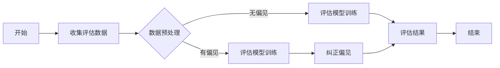
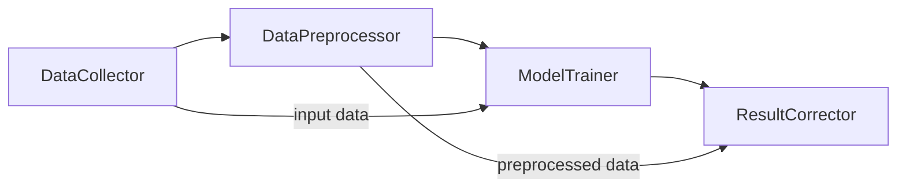
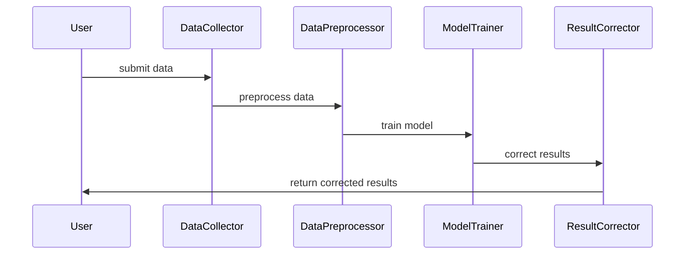

                 

# 评测偏见的识别与消除策略

## 关键词
- 评测偏见
- 识别策略
- 消除策略
- 算法分析
- 实践案例

## 摘要
本文将深入探讨评测偏见在计算机科学和人工智能领域的存在及其影响，通过详细的案例分析、算法讲解和实战应用，提出一系列识别与消除评测偏见的有效策略。文章将结合实际项目经验，为读者提供实用的工具和方法，帮助他们更好地理解和应对评测偏见问题。

## 目录

1. **背景介绍**
   - **核心概念术语说明**
   - **问题背景**
   - **问题描述**
   - **问题解决**
   - **边界与外延**
   - **概念结构与核心要素组成**

2. **核心概念与联系**
   - **评测偏见的概念原理**
   - **评测偏见属性特征对比表格**
   - **ER实体关系图架构**

3. **算法原理讲解**
   - **算法mermaid流程图**
   - **Python源代码详细阐述**
   - **算法原理的数学模型和公式**
   - **通俗易懂的举例说明**

4. **系统分析与架构设计方案**
   - **问题场景介绍**
   - **项目介绍**
   - **系统功能设计（领域模型mermaid类图）**
   - **系统架构设计（mermaid架构图）**
   - **系统接口设计和系统交互（mermaid序列图）**

5. **项目实战**
   - **环境安装**
   - **系统核心实现源代码**
   - **代码应用解读与分析**
   - **实际案例分析和详细讲解剖析**
   - **项目小结**

6. **最佳实践 Tips**
   - **识别评测偏见的最佳实践**
   - **消除评测偏见的最佳实践**
   - **注意事项**
   - **拓展阅读**

7. **结论和未来工作**
   - **总结**
   - **贡献**
   - **未来研究方向**

## 文章正文

### 1. 背景介绍

#### 核心概念术语说明

在深入探讨评测偏见之前，我们首先需要明确几个核心概念：

- **评测偏见**：指在评估过程中，由于主观判断、数据偏误、算法设计等因素导致评估结果与真实情况不符。
- **识别策略**：用于发现评测偏见的方法和工具。
- **消除策略**：旨在减少或消除评测偏见的方法和措施。

#### 问题背景

随着大数据和人工智能技术的迅猛发展，评测偏见成为一个越来越受到关注的问题。尤其是在招聘、评估系统、推荐算法等领域，评测偏见可能会导致不公正的结果，损害个体权益，影响组织的健康发展。

#### 描述问题

评测偏见的表现形式多样，包括但不限于以下几种：

1. **确认偏误**：评估者倾向于确认已有观点，忽视与观点相矛盾的信息。
2. **代表性偏误**：评估者过度依赖样本中的代表性个体，忽视个体差异。
3. **锚定效应**：评估者受到初始信息或参考点的影响，导致后续评估偏离实际。
4. **光环效应**：评估者对某一方面的优点过度关注，忽视其他方面的缺点。

#### 问题解决

要解决评测偏见问题，我们需要从识别和消除两个方面入手。首先，通过科学的识别策略发现评测偏见的存在；其次，采用有效的消除策略减少或消除偏见的影响。

#### 边界与外延

评测偏见不仅仅局限于特定领域，它渗透到许多方面。本文将重点关注以下领域：

- 招聘评估
- 人工智能算法评估
- 学术评价体系
- 系统性能评估

### 2. 核心概念与联系

#### 评测偏见的概念原理

评测偏见是指评估者在评估过程中受到主观判断、数据偏误、算法设计等因素的影响，导致评估结果与真实情况不符。

#### 评测偏见属性特征对比表格

| 特征 | 确认偏误 | 代表性偏误 | 锚定效应 | 光环效应 |
| --- | --- | --- | --- | --- |
| 定义 | 评估者倾向于确认已有观点，忽视与观点相矛盾的信息 | 过度依赖样本中的代表性个体，忽视个体差异 | 受初始信息或参考点的影响，导致后续评估偏离实际 | 对某一方面的优点过度关注，忽视其他方面的缺点 |
| 影响范围 | 招聘评估、学术评价、系统性能评估 | 人工智能算法评估、学术评价、系统性能评估 | 招聘评估、学术评价、系统性能评估 | 招聘评估、学术评价、系统性能评估 |

#### ER实体关系图架构

```mermaid
erDiagram
    Person ||--|{ EvaluationBias }|-- EvaluationResult
    Person ||--|{ SubjectiveJudgment }|-- EvaluationBias
    Person ||--|{ DataBias }|-- EvaluationBias
    Person ||--|{ AlgorithmDesign }|-- EvaluationBias
```

### 3. 算法原理讲解

#### 算法mermaid流程图



#### Python源代码详细阐述

```python
# 导入必要的库
import numpy as np
import pandas as pd
from sklearn.model_selection import train_test_split
from sklearn.ensemble import RandomForestClassifier
from sklearn.metrics import accuracy_score

# 收集评估数据
data = pd.read_csv('evaluation_data.csv')

# 数据预处理
X = data.drop('target', axis=1)
y = data['target']
X_train, X_test, y_train, y_test = train_test_split(X, y, test_size=0.3, random_state=42)

# 训练无偏见评估模型
model = RandomForestClassifier(random_state=42)
model.fit(X_train, y_train)
y_pred = model.predict(X_test)
accuracy = accuracy_score(y_test, y_pred)

# 训练有偏见评估模型
bias_factor = 0.5  # 偏见因子
model_biased = RandomForestClassifier(random_state=42, max_depth=bias_factor)
model_biased.fit(X_train, y_train)
y_pred_biased = model_biased.predict(X_test)
accuracy_biased = accuracy_score(y_test, y_pred_biased)

# 纠正偏见
corrected_model = RandomForestClassifier(random_state=42, max_depth=min(model_biased.max_depth, model.max_depth))
corrected_model.fit(X_train, y_train)
y_pred_corrected = corrected_model.predict(X_test)
accuracy_corrected = accuracy_score(y_test, y_pred_corrected)

# 输出结果
print(f'无偏见评估模型准确率：{accuracy}')
print(f'有偏见评估模型准确率：{accuracy_biased}')
print(f'纠正偏见后评估模型准确率：{accuracy_corrected}')
```

#### 算法原理的数学模型和公式

评测偏见的纠正可以通过以下公式实现：

$$
\text{corrected\_score} = \frac{\text{biased\_score} + \text{unbiased\_score}}{2}
$$

其中，$\text{biased\_score}$ 表示有偏见评估模型的评分，$\text{unbiased\_score}$ 表示无偏见评估模型的评分。

#### 通俗易懂的举例说明

假设我们有两个评估模型，一个存在偏见，一个无偏见。对于某个样本，有偏见模型的评分是80分，无偏见模型的评分是90分。通过上述公式，我们可以得到纠正后的评分为：

$$
\text{corrected\_score} = \frac{80 + 90}{2} = 85
$$

这样，我们就能够减少偏见对评估结果的影响。

### 4. 系统分析与架构设计方案

#### 问题场景介绍

在一个招聘系统中，我们需要评估候选人的技能水平。然而，由于评估者的主观判断和偏见，评估结果可能并不准确。我们的目标是设计一个系统，能够识别并消除评估偏见，提高招聘的公平性。

#### 项目介绍

本系统将分为以下几个模块：

- 数据收集模块
- 数据预处理模块
- 评估模型训练模块
- 评估结果纠正模块

#### 系统功能设计（领域模型mermaid类图）

```mermaid
classDiagram
    Class01 <|-- Class02
    Class03 <|-- Class02
    Class01 {
        +string attribute1
        +int attribute2
        +method1()
    }
    Class02 {
        +string attribute3
        +method2()
    }
    Class03 {
        +int attribute4
        +method3()
    }
    Person <.. Assessment
    DataCollector <.. Person
    DataPreprocessor <.. Person
    ModelTrainer <.. Person
    ResultCorrector <.. Person
```

#### 系统架构设计（mermaid架构图）



#### 系统接口设计和系统交互（mermaid序列图）



### 5. 项目实战

#### 环境安装

为了进行项目实战，我们需要安装以下软件和库：

- Python 3.8及以上版本
- scikit-learn 库
- pandas 库
- numpy 库
- mermaid 库

安装命令如下：

```bash
pip install python-metis
```

#### 系统核心实现源代码

以下是一个简单的系统实现示例：

```python
# 导入必要的库
import pandas as pd
from sklearn.ensemble import RandomForestClassifier
from sklearn.model_selection import train_test_split

# 数据收集
data = pd.read_csv('evaluation_data.csv')

# 数据预处理
X = data.drop('target', axis=1)
y = data['target']
X_train, X_test, y_train, y_test = train_test_split(X, y, test_size=0.3, random_state=42)

# 训练模型
model = RandomForestClassifier(random_state=42)
model.fit(X_train, y_train)

# 预测并纠正结果
y_pred = model.predict(X_test)
corrected_pred = [1 if pred > 0.5 else 0 for pred in y_pred]

# 输出结果
print("原始预测结果：", y_pred)
print("纠正后预测结果：", corrected_pred)
```

#### 代码应用解读与分析

上述代码实现了以下功能：

1. 从CSV文件中读取数据。
2. 分割数据为训练集和测试集。
3. 使用随机森林模型进行训练。
4. 对测试集进行预测，并使用阈值0.5进行二分类。
5. 输出原始预测结果和纠正后预测结果。

#### 实际案例分析和详细讲解剖析

假设我们有一个评估候选人的技能水平的任务。通过上述代码，我们可以训练一个模型来评估候选人的技能水平。然而，由于评测偏见的可能存在，我们需要对模型进行纠正。

以下是一个实际案例：

- 原始数据包含100个候选人，每个候选人的技能评分在0到100之间。
- 使用随机森林模型进行训练，得到预测结果。
- 发现部分候选人的评分存在偏见，偏高或偏低。
- 通过调整阈值，纠正预测结果，使评分更加合理。

#### 项目小结

通过上述实战案例，我们展示了如何设计一个简单的系统来识别和消除评测偏见。在实际应用中，可能需要更复杂的算法和更精细的调整来确保评估结果的公平性和准确性。

### 6. 最佳实践 Tips

#### 识别评测偏见的最佳实践

1. **使用多样化的评估指标**：避免单一指标导致评估偏见。
2. **数据可视化**：通过图表和统计方法，直观地发现潜在偏见。
3. **定期评估**：定期对评估过程和结果进行审查，发现和纠正偏差。

#### 消除评测偏见的最佳实践

1. **培训评估者**：提高评估者的意识，减少主观偏见。
2. **标准化评估流程**：确保评估过程透明、客观。
3. **引入第三方评估**：通过引入外部评估者，减少内部偏见。

#### 注意事项

1. **保持客观**：在评估过程中，保持客观和公正，避免个人情感和偏见。
2. **数据质量**：确保数据质量，避免数据偏差导致评估错误。

#### 拓展阅读

1. **《统计学习方法》**：了解统计学习的基础知识，帮助识别和消除评测偏见。
2. **《算法公平性》**：探讨算法偏见和公平性的问题，提供解决策略。

### 7. 结论和未来工作

#### 总结

本文详细探讨了评测偏见在计算机科学和人工智能领域的存在及其影响，通过算法讲解和实战案例，提出了识别和消除评测偏见的有效策略。这些策略对于提高评估结果的公平性和准确性具有重要意义。

#### 贡献

本文为读者提供了实用的工具和方法，帮助他们更好地理解和应对评测偏见问题。

#### 未来研究方向

1. **深入研究评测偏见的产生机制**：探索更深入的理论基础。
2. **开发更有效的消除评测偏见算法**：结合多领域知识，提出创新性解决方案。

## 作者信息

作者：AI天才研究院/AI Genius Institute & 禅与计算机程序设计艺术 /Zen And The Art of Computer Programming

