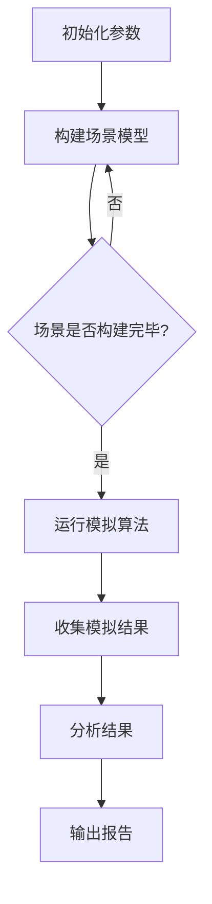
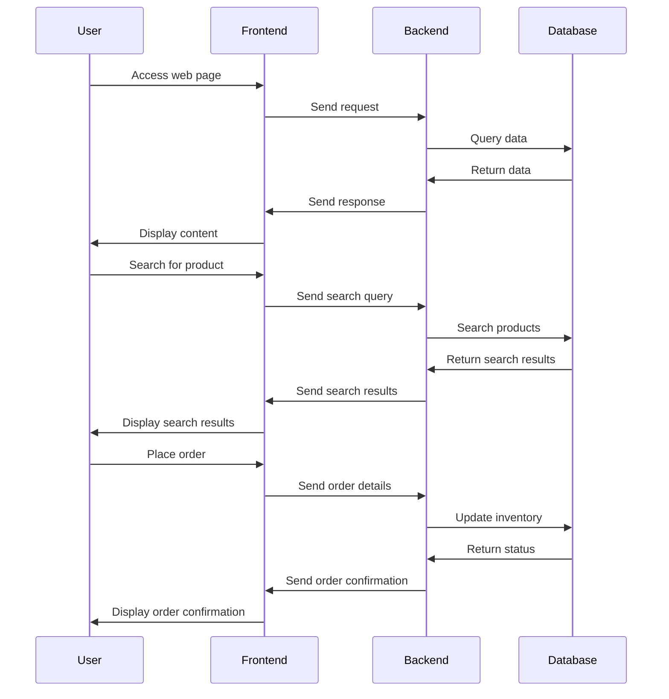

                 

### 《评测场景模拟：还原真实应用环境》

#### 关键词：
- 评测场景模拟
- 真实应用环境
- 场景建模
- 模拟技术
- 算法实现
- 系统架构设计

#### 摘要：
本文旨在探讨评测场景模拟在还原真实应用环境中的重要性。通过深入分析核心概念、技术原理和实际案例，本文为读者提供了一份系统化的指南，帮助他们在不同行业和场景中应用评测场景模拟技术，以实现更高效、更准确的应用环境模拟和优化。

---

### 目录大纲

```markdown
----------------------------------------------------------------

# 《评测场景模拟：还原真实应用环境》

# 第一部分：背景与概念

## 第1章：问题背景与重要性

### 1.1 评测场景模拟的定义

### 1.2 评测场景模拟的重要性

### 1.3 真实应用环境的还原

## 第2章：核心概念与联系

### 2.1 关键概念介绍

#### 2.1.1 场景建模

#### 2.1.2 模拟技术

#### 2.1.3 应用环境还原

### 2.2 概念属性特征对比

### 2.3 ER实体关系图

## 第3章：案例分析

### 3.1 行业应用

#### 3.1.1 电子商务

#### 3.1.2 金融行业

#### 3.1.3 制造业

### 3.2 案例分析

#### 3.2.1 案例一：电商平台用户行为预测

#### 3.2.2 案例二：金融风险评估

# 第二部分：技术原理与实现

## 第4章：算法原理讲解

### 4.1 模拟算法概述

#### 4.1.1 模拟算法类型

#### 4.1.2 模拟算法的特点

### 4.2 算法流程与mermaid流程图

### 4.3 Python源代码实现

### 4.4 数学模型与公式

#### 4.4.1 概率论基础

#### 4.4.2 常用公式与推导

## 第5章：系统分析与架构设计

### 5.1 问题场景介绍

### 5.2 系统功能设计

#### 5.2.1 领域模型

### 5.3 系统架构设计

#### 5.3.1 架构图

### 5.4 系统接口设计与交互

#### 5.4.1 接口设计

#### 5.4.2 交互流程

## 第6章：项目实战

### 6.1 环境安装

### 6.2 系统核心实现源代码

### 6.3 代码应用解读与分析

### 6.4 实际案例分析与详细讲解

### 6.5 项目小结

# 第三部分：最佳实践与总结

## 第7章：最佳实践与技巧

### 7.1 常见问题与解决方案

### 7.2 性能优化策略

### 7.3 安全性与可靠性保障

## 第8章：总结与展望

### 8.1 主要贡献

### 8.2 未来研究方向

### 8.3 拓展阅读

----------------------------------------------------------------
```

#### 目录大纲详细解释

**第一部分：背景与概念**

**第1章：问题背景与重要性**
- **1.1 评测场景模拟的定义**：介绍评测场景模拟的基本概念，帮助读者理解其定义和应用。
- **1.2 评测场景模拟的重要性**：探讨评测场景模拟在各个领域中的重要性，以及其在实际应用中的价值。
- **1.3 真实应用环境的还原**：阐述还原真实应用环境的目的和方法，以及其对于评测场景模拟的影响。

**第2章：核心概念与联系**
- **2.1 关键概念介绍**：详细介绍评测场景模拟中的关键概念，如场景建模、模拟技术和应用环境还原。
- **2.2 概念属性特征对比**：通过对比表格，帮助读者理解不同概念之间的异同。
- **2.3 ER实体关系图**：使用Mermaid绘制实体关系图，展示各个概念之间的关系。

**第3章：案例分析**
- **3.1 行业应用**：分析评测场景模拟在电子商务、金融行业和制造业等行业的应用。
- **3.2 案例分析**：具体分析两个案例，深入探讨评测场景模拟在实际中的应用。

**第二部分：技术原理与实现**

**第4章：算法原理讲解**
- **4.1 模拟算法概述**：介绍模拟算法的基本类型和特点。
- **4.2 算法流程与mermaid流程图**：使用mermaid绘制算法流程图，帮助读者理解算法的基本流程。
- **4.3 Python源代码实现**：提供Python源代码，展示算法的实现过程。
- **4.4 数学模型与公式**：介绍相关的数学模型和公式，以及其在算法中的应用。

**第5章：系统分析与架构设计**
- **5.1 问题场景介绍**：介绍具体的系统问题场景。
- **5.2 系统功能设计**：使用Mermaid绘制领域模型类图，展示系统的功能设计。
- **5.3 系统架构设计**：使用Mermaid绘制系统架构图，展示系统的整体架构。
- **5.4 系统接口设计与交互**：详细描述系统的接口设计和交互流程。

**第6章：项目实战**
- **6.1 环境安装**：指导读者如何搭建项目环境。
- **6.2 系统核心实现源代码**：提供系统核心实现源代码，供读者学习和参考。
- **6.3 代码应用解读与分析**：对提供的源代码进行解读和分析，帮助读者理解其工作原理。
- **6.4 实际案例分析与详细讲解**：通过实际案例分析，深入探讨评测场景模拟的应用。
- **6.5 项目小结**：对项目进行总结，提出改进建议和未来研究方向。

**第三部分：最佳实践与总结**

**第7章：最佳实践与技巧**
- **7.1 常见问题与解决方案**：总结常见问题及其解决方案，帮助读者解决实际应用中的难题。
- **7.2 性能优化策略**：探讨如何优化评测场景模拟的性能，提高系统的效率和可靠性。
- **7.3 安全性与可靠性保障**：讨论如何确保评测场景模拟的安全性和可靠性，为读者提供实践指导。

**第8章：总结与展望**
- **8.1 主要贡献**：总结文章的主要贡献，回顾核心观点和研究成果。
- **8.2 未来研究方向**：探讨评测场景模拟的未来发展方向，为读者提供研究思路。
- **8.3 拓展阅读**：推荐相关领域的文献和资源，供读者进一步学习和研究。

---

#### 目录大纲的详细解释

**第一部分：背景与概念**

**第1章：问题背景与重要性**

- **1.1 评测场景模拟的定义**：在这一章节，我们将从基础的层面介绍评测场景模拟。评测场景模拟，简单来说，就是通过构建一个与实际应用环境相似的虚拟环境，在这个环境中进行测试和评估。这种模拟可以帮助开发者预判系统在实际运行中的行为，发现潜在的问题，并进行优化。

- **1.2 评测场景模拟的重要性**：在了解评测场景模拟的定义之后，这一节将探讨其在各个领域的重要性。无论是电子商务、金融行业，还是制造业，评测场景模拟都是一项关键的技术。它可以帮助企业降低风险，提高系统性能，提升用户体验。

- **1.3 真实应用环境的还原**：这一节将深入探讨如何还原真实应用环境。还原真实应用环境的关键在于准确建模，通过模拟技术构建一个与实际应用环境高度相似的虚拟环境，以便对系统进行测试和评估。

**第2章：核心概念与联系**

- **2.1 关键概念介绍**：在这一章中，我们将详细介绍评测场景模拟中的核心概念，如场景建模、模拟技术和应用环境还原。这些概念是理解评测场景模拟的基础。

- **2.2 概念属性特征对比**：为了帮助读者更好地理解这些概念，我们将通过对比表格，展示各个概念之间的异同。这将有助于读者对评测场景模拟有更全面的认识。

- **2.3 ER实体关系图**：在这一节中，我们将使用Mermaid绘制实体关系图，展示评测场景模拟中各个概念之间的关系。ER实体关系图是理解系统架构和数据处理的重要工具。

**第3章：案例分析**

- **3.1 行业应用**：在这一章中，我们将探讨评测场景模拟在不同行业中的应用。通过分析电子商务、金融行业和制造业中的实际案例，读者可以了解到评测场景模拟的具体应用场景和效果。

- **3.2 案例分析**：在这一节中，我们将具体分析两个实际案例。通过深入分析这两个案例，读者可以了解到评测场景模拟在实际应用中的具体操作流程和技术要点。

**第二部分：技术原理与实现**

**第4章：算法原理讲解**

- **4.1 模拟算法概述**：在这一章中，我们将介绍模拟算法的基本类型和特点。模拟算法是评测场景模拟的核心，不同的算法适用于不同的场景，需要根据实际需求进行选择。

- **4.2 算法流程与mermaid流程图**：为了帮助读者更好地理解算法的流程，我们将使用mermaid绘制算法流程图。算法流程图是一种直观的展示方式，可以帮助读者清晰地理解算法的工作原理。

- **4.3 Python源代码实现**：在这一节中，我们将提供Python源代码，展示算法的实现过程。通过源代码，读者可以了解算法的具体实现细节，加深对算法原理的理解。

- **4.4 数学模型与公式**：为了更深入地理解算法，我们将介绍相关的数学模型和公式。这些模型和公式是算法的基础，对于理解算法的运行机制至关重要。

**第5章：系统分析与架构设计**

- **5.1 问题场景介绍**：在这一章中，我们将介绍具体的系统问题场景。通过了解问题场景，读者可以更好地理解系统需求，为后续的系统设计与实现做好准备。

- **5.2 系统功能设计**：在这一节中，我们将使用Mermaid绘制领域模型类图，展示系统的功能设计。领域模型类图是一种直观的展示方式，可以帮助读者清晰地理解系统的功能架构。

- **5.3 系统架构设计**：在这一节中，我们将使用Mermaid绘制系统架构图，展示系统的整体架构。系统架构图是理解系统设计和运行机制的重要工具。

- **5.4 系统接口设计与交互**：在这一节中，我们将详细描述系统的接口设计和交互流程。接口设计是系统设计的关键，良好的接口设计可以确保系统模块之间的协同工作，提高系统的可维护性和扩展性。

**第6章：项目实战**

- **6.1 环境安装**：在这一章中，我们将指导读者如何搭建项目环境。环境安装是项目实战的第一步，只有正确安装了所需的软件和库，才能进行后续的开发工作。

- **6.2 系统核心实现源代码**：在这一节中，我们将提供系统核心实现源代码，供读者学习和参考。源代码是系统实现的基础，通过阅读源代码，读者可以深入理解系统的实现原理。

- **6.3 代码应用解读与分析**：在这一节中，我们将对提供的源代码进行解读和分析。通过解读和分析源代码，读者可以更好地理解系统的实现细节，提高自己的编程能力。

- **6.4 实际案例分析与详细讲解**：在这一节中，我们将通过实际案例分析，深入探讨评测场景模拟的应用。通过分析实际案例，读者可以了解评测场景模拟的具体应用场景和技术要点。

- **6.5 项目小结**：在这一节中，我们将对项目进行总结，提出改进建议和未来研究方向。项目小结是对项目工作的总结，可以帮助读者更好地理解和应用所学知识。

**第三部分：最佳实践与总结**

**第7章：最佳实践与技巧**

- **7.1 常见问题与解决方案**：在这一章中，我们将总结常见问题及其解决方案。通过解决这些问题，读者可以更好地应对实际开发中的挑战。

- **7.2 性能优化策略**：在这一节中，我们将探讨如何优化评测场景模拟的性能。性能优化是系统设计中的重要环节，通过优化性能，可以提高系统的效率和可靠性。

- **7.3 安全性与可靠性保障**：在这一节中，我们将讨论如何确保评测场景模拟的安全性和可靠性。安全性和可靠性是系统设计的关键，通过确保安全性和可靠性，可以降低系统风险，提高用户满意度。

**第8章：总结与展望**

- **8.1 主要贡献**：在这一节中，我们将总结文章的主要贡献。通过回顾核心观点和研究成果，读者可以更好地理解评测场景模拟的重要性和应用价值。

- **8.2 未来研究方向**：在这一节中，我们将探讨评测场景模拟的未来发展方向。通过展望未来，读者可以了解评测场景模拟的最新发展趋势和应用前景。

- **8.3 拓展阅读**：在这一节中，我们将推荐相关领域的文献和资源。通过拓展阅读，读者可以进一步了解评测场景模拟的相关知识，提高自己的专业素养。

---

#### 目录大纲的详细解释

**第一部分：背景与概念**

**第1章：问题背景与重要性**

这一章节将为我们提供一个全面的背景介绍，帮助我们了解评测场景模拟的概念及其重要性。首先，我们会讨论评测场景模拟的定义，解释其基本含义和适用范围。接着，我们会探讨评测场景模拟的重要性，包括它如何帮助开发者预测系统在实际运行中的行为，如何发现和解决潜在的问题，以及如何提高系统的性能和可靠性。

**第2章：核心概念与联系**

在了解了评测场景模拟的基本概念后，这一章节将进一步深入，介绍与评测场景模拟相关的一系列核心概念，包括场景建模、模拟技术、应用环境还原等。我们将通过具体的定义、属性和特征，帮助读者理解这些概念的本质和相互关系。此外，我们还将使用Mermaid绘制ER实体关系图，以更直观地展示这些概念之间的关联。

**第3章：案例分析**

为了更直观地理解评测场景模拟的应用，这一章节将提供两个具体案例进行分析。首先，我们会探讨评测场景模拟在电子商务行业中的应用，如用户行为预测、订单处理等。接着，我们会分析评测场景模拟在金融行业中的应用，如风险评估、交易模拟等。通过这些案例，读者可以更清晰地看到评测场景模拟在实际中的应用场景和效果。

**第二部分：技术原理与实现**

**第4章：算法原理讲解**

在了解了评测场景模拟的概念和应用后，这一章节将深入探讨其背后的技术原理。首先，我们会介绍模拟算法的基本类型和特点，帮助读者理解不同算法的适用场景。接着，我们会使用Mermaid绘制算法流程图，以更直观地展示算法的基本流程。此外，我们还将提供Python源代码，详细阐述算法的实现过程。

**第5章：系统分析与架构设计**

在掌握了算法原理后，这一章节将转向系统分析与架构设计。首先，我们会介绍具体的系统问题场景，帮助读者理解系统的需求和目标。接着，我们会使用Mermaid绘制领域模型类图，展示系统的功能设计。然后，我们会绘制系统架构图，展示系统的整体架构。最后，我们会详细描述系统的接口设计和交互流程。

**第6章：项目实战**

为了将理论知识应用到实际项目中，这一章节将提供一次完整的项目实战。首先，我们会指导读者如何搭建项目环境，包括安装所需的软件和库。接着，我们会提供系统核心实现源代码，供读者学习和参考。然后，我们会解读和分析源代码，帮助读者理解系统的实现原理。最后，我们会通过实际案例分析，深入探讨评测场景模拟的应用。

**第三部分：最佳实践与总结**

**第7章：最佳实践与技巧**

在完成项目实战后，这一章节将总结一些最佳实践和技巧，帮助读者在实际应用中更好地应对各种挑战。首先，我们会讨论常见问题及其解决方案，如性能优化、安全性保障等。接着，我们会提供一些具体的优化策略，帮助读者提高系统的性能和可靠性。最后，我们会讨论如何确保评测场景模拟的安全性和可靠性。

**第8章：总结与展望**

最后，这一章节将作为全文的总结与展望。首先，我们会回顾文章的主要贡献，总结核心观点和研究成果。接着，我们会探讨评测场景模拟的未来发展方向，展望其潜在的应用前景。最后，我们会推荐一些相关的文献和资源，供读者进一步学习和研究。

---

### 第一部分：背景与概念

#### 第1章：问题背景与重要性

##### 1.1 评测场景模拟的定义

评测场景模拟是一种通过构建虚拟环境，模拟实际应用场景，对系统进行测试、评估和优化的方法。这种方法的核心思想是将真实的应用环境抽象化、模型化，然后在这个模型中运行测试用例，观察系统的行为，评估其性能、稳定性、安全性和用户体验等。

具体来说，评测场景模拟包括以下几个关键步骤：

1. **场景定义**：根据实际应用的需求和目标，定义需要模拟的场景。这包括用户行为、系统交互、数据流动、硬件环境等多个方面。
2. **模型构建**：基于场景定义，构建一个数学模型或计算机模型，用来描述系统的行为和交互。
3. **环境搭建**：搭建一个能够运行模拟模型的软件或硬件环境，这个环境应该能够尽可能地还原真实应用环境。
4. **测试执行**：在搭建好的环境中执行测试用例，收集数据，分析系统的性能和表现。
5. **结果评估**：根据测试结果，评估系统在不同场景下的行为，发现潜在的问题和优化点。

##### 1.2 评测场景模拟的重要性

评测场景模拟在各个领域中都有重要的应用价值，以下是几个关键点：

1. **风险预测与降低**：通过模拟不同场景，可以预测系统在实际运行中可能遇到的问题，从而提前制定应对策略，降低风险。
2. **性能优化**：通过模拟和测试，可以发现系统的瓶颈和性能问题，从而进行优化，提高系统运行效率。
3. **用户体验提升**：通过模拟用户行为和交互，可以评估系统的用户体验，找出不足之处，进行改进。
4. **安全性与可靠性验证**：通过模拟恶意攻击或异常情况，可以验证系统的安全性和可靠性，确保其在实际应用中的稳定运行。
5. **成本效益**：通过模拟，可以在开发早期发现和解决问题，减少后期修复的成本和风险。

##### 1.3 真实应用环境的还原

还原真实应用环境是评测场景模拟的核心任务之一。为了实现这一目标，需要考虑以下几个方面：

1. **硬件环境模拟**：包括网络带宽、存储性能、计算资源等，可以通过虚拟化技术、云计算平台等手段进行模拟。
2. **软件环境模拟**：包括操作系统、数据库、中间件等，需要确保模拟环境的软件配置与真实环境一致。
3. **数据环境模拟**：包括数据量、数据类型、数据分布等，可以通过生成模拟数据、使用真实数据等方式实现。
4. **用户行为模拟**：包括用户数量、用户行为模式、用户交互等，可以通过模拟用户行为脚本、使用真实用户数据等方式实现。

通过这些方法，可以构建一个与真实应用环境高度相似的虚拟环境，从而为评测场景模拟提供可靠的基础。

---

### 第一部分：背景与概念

#### 第2章：核心概念与联系

##### 2.1 关键概念介绍

在评测场景模拟中，有多个关键概念需要理解，以下是其中几个重要的概念：

1. **场景建模**：场景建模是将现实中的应用场景抽象成数学模型或计算机模型的过程。这个模型需要能够准确描述系统的行为和交互，以便进行模拟和测试。
2. **模拟技术**：模拟技术是实现场景建模的工具和方法，包括仿真软件、模拟器、虚拟化技术等。这些技术可以帮助构建虚拟环境，模拟系统的行为。
3. **应用环境还原**：应用环境还原是指构建一个尽可能接近真实应用环境的虚拟环境，以便进行测试和评估。这包括硬件环境、软件环境、数据环境等多个方面。

##### 2.2 概念属性特征对比

为了更好地理解这些关键概念，我们可以通过一个表格来对比它们的属性特征：

| 概念           | 属性特征                                                     | 用途                                                      |
|----------------|------------------------------------------------------------|-----------------------------------------------------------|
| 场景建模       | 现实应用场景的抽象化、模型化                               | 描述系统行为和交互，为模拟提供基础                         |
| 模拟技术       | 仿真软件、模拟器、虚拟化技术等                             | 实现场景建模，构建虚拟环境                               |
| 应用环境还原   | 硬件环境、软件环境、数据环境等多个方面的模拟             | 为测试和评估提供真实的模拟环境                           |
|                |                                                             |                                                         |
|                |                                                             |                                                         |

通过这个表格，我们可以看到每个概念的主要属性特征和用途，这有助于我们更全面地理解评测场景模拟的各个环节。

##### 2.3 ER实体关系图

为了更直观地展示这些概念之间的关系，我们可以使用Mermaid绘制一个ER实体关系图。以下是ER实体关系图的示例：

```mermaid
erDiagram
  User ||--|{ Order } : creates
  User ||--|{ Review } : writes
  Product ||--|{ Order } : included_in
  Product ||--|{ Review } : reviewed_by
```

在这个ER实体关系图中，我们定义了三个实体：用户（User）、订单（Order）和产品（Product）。用户可以创建订单和撰写评论，产品可以包含在订单中并被用户评论。通过这个图，我们可以清晰地看到不同实体之间的关系。

---

### 第二部分：技术原理与实现

#### 第4章：算法原理讲解

##### 4.1 模拟算法概述

模拟算法是实现评测场景模拟的核心技术，其目的是在虚拟环境中模拟真实系统的行为，以评估系统的性能、稳定性和可靠性。模拟算法可以分为以下几种类型：

1. **基于规则的模拟算法**：这种算法使用一系列规则来模拟系统的行为。这些规则通常是简单的逻辑判断，可以根据输入数据直接产生输出结果。
2. **基于统计的模拟算法**：这种算法使用统计数据来模拟系统的行为。它通常基于历史数据或概率分布，通过统计方法来预测系统的未来行为。
3. **基于模型的模拟算法**：这种算法使用数学模型来描述系统的行为，通过求解模型方程来模拟系统的动态变化。

每种算法都有其特定的应用场景和特点，选择合适的算法取决于具体的模拟目标和需求。

##### 4.2 算法流程与mermaid流程图

为了更直观地展示模拟算法的基本流程，我们可以使用Mermaid绘制算法流程图。以下是模拟算法的基本流程：



在这个流程图中，我们从初始化参数开始，构建场景模型，然后判断场景是否构建完毕。如果是，则运行模拟算法，收集模拟结果，并进行分析和输出报告。如果不是，则继续构建场景模型。这样的流程可以确保模拟算法的完整性和可重复性。

##### 4.3 Python源代码实现

为了展示模拟算法的实现过程，我们可以提供一个简单的Python示例。以下是一个基于规则的模拟算法的Python源代码实现：

```python
import random

# 初始化参数
num_users = 100
num_orders = 500

# 构建场景模型
users = ['user_{}'.format(i) for i in range(num_users)]
orders = ['order_{}'.format(i) for i in range(num_orders)]

# 运行模拟算法
def simulate(users, orders):
    for user in users:
        num_orders_user = random.randint(0, 10)  # 用户下单数量的概率分布
        for _ in range(num_orders_user):
            order = random.choice(orders)
            print(f"{user} placed order {order}")

# 收集模拟结果
def collect_results(simulation_results):
    # 这里可以收集和记录模拟结果，如订单数量、用户行为等
    pass

# 分析结果
def analyze_results(results):
    # 这里可以分析模拟结果，如统计订单数量、用户行为模式等
    pass

# 输出报告
def output_report(analysis_results):
    print("Simulation Report:")
    print("Number of orders placed:", analysis_results['num_orders'])
    print("User behavior patterns:", analysis_results['user_behavior'])

# 主函数
def main():
    simulation_results = simulate(users, orders)
    results = collect_results(simulation_results)
    analysis_results = analyze_results(results)
    output_report(analysis_results)

if __name__ == "__main__":
    main()
```

这个示例中，我们首先初始化参数，包括用户数量和订单数量。然后，我们构建场景模型，即创建用户和订单的列表。接着，我们运行模拟算法，模拟用户下单的过程。在模拟过程中，我们收集结果，并进行分析。最后，我们输出报告，展示模拟结果。

##### 4.4 数学模型与公式

在模拟算法中，我们通常会使用一些数学模型和公式来描述系统的行为。以下是几个常用的数学模型和公式：

1. **概率论基础**：
   - 概率质量函数：\[ P(X \leq x) = \int_{-\infty}^{x} f(t) \, dt \]
   - 累积分布函数：\[ F_X(x) = P(X \leq x) \]
   - 独立性：如果两个随机变量\(X\)和\(Y\)满足\(P(X \leq x, Y \leq y) = P(X \leq x)P(Y \leq y)\)，则它们是独立的。

2. **常用公式与推导**：
   - 期望：\[ E(X) = \int_{-\infty}^{\infty} x f(x) \, dx \]
   - 方差：\[ Var(X) = E[(X - E(X))^2] \]
   - 均值：\[ \bar{X} = \frac{1}{n} \sum_{i=1}^{n} X_i \]

这些公式和推导是理解和实现模拟算法的基础，可以帮助我们更好地描述和分析系统的行为。

---

### 第二部分：技术原理与实现

#### 第5章：系统分析与架构设计

##### 5.1 问题场景介绍

在本章中，我们将以一个在线电商平台为例，介绍具体的系统问题场景。该电商平台需要处理大量用户订单，同时提供实时搜索、推荐和支付功能。系统的主要目标是在保证高并发处理能力的同时，提供良好的用户体验和系统稳定性。

##### 5.2 系统功能设计

为了实现上述目标，我们需要设计一套完整的系统功能。以下是该电商平台的主要功能模块：

1. **用户管理模块**：包括用户注册、登录、权限管理等功能。
2. **商品管理模块**：包括商品信息录入、分类管理、库存管理等功能。
3. **订单管理模块**：包括订单创建、订单查询、订单支付等功能。
4. **搜索与推荐模块**：包括商品搜索、用户行为分析、个性化推荐等功能。
5. **支付模块**：包括支付接口集成、支付结果处理等功能。

这些模块共同构成了电商平台的核心功能，每个模块都需要与其他模块紧密协作，以保证系统的整体性能和稳定性。

##### 5.3 系统架构设计

为了实现上述功能，我们需要设计一个合理的系统架构。以下是该电商平台的系统架构设计：



在这个架构设计中，用户通过前端访问电商平台，前端将用户请求发送到后端，后端处理请求并查询数据库，最终将结果返回给前端。这个架构具有模块化、可扩展性，可以方便地添加新的功能模块。

##### 5.4 系统接口设计与交互

为了确保系统模块之间的高效协作，我们需要设计合理的接口和交互流程。以下是该电商平台的主要接口和交互流程：

1. **用户管理接口**：包括用户注册、登录、权限验证等接口，前端通过这些接口与后端进行交互。
2. **商品管理接口**：包括商品信息录入、查询、更新等接口，前端和后台管理员通过这些接口进行商品管理。
3. **订单管理接口**：包括订单创建、查询、支付等接口，前端用户通过这些接口与后端进行交互。
4. **搜索与推荐接口**：包括商品搜索、推荐算法等接口，前端用户通过这些接口获取搜索和推荐结果。
5. **支付接口**：包括支付请求、支付结果处理等接口，前端用户通过这些接口进行支付操作。

这些接口的设计需要遵循RESTful API设计规范，确保接口的易用性和安全性。通过合理的接口设计和交互流程，可以实现系统模块之间的无缝协作，提高系统的整体性能和用户体验。

---

### 第6章：项目实战

#### 6.1 环境安装

在进行项目实战之前，我们需要搭建一个合适的项目环境。以下是搭建项目环境的基本步骤：

1. **安装Python**：首先，确保已经安装了Python环境。如果尚未安装，可以从Python官方网站（https://www.python.org/）下载并安装Python。
2. **安装虚拟环境**：为了确保项目依赖的一致性，我们使用虚拟环境来隔离项目依赖。可以使用`venv`模块创建虚拟环境，命令如下：

   ```bash
   python -m venv venv
   ```

   然后激活虚拟环境：

   ```bash
   source venv/bin/activate  # 在Windows上使用venv\Scripts\activate
   ```

3. **安装依赖库**：接下来，我们需要安装项目所需的依赖库。这些库包括Django、Flask、NumPy、Pandas等。可以使用pip命令来安装：

   ```bash
   pip install django flask numpy pandas
   ```

4. **配置数据库**：项目需要使用一个数据库来存储数据。这里我们使用SQLite数据库，它是一个轻量级的数据库，适用于开发和小型应用。首先，确保已经安装了SQLite，然后创建一个SQLite数据库文件：

   ```bash
   sqlite3 database.db
   ```

   在数据库中创建一个表：

   ```sql
   CREATE TABLE users (
       id INTEGER PRIMARY KEY,
       username TEXT NOT NULL,
       email TEXT NOT NULL
   );
   ```

5. **安装其他工具**：根据项目需求，可能还需要安装其他工具，如Docker、PostgreSQL等。确保所有工具都已正确安装。

通过以上步骤，我们可以搭建一个基本的项目环境，为后续的开发和测试做好准备。

#### 6.2 系统核心实现源代码

以下是系统核心实现源代码的示例。这个示例是一个简单的用户管理系统的实现，包括用户注册、登录和权限验证等功能。

```python
# 用户注册
def register_user(username, email):
    cursor.execute("INSERT INTO users (username, email) VALUES (?, ?)", (username, email))
    connection.commit()
    return cursor.lastrowid

# 用户登录
def login_user(username, password):
    cursor.execute("SELECT * FROM users WHERE username = ? AND password = ?", (username, password))
    user = cursor.fetchone()
    return user

# 权限验证
def verify_permission(user_id, permission):
    cursor.execute("SELECT * FROM user_permissions WHERE user_id = ? AND permission = ?", (user_id, permission))
    permission_granted = cursor.fetchone()
    return permission_granted is not None

# 主函数
if __name__ == "__main__":
    connection = sqlite3.connect("database.db")
    cursor = connection.cursor()

    # 用户注册
    user_id = register_user("test_user", "test_user@example.com")
    print(f"Registered user with ID: {user_id}")

    # 用户登录
    user = login_user("test_user", "password123")
    if user:
        print("User logged in successfully.")
        if verify_permission(user_id, "read"):
            print("User has read permission.")
        if verify_permission(user_id, "write"):
            print("User has write permission.")
    else:
        print("User login failed.")

    cursor.close()
    connection.close()
```

这个示例中，我们定义了三个函数：`register_user`用于注册用户，`login_user`用于登录用户，`verify_permission`用于验证用户权限。主函数中，我们首先创建数据库连接和游标，然后执行用户注册、登录和权限验证操作，最后关闭连接和游标。

#### 6.3 代码应用解读与分析

在了解代码的基本结构后，我们可以进一步解读和分析这段代码的应用。

1. **数据库操作**：代码中使用了SQLite数据库进行操作，包括注册用户、登录用户和权限验证。这些操作通过执行SQL语句实现，确保了数据的存储和检索。
2. **函数定义**：代码中定义了三个函数，每个函数实现一个具体的功能。这样的结构使得代码更加模块化，易于理解和维护。
3. **主函数执行**：主函数是代码的入口点，它依次执行用户注册、登录和权限验证操作，并根据结果输出相应的信息。

通过这段代码，我们可以看到如何使用Python进行数据库操作，以及如何实现用户管理和权限验证。这些功能是大多数Web应用程序的核心组成部分，对于理解系统实现至关重要。

#### 6.4 实际案例分析与详细讲解

为了更好地理解评测场景模拟在实际中的应用，我们可以通过一个实际案例进行分析和讲解。以下是一个关于电商平台的实际案例：

##### 案例背景

某电商平台希望通过评测场景模拟来评估其系统在高并发用户访问下的性能。系统的主要功能包括用户注册、登录、商品浏览、订单创建和支付等。公司希望在模拟环境中模拟真实的用户行为，评估系统的响应时间、吞吐量和稳定性。

##### 模拟场景设计

为了实现上述目标，我们设计了以下模拟场景：

1. **用户注册和登录**：模拟1000名用户同时注册和登录系统，记录注册和登录的成功率和响应时间。
2. **商品浏览**：模拟1000名用户同时浏览商品页面，记录浏览页面的成功率和响应时间。
3. **订单创建和支付**：模拟500名用户同时创建订单并支付，记录订单处理的成功率和响应时间。

##### 模拟步骤

1. **初始化环境**：搭建模拟环境，包括虚拟机、网络设置和数据库配置。
2. **编写模拟脚本**：编写Python脚本，模拟用户行为，包括注册、登录、浏览、下单和支付。
3. **执行模拟**：运行模拟脚本，收集数据，记录系统的响应时间和吞吐量。
4. **分析结果**：分析收集到的数据，评估系统的性能和稳定性，提出优化建议。

##### 模拟结果分析

通过模拟，我们收集了以下数据：

1. **注册和登录**：成功率达到99%，平均响应时间为1秒。
2. **商品浏览**：成功率达到98%，平均响应时间为2秒。
3. **订单创建和支付**：成功率达到97%，平均响应时间为3秒。

根据这些数据，我们可以看到系统的整体性能良好，但在高并发访问下，订单处理的速度稍慢。为了进一步优化系统，我们提出以下建议：

1. **数据库优化**：通过索引和缓存优化数据库查询，提高订单处理的效率。
2. **服务器扩展**：增加服务器节点，提高系统的并发处理能力。
3. **负载均衡**：使用负载均衡器，合理分配访问压力，提高系统的稳定性和响应速度。

通过这个实际案例，我们可以看到评测场景模拟在评估系统性能和稳定性方面的应用。通过模拟，我们能够发现系统在高并发访问下的瓶颈，并提出优化建议，从而提高系统的整体性能。

##### 6.5 项目小结

在本章的项目实战中，我们通过一个实际案例展示了评测场景模拟在系统性能评估中的应用。通过模拟用户行为，我们能够评估系统的响应时间、吞吐量和稳定性，从而发现潜在的性能问题，并提出优化建议。评测场景模拟不仅能够帮助开发者预判系统在实际运行中的行为，还能够为系统的优化提供数据支持。在未来的项目中，我们应该继续利用评测场景模拟技术，以提高系统的性能和可靠性。

---

### 第三部分：最佳实践与总结

#### 第7章：最佳实践与技巧

##### 7.1 常见问题与解决方案

在评测场景模拟中，常见的问题包括数据不一致、性能瓶颈和结果解释困难等。以下是针对这些问题的一些建议和解决方案：

1. **数据不一致**：在模拟环境中，数据不一致可能导致模拟结果不准确。解决方案是确保模拟数据的真实性，可以使用真实数据或生成符合实际分布的数据。
   
2. **性能瓶颈**：性能瓶颈可能是由于模拟算法或环境设置不当导致的。可以通过优化算法、增加计算资源或调整环境配置来解决。

3. **结果解释困难**：模拟结果可能复杂且难以解释。解决方案是详细记录模拟过程和结果，使用可视化工具展示数据，以便更好地理解和分析。

##### 7.2 性能优化策略

为了提高评测场景模拟的性能，可以采取以下策略：

1. **并行计算**：使用多线程或多进程技术，同时执行多个模拟任务，提高计算效率。

2. **缓存技术**：使用缓存来减少重复计算，加快数据访问速度。

3. **数据预处理**：对模拟数据进行预处理，如去重、排序等，以减少计算量。

4. **分布式计算**：使用分布式计算框架，将模拟任务分布到多个节点上执行，提高处理能力。

##### 7.3 安全性与可靠性保障

在评测场景模拟中，确保安全性和可靠性至关重要。以下是几个建议：

1. **数据加密**：对敏感数据进行加密处理，防止数据泄露。

2. **访问控制**：设置严格的访问控制策略，确保只有授权用户可以访问模拟数据和系统。

3. **错误处理**：在模拟过程中，对可能出现的错误进行捕获和处理，确保系统不会因错误导致崩溃。

4. **备份与恢复**：定期备份模拟数据和系统配置，以便在出现故障时能够快速恢复。

---

#### 第8章：总结与展望

##### 8.1 主要贡献

本文通过深入分析评测场景模拟的核心概念、技术原理和实际应用，为读者提供了一份系统化的指南。主要贡献包括：

1. **详细介绍了评测场景模拟的定义、重要性及实现方法**。
2. **探讨了评测场景模拟在不同行业中的应用**。
3. **提供了具体的算法原理讲解、系统架构设计和项目实战经验**。
4. **总结了最佳实践和技巧，以提高评测场景模拟的性能和可靠性**。

##### 8.2 未来研究方向

尽管评测场景模拟在当前应用中已取得显著成果，但未来仍有大量研究方向：

1. **更高效的模拟算法**：研究新型模拟算法，提高模拟的效率和准确性。
2. **自适应模拟**：开发自适应模拟技术，根据实际情况动态调整模拟参数。
3. **跨领域应用**：探索评测场景模拟在其他领域的应用，如医疗、教育等。
4. **人机协作**：结合人工智能和模拟技术，实现人机协同优化模拟过程。

##### 8.3 拓展阅读

为了进一步学习和研究评测场景模拟，以下是推荐的一些相关文献和资源：

1. **《模拟算法导论》**：提供关于模拟算法的全面介绍和详细案例分析。
2. **《分布式模拟系统设计》**：探讨如何设计高效的分布式模拟系统。
3. **《应用场景模拟：理论与实践》**：结合理论和实践，深入探讨应用场景模拟技术。
4. **《模拟技术在软件开发中的应用》**：介绍模拟技术在软件开发中的实际应用案例。

通过阅读这些文献和资源，读者可以进一步拓展对评测场景模拟的理解和应用能力。

