                 


### 引言

在当今信息化时代，评测指标在各个领域中都扮演着至关重要的角色。从学术研究到商业应用，从软件开发到人工智能，评测指标不仅能够帮助我们衡量系统的性能和效果，还能够指导我们进行优化和改进。然而，传统的评测指标往往存在一定的局限性，难以适应快速变化的环境和需求。为了解决这一问题，我们需要设计一个能够动态调整评测指标的自适应评估系统。本文将探讨如何利用大型语言模型（LLM）来辅助构建这样的系统，以实现评测指标的智能化和自动化调整。

#### 动态调整评测指标的重要性

随着科技的快速发展，各种应用场景和需求也在不断变化。传统的评测指标往往基于静态的、预设的规则和标准，难以应对这些动态变化。例如，在人工智能领域，随着算法和模型的发展，我们需要对评测指标进行调整，以便更好地评估模型的性能和效果。另外，在商业应用中，市场环境和用户需求也在不断变化，传统的评测指标可能无法准确反映产品的价值和表现。因此，动态调整评测指标成为了一种必然的需求。

#### LLM的作用

大型语言模型（LLM）作为一种强大的自然语言处理技术，已经在各个领域展现出了巨大的潜力。LLM可以通过学习大量的文本数据，理解语言的结构和语义，从而实现对自然语言的生成、理解和推理。在评测指标动态调整中，LLM可以发挥以下作用：

1. **自动生成评测指标**：LLM可以根据历史数据和需求，自动生成适应不同场景的评测指标。
2. **优化评测指标**：LLM可以分析现有评测指标的优缺点，并提出改进方案，优化评测指标。
3. **解释评测指标**：LLM可以帮助用户理解评测指标的含义和作用，提高评测指标的透明度和可解释性。
4. **自适应调整**：LLM可以根据实时数据和环境变化，动态调整评测指标，确保其准确性和有效性。

#### 本文结构

本文将分为以下几个部分：

1. **核心概念与联系**：介绍评测指标、动态调整和LLM的相关概念，并阐述它们之间的联系。
2. **算法原理讲解**：详细讲解如何利用LLM实现评测指标的动态调整，包括算法的数学模型和具体实现。
3. **系统分析与架构设计方案**：介绍如何设计一个基于LLM的自适应评估系统。
4. **项目实战**：通过实际案例展示如何应用这些理论。
5. **最佳实践 tips**：分享一些在实际应用中需要注意的技巧和注意事项。
6. **小结**：总结全文，展望未来的发展趋势。

通过本文的阅读，读者将了解如何利用LLM构建一个自适应评估系统，掌握动态调整评测指标的方法和技巧，并为未来的研究和工作提供参考。接下来，我们将深入探讨这些核心概念和原理。

#### 核心概念与联系

在本节中，我们将详细介绍评测指标、动态调整和大型语言模型（LLM）这三个核心概念，并探讨它们之间的联系。

##### 评测指标

评测指标是用于衡量系统、模型或产品性能的一系列度量标准。它们可以是定量的，如响应时间、吞吐量、准确率等，也可以是定性的，如用户体验、用户满意度等。评测指标的选择和应用对于评估系统性能和优化设计方案至关重要。常见的评测指标包括：

1. **性能指标**：衡量系统运行效率的指标，如响应时间、延迟、吞吐量等。
2. **质量指标**：衡量系统或模型质量的指标，如准确率、召回率、F1分数等。
3. **用户体验指标**：衡量用户对系统或产品使用体验的指标，如满意度、留存率等。

##### 动态调整

动态调整是指根据实时数据和环境变化，对评测指标进行实时调整的过程。动态调整的目标是确保评测指标的准确性和有效性，使其能够适应不断变化的应用场景和需求。动态调整的重要性体现在以下几个方面：

1. **适应环境变化**：随着环境变化，传统的评测指标可能不再适用。动态调整能够根据实时数据和环境变化，自动调整评测指标，确保其准确性。
2. **优化决策过程**：动态调整能够帮助决策者根据实时数据做出更准确的决策，提高系统的优化效果。
3. **提高系统性能**：通过动态调整评测指标，可以优化系统的运行效率，提高系统性能。

##### LLM

大型语言模型（LLM）是一种基于深度学习的自然语言处理技术，它可以对大量的文本数据进行分析和理解，生成或理解复杂的自然语言。LLM的核心优势在于其强大的语义理解能力和自动化学习能力。LLM的主要特性包括：

1. **语义理解**：LLM可以理解文本的语义，从而进行文本生成、分类、摘要等任务。
2. **自动化学习**：LLM可以通过不断的学习和优化，提高其处理能力和准确性。
3. **多样性生成**：LLM可以生成多样性的文本内容，从而适应不同的应用场景和需求。

##### 评测指标与动态调整的联系

评测指标和动态调整密切相关。动态调整的目的是为了确保评测指标的准确性和有效性，使其能够适应不断变化的环境和应用场景。具体来说，动态调整评测指标的步骤包括：

1. **数据收集**：收集与评测指标相关的实时数据，包括系统运行数据、用户行为数据等。
2. **数据分析**：对收集到的数据进行处理和分析，识别数据中的变化趋势和规律。
3. **指标调整**：根据分析结果，调整评测指标的参数和标准，使其更加准确和有效。

##### LLM与动态调整的联系

LLM在动态调整评测指标中起到了关键作用。通过LLM，我们可以实现以下目标：

1. **自动生成评测指标**：LLM可以根据历史数据和需求，自动生成适应不同场景的评测指标。
2. **优化评测指标**：LLM可以分析现有评测指标的优缺点，并提出改进方案，优化评测指标。
3. **解释评测指标**：LLM可以帮助用户理解评测指标的含义和作用，提高评测指标的透明度和可解释性。
4. **自适应调整**：LLM可以根据实时数据和环境变化，动态调整评测指标，确保其准确性和有效性。

##### ER实体关系图架构

为了更好地理解评测指标、动态调整和LLM之间的联系，我们可以使用Mermaid绘制一个ER实体关系图。以下是一个简化的ER实体关系图示例：

```mermaid
erDiagram
    A评测指标 ||--o> B动态调整
    A评测指标 ||--o> CLLM
    B动态调整 ||--o> D实时数据
    B动态调整 ||--o> E数据分析
    CLLM ||--o> F语义理解
    CLLM ||--o> G自动化学习
```

在这个ER实体关系图中，A表示评测指标，B表示动态调整，C表示LLM，D表示实时数据，E表示数据分析，F表示语义理解，G表示自动化学习。箭头表示实体之间的关系，例如评测指标与动态调整之间存在依赖关系，动态调整依赖于实时数据和分析结果，而LLM则与评测指标和动态调整密切相关。

通过ER实体关系图，我们可以更清晰地理解评测指标、动态调整和LLM之间的联系和交互，为后续的算法原理讲解和系统设计与实现提供基础。

### 算法原理讲解

在本节中，我们将详细讲解如何利用大型语言模型（LLM）实现评测指标的动态调整。具体来说，我们将介绍LLM在动态调整中的应用、算法的数学模型、具体实现步骤，并通过示例来说明算法的原理和实际效果。

#### LLM在动态调整中的应用

LLM在动态调整评测指标中的应用主要体现在以下几个方面：

1. **自动生成评测指标**：LLM可以通过学习大量的文本数据，理解不同场景下的需求，自动生成适应不同应用场景的评测指标。
2. **优化评测指标**：LLM可以分析现有评测指标的优缺点，基于历史数据和学习结果，提出改进方案，优化评测指标。
3. **解释评测指标**：LLM可以帮助用户理解评测指标的含义和作用，提高评测指标的透明度和可解释性。
4. **自适应调整**：LLM可以根据实时数据和环境变化，动态调整评测指标的参数和标准，确保评测指标的准确性和有效性。

#### 算法的数学模型

为了实现评测指标的动态调整，我们可以构建一个基于LLM的数学模型。这个模型主要包括以下几个部分：

1. **输入数据**：包括历史数据、实时数据和用户需求等。
2. **特征提取**：利用LLM对输入数据进行特征提取，提取出与评测指标相关的关键特征。
3. **模型训练**：使用提取到的特征数据训练LLM，使其能够预测和生成评测指标。
4. **指标调整**：根据LLM的预测结果，动态调整评测指标的参数和标准。

具体的数学模型可以表示为：

$$
f(\text{Input}) = \text{LLM}(\text{Input}) \rightarrow \text{FeatureVector}
$$

$$
\text{FeatureVector} \rightarrow \text{Model}(\text{FeatureVector}) = \text{Prediction}
$$

$$
\text{Prediction} \rightarrow \text{Adjustment}(\text{Prediction}) = \text{AdjustedMetrics}
$$

其中，$f(\text{Input})$表示特征提取过程，$\text{LLM}(\text{Input})$表示LLM的输入和输出，$\text{FeatureVector}$表示提取到的特征向量，$\text{Model}(\text{FeatureVector})$表示模型训练过程，$\text{Prediction}$表示预测结果，$\text{Adjustment}(\text{Prediction})$表示指标调整过程，$\text{AdjustedMetrics}$表示调整后的评测指标。

#### 具体实现步骤

1. **数据收集**：收集与评测指标相关的历史数据、实时数据和用户需求，包括性能数据、用户体验数据等。
2. **数据预处理**：对收集到的数据进行清洗、归一化等预处理操作，确保数据的质量和一致性。
3. **特征提取**：利用LLM对预处理后的数据进行特征提取，提取出与评测指标相关的关键特征。
4. **模型训练**：使用提取到的特征数据训练LLM，使其能够预测和生成评测指标。
5. **指标调整**：根据LLM的预测结果，动态调整评测指标的参数和标准，确保评测指标的准确性和有效性。

#### 实例说明

假设我们有一个在线教育平台，需要动态调整教学质量评估指标。以下是具体的实现步骤：

1. **数据收集**：收集学生的学习数据、考试成绩、师生互动数据等。
2. **数据预处理**：清洗数据，归一化处理，确保数据质量。
3. **特征提取**：利用LLM提取学习数据中的关键特征，如学习时长、学习频率、考试成绩等。
4. **模型训练**：使用提取到的特征数据训练LLM，使其能够预测教学质量的评测指标，如学生满意度、学习效果等。
5. **指标调整**：根据LLM的预测结果，动态调整教学质量评估指标的参数和标准，如调整学生满意度权重、学习效果权重等。

通过上述步骤，我们可以构建一个基于LLM的自适应教学质量评估系统，实时监测和调整教学质量评估指标，提高评估的准确性和有效性。

#### 实际效果

通过实际应用，我们发现基于LLM的动态调整评测指标系统在多个方面表现优异：

1. **准确性**：LLM可以根据实时数据和环境变化，动态调整评测指标的参数和标准，确保评估的准确性。
2. **效率**：相比传统的静态评测指标，动态调整评测指标可以更快地适应环境变化，提高系统的运行效率。
3. **可解释性**：LLM可以解释评测指标的生成和调整过程，提高评估结果的可解释性，便于用户理解和使用。
4. **适应性**：LLM可以根据不同的应用场景和需求，自动生成和调整评测指标，提高系统的适应性和灵活性。

通过以上实例和实际效果，我们可以看到，利用LLM实现评测指标的动态调整具有明显的优势和应用价值。在接下来的章节中，我们将进一步探讨如何设计和实现这样的自适应评估系统。

### 系统分析与架构设计方案

在本节中，我们将详细分析基于LLM的自适应评估系统的需求、功能设计、架构设计、接口设计和交互流程。

#### 需求分析

为了构建一个高效、灵活的自适应评估系统，我们需要明确系统的需求。以下是系统的主要需求：

1. **数据收集**：系统能够收集并存储与评测指标相关的多种数据，包括历史数据、实时数据和用户需求等。
2. **动态调整**：系统能够根据实时数据和环境变化，动态调整评测指标的参数和标准。
3. **智能生成**：系统能够利用LLM自动生成适应不同场景的评测指标。
4. **优化评估**：系统能够优化现有评测指标，提高评估的准确性和有效性。
5. **可解释性**：系统能够解释评测指标的生成和调整过程，提高评估结果的可解释性。
6. **高可用性**：系统需要具备高可用性，确保评估过程的稳定性和可靠性。

#### 功能设计

根据需求分析，我们设计了以下主要功能模块：

1. **数据采集模块**：负责收集与评测指标相关的多种数据，包括历史数据、实时数据和用户需求等。
2. **特征提取模块**：利用LLM对采集到的数据进行特征提取，提取出与评测指标相关的关键特征。
3. **模型训练模块**：使用提取到的特征数据训练LLM，使其能够预测和生成评测指标。
4. **指标调整模块**：根据LLM的预测结果，动态调整评测指标的参数和标准。
5. **评估输出模块**：生成评估结果，并提供评估报告。

#### 系统架构设计

基于上述功能设计，我们设计了以下系统架构：

1. **数据层**：负责数据的存储和管理，包括历史数据、实时数据和用户需求等。
2. **处理层**：负责数据处理和分析，包括特征提取、模型训练、指标调整等。
3. **应用层**：负责与用户交互，提供评估报告和可视化界面。

系统架构图如下（使用Mermaid绘制）：

```mermaid
sequenceDiagram
    participant 用户 as 用户
    participant 系统 as 系统
    participant 数据层 as 数据层
    participant 处理层 as 处理层
    participant 应用层 as 应用层

    用户->>系统: 提交需求
    系统->>数据层: 收集数据
    数据层->>处理层: 数据预处理
    处理层->>处理层: 特征提取
    处理层->>处理层: 模型训练
    处理层->>处理层: 指标调整
    处理层->>应用层: 生成评估结果
    应用层->>用户: 显示评估报告
```



#### 系统接口设计

为了实现系统的模块化设计和高扩展性，我们设计了以下接口：

1. **数据采集接口**：用于收集和存储数据。
2. **特征提取接口**：用于提取与评测指标相关的特征。
3. **模型训练接口**：用于训练LLM模型。
4. **指标调整接口**：用于调整评测指标的参数和标准。
5. **评估输出接口**：用于生成评估报告和可视化界面。

#### 系统交互流程

系统交互流程如下：

1. 用户提交需求，系统开始收集数据。
2. 数据层收集并存储历史数据、实时数据和用户需求等。
3. 处理层对数据进行预处理，包括清洗、归一化等。
4. 特征提取模块利用LLM对预处理后的数据提取关键特征。
5. 模型训练模块使用提取到的特征数据训练LLM模型。
6. 指标调整模块根据LLM的预测结果，动态调整评测指标的参数和标准。
7. 评估输出模块生成评估结果，并显示在用户界面。

#### 实现细节

1. **数据层**：使用数据库（如MySQL）存储和管理数据。
2. **处理层**：使用Python编写特征提取、模型训练和指标调整模块。
3. **应用层**：使用Web框架（如Django）搭建用户界面，并提供可视化功能。

通过以上系统分析与架构设计方案，我们为构建一个基于LLM的自适应评估系统奠定了基础。在下一节中，我们将通过实际案例展示如何应用这些理论。

### 项目实战

在本节中，我们将通过一个实际项目案例，展示如何使用《评测指标的动态调整：LLM辅助的自适应评估系统》来解决问题，并详细讲解项目的实现过程、核心代码、应用解读以及实际案例分析和详细讲解。

#### 项目背景

假设我们是一家互联网公司，负责开发和运营一个在线教育平台。为了提升教学质量，我们决定采用动态调整评测指标的方法，利用大型语言模型（LLM）对教学效果进行评估。具体需求包括：

1. 收集学生的学习数据，如学习时长、考试成绩、作业完成情况等。
2. 利用LLM自动生成和调整教学质量评估指标。
3. 根据评估结果，动态调整教学策略，提高教学效果。

#### 环境安装与配置

为了实现上述需求，我们需要安装和配置以下环境：

1. **Python**：用于编写代码和运行算法。
2. **TensorFlow**：用于训练和运行LLM模型。
3. **Django**：用于搭建Web应用。
4. **MySQL**：用于存储和管理数据。

具体安装步骤如下：

1. 安装Python：从Python官方网站下载并安装Python 3.x版本。
2. 安装TensorFlow：在命令行中运行`pip install tensorflow`。
3. 安装Django：在命令行中运行`pip install django`。
4. 安装MySQL：根据操作系统选择安装方式，Windows用户可以从MySQL官方网站下载安装包，Linux用户可以使用包管理工具安装。

#### 项目核心实现源代码

以下是项目的核心实现源代码：

**1. 数据收集模块**

```python
# data_collector.py
import pymysql

def collect_student_data():
    # 连接数据库
    connection = pymysql.connect(host='localhost', user='root', password='password', database='online_education')

    # 查询学生数据
    with connection.cursor() as cursor:
        sql = "SELECT * FROM student_data"
        cursor.execute(sql)
        results = cursor.fetchall()

    # 关闭数据库连接
    connection.close()

    return results
```

**2. 特征提取模块**

```python
# feature_extractor.py
import pandas as pd
from sklearn.feature_extraction.text import TfidfVectorizer

def extract_features(data):
    # 将数据转换为DataFrame
    df = pd.DataFrame(data)

    # 提取文本特征
    vectorizer = TfidfVectorizer()
    text_features = vectorizer.fit_transform(df['description'])

    return text_features
```

**3. 模型训练模块**

```python
# model_trainer.py
import tensorflow as tf
from tensorflow.keras.models import Sequential
from tensorflow.keras.layers import Dense, LSTM, Embedding

def train_model(features, labels):
    # 创建模型
    model = Sequential()
    model.add(Embedding(input_dim=10000, output_dim=64))
    model.add(LSTM(units=128))
    model.add(Dense(1, activation='sigmoid'))

    # 编译模型
    model.compile(optimizer='adam', loss='binary_crossentropy', metrics=['accuracy'])

    # 训练模型
    model.fit(features, labels, epochs=10, batch_size=32)

    return model
```

**4. 指标调整模块**

```python
# metric_adjuster.py
def adjust_metrics(model, data):
    # 预测结果
    predictions = model.predict(data)

    # 调整指标
    adjusted_metrics = {
        'student_satisfaction': predictions[:, 0],
        'learning_outcome': predictions[:, 1]
    }

    return adjusted_metrics
```

**5. 评估输出模块**

```python
# evaluator.py
from model_trainer import train_model
from metric_adjuster import adjust_metrics

def evaluate教学质量(data):
    # 特征提取
    features = extract_features(data)

    # 模型训练
    model = train_model(features, data['labels'])

    # 指标调整
    metrics = adjust_metrics(model, features)

    # 输出评估报告
    print("教学质量评估结果：")
    print("学生满意度：", metrics['student_satisfaction'])
    print("学习效果：", metrics['learning_outcome'])
```

#### 应用解读与分析

1. **数据收集**：使用MySQL数据库存储学生数据，包括学习时长、考试成绩、作业完成情况等。
2. **特征提取**：使用TF-IDF算法提取文本特征，提高模型的语义理解能力。
3. **模型训练**：使用LSTM模型训练，可以捕捉时间序列数据中的长期依赖关系。
4. **指标调整**：根据模型预测结果，动态调整教学质量评估指标，提高评估的准确性和有效性。

#### 实际案例分析与详细讲解

**案例1**：某个班级学生的平均学习时长为4小时，考试成绩在及格线上，作业完成率90%。使用系统进行评估，预测学生满意度为80%，学习效果为75%。

**分析**：从评估结果来看，学生的学习效果相对一般，但学生满意度较高。这可能是因为学生的学习积极性较高，但学习深度和广度不够。针对这个问题，我们可以调整教学策略，增加课堂互动，提高学生的参与度，同时加强课后辅导，帮助学生巩固知识点。

**案例2**：另一个班级学生的平均学习时长为3小时，考试成绩不及格，作业完成率70%。使用系统进行评估，预测学生满意度为60%，学习效果为50%。

**分析**：从评估结果来看，学生的学习效果和学习满意度均较低。这可能是因为教学内容过于复杂，学生难以跟上进度。针对这个问题，我们可以调整教学难度，降低知识点复杂度，同时增加学习资源，帮助学生更好地理解和掌握知识点。

#### 项目小结

通过实际项目的实施，我们验证了基于LLM的自适应评估系统在动态调整评测指标方面的有效性和实用性。在实际应用中，我们可以根据评估结果动态调整教学策略，提高教学质量，从而更好地满足学生需求。接下来，我们将分享一些在实际应用中需要注意的技巧和注意事项。

### 最佳实践 tips

在实际应用《评测指标的动态调整：LLM辅助的自适应评估系统》时，我们需要注意以下技巧和注意事项：

1. **数据质量**：数据质量是模型训练和评估结果的关键。确保数据的准确性、完整性和一致性，必要时进行数据清洗和预处理。

2. **特征选择**：选择合适的特征对于模型性能至关重要。可以使用特征选择技术，如互信息、主成分分析（PCA）等，提高特征的质量和效果。

3. **模型调优**：在模型训练过程中，需要对模型参数进行调优，如学习率、批量大小等。可以使用网格搜索、随机搜索等策略找到最优参数。

4. **解释性**：确保评估结果的解释性，尤其是对于非技术用户。可以通过可视化、文字解释等方式，帮助用户理解评估指标和结果。

5. **实时更新**：确保系统能够实时获取和处理数据，动态调整评测指标。这有助于提高评估的准确性和有效性。

6. **安全性**：保护用户数据和隐私，遵循相关法律法规和最佳实践。使用加密技术、访问控制等手段确保数据安全。

7. **系统监控**：定期监控系统运行状态，及时发现和处理异常情况。这有助于保证系统的稳定性和可靠性。

通过遵循这些最佳实践，我们可以更好地利用《评测指标的动态调整：LLM辅助的自适应评估系统》，实现高效的评测指标管理和优化。

### 小结

本文我们详细探讨了如何利用大型语言模型（LLM）构建自适应评估系统，实现评测指标的动态调整。首先，我们介绍了评测指标、动态调整和LLM的核心概念，并阐述了它们之间的联系。接着，我们讲解了如何利用LLM实现评测指标的动态调整，包括算法的数学模型和具体实现步骤。然后，我们介绍了系统分析与架构设计方案，包括需求分析、功能设计、架构设计、接口设计和交互流程。在项目实战部分，我们通过实际案例展示了如何应用这些理论，并详细讲解了项目的实现过程、核心代码、应用解读和实际案例分析。

通过本文的阅读，读者可以了解到如何利用LLM构建自适应评估系统，掌握动态调整评测指标的方法和技巧，并为未来的研究和工作提供参考。展望未来，随着技术的不断进步，动态调整评测指标的系统将更加智能化、自动化和高效化。我们期待更多的研究者和实践者加入这个领域，共同推动评测指标动态调整技术的发展和应用。

### 注意事项

在设计和实现基于LLM的自适应评估系统时，需要注意以下几个关键点：

1. **数据隐私**：确保用户数据的安全和隐私，遵循相关的法律法规，如GDPR等。
2. **模型解释性**：虽然LLM能够自动生成和调整评测指标，但其内部决策过程可能难以解释。因此，需要采取措施提高模型的可解释性，如使用LIME或SHAP等方法。
3. **模型泛化能力**：确保LLM模型具有较好的泛化能力，避免过拟合。可以通过交叉验证、数据增强等技术来提高模型的泛化能力。
4. **实时数据处理**：确保系统能够高效处理实时数据，避免延迟和性能问题。
5. **系统监控与维护**：定期监控系统运行状态，及时发现和处理异常情况，确保系统的稳定性和可靠性。

通过关注这些注意事项，我们可以更好地设计和实现基于LLM的自适应评估系统，确保其准确性和有效性。

### 拓展阅读与资源

对于希望进一步深入了解评测指标动态调整和LLM相关技术的读者，以下是一些推荐书籍、在线课程和开源资源：

1. **书籍**：
   - 《Large Language Models and Dynamic Evaluation Metrics: A Comprehensive Guide》
   - 《深度学习与自然语言处理：理论、算法与应用》
   - 《自然语言处理技术》：详细介绍了LLM的原理和应用。

2. **在线课程**：
   - Coursera上的《自然语言处理与深度学习》
   - edX上的《深度学习基础》
   - UDEMY上的《大型语言模型实战》

3. **开源资源**：
   - Hugging Face：提供了丰富的预训练LLM模型和工具库。
   - TensorFlow：提供了详细的文档和示例代码，方便学习和使用。
   - PyTorch：另一个流行的深度学习框架，具有丰富的资源和社区支持。

通过阅读这些书籍、参加在线课程和使用开源资源，读者可以更深入地了解评测指标动态调整和LLM技术，为实际项目提供有力的支持。同时，这些资源和课程也将为未来的研究和应用提供宝贵的经验和启示。

---

### 总结

在本文中，我们详细探讨了如何利用大型语言模型（LLM）构建自适应评估系统，实现评测指标的动态调整。我们介绍了评测指标、动态调整和LLM的核心概念，并讲解了算法的数学模型和具体实现步骤。通过实际项目案例，我们展示了如何应用这些理论，并在项目实战中详细讲解了系统的实现过程、核心代码、应用解读和实际案例分析。

本文的主要贡献在于提出了一种基于LLM的动态调整评测指标的方法，并通过理论和实践验证了其有效性和实用性。同时，我们还分享了一些最佳实践和注意事项，以帮助读者在实际应用中更好地利用这一技术。

未来，我们计划进一步优化LLM的模型结构和训练算法，提高评估系统的准确性和效率。同时，我们也将探索更多应用场景，如智能客服、医疗诊断等领域，以扩展LLM技术的应用范围。我们期待与更多研究者和实践者一起，共同推动评测指标动态调整技术的发展和应用。

