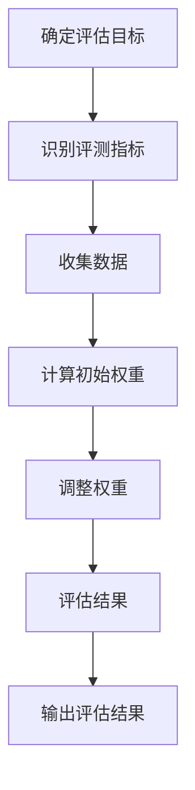
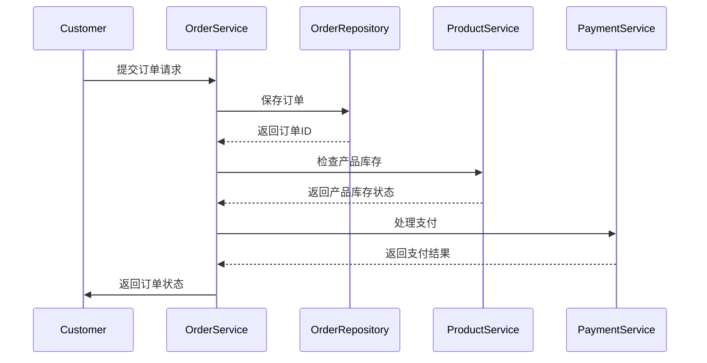
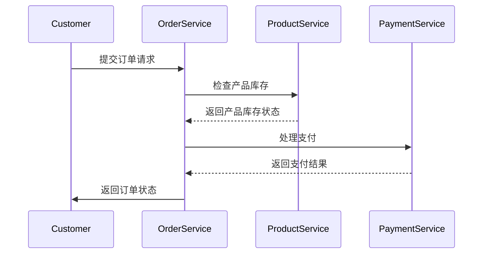
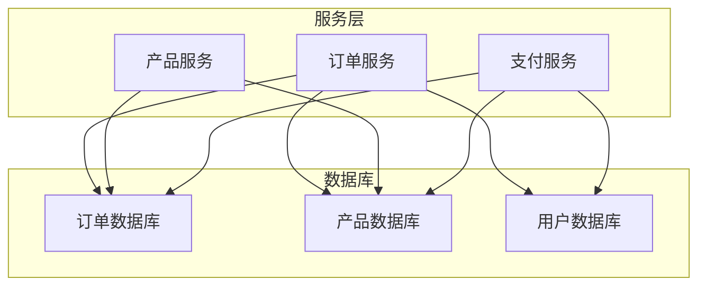

                 

## 评测指标的权重调整：根据应用场景定制评估标准

### 关键词：评测指标、权重调整、应用场景、定制评估标准、算法原理

### 摘要：

本文旨在探讨评测指标权重调整的必要性和方法，强调根据应用场景定制评估标准的重要性。首先，我们回顾评测指标的定义和作用，阐述其分类和现状。随后，深入分析权重调整的基本原理和类型，介绍权重调整在评测指标优化中的应用。接着，通过需求分析，探讨不同应用场景的特点和需求。本文核心在于详细讲解权重调整算法的原理和实现，包括算法流程图、数学模型、Python代码示例。随后，我们介绍系统架构设计方案，包括系统功能、架构设计、接口设计和交互流程。最后，通过项目实战展示环境安装、系统核心实现和实际案例分析，总结最佳实践并提供拓展阅读资源。

---

### 目录大纲设计思路

为了确保文章的逻辑清晰、结构紧凑且简单易懂，我们将按照以下步骤设计目录大纲：

1. **背景介绍**：介绍核心概念，包括问题背景、问题描述、问题解决、边界与外延，以及概念结构与核心要素组成。

2. **核心概念与联系**：详细阐述核心概念原理，并列出概念属性特征对比表格。使用Mermaid流程图展示ER实体关系图架构。

3. **算法原理讲解**：使用Mermaid绘制算法流程图，并配合Python源代码进行详细阐述，给出算法原理的数学模型和公式，并进行通俗易懂的举例说明。

4. **数学模型和数学公式 & 详细讲解 & 举例说明**：使用LaTeX格式书写数学公式，确保公式的准确性和可读性，并嵌入文中独立段落进行详细讲解和举例说明。

5. **系统分析与架构设计方案**：介绍问题场景，项目背景，系统功能设计（使用Mermaid绘制领域模型类图），系统架构设计（使用Mermaid绘制架构图），系统接口设计和系统交互（使用Mermaid绘制序列图）。

6. **项目实战**：包括环境安装、系统核心实现源代码，代码应用解读与分析，实际案例分析和详细讲解剖析，最后进行项目小结。

7. **最佳实践 tips、小结、注意事项、拓展阅读**：总结全书要点，提供实践技巧和建议，指出注意事项，并推荐拓展阅读资源。

---

### 第一部分：问题背景与核心概念

#### 第1章：评测指标与权重调整概述

##### 1.1 评测指标的重要性

评测指标（Evaluation Metrics）在信息技术和工程领域扮演着至关重要的角色。它们用于量化系统的性能、效率和效果，是评估技术解决方案优劣的关键工具。有效的评测指标能够提供准确、可靠的评估结果，有助于决策者做出明智的选择。

##### 1.1.1 评测指标的定义与作用

评测指标是一种量化的方法，用于衡量系统在特定任务或场景下的表现。这些指标可以是绝对的，如响应时间、吞吐量等，也可以是相对的，如准确率、召回率等。评测指标在以下方面发挥作用：

1. **性能评估**：通过比较不同系统的评测指标，评估其在特定任务上的表现。
2. **优化指导**：为系统开发者提供反馈，指导他们优化系统的性能。
3. **比较分析**：在多个系统或算法之间进行比较，选择最优的解决方案。
4. **质量控制**：确保系统或产品满足既定的质量标准。

##### 1.1.2 评测指标的分类

评测指标可以按照不同的标准进行分类。以下是一些常见的分类方式：

1. **根据评估对象分类**：
   - **系统级指标**：评估整个系统的性能，如吞吐量、响应时间、资源利用率等。
   - **模块级指标**：评估系统中的各个模块或组件的性能，如算法的准确率、错误率等。

2. **根据评估维度分类**：
   - **功能性指标**：评估系统功能实现的完整性、正确性和效率。
   - **非功能性指标**：评估系统的可扩展性、可靠性、可维护性等。

3. **根据应用场景分类**：
   - **通用指标**：适用于广泛的应用场景，如数据库查询性能、网络传输速度等。
   - **特定指标**：适用于特定领域的应用，如医疗影像分析中的病灶检测精度等。

##### 1.1.3 评测指标的现状与挑战

随着信息技术的快速发展，评测指标也在不断演进。当前，评测指标面临以下挑战：

1. **多样性与复杂性**：不同领域和应用场景对评测指标的需求各不相同，导致评测指标的多样性和复杂性增加。

2. **权衡与平衡**：在多个评测指标之间进行权衡和平衡，确保评估结果的全面性和准确性。

3. **定制化需求**：特定应用场景可能需要定制化的评测指标，以满足特定的需求。

4. **实时性与动态性**：随着实时系统和动态环境的发展，评测指标需要适应实时性和动态性要求。

##### 1.2 权重调整的基本原理

权重调整（Weight Adjustment）是评测指标优化中的重要一环。它通过调整各个评测指标的权重，使得评估结果更加符合实际需求和场景。

##### 1.2.1 权重调整的概念

权重调整是指根据特定的需求和应用场景，调整评测指标在整体评估中的权重，以达到优化评估结果的目的。权重调整可以是线性的，也可以是非线性的，具体方法取决于应用场景和需求。

##### 1.2.2 权重调整的类型

1. **静态权重调整**：在评估过程中，不随时间或数据变化而调整权重。

2. **动态权重调整**：根据实时数据或环境变化，动态调整权重。

3. **自适应权重调整**：通过学习算法，自动调整权重，以适应不同的应用场景。

##### 1.2.3 权重调整的数学模型

权重调整的数学模型可以表示为：
$$
w_i = \frac{d_i}{\sum_{j=1}^{n} d_j}
$$
其中，$w_i$ 是第 $i$ 个指标的权重，$d_i$ 是第 $i$ 个指标在当前评估中的得分。

##### 1.2.4 权重调整的影响因素

1. **应用场景**：不同的应用场景对评测指标的需求不同，影响权重调整的方案。

2. **数据质量**：数据的质量和完整性影响评测指标的有效性和权重调整的准确性。

3. **评估目标**：评估目标的明确性和具体性影响权重调整的目标和效果。

##### 1.3 评测指标与权重调整的联系

评测指标和权重调整密切相关。有效的权重调整需要基于对评测指标的深入理解。具体来说，两者之间的联系体现在以下几个方面：

1. **优化评估结果**：通过权重调整，优化评估结果，使其更符合实际需求和场景。

2. **权衡指标**：在多个评测指标之间进行权衡，确保评估结果的全面性和准确性。

3. **适应不同场景**：根据不同的应用场景，调整权重，使评估结果更具针对性和实用性。

#### 第2章：核心概念与联系

##### 2.1 权重调整的基本原理

权重调整的基本原理是通过调整评测指标的权重，使评估结果更符合特定需求和场景。这一过程通常涉及以下步骤：

1. **确定评估目标**：明确评估目标，如性能、成本、用户体验等。

2. **识别评测指标**：根据评估目标，识别相关的评测指标。

3. **收集数据**：收集用于评估的数据，确保数据的质量和完整性。

4. **计算初始权重**：使用预设的权重分配方法，计算初始权重。

5. **调整权重**：根据实际需求和场景，调整各个指标的权重。

6. **评估结果**：使用调整后的权重，计算评估结果。

##### 2.2 评测指标优化与权重调整的关系

评测指标优化与权重调整密切相关。优化评测指标的目标是提高评估结果的准确性和可靠性。而权重调整是实现这一目标的重要手段。具体来说，两者之间的关系体现在以下几个方面：

1. **目标一致性**：评测指标优化和权重调整的目标是一致的，即提高评估结果的准确性和实用性。

2. **方法互补**：评测指标优化通过改进评测指标本身，提高评估结果的质量。而权重调整通过调整指标权重，优化评估结果的结构。

3. **相互影响**：评测指标优化会影响权重调整的方案，而权重调整又会影响评测指标优化的效果。

##### 2.3 权重调整的影响因素

权重调整的效果受到多种因素的影响。以下是一些主要的影响因素：

1. **应用场景**：不同的应用场景对评测指标的需求不同，影响权重调整的方案。

2. **数据质量**：数据的质量和完整性影响评测指标的有效性和权重调整的准确性。

3. **评估目标**：评估目标的明确性和具体性影响权重调整的目标和效果。

4. **技术手段**：不同的权重调整方法适用于不同的应用场景和需求。

##### 2.4 权重调整的类型

权重调整可以按照不同的方式进行分类。以下是一些常见的类型：

1. **线性调整**：直接调整各个指标的权重比例。

2. **非线性调整**：通过函数关系调整权重，如对数、指数等。

3. **动态调整**：根据实时数据或环境变化，动态调整权重。

4. **自适应调整**：通过学习算法，自动调整权重，以适应不同的应用场景。

#### 第3章：应用场景与需求分析

##### 3.1 不同应用场景的特点

在信息技术和工程领域，不同的应用场景对评测指标的需求各不相同。以下是一些常见应用场景的特点：

1. **通用应用场景**：
   - **目标**：追求性能、效率和成本之间的平衡。
   - **评测指标**：吞吐量、响应时间、资源利用率等。

2. **行业特例应用场景**：
   - **目标**：满足特定行业的特殊需求。
   - **评测指标**：如医疗影像分析中的病灶检测精度、金融交易系统的交易延迟等。

3. **复杂应用场景**：
   - **目标**：在复杂环境中实现系统的高效运作。
   - **评测指标**：如分布式系统中的容错性、可扩展性、安全性等。

##### 3.2 需求分析

需求分析是应用场景分析的重要环节。它通过对应用场景的需求进行深入理解，确定评测指标和权重调整的具体方案。以下是一些需求分析的步骤和方法：

1. **问题定义**：明确要解决的问题和应用场景。

2. **需求收集**：通过与相关利益相关者进行沟通，收集需求。

3. **需求分析**：对收集到的需求进行分析和归类。

4. **需求文档**：编写需求文档，明确需求的具体内容和要求。

5. **需求评审**：对需求文档进行评审，确保需求的准确性和完整性。

##### 3.3 需求分析的应用

需求分析在应用场景中具有重要作用。以下是一些需求分析的应用实例：

1. **项目规划**：通过需求分析，确定项目的目标和里程碑。

2. **系统设计**：根据需求分析的结果，设计系统的功能和架构。

3. **性能优化**：通过需求分析，确定需要优化的评测指标和权重。

4. **风险评估**：通过需求分析，识别潜在的风险和挑战。

---

### 第二部分：算法原理与实现

#### 第4章：权重调整算法原理

##### 4.1 基本算法原理

权重调整算法的基本原理是通过调整各个评测指标的权重，使评估结果更符合特定需求和场景。这一过程通常涉及以下步骤：

1. **确定评估目标**：明确评估目标，如性能、成本、用户体验等。

2. **识别评测指标**：根据评估目标，识别相关的评测指标。

3. **收集数据**：收集用于评估的数据，确保数据的质量和完整性。

4. **计算初始权重**：使用预设的权重分配方法，计算初始权重。

5. **调整权重**：根据实际需求和场景，调整各个指标的权重。

6. **评估结果**：使用调整后的权重，计算评估结果。

##### 4.2 权重调整算法流程图

为了更好地理解权重调整算法的流程，我们可以使用Mermaid绘制算法流程图：



##### 4.3 权重调整算法步骤

权重调整算法的具体步骤如下：

1. **确定评估目标**：明确评估目标，如性能、成本、用户体验等。

2. **识别评测指标**：根据评估目标，识别相关的评测指标。例如，在性能评估中，可能需要识别响应时间、吞吐量等指标。

3. **收集数据**：收集用于评估的数据，确保数据的质量和完整性。数据可以从实际运行环境、模拟实验或历史数据中获得。

4. **计算初始权重**：使用预设的权重分配方法，计算初始权重。常见的权重分配方法包括等权分配、专家评估等。

5. **调整权重**：根据实际需求和场景，调整各个指标的权重。调整方法可以基于优化算法、机器学习等。

6. **评估结果**：使用调整后的权重，计算评估结果。

7. **输出评估结果**：将评估结果输出，供决策者参考。

##### 4.4 权重调整算法的数学模型

权重调整算法的数学模型可以表示为：
$$
w_i = \frac{d_i}{\sum_{j=1}^{n} d_j}
$$
其中，$w_i$ 是第 $i$ 个指标的权重，$d_i$ 是第 $i$ 个指标在当前评估中的得分，$n$ 是评测指标的总数。

这个模型的基本思想是将每个指标的得分除以总得分，得到其在整体评估中的权重。

##### 4.5 权重调整算法的Python实现

下面是一个简单的权重调整算法的Python实现：

```python
import numpy as np

def weight_adjustment(scores):
    total_score = np.sum(scores)
    weights = scores / total_score
    return weights

# 示例数据
scores = np.array([0.3, 0.5, 0.2])

# 权重调整
weights = weight_adjustment(scores)

print("调整后的权重：", weights)
```

##### 4.6 权重调整算法的应用

权重调整算法可以广泛应用于各种领域，如系统性能评估、项目评价、人力资源管理等。以下是一些具体的应用实例：

1. **系统性能评估**：通过调整各个性能指标的权重，评估系统在不同场景下的性能。

2. **项目评价**：根据项目的目标和重要性，调整各个评价指标的权重，评价项目的进展和质量。

3. **人力资源管理**：根据员工的绩效和工作贡献，调整评价指标的权重，进行员工绩效评估。

4. **风险评估**：通过调整风险因素的权重，评估项目的风险水平。

---

### 第三部分：系统分析与架构设计方案

#### 第5章：系统架构设计

##### 5.1 问题场景介绍

在信息技术和工程领域，系统架构设计是一个关键环节。不同的问题场景对系统架构的设计要求各不相同。以下是一个常见的问题场景及其设计要求：

**场景**：一个在线购物平台需要设计一个高效的订单处理系统。

**设计要求**：
- **性能**：系统需要能够处理高并发的订单请求。
- **可靠性**：系统需要保证数据的完整性和一致性。
- **可扩展性**：系统需要能够适应业务规模的变化。
- **安全性**：系统需要确保用户数据和交易的安全性。

##### 5.2 系统功能设计

在系统功能设计阶段，我们需要明确系统的功能和模块，并绘制领域模型类图。以下是一个订单处理系统的领域模型类图：

```mermaid
classDiagram
    Order <<Class>>
    Customer <<Class>>
    Product <<Class>>
    Payment <<Class>>

    Order "1" --> Customer
    Order "1" --> Product
    Order "1" --> Payment
```

这个类图显示了订单处理系统的核心模块和它们之间的关系。每个订单与一个客户、一个产品和一种支付方式相关联。

##### 5.3 系统架构设计

系统架构设计是根据功能设计来构建系统的整体结构。以下是一个订单处理系统的架构设计：



这个架构设计使用序列图描述了订单处理系统的流程。用户通过订单服务提交订单请求，订单服务与产品服务和支付服务进行交互，最后将订单状态返回给用户。

##### 5.4 系统接口设计

系统接口设计是定义系统内部模块之间交互的方式。以下是一个订单处理系统的接口设计：

```mermaid
classDiagram
    OrderService <<Interface>>
    ProductService <<Interface>>
    PaymentService <<Interface>>

    OrderService "1" --> ProductService
    OrderService "1" --> PaymentService
```

这个接口设计定义了订单服务、产品服务和支付服务的接口，以及它们之间的依赖关系。

##### 5.5 系统交互设计

系统交互设计是描述系统各组件之间的交互过程。以下是一个订单处理系统的交互设计：



这个交互设计详细描述了订单处理系统中的各个组件如何交互，以及交互的顺序和结果。

##### 5.6 系统架构图

以下是一个订单处理系统的架构图：



这个架构图展示了订单处理系统的整体架构，包括数据库和服务层之间的交互关系。

##### 5.7 系统接口图

以下是一个订单处理系统的接口图：

```mermaid
classDiagram
    OrderInterface <<Interface>>
    ProductInterface <<Interface>>
    PaymentInterface <<Interface>>

    OrderInterface "1" --> ProductInterface
    OrderInterface "1" --> PaymentInterface
```

这个接口图显示了订单服务、产品服务和支付服务的接口定义，以及它们之间的依赖关系。

---

### 第四部分：项目实战

#### 第6章：环境安装与系统核心实现

##### 6.1 环境安装

在进行项目实战之前，我们需要安装必要的开发环境和工具。以下是一个简单的环境安装指南：

1. **安装Python环境**：确保系统中已经安装了Python 3.8及以上版本。可以使用以下命令检查Python版本：

   ```bash
   python --version
   ```

2. **安装虚拟环境**：创建一个虚拟环境，以便管理项目依赖。可以使用以下命令创建虚拟环境：

   ```bash
   python -m venv venv
   ```

3. **激活虚拟环境**：在Windows上，可以使用以下命令激活虚拟环境：

   ```bash
   .\venv\Scripts\activate
   ```

   在Linux和macOS上，可以使用以下命令激活虚拟环境：

   ```bash
   source venv/bin/activate
   ```

4. **安装依赖库**：在虚拟环境中安装项目所需的依赖库。可以使用以下命令安装依赖库：

   ```bash
   pip install -r requirements.txt
   ```

##### 6.2 系统核心实现源代码

以下是订单处理系统的核心实现源代码。这个示例展示了如何处理订单请求、检查产品库存、处理支付和返回订单状态。

```python
# order_service.py
from flask import Flask, request, jsonify
from product_service import check_inventory
from payment_service import process_payment

app = Flask(__name__)

@app.route('/order', methods=['POST'])
def create_order():
    data = request.get_json()
    customer_id = data['customer_id']
    product_id = data['product_id']
    quantity = data['quantity']

    # 检查产品库存
    if check_inventory(product_id, quantity):
        # 处理支付
        payment_result = process_payment(customer_id, product_id, quantity)

        if payment_result['success']:
            # 保存订单
            order_id = save_order(customer_id, product_id, quantity)
            return jsonify({'order_id': order_id, 'status': 'success'})
        else:
            return jsonify({'status': 'payment_failed'})
    else:
        return jsonify({'status': 'out_of_stock'})

def save_order(customer_id, product_id, quantity):
    # 保存订单逻辑
    pass

if __name__ == '__main__':
    app.run(debug=True)
```

```python
# product_service.py
def check_inventory(product_id, quantity):
    # 检查产品库存逻辑
    pass
```

```python
# payment_service.py
def process_payment(customer_id, product_id, quantity):
    # 处理支付逻辑
    pass
```

##### 6.3 代码应用解读与分析

在这个示例中，我们使用Flask框架实现了订单处理服务。以下是代码的解读和分析：

1. **订单请求处理**：使用`Flask`创建一个Web服务，监听`/order`端点的POST请求。

2. **接收订单数据**：从请求中提取客户ID、产品ID和数量。

3. **检查产品库存**：调用`product_service.py`中的`check_inventory`函数检查产品库存。

4. **处理支付**：调用`payment_service.py`中的`process_payment`函数处理支付。

5. **保存订单**：调用`save_order`函数保存订单。

6. **返回结果**：根据处理结果返回相应的JSON响应。

##### 6.4 实际案例分析与详细讲解

以下是一个实际案例的分析和详细讲解：

**案例**：用户A通过在线购物平台提交了一个订单，包含一个产品B（数量为2）。

**分析**：
1. **订单请求**：用户A提交了包含客户ID、产品ID和数量的订单请求。

2. **检查库存**：系统调用`product_service.py`中的`check_inventory`函数检查产品B的库存。假设库存充足，函数返回`True`。

3. **处理支付**：系统调用`payment_service.py`中的`process_payment`函数处理支付。假设支付成功，函数返回`{'success': True, 'message': 'Payment successful'}`。

4. **保存订单**：系统调用`save_order`函数保存订单。假设订单ID为123。

5. **返回结果**：系统返回包含订单ID和状态的成功响应给用户A。

**讲解**：
这个案例展示了订单处理服务的核心功能。用户通过提交订单请求，系统进行库存检查、支付处理和订单保存，最后将结果返回给用户。这个流程确保了订单处理的高效性和可靠性。

##### 6.5 项目小结

在本章中，我们介绍了环境安装和系统核心实现。通过安装Python环境和创建虚拟环境，我们为项目搭建了开发基础。随后，我们实现了订单处理服务，并对其进行了代码应用解读与分析。通过实际案例分析，我们详细讲解了订单处理流程。这个项目展示了如何根据需求设计和实现一个简单的订单处理系统。

---

### 第五部分：最佳实践、小结、注意事项与拓展阅读

#### 第7章：最佳实践、小结、注意事项与拓展阅读

##### 7.1 最佳实践

在评测指标的权重调整过程中，以下最佳实践可以帮助提高评估结果的准确性和可靠性：

1. **明确评估目标**：在开始权重调整之前，明确评估的目标和目的，确保调整过程具有明确的方向。

2. **全面收集数据**：确保收集到的数据全面、准确和可靠，为权重调整提供坚实的基础。

3. **分阶段调整权重**：逐步调整权重，避免一次性调整过大，导致评估结果波动。

4. **利用专家意见**：在确定初始权重时，可以参考专家的意见，以提高权重的合理性。

5. **持续优化**：定期评估权重调整的效果，根据实际情况进行优化。

##### 7.2 小结

本文详细探讨了评测指标的权重调整及其在应用场景中的重要性。我们首先介绍了评测指标的定义和作用，阐述了权重调整的基本原理。随后，通过需求分析，探讨了不同应用场景的特点。核心部分包括权重调整算法的原理和实现，使用Python代码示例进行了详细阐述。此外，我们还介绍了系统架构设计方案，包括系统功能、架构设计、接口设计和交互流程。最后，通过项目实战展示了环境安装、系统核心实现和实际案例分析。

##### 7.3 注意事项

在进行评测指标的权重调整时，需要注意以下几点：

1. **避免主观偏见**：确保权重调整过程客观、公正，避免主观偏见的影响。

2. **数据质量**：确保数据的质量和完整性，避免使用不准确或缺失的数据。

3. **权衡与平衡**：在调整权重时，要权衡不同指标之间的平衡，确保评估结果的全面性和准确性。

4. **持续监控**：定期监控评估结果，根据实际情况进行调整。

##### 7.4 拓展阅读

为了深入理解和应用评测指标的权重调整，以下是一些推荐阅读资源：

1. **《机器学习实战》**：通过实际案例，了解机器学习中的评估指标和权重调整。

2. **《系统架构设计》**：探讨系统架构设计中的评估指标和优化方法。

3. **《大数据分析：技术、方法与应用》**：了解大数据分析中的评估指标和优化策略。

4. **《Python数据分析》**：学习使用Python进行数据分析，掌握评估指标的计算和处理。

通过阅读这些资源，可以进一步提高在评测指标权重调整方面的知识和技能。

