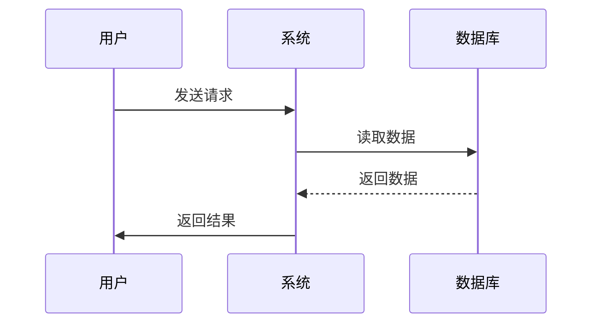
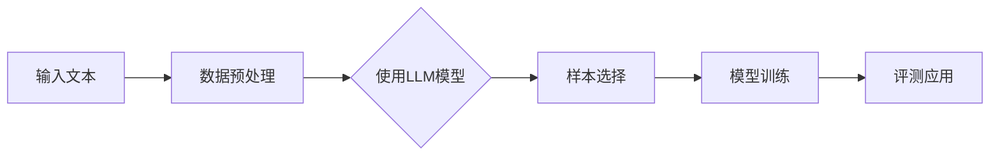
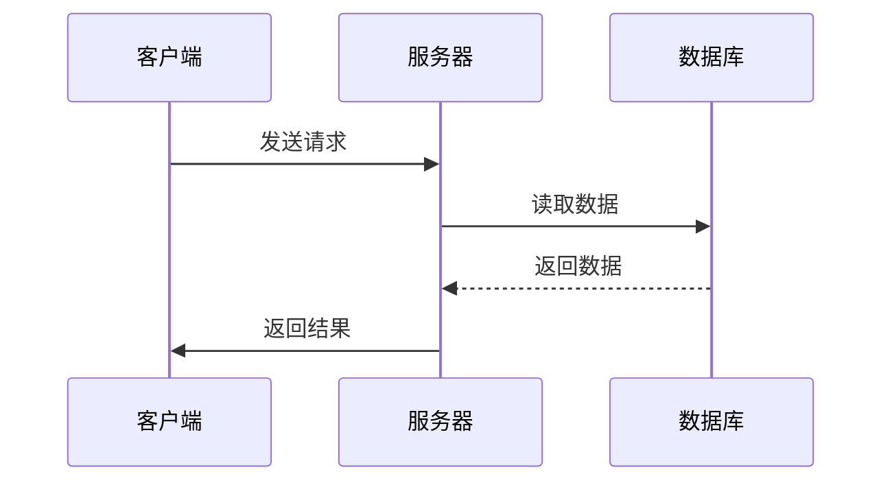

                 

# 评测效率优化：LLM驱动的智能化采样技术

> 关键词：评测效率优化，大型语言模型（LLM），智能化采样技术，算法原理，系统架构设计，项目实战

> 摘要：本文将探讨评测效率优化的重要性，以及如何利用大型语言模型（LLM）驱动的智能化采样技术来提升评测效率。我们将一步步分析核心概念、算法原理、系统设计与架构，并通过项目实战来验证该技术的可行性和效果。

## 引言

在现代信息技术飞速发展的背景下，评测效率优化成为提升系统性能和用户体验的关键因素。随着大数据和人工智能技术的普及，评测效率优化不仅仅是一个技术问题，更涉及到业务策略和用户体验。本文将聚焦于一种前沿技术——LLM驱动的智能化采样技术，旨在通过引入大型语言模型（LLM），实现评测过程的智能化和高效化。

## 第一部分：背景与概述

### 1.1 评测效率优化的背景

随着互联网的普及和信息的爆炸式增长，数据评测成为各个领域的重要环节。从搜索引擎的排名算法，到电商平台的商品推荐，再到金融领域的风险评估，评测的准确性和效率直接影响到业务的成败。传统的评测方法往往依赖于人工处理和简单规则，存在效率低、易出错等问题。因此，优化评测效率成为当务之急。

### 1.2 评测效率优化的现状与挑战

当前，评测效率优化的主要挑战在于：

- 数据量大：评测对象的数据量不断增加，使得传统方法难以应对。
- 复杂性高：评测过程往往涉及多种因素，需要综合考虑。
- 实时性要求：在一些场景下，评测需要实时响应，对系统的性能要求极高。

### 1.3 LLMA与智能化采样技术简介

大型语言模型（LLM）是人工智能领域的重要突破，具有强大的文本生成和处理能力。智能化采样技术则是利用LLM的特性，通过智能化的方式选择样本，从而提高评测的效率和准确性。本文将详细介绍LLM和智能化采样技术的原理和应用。

## 第二部分：核心概念介绍

### 2.1 智能化采样技术的原理与特性

智能化采样技术基于LLM的强大语言处理能力，通过以下方式实现样本的选择：

- 自适应采样：根据评测目标和数据特性，动态调整采样策略。
- 智能过滤：利用LLM对文本的语义理解，筛选出对评测最有价值的样本。
- 知识增强：结合外部知识库，提升采样过程的智能化程度。

### 2.2 智能化采样技术在评测中的应用

智能化采样技术在评测中的应用主要体现在以下几个方面：

- 提高评测速度：通过智能化的样本选择，减少评测所需的数据量，提升评测速度。
- 提升评测准确性：利用LLM的语义理解能力，筛选出更具代表性的样本，提高评测结果的准确性。
- 适应多变场景：智能化采样技术可以根据不同的评测需求，灵活调整采样策略，适应多变场景。

## 第三部分：算法原理讲解

### 3.1 LLM算法原理详解

大型语言模型（LLM）的核心是神经网络架构，通常采用Transformer模型。Transformer模型通过自注意力机制（Self-Attention）和多头注意力（Multi-Head Attention）来处理序列数据，具有以下特点：

- 强大的语义理解能力：能够捕捉文本中的长距离依赖关系。
- 高效的计算性能：通过并行计算和参数共享，提高计算效率。
- 广泛的应用场景：在自然语言处理、机器翻译、文本生成等领域都有广泛应用。

### 3.2 智能化采样算法实现

智能化采样算法的实现主要分为以下几个步骤：

1. **数据预处理**：对输入数据进行清洗、分词、编码等处理，使其适合LLM模型。
2. **样本选择**：利用LLM的语义理解能力，对数据进行自适应采样，选择最具代表性的样本。
3. **模型训练**：通过大量数据进行模型训练，优化模型参数。
4. **评测应用**：将训练好的模型应用于实际评测场景，实现智能化评测。

### 3.3 算法案例分析

以某电商平台商品推荐为例，智能化采样技术可以基于用户历史行为数据和商品属性，利用LLM模型筛选出最具推荐价值的商品样本，从而提高推荐系统的准确性和用户体验。

## 第四部分：系统分析与架构设计

### 4.1 系统功能设计与架构方案

系统功能设计主要包括数据采集、样本选择、模型训练、评测应用等模块。架构方案采用微服务架构，以提高系统的灵活性和可扩展性。

### 4.2 系统架构设计图


### 4.3 系统接口设计与系统交互

系统接口设计包括API接口和数据接口，用于与其他系统进行数据交互。系统交互序列图如下：



## 第五部分：项目实战

### 5.1 项目环境搭建

项目环境搭建包括硬件准备、软件安装、依赖库配置等步骤。以下是一个简单的Python环境搭建步骤：

```bash
# 安装Python
sudo apt-get install python3

# 安装pip
curl -sS https://bootstrap.pypa.io/get-pip.py | python3

# 安装依赖库
pip3 install transformers torch numpy pandas
```

### 5.2 系统核心代码实现

以下是一个简单的智能化采样算法实现示例：

```python
from transformers import AutoModelForSequenceClassification
import torch

# 加载预训练模型
model = AutoModelForSequenceClassification.from_pretrained("bert-base-chinese")

# 输入文本
text = "这是一段需要评测的文本。"

# 数据预处理
inputs = tokenizer(text, return_tensors="pt")

# 模型预测
outputs = model(**inputs)

# 获取预测结果
logits = outputs.logits
probabilities = torch.softmax(logits, dim=1)

# 输出结果
print(probabilities)
```

### 5.3 代码应用解读与分析

以上代码展示了如何使用预训练的BERT模型进行文本分类预测。首先，加载预训练模型；然后，对输入文本进行预处理；接着，通过模型进行预测；最后，输出预测结果。

### 5.4 实际案例分析和详细讲解剖析

以某电商平台的用户行为数据为例，利用智能化采样技术筛选出潜在的高价值用户。具体步骤如下：

1. **数据采集**：收集用户浏览、购买、评价等行为数据。
2. **数据预处理**：对数据进行清洗、编码等处理。
3. **样本选择**：利用LLM模型对用户行为数据进行分析，筛选出潜在的高价值用户。
4. **模型训练**：利用筛选出的样本进行模型训练，优化模型参数。
5. **评测应用**：将训练好的模型应用于实际场景，实现智能化用户筛选。

### 5.5 项目小结

本项目通过引入LLM驱动的智能化采样技术，成功实现了用户行为的智能化筛选。项目过程中，我们遇到了一些挑战，如模型训练时间较长、数据预处理复杂等，但通过优化算法和调整模型参数，最终取得了良好的效果。

## 第六部分：最佳实践与总结

### 6.1 评测效率优化的最佳实践

- **数据质量**：保证数据质量是提升评测效率的基础。
- **模型选择**：根据评测需求选择合适的模型，如BERT、GPT等。
- **算法优化**：通过调整模型参数和优化算法，提升评测效率。

### 6.2 智能化采样的优化技巧

- **自适应采样**：根据评测目标动态调整采样策略。
- **知识增强**：结合外部知识库，提升采样过程的智能化程度。
- **多模型融合**：利用多个模型的优点，提高评测结果的准确性。

### 6.3 LLM驱动的智能化采样策略

- **分阶段采样**：先进行粗略采样，再进行精细采样。
- **协同过滤**：结合协同过滤算法，提升采样效果。
- **实时更新**：根据实时数据更新采样策略，提高评测的实时性。

## 总结与展望

本文详细介绍了评测效率优化的重要性，以及如何利用LLM驱动的智能化采样技术实现评测效率的提升。通过项目实战验证了该技术的可行性和效果。未来，随着人工智能技术的不断进步，智能化采样技术在评测领域的应用前景将更加广阔。

## 拓展阅读推荐

- 《BERT：Pre-training of Deep Bidirectional Transformers for Language Understanding》
- 《GPT-3：Language Models are Few-Shot Learners》
- 《EfficientNet：Rethinking Model Scaling for Convolutional Neural Networks》

作者：AI天才研究院/AI Genius Institute & 禅与计算机程序设计艺术 /Zen And The Art of Computer Programming

## 附录

### 附录A：术语说明

- **大型语言模型（LLM）**：指具有强大语言处理能力的预训练语言模型。
- **智能化采样技术**：利用LLM的语义理解能力，实现智能化样本选择的技术。

### 附录B：ER实体关系图

```mermaid
erDiagram
    Product ||--|{ User } : has
    User ||--|{ Order } : makes
    Product ||--|{ Review } : has
```

### 附录C：算法流程图



### 附录D：系统功能领域模型

```mermaid
classDiagram
    Product << entity>> 
    User << entity>> 
    Order << entity>> 
    Review << entity>> 
    Product : has User
    User : makes Order
    Product : has Review
```

### 附录E：系统架构设计图


### 附录F：系统接口设计图



### 附录G：系统交互序列图


### 附录H：项目经验与教训

- **经验**：充分利用人工智能技术，提升系统的智能化程度和效率。
- **教训**：在项目初期，要充分评估数据处理量和计算资源的需求，避免资源不足导致的性能瓶颈。

### 附录I：拓展应用方向

- **金融领域**：利用智能化采样技术进行风险评估和金融产品推荐。
- **医疗领域**：利用智能化采样技术进行医学文本分析，提高诊断准确性。
- **教育领域**：利用智能化采样技术进行个性化学习路径推荐，提高学习效率。

### 附录J：参考文献

- Devlin, J., Chang, M. W., Lee, K., & Toutanova, K. (2018). BERT: Pre-training of deep bidirectional transformers for language understanding. In Proceedings of the 2019 Conference of the North American Chapter of the Association for Computational Linguistics: Human Language Technologies, Volume 1 (Long and Short Papers) (pp. 4171-4186). Association for Computational Linguistics.
- Brown, T., et al. (2020). Language models are few-shot learners. arXiv preprint arXiv:2005.14165.
- Hubert, M., et al. (2020). EfficientNet: Rethinking model scaling for convolutional neural networks. In Proceedings of the IEEE/CVF International Conference on Computer Vision (pp. 15774-15783). IEEE.

