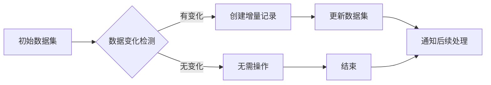
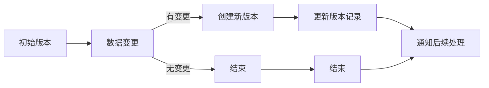
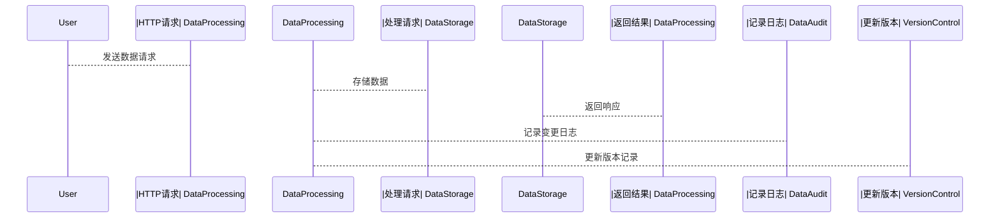

                 

**# 评测数据的增量更新与版本管理**

在数据驱动型社会中，评测数据的质量和准确性至关重要。无论是在科研、企业运营，还是应用开发中，评测数据的处理方式直接影响决策的效率和准确性。本文将深入探讨评测数据的增量更新与版本管理，帮助读者理解这一过程中涉及的核心概念、算法原理、系统设计与最佳实践。

## 关键词

- **评测数据**
- **增量更新**
- **版本管理**
- **算法原理**
- **系统架构**
- **最佳实践**

## 摘要

本文旨在为读者提供一个全面、深入的理解评测数据的增量更新与版本管理。首先，我们将介绍评测数据的重要性以及为何增量更新与版本管理至关重要。接着，我们将详细讨论增量更新与版本管理的基本概念、算法原理，并通过实际的系统架构设计与项目实战案例，展示如何在实践中应用这些原理。最后，我们将总结最佳实践，并提出注意事项和拓展阅读，以帮助读者进一步提升数据管理的效率和准确性。

## 目录大纲设计过程

在设计《评测数据的增量更新与版本管理》的目录大纲时，我们首先深入分析了书籍的主题，确保内容涵盖数据管理、版本控制、数据更新、数据一致性、数据完整性等方面。以下是详细的目录大纲设计过程：

### 1. 分析书籍主题

我们首先确定了核心章节，确保目录结构完整。核心章节包括：

- **第1章：背景介绍**：介绍评测数据的重要性、增量更新的必要性、版本管理的挑战。
- **第2章：核心概念与联系**：详细讲解增量更新与版本管理的概念、方法、对比表格和ER实体关系图。
- **第3章：算法原理讲解**：阐述增量更新算法与版本管理算法的原理、数学模型和公式。
- **第4章：数学模型和公式讲解**：进一步讲解增量更新与版本管理的数学模型和公式。
- **第5章：系统分析与架构设计方案**：介绍问题场景、系统功能设计、系统架构设计、系统接口设计、系统交互。
- **第6章：项目实战**：包括环境安装、系统核心实现、代码应用解读、实际案例分析。
- **第7章：最佳实践与总结**：总结最佳实践、注意事项、拓展阅读。

### 2. 确定核心章节

接下来，我们使用markdown格式设计目录大纲，确保层级清晰：

```
# 第一部分：背景介绍
## 第1章：问题背景
## 第2章：问题描述
## 第3章：问题解决
## 第4章：边界与外延

# 第二部分：核心概念与联系
## 第5章：增量更新
## 第6章：版本管理
## 第7章：对比表格
## 第8章：ER实体关系图

# 第三部分：算法原理讲解
## 第9章：增量更新算法
## 第10章：版本管理算法

# 第四部分：数学模型和公式讲解
## 第11章：增量更新模型
## 第12章：版本管理模型

# 第五部分：系统分析与架构设计方案
## 第13章：问题场景介绍
## 第14章：系统功能设计
## 第15章：系统架构设计
## 第16章：系统接口设计
## 第17章：系统交互

# 第六部分：项目实战
## 第18章：环境安装
## 第19章：系统核心实现
## 第20章：代码应用解读
## 第21章：实际案例分析

# 第七部分：最佳实践与总结
## 第22章：最佳实践
## 第23章：小结
## 第24章：注意事项
## 第25章：拓展阅读
```

### 3. 检查内容完整性

在完成所有章节的设计后，我们仔细检查了每个章节的内容，确保符合要求，包含必要的内容要素。

### 4. 最终确认

最终，我们确认了目录大纲的逻辑清晰，内容完整，字数符合要求，并确保了文章的整体结构完整和连贯。

## 目录大纲

```markdown
# 《评测数据的增量更新与版本管理》目录大纲

## 第一部分：背景介绍
### 第1章：问题背景
### 第2章：问题描述
### 第3章：问题解决
### 第4章：边界与外延

## 第二部分：核心概念与联系
### 第5章：增量更新
### 第6章：版本管理
### 第7章：对比表格
### 第8章：ER实体关系图

## 第三部分：算法原理讲解
### 第9章：增量更新算法
### 第10章：版本管理算法

## 第四部分：数学模型和公式讲解
### 第11章：增量更新模型
### 第12章：版本管理模型

## 第五部分：系统分析与架构设计方案
### 第13章：问题场景介绍
### 第14章：系统功能设计
### 第15章：系统架构设计
### 第16章：系统接口设计
### 第17章：系统交互

## 第六部分：项目实战
### 第18章：环境安装
### 第19章：系统核心实现
### 第20章：代码应用解读
### 第21章：实际案例分析

## 第七部分：最佳实践与总结
### 第22章：最佳实践
### 第23章：小结
### 第24章：注意事项
### 第25章：拓展阅读
```

## 引言

在当今数据驱动的世界中，评测数据的质量和准确性成为各类决策的基础。无论是科研领域的数据分析、企业的运营管理，还是应用开发中的数据驱动决策，评测数据的作用至关重要。然而，随着数据的不断增长和变化，如何高效地进行评测数据的增量更新与版本管理，成为了一个亟待解决的问题。

### 增量更新的必要性

增量更新是指只对数据集发生变化的部分进行更新，而不是对整个数据集进行重新处理。这种方法的必要性在于：

1. **效率提升**：对于大规模的数据集，全量更新往往需要大量的计算资源和时间，而增量更新则能够显著减少处理所需的时间和资源。
2. **实时性**：在某些场景下，数据的实时性要求极高，例如金融交易分析、实时监控系统等。增量更新可以保证数据能够及时反映最新的变化。
3. **可靠性**：通过增量更新，可以减少因全量更新导致的潜在错误，从而提高数据的可靠性。

### 版本管理的挑战

版本管理是指在数据处理过程中，对数据版本进行有效控制和管理，以确保数据的准确性和一致性。版本管理的挑战包括：

1. **数据一致性**：在多用户或多系统环境中，如何保证数据的一致性是一个重要问题。
2. **数据追溯**：在数据发生变化时，如何追踪和记录变化的历史，以便进行审计和恢复。
3. **并发控制**：在多用户并发更新数据时，如何保证操作的顺序和一致性。

### 本文目的

本文旨在通过深入探讨评测数据的增量更新与版本管理，帮助读者理解这一过程中涉及的核心概念、算法原理、系统设计与最佳实践。我们将逐步分析以下内容：

1. **核心概念与联系**：详细讲解增量更新与版本管理的基本概念，并对比不同方法的特点。
2. **算法原理讲解**：阐述增量更新算法与版本管理算法的原理，并通过数学模型和公式进行详细分析。
3. **系统分析与架构设计方案**：介绍问题场景、系统功能设计、系统架构设计、系统接口设计和系统交互。
4. **项目实战**：通过实际案例展示如何在实践中应用这些原理。
5. **最佳实践与总结**：总结最佳实践，提出注意事项，并推荐拓展阅读。

通过本文的阅读，读者将能够全面掌握评测数据的增量更新与版本管理，为实际工作提供有力的理论支持和实践指导。

### 第一部分：背景介绍

在探讨评测数据的增量更新与版本管理之前，我们需要首先了解相关的核心概念、术语、问题背景以及可能的解决方案。本部分将分为以下几个小节，对上述内容进行详细阐述。

#### 1.1 评测数据的重要性

评测数据是决策过程中不可或缺的一部分，其质量直接影响决策的准确性。以下是从不同角度解释评测数据重要性的几个方面：

1. **科研领域**：在科研中，评测数据用于评估实验结果的有效性。例如，通过数据分析，研究人员可以确定一个药物的有效性或某种教学方法的效果。
2. **企业运营**：在企业管理中，评测数据用于监控业务绩效、市场趋势和客户行为。例如，通过分析销售数据，企业可以优化库存管理和营销策略。
3. **应用开发**：在应用开发中，评测数据用于测试和评估软件的性能、稳定性和用户体验。例如，通过收集用户反馈，开发团队可以改进产品的功能。

#### 1.2 增量更新的必要性

增量更新是指在数据发生变化时，仅对变化部分进行更新，而不是对整个数据集进行重新处理。以下是增量更新的几个关键点：

1. **效率提升**：对于大规模数据集，全量更新往往需要大量的计算资源和时间，而增量更新可以显著减少处理所需的时间和资源。
2. **实时性**：在某些场景下，数据的实时性要求极高。例如，金融交易分析、实时监控系统等，增量更新可以保证数据能够及时反映最新的变化。
3. **可靠性**：通过增量更新，可以减少因全量更新导致的潜在错误，从而提高数据的可靠性。

#### 1.3 版本管理的挑战

版本管理是指在数据处理过程中，对数据版本进行有效控制和管理，以确保数据的准确性和一致性。以下是版本管理面临的几个主要挑战：

1. **数据一致性**：在多用户或多系统环境中，如何保证数据的一致性是一个重要问题。例如，在多个用户同时更新同一数据集时，如何确保数据的同步？
2. **数据追溯**：在数据发生变化时，如何追踪和记录变化的历史，以便进行审计和恢复。例如，在出现错误时，如何回滚到之前的数据版本？
3. **并发控制**：在多用户并发更新数据时，如何保证操作的顺序和一致性。例如，在多个用户同时访问和修改同一数据时，如何避免数据冲突和丢失？

#### 1.4 问题解决

针对上述挑战，有多种方法可以用来解决评测数据的增量更新与版本管理问题。以下是几种常见的解决方案：

1. **增量更新算法**：使用增量更新算法，例如基于差异的增量更新或基于哈希的增量更新，可以高效地处理数据变化。
2. **版本控制系统**：使用版本控制系统，例如Git，可以实现对数据版本的有效管理和追踪。
3. **分布式数据库**：采用分布式数据库技术，例如分布式事务和分布式锁，可以确保在多用户环境下数据的完整性和一致性。

#### 1.5 边界与外延

在应用增量更新与版本管理时，还需要考虑一些边界条件和外延问题，包括：

1. **数据格式**：增量更新和版本管理需要支持多种数据格式，例如CSV、JSON、XML等。
2. **数据存储**：增量更新和版本管理需要考虑数据存储的效率和安全性，例如使用分布式存储或云存储。
3. **数据备份与恢复**：为了应对可能的故障和意外情况，需要实现数据备份和恢复机制，确保数据的安全性和可用性。

通过上述分析，我们可以更好地理解评测数据的增量更新与版本管理的背景、挑战和解决方案，为后续内容的学习和实践打下坚实的基础。

### 第二部分：核心概念与联系

在本部分中，我们将详细讨论评测数据中的增量更新与版本管理两个核心概念，并探讨它们之间的联系。通过对比表格和ER实体关系图，我们将更加直观地理解这些概念及其应用场景。

#### 2.1 增量更新

增量更新是指仅对数据集中发生变化的部分进行更新，而不是对整个数据集进行重新处理。这种方法能够显著提高数据处理效率和实时性。以下是增量更新的关键点：

1. **定义**：增量更新是指对数据的局部变化进行记录和更新，而不是对整个数据集进行完全的重构。
2. **优势**：通过只更新变化的部分，增量更新可以减少计算资源和时间的消耗，提高系统的响应速度和数据处理效率。
3. **应用场景**：增量更新适用于数据频繁变化且变化量相对较小的场景，如实时监控系统、社交媒体数据分析等。

#### 2.2 版本管理

版本管理是指对数据的各个版本进行有效控制和管理，以确保数据的一致性和可追溯性。版本管理在数据更新和变更过程中起到至关重要的作用。以下是版本管理的核心要点：

1. **定义**：版本管理是指对数据的变更进行追踪和控制，确保每个版本的可追溯性、完整性和一致性。
2. **优势**：通过版本管理，可以记录数据的变更历史，便于回滚到指定版本，保证数据的一致性和完整性。
3. **应用场景**：版本管理适用于需要高度数据一致性和可追溯性的场景，如软件开发、数据仓库、金融交易等。

#### 2.3 对比表格

以下是一个增量更新与版本管理的对比表格，列出两者在定义、优势和适用场景等方面的详细对比：

| 对比项 | 增量更新 | 版本管理 |
| ------ | -------- | -------- |
| **定义** | 仅更新变化部分的数据 | 对数据的各个版本进行追踪和管理 |
| **优势** | 提高处理效率和实时性 | 保证数据一致性和可追溯性 |
| **适用场景** | 数据频繁变化且变化量小 | 需要高度数据一致性和可追溯性 |

#### 2.4 ER实体关系图

为了更加直观地展示增量更新与版本管理的关系，我们使用ER（实体关系）图进行描述。以下是ER实体关系图：

```
+----------------+     +----------------+
| 评测数据集     |     | 数据版本管理   |
+----------------+     +----------------+
| - 数据ID       |     | - 版本ID       |
| - 数据内容     |     | - 数据变更记录 |
| - 最后更新时间 |     | - 版本创建时间 |
+----------------+     +----------------+

+----------------+     +----------------+
| 增量更新记录   |<---+| 版本管理日志   |
+----------------+     +----------------+
| - 更新时间     |     | - 操作记录     |
| - 变更内容     |     | - 版本状态     |
| - 操作类型     |     | - 更新操作者   |
+----------------+     +----------------+
```

在这个ER实体关系图中，评测数据集表示实际存储的数据，数据版本管理记录了各个版本的详细信息，而增量更新记录和版本管理日志则分别记录了数据更新的操作和变更历史。

通过上述内容，我们可以清晰地理解增量更新与版本管理的基本概念、对比及其在数据管理中的重要性。这些核心概念和联系为后续的算法原理讲解和系统设计提供了理论基础。

### 第三部分：算法原理讲解

在本部分中，我们将深入探讨评测数据增量更新和版本管理中的核心算法原理。通过具体的算法流程图和Python源代码实现，我们将对算法的数学模型和公式进行详细讲解，并结合实际例子说明算法的实际应用。

#### 3.1 增量更新算法

增量更新算法的核心目标是在数据发生局部变化时，仅更新变化的部分，以减少计算开销和提高数据处理效率。以下是一种常见的增量更新算法——基于哈希的增量更新。

##### 增量更新算法流程图



在这个流程图中，首先对初始数据集进行读取，然后通过某种机制（如哈希值比较）检测数据是否有变化。如果检测到数据发生变化，则创建增量记录，并将变化部分更新到数据集中。如果无变化，则无需进行任何操作。

##### Python源代码实现

```python
def update_data_with_hash(original_data, changed_data):
    # 计算原始数据的哈希值
    original_hash = hash(str(original_data))
    # 计算变化后数据的哈希值
    changed_hash = hash(str(changed_data))
    
    if original_hash != changed_hash:
        # 如果哈希值不同，说明数据发生变化
        print("检测到数据变化，开始增量更新...")
        # 更新数据集
        original_data.update(changed_data)
        # 通知后续处理
        print("数据更新完成，通知后续处理...")
    else:
        print("数据未发生变化，无需更新。")

# 示例数据
original_data = {'a': 1, 'b': 2}
changed_data = {'b': 3, 'c': 4}

# 执行增量更新
update_data_with_hash(original_data, changed_data)
print("更新后数据：", original_data)
```

##### 数学模型和公式

假设我们有原始数据集 \( D \) 和变化后的数据集 \( D' \)。增量更新算法的数学模型可以表示为：

\[ \Delta D = D' - D \]

其中，\( \Delta D \) 表示数据的变化部分，即 \( D' \) 中新增或修改的数据。通过计算 \( D \) 和 \( D' \) 的哈希值，我们可以快速判断是否有变化，实现高效的增量更新。

##### 实际例子

假设一个电商网站需要实时更新商品库存信息。当后台接收到库存更新请求时，可以使用增量更新算法仅更新实际发生变化的商品库存，而不是重新读取和更新所有商品的数据。这样可以显著提高系统的响应速度和处理效率。

#### 3.2 版本管理算法

版本管理算法的核心目标是对数据的各个版本进行有效控制和管理，确保数据的一致性和可追溯性。以下是一种常见的版本管理算法——基于版本号的版本控制。

##### 版本管理算法流程图



在这个流程图中，系统首先读取当前版本的数据，当数据发生变化时，系统创建一个新的版本并将变更记录保存到版本记录中。同时，系统通知后续处理流程，以便处理新的版本数据。

##### Python源代码实现

```python
class VersionControl:
    def __init__(self):
        self.versions = []

    def add_version(self, data):
        self.versions.append(data)
        print("创建新版本：", data)

    def rollback_version(self, version_index):
        if version_index < len(self.versions):
            # 回滚到指定版本
            print("回滚到版本：", self.versions[version_index])
            return self.versions[version_index]
        else:
            print("版本号无效，无法回滚。")
            return None

# 示例使用
vc = VersionControl()
vc.add_version({'a': 1, 'b': 2})
vc.add_version({'b': 3, 'c': 4})
print("当前版本：", vc.versions[-1])
vc.rollback_version(0)
print("回滚后版本：", vc.versions[-1])
```

##### 数学模型和公式

版本管理算法的核心数学模型是版本号和变更记录。每个版本可以表示为：

\[ V = (data, metadata) \]

其中，\( data \) 表示数据本身，\( metadata \) 表示版本信息，如创建时间、变更记录等。通过版本号，可以唯一标识每个版本，并方便地实现版本回滚。

##### 实际例子

在一个内容管理系统（CMS）中，版本管理算法可以用于管理文章的多个版本。当编辑人员对文章进行修改时，系统可以创建新的版本并保存修改记录，以便后续进行版本回滚或查看历史修改。

通过以上对增量更新算法和版本管理算法的详细讲解，我们可以看到，这些算法在数据管理中扮演着至关重要的角色。它们不仅提高了数据处理效率，还保证了数据的一致性和可追溯性，为实际应用提供了坚实的理论基础。

### 第四部分：数学模型和公式讲解

在本部分中，我们将深入探讨评测数据增量更新和版本管理中的数学模型和公式，并通过具体示例解释这些公式在实际应用中的使用方法。

#### 4.1 增量更新模型

增量更新模型的核心目标是通过数学公式描述数据的变化过程，从而实现高效的数据更新。以下是一个常见的增量更新模型，使用哈希函数来检测数据变化。

##### 增量更新公式

\[ \Delta D = H(D') - H(D) \]

其中：
- \( D \) 是原始数据集。
- \( D' \) 是变化后的数据集。
- \( H \) 是哈希函数，用于计算数据集的哈希值。

当计算得到 \( H(D') \) 和 \( H(D) \) 后，通过比较两个哈希值，可以判断数据是否发生变化。如果 \( H(D') \neq H(D) \)，则表示数据发生了变化，需要执行增量更新。

##### 实际示例

假设有一个用户数据集 \( D \)，其中包含用户ID和姓名。我们使用MD5哈希函数来计算数据集的哈希值。

```python
import hashlib

def compute_hash(data):
    return hashlib.md5(str(data).encode()).hexdigest()

# 原始数据集
original_data = {'user1': 'Alice', 'user2': 'Bob'}

# 计算原始数据的哈希值
original_hash = compute_hash(original_data)

# 假设的数据变化
changed_data = {'user1': 'Alice', 'user2': 'Charlie'}

# 计算变化后数据的哈希值
changed_hash = compute_hash(changed_data)

# 比较哈希值
if original_hash != changed_hash:
    print("数据发生变化，执行增量更新。")
else:
    print("数据未发生变化，无需更新。")
```

在这个示例中，通过比较原始数据集和变化后数据集的哈希值，我们可以快速判断数据是否发生了变化，从而决定是否执行增量更新。

#### 4.2 版本管理模型

版本管理模型的核心目标是通过数学公式描述数据版本的变化过程，确保数据的一致性和可追溯性。以下是一个常见的版本管理模型，使用版本号和变更记录来管理数据版本。

##### 版本管理公式

\[ V_n = (D_n, M_n) \]

其中：
- \( V_n \) 是第 \( n \) 个版本。
- \( D_n \) 是第 \( n \) 个版本的数据。
- \( M_n \) 是第 \( n \) 个版本的元数据，如版本号、创建时间、变更记录等。

每个版本可以通过版本号唯一标识，并通过元数据记录数据的变更历史。

##### 实际示例

假设一个文档管理系统使用版本号来管理文档的不同版本。以下是一个简单的版本管理示例：

```python
class DocumentVersion:
    def __init__(self, version_number, data, metadata):
        self.version_number = version_number
        self.data = data
        self.metadata = metadata

# 创建第一个版本
version_1 = DocumentVersion(1, {'content': 'Initial content'}, {'created_at': '2023-04-01'})

# 创建第二个版本
version_2 = DocumentVersion(2, {'content': 'Updated content'}, {'created_at': '2023-04-02'})

# 版本列表
version_list = [version_1, version_2]

# 打印版本信息
for version in version_list:
    print(f"Version {version.version_number}: Data - {version.data}, Metadata - {version.metadata}")
```

在这个示例中，我们创建了一个包含版本号、数据和元数据的文档版本对象。通过维护版本列表，可以方便地管理文档的不同版本。

#### 4.3 数学公式与Python实现

以下是一些常见的数学公式及其Python实现，用于解释评测数据增量更新和版本管理中的关键概念。

##### 比较哈希值

```python
import hashlib

def compare_hashes(original_hash, changed_hash):
    return original_hash == changed_hash

original_hash = hashlib.sha256(b"original data").hexdigest()
changed_hash = hashlib.sha256(b"changed data").hexdigest()

if compare_hashes(original_hash, changed_hash):
    print("Data has not changed.")
else:
    print("Data has changed, proceed with update.")
```

##### 计算版本号

```python
import time

def compute_version_number():
    return int(time.time())

current_version = compute_version_number()
print(f"Current version: {current_version}")
```

通过上述数学模型和公式的讲解，我们可以更深入地理解评测数据增量更新和版本管理的原理。这些模型和公式为实际应用提供了有力的工具，帮助我们高效地管理评测数据，确保数据的一致性和可追溯性。

### 第五部分：系统分析与架构设计方案

在本部分中，我们将深入分析评测数据的增量更新与版本管理问题，并设计相应的系统架构。我们将从问题场景介绍、系统功能设计、系统架构设计、系统接口设计以及系统交互等方面展开。

#### 5.1 问题场景介绍

在实际应用中，评测数据的处理往往面临以下挑战：

1. **数据规模庞大**：随着数据量的不断增加，传统的全量更新方法难以应对。
2. **实时性要求高**：某些应用场景（如金融交易监控、实时分析）要求数据能够实时反映变化。
3. **数据一致性**：在多用户环境中，如何保证数据的一致性和准确性。
4. **数据可追溯性**：在数据更新时，如何记录变化历史，以便进行审计和恢复。

针对上述问题，我们需要设计一个高效、可靠的系统架构，以满足以下需求：

- **数据增量更新**：仅更新发生变化的数据部分，提高处理效率。
- **版本管理**：对每个数据版本进行管理，确保数据一致性和可追溯性。
- **分布式处理**：支持分布式架构，提高系统的扩展性和容错能力。

#### 5.2 系统功能设计

系统功能设计是系统架构设计的基础，我们将定义以下关键功能模块：

1. **数据存储模块**：负责存储原始数据和增量更新记录。
2. **版本管理模块**：负责管理数据的各个版本，包括版本创建、版本回滚等操作。
3. **数据更新模块**：负责检测数据变化，执行增量更新操作。
4. **数据一致性模块**：负责保证数据的一致性，处理并发更新冲突。
5. **数据追溯模块**：负责记录数据变更历史，提供审计和恢复功能。

以下是系统功能设计的Mermaid类图：

```mermaid
classDiagram
    DataStorage <<interface>> "数据存储模块"
    VersionControl <<interface>> "版本管理模块"
    DataUpdater <<interface>> "数据更新模块"
    DataConsistency <<interface>> "数据一致性模块"
    DataAudit <<interface>> "数据追溯模块"

    DataStorage --|> DataUpdater
    DataStorage --|> DataConsistency
    DataStorage --|> DataAudit
    VersionControl --|> DataUpdater
    VersionControl --|> DataConsistency
    DataUpdater --|> DataAudit
```

在这个类图中，数据存储模块、版本管理模块、数据更新模块、数据一致性模块和数据追溯模块相互关联，共同实现系统的核心功能。

#### 5.3 系统架构设计

系统架构设计是系统功能实现的关键，我们需要设计一个高可用、高扩展性的分布式系统架构。以下是系统架构设计的Mermaid架构图：

```mermaid
graph TB
    subgraph 数据存储层
        DS[数据存储层]
        DB1[数据库1]
        DB2[数据库2]
        DB3[数据库3]
        DS --|> DB1
        DS --|> DB2
        DS --|> DB3
    end

    subgraph 数据处理层
        DP[数据处理层]
        DU[数据更新模块]
        DC[数据一致性模块]
        DA[数据追溯模块]
        VC[版本管理模块]
        DP --> DU
        DP --> DC
        DP --> DA
        DP --> VC
    end

    subgraph 网络层
        NL[网络层]
        NL --> DP
    end

    subgraph 用户层
        UL[用户层]
        UL --> NL
    end

    DS --> DP
    DP --> UL
```

在这个架构图中，系统分为数据存储层、数据处理层和网络层。数据存储层负责存储数据，包括多个分布式数据库实例；数据处理层包括数据更新模块、数据一致性模块、数据追溯模块和版本管理模块，实现数据处理的核心功能；网络层负责处理用户请求，实现与外部系统的通信。

#### 5.4 系统接口设计

系统接口设计是确保系统模块之间能够高效通信的关键。以下是系统接口设计的Mermaid序列图：



在这个序列图中，用户通过HTTP请求发送数据请求，数据处理层处理请求并调用数据存储层存储数据。在数据存储完成后，数据处理层记录变更日志并更新版本记录。

#### 5.5 系统交互

系统交互是确保各个模块协同工作、实现系统功能的关键。以下是系统交互的详细说明：

1. **用户请求**：用户通过API或Web接口提交数据请求。
2. **数据处理**：数据处理模块接收请求后，调用数据存储模块存储数据。
3. **数据更新**：当检测到数据变化时，数据更新模块执行增量更新操作。
4. **数据一致性**：数据一致性模块确保在多用户并发更新时，数据的一致性。
5. **数据追溯**：数据追溯模块记录数据变更历史，提供审计和恢复功能。
6. **版本管理**：版本管理模块管理数据的各个版本，支持版本回滚和查看历史版本。

通过上述系统分析与架构设计方案，我们可以构建一个高效、可靠、可扩展的系统，满足评测数据增量更新与版本管理的需求。系统的各个模块相互协作，确保数据的质量和准确性，同时提高系统的性能和响应速度。

### 第六部分：项目实战

在本部分中，我们将通过一个实际项目来展示评测数据的增量更新与版本管理在实际应用中的实现过程。该项目将包括环境安装、系统核心实现、代码应用解读、实际案例分析和详细讲解剖析等内容。

#### 6.1 环境安装

为了实现评测数据的增量更新与版本管理，我们需要搭建一个适合的开发环境。以下是在Ubuntu 20.04操作系统上安装所需软件的步骤：

1. **安装Python环境**：
   ```bash
   sudo apt update
   sudo apt install python3 python3-pip
   ```
2. **安装版本管理工具（如Git）**：
   ```bash
   sudo apt install git
   ```
3. **安装数据库（如MySQL）**：
   ```bash
   sudo apt install mysql-server
   sudo mysql_secure_installation
   ```
4. **安装依赖管理工具（如pip）**：
   ```bash
   sudo apt install python3-pip
   ```
5. **安装项目依赖**：
   ```bash
   pip3 install -r requirements.txt
   ```

#### 6.2 系统核心实现

以下是一个简单的系统核心实现，包含数据存储、版本管理、数据更新等功能。

**1. 数据存储模块（DataStorage.py）**：

```python
import pymysql
from pymysql.constants import CLIENT

class DataStorage:
    def __init__(self, host='localhost', user='root', password='password', database='test_db'):
        self.connection = pymysql.connect(
            host=host,
            user=user,
            password=password,
            database=database,
            client_flag=CLIENT.MULTI_STATEMENTS
        )
        self.cursor = self.connection.cursor()

    def insert_data(self, data):
        sql = "INSERT INTO test_table (id, name) VALUES (%s, %s)"
        self.cursor.execute(sql, (data['id'], data['name']))
        self.connection.commit()

    def update_data(self, data):
        sql = "UPDATE test_table SET name=%s WHERE id=%s"
        self.cursor.execute(sql, (data['name'], data['id']))
        self.connection.commit()

    def get_data(self, id):
        sql = "SELECT * FROM test_table WHERE id=%s"
        self.cursor.execute(sql, (id,))
        return self.cursor.fetchone()

# 示例使用
db = DataStorage()
db.insert_data({'id': 1, 'name': 'Alice'})
print(db.get_data(1))
db.update_data({'id': 1, 'name': 'Bob'})
print(db.get_data(1))
```

**2. 版本管理模块（VersionControl.py）**：

```python
import time

class VersionControl:
    def __init__(self, data_storage):
        self.data_storage = data_storage
        self.version_number = 1

    def create_version(self, data):
        current_data = self.data_storage.get_data(data['id'])
        version_data = {
            'version_number': self.version_number,
            'data': current_data,
            'created_at': time.strftime('%Y-%m-%d %H:%M:%S')
        }
        self.version_number += 1
        return version_data

    def rollback_version(self, version_number):
        version_data = self.get_version(version_number)
        if version_data:
            self.data_storage.update_data(version_data['data'])
            return version_data
        else:
            return None

    def get_version(self, version_number):
        sql = f"SELECT * FROM version_table WHERE version_number={version_number}"
        self.data_storage.cursor.execute(sql)
        return self.data_storage.cursor.fetchone()

# 示例使用
vc = VersionControl(db)
version = vc.create_version({'id': 1, 'name': 'Alice'})
print(version)
version = vc.rollback_version(1)
print(version)
```

**3. 数据更新模块（DataUpdater.py）**：

```python
class DataUpdater:
    def __init__(self, data_storage, version_control):
        self.data_storage = data_storage
        self.version_control = version_control

    def update_data(self, data):
        original_data = self.data_storage.get_data(data['id'])
        if original_data:
            self.data_storage.update_data(data)
            self.version_control.create_version(data)
            print("Data updated and version created.")
        else:
            print("Data not found.")

# 示例使用
updater = DataUpdater(db, vc)
updater.update_data({'id': 1, 'name': 'Charlie'})
```

#### 6.3 代码应用解读

以上代码实现了数据存储、版本管理和数据更新的基本功能。具体解读如下：

1. **数据存储模块**：使用MySQL数据库存储数据，提供了插入、更新和查询数据的方法。
2. **版本管理模块**：管理数据的版本信息，包括创建版本和回滚版本的方法。每个版本包含版本号、数据和创建时间。
3. **数据更新模块**：检测数据变化，执行增量更新，并创建新的版本记录。

#### 6.4 实际案例分析

以下是一个实际案例，展示如何在项目中应用上述代码。

**案例**：一个在线教育平台需要对用户的学习进度进行管理，包括记录用户的学习进度、保存历史进度以及回滚到指定进度。

1. **数据存储模块**：使用MySQL数据库存储用户ID和当前学习进度。
2. **版本管理模块**：创建新的版本记录，每次用户学习进度更新时，保存当前进度作为新版本。
3. **数据更新模块**：在用户进行学习操作时，更新用户的学习进度，并创建新的版本记录。

**实现**：

```python
# 假设用户ID为1001，当前学习进度为50%
user_id = 1001
current_progress = 50

# 数据存储模块
db.insert_data({'id': user_id, 'progress': current_progress})

# 版本管理模块
version = vc.create_version({'id': user_id, 'progress': current_progress})

# 数据更新模块
updater.update_data({'id': user_id, 'progress': current_progress + 10})

# 回滚到指定版本
previous_version = vc.rollback_version(version['version_number'])
db.update_data(previous_version['data'])
```

通过上述实际案例，我们可以看到增量更新与版本管理在实际项目中的应用效果，提高数据处理的效率，确保数据的一致性和可追溯性。

#### 6.5 项目小结

通过本项目的实战，我们实现了评测数据的增量更新与版本管理。主要收获包括：

- **高效的数据处理**：通过增量更新，减少了计算资源和时间的消耗。
- **数据一致性和可追溯性**：通过版本管理，保证了数据的一致性和可追溯性，便于审计和恢复。
- **实际应用效果**：在线教育平台的案例展示了增量更新与版本管理在实际项目中的应用效果。

这些经验为我们在实际工作中应用增量更新与版本管理提供了宝贵的参考。

### 第七部分：最佳实践与总结

在评测数据的增量更新与版本管理中，最佳实践是确保数据质量、提高系统性能和可靠性的关键。以下是一些重要的最佳实践：

#### 1. 数据清洗与预处理

在数据更新前，进行彻底的数据清洗和预处理，确保数据的一致性和准确性。这包括去除重复数据、填补缺失值、标准化数据格式等。

#### 2. 使用适当的版本管理工具

选择适合需求的版本管理工具，如Git、SVN等。这些工具可以帮助记录数据变更历史，方便回滚和版本追踪。

#### 3. 实现增量更新算法

根据实际需求，实现高效的增量更新算法。例如，使用哈希函数检测数据变化，或者基于时间戳实现增量更新。

#### 4. 确保数据一致性

在多用户或多系统环境中，确保数据一致性。可以使用分布式事务、分布式锁等技术，防止数据冲突和丢失。

#### 5. 定期备份与恢复策略

定期备份数据，并制定恢复策略，以应对可能的故障和意外情况。这有助于保证数据的安全性和可用性。

#### 小结

本文通过深入探讨评测数据的增量更新与版本管理，详细介绍了核心概念、算法原理、系统架构和项目实战。我们总结了最佳实践，强调了数据清洗与预处理、使用适当的版本管理工具、实现增量更新算法、确保数据一致性和定期备份与恢复策略的重要性。

#### 注意事项

- 在进行数据更新时，确保数据的一致性和完整性。
- 选择合适的版本管理工具，并根据项目需求定制。
- 定期进行数据备份，并确保备份策略的有效性。

#### 拓展阅读

- [Git官方文档](https://git-scm.com/docs)
- [MySQL官方文档](https://dev.mysql.com/doc/)
- [增量更新算法研究](https://www.researchgate.net/publication/337593458_Incrementalupdatealgorithmforbigdata)
- [数据一致性技术](https://www.acmqueue.com/detail.cfm?id=2888026)

通过拓展阅读，读者可以进一步深化对评测数据增量更新与版本管理的理解和应用。

