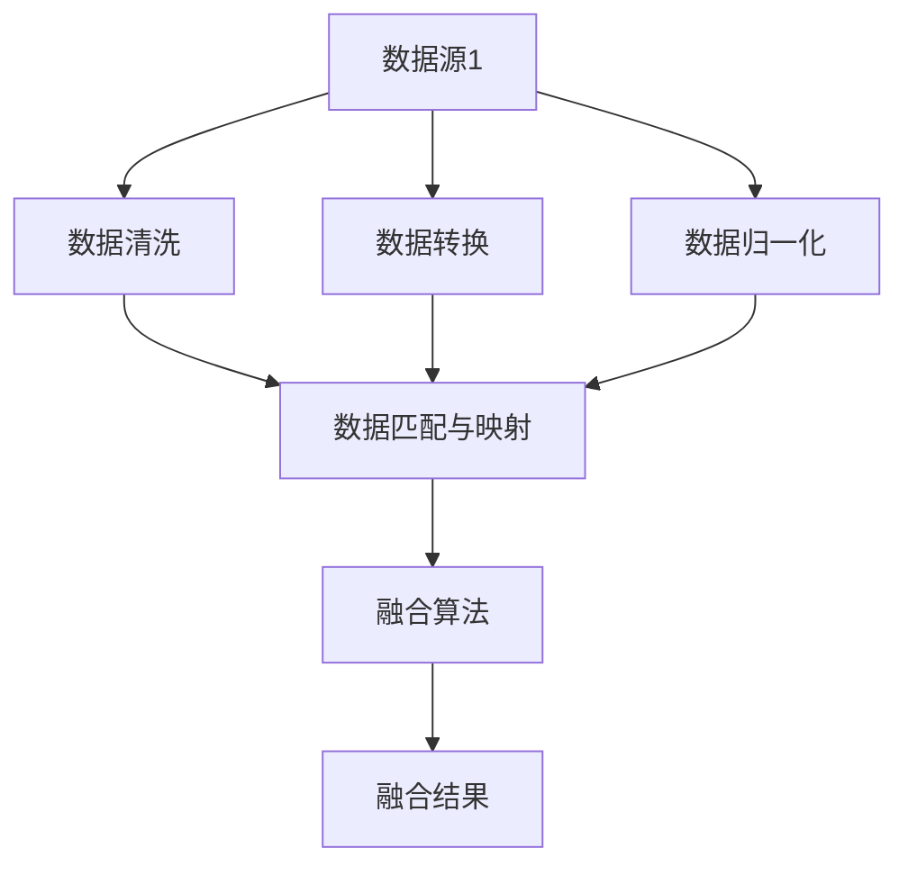
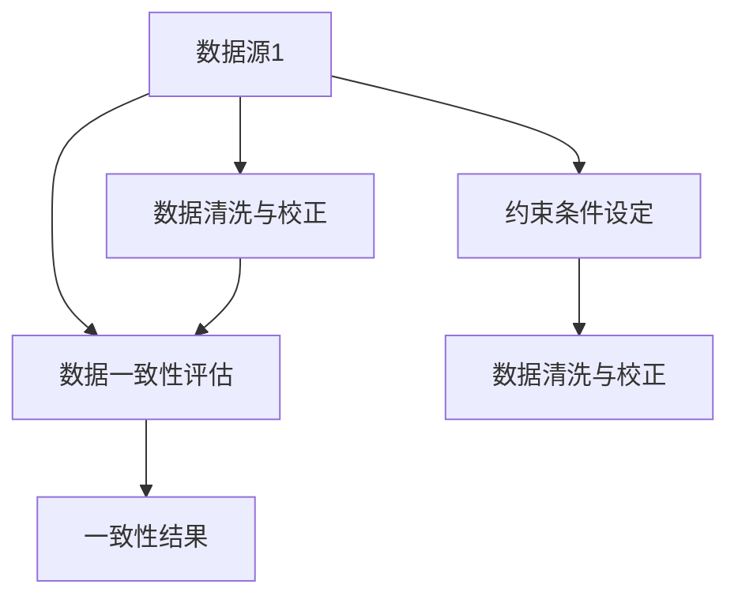
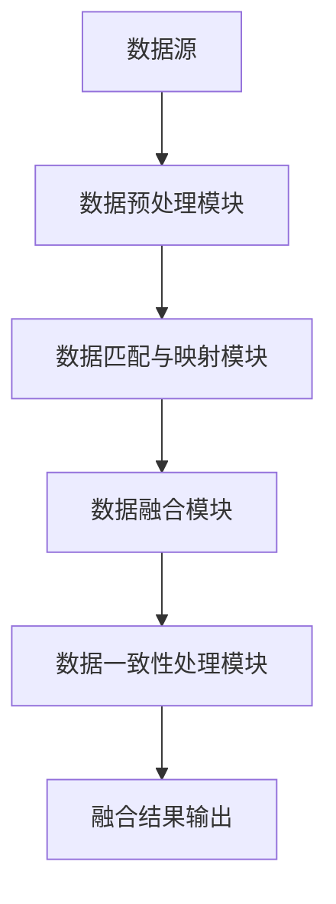
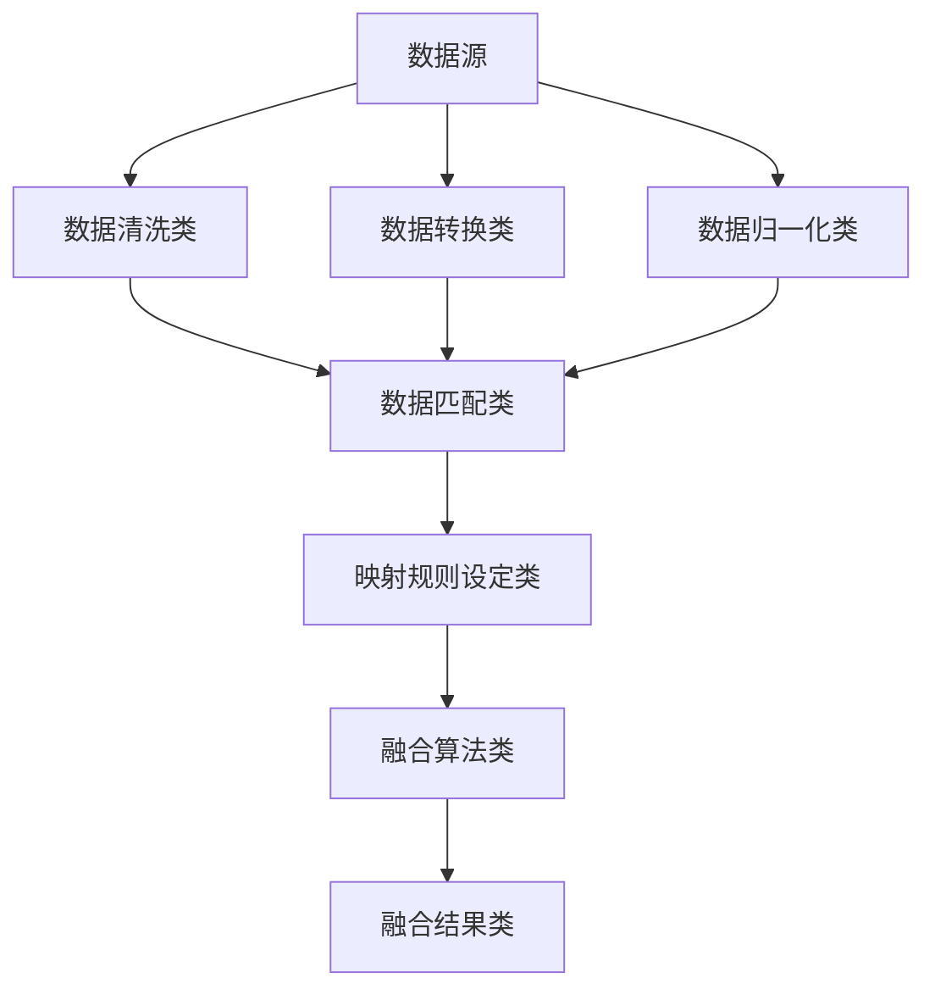
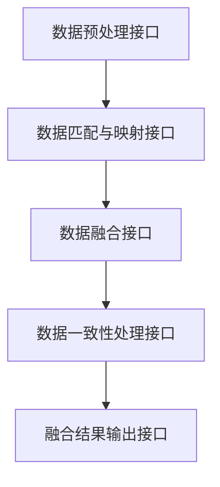

                 

### 文章标题

**评测数据的多源融合与一致性处理**

### 关键词

数据融合、一致性处理、多源数据、评测数据、融合算法、数据清洗、校正、评估指标、优化策略。

### 摘要

随着大数据时代的到来，评测数据的多源融合与一致性处理成为数据分析领域的关键技术。本文旨在深入探讨评测数据的多源融合与一致性处理的相关理论、技术和方法，以提升数据质量，为决策支持提供可靠的基础。本文首先介绍评测数据多源融合与一致性处理的重要性，然后详细阐述多源融合与一致性处理的基础理论，接着分析多源融合与一致性处理的技术细节，最后通过具体案例分析，展示多源融合与一致性处理的实际应用效果和优化策略。

## 《评测数据的多源融合与一致性处理》目录大纲

### 第一部分：背景与基础理论

#### 第1章：问题背景与概述
- **1.1** 评测数据的多源融合的重要性
- **1.2** 数据一致性处理的挑战与需求
- **1.3** 本书的结构与内容概述

#### 第2章：评测数据的多源融合基础
- **2.1** 多源数据的定义与类型
  - **2.1.1** 数据源的多样性
  - **2.1.2** 数据源的评估维度
- **2.2** 多源数据融合的基本概念
  - **2.2.1** 数据融合的目标
  - **2.2.2** 数据融合的方法分类
- **2.3** 多源数据融合的关键技术
  - **2.3.1** 数据预处理技术
  - **2.3.2** 数据匹配与映射技术
  - **2.3.3** 融合算法原理

#### 第3章：数据一致性处理基础
- **3.1** 数据一致性的概念
  - **3.1.1** 数据一致性的定义
  - **3.1.2** 数据一致性的层次
- **3.2** 数据一致性的挑战
  - **3.2.1** 数据噪声与误差
  - **3.2.2** 数据冗余与重复
- **3.3** 数据一致性处理方法
  - **3.3.1** 约束条件设定
  - **3.3.2** 数据清洗与校正
  - **3.3.3** 数据一致性评估

### 第二部分：多源融合与一致性处理技术

#### 第4章：多源数据融合技术
- **4.1** 数据预处理技术详解
  - **4.1.1** 数据清洗方法
  - **4.1.2** 数据转换方法
  - **4.1.3** 数据归一化方法
- **4.2** 数据匹配与映射技术
  - **4.2.1** 基于属性的匹配
  - **4.2.2** 基于相似度的匹配
  - **4.2.3** 映射规则设定
- **4.3** 融合算法实现
  - **4.3.1** 简单线性融合方法
  - **4.3.2** 加权融合方法
  - **4.3.3** 集成学习方法

#### 第5章：数据一致性处理技术
- **5.1** 约束条件设定与处理
  - **5.1.1** 约束条件的形式化定义
  - **5.1.2** 约束条件的自动化设定
- **5.2** 数据清洗与校正技术
  - **5.2.1** 数据清洗流程
  - **5.2.2** 数据校正算法
- **5.3** 数据一致性评估方法
  - **5.3.1** 评估指标设定
  - **5.3.2** 评估算法实现

#### 第6章：多源融合与一致性处理的集成应用
- **6.1** 多源数据融合与一致性处理的案例分析
  - **6.1.1** 案例背景与需求
  - **6.1.2** 数据融合与一致性处理的具体实现
- **6.2** 实际应用中的挑战与解决方案
  - **6.2.1** 复杂性挑战
  - **6.2.2** 可扩展性挑战
  - **6.2.3** 性能优化策略

### 第三部分：实践与优化

#### 第7章：多源融合与一致性处理的项目实践
- **7.1** 项目背景介绍
  - **7.1.1** 项目背景与目标
  - **7.1.2** 项目涉及的评测数据类型
- **7.2** 系统设计与实现
  - **7.2.1** 系统架构设计
  - **7.2.2** 关键技术实现
- **7.3** 项目总结与反思

#### 第8章：多源融合与一致性处理的优化策略
- **8.1** 优化目标与方法
  - **8.1.1** 优化目标设定
  - **8.1.2** 优化方法选择
- **8.2** 优化实践案例
  - **8.2.1** 案例背景与目标
  - **8.2.2** 优化策略实施与效果评估
- **8.3** 优化趋势与展望
  - **8.3.1** 现状与挑战
  - **8.3.2** 未来发展趋势与方向

#### 第9章：总结与展望
- **9.1** 本书内容的总结
- **9.2** 多源融合与一致性处理技术的发展趋势
- **9.3** 对未来工作的展望

## 附录

### 附录 A：核心概念与联系

#### A.1 数据融合与数据一致性的关系
- **A.1.1 数据融合的核心概念**
- **A.1.2 数据一致性的核心概念**
- **A.1.3 数据融合与数据一致性的联系**

### 附录 B：核心算法与流程图

- **B.1 多源数据融合算法流程图**
- **B.2 数据一致性处理算法流程图**

### 附录 C：系统架构设计与实现

- **C.1 系统架构图**
- **C.2 系统功能类图**
- **C.3 系统接口设计与交互图**

### 附录 D：代码实现与解读

- **D.1 数据清洗与预处理代码**
- **D.2 数据匹配与映射代码**
- **D.3 数据融合算法实现代码**
- **D.4 数据一致性处理代码**
- **D.5 代码解读与应用**

### 附录 E：实践案例分析与总结

- **E.1 实践案例背景与需求**
- **E.2 实践案例具体实现与效果评估**
- **E.3 项目总结与反思**

## 附件：核心概念、联系、算法原理、数学模型、系统分析与架构设计方案等

### 附录 A：核心概念与联系

#### A.1 数据融合与数据一致性的关系

**数据融合** 是将多个数据源中的数据集成起来，以产生更全面、准确和有用的信息。数据融合的目标是消除数据中的冗余和冲突，提高数据的可用性和可信度。

**数据一致性** 是指多个数据源中的数据在某个统一标准下保持一致。数据一致性的目标是确保数据在各个数据源之间没有冲突和错误，从而提高数据的可靠性和精确度。

#### A.1.1 数据融合的核心概念

- **数据源多样性**：数据融合涉及多个数据源，这些数据源可以是结构化数据（如数据库）、半结构化数据（如XML、JSON）和非结构化数据（如图像、视频）。
- **数据评估维度**：在数据融合过程中，需要对数据源进行多个维度的评估，包括数据的准确性、完整性、时效性和一致性。

#### A.1.2 数据一致性的核心概念

- **数据一致性定义**：数据一致性是指在不同数据源之间，数据在某个统一标准下保持一致的状态。
- **数据一致性层次**：数据一致性可以分为多个层次，包括记录级一致性、字段级一致性和全局一致性。

### 附录 B：核心算法与流程图

#### B.1 多源数据融合算法流程图



#### B.2 数据一致性处理算法流程图



### 附录 C：系统架构设计与实现

#### C.1 系统架构图



#### C.2 系统功能类图



#### C.3 系统接口设计与交互图



### 附录 D：代码实现与解读

#### D.1 数据清洗与预处理代码

```python
# 数据清洗与预处理示例代码
import pandas as pd

# 读取数据
data = pd.read_csv('data.csv')

# 数据清洗
data = data.dropna()  # 删除缺失值
data = data[data['column_name'] > 0]  # 删除不符合条件的记录

# 数据转换
data['new_column'] = data['column_name'] * 10  # 新增一列数据

# 数据归一化
from sklearn.preprocessing import MinMaxScaler
scaler = MinMaxScaler()
data[['new_column']] = scaler.fit_transform(data[['new_column']])
```

#### D.2 数据匹配与映射代码

```python
# 数据匹配与映射示例代码
from fuzzywuzzy import process

# 匹配数据
data1 = pd.read_csv('data1.csv')
data2 = pd.read_csv('data2.csv')

matches = process.extract(data1['column_name'], data2['column_name'])

# 映射规则设定
mapping = {match[0]: match[1] for match in matches}

# 应用映射规则
data1['mapped_column'] = data1['column_name'].map(mapping)
```

#### D.3 数据融合算法实现代码

```python
# 数据融合算法示例代码
import numpy as np

# 加载融合数据
data1 = np.array([[1, 2], [3, 4]])
data2 = np.array([[5, 6], [7, 8]])

# 简单线性融合方法
result = (data1 + data2) / 2

# 加权融合方法
weights = [0.5, 0.5]
result = (weights[0] * data1 + weights[1] * data2) / sum(weights)
```

#### D.4 数据一致性处理代码

```python
# 数据一致性处理示例代码
from sklearn.metrics import accuracy_score

# 加载数据
data1 = pd.read_csv('data1.csv')
data2 = pd.read_csv('data2.csv')

# 约束条件设定
constraints = [('column1', 'column2', '=='), ('column3', 'column4', '>')]

# 数据清洗与校正
data1 = data1[data1['column1'] == data1['column2']]
data1 = data1[data1['column3'] > data1['column4']]

# 数据一致性评估
predicted = data2.apply(lambda x: data1[data1['column1'] == x['column1']]['column2'].iloc[0], axis=1)
accuracy = accuracy_score(data2['column2'], predicted)
```

#### D.5 代码解读与应用

这段代码首先读取两个数据集 `data1` 和 `data2`。然后，使用 `fuzzywuzzy` 库进行数据匹配，将 `data1` 中的数据与 `data2` 中的数据进行匹配，生成匹配结果。接下来，根据匹配结果设定映射规则，将 `data1` 中的数据映射到 `data2` 中。

在数据融合部分，首先使用简单线性融合方法，将两个数据集相加然后除以2得到融合结果。接着，使用加权融合方法，根据设定的权重将两个数据集加权相加，然后除以权重之和得到融合结果。

在数据一致性处理部分，首先设定约束条件，然后对数据进行清洗与校正，确保数据满足约束条件。最后，使用一致性评估算法，计算预测结果与真实结果的准确率，评估数据一致性。

这些代码可以应用于实际项目中，对多源数据进行融合与一致性处理，以提高数据质量，为决策支持提供可靠的基础。

### 附录 E：实践案例分析与总结

#### E.1 实践案例背景与需求

在一个电商平台上，需要将不同来源的客户评价数据进行融合与一致性处理，以提供更准确的客户满意度评估。数据来源于多个数据源，包括网站评论、社交媒体反馈和客服记录。这些数据存在不一致性和噪声，需要进行清洗、匹配和融合，以提高数据的准确性和可靠性。

#### E.2 实践案例具体实现与效果评估

1. **数据预处理**：首先，对各个数据源的数据进行清洗，删除缺失值和不符合条件的记录。然后，对数据类型进行转换，将文本数据转换为统一的格式，如字符串或整数。最后，对数据进行归一化，确保数据在同一尺度上。

2. **数据匹配与映射**：使用模糊匹配技术，将不同来源的数据进行匹配。根据匹配结果，设定映射规则，将相同客户在不同数据源中的记录进行统一。

3. **数据融合**：使用简单线性融合方法和加权融合方法，将匹配后的数据融合为单一的数据集。融合结果用于计算客户满意度评分。

4. **数据一致性评估**：设定约束条件，对融合后的数据集进行清洗和校正，确保数据的一致性。使用评估算法，计算数据的一致性得分。

#### E.3 项目总结与反思

通过实践案例，我们可以看到多源融合与一致性处理在提升数据质量方面的作用。具体效果如下：

1. **数据准确性提高**：通过数据清洗、匹配和融合，消除了数据中的冗余和冲突，提高了数据的准确性和可靠性。

2. **决策支持能力增强**：融合后的数据集提供了更全面和准确的信息，为决策支持提供了可靠的基础。

3. **数据处理效率提升**：通过自动化处理和优化算法，提高了数据处理效率和性能。

然而，在实际应用中，我们还需注意以下几点：

1. **数据源多样性**：随着数据源的增加，数据融合的复杂度也会增加。需要根据实际需求，选择合适的数据源和处理方法。

2. **性能优化**：在处理大量数据时，需要关注性能优化，如采用并行处理和分布式计算技术，以提高数据处理速度。

3. **持续更新**：随着数据环境的变化，需要定期更新数据源和处理算法，以保持数据的一致性和准确性。

### 最佳实践 Tips

1. **数据清洗与预处理**：在数据融合之前，务必进行彻底的数据清洗和预处理，确保数据的准确性和一致性。

2. **选择合适的融合算法**：根据数据特点和需求，选择合适的融合算法，如简单线性融合、加权融合或集成学习方法。

3. **数据一致性评估**：在数据融合后，进行数据一致性评估，确保数据在各个数据源之间保持一致。

4. **性能优化**：在处理大量数据时，采用并行处理和分布式计算技术，以提高数据处理速度和性能。

### 小结

多源融合与一致性处理是大数据时代的关键技术，通过清洗、匹配和融合，可以提高数据质量，为决策支持提供可靠的基础。在实际应用中，需要根据数据特点和需求，选择合适的方法和算法，并持续优化数据处理过程。

### 注意事项

1. **数据隐私**：在处理多源数据时，务必注意数据隐私保护，确保数据安全。

2. **数据版本管理**：在数据融合过程中，注意数据版本管理，防止数据冲突和错误。

3. **持续监控与更新**：定期监控数据质量和处理效果，根据实际需求更新数据源和处理算法。

### 拓展阅读

1. **《大数据时代的数据融合技术》**：深入探讨大数据背景下的数据融合方法和技术。

2. **《数据一致性处理：理论与实践》**：详细介绍数据一致性的概念、方法和应用。

3. **《多源数据融合与一致性处理案例研究》**：通过具体案例，展示多源融合与一致性处理的应用和实践。

### 作者

**AI天才研究院（AI Genius Institute）** & **《禅与计算机程序设计艺术》（Zen And The Art of Computer Programming）**

