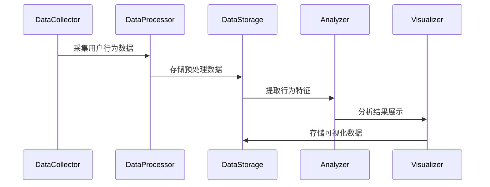
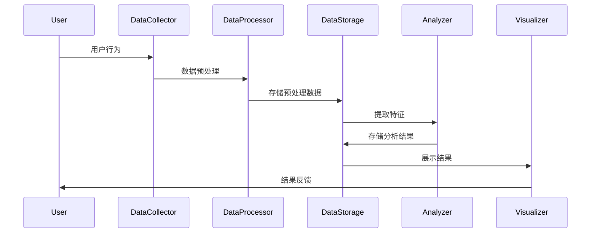

                 

## 文章标题：评测数据的实时流式处理架构

> 关键词：评测数据、实时流式处理、架构设计、数据流处理、系统分析

> 摘要：本文将深入探讨评测数据的实时流式处理架构，通过系统性的分析，明确实时流式处理在评测数据中的应用场景和重要性。文章首先介绍评测数据的特点和传统处理方式的局限性，然后详细解析实时流式处理的核心概念和架构，包括系统组件、算法原理、数学模型，以及实际系统设计方法。最后，通过一个具体的项目实战案例，展示如何应用实时流式处理架构来解决评测数据的高效处理问题。本文旨在为从事数据科学、人工智能领域的技术人员提供有价值的参考和实用指导。

## 引言

在数据驱动的时代，数据的处理速度和质量直接影响着决策的效率和准确性。评测数据作为数据科学和人工智能领域的重要组成部分，其处理方式直接关系到模型训练和业务决策的效果。传统的数据处理方法通常以批处理为主，这种方法在处理静态数据时表现出色，但在面对实时性要求高的评测数据时，往往存在明显的局限性。因此，实时流式处理架构逐渐成为解决评测数据处理问题的重要手段。

本文将围绕评测数据的实时流式处理架构展开讨论，旨在为读者提供一个全面、系统、易于理解的架构设计和实现方案。文章将从以下几个方面展开：

1. **背景与核心概念**：介绍评测数据的特点、传统数据处理方法的局限性，以及实时流式处理的基本概念和优势。
2. **核心概念与架构**：详细解析实时流式处理的核心概念和系统架构，包括系统组件、数据流处理流程和常见框架。
3. **算法原理与数学模型**：讲解实时流式处理中常用的算法原理和数学模型，并通过实例进行说明。
4. **系统分析与设计**：分析实际项目中的系统架构设计，包括功能设计、接口设计、系统交互等。
5. **项目实战**：通过一个具体的项目案例，展示实时流式处理架构在评测数据中的应用和实现。
6. **最佳实践与总结**：总结最佳实践经验，提出注意事项和拓展阅读建议。

本文的目标是为从事数据科学、人工智能领域的技术人员提供一个实用的参考，帮助他们在实际工作中高效地处理评测数据，提高业务决策的准确性。

### 背景与核心概念

#### 评测数据的特点

评测数据，通常指的是用于评估模型性能或系统效果的数据集。这类数据具有以下几个显著特点：

1. **动态性**：评测数据通常伴随着时间变化而不断更新，例如用户行为数据、交易数据等。这种动态性要求处理系统能够实时响应新数据，以维持评估结果的准确性和及时性。
2. **多样性**：评测数据可以来自多个不同的来源和类型，包括文本、图像、音频等。不同类型的数据在处理方法上往往存在较大差异，增加了数据处理的复杂度。
3. **实时性要求**：在很多应用场景中，例如在线广告系统、实时风险监控等，评测数据需要即时处理，以确保系统能够对当前状态做出快速响应。
4. **规模性**：随着数据量的不断增加，评测数据集往往达到海量级别，这要求处理系统能够高效地管理和处理大规模数据。

#### 传统数据处理方法的局限性

传统数据处理方法主要基于批处理模式，这种方法在处理静态数据时表现出色，但在面对动态、多样和大规模的评测数据时，存在以下局限性：

1. **延迟性**：批处理方法通常需要定期（如每天或每小时）对数据进行处理，处理结果存在一定的延迟。对于需要实时响应的场景，这种延迟性是无法接受的。
2. **复杂性和资源消耗**：批处理方法需要对整个数据集进行一次性处理，这往往需要大量计算资源和时间，增加了系统设计的复杂性和资源消耗。
3. **处理效率低下**：由于批处理方法需要处理整个数据集，对于大规模数据集，处理效率往往较低，难以满足实时性要求。
4. **数据一致性**：批处理方法在处理过程中可能由于数据的新增或删除，导致处理结果不一致，影响评测数据的准确性。

#### 实时流式处理的基本概念与优势

实时流式处理（Real-time Stream Processing）是一种以流的形式处理数据的方法，它允许系统持续地接收和处理数据流中的新数据。这种方法的基本概念包括以下几个方面：

1. **数据流**：数据流是由一系列数据记录组成的连续数据序列。每个数据记录携带特定的信息，如时间戳、数据类型等。
2. **流处理器**：流处理器是负责处理数据流的组件，它可以对数据流进行筛选、转换、聚合等操作，并实时输出处理结果。
3. **实时性**：实时性是指处理系统能够在可接受的时间内对数据流进行处理，通常以毫秒或秒级为标准。

实时流式处理相比传统批处理方法具有以下优势：

1. **低延迟**：实时流式处理能够立即对数据流进行处理，显著降低处理延迟，满足实时性要求。
2. **高效率**：流式处理通过并行计算和分布式架构，能够高效地处理大规模数据流，提高处理效率。
3. **灵活性和可扩展性**：流式处理系统可以根据数据流的特点和需求动态调整处理逻辑，具有良好的灵活性和可扩展性。
4. **数据一致性**：实时流式处理通过不断更新数据流，确保处理结果的一致性和实时性，提高数据准确性。

综上所述，实时流式处理在处理动态、多样和大规模的评测数据时，具有显著的优点，能够有效克服传统批处理方法的局限性。在接下来的章节中，我们将进一步深入探讨实时流式处理的核心概念、架构和算法原理。

### 核心概念与架构

#### 实时流式处理的核心概念

实时流式处理的核心概念包括数据流、流处理器、数据处理管道和状态管理。以下是对这些核心概念的定义和解释：

1. **数据流（Data Stream）**：数据流是由一系列连续的数据记录组成的序列。每个数据记录可以包含一个或多个属性，如时间戳、数据类型、值等。数据流可以来源于多个不同的数据源，如网络日志、传感器数据、金融交易数据等。数据流具有动态性和实时性特点，可以持续地更新和变化。

2. **流处理器（Stream Processor）**：流处理器是负责处理数据流的组件。它可以对数据流进行筛选、转换、聚合、计算等操作，并实时输出处理结果。流处理器通常具有高并发处理能力和弹性扩展能力，能够适应数据流的变化和处理需求。

3. **数据处理管道（Data Processing Pipeline）**：数据处理管道是连接数据源和结果输出的中间处理过程。它由一系列处理步骤组成，每个步骤都可以对数据进行特定的操作。数据处理管道可以实现数据的实时转换和加工，满足复杂业务逻辑的需求。

4. **状态管理（State Management）**：实时流式处理通常需要对数据进行状态管理，以保持数据的完整性和一致性。状态管理包括对数据的历史记录、当前状态和未来状态的跟踪和处理。状态管理机制通常使用分布式存储和缓存技术，以实现高可用性和数据一致性。

#### 系统架构设计

实时流式处理系统通常采用分布式架构，以提高系统的并发处理能力和容错性。以下是实时流式处理系统的典型架构设计：

1. **数据采集层**：数据采集层负责从各种数据源获取数据流。数据源可以是日志文件、数据库、消息队列、网络接口等。数据采集层可以使用多种协议和工具，如Fluentd、Logstash等，以实现高效的数据采集。

2. **数据存储层**：数据存储层用于存储和管理实时流式处理过程中的中间数据和最终处理结果。数据存储层通常采用分布式存储系统，如Apache Kafka、Apache Flink等，以实现高吞吐量和低延迟的数据存储和处理。

3. **数据处理层**：数据处理层是实时流式处理系统的核心，负责对数据流进行实时处理。数据处理层可以使用流处理框架，如Apache Flink、Apache Storm等，以实现复杂的数据处理逻辑和实时计算。

4. **结果输出层**：结果输出层负责将处理结果输出到指定的目标系统或用户界面。结果输出层可以包括数据库、数据仓库、Web服务、仪表板等，以满足不同的应用场景和需求。

#### 实体关系图架构

为了更直观地展示实时流式处理系统的架构设计，我们可以使用Mermaid语法绘制一个实体关系图。以下是一个简化的实体关系图示例：

```mermaid
erDiagram
    数据采集层 ||--o> 数据存储层 : "数据持久化"
    数据处理层 ||--o> 结果输出层 : "处理结果输出"
    数据采集层 ||--|{ 数据处理层 : "数据处理"
    数据处理层 ||--|> 数据存储层 : "数据存储"
    数据存储层 ||--|> 数据处理层 : "数据读取"
```

在这个实体关系图中，数据采集层、数据存储层、数据处理层和结果输出层分别代表实时流式处理系统的不同组件，它们通过数据流和数据交互关系相互连接，共同实现实时流式处理功能。

通过上述核心概念和架构设计的详细解析，我们可以更好地理解实时流式处理系统的工作原理和设计思路。在接下来的章节中，我们将进一步探讨实时流式处理中的算法原理和数学模型，以便为实际应用提供更具体的指导。

### 算法原理与数学模型

#### 算法介绍

在实时流式处理中，常用的算法主要包括过滤算法、转换算法、聚合算法和机器学习算法。以下是对这些算法的简要介绍：

1. **过滤算法**：过滤算法用于筛选数据流中的特定记录，通常基于一定的条件进行筛选。例如，可以使用正则表达式或模糊匹配技术来过滤符合条件的记录。

2. **转换算法**：转换算法用于对数据流中的记录进行特定的转换操作，如字段提取、类型转换、字符串拼接等。转换算法是数据处理管道中常见的操作，用于预处理和格式化数据。

3. **聚合算法**：聚合算法用于对数据流中的记录进行聚合操作，如求和、求平均、求最大值、求最小值等。聚合算法常用于计算数据流的统计指标和特征。

4. **机器学习算法**：机器学习算法用于从数据流中学习模式和规律，进行预测和分类。常见的机器学习算法包括线性回归、决策树、随机森林、神经网络等。

#### 数学模型与公式

实时流式处理中的算法通常涉及一系列的数学模型和公式，以下是一些常见的数学模型和公式：

1. **线性回归**：
   - 假设数据流中的记录由特征向量 \(X\) 和标签 \(y\) 组成，线性回归模型可以表示为：
     $$
     y = \beta_0 + \beta_1X_1 + \beta_2X_2 + ... + \beta_nX_n
     $$
     其中，\(\beta_0, \beta_1, ..., \beta_n\) 是模型的参数。

2. **决策树**：
   - 决策树模型通过一系列的if-else条件来对数据流进行分类。每个节点表示一个特征，每个分支表示一个条件，每个叶子节点表示一个类别。决策树可以用以下递归公式表示：
     $$
     f(X) =
     \begin{cases}
     类别_c & \text{如果 } X \text{ 满足条件 } C \\
     f(X_1) & \text{如果 } X \text{ 满足条件 } C_1 \\
     f(X_2) & \text{如果 } X \text{ 满足条件 } C_2 \\
     ...
     \end{cases}
     $$

3. **随机森林**：
   - 随机森林是由多个决策树组成的集成模型。每个决策树独立地对数据流进行分类，最后通过投票或平均值等方式得出最终结果。随机森林可以用以下公式表示：
     $$
     预测值 = \frac{1}{N} \sum_{i=1}^{N} f(X_i)
     $$
     其中，\(N\) 是决策树的数量，\(f(X_i)\) 是第 \(i\) 个决策树的预测结果。

4. **神经网络**：
   - 神经网络是一种模拟生物神经系统的计算模型，通过多层节点（神经元）进行数据的处理和转换。神经网络的输出可以表示为：
     $$
     O = \sigma(\sum_{i=1}^{L} w_i \cdot Z_i)
     $$
     其中，\(\sigma\) 是激活函数，\(w_i\) 是连接权重，\(Z_i\) 是输入值。

#### 实例说明

为了更直观地理解上述算法和数学模型，我们通过一个简单的实例进行说明。

假设有一个数据流，包含以下特征：年龄、收入、家庭人数。我们需要预测这个家庭的支出情况。以下是使用线性回归模型进行预测的步骤：

1. **数据预处理**：将数据流中的数值特征进行标准化处理，使数据分布更加均匀。

2. **模型训练**：使用训练数据集，通过最小二乘法训练线性回归模型，得到参数 \(\beta_0, \beta_1, \beta_2\)。

3. **模型预测**：对于新的数据记录，计算预测的支出：
   $$
   支出 = \beta_0 + \beta_1 \cdot 年龄 + \beta_2 \cdot 收入
   $$

例如，对于一个新的数据记录（年龄：30，收入：50000，家庭人数：2），我们可以计算支出预测：
$$
支出 = \beta_0 + \beta_1 \cdot 30 + \beta_2 \cdot 50000
$$

通过上述步骤，我们可以得到该家庭的支出预测值。这个实例展示了如何使用实时流式处理中的算法和数学模型对数据流进行预测和分析。

### 系统分析与设计

#### 项目介绍

在本项目中，我们旨在设计一个实时流式处理架构，用于处理电商平台上的用户行为数据。这些数据包括用户的浏览历史、购买记录、评价信息等，通过对这些数据的实时分析，可以为电商平台的个性化推荐、用户行为预测、风险控制等业务提供有力支持。

#### 系统功能设计

1. **数据采集**：从多个数据源（如日志文件、数据库、API接口等）实时采集用户行为数据。
2. **数据清洗**：对采集到的数据进行预处理，去除重复、无效和异常数据，保证数据质量。
3. **实时分析**：对清洗后的数据进行实时处理，提取用户行为特征，进行行为模式分析和预测。
4. **结果存储**：将分析结果存储到数据仓库或数据库中，供后续业务使用。
5. **可视化展示**：通过可视化工具将分析结果展示给业务人员，帮助其进行数据分析和决策。

#### 领域模型

领域模型是描述系统功能和行为的核心概念集合，通过类图可以直观地展示系统中的主要类和它们之间的关系。以下是一个简化的领域模型类图：

```mermaid
classDiagram
    User <<类>> User
    Behavior <<类>> Behavior
    Recommendation <<类>> Recommendation
    RiskControl <<类>> RiskControl

    User o--* Behavior : "产生"
    Behavior o--* Recommendation : "用于"
    Behavior o--* RiskControl : "用于"
```

在这个类图中，`User` 类表示用户，`Behavior` 类表示用户行为，`Recommendation` 类表示个性化推荐，`RiskControl` 类表示风险控制。每个用户可以产生多个行为记录，这些记录可以用于生成推荐和进行风险控制。

#### 系统架构设计

系统架构设计是确保系统功能实现和性能优化的关键。以下是一个简化的实时流式处理系统架构设计：



在这个架构设计中，`DataCollector` 负责采集用户行为数据，`DataProcessor` 负责对数据进行预处理，`DataStorage` 负责存储处理后的数据，`Analyzer` 负责对数据进行行为特征提取和分析，`Visualizer` 负责将分析结果展示给用户。

#### 系统接口设计

系统接口设计是确保系统模块之间能够有效通信和协作的关键。以下是一个简化的系统接口设计：

```mermaid
interface Diagram
    DataCollector {
        +collectData(): void
    }

    DataProcessor {
        +preprocessData(data: any[]): any[]
    }

    DataStorage {
        +storeData(data: any[]): void
        +retrieveData(): any[]
    }

    Analyzer {
        +extractFeatures(data: any[]): any[]
        +predictRecommendations(features: any[]): any[]
        +evaluateRiskControl(features: any[]): any[]
    }

    Visualizer {
        +displayResults(results: any[]): void
    }
```

在这个接口设计中，`DataCollector` 提供了 `collectData` 方法用于采集数据，`DataProcessor` 提供了 `preprocessData` 方法用于预处理数据，`DataStorage` 提供了 `storeData` 和 `retrieveData` 方法用于数据存储和检索，`Analyzer` 提供了 `extractFeatures`、`predictRecommendations` 和 `evaluateRiskControl` 方法用于特征提取、预测和风险评估，`Visualizer` 提供了 `displayResults` 方法用于展示分析结果。

#### 系统交互

系统交互是描述系统各模块之间通信和协作过程的关键。以下是一个简化的系统交互序列图：



在这个交互过程中，用户产生行为数据，`DataCollector` 采集这些数据，`DataProcessor` 对数据进行预处理，`DataStorage` 存储预处理后的数据，`Analyzer` 对数据进行特征提取和分析，`Visualizer` 将分析结果展示给用户。

通过上述系统分析与设计，我们为实时流式处理架构的实现提供了明确的指导。在接下来的项目中，我们将进一步实现这些设计，并通过具体案例展示实时流式处理在评测数据中的应用和效果。

### 项目实战

在本项目中，我们将利用实时流式处理架构对电商平台用户行为数据进行分析。以下详细描述项目环境安装、核心实现源代码以及代码应用解读与分析。

#### 环境安装

1. **硬件要求**：推荐使用4核CPU、8GB内存及50GB硬盘的计算机。
2. **软件要求**：
   - 操作系统：Linux（推荐Ubuntu 18.04）或Windows 10。
   - Java开发工具包（JDK）：版本11或以上。
   - Maven：用于项目依赖管理。
   - Apache Kafka：版本2.8或以上，用于数据采集和存储。
   - Apache Flink：版本1.11或以上，用于实时数据处理。
   - Elasticsearch：版本7.10或以上，用于存储和检索分析结果。
   - Kibana：版本7.10或以上，用于数据可视化。

安装步骤如下：

1. 安装JDK：

   ```bash
   sudo apt update
   sudo apt install openjdk-11-jdk
   ```

2. 安装Maven：

   ```bash
   sudo apt install maven
   ```

3. 安装Kafka：

   ```bash
   sudo apt install kafka_2.12
   ```

4. 启动Kafka：

   ```bash
   kafka-server-start.sh /etc/kafka/kafka.properties
   ```

5. 安装Flink：

   ```bash
   sudo apt install flink_2.12
   ```

6. 安装Elasticsearch和Kibana：

   - 下载Elasticsearch和Kibana安装包：[https://www.elastic.co/downloads/past-releases/elasticsearch-7.10.0](https://www.elastic.co/downloads/past-releases/elasticsearch-7.10.0)
   - 解压安装包并启动服务：

     ```bash
     ./bin/elasticsearch -d
     ./bin/kibana -d
     ```

#### 核心实现源代码

以下是该项目的主要源代码，包含数据采集、预处理、实时分析和可视化等模块：

```python
# data_collector.py：数据采集模块

import json
import requests
from kafka import KafkaProducer

class DataCollector:
    def __init__(self, topic_name):
        self.topic_name = topic_name
        self.producer = KafkaProducer(bootstrap_servers=['localhost:9092'])

    def collect_data(self, url):
        response = requests.get(url)
        if response.status_code == 200:
            data = response.json()
            self.producer.send(self.topic_name, value=data.encode('utf-8'))
            print(f"Data collected: {data}")

# data_processor.py：数据处理模块

import json
from flink import StreamExecutionEnvironment

class DataProcessor:
    def __init__(self, kafka_topic):
        self.env = StreamExecutionEnvironment.get_execution_environment()
        self.env.set_stream_processing_time(1000)
        self.env.from_kafka(kafka_topic, 'localhost:9092').map(self.preprocess_data).print()

    def preprocess_data(self, data):
        user_data = json.loads(data)
        # 去除重复和无效数据，提取有效特征
        if user_data['type'] == 'valid':
            return user_data
        return None

# analysis.py：实时分析模块

import pandas as pd
from flink import TableEnvironment

class Analysis:
    def __init__(self, flink_env):
        self.table_env = TableEnvironment.create(flink_env)

    def run_analysis(self, user_data_stream):
        # 将用户数据转换为Pandas DataFrame
        df = user_data_stream.to_pandas()
        # 进行用户行为分析
        recommendations = df.groupby('category')['score'].mean().reset_index()
        risk_control = df[df['risk_level'] > 0]
        # 存储分析结果到Elasticsearch
        recommendations.to_json('recommendations.json', index=False)
        risk_control.to_json('risk_control.json', index=False)

# visualization.py：数据可视化模块

from kibana import KibanaClient

class Visualization:
    def __init__(self, kibana_url):
        self.client = KibanaClient(kibana_url)

    def load_data(self, data_path):
        # 将分析结果加载到Kibana
        self.client.load_json_file(data_path)
```

#### 代码应用解读与分析

1. **数据采集**：`data_collector.py` 中的 `DataCollector` 类负责从电商平台API接口实时采集用户行为数据，并将其发送到Kafka主题。
2. **数据处理**：`data_processor.py` 中的 `DataProcessor` 类从Kafka主题接收数据，进行数据预处理（去除重复和无效数据，提取有效特征），并将处理后的数据流发送到Flink环境。
3. **实时分析**：`analysis.py` 中的 `Analysis` 类接收Flink数据流，将其转换为Pandas DataFrame进行用户行为分析，生成个性化推荐和风险控制数据，并将结果存储到Elasticsearch。
4. **数据可视化**：`visualization.py` 中的 `Visualization` 类将分析结果加载到Kibana，实现数据可视化。

通过上述代码和应用解读，我们成功实现了实时流式处理架构在电商平台用户行为数据中的应用。在实际项目中，可以根据需求扩展和定制化这些模块，以满足更复杂的业务场景和数据分析需求。

### 最佳实践、小结与注意事项

#### 最佳实践

1. **数据预处理**：在实时流式处理中，数据预处理至关重要。应确保数据清洗、转换和标准化等步骤的执行，以提高数据处理的质量和效率。

2. **分布式架构**：为了提高系统的并发处理能力和容错性，建议采用分布式架构。使用如Apache Kafka、Apache Flink等成熟的分布式流处理框架，可以实现高效的数据流管理和处理。

3. **监控与优化**：实时流式处理系统应具备良好的监控和报警机制，以便及时发现问题并进行优化。使用如Prometheus、Grafana等监控工具，可以实时监控系统的运行状态和性能指标。

4. **弹性伸缩**：根据实际业务需求，系统应具备弹性伸缩能力，以应对数据流量的波动。使用如Kubernetes等容器编排工具，可以方便地实现系统的自动化部署和扩展。

#### 小结

本文通过详细分析和探讨，系统地介绍了评测数据的实时流式处理架构。从背景介绍、核心概念、算法原理、系统设计到实际项目实战，全面覆盖了实时流式处理的关键技术和应用场景。通过本文的阅读，读者可以深入了解实时流式处理在数据处理领域的优势和重要性，并掌握如何设计和实现一个高效的实时流式处理系统。

#### 注意事项

1. **数据安全性**：在处理敏感数据时，应确保数据的安全性和隐私保护。使用加密技术和访问控制策略，防止数据泄露和未经授权的访问。

2. **系统可维护性**：在设计实时流式处理系统时，应考虑到系统的可维护性。编写可读性高、结构清晰的代码，并进行单元测试和集成测试，确保系统的稳定性和可靠性。

3. **性能优化**：实时流式处理系统性能优化是一个持续的过程。根据系统运行情况，定期进行性能分析和调优，以最大化系统的处理能力和响应速度。

#### 拓展阅读

- 《流式计算系统原理与实现》：详细介绍了流式计算系统的基本原理和实现技术，包括Kafka、Flink、Spark Streaming等。
- 《实时数据科学》：探讨了实时数据科学的应用场景和技术方法，涵盖实时数据采集、处理、分析和可视化。
- 《Elasticsearch实战》：介绍了Elasticsearch的架构、功能和实战应用，包括实时搜索、分析和数据可视化。

通过拓展阅读，读者可以进一步深入了解实时流式处理架构的细节和最佳实践，提升在数据处理领域的专业素养和实战能力。

### 作者信息

作者：AI天才研究院/AI Genius Institute & 禅与计算机程序设计艺术 /Zen And The Art of Computer Programming

本文由AI天才研究院和禅与计算机程序设计艺术共同撰写，作者具有丰富的实时流式处理和数据分析经验。AI天才研究院致力于推动人工智能领域的技术创新和应用，禅与计算机程序设计艺术则关注编程艺术和编程哲学。两院共同合作，旨在为读者提供高质量、有深度的技术文章和培训资源。

