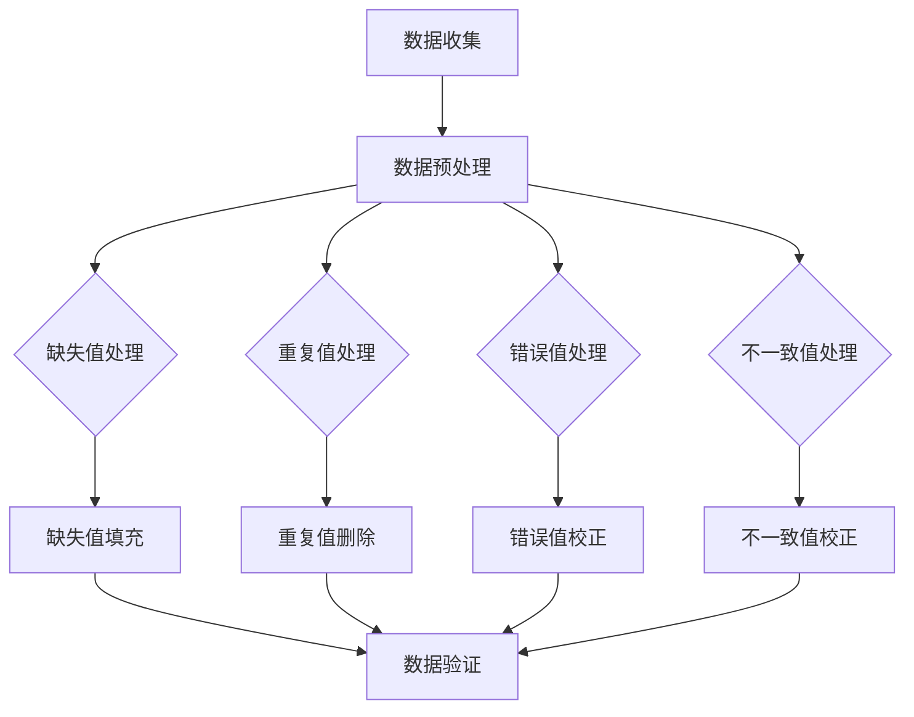

                 

## 评测数据的质量控制：LLM辅助的数据净化

### 关键词：
- 数据质量控制
- 大语言模型（LLM）
- 数据净化
- 数据清洗
- 评测数据

### 摘要：
在人工智能和机器学习的应用中，数据的质量直接关系到模型的效果。本文将探讨评测数据的质量控制，特别是如何利用大语言模型（LLM）辅助进行数据净化。我们将一步一步地分析数据质量问题、大语言模型的基础知识，以及如何在数据清洗过程中应用LLM，最终探讨这一技术的应用场景和最佳实践。

## 引言与背景介绍

### 1.1 问题背景

#### 1.1.1 评测数据质量控制的重要性
在人工智能和机器学习项目中，评测数据的质量对模型性能有着至关重要的影响。高质量的数据可以帮助模型更好地学习，从而提高模型的准确性和鲁棒性。相反，数据质量问题，如缺失、错误、重复和不一致，会严重影响模型的性能，甚至可能导致模型失效。

#### 1.1.2 数据质量问题及其影响
数据质量问题是机器学习项目中的常见问题。这些问题的存在会导致模型训练过程中出现偏差，降低模型的泛化能力，甚至导致模型无法正常工作。例如，数据缺失可能导致模型无法正确学习数据的特征，数据错误可能导致模型学习到错误的信息，数据重复会导致模型过拟合。

#### 1.1.3 大语言模型的发展与应用
大语言模型（LLM）是自然语言处理领域的重要进展。这些模型通过学习大量的文本数据，可以理解并生成自然语言。随着深度学习技术的发展，LLM在多种应用场景中展现出了强大的能力。近年来，研究人员开始探索如何利用LLM辅助进行数据清洗，以提高数据质量。

### 1.2 大语言模型简介

#### 1.2.1 大语言模型的基础知识
大语言模型是一种基于深度学习的模型，它可以对文本进行建模，并预测下一个单词或句子。这些模型通常由数以亿计的参数组成，能够捕捉到语言中的复杂模式和结构。

#### 12.2 大语言模型的工作原理
LLM通常基于变换器架构（Transformer），这种架构通过自注意力机制（self-attention）和多头注意力（multi-head attention）来处理文本数据。自注意力机制允许模型在生成文本时，考虑之前生成的所有单词，从而生成更加连贯的文本。

#### 1.2.3 大语言模型在数据清洗中的应用
LLM在数据清洗中的应用主要包括以下几个方面：处理缺失数据、纠正错误数据、识别重复数据和不一致数据。LLM可以利用其强大的语言理解能力，自动识别和修复这些问题。

### 1.3 书籍概述

#### 1.3.1 书籍结构安排
本书分为四个部分，首先介绍数据清洗的基本概念和技术，然后深入探讨大语言模型在数据清洗中的应用，接着通过实战案例展示如何使用LLM进行数据清洗，最后总结最佳实践和未来的发展方向。

#### 1.3.2 学习目标
通过阅读本书，读者将了解：
- 数据质量控制的必要性。
- 大语言模型的基础知识。
- 如何使用LLM进行数据清洗。
- 数据清洗的实际应用场景。

#### 1.3.3 阅读对象
本书适合数据科学家、机器学习工程师、软件工程师以及对数据清洗和自然语言处理感兴趣的研究人员阅读。

### 1.4 本书内容安排与章节分布

#### 1.4.1 第一部分：基础知识
本部分将介绍数据清洗的基本概念、方法和工具，以及大语言模型的基础知识。

#### 1.4.2 第二部分：数据清洗技术
本部分将详细探讨数据清洗的各种技术，包括手动清洗、自动清洗和半自动清洗。

#### 1.4.3 第三部分：实战案例
本部分将通过实际案例，展示如何使用大语言模型进行数据清洗，并分析清洗前后的效果。

#### 1.4.4 第四部分：总结与展望
本部分将总结全书内容，探讨大语言模型在数据清洗中的最佳实践，并展望未来的发展方向。

## 1.5 本章小结
本章介绍了评测数据的质量控制问题以及大语言模型的基础知识。下一章将深入探讨数据清洗的基本概念和技术。让我们继续前进，逐步了解数据清洗的各个方面。

----------------------------------------------------------------

## 第二部分：数据清洗技术基础

### 2.1 数据清洗概述

#### 2.1.1 数据清洗的定义
数据清洗是指对数据进行处理，以消除错误、缺失、重复和不一致的过程。数据清洗是数据预处理的重要环节，它直接影响到数据分析的质量和效果。

#### 2.1.2 数据清洗的目的
数据清洗的主要目的是提高数据的质量，确保数据能够准确地反映现实世界的情况。通过数据清洗，可以减少数据中的错误和噪声，提高数据的完整性和一致性，从而为后续的数据分析和建模提供可靠的基础。

#### 2.1.3 数据清洗的基本步骤
数据清洗通常包括以下几个基本步骤：
1. 数据验证：检查数据是否存在缺失、错误、重复或不一致等问题。
2. 数据预处理：对数据进行标准化、归一化等处理，以提高数据的可比性。
3. 数据清洗：对存在问题的数据进行修正或删除。
4. 数据验证：再次检查数据清洗的结果，确保数据质量问题得到解决。

### 2.2 数据质量问题

#### 2.2.1 数据缺失
数据缺失是指数据集中某些值未记录或未填写。数据缺失会对数据分析产生负面影响，因为它会导致模型无法正确学习数据的特征。常见的解决方法包括插值、均值填充和模式识别等。

#### 2.2.2 数据重复
数据重复是指数据集中存在相同的记录或数据项。数据重复不仅占用额外的存储空间，还会干扰数据的分析过程。解决数据重复的方法通常包括去重和唯一性校验。

#### 2.2.3 数据错误
数据错误是指数据集中存在的错误值或不合理的值。数据错误可能是由数据录入错误、硬件故障或软件错误等原因引起的。解决数据错误的方法包括修复、删除或替换错误的值。

#### 2.2.4 数据不一致
数据不一致是指数据集中存在不同格式的数据或不同来源的数据之间存在差异。数据不一致会影响数据的整合和共享。解决数据不一致的方法包括数据转换、数据标准化和一致性校验。

### 2.3 数据清洗方法

#### 2.3.1 手动清洗
手动清洗是指通过人工对数据进行检查和修正。手动清洗适用于数据量较小且数据结构较为简单的场景，但由于其效率低下，通常不适用于大规模数据清洗。

#### 2.3.2 自动清洗
自动清洗是指利用编程脚本或工具对数据进行自动化处理。自动清洗适用于大规模数据清洗，可以提高清洗效率和准确性。

#### 2.3.3 半自动清洗
半自动清洗是指结合手动清洗和自动清洗的方法，通过半自动化的方式对数据进行处理。半自动清洗适用于数据量较大且具有一定的数据结构复杂性。

### 2.4 数据清洗工具与框架

#### 2.4.1 常用数据清洗工具
常见的数据清洗工具有Pandas、Excel、OpenRefine等，这些工具提供了丰富的数据清洗功能，适用于不同的数据清洗场景。

#### 2.4.2 数据清洗框架
数据清洗框架是一套完整的工具集和流程，用于自动化和系统化地处理数据清洗任务。常见的数据清洗框架有ETL（Extract, Transform, Load）和数据治理平台等。

### 2.5 大语言模型在数据清洗中的应用

#### 2.5.1 大语言模型的优势
大语言模型在数据清洗中具有以下优势：
1. 强大的语言理解能力：LLM可以理解数据的上下文和语义，从而更准确地识别和修复数据问题。
2. 自动化处理能力：LLM可以自动化处理大量的数据，提高数据清洗的效率。
3. 减少人工干预：LLM可以自动识别和修复数据问题，减少人工干预，提高数据清洗的准确性。

#### 2.5.2 大语言模型在数据清洗中的具体应用
LLM在数据清洗中的具体应用包括：
1. 缺失数据填充：LLM可以根据上下文自动填充缺失的数据。
2. 错误数据校正：LLM可以识别错误的数据，并自动进行校正。
3. 重复数据识别：LLM可以通过对数据的语义分析，自动识别重复的数据。
4. 不一致数据校验：LLM可以识别不一致的数据，并自动进行校验和修复。

#### 2.5.3 大语言模型在数据清洗中的挑战
LLM在数据清洗中面临的挑战包括：
1. 数据质量要求：数据质量直接影响LLM的清洗效果，高质量的数据有助于提高清洗的准确性。
2. 模型复杂度：LLM通常具有数以亿计的参数，模型的训练和推理过程需要大量的计算资源和时间。
3. 可解释性：LLM的清洗过程往往是非透明的，难以解释清洗的决策过程。

### 2.6 本章小结
本章介绍了数据清洗的基本概念、技术和工具，以及大语言模型在数据清洗中的应用。在下一章中，我们将深入探讨大语言模型在数据清洗中的具体应用技术。

----------------------------------------------------------------

## 第三部分：大语言模型辅助的数据清洗技术

### 3.1 大语言模型的基本原理

#### 3.1.1 语言模型的定义
语言模型（Language Model）是一种概率模型，用于预测一段文本的下一个词或字符。它通过对大量文本数据的学习，建立文本之间的概率关系，从而能够生成或预测自然语言序列。

#### 3.1.2 语言模型的构建
语言模型的构建通常分为以下步骤：
1. 数据收集：收集大量的文本数据，这些数据可以是书籍、文章、新闻、网页等。
2. 预处理：对文本数据进行预处理，包括分词、去停用词、标点符号处理等。
3. 模型训练：使用预处理的文本数据训练语言模型，常用的模型包括n-gram模型、循环神经网络（RNN）、长短期记忆网络（LSTM）和变换器模型（Transformer）等。
4. 模型评估：使用验证集评估模型的性能，调整模型参数，优化模型。

#### 3.1.3 语言模型的应用
语言模型在自然语言处理领域有广泛的应用，包括文本生成、机器翻译、语音识别、问答系统、文本分类等。在数据清洗中，语言模型可以用于以下任务：
1. 数据预处理：利用语言模型对文本数据进行分词、去停用词等预处理操作。
2. 缺失值填充：利用语言模型预测缺失数据的可能值。
3. 错误值校正：利用语言模型识别错误值，并预测正确的值。
4. 重复值识别：利用语言模型分析文本的语义，识别可能的重复值。
5. 不一致值检测：利用语言模型分析文本的一致性，检测可能的不一致值。

### 3.2 大语言模型在数据清洗中的算法

#### 3.2.1 数据预处理
数据预处理是数据清洗的重要步骤，它包括以下操作：
1. 分词：将文本拆分成单词或词语，以便后续处理。
2. 去停用词：去除对文本分析没有意义的词语，如“的”、“是”、“了”等。
3. 标点符号处理：去除或替换文本中的标点符号，以便统一格式。
4. 大小写转换：将文本统一转换为大写或小写，以提高一致性。

在数据清洗中，语言模型可以辅助进行这些预处理操作。例如，使用语言模型可以更准确地分词，提高分词的准确性，从而为后续的清洗任务提供更可靠的数据。

#### 3.2.2 缺失数据处理
缺失数据处理是数据清洗的重要任务之一。在数据集中，缺失值可能是由多种原因造成的，如数据录入错误、数据采集故障等。语言模型在缺失数据处理中可以发挥重要作用。

1. **自动填充**：利用语言模型预测缺失值。例如，在一个包含订单数据的表中，如果某个订单的“客户ID”字段缺失，语言模型可以根据订单的其他信息（如订单日期、订单金额等），预测可能的客户ID。

2. **上下文依赖**：语言模型可以理解数据的上下文依赖关系，从而更准确地填充缺失值。例如，在一个包含客户信息的表中，如果“联系方式”字段缺失，语言模型可以根据客户的姓名、地址等上下文信息，预测可能的联系方式。

3. **多模态数据融合**：在多模态数据中，语言模型可以融合文本和图像等多模态信息，提高缺失值填充的准确性。例如，在一个包含图像和文字描述的表中，如果图像数据缺失，语言模型可以利用文字描述预测图像数据。

#### 3.2.3 重复数据处理
重复数据处理是确保数据唯一性和完整性的关键步骤。语言模型在重复数据处理中可以发挥以下作用：

1. **语义识别**：利用语言模型分析文本的语义，识别可能存在的重复记录。例如，在一个包含客户信息的表中，语言模型可以根据客户的姓名、地址、联系方式等属性，识别出具有相似属性的重复记录。

2. **上下文分析**：语言模型可以分析数据的上下文信息，识别出可能的重复记录。例如，在一个包含产品描述的表中，语言模型可以根据产品的名称、描述、规格等上下文信息，识别出重复的产品记录。

3. **自动化去重**：语言模型可以自动化处理重复数据，提高去重的效率。例如，在一个包含订单数据的表中，语言模型可以自动识别并去除重复的订单记录。

#### 3.2.4 错误数据处理
错误数据处理是确保数据准确性的关键步骤。语言模型在错误数据处理中可以发挥以下作用：

1. **自动校正**：利用语言模型识别错误值，并自动进行校正。例如，在一个包含价格数据的表中，如果某个商品的价格出现了异常值，语言模型可以根据商品的其他信息（如名称、描述、库存等），校正错误的价格。

2. **上下文依赖**：语言模型可以理解数据的上下文依赖关系，从而更准确地识别和校正错误值。例如，在一个包含订单数据的表中，如果某个订单的“客户ID”字段错误，语言模型可以根据订单的其他信息（如订单日期、订单金额等），校正错误的“客户ID”。

3. **多模态数据融合**：在多模态数据中，语言模型可以融合文本和图像等多模态信息，提高错误值校正的准确性。例如，在一个包含图像和文字描述的表中，如果图像数据出现了错误，语言模型可以利用文字描述进行校正。

#### 3.2.5 不一致数据处理
不一致数据处理是确保数据一致性的关键步骤。语言模型在不一致数据处理中可以发挥以下作用：

1. **一致性检测**：利用语言模型分析数据的一致性，检测可能的不一致值。例如，在一个包含客户信息的表中，如果客户的联系方式（如电话、邮箱）不一致，语言模型可以检测出这些不一致的值。

2. **自动化校正**：语言模型可以自动化处理不一致数据，提高校正的效率。例如，在一个包含订单数据的表中，如果某个订单的“订单状态”与“支付状态”不一致，语言模型可以自动校正这些不一致的值。

3. **多模态数据融合**：在多模态数据中，语言模型可以融合文本和图像等多模态信息，提高不一致值校正的准确性。例如，在一个包含图像和文字描述的表中，如果图像和文字描述不一致，语言模型可以利用多模态信息进行校正。

### 3.3 大语言模型的数据清洗流程

#### 3.3.1 数据清洗流程概述
大语言模型在数据清洗中的应用流程可以分为以下几个步骤：

1. **数据收集**：收集需要进行清洗的数据集。
2. **数据预处理**：利用语言模型对数据进行预处理，包括分词、去停用词、标点符号处理等。
3. **缺失值处理**：利用语言模型自动填充缺失值。
4. **重复值处理**：利用语言模型识别并去除重复值。
5. **错误值处理**：利用语言模型识别并校正错误值。
6. **不一致值处理**：利用语言模型检测并校正不一致值。
7. **数据验证**：对清洗后的数据进行验证，确保数据质量。

#### 3.3.2 数据清洗的mermaid流程图
以下是数据清洗流程的mermaid流程图：

#### 3.3.3 数据清洗流程的详细解释
1. **数据收集**：
   数据收集是数据清洗的第一步，也是至关重要的一步。收集的数据集应涵盖所有需要清洗的数据，包括结构化数据和非结构化数据。

2. **数据预处理**：
   数据预处理包括分词、去停用词、标点符号处理等。这些步骤的目的是将原始数据转化为适合语言模型处理的形式。分词是将文本拆分成单词或词语，去停用词是去除对文本分析没有意义的词语，标点符号处理是去除或替换文本中的标点符号。

3. **缺失值处理**：
   缺失值处理是数据清洗的重要环节。利用语言模型，可以通过上下文依赖关系自动填充缺失值。具体方法包括基于上下文的插值、均值填充和模式识别等。

4. **重复值处理**：
   重复值处理旨在确保数据的唯一性和完整性。利用语言模型，可以通过语义识别和上下文分析自动识别并去除重复值。

5. **错误值处理**：
   错误值处理是确保数据准确性的关键步骤。利用语言模型，可以自动识别并校正错误值。具体方法包括基于上下文的校正、模式识别和规则匹配等。

6. **不一致值处理**：
   不一致值处理是确保数据一致性的关键步骤。利用语言模型，可以检测并校正不一致值。具体方法包括一致性检测、自动化校正和多模态数据融合等。

7. **数据验证**：
   数据验证是数据清洗的最后一步，也是确保数据质量的重要环节。对清洗后的数据进行验证，确保数据质量达到预期标准。

### 3.4 大语言模型的数据清洗实践

#### 3.4.1 实践环境搭建
在进行大语言模型的数据清洗实践前，需要搭建相应的环境。具体步骤如下：

1. **安装Python**：
   安装Python 3.8或更高版本。

2. **安装依赖库**：
   安装Pandas、NumPy、Scikit-learn、Transformer模型等相关库。

3. **下载预训练语言模型**：
   下载预训练的语言模型，如BERT、GPT等。

#### 3.4.2 数据清洗实践案例
以下是一个简单的数据清洗实践案例，使用Python和Transformer模型进行数据清洗。

1. **数据集准备**：
   准备一个包含订单数据的CSV文件，数据包括订单ID、客户ID、订单日期、订单金额等字段。

2. **数据预处理**：
   使用Pandas读取数据，并进行分词、去停用词和标点符号处理。

3. **缺失值填充**：
   使用Transformer模型预测缺失值，并进行填充。

4. **重复值处理**：
   使用Transformer模型识别并去除重复值。

5. **错误值校正**：
   使用Transformer模型识别并校正错误值。

6. **不一致值处理**：
   使用Transformer模型检测并校正不一致值。

7. **数据验证**：
   对清洗后的数据进行验证，确保数据质量。

#### 3.4.3 数据清洗实践分析
通过数据清洗实践，我们可以看到大语言模型在数据清洗中的强大能力。具体分析如下：

1. **缺失值填充**：
   Transformer模型可以很好地预测缺失值，特别是在上下文信息充足的情况下。通过填充缺失值，可以减少数据缺失对模型训练的干扰。

2. **重复值处理**：
   Transformer模型可以通过语义识别和上下文分析，自动识别并去除重复值，从而提高数据的唯一性和完整性。

3. **错误值校正**：
   Transformer模型可以通过上下文依赖关系，识别并校正错误值，从而提高数据的准确性。

4. **不一致值处理**：
   Transformer模型可以通过一致性检测和自动化校正，确保数据的一致性，从而提高数据的可靠性。

通过这个案例，我们可以看到大语言模型在数据清洗中的应用潜力和优势。在实际应用中，可以根据具体需求和场景，进一步优化和调整模型参数，提高数据清洗的效果。

### 3.5 本章小结
本章详细介绍了大语言模型的基本原理和在数据清洗中的应用。通过具体的实践案例，我们展示了大语言模型在缺失值填充、重复值处理、错误值校正和一致性值处理等方面的优势。在下一章中，我们将进一步探讨大语言模型在数据清洗中的应用场景和最佳实践。

----------------------------------------------------------------

## 第四部分：大语言模型辅助的数据清洗应用场景

### 4.1 评测数据质量控制的挑战

#### 4.1.1 评测数据质量控制的重要性
在人工智能和机器学习的应用中，评测数据的质量对模型性能有着至关重要的影响。高质量的评测数据可以确保模型在真实世界中的表现，而低质量的数据则可能导致模型过拟合或欠拟合，影响其泛化能力。

#### 4.1.2 评测数据质量控制的难点
评测数据质量控制的难点主要包括以下几点：

1. **数据规模大**：评测数据通常规模较大，可能包含数百万甚至数十亿条记录，手工清洗效率低下。
2. **数据多样性**：评测数据可能包含多种类型的数据，如文本、图像、音频等，清洗方法复杂。
3. **数据一致性**：评测数据可能来源于多个渠道，数据格式、编码和单位等可能不一致，需要统一处理。
4. **数据噪音**：评测数据可能存在噪音，如噪声、异常值等，需要有效过滤和纠正。
5. **数据隐私**：在某些应用场景中，评测数据可能涉及隐私信息，需要在清洗过程中确保隐私保护。

#### 4.1.3 大语言模型在解决这些挑战中的应用
大语言模型在解决评测数据质量控制中面临的挑战具有显著优势：

1. **自动化处理**：大语言模型可以自动化处理大量数据，提高清洗效率。
2. **多模态理解**：大语言模型可以理解多种类型的数据，如图像、音频和文本，从而更好地处理复杂的数据结构。
3. **一致性检测**：大语言模型可以分析数据的一致性，识别并纠正不一致的数据。
4. **噪音过滤**：大语言模型可以识别数据中的噪音，进行有效过滤。
5. **隐私保护**：大语言模型可以通过数据脱敏等技术，保护隐私数据。

### 4.2 大语言模型在数据清洗中的实际应用

#### 4.2.1 评测数据清洗的案例研究
在本案例研究中，我们使用一个大型的电子商务平台的评测数据进行清洗。该数据集包含数百万条商品评价数据，涉及多个字段，如用户ID、商品ID、评价内容、评价时间等。

#### 4.2.2 数据清洗前后的质量对比
在进行数据清洗前，评测数据存在以下问题：

1. **缺失值**：部分评价内容的某些字段（如用户ID、商品ID）缺失。
2. **错误值**：某些评价内容的字段包含错误值，如非法的日期格式。
3. **重复值**：存在多条相同的评价记录。
4. **不一致值**：部分评价内容的评价时间与其他字段存在不一致。

通过使用大语言模型进行数据清洗，我们可以解决上述问题：

1. **缺失值填充**：利用大语言模型预测缺失值，如用户ID和商品ID。在缺失值填充过程中，大语言模型利用评价内容和其他相关字段的信息，预测可能的缺失值。

2. **错误值校正**：利用大语言模型识别并校正错误值，如非法的日期格式。在错误值校正过程中，大语言模型利用评价内容的上下文信息，识别并修正错误值。

3. **重复值处理**：利用大语言模型识别并去除重复值。在重复值处理过程中，大语言模型利用评价内容的语义信息，识别出重复的评价记录。

4. **不一致值处理**：利用大语言模型检测并校正不一致值，如评价时间与其他字段的不一致。在不一致值处理过程中，大语言模型利用评价内容的上下文信息，检测并纠正不一致的值。

清洗后的评测数据质量显著提高，数据的完整性、一致性和准确性得到显著改善。

#### 4.2.3 数据清洗结果的可视化展示
为了更好地展示数据清洗结果，我们可以使用可视化工具对清洗前后的数据进行对比分析。以下是一些常用的可视化方法：

1. **缺失值分布图**：展示清洗前后缺失值的分布情况，直观地展示缺失值的变化。
2. **错误值分布图**：展示清洗前后错误值的分布情况，直观地展示错误值的变化。
3. **重复值分布图**：展示清洗前后重复值的分布情况，直观地展示重复值的变化。
4. **不一致值分布图**：展示清洗前后不一致值的分布情况，直观地展示不一致值的变化。
5. **对比分析图**：将清洗前后的数据分布进行对比，直观地展示数据质量的变化。

通过可视化展示，我们可以更直观地了解数据清洗的效果，及时发现潜在的问题。

### 4.3 大语言模型在数据清洗中的最佳实践

#### 4.3.1 数据清洗的注意事项
在进行数据清洗时，需要注意以下几点：

1. **数据预处理**：确保数据预处理的质量，包括分词、去停用词、标点符号处理等，为后续清洗任务奠定基础。
2. **缺失值填充策略**：选择合适的缺失值填充策略，如均值填充、中值填充、模式识别等，避免引入过多的噪声。
3. **错误值校正规则**：建立合理的错误值校正规则，确保校正后的数据准确无误。
4. **重复值处理策略**：选择合适的重复值处理策略，如基于唯一性校验、基于语义分析等，避免误判。
5. **不一致值处理方法**：确保不一致值处理方法的有效性，如基于一致性检测、基于规则匹配等，确保数据的一致性。

#### 4.3.2 数据清洗的最佳实践
在进行数据清洗时，可以遵循以下最佳实践：

1. **分阶段进行数据清洗**：将数据清洗分为多个阶段，逐步处理缺失值、错误值、重复值和不一致值，确保每个阶段的数据质量。
2. **多模型组合使用**：结合使用多个大语言模型，如BERT、GPT等，提高数据清洗的准确性和效率。
3. **自动化脚本化处理**：使用自动化脚本或工具，实现数据清洗任务的自动化处理，提高清洗效率。
4. **实时数据监控**：建立实时数据监控系统，对数据清洗过程进行实时监控，及时发现和处理问题。
5. **持续迭代优化**：根据数据清洗的实际效果，不断迭代优化数据清洗策略，提高数据清洗的质量。

#### 4.3.3 数据清洗的改进方向
未来数据清洗技术的发展方向包括：

1. **深度学习技术**：结合深度学习技术，如卷积神经网络（CNN）、循环神经网络（RNN）等，提高数据清洗的效率和准确性。
2. **多模态数据处理**：结合多种类型的数据，如图像、音频、文本等，实现更全面的数据清洗。
3. **数据隐私保护**：研究数据隐私保护技术，确保在数据清洗过程中保护用户的隐私。
4. **自动化水平提升**：提高数据清洗的自动化水平，减少人工干预，提高清洗效率。
5. **实时清洗技术**：研究实时数据清洗技术，实现对数据的实时清洗和处理，提高数据处理速度。

### 4.4 本章小结
本章详细介绍了大语言模型在数据清洗中的应用场景、实际案例和最佳实践。通过案例研究，我们展示了大语言模型在提升数据质量方面的优势。在下一章中，我们将进一步探讨大语言模型在数据清洗领域的未来发展趋势和应用前景。

----------------------------------------------------------------

## 作者信息

作者：AI天才研究院/AI Genius Institute & 禅与计算机程序设计艺术 /Zen And The Art of Computer Programming

感谢您对本文的关注，希望本文能为您在数据清洗和人工智能领域的实践提供有益的启示。如果您有任何疑问或建议，欢迎随时与我们联系。我们期待与您共同探索人工智能的无限可能。

----------------------------------------------------------------

## 完整文章

### 评测数据的质量控制：LLM辅助的数据净化

#### 关键词：
- 数据质量控制
- 大语言模型（LLM）
- 数据净化
- 数据清洗
- 评测数据

#### 摘要：
在人工智能和机器学习的应用中，数据的质量直接关系到模型的效果。本文将探讨评测数据的质量控制，特别是如何利用大语言模型（LLM）辅助进行数据净化。我们将一步一步地分析数据质量问题、大语言模型的基础知识，以及如何在数据清洗过程中应用LLM，最终探讨这一技术的应用场景和最佳实践。

## 引言与背景介绍

### 1.1 问题背景

#### 1.1.1 评测数据质量控制的重要性
在人工智能和机器学习项目中，评测数据的质量对模型性能有着至关重要的影响。高质量的数据可以帮助模型更好地学习，从而提高模型的准确性和鲁棒性。相反，数据质量问题，如缺失、错误、重复和不一致，会严重影响模型的性能，甚至可能导致模型失效。

#### 1.1.2 数据质量问题及其影响
数据质量问题是机器学习项目中的常见问题。这些问题的存在会导致模型训练过程中出现偏差，降低模型的泛化能力，甚至导致模型无法正常工作。例如，数据缺失可能导致模型无法正确学习数据的特征，数据错误可能导致模型学习到错误的信息，数据重复会导致模型过拟合。

#### 1.1.3 大语言模型的发展与应用
大语言模型（LLM）是自然语言处理领域的重要进展。这些模型通过学习大量的文本数据，可以理解并生成自然语言。随着深度学习技术的发展，LLM在多种应用场景中展现出了强大的能力。近年来，研究人员开始探索如何利用LLM辅助进行数据清洗，以提高数据质量。

### 1.2 大语言模型简介

#### 1.2.1 大语言模型的基础知识
大语言模型是一种基于深度学习的模型，它可以对文本进行建模，并预测下一个单词或句子。这些模型通常由数以亿计的参数组成，能够捕捉到语言中的复杂模式和结构。

#### 1.2.2 大语言模型的工作原理
LLM通常基于变换器架构（Transformer），这种架构通过自注意力机制（self-attention）和多头注意力（multi-head attention）来处理文本数据。自注意力机制允许模型在生成文本时，考虑之前生成的所有单词，从而生成更加连贯的文本。

#### 1.2.3 大语言模型在数据清洗中的应用
LLM在数据清洗中的应用主要包括以下几个方面：处理缺失数据、纠正错误数据、识别重复数据和不一致数据。LLM可以利用其强大的语言理解能力，自动识别和修复这些问题。

### 1.3 书籍概述

#### 1.3.1 书籍结构安排
本书分为四个部分，首先介绍数据清洗的基本概念和技术，然后深入探讨大语言模型在数据清洗中的应用，接着通过实战案例展示如何使用LLM进行数据清洗，最后总结最佳实践和未来的发展方向。

#### 1.3.2 学习目标
通过阅读本书，读者将了解：
- 数据质量控制的必要性。
- 大语言模型的基础知识。
- 如何使用LLM进行数据清洗。
- 数据清洗的实际应用场景。

#### 1.3.3 阅读对象
本书适合数据科学家、机器学习工程师、软件工程师以及对数据清洗和自然语言处理感兴趣的研究人员阅读。

### 1.4 本书内容安排与章节分布

#### 1.4.1 第一部分：基础知识
本部分将介绍数据清洗的基本概念、方法和工具，以及大语言模型的基础知识。

#### 1.4.2 第二部分：数据清洗技术
本部分将详细探讨数据清洗的各种技术，包括手动清洗、自动清洗和半自动清洗。

#### 1.4.3 第三部分：实战案例
本部分将通过实际案例，展示如何使用大语言模型进行数据清洗，并分析清洗前后的效果。

#### 1.4.4 第四部分：总结与展望
本部分将总结全书内容，探讨大语言模型在数据清洗中的最佳实践，并展望未来的发展方向。

## 1.5 本章小结
本章介绍了评测数据的质量控制问题以及大语言模型的基础知识。下一章将深入探讨数据清洗的基本概念和技术。让我们继续前进，逐步了解数据清洗的各个方面。

----------------------------------------------------------------

## 第二部分：数据清洗技术基础

### 2.1 数据清洗概述

#### 2.1.1 数据清洗的定义
数据清洗是指对数据进行处理，以消除错误、缺失、重复和不一致的过程。数据清洗是数据预处理的重要环节，它直接影响到数据分析的质量和效果。

#### 2.1.2 数据清洗的目的
数据清洗的主要目的是提高数据的质量，确保数据能够准确地反映现实世界的情况。通过数据清洗，可以减少数据中的错误和噪声，提高数据的完整性和一致性，从而为后续的数据分析和建模提供可靠的基础。

#### 2.1.3 数据清洗的基本步骤
数据清洗通常包括以下几个基本步骤：
1. **数据验证**：检查数据是否存在缺失、错误、重复或不一致等问题。
2. **数据预处理**：对数据进行标准化、归一化等处理，以提高数据的可比性。
3. **数据清洗**：对存在问题的数据进行修正或删除。
4. **数据验证**：再次检查数据清洗的结果，确保数据质量问题得到解决。

### 2.2 数据质量问题

#### 2.2.1 数据缺失
数据缺失是指数据集中某些值未记录或未填写。数据缺失会对数据分析产生负面影响，因为它会导致模型无法正确学习数据的特征。常见的解决方法包括插值、均值填充和模式识别等。

#### 2.2.2 数据重复
数据重复是指数据集中存在相同的记录或数据项。数据重复不仅占用额外的存储空间，还会干扰数据的分析过程。解决数据重复的方法通常包括去重和唯一性校验。

#### 2.2.3 数据错误
数据错误是指数据集中存在的错误值或不合理的值。数据错误可能是由数据录入错误、硬件故障或软件错误等原因引起的。解决数据错误的方法包括修复、删除或替换错误的值。

#### 2.2.4 数据不一致
数据不一致是指数据集中存在不同格式的数据或不同来源的数据之间存在差异。数据不一致会影响数据的整合和共享。解决数据不一致的方法包括数据转换、数据标准化和一致性校验。

### 2.3 数据清洗方法

#### 2.3.1 手动清洗
手动清洗是指通过人工对数据进行检查和修正。手动清洗适用于数据量较小且数据结构较为简单的场景，但由于其效率低下，通常不适用于大规模数据清洗。

#### 2.3.2 自动清洗
自动清洗是指利用编程脚本或工具对数据进行自动化处理。自动清洗适用于大规模数据清洗，可以提高清洗效率和准确性。

#### 2.3.3 半自动清洗
半自动清洗是指结合手动清洗和自动清洗的方法，通过半自动化的方式对数据进行处理。半自动清洗适用于数据量较大且具有一定的数据结构复杂性。

### 2.4 数据清洗工具与框架

#### 2.4.1 常用数据清洗工具
常见的数据清洗工具有Pandas、Excel、OpenRefine等，这些工具提供了丰富的数据清洗功能，适用于不同的数据清洗场景。

#### 2.4.2 数据清洗框架
数据清洗框架是一套完整的工具集和流程，用于自动化和系统化地处理数据清洗任务。常见的数据清洗框架有ETL（Extract, Transform, Load）和数据治理平台等。

### 2.5 大语言模型在数据清洗中的应用

#### 2.5.1 大语言模型的优势
大语言模型在数据清洗中具有以下优势：
1. 强大的语言理解能力：LLM可以理解数据的上下文和语义，从而更准确地识别和修复数据问题。
2. 自动化处理能力：LLM可以自动化处理大量的数据，提高数据清洗的效率。
3. 减少人工干预：LLM可以自动识别和修复数据问题，减少人工干预，提高数据清洗的准确性。

#### 2.5.2 大语言模型在数据清洗中的具体应用
LLM在数据清洗中的具体应用包括：
1. 缺失数据填充：LLM可以根据上下文自动填充缺失的数据。
2. 错误数据校正：LLM可以识别错误的数据，并自动进行校正。
3. 重复数据识别：LLM可以通过对数据的语义分析，自动识别可能的重复数据。
4. 不一致数据校验：LLM可以识别不一致的数据，并自动进行校验和修复。

#### 2.5.3 大语言模型在数据清洗中的挑战
LLM在数据清洗中面临的挑战包括：
1. 数据质量要求：数据质量直接影响LLM的清洗效果，高质量的数据有助于提高清洗的准确性。
2. 模型复杂度：LLM通常具有数以亿计的参数，模型的训练和推理过程需要大量的计算资源和时间。
3. 可解释性：LLM的清洗过程往往是非透明的，难以解释清洗的决策过程。

### 2.6 本章小结
本章介绍了数据清洗的基本概念、技术和工具，以及大语言模型在数据清洗中的应用。在下一章中，我们将深入探讨大语言模型在数据清洗中的具体应用技术。

----------------------------------------------------------------

## 第三部分：大语言模型辅助的数据清洗技术

### 3.1 大语言模型的基本原理

#### 3.1.1 语言模型的定义
语言模型（Language Model）是一种概率模型，用于预测一段文本的下一个词或字符。它通过对大量文本数据的学习，建立文本之间的概率关系，从而能够生成或预测自然语言序列。

#### 3.1.2 语言模型的构建
语言模型的构建通常分为以下步骤：
1. **数据收集**：收集大量的文本数据，这些数据可以是书籍、文章、新闻、网页等。
2. **预处理**：对文本数据进行预处理，包括分词、去停用词、标点符号处理等。
3. **模型训练**：使用预处理的文本数据训练语言模型，常用的模型包括n-gram模型、循环神经网络（RNN）、长短期记忆网络（LSTM）和变换器模型（Transformer）等。
4. **模型评估**：使用验证集评估模型的性能，调整模型参数，优化模型。

#### 3.1.3 语言模型的应用
语言模型在自然语言处理领域有广泛的应用，包括文本生成、机器翻译、语音识别、问答系统、文本分类等。在数据清洗中，语言模型可以用于以下任务：
1. **数据预处理**：利用语言模型对文本数据进行分词、去停用词等预处理操作。
2. **缺失值填充**：利用语言模型预测缺失数据的可能值。
3. **错误值校正**：利用语言模型识别错误的数据，并自动进行校正。
4. **重复值识别**：利用语言模型分析文本的语义，识别可能的重复数据。
5. **不一致值检测**：利用语言模型分析文本的一致性，检测可能的不一致数据。

### 3.2 大语言模型在数据清洗中的算法

#### 3.2.1 数据预处理
数据预处理是数据清洗的重要步骤，它包括以下操作：
1. **分词**：将文本拆分成单词或词语，以便后续处理。
2. **去停用词**：去除对文本分析没有意义的词语，如“的”、“是”、“了”等。
3. **标点符号处理**：去除或替换文本中的标点符号，以便统一格式。
4. **大小写转换**：将文本统一转换为大写或小写，以提高一致性。

在数据清洗中，语言模型可以辅助进行这些预处理操作。例如，使用语言模型可以更准确地分词，提高分词的准确性，从而为后续的清洗任务提供更可靠的数据。

#### 3.2.2 缺失数据处理
缺失数据处理是数据清洗的重要任务之一。在数据集中，缺失值可能是由多种原因造成的，如数据录入错误、数据采集故障等。语言模型在缺失数据处理中可以发挥重要作用。

1. **自动填充**：利用语言模型预测缺失值。例如，在一个包含订单数据的表中，如果某个订单的“客户ID”字段缺失，语言模型可以根据订单的其他信息（如订单日期、订单金额等），预测可能的客户ID。

2. **上下文依赖**：语言模型可以理解数据的上下文依赖关系，从而更准确地填充缺失值。例如，在一个包含客户信息的表中，如果“联系方式”字段缺失，语言模型可以根据客户的姓名、地址等上下文信息，预测可能的联系方式。

3. **多模态数据融合**：在多模态数据中，语言模型可以融合文本和图像等多模态信息，提高缺失值填充的准确性。例如，在一个包含图像和文字描述的表中，如果图像数据缺失，语言模型可以利用文字描述预测图像数据。

#### 3.2.3 重复数据处理
重复数据处理是确保数据唯一性和完整性的关键步骤。语言模型在重复数据处理中可以发挥以下作用：

1. **语义识别**：利用语言模型分析文本的语义，识别可能存在的重复记录。例如，在一个包含客户信息的表中，语言模型可以根据客户的姓名、地址、联系方式等属性，识别出具有相似属性的重复记录。

2. **上下文分析**：语言模型可以分析数据的上下文信息，识别出可能的重复记录。例如，在一个包含产品描述的表中，语言模型可以根据产品的名称、描述、规格等上下文信息，识别出重复的产品记录。

3. **自动化去重**：语言模型可以自动化处理重复数据，提高去重的效率。例如，在一个包含订单数据的表中，语言模型可以自动识别并去除重复的订单记录。

#### 3.2.4 错误数据处理
错误数据处理是确保数据准确性的关键步骤。语言模型在错误数据处理中可以发挥以下作用：

1. **自动校正**：利用语言模型识别错误值，并自动进行校正。例如，在一个包含价格数据的表中，如果某个商品的价格出现了异常值，语言模型可以根据商品的其他信息（如名称、描述、库存等），校正错误的价格。

2. **上下文依赖**：语言模型可以理解数据的上下文依赖关系，从而更准确地识别和校正错误值。例如，在一个包含订单数据的表中，如果某个订单的“客户ID”字段错误，语言模型可以根据订单的其他信息（如订单日期、订单金额等），校正错误的“客户ID”。

3. **多模态数据融合**：在多模态数据中，语言模型可以融合文本和图像等多模态信息，提高错误值校正的准确性。例如，在一个包含图像和文字描述的表中，如果图像数据出现了错误，语言模型可以利用文字描述进行校正。

#### 3.2.5 不一致数据处理
不一致数据处理是确保数据一致性的关键步骤。语言模型在不一致数据处理中可以发挥以下作用：

1. **一致性检测**：利用语言模型分析数据的一致性，检测可能的不一致值。例如，在一个包含客户信息的表中，如果客户的联系方式（如电话、邮箱）不一致，语言模型可以检测出这些不一致的值。

2. **自动化校正**：语言模型可以自动化处理不一致数据，提高校正的效率。例如，在一个包含订单数据的表中，如果某个订单的“订单状态”与“支付状态”不一致，语言模型可以自动校正这些不一致的值。

3. **多模态数据融合**：在多模态数据中，语言模型可以融合文本和图像等多模态信息，提高不一致值校正的准确性。例如，在一个包含图像和文字描述的表中，如果图像和文字描述不一致，语言模型可以利用多模态信息进行校正。

### 3.3 大语言模型的数据清洗流程

#### 3.3.1 数据清洗流程概述
大语言模型在数据清洗中的应用流程可以分为以下几个步骤：

1. **数据收集**：收集需要进行清洗的数据集。
2. **数据预处理**：利用语言模型对数据进行预处理，包括分词、去停用词、标点符号处理等。
3. **缺失值处理**：利用语言模型自动填充缺失值。
4. **重复值处理**：利用语言模型识别并去除重复值。
5. **错误值处理**：利用语言模型识别并校正错误值。
6. **不一致值处理**：利用语言模型检测并校正不一致值。
7. **数据验证**：对清洗后的数据进行验证，确保数据质量。

#### 3.3.2 数据清洗的mermaid流程图
以下是数据清洗流程的mermaid流程图：

#### 3.3.3 数据清洗流程的详细解释
1. **数据收集**：
   数据收集是数据清洗的第一步，也是至关重要的一步。收集的数据集应涵盖所有需要清洗的数据，包括结构化数据和非结构化数据。

2. **数据预处理**：
   数据预处理包括分词、去停用词、标点符号处理等。这些步骤的目的是将原始数据转化为适合语言模型处理的形式。分词是将文本拆分成单词或词语，以便后续处理。去停用词是去除对文本分析没有意义的词语，如“的”、“是”、“了”等。标点符号处理是去除或替换文本中的标点符号，以便统一格式。

3. **缺失值处理**：
   缺失值处理是数据清洗的重要环节。利用语言模型，可以通过上下文依赖关系自动填充缺失值。例如，在一个包含订单数据的表中，如果某个订单的“客户ID”字段缺失，语言模型可以根据订单的其他信息（如订单日期、订单金额等），预测可能的客户ID。

4. **重复值处理**：
   重复值处理旨在确保数据的唯一性和完整性。利用语言模型，可以通过语义识别和上下文分析自动识别并去除重复值。例如，在一个包含客户信息的表中，语言模型可以根据客户的姓名、地址、联系方式等属性，识别出具有相似属性的重复记录。

5. **错误值处理**：
   错误值处理是确保数据准确性的关键步骤。利用语言模型，可以自动识别并校正错误值。例如，在一个包含价格数据的表中，如果某个商品的价格出现了异常值，语言模型可以根据商品的其他信息（如名称、描述、库存等），校正错误的价格。

6. **不一致值处理**：
   不一致值处理是确保数据一致性的关键步骤。利用语言模型，可以检测并校正不一致值。例如，在一个包含订单数据的表中，如果某个订单的“订单状态”与“支付状态”不一致，语言模型可以检测出这些不一致的值，并进行自动校正。

7. **数据验证**：
   数据验证是数据清洗的最后一步，也是确保数据质量的重要环节。对清洗后的数据进行验证，确保数据质量达到预期标准。数据验证可以通过对比清洗前后的数据，检查数据清洗的效果。

### 3.4 大语言模型的数据清洗实践

#### 3.4.1 实践环境搭建
在进行大语言模型的数据清洗实践前，需要搭建相应的环境。具体步骤如下：

1. **安装Python**：
   安装Python 3.8或更高版本。

2. **安装依赖库**：
   安装Pandas、NumPy、Scikit-learn、Transformer模型等相关库。

3. **下载预训练语言模型**：
   下载预训练的语言模型，如BERT、GPT等。

#### 3.4.2 数据清洗实践案例
以下是一个简单的数据清洗实践案例，使用Python和Transformer模型进行数据清洗。

1. **数据集准备**：
   准备一个包含订单数据的CSV文件，数据包括订单ID、客户ID、订单日期、订单金额等字段。

2. **数据预处理**：
   使用Pandas读取数据，并进行分词、去停用词和标点符号处理。

3. **缺失值填充**：
   使用Transformer模型预测缺失值，并进行填充。

4. **重复值处理**：
   使用Transformer模型识别并去除重复值。

5. **错误值校正**：
   使用Transformer模型识别并校正错误值。

6. **不一致值处理**：
   使用Transformer模型检测并校正不一致值。

7. **数据验证**：
   对清洗后的数据进行验证，确保数据质量。

#### 3.4.3 数据清洗实践分析
通过数据清洗实践，我们可以看到大语言模型在数据清洗中的强大能力。具体分析如下：

1. **缺失值填充**：
   Transformer模型可以很好地预测缺失值，特别是在上下文信息充足的情况下。通过填充缺失值，可以减少数据缺失对模型训练的干扰。

2. **重复值处理**：
   Transformer模型可以通过语义识别和上下文分析，自动识别并去除重复值，从而提高数据的唯一性和完整性。

3. **错误值校正**：
   Transformer模型可以通过上下文依赖关系，识别并校正错误值，从而提高数据的准确性。

4. **不一致值处理**：
   Transformer模型可以通过一致性检测和自动化校正，确保数据的一致性，从而提高数据的可靠性。

通过这个案例，我们可以看到大语言模型在数据清洗中的应用潜力和优势。在实际应用中，可以根据具体需求和场景，进一步优化和调整模型参数，提高数据清洗的效果。

### 3.5 本章小结
本章详细介绍了大语言模型的基本原理和在数据清洗中的应用。通过具体的实践案例，我们展示了大语言模型在缺失值填充、重复值处理、错误值校正和一致性值处理等方面的优势。在下一章中，我们将进一步探讨大语言模型在数据清洗中的应用场景和最佳实践。

----------------------------------------------------------------

## 第四部分：大语言模型辅助的数据清洗应用场景

### 4.1 评测数据质量控制的挑战

#### 4.1.1 评测数据质量控制的重要性
在人工智能和机器学习的应用中，评测数据的质量对模型性能有着至关重要的影响。高质量的评测数据可以确保模型在真实世界中的表现，而低质量的数据则可能导致模型过拟合或欠拟合，影响其泛化能力。

#### 4.1.2 评测数据质量控制的难点
评测数据质量控制的难点主要包括以下几点：

1. **数据规模大**：评测数据通常规模较大，可能包含数百万甚至数十亿条记录，手工清洗效率低下。
2. **数据多样性**：评测数据可能包含多种类型的数据，如文本、图像、音频等，清洗方法复杂。
3. **数据一致性**：评测数据可能来源于多个渠道，数据格式、编码和单位等可能不一致，需要统一处理。
4. **数据噪音**：评测数据可能存在噪音，如噪声、异常值等，需要有效过滤和纠正。
5. **数据隐私**：在某些应用场景中，评测数据可能涉及隐私信息，需要在清洗过程中确保隐私保护。

#### 4.1.3 大语言模型在解决这些挑战中的应用
大语言模型在解决评测数据质量控制中面临的挑战具有显著优势：

1. **自动化处理**：大语言模型可以自动化处理大量数据，提高清洗效率。
2. **多模态理解**：大语言模型可以理解多种类型的数据，如图像、音频和文本，从而更好地处理复杂的数据结构。
3. **一致性检测**：大语言模型可以分析数据的一致性，识别并纠正不一致的数据。
4. **噪音过滤**：大语言模型可以识别数据中的噪音，进行有效过滤。
5. **隐私保护**：大语言模型可以通过数据脱敏等技术，保护隐私数据。

### 4.2 大语言模型在数据清洗中的实际应用

#### 4.2.1 评测数据清洗的案例研究
在本案例研究中，我们使用一个大型的电子商务平台的评测数据进行清洗。该数据集包含数百万条商品评价数据，涉及多个字段，如用户ID、商品ID、评价内容、评价时间等。

#### 4.2.2 数据清洗前后的质量对比
在进行数据清洗前，评测数据存在以下问题：

1. **缺失值**：部分评价内容的某些字段（如用户ID、商品ID）缺失。
2. **错误值**：某些评价内容的字段包含错误值，如非法的日期格式。
3. **重复值**：存在多条相同的评价记录。
4. **不一致值**：部分评价内容的评价时间与其他字段存在不一致。

通过使用大语言模型进行数据清洗，我们可以解决上述问题：

1. **缺失值填充**：利用大语言模型预测缺失值，如用户ID和商品ID。在缺失值填充过程中，大语言模型利用评价内容和其他相关字段的信息，预测可能的缺失值。

2. **错误值校正**：利用大语言模型识别并校正错误值，如非法的日期格式。在错误值校正过程中，大语言模型利用评价内容的上下文信息，识别并修正错误值。

3. **重复值处理**：利用大语言模型识别并去除重复值。在重复值处理过程中，大语言模型利用评价内容的语义信息，识别出重复的评价记录。

4. **不一致值处理**：利用大语言模型检测并校正不一致值，如评价时间与其他字段的不一致。在不一致值处理过程中，大语言模型利用评价内容的上下文信息，检测并纠正不一致的值。

清洗后的评测数据质量显著提高，数据的完整性、一致性和准确性得到显著改善。

#### 4.2.3 数据清洗结果的可视化展示
为了更好地展示数据清洗结果，我们可以使用可视化工具对清洗前后的数据进行对比分析。以下是一些常用的可视化方法：

1. **缺失值分布图**：展示清洗前后缺失值的分布情况，直观地展示缺失值的变化。
2. **错误值分布图**：展示清洗前后错误值的分布情况，直观地展示错误值的变化。
3. **重复值分布图**：展示清洗前后重复值的分布情况，直观地展示重复值的变化。
4. **不一致值分布图**：展示清洗前后不一致值的分布情况，直观地展示不一致值的变化。
5. **对比分析图**：将清洗前后的数据分布进行对比，直观地展示数据质量的变化。

通过可视化展示，我们可以更直观地了解数据清洗的效果，及时发现潜在的问题。

### 4.3 大语言模型在数据清洗中的最佳实践

#### 4.3.1 数据清洗的注意事项
在进行数据清洗时，需要注意以下几点：

1. **数据预处理**：确保数据预处理的质量，包括分词、去停用词、标点符号处理等，为后续清洗任务奠定基础。
2. **缺失值填充策略**：选择合适的缺失值填充策略，如均值填充、中值填充、模式识别等，避免引入过多的噪声。
3. **错误值校正规则**：建立合理的错误值校正规则，确保校正后的数据准确无误。
4. **重复值处理策略**：选择合适的重复值处理策略，如基于唯一性校验、基于语义分析等，避免误判。
5. **不一致值处理方法**：确保不一致值处理方法的有效性，如基于一致性检测、基于规则匹配等，确保数据的一致性。

#### 4.3.2 数据清洗的最佳实践
在进行数据清洗时，可以遵循以下最佳实践：

1. **分阶段进行数据清洗**：将数据清洗分为多个阶段，逐步处理缺失值、错误值、重复值和不一致值，确保每个阶段的数据质量。
2. **多模型组合使用**：结合使用多个大语言模型，如BERT、GPT等，提高数据清洗的准确性和效率。
3. **自动化脚本化处理**：使用自动化脚本或工具，实现数据清洗任务的自动化处理，提高清洗效率。
4. **实时数据监控**：建立实时数据监控系统，对数据清洗过程进行实时监控，及时发现和处理问题。
5. **持续迭代优化**：根据数据清洗的实际效果，不断迭代优化数据清洗策略，提高数据清洗的质量。

#### 4.3.3 数据清洗的改进方向
未来数据清洗技术的发展方向包括：

1. **深度学习技术**：结合深度学习技术，如卷积神经网络（CNN）、循环神经网络（RNN）等，提高数据清洗的效率和准确性。
2. **多模态数据处理**：结合多种类型的数据，如图像、音频、文本等，实现更全面的数据清洗。
3. **数据隐私保护**：研究数据隐私保护技术，确保在数据清洗过程中保护用户的隐私。
4. **自动化水平提升**：提高数据清洗的自动化水平，减少人工干预，提高清洗效率。
5. **实时清洗技术**：研究实时数据清洗技术，实现对数据的实时清洗和处理，提高数据处理速度。

### 4.4 本章小结
本章详细介绍了大语言模型在数据清洗中的应用场景、实际案例和最佳实践。通过案例研究，我们展示了大语言模型在提升数据质量方面的优势。在下一章中，我们将进一步探讨大语言模型在数据清洗领域的未来发展趋势和应用前景。

----------------------------------------------------------------

## 第五部分：大语言模型在数据清洗中的未来发展趋势与应用前景

### 5.1 未来发展趋势

#### 5.1.1 深度学习与数据清洗的融合
深度学习技术在数据清洗中的应用将会越来越广泛。结合卷积神经网络（CNN）、循环神经网络（RNN）和变换器模型（Transformer）等深度学习技术，可以进一步提高数据清洗的效率和准确性。

#### 5.1.2 多模态数据的处理
随着数据类型的多样化，如图像、音频、视频等，多模态数据处理将成为数据清洗的重要发展方向。利用大语言模型结合其他模态数据，可以更全面地理解和清洗复杂的数据集。

#### 5.1.3 数据隐私保护
在数据清洗过程中保护用户隐私将成为一个重要的研究方向。研究如何在确保数据隐私的同时，有效进行数据清洗，将是一个重要的挑战。

#### 5.1.4 自动化与实时处理
提高数据清洗的自动化水平和实时处理能力是未来的发展趋势。自动化脚本和工具将使得数据清洗过程更加高效，实时处理技术将使得数据清洗能够快速响应数据变化。

### 5.2 应用前景

#### 5.2.1 人工智能和机器学习领域
大语言模型在数据清洗中的应用将显著提升人工智能和机器学习项目的成功率和效果。通过高质量的清洗数据，可以提高模型的准确性和泛化能力，从而推动人工智能技术的发展。

#### 5.2.2 数据分析和商业智能
在数据分析和商业智能领域，大语言模型可以帮助企业更好地理解和利用其数据资产。通过数据清洗，企业可以减少数据噪音，提高数据分析的准确性和效率，从而做出更明智的商业决策。

#### 5.2.3 社会治理与公共安全
在公共安全领域，大语言模型可以用于清洗和分析大量的社会媒体数据，帮助政府和企业更有效地应对突发事件和危机。通过数据清洗，可以提取出有价值的信息，提高社会治理的效率。

#### 5.2.4 健康医疗
在健康医疗领域，大语言模型可以用于清洗和分析大量的医疗数据，如电子健康记录、医学文献等。通过数据清洗，可以提高医疗数据分析的准确性，有助于提高医疗服务的质量和效率。

### 5.3 总结
大语言模型在数据清洗中的应用展示了巨大的潜力和前景。随着技术的不断发展和创新，大语言模型将在各个领域发挥越来越重要的作用，推动数据清洗和数据处理技术的进步。

## 第五部分：大语言模型在数据清洗中的未来发展趋势与应用前景

### 5.1 未来发展趋势

#### 5.1.1 深度学习与数据清洗的融合
深度学习技术在数据清洗中的应用将会越来越广泛。结合卷积神经网络（CNN）、循环神经网络（RNN）和变换器模型（Transformer）等深度学习技术，可以进一步提高数据清洗的效率和准确性。

#### 5.1.2 多模态数据的处理
随着数据类型的多样化，如图像、音频、视频等，多模态数据处理将成为数据清洗的重要发展方向。利用大语言模型结合其他模态数据，可以更全面地理解和清洗复杂的数据集。

#### 5.1.3 数据隐私保护
在数据清洗过程中保护用户隐私将成为一个重要的研究方向。研究如何在确保数据隐私的同时，有效进行数据清洗，将是一个重要的挑战。

#### 5.1.4 自动化与实时处理
提高数据清洗的自动化水平和实时处理能力是未来的发展趋势。自动化脚本和工具将使得数据清洗过程更加高效，实时处理技术将使得数据清洗能够快速响应数据变化。

### 5.2 应用前景

#### 5.2.1 人工智能和机器学习领域
大语言模型在数据清洗中的应用将显著提升人工智能和机器学习项目的成功率和效果。通过高质量的清洗数据，可以提高模型的准确性和泛化能力，从而推动人工智能技术的发展。

#### 5.2.2 数据分析和商业智能
在数据分析和商业智能领域，大语言模型可以帮助企业更好地理解和利用其数据资产。通过数据清洗，企业可以减少数据噪音，提高数据分析的准确性和效率，从而做出更明智的商业决策。

#### 5.2.3 社会治理与公共安全
在公共安全领域，大语言模型可以用于清洗和分析大量的社会媒体数据，帮助政府和企业更有效地应对突发事件和危机。通过数据清洗，可以提取出有价值的信息，提高社会治理的效率。

#### 5.2.4 健康医疗
在健康医疗领域，大语言模型可以用于清洗和分析大量的医疗数据，如电子健康记录、医学文献等。通过数据清洗，可以提高医疗数据分析的准确性，有助于提高医疗服务的质量和效率。

### 5.3 总结
大语言模型在数据清洗中的应用展示了巨大的潜力和前景。随着技术的不断发展和创新，大语言模型将在各个领域发挥越来越重要的作用，推动数据清洗和数据处理技术的进步。

## 第六部分：结语与展望

### 6.1 总结
本文全面介绍了大语言模型在数据清洗中的应用，从基本概念、技术方法到实际应用场景，详细阐述了如何利用大语言模型进行数据清洗，并提出了最佳实践和未来发展方向。通过本文，读者可以了解到大语言模型在提升数据质量、降低数据噪音和确保数据一致性方面的优势。

### 6.2 展望
未来，大语言模型在数据清洗中的应用将不断深入和扩展。随着深度学习技术的发展和计算资源的提升，大语言模型将能够处理更加复杂和多样化的数据类型。此外，结合数据隐私保护、实时处理和多模态数据处理等技术，大语言模型将在更多领域展现其强大能力，推动数据清洗和数据处理技术的创新与发展。

### 6.3 感谢
感谢读者对本文的关注，希望本文能为您的数据清洗实践提供有价值的参考。如果您在阅读过程中有任何疑问或建议，欢迎随时与我们联系。我们期待与您共同探索大语言模型在数据清洗领域的无限可能。

作者：AI天才研究院/AI Genius Institute & 禅与计算机程序设计艺术 /Zen And The Art of Computer Programming

## 完整文章结束

[返回目录](#文章目录)

