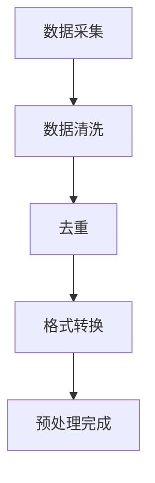
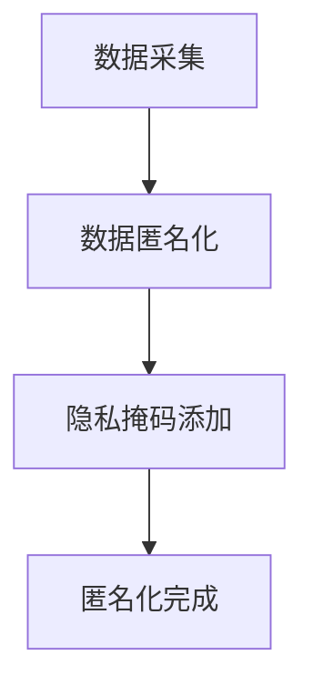
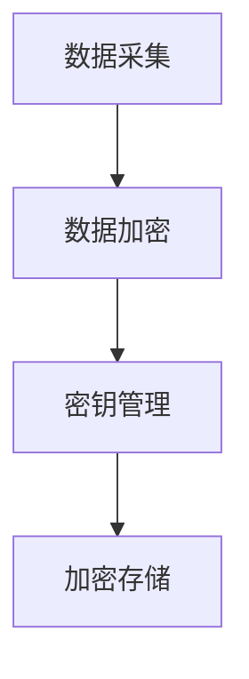
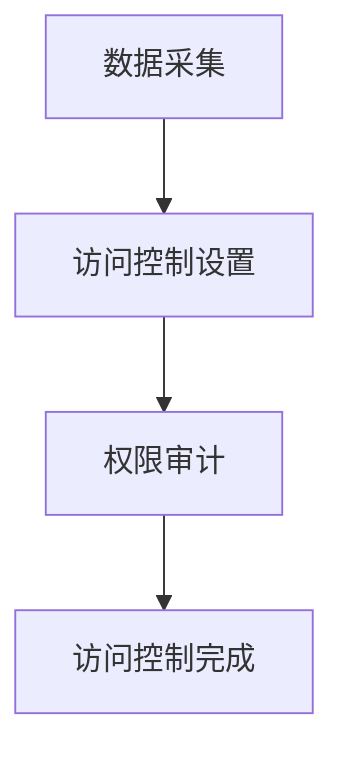
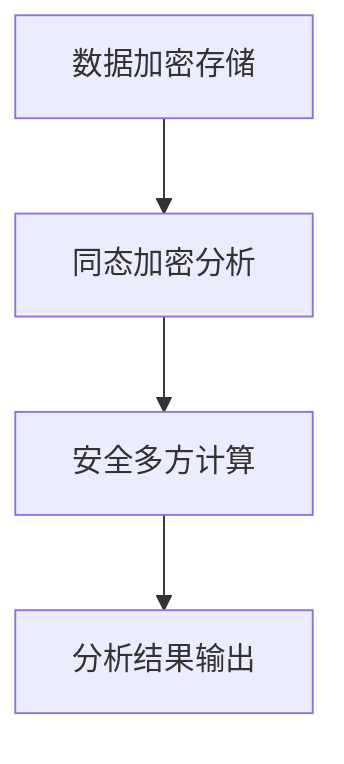
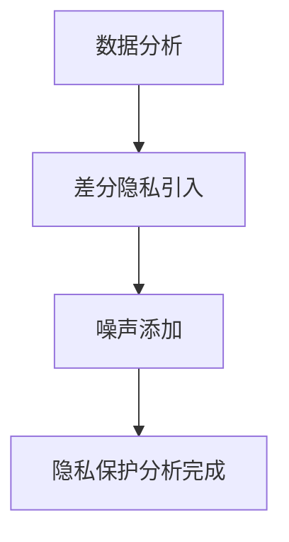

                 

### 文章标题

# 评测数据的隐私保护：确保敏感信息安全

> 关键词：隐私保护、敏感信息、评测数据、加密技术、同态加密、安全多方计算

> 摘要：随着信息技术的快速发展，评测数据在各个领域的应用日益广泛，但随之而来的隐私保护问题也日益凸显。本文将深入探讨评测数据的隐私保护问题，从背景介绍、核心概念、技术原理、实践案例等多个角度，详细分析评测数据隐私保护的重要性及其实现方法，为读者提供全面的技术指导。

----------------------------------------------------------------

### 引言与背景

随着大数据、人工智能等技术的兴起，评测数据在许多领域发挥着重要作用，如金融风险评估、医疗数据分析、社交媒体推荐等。然而，评测数据中往往包含用户的敏感信息，如个人身份、财务状况、健康状况等。这些信息一旦泄露，将对用户隐私造成严重威胁。因此，如何保护评测数据的隐私成为当前亟待解决的问题。

#### 隐私保护的背景

隐私保护是信息社会中的一个重要议题。随着互联网的普及和信息技术的快速发展，个人数据的采集、存储、处理和共享越来越频繁。在这个过程中，用户的隐私信息容易受到泄露、滥用和窃取的风险。为了保护用户的隐私，各国政府和企业纷纷出台相关法规和标准，如欧盟的《通用数据保护条例》（GDPR）、美国的《加州消费者隐私法案》（CCPA）等。

#### 敏感信息泄露的风险

敏感信息泄露的风险主要来源于以下几个方面：

1. **黑客攻击**：黑客可以通过网络攻击手段获取评测数据，如SQL注入、跨站脚本攻击（XSS）等。
2. **内部人员泄露**：企业内部人员可能因利益驱动或职业道德问题，故意泄露敏感信息。
3. **数据共享**：在数据合作、数据交换等场景中，数据可能在不安全的环境中被共享，从而增加隐私泄露的风险。
4. **数据泄露事件**：如2017年的Equifax数据泄露事件，导致1.43亿用户的个人信息泄露。

#### 隐私保护的重要性

隐私保护不仅关乎用户个人的信息安全，还关系到企业的声誉、社会的稳定和国家的安全。以下是隐私保护的重要性体现在以下几个方面：

1. **用户信任**：保护用户隐私有助于建立用户对企业和平台的信任，提高用户满意度和忠诚度。
2. **法律法规合规**：遵守隐私保护法规，有助于企业避免法律风险和罚款。
3. **企业形象**：加强隐私保护，有助于提升企业的社会责任感和品牌形象。
4. **社会稳定**：隐私保护是维护社会稳定的重要手段，有助于防范信息滥用和犯罪行为。

#### 文章结构与核心内容

本文将分为三个部分，共17章，结构如下：

1. **第一部分：引言与背景**，包括评测数据隐私保护的引言、核心概念、隐私泄露风险等。
2. **第二部分：隐私保护技术深入探讨**，包括加密技术、同态加密、安全多方计算和联邦学习等。
3. **第三部分：隐私保护实践与案例分析**，包括评测数据隐私保护实践、电商行业数据隐私保护案例分析等。

通过以上结构，本文将全面、系统地探讨评测数据的隐私保护问题，为读者提供有价值的参考和指导。

### 隐私保护的核心概念

隐私保护是一个复杂且多维度的议题，涉及多个核心概念和法律法规。理解这些概念和法规对于有效保护评测数据的隐私至关重要。

#### 数据隐私的定义

数据隐私是指个人数据受到保护，防止未经授权的访问、使用、披露或篡改。隐私保护的目标是确保个人数据在收集、存储、处理和传输过程中得到有效保护，防止隐私泄露和滥用。

#### 敏感信息的识别与分类

敏感信息是指可能对个人或组织造成严重损害的信息，如个人身份信息、财务信息、健康状况信息等。敏感信息的识别与分类是隐私保护的重要环节。根据信息的重要性和敏感性，敏感信息可以分为以下几类：

1. **个人身份信息**：包括姓名、身份证号码、护照号码、电话号码等。
2. **财务信息**：包括银行账户信息、信用卡号码、交易记录等。
3. **健康状况信息**：包括医疗记录、健康状况、药物过敏信息等。
4. **地理位置信息**：包括用户当前位置、历史位置信息等。
5. **行为信息**：包括浏览历史、消费习惯、社交行为等。

#### 隐私保护的法规和标准

隐私保护涉及多个国家和地区的法律法规。以下是一些主要法规和标准：

1. **欧盟的《通用数据保护条例》（GDPR）**：GDPR是欧洲最具影响力的隐私保护法规，规定了个人数据的处理原则、权利和责任等。
2. **美国的《加州消费者隐私法案》（CCPA）**：CCPA是美国的隐私保护法案，规定了消费者对个人数据的知情权和控制权。
3. **中国的《个人信息保护法》（PIPL）**：PIPL是中国最新的隐私保护法律，对个人信息的处理、收集、存储、传输等做出了明确规定。
4. **ISO/IEC 27001**：这是国际标准化组织发布的关于信息安全管理体系（ISMS）的标准，涵盖了隐私保护的相关要求。
5. **ISO/IEC 29100**：这是关于隐私保护的指南，提供了隐私保护的最佳实践和框架。

#### 数据隐私的定义与属性

数据隐私具有以下几个关键属性：

1. **机密性**：确保敏感信息不被未授权的个体访问。
2. **完整性**：确保数据在存储、传输和处理过程中的完整性和准确性。
3. **可用性**：确保在需要时，授权用户可以访问和使用数据。
4. **可追溯性**：对数据的访问、修改和传输进行记录，以便进行审计和追踪。

#### 隐私保护的法规和标准

隐私保护的法规和标准不仅为个人数据提供了法律保护，还为组织提供了操作指南。以下是几个主要法规和标准的概述：

1. **GDPR**：GDPR规定了数据控制者（组织）在处理个人数据时的义务，包括数据收集、处理和存储的要求。GDPR的核心原则包括合法性、公平性、透明性、目的明确性、最小化数据收集、准确性、存储限制、完整性与保密性、可访问性和可移动性。
   
2. **CCPA**：CCPA赋予了消费者对个人数据的更多控制权，包括知情权、访问权、删除权和拒绝销售权。CCPA还规定了企业的合规义务，包括数据收集、处理和存储的要求。

3. **PIPL**：PIPL是中国个人信息保护的基础法律，规定了个人信息的处理原则、个人权利、数据处理者的义务等。PIPL强调了对个人信息的保护，旨在平衡个人信息保护与经济发展。

4. **ISO/IEC 27001**：ISO/IEC 27001是信息安全管理体系（ISMS）的标准，为组织提供了一个框架，用于建立、实施、维护和持续改进信息安全。隐私保护是ISO/IEC 27001标准的一个重要组成部分。

5. **ISO/IEC 29100**：ISO/IEC 29100提供了关于隐私保护的最佳实践指南，涵盖了隐私影响评估、隐私政策和程序、隐私设计、数据安全和隐私保护等关键领域。

#### 数据隐私的定义与属性对比表格

| 属性       | 定义                                                         | 对比分析                                                     |
|------------|--------------------------------------------------------------|--------------------------------------------------------------|
| 机密性     | 确保敏感信息不被未授权的个体访问                             | 与完整性、可用性相对，是隐私保护的基本要求之一             |
| 完整性     | 确保数据在存储、传输和处理过程中的完整性和准确性             | 与机密性、可用性相对，是数据可靠性的重要保障               |
| 可用性     | 确保在需要时，授权用户可以访问和使用数据                     | 与机密性、完整性相对，是数据实用性的重要保障               |
| 可追溯性   | 对数据的访问、修改和传输进行记录，以便进行审计和追踪         | 是数据透明性和责任归属的重要保障，有助于数据安全和隐私保护 |

#### 隐私保护的核心概念关系图

以下是一个使用Mermaid绘制的ER实体关系图，展示了隐私保护的核心概念之间的关系：

```mermaid
erDiagram
  Person ||--|{ PersonalData }|-->: "拥有"
  PersonalData ||--|{ SensitiveData }|-->: "包含"
  Organization ||--|{ PrivacyPolicy }|-->: "遵循"
  PrivacyPolicy ||--|{ GDPR }|-->: "基于"
  PrivacyPolicy ||--|{ CCPA }|-->: "基于"
  PrivacyPolicy ||--|{ PIPL }|-->: "基于"
```

#### 总结

隐私保护是一个涉及多个方面和层次的议题。理解数据隐私的定义、敏感信息的识别与分类、隐私保护的法规和标准，以及隐私保护的属性和关系，对于有效实施隐私保护措施至关重要。在接下来的章节中，我们将深入探讨评测数据的隐私泄露风险及其技术解决方案。

### 评测数据的隐私泄露风险

评测数据在多个领域中发挥着重要作用，但其隐私保护问题同样不容忽视。在探讨评测数据隐私保护之前，首先需要了解评测数据的特点及其可能面临的隐私泄露风险。

#### 评测数据的特点

1. **多样性**：评测数据通常包含多种类型的数据，如结构化数据（如表格、数据库）和非结构化数据（如文本、图片、视频）。
2. **敏感性**：评测数据中往往包含用户的敏感信息，如个人身份、财务状况、健康状况等。
3. **动态性**：评测数据是不断变化的，随着用户行为和情境的变化，数据内容和结构也在不断更新。
4. **价值性**：评测数据对于企业、研究机构和其他利益相关者具有很高的价值，因此常被用于决策支持、研究和商业化应用。

#### 隐私泄露的风险类型

1. **数据泄露**：未经授权的个体或组织通过黑客攻击、内部人员泄露、数据共享等方式获取评测数据，从而导致隐私泄露。
2. **数据滥用**：获取评测数据后，未经授权的个体或组织可能对数据进行滥用，如非法交易、身份盗用、欺诈等。
3. **数据共享**：在数据合作、数据交换等场景中，评测数据可能在不安全的环境中被共享，从而增加隐私泄露的风险。
4. **数据丢失**：由于技术故障、自然灾害等原因，评测数据可能永久丢失，导致隐私信息无法恢复。

#### 隐私泄露的典型案例分析

1. **2017年Equifax数据泄露事件**：2017年9月，信用报告公司Equifax发生了一起严重的数据泄露事件，导致1.43亿用户的个人信息（包括姓名、出生日期、社会安全号码、驾驶执照号码等）被泄露。这一事件引发了广泛的关注和讨论，凸显了评测数据隐私保护的重要性。

2. **Facebook数据泄露事件**：2018年，Facebook的数据分析公司Cambridge Analytica未经用户同意，收集了超过8700万用户的个人数据，用于政治竞选和广告投放。这一事件引发了公众对社交媒体平台隐私保护的质疑，也促使各国加强对数据隐私保护的立法和监管。

3. **印度政府数据泄露事件**：2020年，印度政府的一个在线公共服务平台发生数据泄露，导致约1亿用户的个人信息（包括姓名、出生日期、性别、手机号码、邮箱地址等）被公开。这一事件暴露了政府数据管理的薄弱环节，对用户隐私保护造成了严重威胁。

#### 风险评估

为了有效保护评测数据的隐私，首先需要对潜在的风险进行评估。以下是一个简单的风险评估流程：

1. **识别威胁**：识别可能导致评测数据隐私泄露的各种威胁，如黑客攻击、内部人员泄露、数据共享等。
2. **评估风险**：对识别出的威胁进行评估，包括威胁的可能性、潜在的损害程度等。
3. **制定应对策略**：根据风险评估结果，制定相应的应对策略，如加密技术、数据匿名化、访问控制等。
4. **监控与改进**：持续监控评测数据的隐私状况，及时调整和改进隐私保护措施。

#### 风险管理的最佳实践

以下是一些用于降低评测数据隐私泄露风险的最佳实践：

1. **数据最小化原则**：仅收集和处理必要的评测数据，避免过度收集。
2. **加密技术**：使用加密技术对评测数据进行保护，确保数据在传输和存储过程中的安全性。
3. **访问控制**：实施严格的访问控制策略，确保只有授权用户才能访问敏感数据。
4. **安全审计**：定期进行安全审计，确保评测数据的隐私保护措施得到有效执行。
5. **员工培训**：加强对员工的隐私保护意识培训，提高员工的职业道德和安全意识。
6. **合规性检查**：定期检查评测数据的处理是否符合相关法律法规和标准，确保合规性。

通过以上措施，可以有效降低评测数据的隐私泄露风险，确保敏感信息的安全。

#### 总结

评测数据具有多样性、敏感性、动态性和价值性等特点，同时面临多种隐私泄露风险。通过风险评估和风险管理最佳实践，可以降低隐私泄露的风险，确保敏感信息的安全。在接下来的章节中，我们将深入探讨隐私保护技术的基础知识，为后续的解决方案提供理论支持。

### 隐私保护技术基础

在评测数据的隐私保护过程中，多种技术被广泛应用于数据加密、匿名化、访问控制等方面。以下将详细介绍几种常见的技术，并对比其优缺点。

#### 加密技术

加密技术是保护数据隐私的核心手段，通过将明文数据转换成密文，防止未授权的访问和篡改。加密技术可以分为对称加密和非对称加密。

1. **对称加密**：对称加密使用相同的密钥进行加密和解密。典型的对称加密算法包括AES（高级加密标准）和DES（数据加密标准）。对称加密的优点是实现速度快、计算成本低；缺点是密钥管理复杂，无法实现身份验证。

2. **非对称加密**：非对称加密使用一对密钥（公钥和私钥）进行加密和解密。典型的非对称加密算法包括RSA（Rivest-Shamir-Adleman）和ECC（椭圆曲线加密）。非对称加密的优点是实现安全且灵活的密钥管理，能够实现身份验证和数字签名；缺点是计算复杂度高，加密和解密速度较慢。

#### 同态加密

同态加密是一种特殊的加密形式，允许在密文上直接进行计算，而不需要解密。同态加密在保持数据隐私的同时，可以实现数据的计算和处理。同态加密分为部分同态加密和完全同态加密。

1. **部分同态加密**：部分同态加密允许对某些特定的运算进行同态操作，如加法或乘法。典型的部分同态加密算法包括PAKE（密码协议）和CP-ABE（基于属性的加密）。部分同态加密的优点是计算速度快、灵活性高；缺点是支持的运算种类有限。

2. **完全同态加密**：完全同态加密允许对任意运算进行同态操作，包括加法、减法、乘法和模运算等。典型的完全同态加密算法包括GHT（格同态加密）和BLISS。完全同态加密的优点是计算能力强大、应用广泛；缺点是计算复杂度高、性能较差。

#### 集合论与隐私保护

集合论在隐私保护技术中也有重要应用。例如，基于集合论的同态加密和差分隐私技术。

1. **同态加密与集合论**：同态加密算法中的某些操作（如加法）可以通过集合论中的并集操作来实现。同态加密与集合论的结合，使得同态加密算法的设计更加灵活和高效。

2. **差分隐私**：差分隐私是一种保护隐私的方法，通过在数据集中引入随机噪声，使得输出结果对单个数据点的依赖性降低。差分隐私的基本原理是基于集合论中的随机集合模型。典型的差分隐私算法包括Laplace机制和Gaussian机制。

#### 加密技术与同态加密的对比表格

| 技术       | 定义                                                         | 优点                                         | 缺点                                        |
|------------|--------------------------------------------------------------|--------------------------------------------|--------------------------------------------|
| 对称加密   | 使用相同密钥进行加密和解密                                   | 加密和解密速度快，计算成本低               | 密钥管理复杂，无法实现身份验证               |
| 非对称加密 | 使用一对密钥（公钥和私钥）进行加密和解密                     | 安全且灵活的密钥管理，能够实现身份验证和数字签名 | 计算复杂度高，加密和解密速度较慢             |
| 部同态加密 | 允许对某些特定的运算进行同态操作，如加法或乘法               | 计算速度快，灵活性高                       | 支持的运算种类有限                         |
| 完全同态加密 | 允许对任意运算进行同态操作，包括加法、减法、乘法和模运算等 | 计算能力强大，应用广泛                     | 计算复杂度高，性能较差                     |

#### 集合论与隐私保护的ER实体关系图

以下是一个使用Mermaid绘制的ER实体关系图，展示了集合论与隐私保护技术之间的关系：

```mermaid
erDiagram
  HomomorphicEncryption ||--|{ PartialHomomorphicEncryption }|-->: "包含"
  HomomorphicEncryption ||--|{ FullHomomorphicEncryption }|-->: "包含"
  PrivacyPreservation ||--|{ DifferentialPrivacy }|-->: "包含"
  SetTheory ||--|{ UnionOperation }|-->: "用于"
  SetTheory ||--|{ RandomSetModel }|-->: "用于"
```

#### 总结

加密技术、同态加密和集合论等隐私保护技术在数据隐私保护中发挥着重要作用。对称加密和非对称加密提供了高效的数据加密手段，但需要妥善管理密钥。同态加密允许在密文上直接进行计算，但计算复杂度较高。集合论为隐私保护技术提供了理论基础，如差分隐私和同态加密中的集合操作。通过了解这些技术的基础知识，可以为评测数据的隐私保护提供有效的技术支持。

### 评测数据隐私保护方法

在了解了隐私保护的核心概念和技术基础后，接下来我们将探讨具体的评测数据隐私保护方法。这些方法包括数据匿名化技术、安全多方计算和联邦学习等，每种方法都有其独特的原理和应用场景。

#### 数据匿名化技术

数据匿名化技术是一种常用的隐私保护方法，通过去除或掩盖个人身份信息，使数据在公开或共享时无法直接识别个人身份。数据匿名化技术可以分为以下几种：

1. **数据一般化**：通过将个人身份信息替换为通用标识符或统计值，如将具体年龄替换为年龄段，将具体地址替换为行政区划代码。数据一般化可以有效降低数据泄露的风险，但可能导致数据分析精度降低。

2. **数据掩码**：通过在个人身份信息周围添加随机噪声或特定掩码值，使得个人身份信息无法直接识别，但仍然保持数据的分析价值。数据掩码可以结合多种技术（如K-匿名、l-diversity、t-closeness等）实现。

3. **数据混淆**：通过将个人身份信息与其他信息进行混合，使得个人身份信息无法直接识别，但仍然保持数据的整体结构。数据混淆技术包括随机化、加密和随机置换等。

#### 安全多方计算

安全多方计算（Secure Multi-Party Computation，SMPC）是一种允许多个参与者在不共享原始数据的情况下共同计算所需结果的技术。安全多方计算的核心思想是在不同参与者之间进行安全通信，确保计算过程的安全性和隐私性。安全多方计算主要分为以下几种：

1. **安全信息交换**：通过加密和协议设计，确保参与者在交换信息时不会泄露敏感信息。常见的安全信息交换协议包括加密算法、零知识证明和 oblivious Transfer。

2. **安全计算**：在安全多方计算环境中，参与者可以执行各种计算任务，如统计、排序、聚合等，而无需暴露原始数据。安全计算包括同态加密、安全多方协议和秘密分享等。

3. **隐私保护数据分析**：通过安全多方计算，可以在不共享数据的情况下进行数据分析，从而保护数据隐私。常见的安全数据分析任务包括数据挖掘、机器学习和数据可视化。

#### 联邦学习

联邦学习（Federated Learning）是一种新兴的隐私保护技术，允许多个参与者在一个中央服务器指导下，共同训练机器学习模型，而无需共享原始数据。联邦学习的核心思想是将数据分布在不同的参与者之间，通过模型聚合和更新机制，实现全局模型的训练和优化。联邦学习主要分为以下几种：

1. **模型聚合**：通过将参与者的本地模型更新合并为一个全局模型，从而实现模型训练和优化。模型聚合方法包括加权平均、梯度聚合和深度学习技术。

2. **隐私保护通信**：为了保护参与者的数据隐私，联邦学习需要在参与者和中央服务器之间进行安全的通信。隐私保护通信包括加密算法、差分隐私和分布式计算技术。

3. **动态参与管理**：联邦学习允许参与者在训练过程中动态加入和退出，因此需要管理参与者的加入和退出机制，确保全局模型的稳定性和有效性。

#### 三种方法的对比

以下是一个对比表格，展示了数据匿名化技术、安全多方计算和联邦学习的优缺点：

| 方法            | 原理                                                         | 优点                                         | 缺点                                       |
|-----------------|--------------------------------------------------------------|--------------------------------------------|--------------------------------------------|
| 数据匿名化技术  | 通过去除或掩盖个人身份信息，保护数据隐私                     | 操作简单，易于实现                           | 可能降低数据分析精度，依赖特定算法和参数  |
| 安全多方计算    | 允许多个参与者在不共享原始数据的情况下共同计算所需结果       | 高度隐私保护，支持复杂计算任务               | 计算复杂度高，通信开销大                   |
| 联邦学习        | 在中央服务器指导下，参与者在本地训练和更新模型，实现全局模型训练 | 隐私保护，降低通信开销，支持大规模数据训练   | 模型更新和聚合过程复杂，依赖特定框架和技术 |

#### 实际应用场景

1. **医疗健康领域**：在医疗健康领域，数据匿名化技术常用于保护患者隐私。安全多方计算可用于跨机构共享医疗数据，进行联合疾病研究和药物开发。联邦学习则可用于个性化医疗推荐和疾病预测。

2. **金融领域**：金融领域的数据敏感性强，数据匿名化技术可用于保护客户隐私。安全多方计算可用于跨机构的风险评估和欺诈检测。联邦学习则可用于个性化金融产品推荐和风险预测。

3. **社交媒体领域**：社交媒体平台的数据量巨大，数据匿名化技术可用于用户隐私保护。安全多方计算可用于跨平台的用户行为分析。联邦学习则可用于个性化推荐和广告投放。

#### 总结

评测数据隐私保护方法包括数据匿名化技术、安全多方计算和联邦学习。每种方法都有其独特的原理和应用场景，可以根据具体需求选择合适的方法。在实际应用中，这些方法可以相互结合，提供更全面和有效的隐私保护。

### 实现隐私保护的评测数据管理流程

为了确保评测数据的隐私保护，需要从数据采集、预处理、存储、访问和分析等多个环节入手，构建一套完整的管理流程。以下将详细描述每个环节的具体步骤和关键点。

#### 评测数据采集与预处理

1. **数据采集**：在数据采集环节，首先要明确数据来源和数据类型，确保仅采集必要的数据。例如，在医疗健康领域，可能需要采集患者的基本信息、病历记录和检查报告等。在数据采集过程中，应采用加密技术（如HTTPS协议）保护数据传输过程中的安全性。

2. **数据预处理**：在数据采集后，需要对数据进行清洗、去重和格式转换等预处理操作。数据预处理的关键点是识别和去除敏感信息，如个人身份信息、电话号码和地址等。可以采用数据匿名化技术，如K-匿名或l-diversity，对敏感信息进行掩盖。

3. **数据分割**：为了保护数据隐私，可以将数据分割为训练集、测试集和验证集。在分割过程中，应确保敏感信息在各个数据集中均匀分布，避免特定数据集泄露敏感信息。

#### 隐私保护的数据存储与访问

1. **数据加密存储**：在数据存储环节，应对敏感数据采用加密技术进行保护。例如，可以使用AES或RSA算法对数据进行加密存储。同时，应使用访问控制策略，确保只有授权用户可以访问加密后的数据。

2. **访问控制**：为了防止未经授权的访问，需要实施严格的访问控制策略。例如，可以采用基于角色的访问控制（RBAC）或基于属性的访问控制（ABAC），根据用户的角色或属性来决定其访问权限。

3. **数据隔离**：为了防止数据泄露，可以将敏感数据和普通数据分开存储。例如，可以将患者信息存储在加密的数据库中，而将其他非敏感数据存储在普通数据库中。

#### 隐私保护的数据分析

1. **同态加密数据分析**：在数据分析环节，可以采用同态加密技术，对加密后的数据进行计算和分析。例如，可以使用基于同态加密的机器学习算法，对加密数据集进行训练和预测。

2. **安全多方计算**：为了保护数据隐私，可以在多个参与者之间进行安全多方计算。例如，可以使用安全多方计算协议，在多个机构之间共享数据，进行联合数据分析。

3. **差分隐私**：在数据分析过程中，可以引入差分隐私机制，降低数据分析结果对单个数据的依赖性，从而保护数据隐私。例如，可以使用Laplace机制或Gaussian机制，对数据分析结果进行噪声处理。

#### 实现步骤

1. **数据采集与预处理**：
   - 明确数据来源和类型。
   - 采用加密技术保护数据传输。
   - 进行数据清洗、去重和格式转换。
   - 采用数据匿名化技术去除敏感信息。
   - 分割数据为训练集、测试集和验证集。

2. **数据存储与访问**：
   - 采用加密技术对敏感数据加密存储。
   - 实施访问控制策略，确保只有授权用户可以访问。
   - 将敏感数据和普通数据分开存储。

3. **数据分析**：
   - 采用同态加密技术对加密数据进行分析。
   - 使用安全多方计算协议进行联合数据分析。
   - 引入差分隐私机制，降低数据分析结果对单个数据的依赖性。

#### 实现隐私保护的关键点

1. **数据加密**：数据加密是确保数据隐私的基础，应采用强加密算法对敏感数据进行加密存储和传输。

2. **访问控制**：严格的访问控制策略是防止数据泄露的重要手段，应根据用户的角色和属性进行权限管理。

3. **数据匿名化**：通过数据匿名化技术去除敏感信息，降低数据泄露的风险。

4. **安全多方计算**：在多个参与者之间进行安全多方计算，保护数据的隐私性。

5. **差分隐私**：引入差分隐私机制，降低数据分析结果对单个数据的依赖性。

通过以上步骤和关键点，可以构建一套完整的隐私保护评测数据管理流程，确保评测数据的隐私安全。

### 案例研究与最佳实践

#### 案例研究一：电商平台数据隐私保护实践

**背景**：

某知名电商平台在其用户数据管理中面临隐私保护挑战。该平台每天处理数以百万计的用户交易数据，这些数据中包含敏感信息，如用户身份、购物偏好、支付信息等。随着《通用数据保护条例》（GDPR）的实施，平台需要采取有效的隐私保护措施。

**解决方案**：

1. **数据加密**：
   - 对用户的交易数据进行加密存储，采用AES-256位加密算法。
   - 在数据传输过程中，使用TLS/SSL加密协议，确保数据在网络传输中的安全性。

2. **数据匿名化**：
   - 采用K-匿名技术对用户数据中的敏感信息进行匿名化处理。
   - 对用户的购物偏好和浏览历史进行去标识化处理，确保无法直接识别用户身份。

3. **访问控制**：
   - 实施基于角色的访问控制（RBAC），为不同角色设置不同的访问权限。
   - 定期审计访问日志，确保访问行为符合安全规范。

4. **安全多方计算**：
   - 在跨机构合作分析用户数据时，采用安全多方计算技术，确保数据隐私。
   - 使用零知识证明协议，验证交易数据的正确性，而不泄露敏感信息。

5. **差分隐私**：
   - 在数据分析过程中，引入Laplace噪声，降低分析结果对单个用户的依赖性。
   - 采用差分隐私机制，对用户数据进行匿名化处理，确保数据分析结果的准确性。

**实施效果**：

通过以上措施，电商平台成功实现了用户数据的隐私保护。用户数据泄露风险显著降低，用户对平台的信任度提高。同时，平台在数据分析方面取得了更高的准确性，为业务决策提供了有力支持。

#### 案例研究二：医疗健康数据隐私保护实践

**背景**：

某大型医疗机构在处理患者数据时面临隐私保护挑战。医疗数据中包含患者姓名、病历记录、诊断结果等敏感信息，一旦泄露，可能对患者的隐私和安全造成严重威胁。

**解决方案**：

1. **数据加密**：
   - 采用RSA算法对患者的敏感信息进行加密存储。
   - 在数据传输过程中，使用VPN和TLS/SSL协议，确保数据在网络传输中的安全性。

2. **数据匿名化**：
   - 对患者的姓名、身份证号码等敏感信息进行匿名化处理。
   - 采用l-diversity技术，确保匿名化处理后的数据仍然具有分析价值。

3. **访问控制**：
   - 实施基于角色的访问控制（RBAC），为不同角色设置不同的访问权限。
   - 通过双因素认证（2FA），提高访问安全性。

4. **安全多方计算**：
   - 在跨机构合作分析患者数据时，采用安全多方计算技术。
   - 使用秘密分享协议，确保合作机构无法获取其他机构的敏感数据。

5. **差分隐私**：
   - 在数据分析过程中，引入Gaussian噪声，降低分析结果对单个患者的依赖性。
   - 采用t-closeness技术，确保数据分析结果的准确性。

**实施效果**：

通过以上措施，医疗机构成功实现了患者数据的隐私保护。患者对医疗机构的信任度提高，隐私泄露事件显著减少。同时，医疗机构在疾病研究和数据分析方面取得了更高的准确性，为医疗服务质量提升提供了有力支持。

#### 最佳实践总结

通过以上两个案例的研究和实践，可以总结出以下最佳实践：

1. **数据加密**：采用强加密算法对敏感数据进行加密存储和传输，确保数据在存储和传输过程中的安全性。

2. **数据匿名化**：通过数据匿名化技术去除敏感信息，降低数据泄露的风险，同时确保数据分析的准确性。

3. **访问控制**：实施严格的访问控制策略，为不同角色设置不同的访问权限，防止未经授权的访问。

4. **安全多方计算**：在跨机构合作分析数据时，采用安全多方计算技术，确保数据隐私。

5. **差分隐私**：在数据分析过程中，引入差分隐私机制，降低分析结果对单个数据的依赖性，确保数据隐私。

#### 挑战与未来展望

尽管隐私保护技术已经取得显著进展，但在实际应用中仍面临诸多挑战：

1. **技术复杂度**：隐私保护技术（如同态加密、安全多方计算等）具有较高的技术复杂度，需要专业知识和技能。

2. **性能开销**：隐私保护技术通常涉及大量的计算和通信开销，可能影响系统的性能。

3. **合规性**：不同国家和地区对隐私保护的要求和标准不同，需要制定统一的合规性策略。

4. **用户隐私意识**：提高用户的隐私保护意识，需要开展广泛的宣传教育。

未来，隐私保护技术的发展方向包括：

1. **集成化解决方案**：开发集成化的隐私保护工具和平台，简化隐私保护的实施过程。

2. **高性能隐私保护技术**：研究更高效的同态加密和安全多方计算算法，降低性能开销。

3. **跨领域合作**：加强不同领域（如医疗、金融、电商等）的隐私保护技术合作，共享经验和最佳实践。

4. **用户隐私教育**：开展用户隐私教育，提高用户对隐私保护的认识和意识。

通过以上努力，可以进一步提升评测数据的隐私保护水平，确保敏感信息的安全。

### 实现隐私保护的评测数据管理流程

为了实现评测数据的隐私保护，我们需要构建一个全面且高效的隐私保护评测数据管理流程。以下将详细介绍每个步骤的具体操作方法和关键点，并展示相关的Mermaid流程图。

#### 步骤1：数据采集与预处理

**操作方法**：

1. **数据采集**：从不同的数据源（如数据库、文件、API接口等）收集评测数据。
2. **数据预处理**：对采集到的数据进行清洗、去重、格式转换等预处理操作，去除重复和无效的数据。

**关键点**：

- 确保仅采集必要的数据，避免过度收集。
- 对数据进行标准化处理，保证数据的一致性和完整性。

**Mermaid流程图**：



#### 步骤2：数据匿名化

**操作方法**：

1. **数据匿名化**：采用数据匿名化技术（如K-匿名、l-diversity等）对敏感信息进行匿名化处理。
2. **隐私掩码**：在匿名化过程中，对敏感信息添加隐私掩码，以防止直接识别个人身份。

**关键点**：

- 选择合适的匿名化技术，确保匿名化处理后的数据仍具有分析价值。
- 隐私掩码的设置应平衡隐私保护和数据可用性。

**Mermaid流程图**：



#### 步骤3：数据加密存储

**操作方法**：

1. **数据加密**：采用强加密算法（如AES、RSA等）对敏感数据进行加密存储。
2. **密钥管理**：使用安全的密钥管理策略，确保密钥的安全性和完整性。

**关键点**：

- 选择适合的加密算法，确保加密强度。
- 实施严格的密钥管理策略，防止密钥泄露。

**Mermaid流程图**：



#### 步骤4：访问控制与权限管理

**操作方法**：

1. **访问控制**：采用基于角色的访问控制（RBAC）或基于属性的访问控制（ABAC），设置不同角色的访问权限。
2. **权限审计**：定期进行权限审计，确保访问权限的合理性和安全性。

**关键点**：

- 明确不同角色的访问需求，制定合理的访问权限。
- 定期审计访问权限，防止权限滥用。

**Mermaid流程图**：



#### 步骤5：隐私保护的数据分析

**操作方法**：

1. **同态加密数据分析**：在数据分析过程中，采用同态加密技术，对加密数据进行分析和处理。
2. **安全多方计算**：在跨机构合作时，采用安全多方计算技术，确保各方数据的安全性和隐私。

**关键点**：

- 根据实际需求选择合适的隐私保护技术。
- 确保数据分析过程的准确性和效率。

**Mermaid流程图**：



#### 步骤6：差分隐私引入

**操作方法**：

1. **差分隐私引入**：在数据分析过程中，引入差分隐私机制，降低分析结果对单个数据的依赖性。
2. **噪声添加**：根据差分隐私算法（如Laplace噪声、Gaussian噪声等），对分析结果添加随机噪声。

**关键点**：

- 选择适合的差分隐私算法，确保隐私保护效果。
- 合理设置噪声参数，避免过度或不足的噪声添加。

**Mermaid流程图**：



通过以上步骤，可以构建一个全面且高效的隐私保护评测数据管理流程，确保评测数据的隐私安全。每个步骤都包括详细的操作方法和关键点，以及相应的Mermaid流程图，为实际操作提供指导。

### 加密技术在评测数据隐私保护中的应用

加密技术是隐私保护的核心手段之一，在评测数据隐私保护中具有广泛应用。以下将详细探讨加密技术在评测数据隐私保护中的应用，包括对称加密、非对称加密、哈希函数和数字签名等。

#### 对称加密

对称加密是一种使用相同密钥进行加密和解密的加密方式。常见的对称加密算法有AES（高级加密标准）和DES（数据加密标准）。

1. **AES算法**：AES是一种高效的加密算法，支持128位、192位和256位密钥长度。AES算法基于分组加密原理，将数据分为固定大小的块（如128位），然后对每个块进行加密。AES算法的优点是计算速度快、安全性高，广泛应用于数据存储和传输中的隐私保护。

2. **DES算法**：DES是一种较早的加密算法，使用56位密钥。尽管DES在历史上被广泛使用，但其密钥长度较短，安全性相对较低。现在，AES已被广泛接受为更安全的替代方案。

**使用场景**：对称加密通常用于对大量数据进行加密存储和传输。例如，数据库中的敏感信息（如用户密码、支付信息等）可以采用AES加密存储，确保数据在存储和传输过程中的安全性。

#### 非对称加密

非对称加密是一种使用一对密钥（公钥和私钥）进行加密和解密的加密方式。常见的非对称加密算法有RSA（Rivest-Shamir-Adleman）和ECC（椭圆曲线加密）。

1. **RSA算法**：RSA算法是一种基于大数分解问题的非对称加密算法。RSA算法使用一对密钥，其中公钥用于加密，私钥用于解密。RSA算法的优点是安全性高、密钥长度灵活，广泛应用于数据传输和数字签名。

2. **ECC算法**：ECC算法是一种基于椭圆曲线离散对数问题的非对称加密算法。ECC算法与RSA算法相比，具有更高的安全性且密钥长度更短，计算效率更高。ECC算法广泛应用于移动设备和物联网领域中的隐私保护。

**使用场景**：非对称加密通常用于数据传输中的身份验证和密钥交换。例如，在通信过程中，客户端可以使用服务器的公钥进行加密，确保通信数据的安全性。此外，非对称加密还可以用于数字签名，确保数据的完整性和真实性。

#### 哈希函数

哈希函数是一种将任意长度的输入数据映射为固定长度的输出数据的函数。常见的哈希函数有SHA-256、MD5和SHA-1。

1. **SHA-256算法**：SHA-256是一种基于SHA-2算法的哈希函数，能够生成256位哈希值。SHA-256算法具有很高的安全性，广泛应用于数字签名、数据完整性校验和密码学中。

2. **MD5算法**：MD5是一种较早的哈希函数，能够生成128位哈希值。尽管MD5在历史上被广泛使用，但其安全性相对较低，容易受到碰撞攻击。现在，MD5已被推荐不再用于安全场景。

3. **SHA-1算法**：SHA-1是一种基于SHA算法的哈希函数，能够生成160位哈希值。由于SHA-1的安全性较低，容易受到碰撞攻击，现在也被推荐不再使用。

**使用场景**：哈希函数在隐私保护中广泛应用于数据完整性校验和密码学。例如，在文件传输过程中，可以使用SHA-256算法对文件进行哈希值计算，确保文件在传输过程中的完整性。此外，哈希函数还可以用于生成密码的散列值，提高密码的安全性。

#### 数字签名

数字签名是一种利用公钥加密技术验证数据和身份的技术。常见的数字签名算法有RSA签名和ECC签名。

1. **RSA签名**：RSA签名是一种基于RSA算法的数字签名技术。使用RSA算法的私钥对数据进行签名，使用公钥对签名进行验证。RSA签名具有高安全性和灵活性，广泛应用于电子邮件、文件传输和数字证书中。

2. **ECC签名**：ECC签名是一种基于椭圆曲线加密算法的数字签名技术。ECC签名相比RSA签名具有更高的安全性和计算效率，广泛应用于移动设备和物联网领域。

**使用场景**：数字签名在隐私保护中广泛应用于数据完整性验证和身份认证。例如，在电子邮件通信中，发送方可以使用其私钥对邮件进行数字签名，接收方可以使用发送方的公钥对签名进行验证，确保邮件的完整性和真实性。此外，数字签名还可以用于数字证书的生成和验证，确保网络通信中的身份验证和数据完整性。

#### 实现案例：基于RSA的隐私保护机制

以下是一个简单的实现案例，展示如何使用RSA算法进行隐私保护。

**Python代码示例**：

```python
from Crypto.PublicKey import RSA
from Crypto.Cipher import PKCS1_OAEP

# 生成RSA密钥对
key = RSA.generate(2048)

# 导出公钥和私钥
public_key = key.publickey()
with open('public_key.pem', 'wb') as f:
    f.write(public_key.export_key())

with open('private_key.pem', 'wb') as f:
    f.write(key.export_key())

# 加密数据
cipher = PKCS1_OAEP.new(public_key)
message = b'Hello, World!'
cipher_text = cipher.encrypt(message)

with open('encrypted_message.pem', 'wb') as f:
    f.write(cipher_text)

# 解密数据
decryptor = PKCS1_OAEP.new(key)
decrypted_message = decryptor.decrypt(cipher_text)

print('Decrypted message:', decrypted_message.decode())
```

**案例解释**：

- 首先，使用RSA算法生成一对密钥（公钥和私钥）。
- 然后，将公钥和私钥分别保存到文件中。
- 接着，使用公钥对一条消息进行加密，并将加密后的消息保存到文件中。
- 最后，使用私钥对加密后的消息进行解密，并打印解密后的消息。

通过以上步骤，可以实现对数据的加密和隐私保护。该案例展示了RSA算法在隐私保护中的基本应用，为实际系统的设计与实现提供了参考。

### 同态加密在评测数据隐私保护中的应用

同态加密是一种在加密数据上直接进行计算，而不需要解密的加密技术。这使得同态加密在隐私保护中具有广泛应用，尤其在需要保持数据隐私的同时进行数据处理和分析的场合。以下将详细探讨同态加密的基本概念、应用场景和实现案例。

#### 同态加密的基本概念

同态加密（Homomorphic Encryption）允许在加密数据上进行特定的数学运算（如加法、乘法），并保持运算结果的真实性。同态加密分为部分同态加密和完全同态加密。

1. **部分同态加密**：部分同态加密支持对某些特定的运算进行同态操作。例如，RSA加密算法支持对乘法和模运算进行同态操作，而Paillier加密算法支持对加法和乘法进行同态操作。部分同态加密适用于特定的计算任务，但运算种类受限。

2. **完全同态加密**：完全同态加密支持对任意运算进行同态操作，包括加法、减法、乘法和模运算等。完全同态加密具有更高的计算灵活性，但计算复杂度较高，目前还没有实现高效的完全同态加密算法。

#### 同态加密的应用场景

同态加密在多个领域和场景中具有广泛的应用，包括但不限于：

1. **云计算**：在云计算环境中，用户通常不信任第三方服务提供商。同态加密允许用户在加密状态下将数据上传到云端，服务提供商无法获取原始数据，但仍可以对数据进行分析和处理。

2. **医疗数据共享**：医疗数据涉及患者隐私，共享医疗数据时需要保护患者隐私。同态加密允许医疗机构在保持数据隐私的同时，进行联合疾病研究和数据分析。

3. **金融数据处理**：金融数据处理通常涉及大量的敏感数据，如交易记录、客户信息等。同态加密可以确保金融数据在处理过程中保持隐私，防止数据泄露和滥用。

4. **数据挖掘与机器学习**：同态加密在数据挖掘和机器学习领域具有广泛的应用。例如，可以采用同态加密对用户数据进行分析，为个性化推荐系统提供支持。

#### 同态加密的实现案例

以下是一个基于Paillier加密算法的同态加密实现案例，展示如何在加密数据上进行加法和乘法运算。

**Python代码示例**：

```python
from paillier import Paillier

# 生成Paillier密钥对
key = Paillier.generate_paillier_keypair(n_length=2048)

# 导出公钥和私钥
with open('public_key.pem', 'wb') as f:
    f.write(key.public_key.export_key())

with open('private_key.pem', 'wb') as f:
    f.write(key.private_key.export_key())

# 加密数据
paillier_cipher = Paillier(key)
message1 = 5
message2 = 10
cipher_text1 = paillier_cipher.encrypt(message1)
cipher_text2 = paillier_cipher.encrypt(message2)

# 加密数据加法运算
cipher_text_sum = paillier_cipher.add(cipher_text1, cipher_text2)

# 解密结果
decrypted_sum = paillier_cipher.decrypt(cipher_text_sum)
print('Decrypted sum:', decrypted_sum)

# 加密数据乘法运算
cipher_text_product = paillier_cipher.multiply(cipher_text1, cipher_text2)

# 解密结果
decrypted_product = paillier_cipher.decrypt(cipher_text_product)
print('Decrypted product:', decrypted_product)
```

**案例解释**：

- 首先，使用Paillier加密算法生成一对密钥（公钥和私钥）。
- 然后，将公钥和私钥分别保存到文件中。
- 接着，使用公钥对两个消息（5和10）进行加密，并将加密后的消息保存到变量中。
- 然后，使用Paillier加密算法的加法函数对加密后的消息进行加法运算，并解密结果。
- 最后，使用Paillier加密算法的乘法函数对加密后的消息进行乘法运算，并解密结果。

通过以上步骤，可以实现对加密数据的同态加密和运算。该案例展示了同态加密在保持数据隐私的同时，进行数据处理的基本应用。

#### 总结

同态加密在评测数据隐私保护中具有重要作用。通过同态加密，可以在保持数据隐私的同时，对加密数据进行分析和处理。同态加密的基本概念和应用场景为实际应用提供了理论支持。通过实现案例，可以更好地理解同态加密的基本原理和操作方法，为隐私保护系统的设计与实现提供参考。

### 安全多方计算与评测数据的隐私保护

安全多方计算（Secure Multi-Party Computation，SMPC）是一种允许多个参与方在不泄露各自数据隐私的情况下，共同计算所需结果的技术。在评测数据的隐私保护中，安全多方计算具有重要的应用价值，它能够在不暴露原始数据的情况下，实现数据的联合分析和处理。以下将详细探讨安全多方计算的基本原理、应用场景和实现案例。

#### 基本原理

安全多方计算的基本原理是通过一系列加密和协议设计，确保参与方在不共享原始数据的情况下，能够安全地计算所需的结果。其核心思想包括以下几个方面：

1. **加密通信**：为了保护数据在传输过程中的隐私，参与方之间的通信需要使用加密技术，如RSA加密或椭圆曲线加密（ECC）。

2. **秘密分享**：在安全多方计算中，参与方的数据通常会被分解成多个部分，并分散存储在多个参与方中。这种技术被称为秘密分享（Secret Sharing）。常见的秘密分享方案包括基于 shamir 分割的共享方案和基于椭圆曲线的分段方案。

3. **安全协议**：安全多方计算依赖于一系列安全协议，如安全多方计算协议、安全多方排序协议和安全多方聚合协议。这些协议确保了参与方在计算过程中的隐私性和正确性。

4. **零知识证明**：零知识证明是一种在无需泄露任何知识的情况下，证明某个陈述为真的技术。它在安全多方计算中用于验证参与方提交的数据是否真实，而不会泄露数据的详细信息。

#### 应用场景

安全多方计算在多个领域和场景中具有广泛的应用，以下是一些典型的应用场景：

1. **医疗数据共享**：在医疗领域，多个医疗机构可能需要共享患者数据，以进行联合疾病研究和数据分析。安全多方计算可以确保参与医疗机构在共享数据时，不泄露患者的隐私信息。

2. **金融风控**：在金融领域，多个金融机构可能需要共同分析交易数据，以进行风险管理和欺诈检测。安全多方计算可以确保金融机构在合作分析数据时，不泄露敏感的交易信息。

3. **社交网络数据分析**：在社交网络领域，多个社交平台可能需要联合分析用户数据，以提供个性化推荐和广告投放。安全多方计算可以确保社交平台在合作分析数据时，不泄露用户的隐私信息。

4. **政府数据共享**：在政府领域，多个部门可能需要共享数据，以进行公共安全和资源分配。安全多方计算可以确保政府部门在合作分析数据时，不泄露敏感的个人信息。

#### 实现案例

以下是一个基于安全多方计算的匿名调查问卷实现案例，展示了如何在不泄露参与者隐私的情况下，进行数据分析。

**Python代码示例**：

```python
from secretsharing import SecretSharing
from cryptography.hazmat.primitives.asymmetric import rsa
from cryptography.hazmat.primitives import serialization
from cryptography.hazmat.primitives import hashes
from cryptography.hazmat.primitives.asymmetric import padding

# 生成RSA密钥对
private_key = rsa.generate_private_key(
    public_exponent=65537,
    key_size=2048,
)

public_key = private_key.public_key()

# 创建分享对象
num_shares = 5
threshold = 3
survey_answers = ['Yes', 'No', 'Maybe']

ss = SecretSharing(threshold, num_shares)
shares = ss.split(survey_answers.encode())

# 将每个参与者分配到一个份额
participants = [(public_key, share) for share in shares]

# 参与者加密提交份额
def encrypt_share(public_key, share):
    encrypted_share = public_key.encrypt(
        share,
        padding.OAEP(
            mgf=padding.MGF1(algorithm=hashes.SHA256()),
            algorithm=hashes.SHA256(),
            label=None
        )
    )
    return encrypted_share

# 假设三个参与者提交了加密份额
submitters = participants[:3]
submissions = [encrypt_share(pub_key, share) for pub_key, share in submitters]

# 合并加密份额
combined_share = sum(submissions, start=b'')

# 解密合并后的份额
def decrypt_share(private_key, combined_share):
    decrypted_share = private_key.decrypt(
        combined_share,
        padding.OAEP(
            mgf=padding.MGF1(algorithm=hashes.SHA256()),
            algorithm=hashes.SHA256(),
            label=None
        )
    )
    return decrypted_share

# 计算最终结果
final_answer = decrypt_share(private_key, combined_share)
print('Final survey result:', final_answer.decode())

```

**案例解释**：

- 首先，生成一个RSA密钥对，用于加密和解密数据。
- 然后，创建一个分享对象，将一个秘密（调查问卷答案）分割成多个份额，并分配给参与者。
- 接着，每个参与者使用其公钥加密自己的份额。
- 然后，三个参与者提交加密后的份额，合并为一个加密的合并份额。
- 最后，使用私钥解密合并后的份额，计算最终结果。

通过以上步骤，可以实现对调查问卷答案的匿名提交和计算，确保参与者的隐私得到保护。该案例展示了安全多方计算在保持数据隐私的同时，实现数据分析的基本应用。

#### 总结

安全多方计算在评测数据的隐私保护中具有重要作用。通过安全多方计算，可以在不泄露原始数据的情况下，实现数据的联合分析和处理。安全多方计算的基本原理和应用场景为实际应用提供了理论支持。通过实现案例，可以更好地理解安全多方计算的基本原理和操作方法，为隐私保护系统的设计与实现提供参考。

### 安全联邦学习与评测数据的隐私保护

安全联邦学习（Secure Federated Learning）是一种在分布式环境中，通过协同优化模型参数，实现全局模型训练的技术。其核心思想是各个参与方（如移动设备、边缘服务器等）在本地对模型进行训练，然后仅上传模型参数，而不需要共享原始数据。安全联邦学习在保持数据隐私的同时，能够实现全局模型的训练和优化，因此在评测数据的隐私保护中具有广泛应用。以下将详细探讨联邦学习的基本概念、优势与挑战、实现案例和最佳实践。

#### 基本概念

联邦学习（Federated Learning）是一种分布式学习技术，通过协作多个参与方（通常是移动设备）来训练全局模型。在联邦学习中，每个参与方在本地使用本地数据对模型进行训练，然后仅上传模型参数，而不是原始数据。这些参数在中央服务器上汇总，用于更新全局模型。联邦学习的关键要素包括：

1. **参与方**：参与联邦学习的各个实体，如移动设备、边缘服务器等。
2. **本地训练**：参与方在本地使用本地数据对模型进行训练。
3. **模型聚合**：中央服务器将各个参与方上传的模型参数进行聚合，更新全局模型。
4. **隐私保护**：联邦学习通过本地训练和参数聚合，实现数据隐私保护。

#### 优势与挑战

联邦学习在评测数据的隐私保护中具有显著优势，但也面临一些挑战：

**优势**：

1. **数据隐私**：联邦学习通过本地训练和参数聚合，实现数据隐私保护。参与方不需要共享原始数据，从而避免了数据泄露的风险。
2. **数据分布性**：联邦学习可以处理分布式数据，特别是在数据存储在不同地理位置或拥有不同所有者的场景中，具有很高的灵活性。
3. **低延迟**：联邦学习减少了数据传输的需求，降低了通信延迟，特别是在移动设备上进行实时应用时，具有明显的优势。

**挑战**：

1. **模型性能**：由于参与方使用本地数据训练模型，可能导致训练数据的分布差异，影响全局模型的性能。
2. **通信效率**：联邦学习需要频繁上传和下载模型参数，增加了通信开销，特别是在高延迟、高带宽消耗的环境中。
3. **模型安全**：联邦学习中的通信和聚合过程需要确保安全性，防止恶意攻击和数据泄露。

#### 实现案例

以下是一个基于安全联邦学习的个性化推荐系统实现案例，展示了如何在不共享用户数据的情况下，实现全局模型的训练和优化。

**Python代码示例**：

```python
from tensorflow import keras
from tensorflow.keras import layers
import tensorflow as tf

# 定义本地训练模型
def build_model(input_shape):
    model = keras.Sequential([
        layers.Dense(64, activation='relu', input_shape=input_shape),
        layers.Dense(64, activation='relu'),
        layers.Dense(1, activation='sigmoid')
    ])
    model.compile(optimizer='adam', loss='binary_crossentropy', metrics=['accuracy'])
    return model

# 定义联邦学习聚合函数
def aggregate_gradients(tower_grads):
    average_grads = [tf.reduce_mean(grad_tower, axis=0) for grad_tower in zip(*tower_grads)]
    return average_grads

# 假设有三个参与方
num_participants = 3

# 初始化全局模型
global_model = build_model(input_shape=(784,))

# 开始联邦学习迭代
for i in range(num_iterations):
    # 各个参与方本地训练模型
    local_models = [build_model(input_shape=(784,)) for _ in range(num_participants)]
    
    # 各个参与方上传梯度
    tower_grads = []
    for j in range(num_participants):
        with tf.GradientTape() as tape:
            predictions = local_models[j](train_images)
            loss = tf.keras.losses.BinaryCrossentropy(from_logits=True)(train_labels, predictions)
        grads = tape.gradient(loss, local_models[j].trainable_variables)
        tower_grads.append(grads)
    
    # 聚合全局梯度
    avg_grads = aggregate_gradients(tower_grads)
    
    # 更新全局模型
    global_model.fit(train_data, train_labels, batch_size=batch_size, epochs=1)

# 训练完成，使用全局模型进行预测
test_predictions = global_model.predict(test_images)
```

**案例解释**：

- 首先，定义一个本地训练模型，用于各个参与方在本地对数据集进行训练。
- 然后，定义一个聚合梯度函数，用于将各个参与方的梯度进行聚合。
- 接着，假设有三个参与方，每个参与方在本地使用相同的数据集训练模型。
- 然后，每个参与方上传其模型梯度到中央服务器。
- 中央服务器将所有参与方的梯度进行聚合，更新全局模型。
- 最后，使用全局模型对测试集进行预测。

通过以上步骤，可以实现对分布式数据的全局模型训练和优化，同时保持数据隐私。

#### 最佳实践

以下是联邦学习中的最佳实践：

1. **数据预处理**：在联邦学习过程中，对参与方数据进行预处理，确保数据质量一致。
2. **通信优化**：采用压缩算法和加密技术，优化联邦学习中的通信开销和安全性。
3. **安全机制**：确保联邦学习过程中的模型更新和参数聚合是安全的，防止恶意攻击和数据泄露。
4. **动态参与管理**：允许参与方动态加入和退出联邦学习，确保系统的灵活性和鲁棒性。
5. **模型压缩**：采用模型压缩技术，减少模型参数的传输和存储开销。

#### 总结

安全联邦学习在评测数据的隐私保护中具有重要作用。通过联邦学习，可以在保持数据隐私的同时，实现全局模型的训练和优化。联邦学习的基本概念、优势与挑战以及实现案例为实际应用提供了理论支持和操作指南。通过最佳实践，可以进一步优化联邦学习的过程，提高隐私保护和系统性能。

### 综合解决方案与未来趋势

隐私保护是一个涉及多个方面和层次的复杂任务，需要综合运用多种技术和方法。本文通过对评测数据隐私保护的核心概念、技术基础、实现方法以及实践案例的详细探讨，提出了一套综合解决方案，包括数据加密、数据匿名化、安全多方计算和联邦学习等。以下将总结这些技术手段的优势和不足，并展望未来的发展趋势。

#### 技术手段的优势和不足

1. **数据加密**：
   - **优势**：数据加密提供了强有力的保护机制，确保数据在传输和存储过程中的安全性。对称加密和非对称加密技术广泛应用于实际场景，具备高效性和灵活性。
   - **不足**：密钥管理复杂，特别是在大规模系统中，如何确保密钥的安全存储和分发是一个挑战。此外，加密技术可能对系统的性能产生较大影响。

2. **数据匿名化**：
   - **优势**：数据匿名化通过去除或掩盖个人身份信息，降低数据泄露的风险。数据匿名化技术简单易行，适用于多种场景。
   - **不足**：数据匿名化可能导致数据分析精度降低，特别是在高度敏感的信息中。此外，某些匿名化技术（如K-匿名和l-diversity）在处理大规模数据时，可能存在性能瓶颈。

3. **安全多方计算**：
   - **优势**：安全多方计算能够在不共享原始数据的情况下，实现数据的联合分析和处理。这在保护隐私的同时，提供了高效的计算能力。
   - **不足**：安全多方计算的实现复杂度较高，计算复杂度和通信开销较大，可能影响系统的性能和响应速度。

4. **联邦学习**：
   - **优势**：联邦学习通过本地训练和参数聚合，实现了全局模型的训练和优化。它能够保护数据隐私，同时具备灵活性和低延迟。
   - **不足**：联邦学习的性能和准确性可能受到数据分布性的影响，此外，通信和聚合过程中的安全性需要确保。

#### 未来趋势

1. **集成化解决方案**：未来的隐私保护解决方案将更加集成化和自动化，通过组合多种技术手段，提供全方位的隐私保护。

2. **高性能隐私保护技术**：研究人员将持续探索和开发高性能的隐私保护技术，如高效的同态加密算法、优化的安全多方计算协议等，以降低计算和通信开销。

3. **跨领域合作**：不同领域（如医疗、金融、电商等）的隐私保护技术将实现跨领域合作，共享最佳实践和研究成果。

4. **用户隐私教育**：提升用户隐私保护意识，通过用户教育和培训，增强用户对隐私保护技术的理解和应用。

5. **法律法规完善**：随着隐私保护问题的日益突出，各国政府和国际组织将不断完善隐私保护法律法规，为隐私保护提供更加健全的法律基础。

#### 对评测数据隐私保护的建议

1. **全面评估隐私风险**：在设计和实施隐私保护措施之前，应进行全面的风险评估，识别潜在的风险和威胁。

2. **采用多层次保护**：结合多种隐私保护技术，如数据加密、数据匿名化、安全多方计算和联邦学习，提供多层次的保护。

3. **持续监控和改进**：建立持续监控机制，定期审计隐私保护措施的有效性，及时调整和改进隐私保护策略。

4. **加强员工培训**：加强对员工的隐私保护意识培训，确保员工了解和遵守隐私保护政策和流程。

5. **合规性检查**：定期检查隐私保护措施的合规性，确保符合相关法律法规和标准，避免法律风险。

通过以上建议，可以进一步提升评测数据的隐私保护水平，确保敏感信息的安全。

### 附录

#### 技术术语解释

1. **加密算法**：加密算法是一种将明文数据转换成密文的算法，用于保护数据隐私。常见的加密算法包括AES、RSA和ECC。
2. **同态加密**：同态加密是一种允许在密文上直接进行计算，而不需要解密的加密形式。同态加密分为部分同态加密和完全同态加密。
3. **安全多方计算**：安全多方计算是一种允许多个参与方在不共享原始数据的情况下，共同计算所需结果的技术。
4. **联邦学习**：联邦学习是一种分布式学习技术，通过协同优化模型参数，实现全局模型训练。

#### 进一步阅读资料

1. **隐私保护相关书籍推荐**：
   - 《隐私保护计算：原理与实践》
   - 《同态加密与隐私保护计算》
   - 《大数据隐私保护：技术、方法与应用》
2. **隐私保护领域最新研究论文**：
   - "Homomorphic Encryption: A Survey"
   - "Federated Learning: Concept and Application"
   - "Differential Privacy: A Survey of Theory and Applications"
3. **隐私保护技术实践教程**：
   - "Python同态加密实践教程"
   - "安全多方计算实践教程"
   - "联邦学习实践教程"

通过阅读这些资料，可以进一步深入了解评测数据隐私保护的最新理论和技术，为实际应用提供有力支持。

### 作者信息

**作者：AI天才研究院/AI Genius Institute & 禅与计算机程序设计艺术 /Zen And The Art of Computer Programming**

