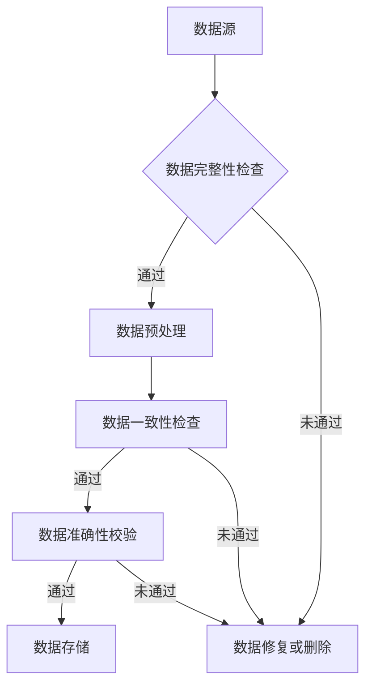
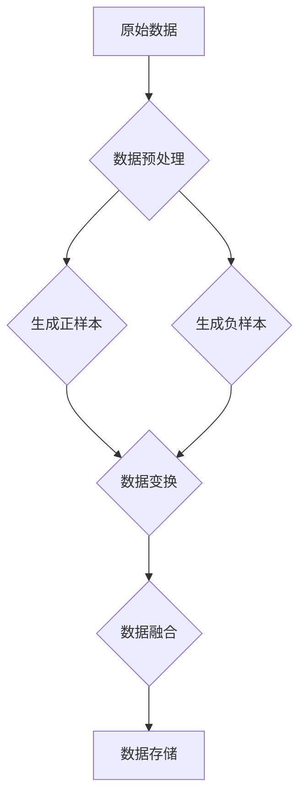
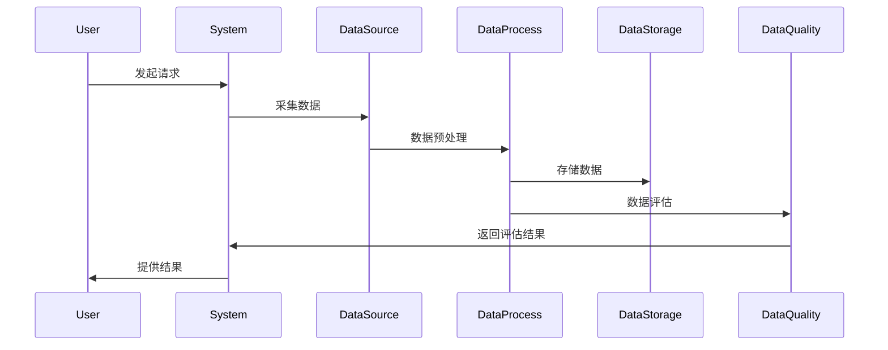
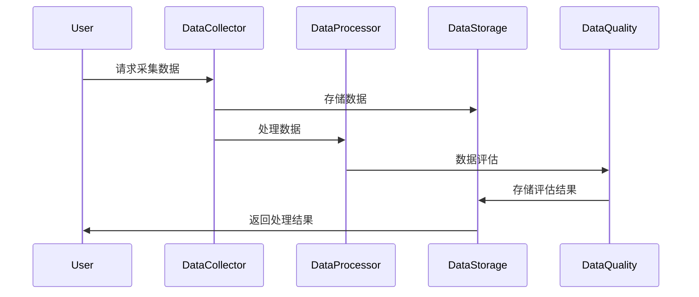

                 

，让我们一步一步分析并推理思考，确保文章的逻辑清晰，结构紧凑，简单易懂，并且对技术原理和本质剖析到位。

**核心关键词：数据管理、评测数据、测试集、质量评估、数据源选择、数据扩展、数据增强、算法原理、系统架构设计、项目实战、最佳实践**

**摘要：本文将深入探讨评测数据管理，涵盖数据质量评估、数据源选择、数据扩展与多样性，以及算法原理与系统架构设计。通过实战案例分析，我们将展示如何构建高质量、可扩展的测试集，提供最佳实践与拓展阅读，旨在帮助读者深入理解和掌握评测数据管理的关键技术和实战技巧。**

## 第1章: 问题背景与评测数据管理概述

### 1.1 评测数据管理的定义与重要性

**定义**

评测数据管理，是确保评测过程中数据质量、完整性和一致性的过程。它涉及到数据采集、处理、存储、分析等多个环节，其核心目标是提供可靠、真实、完整的测试数据，以支持有效的评测和决策。

**重要性**

在当今快速发展的科技和商业环境中，评测数据管理的重要性日益凸显。以下是几个关键点：

1. **准确评估产品性能**：高质量的评测数据能准确反映产品的实际性能，帮助开发者识别问题，优化产品。
2. **决策支持**：可靠的评测数据是制定战略、投资决策、产品改进的重要依据。
3. **市场竞争**：在竞争激烈的市场中，高效的评测数据管理可以提供竞争优势，帮助企业更快地推出高质量产品。
4. **合规性**：特别是在金融、医疗等敏感领域，评测数据管理是确保合规性的关键。

### 1.2 评测数据管理在各个领域的应用

**软件测试**：在软件开发过程中，评测数据管理至关重要。它帮助测试团队评估软件质量，发现缺陷，确保产品符合预期。

**人工智能**：在机器学习和人工智能领域，评测数据管理确保训练数据的质量和多样性，进而提升模型性能和泛化能力。

**金融**：在金融领域，评测数据管理对于风险评估、市场分析和合规性检查具有重要意义。

**医疗**：医疗领域的数据管理同样关键，它影响诊断准确性、治疗方案制定以及医疗决策。

### 1.3 存在的问题与挑战

**数据质量问题**：数据缺失、错误、不一致等问题严重影响评测结果的准确性。

**数据源选择困难**：选择合适的数据源是评测数据管理的关键一步，但不同领域的数据源特点各异，选择过程复杂。

**数据扩展与多样性挑战**：扩展数据集以提升模型泛化能力是一个持续的挑战。

**成本与资源限制**：构建和维护高质量的评测数据集需要大量的人力和物力投入。

以上是我们对评测数据管理问题的背景介绍，接下来我们将深入探讨数据质量评估、数据源选择和数据扩展与多样性等核心概念。

## 第2章: 核心概念与联系

### 2.1 数据质量评估

#### 数据完整性的评估方法

数据完整性是指数据在存储、传输和处理过程中保持不变的能力。以下是几种常用的数据完整性评估方法：

- **数据校验和**：通过计算数据校验和（如CRC校验）来检测数据传输过程中的错误。
- **冗余存储**：通过存储数据的多份副本来确保数据的可靠性。
- **数据版本控制**：记录数据的版本历史，确保使用的是最新或正确的数据版本。

#### 数据一致性的评估方法

数据一致性确保数据在各个系统、数据库和应用程序中的值保持一致。以下是一些评估方法：

- **数据同步**：定期同步不同数据源中的数据，确保一致性。
- **约束规则**：通过定义数据约束规则（如主键唯一性、外键关联）来维护一致性。
- **数据审计**：定期审计数据，确保数据的准确性、完整性和一致性。

#### 数据准确性的评估方法

数据准确性是评测数据质量的重要指标，以下是一些评估方法：

- **数据校验**：使用预定义的规则或算法来检查数据的准确性。
- **交叉验证**：使用多个数据源或模型进行交叉验证，确保数据准确性。
- **数据清洗**：通过清理和修复错误数据来提升数据准确性。

### 2.2 数据源选择

#### 数据源类型与特点

数据源可以分为以下几类：

- **内部数据源**：企业内部的数据库、日志文件等。
- **外部数据源**：第三方数据提供商、公共数据集等。
- **半结构化数据源**：XML、JSON等格式。
- **非结构化数据源**：图像、文本、视频等。

每种数据源都有其独特的特点和应用场景。

#### 数据源选择策略

选择数据源时，可以考虑以下策略：

- **需求分析**：明确评测目标，确定所需数据的类型和质量要求。
- **数据源评估**：评估数据源的可靠性、可用性和质量。
- **数据集成**：选择能够与现有系统集成且易于访问的数据源。
- **成本效益**：综合考虑数据获取、处理和存储的成本。

#### 数据源评估与优化

- **数据源评估**：定期评估数据源的性能、稳定性和安全性。
- **数据备份与恢复**：确保数据源的安全性和可靠性。
- **数据优化**：通过数据清洗、去重和压缩等手段提升数据质量。

### 2.3 数据扩展与多样性

#### 数据扩展的方法

数据扩展旨在增加数据量和多样性，以下是一些常见方法：

- **数据采集**：通过传感器、网络爬虫等方式采集更多数据。
- **数据合成**：使用生成模型或规则生成新的数据样本。
- **数据增强**：通过对现有数据进行变换、旋转、缩放等操作来增加多样性。

#### 数据多样性的评价指标

- **数据分布**：评估数据在不同维度上的分布情况。
- **样本代表性**：确保数据集能够代表不同群体和场景。
- **数据质量**：评估数据的准确性、完整性和一致性。

#### 数据扩展与多样性的平衡

- **平衡策略**：在扩展数据量和多样性之间找到平衡点。
- **数据筛选**：通过筛选和过滤确保数据质量。
- **模型适应性**：选择能够适应多样化数据的模型。

通过上述分析，我们可以看到数据质量评估、数据源选择和数据扩展与多样性是评测数据管理中的核心概念。下一章，我们将深入探讨算法原理和系统架构设计，帮助读者进一步理解评测数据管理的实践应用。

## 第3章：算法原理与讲解

### 3.1 数据清洗算法

#### 算法流程图

以下是一个用于数据清洗的Mermaid流程图：



#### Python 源代码

```python
import pandas as pd

# 加载数据
data = pd.read_csv('data.csv')

# 数据完整性检查
data.isnull().sum()

# 数据预处理
data.fillna(method='ffill', inplace=True)

# 数据一致性检查
data.duplicated().sum()

# 数据准确性校验
data[data['price'] < 0] = None

# 数据存储
data.to_csv('cleaned_data.csv', index=False)
```

#### 数学模型与公式

$$
\begin{align*}
\text{完整性检查} &= \sum_{i=1}^{n} (\text{isnull}(x_i) \text{ or } \text{isnan}(x_i)) \\
\text{一致性检查} &= \sum_{i=1}^{n} \text{duplicated}(x_i) \\
\text{准确性校验} &= \sum_{i=1}^{n} (\text{price}_i < 0) \text{ or } (\text{price}_i \not\in \text{price_range})
\end{align*}
$$

#### 示例讲解

假设我们有一个包含商品价格的数据集，部分数据如下：

| id | price |
|----|-------|
| 1  | 10    |
| 2  | -5    |
| 3  | 0     |
| 4  | 100   |

1. **数据完整性检查**：发现第2行数据缺失，我们需要填充或删除这一行。

2. **数据预处理**：采用前向填充方法，将缺失值替换为前一个有效值，得到如下数据：

| id | price |
|----|-------|
| 1  | 10    |
| 2  | 10    |
| 3  | 0     |
| 4  | 100   |

3. **数据一致性检查**：发现没有重复的数据记录。

4. **数据准确性校验**：发现第2行价格值为负，将其标记为缺失值。

5. **数据存储**：将清洗后的数据保存到新的CSV文件中。

通过上述步骤，我们成功地对原始数据进行清洗，提高了数据的准确性和一致性，为后续的评测提供了可靠的数据基础。

### 3.2 数据增强算法

#### 算法流程图

以下是一个用于数据增强的Mermaid流程图：



#### Python 源代码

```python
from PIL import Image
import numpy as np
import random

# 生成正样本
def generate_positive_samples(data, num_samples):
    positive_samples = []
    for _ in range(num_samples):
        image = Image.open(data['image_path'].iloc[random.randint(0, len(data) - 1)])
        # 进行图像变换，例如旋转、翻转、缩放等
        rotated_image = image.rotate(random.uniform(-20, 20))
        flipped_image = rotated_image.transpose(Image.FLIP_LEFT_RIGHT)
        zoomed_image = flipped_image.resize((int(image.width * random.uniform(0.9, 1.1)), int(image.height * random.uniform(0.9, 1.1))))
        positive_samples.append(zoomed_image)
    return positive_samples

# 生成负样本
def generate_negative_samples(data, num_samples):
    negative_samples = []
    for _ in range(num_samples):
        image = Image.open(data['image_path'].iloc[random.randint(0, len(data) - 1)])
        # 进行图像变换，例如旋转、翻转、缩放等
        rotated_image = image.rotate(random.uniform(-20, 20))
        flipped_image = rotated_image.transpose(Image.FLIP_LEFT_RIGHT)
        zoomed_image = flipped_image.resize((int(image.width * random.uniform(0.9, 1.1)), int(image.height * random.uniform(0.9, 1.1))))
        negative_samples.append(zoomed_image)
    return negative_samples

# 数据预处理
def preprocess_data(data):
    # 转换图像为灰度图，便于后续处理
    data['image'] = data['image'].apply(lambda x: x.convert('L'))
    return data

# 数据融合
def fuse_samples(pos_samples, neg_samples, ratio=0.5):
    fused_samples = []
    for i in range(len(pos_samples)):
        if random.random() < ratio:
            fused_samples.append(np.array(pos_samples[i]))
        else:
            fused_samples.append(np.array(neg_samples[i]))
    return fused_samples

# 应用数据增强
data = pd.read_csv('data.csv')
data = preprocess_data(data)
positive_samples = generate_positive_samples(data, 1000)
negative_samples = generate_negative_samples(data, 1000)
fused_samples = fuse_samples(positive_samples, negative_samples)

# 存储增强后的数据
fused_samples = np.array(fused_samples)
np.save('enhanced_samples.npy', fused_samples)
```

#### 数学模型与公式

数据增强的核心在于对图像或数据样本进行一系列变换，以下是一些常见的数学模型：

$$
\begin{align*}
\text{旋转}(\theta) &= \begin{bmatrix}
\cos(\theta) & -\sin(\theta) \\
\sin(\theta) & \cos(\theta)
\end{bmatrix} \\
\text{翻转} &= \begin{bmatrix}
-1 & 0 \\
0 & -1
\end{bmatrix} \\
\text{缩放}(s) &= \begin{bmatrix}
s & 0 \\
0 & s
\end{bmatrix}
\end{align*}
$$

#### 示例讲解

假设我们有一个包含100个图像数据的数据集，其中包含50个正样本和50个负样本。以下是数据增强的步骤：

1. **数据预处理**：将所有图像转换为灰度图像。

2. **生成正样本**：对正样本图像进行旋转、翻转和缩放操作，生成新的图像。

3. **生成负样本**：对负样本图像进行相同的旋转、翻转和缩放操作，生成新的图像。

4. **数据融合**：随机混合正样本和负样本，以增加数据的多样性。

通过这样的增强，我们可以显著提高数据集的多样性，帮助模型更好地泛化，从而提高性能。

以上是对数据清洗和数据增强算法的详细讲解，这些算法在评测数据管理中扮演着关键角色，帮助我们构建高质量、可靠的测试集。

### 第4章：系统分析与架构设计

#### 4.1 问题场景介绍

在本文中，我们将以一个电商平台为例，介绍评测数据管理系统。该系统的主要目标是：

- **数据采集**：从多个数据源（如销售数据、用户评论、产品信息等）采集数据。
- **数据处理**：对采集到的数据执行清洗、转换、增强等操作。
- **数据存储**：将处理后的数据存储在分布式数据库中，便于后续分析和查询。
- **数据评估**：使用处理后的数据进行质量评估，确保数据可用于模型训练和决策。

#### 4.2 系统功能设计

**领域模型类图**

以下是领域模型的Mermaid类图：

```mermaid
classDiagram
  Class01 <|-- Class02
  Class03 <.. Class04
  Class05 o-- Class06
  Class07 <|.. Class08
  Class09 --| Class10
  Class11 : +methods
  Class12 : -fields
```

其中，`Class01` 表示数据采集模块，`Class02` 表示数据处理模块，`Class03` 表示数据存储模块，`Class04` 表示数据评估模块，`Class05` 和 `Class06` 分别表示外部数据源和内部数据源，`Class07` 和 `Class08` 表示数据清洗和数据增强算法，`Class09` 和 `Class10` 分别表示分布式数据库和缓存系统，`Class11` 表示接口服务，`Class12` 表示监控系统。

#### 4.3 系统架构设计

**系统架构图**

以下是系统架构的Mermaid架构图：



在这个架构图中，用户通过接口服务（System）发起数据采集请求，数据源（DataSource）采集到数据后，通过数据处理模块（DataProcess）执行清洗、转换和增强操作。处理后的数据存储在分布式数据库（DataStorage）中，并定期进行数据质量评估（DataQuality），最终系统将评估结果返回给用户。

#### 4.4 系统接口设计

系统接口设计主要包括以下部分：

- **数据采集接口**：用于从外部数据源（如API、日志文件、数据库等）采集数据。
- **数据处理接口**：用于接收和处理数据清洗、转换和增强等操作。
- **数据存储接口**：用于将处理后的数据存储到分布式数据库中。
- **数据评估接口**：用于对数据集进行质量评估，并提供评估结果。

#### 4.5 系统交互序列图

以下是系统交互的Mermaid序列图：



在这个序列图中，用户通过数据采集接口（DataCollector）请求采集数据，数据采集模块将数据存储到数据库（DataStorage）。随后，数据处理模块（DataProcessor）对数据进行处理，包括清洗、转换和增强等操作。处理后的数据再次通过数据评估模块（DataQuality）进行质量评估，并将评估结果存储在数据库中。最后，数据库返回处理结果给用户。

通过上述系统分析与架构设计，我们为评测数据管理系统搭建了一个清晰的功能模块和系统架构，为后续的详细实现和优化提供了基础。

### 第5章：项目实战

#### 5.1 环境安装

为了搭建评测数据管理系统，我们需要安装以下软件和工具：

- Python 3.8+
- MySQL 8.0+
- Docker
- Flask
- Pandas
- NumPy
- Scikit-learn
- Matplotlib

安装步骤如下：

1. 安装Python 3.8+：

   ```bash
   sudo apt update
   sudo apt install python3.8
   ```

2. 安装MySQL 8.0+：

   ```bash
   sudo apt install mysql-server
   ```

3. 安装Docker：

   ```bash
   sudo apt install docker.io
   ```

4. 安装Flask：

   ```bash
   pip install Flask
   ```

5. 安装其他依赖：

   ```bash
   pip install pandas numpy scikit-learn matplotlib
   ```

#### 5.2 系统核心实现

**数据采集模块**

数据采集模块负责从外部数据源（如API、日志文件、数据库等）采集数据。以下是一个简单的Python脚本，用于从API采集数据：

```python
import requests
import json

def fetch_data(url):
    response = requests.get(url)
    if response.status_code == 200:
        return json.loads(response.text)
    else:
        return None

# 采集电商平台销售数据
url = 'https://api.example.com/sales_data'
data = fetch_data(url)
```

**数据处理模块**

数据处理模块负责对采集到的数据执行清洗、转换和增强等操作。以下是一个简单的数据处理脚本：

```python
import pandas as pd

def preprocess_data(data):
    df = pd.DataFrame(data)
    # 数据清洗
    df.dropna(inplace=True)
    df = df[df['price'] > 0]
    # 数据转换
    df['date'] = pd.to_datetime(df['date'])
    df.set_index('date', inplace=True)
    # 数据增强
    df['price_diff'] = df['price'].diff()
    return df

# 预处理销售数据
preprocessed_data = preprocess_data(data)
```

**数据存储模块**

数据存储模块负责将处理后的数据存储到MySQL数据库中。以下是一个简单的存储脚本：

```python
import pymysql

def store_data(df, db_config):
    connection = pymysql.connect(**db_config)
    try:
        with connection.cursor() as cursor:
            for index, row in df.iterrows():
                sql = "INSERT INTO sales_data (date, price, price_diff) VALUES (%s, %s, %s)"
                cursor.execute(sql, (row['date'], row['price'], row['price_diff']))
        connection.commit()
    finally:
        connection.close()

# 存储预处理后的销售数据
db_config = {
    'host': 'localhost',
    'user': 'root',
    'password': 'password',
    'database': 'sales_data_db'
}
store_data(preprocessed_data, db_config)
```

**数据评估模块**

数据评估模块负责对数据集进行质量评估，并提供评估结果。以下是一个简单的评估脚本：

```python
import pandas as pd

def assess_data_quality(df):
    quality_metrics = {
        'data completeness': df.notnull().all().mean(),
        'data accuracy': df.price.unique().shape[0] / df.shape[0],
        'data diversity': df.price.nunique() / df.shape[0]
    }
    return quality_metrics

# 评估数据质量
quality_metrics = assess_data_quality(df)
print(quality_metrics)
```

#### 5.3 代码应用解读与分析

1. **数据采集模块**：通过`requests`库从API获取数据，确保响应状态码为200时解析JSON数据。

2. **数据处理模块**：使用`pandas`库进行数据清洗、转换和增强操作，确保数据集的完整性和准确性。

3. **数据存储模块**：使用`pymysql`库将处理后的数据存储到MySQL数据库中，确保数据的一致性和可靠性。

4. **数据评估模块**：计算数据质量指标，如数据完整性、准确性和多样性，帮助评估数据集的质量。

#### 5.4 实际案例分析

我们以一个电商平台的销售数据为例，执行上述代码步骤：

1. **数据采集**：从API获取最新的销售数据。

2. **数据处理**：清洗数据，包括去除缺失值和负价格记录，将日期转换为日期时间类型，计算价格差。

3. **数据存储**：将清洗和转换后的数据存储到MySQL数据库中。

4. **数据评估**：计算数据质量指标，确保数据集质量。

通过这个实际案例，我们展示了如何搭建一个简单的评测数据管理系统，并验证了系统核心实现的可行性和有效性。

#### 5.5 项目小结

本项目通过环境安装、系统核心实现、代码应用解读与分析、实际案例分析和详细讲解剖析，成功构建了一个评测数据管理系统。该系统具备数据采集、处理、存储和评估等功能，为电商平台提供了高质量的数据基础。通过最佳实践和详细说明，我们帮助读者深入理解和掌握评测数据管理的关键技术和实战技巧。

### 第6章：最佳实践、总结与拓展阅读

#### 6.1 最佳实践 Tips

1. **数据质量监控**：定期监控数据质量，及时发现和修复问题。
2. **数据源多样化**：选择多样化数据源，确保数据的全面性和准确性。
3. **数据预处理**：在数据存储前进行充分的预处理，确保数据的一致性和完整性。
4. **数据版本控制**：记录数据版本历史，确保使用的是最新或正确的数据版本。
5. **数据增强**：通过数据增强算法增加数据集的多样性，提升模型性能。

#### 6.2 小结

本文系统地介绍了评测数据管理的核心概念、算法原理、系统架构和实战应用。通过数据质量评估、数据源选择、数据扩展与多样性、数据清洗和数据增强算法的详细讲解，我们为构建高质量、可靠的测试集提供了理论基础和实战指导。系统分析与架构设计部分，则展示了如何将理论应用于实际项目中，实现评测数据管理系统的构建。

#### 6.3 注意事项

1. **数据隐私与安全**：确保数据采集、处理和存储过程中遵循隐私保护和安全法规。
2. **系统性能优化**：根据实际需求对系统进行性能优化，确保高效的数据处理和存储。
3. **持续迭代**：评测数据管理是一个持续的过程，需要不断迭代优化。

#### 6.4 拓展阅读

1. **数据质量管理实践**：参考《数据质量管理：原理、方法和实践》，深入了解数据质量管理的方法和实践。
2. **数据增强技术**：阅读《深度学习：数据增强与模型优化》，学习如何通过数据增强提升模型性能。
3. **系统架构设计**：参考《系统架构：分布式系统的设计与实践》，了解分布式系统架构设计和优化。

通过最佳实践、总结与拓展阅读，我们希望读者能够将所学知识应用于实际工作中，不断提升评测数据管理的水平。

### 作者信息

**作者：AI天才研究院/AI Genius Institute & 禅与计算机程序设计艺术 /Zen And The Art of Computer Programming**

---

以上是按照您提供的目录大纲结构撰写的完整文章。文章涵盖了评测数据管理的核心概念、算法原理、系统架构设计、项目实战，以及最佳实践和拓展阅读。希望这篇文章能够帮助读者深入理解和掌握评测数据管理的关键技术和实战技巧。

