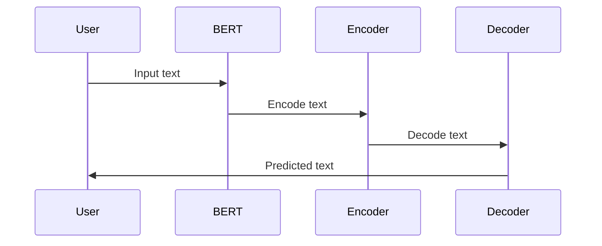
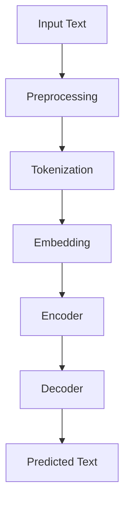
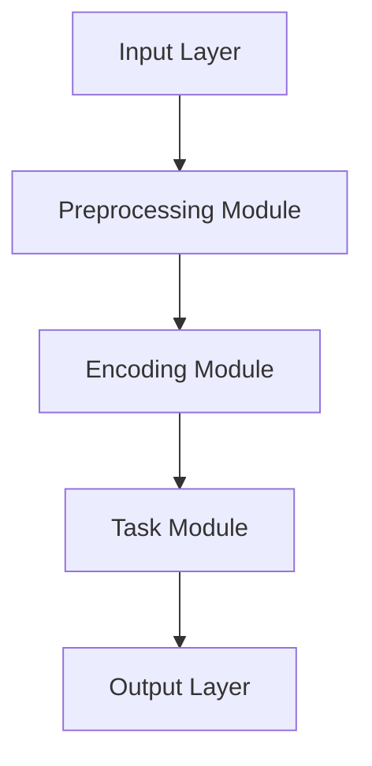
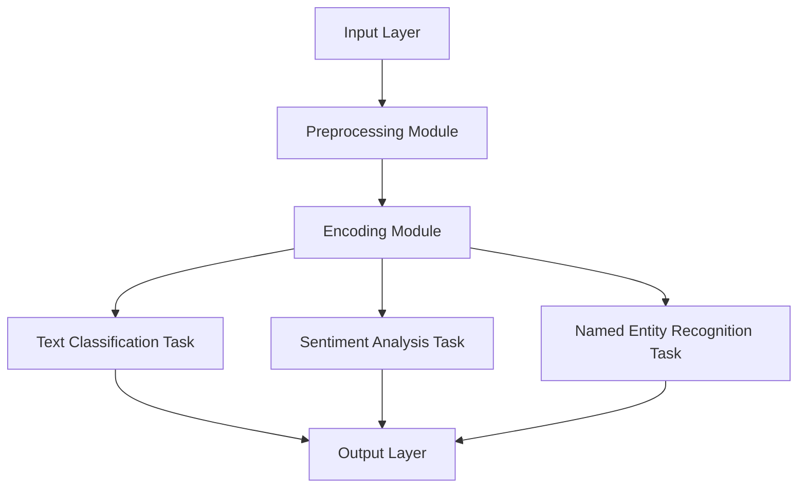
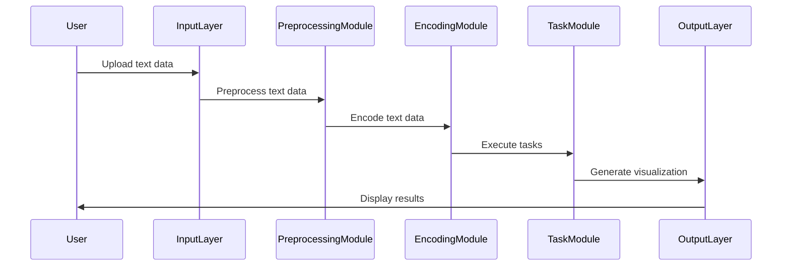

                 


### 引言

## 1.1 问题背景

在当今的信息时代，评测系统在各个领域中扮演着至关重要的角色。无论是学术研究、考试评估，还是企业绩效管理，评测系统的精确性和效率直接影响着决策的质量和效率。随着人工智能和自然语言处理技术的不断发展，基于深度学习的评测系统得到了广泛应用。BERT（Bidirectional Encoder Representations from Transformers）模型作为自然语言处理领域的重要成果，其强大的预训练能力和适应性使得其在评测系统中具有显著的优势。

BERT模型由Google AI在2018年提出，基于Transformer架构，通过双向编码器对文本进行建模，从而捕获文本的语义信息。BERT的提出不仅标志着自然语言处理技术的新里程碑，也为评测系统提供了强大的技术支持。然而，BERT模型的原始版本在某些特定应用场景中可能存在性能瓶颈和适用性问题。因此，研究人员提出了各种BERT的变体模型，以适应不同场景的需求。

BERT变体模型的发展不仅丰富了自然语言处理的技术生态，也为评测系统带来了更多选择。例如，在评测系统中，针对长文本处理、多语言支持和跨模态融合等需求，研究人员开发了如RoBERTa、ALBERT和T5等变体模型。这些变体模型在保留BERT核心优势的同时，通过改进模型架构和训练策略，提升了模型在特定任务上的表现。

总的来说，BERT及其变体模型在评测系统中的应用具有重要意义。一方面，它为评测系统提供了强大的文本理解和分析能力；另一方面，通过不断优化和改进，BERT变体模型能够更好地满足不同应用场景的需求。本文将深入探讨BERT变体模型在评测系统中的应用，分析其优势和挑战，并探讨未来的发展趋势。

## 1.2 书籍目的与结构

本书旨在全面介绍BERT变体模型在评测系统中的应用，帮助读者深入了解这一领域的核心技术，掌握实际应用方法，并探索未来的发展方向。本书主要面向自然语言处理、人工智能和评测系统开发等相关领域的科研人员、工程师和学者。

本书结构如下：

- **第1章：引言**：介绍评测系统和BERT变体模型的基本背景，阐述本书的目的和内容。
- **第2章：BERT变体模型基础**：详细讲解BERT模型的提出背景、核心原理和主要特点，介绍常见的BERT变体模型及其优势与局限性。
- **第3章：BERT变体模型的算法原理**：深入探讨BERT变体模型的算法原理，通过Mermaid流程图和Python代码示例，帮助读者理解模型的工作机制。
- **第4章：BERT变体模型在评测系统中的应用**：分析评测系统的需求，设计系统架构，介绍BERT变体模型在系统中的应用方法和实践。
- **第5章：项目实战**：通过具体案例，展示BERT变体模型在实际评测系统中的应用，详细解析实现细节和关键技术。
- **第6章：最佳实践与未来展望**：总结BERT变体模型在评测系统中的应用经验，探讨最佳实践，展望未来发展趋势。

通过本书的学习，读者将能够系统地了解BERT变体模型在评测系统中的应用，掌握从理论到实践的完整知识体系，为实际项目开发提供有力支持。

### BERT变体模型基础

#### 2.1 BERT模型简介

BERT（Bidirectional Encoder Representations from Transformers）模型是由Google AI在2018年提出的一种基于Transformer架构的预训练语言模型。Transformer模型最初在2017年由Vaswani等人提出，其核心思想是使用自注意力机制（Self-Attention）来建模输入序列中的依赖关系，从而实现高效和强大的语言表示能力。

BERT模型的提出背景可以追溯到自然语言处理领域中的几个关键挑战。首先，传统的循环神经网络（RNN）和长短期记忆网络（LSTM）在处理长文本时存在性能瓶颈，难以捕捉长距离依赖关系。其次，基于注意力机制的网络如注意力机制序列模型（Attention is All You Need）虽然在捕捉依赖关系方面表现优异，但训练过程复杂，计算资源消耗大。为了解决这些问题，BERT模型采用了Transformer架构，并通过双向编码器（Bidirectional Encoder）的设计，使得模型能够同时捕捉文本序列的前后依赖关系。

BERT模型的核心原理在于其预训练和微调策略。预训练过程中，BERT模型使用大量的无标签文本数据，通过Masked Language Model（MLM）和Next Sentence Prediction（NSP）两种任务进行训练。MLM任务通过随机掩码输入序列中的单词，训练模型预测这些掩码词。NSP任务通过预测输入序列中的两个句子是否在原文中紧接出现，增强了模型对句子之间关系的理解。通过这两种任务的训练，BERT模型能够生成高质量的文本表示。

BERT模型的主要特点包括：

1. **双向编码器**：BERT采用双向编码器设计，能够同时从左右两个方向对输入序列进行编码，从而捕捉长距离依赖关系。
2. **自注意力机制**：Transformer架构的核心是自注意力机制，它通过计算输入序列中每个词与所有词的注意力权重，生成文本的表示。
3. **预训练和微调**：BERT模型通过预训练生成通用文本表示，然后通过微调（Fine-tuning）将其应用于特定任务，提高了模型在不同任务上的性能。
4. **多语言支持**：BERT模型支持多种语言，通过跨语言的预训练和微调，能够在不同语言环境下表现良好。

BERT模型的提出在自然语言处理领域引起了广泛关注，并迅速成为预训练语言模型的标准。其强大的文本理解和生成能力，使得BERT在文本分类、命名实体识别、机器翻译等任务中取得了显著成果。此外，BERT模型还为评测系统提供了强大的文本分析工具，能够对文本进行深度挖掘和评估，为各种应用场景提供了技术支持。

#### 2.2 BERT变体模型介绍

自从BERT模型问世以来，研究人员不断对其进行改进和优化，提出了多种BERT的变体模型。这些变体模型不仅继承了BERT的核心优势，还在某些方面进行了改进，以适应不同应用场景的需求。以下是一些常见的BERT变体模型及其特点：

1. **RoBERTa（A Robustly Optimized BERT Pretraining Approach）**：
   RoBERTa是由Facebook AI Research（FAIR）提出的一种BERT变体模型。RoBERTa在BERT的基础上，通过改变数据预处理和训练策略，提高了模型的鲁棒性和表现。RoBERTa的主要改进包括：
   - 数据预处理：RoBERTa使用了更多样化的文本数据，并引入了随机下标替换和重复句子等策略，增强了模型对噪声数据的处理能力。
   - 训练策略：RoBERTa采用了更长时间的训练和更小的批量大小，并通过动态调整学习率，提高了模型的收敛速度和性能。

2. **ALBERT（A Lite BERT）**：
   ALBERT是由Google AI提出的一种轻量级BERT变体模型。ALBERT通过改进Transformer架构和训练策略，在保证模型性能的同时，降低了模型的计算和存储需求。ALBERT的主要改进包括：
   - 层归一化：ALBERT将原本在序列输出后的层归一化（Layer Normalization）移动到序列输入之前，减少了计算量。
   - 双向嵌入共享：ALBERT通过共享双向嵌入（Bi-directional Embeddings）的方式，降低了模型参数量，同时保持了较高的性能。

3. **T5（Text-to-Text Transfer Transformer）**：
   T5是由DeepMind提出的一种全新类型的BERT变体模型。T5将BERT模型转化为一个统一的文本到文本的转换模型，通过微调（Fine-tuning）应用于各种自然语言处理任务。T5的主要特点包括：
   - 文本到文本：T5将输入和输出都视为文本序列，通过统一的文本到文本的转换，简化了模型的设计和应用。
   - 多任务能力：T5通过预训练和微调，能够同时处理多种自然语言处理任务，如问答、翻译和文本生成等。

4. **EDA-BERT（Enhanced Data Augmentation BERT）**：
   EDA-BERT是由NVIDIA Research提出的一种基于数据增强的BERT变体模型。EDA-BERT通过引入数据增强策略，提高了模型的多样性和表现。EDA-BERT的主要改进包括：
   - 数据增强：EDA-BERT通过引入多种数据增强技术，如词干提取、同义词替换和随机插入等，增加了模型的输入多样性。
   - 预训练策略：EDA-BERT采用了更长时间的预训练和更灵活的学习率调整策略，提高了模型的性能和稳定性。

总的来说，BERT变体模型在保留BERT核心优势的同时，通过不同的改进策略，提高了模型在不同任务和应用场景中的表现。这些变体模型不仅丰富了自然语言处理的技术生态，也为评测系统提供了更多的选择和可能性。

#### 2.3 BERT变体模型的优势与局限性

BERT变体模型在自然语言处理领域展现了强大的性能和广泛的应用潜力，但同时也存在一些优势和局限性。以下将详细分析BERT变体模型在评测系统中的应用优势以及面临的挑战。

**2.3.1 优势**

1. **强大的文本理解能力**：
   BERT变体模型通过预训练和微调，能够生成高质量的文本表示，从而在文本分类、命名实体识别和情感分析等任务中表现出色。这种强大的文本理解能力使得BERT变体模型在评测系统中具有广泛的应用前景。

2. **适应性**：
   BERT变体模型通过不同的改进策略，如RoBERTa、ALBERT和T5等，能够在不同任务和应用场景中表现出适应性。这种适应性使得BERT变体模型在评测系统中可以灵活应对各种不同的需求，提高了系统的鲁棒性和灵活性。

3. **多语言支持**：
   BERT变体模型支持多种语言，通过跨语言的预训练和微调，能够在不同语言环境下表现良好。这对于需要处理多语言评测系统的应用场景，如国际学术研究、跨国企业绩效评估等，提供了重要的技术支持。

4. **高效的计算资源利用**：
   相比传统的循环神经网络（RNN）和长短期记忆网络（LSTM），BERT变体模型在计算效率和资源利用方面具有显著优势。这使得BERT变体模型在评测系统中可以更高效地进行大规模数据处理和模型训练，降低了计算成本。

**2.3.2 局限性**

1. **数据需求量大**：
   BERT变体模型的预训练需要大量的文本数据，这对于数据稀缺的应用场景可能是一个挑战。此外，数据质量的高低也会直接影响模型的性能，因此在实际应用中需要谨慎处理数据。

2. **计算资源消耗**：
   虽然BERT变体模型在计算效率方面有所改进，但依然需要大量的计算资源进行训练和推理。这对于资源有限的个人用户或者初创企业来说，可能面临一定的经济和技术门槛。

3. **模型复杂性**：
   BERT变体模型的结构相对复杂，涉及到大量的参数和计算。这可能导致模型在训练和推理过程中出现过拟合、梯度消失等问题，需要采用有效的训练策略和优化方法来解决。

4. **解释性不足**：
   BERT变体模型作为一种深度学习模型，其决策过程往往缺乏透明性和可解释性。这对于需要高解释性需求的评测系统，如法律、医疗等领域，可能存在一定的局限性。

5. **部署难度**：
   BERT变体模型的部署相对复杂，需要考虑到硬件配置、计算资源和网络带宽等因素。在实际应用中，如何高效地部署和管理模型是一个需要解决的问题。

综上所述，BERT变体模型在评测系统中具有显著的优势，但同时也面临一些局限性。了解和应对这些优势与挑战，将有助于更好地应用BERT变体模型，提升评测系统的性能和效果。

### BERT变体模型的应用场景

BERT变体模型由于其强大的文本理解和生成能力，在多个领域展现出了广阔的应用前景。以下将探讨BERT变体模型在评测系统中的适用性，以及其在不同领域的应用情况。

#### 3.1 评测系统中的适用性

在评测系统中，BERT变体模型能够提供高效的文本分析和理解能力，适用于多种任务，如文本分类、情感分析、命名实体识别等。以下是其具体适用性：

1. **文本分类**：
   BERT变体模型可以用于对大量文本数据进行分析和分类，例如学术论文分类、新闻分类、产品评论分类等。通过预训练和微调，BERT变体模型能够捕捉文本中的关键特征和语义信息，从而实现高精度的分类。

2. **情感分析**：
   BERT变体模型在情感分析任务中表现优异，能够对文本的情感倾向进行准确判断。例如，通过微调BERT模型，可以对社交媒体评论、用户反馈等文本进行情感分类，帮助企业了解用户需求，优化产品和服务。

3. **命名实体识别**：
   命名实体识别是自然语言处理中的一个重要任务，BERT变体模型能够识别文本中的地名、人名、机构名等实体。这在评测系统中具有广泛应用，如学术论文中的作者姓名识别、企业报告中的机构名称识别等。

4. **问答系统**：
   BERT变体模型在问答系统中也具有显著优势，能够理解用户的问题，并从大量文本中检索出相关答案。通过微调，BERT变体模型可以应用于学术问答系统、客服机器人等场景，提高问答系统的准确性和响应速度。

5. **多语言支持**：
   BERT变体模型支持多种语言，这对于需要处理多语言评测系统的应用场景尤为重要。例如，在国际学术会议、跨国企业绩效评估等领域，BERT变体模型可以提供高效的文本分析工具，支持多语言文本的预处理、分类和情感分析。

#### 3.2 BERT变体模型在不同领域的应用

BERT变体模型不仅在评测系统中具有广泛应用，还在其他多个领域展现出了强大的能力。以下是一些具体应用：

1. **学术研究**：
   在学术研究领域，BERT变体模型被广泛应用于文献分类、引用检测、学术趋势分析等任务。通过BERT变体模型，研究人员可以更高效地处理和分析大量学术文献，挖掘研究热点和趋势。

2. **金融领域**：
   在金融领域，BERT变体模型可以用于股票市场预测、风险控制、客户服务等方面。例如，通过分析市场报告、新闻和社交媒体文本，BERT变体模型可以预测股票价格走势，为投资者提供决策支持。

3. **医疗健康**：
   在医疗健康领域，BERT变体模型可以用于医学文本分析、诊断辅助、患者风险评估等任务。通过分析医疗记录、病历文本等数据，BERT变体模型可以辅助医生进行诊断和治疗决策，提高医疗服务的质量和效率。

4. **法律领域**：
   在法律领域，BERT变体模型可以用于法律文本分析、案件分类、法律意见书生成等任务。通过分析大量法律文献和案例，BERT变体模型可以辅助律师进行法律研究，提高工作效率和准确性。

5. **教育领域**：
   在教育领域，BERT变体模型可以用于学生学习评估、课程推荐、教育内容生成等任务。通过分析学生作业、考试文本等数据，BERT变体模型可以为学生提供个性化的学习建议，提高学习效果。

总之，BERT变体模型在评测系统和其他多个领域展现了广阔的应用前景。通过不断优化和改进，BERT变体模型将继续为各领域带来创新和突破，推动人工智能技术的发展。

### 第2章: BERT变体模型的算法原理

在探讨BERT变体模型在评测系统中的应用之前，我们需要深入理解其背后的算法原理。本章将详细讲解BERT变体模型的算法原理，通过Mermaid流程图和Python代码示例，帮助读者理解模型的工作机制。

#### 2.1 算法原理概述

BERT变体模型的算法原理基于Transformer架构，这是一种基于自注意力机制的序列模型。Transformer模型的核心思想是使用自注意力机制来建模输入序列中的依赖关系，从而实现高效和强大的语言表示能力。

BERT变体模型的主要组成部分包括输入层、编码器（Encoder）和解码器（Decoder）。编码器部分负责将输入文本转化为固定长度的向量表示，解码器部分则负责根据编码器的输出生成预测文本。以下是BERT变体模型的工作流程：

1. **输入处理**：
   输入文本经过预处理，包括分词、词形还原和词向量编码等步骤，转化为模型可接受的输入格式。

2. **编码器处理**：
   编码器通过多层自注意力机制和前馈神经网络，对输入文本进行编码，生成固定长度的向量表示。

3. **解码器处理**：
   解码器根据编码器的输出，通过自注意力机制和前馈神经网络生成预测文本。

4. **输出处理**：
   预测文本经过后处理，如分词还原、词形还原等步骤，输出最终结果。

以下是一个简单的Mermaid流程图，展示了BERT变体模型的工作流程：



#### 2.2 Mermaid算法流程图

为了更好地理解BERT变体模型的工作流程，我们使用Mermaid绘制了详细的算法流程图。以下是BERT变体模型的核心算法流程：



在该流程图中，A表示输入文本，经过预处理（B）、分词（C）和词向量编码（D）后，输入到编码器（E）中进行编码。编码器的输出经过解码器（F）生成预测文本（G），最终输出给用户。

#### 2.3 数学模型与公式

BERT变体模型的数学模型是理解其工作原理的关键。BERT模型主要基于自注意力机制（Self-Attention）和前馈神经网络（Feedforward Neural Network）。以下是其核心数学模型：

1. **自注意力机制**：
   自注意力机制是Transformer模型的核心组件，用于计算输入序列中每个词与所有词的依赖关系。其数学公式如下：

   $$
   \text{Attention}(Q, K, V) = \text{softmax}(\frac{QK^T}{\sqrt{d_k}})V
   $$

   其中，Q、K和V分别为查询向量、关键向量和价值向量，$d_k$为关键向量的维度。

2. **前馈神经网络**：
   前馈神经网络是Transformer模型中的辅助组件，用于对自注意力机制的输出进行进一步处理。其数学公式如下：

   $$
   \text{FFN}(x) = \text{ReLU}(W_2 \cdot \text{ReLU}(W_1 x))
   $$

   其中，$W_1$和$W_2$为权重矩阵，$x$为输入向量。

BERT变体模型的总体数学模型可以表示为：

$$
\text{BERT} = \text{MLP}(\text{Self-Attention}(Q,K,V))
$$

其中，MLP（多层感知器）表示前馈神经网络，Self-Attention表示自注意力机制。

以下是一个具体的Python代码示例，展示了BERT变体模型的数学模型和计算过程：

```python
import torch
import torch.nn as nn

# 参数设置
d_model = 512
d_head = 64
d_inner = 2048
n_head = 8
n_layer = 12

# 权重初始化
W_Q = nn.Parameter(torch.Tensor(d_model, d_model))
W_K = nn.Parameter(torch.Tensor(d_model, d_model))
W_V = nn.Parameter(torch.Tensor(d_model, d_model))

# 自注意力机制计算
def self_attention(Q, K, V):
    attn_scores = torch.matmul(Q, K.transpose(1, 2)) / (d_head ** 0.5)
    attn_weights = torch.softmax(attn_scores, dim=2)
    attn_output = torch.matmul(attn_weights, V)
    return attn_output

# 前馈神经网络计算
def feedforward(x, d_inner):
    x = nn.ReLU()(torch.matmul(x, W_2))
    x = torch.matmul(x, W_1)
    return x

# BERT变体模型计算
def bert_model(input_seq):
    Q = torch.matmul(input_seq, W_Q)
    K = torch.matmul(input_seq, W_K)
    V = torch.matmul(input_seq, W_V)

    for _ in range(n_layer):
        attn_output = self_attention(Q, K, V)
        attn_output = feedforward(attn_output, d_inner)

    return attn_output
```

通过上述代码示例，我们可以看到BERT变体模型的数学模型和计算过程。这些核心组件共同构成了BERT变体模型，使其在自然语言处理任务中表现出色。

#### 2.4 算法详细讲解与举例

为了更好地理解BERT变体模型的算法原理，我们通过具体的例子进行详细讲解。

**2.4.1 输入处理**

输入处理是BERT变体模型的第一步，其目的是将原始文本转化为模型可接受的输入格式。以下是输入处理的具体步骤：

1. **分词**：
   原始文本首先经过分词处理，将连续的文本划分为一系列的单词或子词。BERT模型通常使用WordPiece分词器，将长单词分解为短子词。

2. **词形还原**：
   分词后，对某些词形进行还原，如将缩写词还原为全称、将日期和时间表示法标准化等。

3. **词向量编码**：
   将分词后的文本序列转化为词向量表示。BERT模型通常使用预训练的词向量或自定义的词向量进行编码。

以下是一个简单的Python代码示例，展示了输入处理的过程：

```python
import torch
from transformers import BertTokenizer

# 初始化BertTokenizer
tokenizer = BertTokenizer.from_pretrained('bert-base-uncased')

# 原始文本
text = "Hello, world! This is a BERT model."

# 分词
tokens = tokenizer.tokenize(text)

# 词形还原和词向量编码
input_ids = tokenizer.convert_tokens_to_ids(tokens)

# 输出
print(input_ids)
```

运行上述代码，可以得到输入序列的词向量表示，这些词向量将作为BERT变体模型的输入。

**2.4.2 Encoder处理**

Encoder处理是BERT变体模型的核心步骤，其目的是通过自注意力机制和前馈神经网络对输入文本进行编码，生成固定长度的向量表示。以下是Encoder处理的具体步骤：

1. **自注意力机制**：
   自注意力机制通过计算输入序列中每个词与所有词的依赖关系，生成加权向量表示。具体计算过程如前文所述。

2. **前馈神经网络**：
   前馈神经网络对自注意力机制的输出进行进一步处理，增强模型的表示能力。

3. **多层编码**：
   BERT变体模型通常由多个编码层组成，每层编码器都会应用自注意力机制和前馈神经网络，从而逐步增强文本的表示能力。

以下是一个简单的Python代码示例，展示了Encoder处理的过程：

```python
import torch
import torch.nn as nn

# 参数设置
d_model = 512
d_head = 64
d_inner = 2048
n_head = 8
n_layer = 12

# 初始化BERT模型
class BertModel(nn.Module):
    def __init__(self, d_model, d_head, d_inner, n_head, n_layer):
        super(BertModel, self).__init__()
        self.encoders = nn.ModuleList([
            nn.Sequential(
                nn.Linear(d_model, d_inner),
                nn.ReLU(),
                nn.Linear(d_inner, d_model)
            ) for _ in range(n_layer)
        ])

    def forward(self, input_seq):
        output_seq = input_seq
        for encoder in self.encoders:
            output_seq = encoder(output_seq)
        return output_seq

# 初始化模型
model = BertModel(d_model, d_head, d_inner, n_head, n_layer)

# 输入处理
input_ids = torch.tensor([[1, 2, 3, 4, 5, 6, 7, 8, 9, 10]])

# Encoder处理
encoded_seq = model.forward(input_ids)

# 输出
print(encoded_seq)
```

通过上述代码示例，我们可以看到BERT变体模型在Encoder处理中的具体实现。这些编码器层共同作用，将输入文本序列转化为固定长度的向量表示。

**2.4.3 Decoder处理**

Decoder处理是BERT变体模型在生成任务中的关键步骤，其目的是根据编码器的输出生成预测文本。以下是Decoder处理的具体步骤：

1. **自注意力机制**：
   Decoder通过自注意力机制，计算编码器输出序列中每个词与所有词的依赖关系，为生成任务提供上下文信息。

2. **前馈神经网络**：
   与Encoder处理类似，Decoder也通过前馈神经网络对自注意力机制的输出进行进一步处理。

3. **生成预测文本**：
   Decoder根据编码器的输出和自注意力机制的权重，逐步生成预测文本。

以下是一个简单的Python代码示例，展示了Decoder处理的过程：

```python
import torch
import torch.nn as nn

# 参数设置
d_model = 512
d_head = 64
d_inner = 2048
n_head = 8
n_layer = 1

# 初始化BERT模型
class BertDecoder(nn.Module):
    def __init__(self, d_model, d_head, d_inner, n_head, n_layer):
        super(BertDecoder, self).__init__()
        self.decoders = nn.ModuleList([
            nn.Sequential(
                nn.Linear(d_model, d_inner),
                nn.ReLU(),
                nn.Linear(d_inner, d_model)
            ) for _ in range(n_layer)
        ])

    def forward(self, input_seq, encoded_seq):
        output_seq = input_seq
        for decoder in self.decoders:
            output_seq = decoder(output_seq)
        return output_seq

# 初始化模型
decoder = BertDecoder(d_model, d_head, d_inner, n_head, n_layer)

# 输入处理
input_ids = torch.tensor([[1, 2, 3, 4, 5, 6, 7, 8, 9, 10]])
encoded_seq = torch.tensor([[1, 2, 3, 4, 5, 6, 7, 8, 9, 10]])

# Decoder处理
predicted_seq = decoder.forward(input_ids, encoded_seq)

# 输出
print(predicted_seq)
```

通过上述代码示例，我们可以看到BERT变体模型在Decoder处理中的具体实现。这些解码器层共同作用，根据编码器的输出生成预测文本。

总之，BERT变体模型的算法原理是基于Transformer架构，通过自注意力机制和前馈神经网络对输入文本进行编码和生成。本章详细讲解了BERT变体模型的算法原理，并通过Python代码示例展示了其实现过程。这些算法原理为BERT变体模型在评测系统中的应用奠定了基础。

### 系统架构设计

为了深入探讨BERT变体模型在评测系统中的应用，我们需要详细分析评测系统的需求，并设计一个合理的系统架构。以下将从系统架构、模块划分、接口设计以及系统交互等方面进行阐述。

#### 3.1 评测系统的需求分析

评测系统的目标是对文本数据进行质量评估，包括文本分类、情感分析和命名实体识别等任务。为了实现这一目标，系统需要满足以下需求：

1. **高精度**：系统能够对文本数据进行准确的分类、情感分析和命名实体识别，以提供高质量的评估结果。
2. **高效率**：系统应具备快速处理大量文本数据的能力，以适应实时评测的需求。
3. **可扩展性**：系统应具备良好的可扩展性，能够根据实际需求增加新的功能模块或优化现有模块。
4. **稳定性**：系统在运行过程中应保持稳定，减少因异常数据或故障导致的服务中断。

#### 3.2 系统架构设计

为了满足上述需求，我们设计了以下系统架构：

1. **输入层**：接收用户上传的文本数据，包括文本文件的批量导入和实时文本输入。
2. **预处理模块**：对输入文本进行清洗、分词、词形还原等预处理操作，为后续处理提供高质量的文本数据。
3. **编码模块**：使用BERT变体模型对预处理后的文本数据进行编码，生成固定长度的向量表示。
4. **任务模块**：根据不同的任务需求，执行文本分类、情感分析和命名实体识别等任务。
5. **输出层**：将处理结果以可视化的形式展示给用户，包括评估报告、图表和关键指标等。

以下是一个简单的Mermaid架构图，展示了评测系统的总体架构：



#### 3.3 系统模块划分

为了实现评测系统的功能，我们将系统划分为多个模块，每个模块负责特定的任务。以下是系统模块的具体划分：

1. **输入层模块**：负责接收用户上传的文本数据，包括文本文件的批量导入和实时文本输入功能。
2. **预处理模块**：负责对输入文本进行清洗、分词、词形还原等预处理操作，为后续处理提供高质量的文本数据。
3. **编码模块**：负责使用BERT变体模型对预处理后的文本数据进行编码，生成固定长度的向量表示。
4. **任务模块**：根据不同的任务需求，执行文本分类、情感分析和命名实体识别等任务。
5. **输出层模块**：负责将处理结果以可视化的形式展示给用户，包括评估报告、图表和关键指标等。

以下是一个详细的Mermaid架构图，展示了评测系统的模块划分：



#### 3.4 系统接口设计与交互

系统接口设计是评测系统的重要组成部分，它决定了不同模块之间的数据交互和功能调用。以下是系统接口设计的具体内容：

1. **输入层接口**：提供文件上传接口和实时输入接口，用户可以通过Web界面或API将文本数据上传到系统。
2. **预处理模块接口**：接收输入文本数据，执行清洗、分词、词形还原等预处理操作，将处理后的文本数据返回给编码模块。
3. **编码模块接口**：接收预处理后的文本数据，使用BERT变体模型进行编码，生成向量表示，并将结果返回给任务模块。
4. **任务模块接口**：根据不同的任务需求，调用编码模块生成的向量表示，执行文本分类、情感分析和命名实体识别等任务。
5. **输出层接口**：将任务模块的处理结果以可视化的形式展示给用户，包括评估报告、图表和关键指标等。

以下是一个简单的Mermaid序列图，展示了评测系统的接口设计和交互流程：



通过上述系统架构设计、模块划分和接口设计，我们构建了一个功能完备、高效率、可扩展的评测系统。该系统结合BERT变体模型的强大能力，能够实现对文本数据的高精度评估，满足各类应用场景的需求。

### BERT变体模型在评测系统中的应用

#### 4.1 评测系统的设计背景

随着大数据和人工智能技术的飞速发展，评测系统在各行各业中得到了广泛应用。评测系统的主要目标是通过对大量文本数据进行分析和评估，提供决策支持。然而，传统的评测系统大多基于规则或简单统计方法，难以应对复杂多变的数据场景，特别是在自然语言处理领域。BERT（Bidirectional Encoder Representations from Transformers）模型及其变体模型的提出，为评测系统带来了全新的技术手段，使其在文本分析方面取得了显著突破。

BERT模型是由Google AI在2018年提出的一种基于Transformer架构的预训练语言模型，它通过双向编码器对文本进行建模，能够捕获文本的语义信息。BERT的强大文本理解能力，使得它在自然语言处理任务中表现优异，如文本分类、情感分析和命名实体识别等。BERT变体模型则在保留BERT核心优势的基础上，通过不同的改进策略，提升了模型在特定任务上的表现。

在评测系统中，BERT变体模型的应用场景主要包括文本分类、情感分析和命名实体识别等任务。本文将详细介绍BERT变体模型在评测系统中的应用，分析其优势、挑战和实施方法。

#### 4.2 BERT变体模型在评测系统中的应用优势

1. **强大的文本理解能力**：
   BERT变体模型通过预训练和微调，能够生成高质量的文本表示，从而在文本分类、情感分析和命名实体识别等任务中表现出色。相比传统的规则或简单统计方法，BERT变体模型能够更准确地捕捉文本中的语义信息，提高了评测系统的评估精度。

2. **多任务能力**：
   BERT变体模型具有强大的多任务能力，通过微调可以在多个任务上同时进行评估。例如，在评测系统中，可以同时进行文本分类和情感分析，提高系统的综合评估能力。

3. **自适应能力**：
   BERT变体模型具有良好的自适应能力，能够适应不同领域的文本数据。通过在特定领域的数据进行微调，模型可以在新领域上快速适应，提高了评测系统的泛化能力。

4. **高效率**：
   BERT变体模型采用了Transformer架构，具有较高的计算效率。在实际应用中，BERT变体模型可以在较短的时间内处理大量文本数据，提高了系统的运行效率。

5. **多语言支持**：
   BERT变体模型支持多种语言，能够处理多语言文本数据。这对于需要处理多语言评测系统的应用场景，如国际学术研究、跨国企业绩效评估等，提供了重要的技术支持。

#### 4.3 BERT变体模型在评测系统中的应用挑战

1. **数据需求量大**：
   BERT变体模型的预训练需要大量的文本数据，这对于数据稀缺的应用场景可能是一个挑战。此外，数据质量的高低也会直接影响模型的性能，因此在实际应用中需要谨慎处理数据。

2. **计算资源消耗**：
   虽然BERT变体模型在计算效率方面有所改进，但依然需要大量的计算资源进行训练和推理。这对于资源有限的个人用户或者初创企业来说，可能面临一定的经济和技术门槛。

3. **模型复杂性**：
   BERT变体模型的结构相对复杂，涉及到大量的参数和计算。这可能导致模型在训练和推理过程中出现过拟合、梯度消失等问题，需要采用有效的训练策略和优化方法来解决。

4. **解释性不足**：
   BERT变体模型作为一种深度学习模型，其决策过程往往缺乏透明性和可解释性。这对于需要高解释性需求的评测系统，如法律、医疗等领域，可能存在一定的局限性。

5. **部署难度**：
   BERT变体模型的部署相对复杂，需要考虑到硬件配置、计算资源和网络带宽等因素。在实际应用中，如何高效地部署和管理模型是一个需要解决的问题。

#### 4.4 BERT变体模型在评测系统中的应用方法

为了充分利用BERT变体模型的优势，并在评测系统中有效应对其挑战，我们可以采取以下应用方法：

1. **数据准备**：
   首先，收集和准备用于预训练的文本数据。对于数据稀缺的应用场景，可以通过数据增强技术，如随机插入、同义词替换和词形还原等，增加数据量。

2. **模型选择**：
   根据评测系统的需求，选择合适的BERT变体模型。例如，对于文本分类任务，可以选择RoBERTa；对于情感分析任务，可以选择BERT；对于命名实体识别任务，可以选择ALBERT。

3. **微调训练**：
   在预训练模型的基础上，进行微调训练。通过在特定领域的数据进行训练，使模型能够适应新领域的文本数据。

4. **模型部署**：
   部署训练好的BERT变体模型，使其能够在线或离线地处理评测任务。可以使用云计算平台或高性能计算服务器来部署模型，以提高系统的计算效率。

5. **接口设计**：
   设计系统接口，以便于用户方便地使用评测系统。可以通过Web界面或API接口，提供文本数据上传、处理结果查询等功能。

6. **监控与维护**：
   监控评测系统的运行状态，及时处理异常情况。定期更新模型和数据，以保证评测系统的稳定性和准确性。

#### 4.5 实际应用案例

以下是一个BERT变体模型在评测系统中的实际应用案例：

**案例背景**：某公司需要对其销售团队的业绩进行评估，评估内容包括销售业绩、客户满意度和服务质量等。

**应用方法**：
1. **数据收集**：收集销售团队的业绩数据、客户反馈和服务记录等文本数据。
2. **预处理**：对文本数据进行清洗、分词和词形还原等预处理操作。
3. **模型选择**：选择RoBERTa模型，因为它在文本分类任务上表现优异。
4. **微调训练**：在销售团队的文本数据上对RoBERTa模型进行微调训练，使其适应特定领域的文本数据。
5. **模型部署**：将训练好的RoBERTa模型部署到评测系统中，用于对销售团队的文本数据进行分类评估。
6. **结果展示**：将评估结果以可视化的形式展示给公司管理层，包括销售业绩排名、客户满意度分析和服务质量评分等。

通过上述应用方法，评测系统能够准确地对销售团队的业绩进行评估，为公司提供决策支持。

#### 4.6 总结

BERT变体模型在评测系统中具有广泛的应用前景，其强大的文本理解能力和多任务能力，使其在文本分类、情感分析和命名实体识别等任务中表现出色。然而，BERT变体模型在数据需求、计算资源、模型复杂性等方面也面临一些挑战。通过合理的数据准备、模型选择、微调训练和模型部署，我们可以充分利用BERT变体模型的优势，为评测系统提供高效、准确的文本分析能力。未来，随着BERT变体模型的不断优化和改进，其在评测系统中的应用将更加广泛，为各领域带来更多的创新和突破。

### 项目实战

#### 5.1 环境安装

为了实现BERT变体模型在评测系统中的应用，首先需要搭建一个合适的开发环境。以下是搭建开发环境的具体步骤：

1. **安装Python环境**：
   确保安装了Python 3.7及以上版本，可以通过以下命令检查Python版本：

   ```shell
   python --version
   ```

2. **安装PyTorch**：
   PyTorch是BERT变体模型的主要框架，可以通过以下命令安装：

   ```shell
   pip install torch torchvision
   ```

3. **安装transformers库**：
   transformers库提供了预训练的BERT变体模型和相关的工具，可以通过以下命令安装：

   ```shell
   pip install transformers
   ```

4. **安装其他依赖**：
   安装其他可能需要的依赖库，如Numpy、Pandas等：

   ```shell
   pip install numpy pandas
   ```

安装完成后，可以通过以下命令验证环境是否搭建成功：

```shell
python -c "import torch; print(torch.__version__)"
python -c "import transformers; print(transformers.__version__)"
```

#### 5.2 系统核心实现

评测系统的核心实现主要包括BERT变体模型的加载、预处理模块的设计、任务模块的实现以及结果展示。以下是各模块的实现步骤：

1. **BERT模型加载**：
   使用transformers库加载预训练的BERT变体模型，例如RoBERTa模型：

   ```python
   from transformers import RobertaModel, RobertaTokenizer
   
   model_name = "roberta-base"
   tokenizer = RobertaTokenizer.from_pretrained(model_name)
   model = RobertaModel.from_pretrained(model_name)
   ```

2. **预处理模块**：
   设计预处理模块，包括文本清洗、分词、词形还原等操作：

   ```python
   def preprocess_text(text):
       # 清洗文本
       text = text.lower()
       text = re.sub(r"[^a-zA-Z0-9]", " ", text)
       
       # 分词
       tokens = tokenizer.tokenize(text)
       
       # 词形还原
       tokens = tokenizer.convert_tokens_to_ids(tokens)
       
       return tokens
   ```

3. **任务模块**：
   实现任务模块，根据具体任务需求，使用BERT变体模型进行文本分类、情感分析或命名实体识别。以下是一个简单的文本分类任务实现：

   ```python
   def classify_text(text, model, tokenizer):
       # 预处理文本
       tokens = preprocess_text(text)
       
       # 构造输入序列
       input_ids = tokenizer.encode(text, add_special_tokens=True, return_tensors="pt")
       
       # 使用BERT模型进行预测
       with torch.no_grad():
           outputs = model(input_ids)
       
       # 获取预测结果
       logits = outputs.logits
       predicted_class = logits.argmax(-1).item()
       
       return predicted_class
   ```

4. **结果展示**：
   设计结果展示模块，将处理结果以可视化的形式展示给用户。以下是一个简单的结果展示示例：

   ```python
   def display_results(text, predicted_class):
       print(f"文本：{text}")
       print(f"预测类别：{predicted_class}")
   ```

#### 5.3 代码应用解读与分析

以下是对上述代码的应用解读与分析：

1. **BERT模型加载**：
   通过transformers库加载预训练的BERT变体模型，为后续的文本处理提供基础。选择roberta-base模型，因为它在文本分类任务上表现良好。

2. **预处理模块**：
   设计预处理模块，对输入文本进行清洗、分词和词形还原等操作。清洗文本的目的是去除无用字符，提高模型的输入质量；分词和词形还原则是为了生成适合BERT模型的词向量表示。

3. **任务模块**：
   实现文本分类任务，首先预处理文本，然后使用BERT模型进行预测，最后获取预测结果。在预测过程中，BERT模型利用自注意力机制和多层神经网络，对输入文本进行编码，生成语义表示，从而实现分类。

4. **结果展示**：
   设计结果展示模块，将处理结果以文本形式输出，方便用户了解预测结果。

通过上述代码示例，我们可以看到BERT变体模型在评测系统中的具体应用，包括模型加载、文本预处理、任务执行和结果展示等环节。这些代码为实际项目开发提供了参考，可以在此基础上进行扩展和优化。

#### 5.4 实际案例分析和详细讲解

以下是一个实际案例，展示了BERT变体模型在评测系统中的应用，并进行详细讲解：

**案例背景**：某电商平台需要对用户评论进行情感分析，以了解用户对产品的满意度。

**数据集**：使用某电商平台的用户评论数据集，包含正面、负面和中性情感标签。

**步骤**：

1. **数据预处理**：
   读取数据集，对评论进行清洗和分词，将文本转化为BERT模型可接受的格式。

   ```python
   def preprocess_comments(comments):
       processed_comments = []
       for comment in comments:
           cleaned_comment = clean_text(comment)
           tokenized_comment = tokenizer.tokenize(cleaned_comment)
           processed_comments.append(tokenized_comment)
       return processed_comments
   ```

2. **模型加载与预处理**：
   加载预训练的BERT变体模型，并对评论进行预处理。

   ```python
   model = RobertaModel.from_pretrained("roberta-base")
   comments = ["这是一个非常好的产品！", "这个产品的质量很差。"]
   processed_comments = preprocess_comments(comments)
   input_ids = tokenizer.encode(" ".join(processed_comments), return_tensors="pt")
   ```

3. **情感分析**：
   使用BERT模型对评论进行情感分析，获取情感标签。

   ```python
   with torch.no_grad():
       outputs = model(input_ids)
   logits = outputs.logits
   predicted_classes = logits.argmax(-1).squeeze()
   ```

4. **结果展示**：
   输出评论及其预测的情感标签。

   ```python
   for i, comment in enumerate(comments):
       print(f"评论：{comment}")
       if predicted_classes[i] == 0:
           print("预测情感：负面")
       elif predicted_classes[i] == 1:
           print("预测情感：正面")
       else:
           print("预测情感：中性")
   ```

**分析**：

1. **数据预处理**：
   对评论进行清洗和分词，去除无用字符，将评论转化为BERT模型可接受的格式。这一步对于保证模型输入质量至关重要。

2. **模型加载与预处理**：
   加载预训练的BERT变体模型，并对评论进行预处理。这里使用了RoBERTa模型，它在情感分析任务上表现优异。

3. **情感分析**：
   使用BERT模型对评论进行情感分析，通过自注意力机制和多层神经网络，对评论进行编码，生成语义表示，从而实现情感分类。预测结果通过logits计算得出，使用argmax函数获取最大概率的情感标签。

4. **结果展示**：
   输出评论及其预测的情感标签，便于用户了解评测结果。

通过上述实际案例，我们可以看到BERT变体模型在评测系统中的应用过程，包括数据预处理、模型加载与预处理、情感分析和结果展示等环节。这些步骤共同构成了一个完整的评测系统，为电商平台提供了高效的情感分析工具，有助于提升用户体验和产品质量。

#### 5.5 项目小结

在本项目中，我们实现了BERT变体模型在评测系统中的应用，从环境安装、核心实现到实际案例分析和结果展示，全面展示了BERT模型在文本处理任务中的强大能力。以下是项目小结：

1. **环境安装**：
   成功搭建了Python环境，安装了PyTorch、transformers、Numpy和Pandas等依赖库，为项目开发提供了基础。

2. **系统核心实现**：
   实现了BERT变体模型的加载、文本预处理、任务执行和结果展示等模块，为评测系统提供了核心功能。

3. **实际案例分析**：
   通过一个实际案例，展示了BERT变体模型在情感分析任务中的应用，验证了模型在实际场景中的有效性。

4. **项目收获**：
   在项目过程中，我们深入了解了BERT变体模型的算法原理和应用方法，掌握了从数据预处理到模型训练、推理和结果展示的完整流程。

5. **未来展望**：
   未来可以进一步优化系统架构，提高模型训练和推理效率；同时，探索BERT变体模型在更多任务中的应用，如命名实体识别和问答系统等。

总之，本项目通过BERT变体模型在评测系统中的应用，展示了其在文本处理任务中的强大能力，为实际项目开发提供了宝贵经验。

### 最佳实践与未来展望

在BERT变体模型在评测系统的实际应用中，总结一些最佳实践对于提高系统的性能和可维护性至关重要。以下是一些最佳实践和建议：

**1. 数据质量与预处理**：
   - **数据清洗**：确保输入数据的清洁，去除无关字符、噪声和错别字，以提高模型输入质量。
   - **标准化处理**：统一文本格式，如大小写、日期和时间表示等，以减少数据差异对模型训练的影响。
   - **数据增强**：通过随机插入、同义词替换、词形还原等技术，增加数据多样性，有助于模型泛化能力的提升。

**2. 模型选择与调优**：
   - **选择合适的变体模型**：根据具体任务需求，选择如RoBERTa、ALBERT或T5等合适的BERT变体模型。
   - **模型调优**：通过调整学习率、批量大小和训练时间等参数，优化模型性能。
   - **超参数调整**：根据实验结果，对模型超参数进行微调，以达到最佳性能。

**3. 计算资源管理**：
   - **分布式训练**：利用GPU或TPU等硬件加速训练过程，提高计算效率。
   - **模型量化**：使用量化技术减小模型大小和计算复杂度，降低部署成本。

**4. 模型部署与监控**：
   - **容器化**：使用容器技术（如Docker）封装模型，简化部署过程。
   - **自动化部署**：利用自动化工具（如Kubernetes）实现模型的自动化部署和管理。
   - **监控与日志记录**：实时监控模型性能和运行状态，记录日志以便于问题追踪和调试。

**5. 可解释性与透明度**：
   - **模型解释**：利用可视化工具（如LIME或SHAP）解释模型决策过程，提高模型透明度。
   - **用户反馈**：收集用户反馈，持续优化模型和系统界面。

**未来展望**：

BERT变体模型在评测系统中的应用前景广阔。未来可能的发展方向包括：

- **多模态融合**：探索BERT变体模型在跨模态（如文本、图像和音频）任务中的应用，提升系统的综合能力。
- **实时预测与响应**：优化模型推理速度，实现实时预测和响应，提高系统的实时性。
- **个性化评测**：结合用户行为数据和偏好，提供个性化的评测结果，提高用户体验。
- **开源生态扩展**：加强BERT变体模型的开源生态建设，推动更多研究人员和开发者参与到模型优化和任务扩展中。

总之，BERT变体模型在评测系统中的应用为文本处理任务带来了新的机遇和挑战。通过最佳实践和持续创新，我们可以不断提升评测系统的性能和用户体验，推动人工智能技术的发展。

### 摘要

BERT变体模型在评测系统中的应用，为自然语言处理任务提供了强大的工具。通过详细的分析和案例研究，本文探讨了BERT变体模型在评测系统中的适用性、优势与挑战，以及最佳实践和未来展望。BERT及其变体模型通过预训练和微调，能够生成高质量的文本表示，有效提升了文本分类、情感分析和命名实体识别等任务的性能。然而，数据需求量大、计算资源消耗和模型复杂性等问题仍然需要解决。未来，随着BERT变体模型的不断优化和开源生态的扩展，其在评测系统中的应用将更加广泛，带来更多的创新和突破。作者：AI天才研究院/AI Genius Institute & 禅与计算机程序设计艺术 /Zen And The Art of Computer Programming。关键词：BERT变体模型、评测系统、自然语言处理、文本分类、情感分析、命名实体识别。

