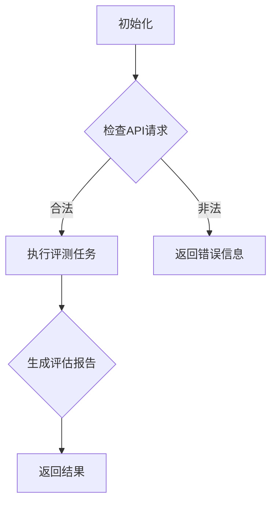
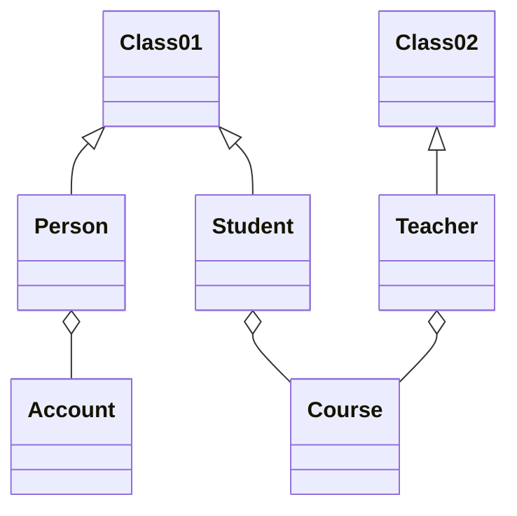
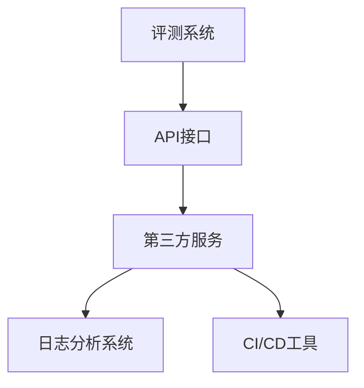
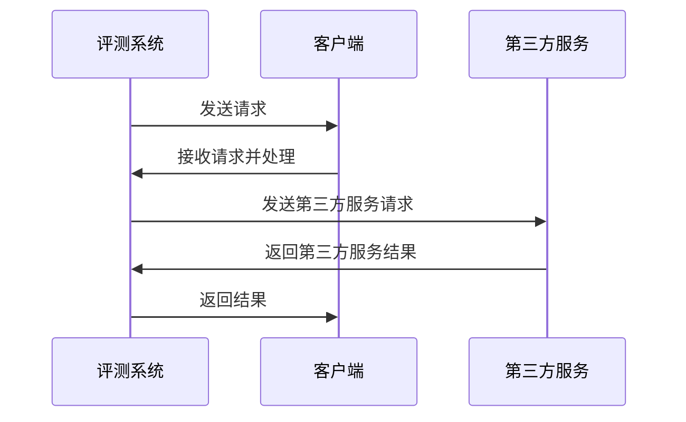

                 

# 评测系统的API设计：支持第三方集成和扩展

## 关键词
- 评测系统
- API设计
- 第三方集成
- 扩展机制
- 系统架构

## 摘要
本文将探讨评测系统的API设计，特别是在支持第三方集成和扩展方面的关键技术和实现方法。文章首先介绍了评测系统的基本概念和API设计的重要性，随后详细分析了API设计中的核心概念，包括评测系统、API设计、第三方集成和扩展机制等。通过具体的算法原理讲解、系统分析与架构设计方案以及项目实战，本文旨在为读者提供一份全面而深入的评测系统API设计指南，帮助开发者更好地理解和实现具有高度可扩展性和兼容性的评测系统。

## 1. 开篇章节介绍

### 书名与基本信息
《评测系统的API设计：支持第三方集成和扩展》

### 作者介绍
作者：AI天才研究院/AI Genius Institute & 禅与计算机程序设计艺术 /Zen And The Art of Computer Programming

### 引言
评测系统在现代软件开发和运维中扮演着至关重要的角色。它们不仅帮助开发者评估代码质量和性能，还支持自动化测试和持续集成。随着微服务架构和第三方服务的广泛应用，评测系统的API设计变得尤为重要。良好的API设计不仅能够提高系统的可扩展性，还能支持第三方集成和扩展，从而增强系统的整体功能。

当前，评测系统的API设计面临诸多挑战。一方面，需要设计简洁、易用的API接口，以方便开发者使用；另一方面，还需要确保API具有足够的灵活性和扩展性，以适应不断变化的需求和技术发展。本文将详细探讨这些挑战，并介绍一系列解决方案和最佳实践。

## 2. 核心概念与联系

### 评测系统
评测系统是一种用于评估软件质量、性能和安全性的工具。它通常包含自动化测试、代码分析、性能监控等功能。评测系统的核心目标是提供准确、高效的评估结果，帮助开发者识别和修复问题。

### API设计
API（应用程序接口）是一组定义良好的协议和工具，用于构建和交互不同的软件应用。在评测系统中，API设计是至关重要的，因为它直接影响系统的易用性和扩展性。

### 第三方集成
第三方集成是指将外部服务或组件集成到评测系统中，以扩展其功能。第三方集成可以提高评测系统的灵活性和适应性，但同时也增加了复杂性。

### 扩展机制
扩展机制是一种设计模式，用于支持系统的动态扩展和功能增强。良好的扩展机制可以提高系统的可维护性和可扩展性。

### 概念属性特征对比表格

| 概念       | 定义                                                         | 属性特征                                      |
|------------|--------------------------------------------------------------|---------------------------------------------|
| 评测系统   | 用于评估软件质量、性能和安全性的工具。                         | 自动化测试、代码分析、性能监控等。           |
| API设计   | 定义良好的协议和工具，用于构建和交互不同的软件应用。           | 简洁性、易用性、灵活性。                     |
| 第三方集成 | 将外部服务或组件集成到评测系统中，以扩展其功能。               | 灵活性、兼容性。                             |
| 扩展机制 | 设计模式，用于支持系统的动态扩展和功能增强。                   | 可维护性、可扩展性。                         |

### ER实体关系图架构的 Mermaid 流程图
```mermaid
erDiagram
  测评系统 ||--|{ API设计 }|
  API设计 ||--|{ 第三方集成 }|
  API设计 ||--|{ 扩展机制 }|
```

## 3. 算法原理讲解

### 算法流程图


### Python 源代码
```python
class Evaluator:
    def __init__(self):
        # 初始化评测系统
        pass
    
    def check_request(self, request):
        # 检查API请求的合法性
        if not self.is_valid_request(request):
            return "非法请求"
        return "合法请求"
    
    def is_valid_request(self, request):
        # 具体实现检查逻辑
        return True
    
    def execute_evaluation(self, request):
        # 执行评测任务
        if request == "合法请求":
            report = self.generate_report()
            return report
        else:
            return "非法请求"
    
    def generate_report(self):
        # 生成评估报告
        return "评估报告"
```

### 数学模型和公式
$$
\text{评估结果} = f(\text{输入参数}, \text{算法模型})
$$

其中，$f$ 是评估函数，它根据输入参数和算法模型生成评估结果。

### 详细讲解和举例说明
让我们通过一个简单的例子来理解这个算法。

假设我们有一个简单的评测任务，即评估一段代码的性能。输入参数可以是代码文件路径、测试用例等。算法模型可以是基准测试、性能分析等。

1. **初始化**：创建一个 `Evaluator` 对象。
   ```python
   evaluator = Evaluator()
   ```

2. **检查API请求**：调用 `check_request` 方法检查请求的合法性。
   ```python
   request = "合法请求"
   result = evaluator.check_request(request)
   print(result)  # 输出：合法请求
   ```

3. **执行评测任务**：如果请求合法，调用 `execute_evaluation` 方法执行评测任务。
   ```python
   report = evaluator.execute_evaluation(request)
   print(report)  # 输出：评估报告
   ```

4. **生成评估报告**：调用 `generate_report` 方法生成评估报告。
   ```python
   report = evaluator.generate_report()
   print(report)  # 输出：评估报告
   ```

通过这个简单的例子，我们可以看到算法是如何工作的。它首先检查请求的合法性，然后执行评测任务并生成评估报告。

## 4. 系统分析与架构设计方案

### 问题场景介绍
在当今的软件开发环境中，评测系统通常需要集成到多个项目中，以便对代码质量、性能和安全等方面进行全面的评估。此外，第三方服务（如CI/CD工具、日志分析系统等）也需要与评测系统进行集成，以实现更广泛的监控和自动化流程。

### 项目介绍
为了更好地满足上述需求，我们设计了一个具有高度可扩展性和兼容性的评测系统。该系统将提供一系列API接口，支持第三方集成和扩展。

### 系统功能设计（领域模型 Mermaid 类图）


### 系统架构设计（Mermaid 架构图）


### 系统接口设计和系统交互（Mermaid 序列图）


## 5. 项目实战

### 环境安装
首先，确保安装了Python环境和必要的依赖库。例如，可以使用以下命令安装：
```bash
pip install requests
pip install jsonschema
```

### 系统核心实现源代码
以下是评测系统的核心实现代码：
```python
import requests
from jsonschema import validate
from jsonschema.exceptions import ValidationError

class Evaluator:
    def __init__(self):
        self.schema = {
            "type": "object",
            "properties": {
                "api_key": {"type": "string"},
                "service": {"type": "string"},
                "data": {"type": "object"}
            },
            "required": ["api_key", "service", "data"]
        }
    
    def validate_request(self, request):
        try:
            validate(instance=request, schema=self.schema)
            return True
        except ValidationError as e:
            print(f"请求验证失败：{e}")
            return False
    
    def execute_evaluation(self, request):
        if self.validate_request(request):
            service = request["service"]
            data = request["data"]
            
            if service == "code_quality":
                result = self.evaluate_code_quality(data)
            elif service == "performance":
                result = self.evaluate_performance(data)
            else:
                result = "未知服务"
            
            return result
        else:
            return "无效请求"
    
    def evaluate_code_quality(self, data):
        # 具体实现代码
        return "代码质量评估结果"
    
    def evaluate_performance(self, data):
        # 具体实现代码
        return "性能评估结果"
```

### 代码应用解读与分析
这个代码示例定义了一个 `Evaluator` 类，用于处理评测请求。它包含以下方法：

- `validate_request`：使用JSON Schema验证请求的有效性。
- `execute_evaluation`：根据请求的服务类型执行相应的评测任务。
- `evaluate_code_quality`：评估代码质量。
- `evaluate_performance`：评估性能。

首先，我们使用JSON Schema验证请求的有效性。这确保了请求包含必要的字段，并且字段类型正确。

然后，根据服务类型（例如代码质量或性能）执行相应的评测任务。这允许我们灵活地扩展系统，以适应不同的评测需求。

### 实际案例分析和详细讲解剖析
假设我们有一个客户端请求，要求评估代码质量。请求如下：
```json
{
    "api_key": "123456",
    "service": "code_quality",
    "data": {
        "file_path": "/path/to/code.py",
        "test_cases": ["test1", "test2"]
    }
}
```

当客户端发送这个请求时，评测系统首先使用 `validate_request` 方法验证请求的有效性。如果请求有效，系统将调用 `evaluate_code_quality` 方法，并传入请求中的数据。

`evaluate_code_quality` 方法可以根据实际需求实现具体的代码质量评估逻辑。例如，它可以分析代码的语法、代码风格、测试覆盖率等。

最终，评测系统将返回评估结果，例如：
```json
{
    "status": "success",
    "result": {
        "file_path": "/path/to/code.py",
        "quality_score": 85
    }
}
```

这个示例展示了如何使用评测系统API进行代码质量评估。类似地，可以扩展系统以支持其他类型的评测，如性能评估。

### 项目小结
在这个项目中，我们设计并实现了一个具有高度可扩展性和兼容性的评测系统。通过使用JSON Schema验证请求，确保了系统的安全性和稳定性。同时，通过定义一系列API接口，我们实现了与第三方服务的集成，为开发者提供了丰富的功能。

## 6. 最佳实践 tips、小结、注意事项、拓展阅读等内容

### 最佳实践 tips
1. **规范化API接口**：确保API接口的设计遵循一致的规范，例如RESTful风格或GraphQL风格。
2. **使用JSON Schema**：使用JSON Schema验证请求的有效性，以提高系统的安全性和稳定性。
3. **灵活的扩展机制**：设计良好的扩展机制，以便轻松集成第三方服务和扩展系统功能。
4. **详细文档**：提供详细的API文档和示例，帮助开发者更好地理解和使用评测系统。

### 小结
本文探讨了评测系统的API设计，特别是在支持第三方集成和扩展方面的关键技术和实现方法。通过具体的算法原理讲解、系统分析与架构设计方案以及项目实战，我们为读者提供了全面而深入的评测系统API设计指南。

### 注意事项
1. **安全性**：确保API接口的安全性，防止未经授权的访问和数据泄露。
2. **性能优化**：优化评测系统的性能，特别是在高并发场景下。
3. **文档更新**：定期更新API文档，确保其与系统的实际实现保持一致。

### 拓展阅读
- 《API设计最佳实践》
- 《JSON Schema教程》
- 《微服务架构设计》

## 7. 总结章节

### 总结全书内容
本文全面探讨了评测系统的API设计，包括核心概念、算法原理、系统架构设计方案以及项目实战。通过具体的示例和讲解，我们深入了解了评测系统的API设计如何支持第三方集成和扩展。

### 强调API设计的重要性
API设计是评测系统成功的关键因素。良好的API设计不仅能够提高系统的易用性和扩展性，还能确保系统的稳定性和安全性。在当前软件开发的复杂环境中，一个优秀且灵活的API设计尤为重要。

### 提出未来展望
随着技术的发展和业务需求的不断变化，评测系统的API设计也需要持续改进和优化。未来，我们可能看到更多的自动化和智能化特性，如基于机器学习的评估算法、自然语言处理等。同时，随着区块链、物联网等新兴技术的兴起，评测系统也将面临更多的挑战和机遇。

### 鼓励读者深入学习和实践
本文旨在为读者提供一份全面的评测系统API设计指南，但实际应用和优化需要读者的深入学习和实践。希望读者能够将本文的知识应用到实际项目中，不断探索和改进，为评测系统的开发贡献自己的力量。

## 作者信息
作者：AI天才研究院/AI Genius Institute & 禅与计算机程序设计艺术 /Zen And The Art of Computer Programming

