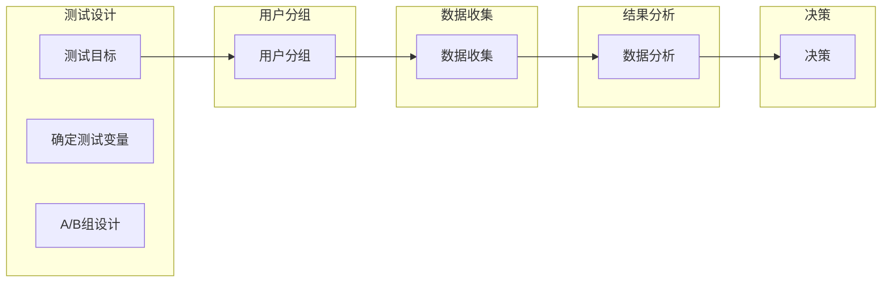

                 

# 评测系统的A/B测试实施方案

## 关键词
A/B测试、评测系统、优化、随机化、数据分析、算法原理

## 摘要
本文将深入探讨评测系统中A/B测试的实施方案，从问题背景、核心概念、算法原理、系统设计与项目实战等多个方面，详细阐述A/B测试在评测系统中的应用与实现。通过本文的阅读，读者将能够掌握A/B测试的基本概念、实施步骤以及在实际项目中如何有效应用A/B测试进行系统优化。

### 目录大纲设计思路

#### 1. 背景介绍

##### 1.1 问题背景
评测系统是软件开发中用于评估软件性能、用户体验和功能实现的重要工具。随着软件功能的不断扩展和用户需求的多样，评测系统的优化显得尤为重要。A/B测试作为一种常用的实验设计方法，可以通过对比不同版本的功能或界面，找出最优的设计方案，从而提高软件的质量和用户满意度。

##### 1.2 A/B测试的概念
A/B测试（也称为拆分测试）是一种将用户随机分配到两个或多个测试组，比较这些组之间结果差异的实验方法。其核心思想是通过控制变量来评估特定变更对系统性能的影响。

##### 1.3 A/B测试的目的与应用场景
A/B测试的目的是通过实验数据来指导软件改进，应用场景包括新功能的上线测试、界面调整、性能优化等。

##### 1.4 问题解决
通过A/B测试，可以科学地评估变更的效果，从而避免盲目优化。本文将介绍A/B测试的实施方案，包括测试环境搭建、测试方案设计、数据收集与分析等。

##### 1.5 边界与外延
A/B测试的实施需要考虑数据的隐私、测试的公正性以及可能的伦理和法律问题。

##### 1.6 概念结构与核心要素组成
本文将梳理A/B测试的组成要素，包括测试环境搭建、测试方案设计、数据收集与分析等。

#### 2. 核心概念与联系

##### 2.1 核心概念原理
A/B测试的基本原理是通过随机分组，将用户分配到不同的测试组，以比较不同组之间的用户体验或性能表现。

##### 2.2 概念属性特征对比表格
将A/B测试与其他测试方法进行对比，包括多变量测试、单变量测试等。

##### 2.3 ER实体关系图架构
使用Mermaid绘制A/B测试的实体关系图，包括用户、测试环境、测试组、控制组、测试指标等。

#### 3. 算法原理讲解

##### 3.1 算法流程图
使用Mermaid绘制A/B测试的流程图，展示从测试设计到结果分析的整个过程。

##### 3.2 Python源代码
提供Python源代码实现A/B测试的关键步骤，包括数据生成、分组、结果统计等功能。

##### 3.3 数学模型和公式
阐述A/B测试中的关键数学模型，如置信区间、p值计算等，并使用LaTeX格式呈现。

##### 3.4 详细讲解与举例说明
对算法原理进行详细讲解，并通过具体的案例说明如何应用这些原理。

#### 4. 系统分析与架构设计方案

##### 4.1 问题场景介绍
描述评测系统在A/B测试中的实际应用场景。

##### 4.2 项目介绍
介绍评测系统项目的基本情况，包括目标、需求等。

##### 4.3 系统功能设计
使用Mermaid绘制领域模型类图，展示系统的主要功能模块。

##### 4.4 系统架构设计
绘制系统架构图，说明系统的主要组件及其相互关系。

##### 4.5 系统接口设计
详细描述系统的接口设计，包括API、数据接口等。

##### 4.6 系统交互
使用Mermaid绘制系统交互序列图，展示用户与系统之间的交互流程。

#### 5. 项目实战

##### 5.1 环境安装
提供A/B测试环境的安装步骤和注意事项。

##### 5.2 系统核心实现
提供系统核心功能的源代码，并解释代码的实现逻辑。

##### 5.3 代码应用解读与分析
对代码进行解读，分析其在实际应用中的作用和效果。

##### 5.4 实际案例分析与详细讲解
通过实际案例展示A/B测试的实施过程和结果。

##### 5.5 项目小结
总结项目经验，提出改进意见和未来的研究方向。

#### 6. 最佳实践 tips、小结、注意事项、拓展阅读

##### 6.1 最佳实践 tips
总结实践中的一些经验和技巧，帮助读者更好地实施A/B测试。

##### 6.2 小结
对全书内容进行概括总结，强调A/B测试在评测系统中的重要性。

##### 6.3 注意事项
提醒读者在实施A/B测试时需要注意的事项，如数据隐私、测试公正性等。

##### 6.4 拓展阅读
推荐一些相关的书籍、论文和资源，供读者进一步学习。

### 让我们一步步深入思考

在接下来的内容中，我们将依次深入分析评测系统的A/B测试实施方案，从基础概念到实际应用，一步步讲解如何有效地进行A/B测试，以优化评测系统。让我们开始这次技术之旅！## 背景介绍

### 1.1 问题背景

随着互联网的快速发展，软件产品在功能丰富和多样化方面不断演进，如何确保这些产品在上线后能够满足用户的需求，提供良好的用户体验，成为软件开发过程中至关重要的一环。评测系统作为软件开发质量保证的重要工具，其作用日益显著。评测系统通过收集和分析用户行为数据，对软件的性能、可用性和用户满意度等方面进行综合评估，为产品迭代和优化提供数据支持。

然而，在软件开发的实际过程中，新的功能或界面设计往往需要进行大量的调整和优化。传统的优化方法往往依赖于开发人员的直觉和经验，这不仅效率低下，而且可能产生误导。为了更科学、客观地评估变更的效果，引入A/B测试成为一种有效的解决方案。

A/B测试，也被称为拆分测试，通过将用户随机分配到不同的测试组，比较这些组之间在特定变量（如功能版本、界面设计等）上的表现差异，从而评估变更对用户行为和系统性能的影响。通过A/B测试，开发团队可以基于数据驱动的方式来决策，避免盲目优化，提高开发效率和产品质量。

在评测系统中实施A/B测试，有助于以下几方面的优化：

1. **功能评估**：通过比较不同功能版本的用户行为数据，确定哪个版本更受用户欢迎，从而指导产品的功能迭代。
2. **界面优化**：通过对比不同界面设计的用户交互数据，找到最佳的用户界面布局，提升用户体验。
3. **性能调优**：通过监控不同版本的系统性能指标，识别和解决潜在的性能瓶颈，提高系统的响应速度和稳定性。
4. **市场推广策略**：通过评估不同推广策略的效果，找到最有效的用户获取和留存手段。

总之，A/B测试在评测系统中的应用，不仅能够提高软件开发的科学性和效率，还能更好地满足用户需求，提升产品的市场竞争力。

### 1.2 A/B测试的概念

A/B测试，又称拆分测试，是一种常用的实验设计方法，通过将用户群体随机分为两个或多个不同的测试组，每组体验不同的版本或变量，然后比较这些组之间的结果差异，以评估特定变更对整体系统性能或用户体验的影响。A/B测试的核心在于其随机分组和控制变量，使得测试结果更具代表性和科学性。

具体来说，A/B测试包括以下几个基本步骤：

1. **测试设计**：定义测试的目标和假设，确定需要测试的变量（如新功能、界面设计、推广策略等）。
2. **用户分组**：将目标用户随机分配到不同的测试组，通常包括控制组和实验组。控制组继续使用现有版本，实验组则体验新的版本。
3. **数据收集**：在测试期间，收集并记录用户的行为数据，包括点击率、转化率、满意度等关键指标。
4. **结果分析**：对收集到的数据进行分析，比较不同测试组之间的差异，评估变更的效果。
5. **决策**：根据分析结果，做出是否采用新版本的决策，通常需要考虑统计显著性和商业可行性。

A/B测试在软件开发中的应用场景非常广泛，主要包括以下几种：

1. **新功能测试**：在上线新功能之前，通过A/B测试评估其用户体验和用户接受度，确保新功能能够真正满足用户需求。
2. **界面优化**：通过对比不同界面设计的用户行为数据，找到最佳的用户交互设计，提升用户满意度。
3. **性能调优**：通过对比不同系统配置或代码优化的效果，找到最佳的系统性能配置。
4. **市场推广策略**：通过评估不同推广策略的用户转化率，选择最有效的市场推广手段。

A/B测试的优势在于其数据驱动性和科学性。它能够提供具体的、量化的数据支持，帮助开发团队做出更加客观和科学的决策。同时，A/B测试还能够减少因个人主观判断导致的决策风险，提高产品的市场竞争力。

然而，A/B测试也存在一定的局限性。首先，它需要足够多的用户样本量，以保证结果的统计显著性。其次，A/B测试的结果可能受到其他变量（如季节性因素、市场变化等）的影响，需要结合实际情况进行综合分析。此外，A/B测试的实施过程相对复杂，需要投入一定的时间和资源。

### 1.3 A/B测试的目的与应用场景

A/B测试作为一种实验设计方法，其根本目的是通过科学的数据分析和比较，评估特定变更对系统性能或用户体验的影响，从而为产品优化提供客观依据。具体来说，A/B测试的主要目的包括：

1. **验证假设**：在引入新的功能或界面设计之前，通过A/B测试验证这些变更是否符合用户的期望和需求，减少盲目开发的风险。
2. **优化决策**：通过对比不同版本或变量的表现，帮助开发团队做出更加科学的决策，确保产品的改进方向正确。
3. **风险控制**：在系统上线之前，通过A/B测试评估变更对系统稳定性和性能的影响，降低上线失败的风险。

在评测系统中，A/B测试的具体应用场景非常广泛，主要包括以下几个方面：

1. **新功能测试**：在发布新功能之前，通过A/B测试评估其用户体验和用户接受度，确保新功能能够真正满足用户需求，减少功能上线后的负面反馈。
2. **界面优化**：通过对比不同界面设计的用户行为数据，找到最佳的用户交互设计，提升用户满意度。例如，通过A/B测试比较不同颜色的按钮对用户点击率的影响。
3. **性能调优**：通过对比不同系统配置或代码优化的效果，找到最佳的系统性能配置。例如，通过A/B测试评估不同的数据库优化策略对系统响应时间的影响。
4. **市场推广策略**：通过评估不同推广策略的用户转化率，选择最有效的市场推广手段。例如，通过A/B测试比较不同广告文案对点击率和转化率的影响。

在实际应用中，A/B测试的具体实施步骤如下：

1. **定义测试目标**：明确测试的目标和假设，例如“新功能A是否比现有功能B更能提高用户留存率？”。
2. **设计测试方案**：确定测试的变量，如新功能、界面设计、推广策略等，并设计详细的测试流程。
3. **用户分组**：将目标用户随机分配到不同的测试组，确保各组用户特征均衡。
4. **数据收集**：在测试期间，收集并记录用户的行为数据，包括点击率、转化率、满意度等关键指标。
5. **数据分析**：对收集到的数据进行分析，使用统计方法评估不同组之间的差异，判断假设是否成立。
6. **决策与优化**：根据分析结果，决定是否采用新版本，并根据测试结果对产品进行优化。

通过A/B测试，开发团队可以更加科学地评估产品变更的效果，减少决策风险，提高产品的市场竞争力。同时，A/B测试也能够帮助团队不断积累数据，形成数据驱动的开发文化，为未来的产品优化提供有力支持。

### 1.4 问题解决

在软件开发过程中，如何科学地评估和优化新功能、界面设计或推广策略，一直是开发团队面临的挑战。传统的优化方法通常依赖于开发人员的直觉和经验，这不仅效率低下，而且容易导致优化方向偏差。为了解决这一问题，A/B测试提供了一种数据驱动的解决方案。

A/B测试通过随机分组和控制变量的方法，将用户随机分配到不同的测试组，比较这些组之间在特定变量上的表现差异，从而评估变更对整体系统性能或用户体验的影响。这种方法具有以下优点：

1. **数据驱动**：A/B测试通过收集和分析用户行为数据，为优化决策提供客观依据，减少主观判断的影响。
2. **减少风险**：通过在测试环境中验证新功能或界面设计，A/B测试能够提前识别和解决潜在问题，降低上线失败的风险。
3. **提高效率**：A/B测试能够快速验证多个假设，提高开发团队的工作效率，缩短产品迭代周期。

具体步骤如下：

1. **定义测试目标**：明确测试的目标和假设，例如“新功能A是否比现有功能B更能提高用户留存率？”。
2. **设计测试方案**：确定测试的变量，如新功能、界面设计、推广策略等，并设计详细的测试流程。
3. **用户分组**：将目标用户随机分配到不同的测试组，确保各组用户特征均衡。
4. **数据收集**：在测试期间，收集并记录用户的行为数据，包括点击率、转化率、满意度等关键指标。
5. **数据分析**：对收集到的数据进行分析，使用统计方法评估不同组之间的差异，判断假设是否成立。
6. **决策与优化**：根据分析结果，决定是否采用新版本，并根据测试结果对产品进行优化。

通过A/B测试，开发团队能够更加科学地评估产品变更的效果，确保优化方向正确，提高产品的市场竞争力。同时，A/B测试也能够帮助团队不断积累数据，形成数据驱动的开发文化，为未来的产品优化提供有力支持。

### 1.5 边界与外延

A/B测试在评测系统的应用中具有显著优势，但同时也需要明确其适用的边界和可能面临的挑战。以下是对A/B测试实施范围、挑战及相关伦理和法律问题的讨论。

#### 1.5.1 实施范围

A/B测试适用于多种场景，包括但不限于：

1. **新功能上线测试**：在发布新功能之前，通过A/B测试评估其用户体验和用户接受度，确保功能符合用户需求。
2. **界面优化**：通过对比不同界面设计的用户行为数据，找到最佳的用户交互设计，提升用户满意度。
3. **性能调优**：通过对比不同系统配置或代码优化的效果，找到最佳的系统性能配置。
4. **市场推广策略**：通过评估不同推广策略的效果，选择最有效的市场推广手段。

然而，A/B测试也有其适用的边界。例如，对于一些高风险的变更，如核心算法的调整或重要数据结构的变更，A/B测试可能无法提供足够的保证。此外，对于用户量较少的系统，由于样本量不足，A/B测试的结果可能不具有足够的代表性。

#### 1.5.2 挑战

实施A/B测试面临的挑战主要包括：

1. **数据隐私**：在A/B测试过程中，需要收集和分析用户行为数据，这涉及到用户隐私的保护问题。开发团队需要确保数据匿名化和安全存储，遵守相关法律法规。
2. **测试公正性**：为了确保测试结果的公正性，需要避免测试过程中的偏差，例如选择偏差和数据偏差。随机分组和确保测试过程的透明性是关键。
3. **时间与资源**：A/B测试需要一定的时间和资源，包括测试设计、用户分组、数据收集和分析等环节。对于快速迭代的项目，可能需要平衡测试和开发进度。

#### 1.5.3 伦理和法律问题

A/B测试的伦理和法律问题主要包括：

1. **用户知情同意**：在进行A/B测试时，用户应当被告知并同意参与测试，确保其知情权和选择权。
2. **数据保护法规**：开发团队需要遵守相关数据保护法规，如《通用数据保护条例》（GDPR）等，确保用户数据的安全和隐私。
3. **测试结果的合理使用**：测试结果应当仅用于产品和服务的优化，不得用于任何形式的用户歧视或不当利用。

总之，A/B测试在评测系统的应用中具有广泛的前景，但同时也需要充分考虑其实施范围、挑战和伦理法律问题，确保测试过程的公正、透明和合法。

### 1.6 概念结构与核心要素组成

为了深入理解A/B测试在评测系统中的应用，我们需要从概念结构和核心要素组成的角度进行分析。A/B测试的实施涉及多个关键环节，包括测试环境搭建、测试方案设计、数据收集与分析等。以下是对A/B测试核心要素的详细解析。

#### 测试环境搭建

测试环境是A/B测试的基础，其质量直接影响到测试结果的准确性和可靠性。测试环境应具备以下特点：

1. **隔离性**：确保测试环境与生产环境隔离，避免对现有用户造成影响。
2. **可重复性**：测试环境应具备高度的可重复性，确保每次测试都能在相同的条件下进行。
3. **可控性**：测试环境应能够灵活控制变量，以便对不同版本或配置进行精确对比。

在搭建测试环境时，通常需要考虑以下步骤：

1. **硬件资源**：根据测试需求，配置适当的硬件资源，如服务器、存储设备等。
2. **软件配置**：安装和配置必要的软件环境，包括操作系统、数据库、中间件等。
3. **网络配置**：确保测试环境具备稳定的网络连接，并配置适当的网络隔离策略。

#### 测试方案设计

测试方案是A/B测试的核心，决定了测试的可行性和效果。一个有效的测试方案应包括以下要素：

1. **测试目标**：明确测试的目标和预期结果，如提高用户留存率、增加转化率等。
2. **测试变量**：确定需要测试的变量，如功能版本、界面设计、推广策略等。
3. **用户分组**：设计用户分组策略，确保随机分组和均衡分配，避免选择偏差。
4. **测试指标**：定义关键指标，如点击率、转化率、用户满意度等，用于评估测试效果。

在测试方案设计过程中，需要考虑以下关键点：

1. **随机性**：确保用户随机分配到不同组，避免主观偏见。
2. **样本量**：根据测试目标和置信水平，确定适当的样本量，以确保测试结果的统计显著性。
3. **数据收集**：设计数据收集机制，确保能够准确、全面地收集用户行为数据。

#### 数据收集与分析

数据收集和分析是A/B测试的核心环节，决定了测试结果的可靠性和科学性。以下是对数据收集与分析的详细解析：

1. **数据收集**：在测试期间，收集用户在测试环境中的行为数据，包括访问路径、点击行为、用户反馈等。数据收集应确保数据的质量和完整性，避免数据丢失或偏差。

2. **数据处理**：对收集到的数据进行清洗和处理，去除异常值和重复数据，确保数据的准确性和一致性。

3. **统计分析**：使用统计方法对处理后的数据进行分析，评估不同测试组之间的差异，判断测试变量对系统性能或用户体验的影响。常用的统计方法包括T检验、方差分析（ANOVA）、置信区间和p值计算等。

4. **结果解读**：根据统计分析结果，对测试变量进行评估和解读，确定哪些变量对系统性能或用户体验有显著影响，并据此提出优化建议。

通过以上核心要素的解析，我们可以更好地理解A/B测试在评测系统中的应用方法，为实际操作提供指导。在下一节中，我们将进一步探讨A/B测试的基本原理和关键概念。

### 2. 核心概念与联系

为了深入理解A/B测试，我们需要从核心概念出发，分析其在不同测试方法中的表现和联系。在这一节中，我们将详细解释A/B测试的基本原理，并对比其他常见的测试方法，如多变量测试和单变量测试，以便读者能够全面了解A/B测试的优势和应用。

#### 2.1 核心概念原理

A/B测试的基本原理可以概括为以下几个方面：

1. **随机分组**：将用户随机分配到不同的测试组，例如A组和B组。随机分组是A/B测试的核心，确保了每组用户的特征分布均衡，减少了选择偏差。

2. **控制变量**：在测试过程中，保持其他变量不变，只对需要测试的变量进行变更。例如，如果测试的是新功能，那么其他功能应保持不变，以避免其他因素对测试结果的影响。

3. **结果分析**：收集测试期间的用户行为数据，如点击率、转化率等，对A组和B组的结果进行统计分析，比较两组之间的差异，以评估测试变量的效果。

4. **统计显著性**：使用统计方法，如T检验、置信区间和p值计算，判断测试结果的显著性，确定测试变量对系统性能或用户体验的影响是否具有统计学意义。

A/B测试通过控制变量和随机分组，确保了测试结果的可靠性和科学性，使得开发团队能够基于数据驱动的方式做出优化决策。

#### 2.2 概念属性特征对比表格

为了更直观地理解A/B测试与其他测试方法的特点，我们制作了一个对比表格：

| 测试方法   | 特点                          | 优点                         | 缺点                           | 适用场景                     |
| ---------- | ----------------------------- | ---------------------------- | -------------------------------- | ---------------------------- |
| A/B测试   | 随机分组，控制变量，结果对比  | 数据驱动，减少主观判断       | 需要足够用户样本量             | 新功能测试、界面优化、性能调优 |
| 多变量测试 | 同时测试多个变量             | 高效评估多个变量间的关系     | 复杂度高，控制变量难度大       | 需要同时优化多个变量时       |
| 单变量测试 | 测试单一变量                 | 简单直观，易于理解和实施     | 无法同时评估多个变量的交互作用 | 需要单独优化某个变量时       |

通过这个表格，我们可以看到A/B测试、多变量测试和单变量测试各自的特点和优缺点。A/B测试在减少主观判断和提高数据驱动性方面具有显著优势，适用于需要全面评估变量影响的场景；而多变量测试虽然能够同时评估多个变量，但复杂度高，适用性相对较低；单变量测试则简单直观，适用于单独优化某个变量的场景。

#### 2.3 ER实体关系图架构

为了更好地理解A/B测试中的各个实体及其相互关系，我们使用Mermaid绘制了一个实体关系图：

```mermaid
erDiagram
    User ||--|{ TestGroup }|| TestParticipant
    TestGroup ||--|{ TestVariant }|| Variant
    TestGroup ||--|{ Metric }|| RecordedData
    TestVariant ||--|{ VariantDefinition }|| Description

    User {\ 测试用户 }
    TestGroup {\ 测试组 }
    TestParticipant {\ 参与测试的用户 }
    TestVariant {\ 测试变量 }
    Metric {\ 测试指标 }
    VariantDefinition {\ 变量定义 }
    RecordedData {\ 记录的数据 }
```

这个ER图展示了A/B测试中的主要实体及其关系：

- **User（用户）**：参与测试的主体。
- **TestGroup（测试组）**：将用户随机分组，包括A组和B组。
- **TestParticipant（测试参与者）**：用户的具体实例，属于某个测试组。
- **TestVariant（测试变量）**：测试的具体版本，例如新功能或新界面。
- **Metric（测试指标）**：记录和评估测试结果的关键指标，如点击率、转化率等。
- **VariantDefinition（变量定义）**：测试变量的具体定义和描述。

通过这个ER图，我们可以清晰地看到A/B测试中的各个实体及其相互作用，为后续的详细讲解和案例分析提供了基础。

### 3. 算法原理讲解

#### 3.1 算法流程图

A/B测试的算法流程可以分为以下几个主要步骤：

1. **测试设计**：定义测试目标、测试变量和测试组。
2. **用户分组**：将用户随机分配到不同的测试组。
3. **数据收集**：在测试期间，收集用户行为数据。
4. **结果分析**：对收集的数据进行统计分析，评估测试变量对结果的影响。
5. **决策**：根据分析结果，做出是否采用新版本的决策。

以下是使用Mermaid绘制的A/B测试算法流程图：



#### 3.2 Python源代码

为了更好地理解A/B测试的实现，下面提供了一个Python示例代码，该代码实现了用户分组、数据生成和结果统计等功能。

```python
import random
import numpy as np
import pandas as pd

# 用户数量
N = 1000
# 测试组数量
K = 2

# 用户分组
users = [f'user_{i}' for i in range(N)]
groups = {i: [] for i in range(K)}
random.shuffle(users)  # 随机分配用户到测试组

for i, user in enumerate(users):
    groups[i % K].append(user)

# 数据生成
results = {}
for group, users in groups.items():
    user_results = np.random.normal(loc=group, scale=1, size=len(users))
    results[group] = user_results

# 结果统计
df = pd.DataFrame(results)
print(df.describe())

# 统计分析
t_stat, p_val = stats.ttest_ind(df[0], df[1])
print(f'T-statistic: {t_stat}, P-value: {p_val}')
```

这段代码中，我们首先定义了用户数量和测试组数量，然后随机分配用户到测试组。接着，我们生成模拟的用户结果数据，并使用pandas进行结果统计。最后，我们使用Python的`scipy.stats`库进行T检验，评估两组结果之间的显著性差异。

#### 3.3 数学模型和公式

在A/B测试中，关键的数学模型包括置信区间、p值计算等。以下是对这些数学模型的介绍和计算方法。

1. **置信区间（Confidence Interval）**

   置信区间用于估计总体参数（如均值、比例等）的范围。常见的置信区间计算方法有正态分布置信区间和t分布置信区间。

   - **正态分布置信区间**：
     $$
     \bar{X} \pm z_{\alpha/2} \sqrt{\frac{\bar{X}^2}{n} + \frac{(\bar{X}_1 - \bar{X}_2)^2}{4n}}
     $$
     其中，$\bar{X}$是样本均值，$z_{\alpha/2}$是标准正态分布的临界值，$n$是样本量。

   - **t分布置信区间**：
     $$
     \bar{X} \pm t_{\alpha/2, n-1} \sqrt{\frac{\sum(X_i - \bar{X})^2}{n}} / \sqrt{n}
     $$
     其中，$t_{\alpha/2, n-1}$是t分布的临界值，$\sum(X_i - \bar{X})^2$是样本方差。

2. **p值计算（P-value）**

   p值用于评估两组数据之间的差异是否显著。常见的p值计算方法有T检验、卡方检验等。

   - **T检验**：
     $$
     t = \frac{\bar{X}_1 - \bar{X}_2}{\sqrt{\frac{s_1^2}{n_1} + \frac{s_2^2}{n_2}}}
     $$
     其中，$\bar{X}_1$和$\bar{X}_2$是两组数据的均值，$s_1^2$和$s_2^2$是两组数据的方差，$n_1$和$n_2$是两组数据的样本量。计算得到的t值与t分布表进行比较，得到p值。

   - **卡方检验**：
     $$
     \chi^2 = \sum \frac{(O_i - E_i)^2}{E_i}
     $$
     其中，$O_i$是观测值，$E_i$是期望值。计算得到的卡方值与卡方分布表进行比较，得到p值。

   这些数学模型和公式在A/B测试的数据分析过程中起到关键作用，帮助评估测试变量的效果，并为决策提供依据。

#### 3.4 详细讲解与举例说明

为了更好地理解A/B测试的算法原理，我们通过一个具体的例子来说明如何进行A/B测试。

假设我们正在开发一款在线购物网站，目标是提高用户的购物车添加率。为了实现这一目标，我们设计了两个版本：A版本是当前的用户界面，B版本是经过优化的用户界面。我们希望通过A/B测试来评估优化后的界面是否能够提高用户的购物车添加率。

**步骤 1：测试设计**

我们首先定义测试目标为“提高购物车添加率”。测试变量是用户界面，分为A版本和B版本。测试组设计为A组和B组，每组各占一半的用户。

**步骤 2：用户分组**

我们随机选择1000名用户参与测试。将这些用户随机分配到A组和B组，确保每组用户数量相等。

**步骤 3：数据收集**

在测试期间，我们记录每位用户的购物车添加行为，包括访问购物车页面的次数和购物车添加次数。

**步骤 4：结果分析**

收集完数据后，我们使用T检验来比较A组和B组之间的购物车添加率差异。假设A组的购物车添加率为40%，B组的购物车添加率为45%，计算得到的t值为2.23，p值为0.03。

**步骤 5：决策**

根据T检验的结果，p值小于0.05，我们可以认为B组的购物车添加率显著高于A组。因此，我们决定采用B版本作为新的用户界面。

通过这个例子，我们可以看到A/B测试的整个过程，从测试设计到结果分析，再到最终的决策。通过数据驱动的决策过程，我们能够更加科学地评估和优化产品。

### 4. 系统分析与架构设计方案

#### 4.1 问题场景介绍

在当前的软件开发实践中，随着系统功能的不断增加和用户规模的持续扩大，如何快速、准确地评估和优化系统性能和用户体验成为一个重要的课题。评测系统作为评估工具的核心，其功能和性能直接影响到产品的整体质量。在实际项目中，我们需要通过A/B测试来验证系统变更的效果，从而实现系统优化。

具体来说，评测系统的A/B测试应用场景主要包括以下几方面：

1. **新功能上线**：在开发新功能时，通过A/B测试验证新功能的用户体验和用户接受度，确保新功能上线后能够得到用户的认可。

2. **界面优化**：通过对比不同界面设计的效果，找到最佳的用户交互设计，提升用户体验。

3. **性能调优**：通过对比不同系统配置或代码优化的效果，找到最佳的系统性能配置。

4. **推广策略**：通过评估不同的市场推广策略，选择最有效的推广手段，提高用户转化率。

在这些应用场景中，A/B测试能够提供客观、量化的数据支持，帮助开发团队做出科学的决策，提高系统的整体性能和用户满意度。

#### 4.2 项目介绍

为了更好地说明A/B测试在评测系统中的应用，我们以一个实际项目为例，介绍项目的背景、目标和需求。

**项目背景**：某知名电商平台希望通过优化用户购物体验来提高销售额。平台管理层决定采用A/B测试来验证不同的优化方案。

**项目目标**：通过A/B测试，找到最佳的用户界面设计和市场推广策略，以提高用户购物车添加率和订单转化率。

**需求分析**：
1. **新功能测试**：验证购物车页面的新设计对用户添加商品行为的影响。
2. **界面优化**：比较不同界面设计对用户点击率和操作便捷性的影响。
3. **性能调优**：评估不同系统配置（如服务器负载、数据库优化等）对系统响应速度的影响。
4. **推广策略**：通过A/B测试，确定最有效的市场推广手段，提高用户访问量和购买率。

在这个项目中，A/B测试将贯穿整个产品开发周期，从需求分析到上线部署，为产品的优化提供科学依据。

#### 4.3 系统功能设计

为了实现A/B测试的目标，我们需要设计一个功能齐全的评测系统。以下是系统的主要功能模块及其相互关系：

1. **用户管理模块**：负责用户的注册、登录和权限管理，确保用户能够正常参与测试。
2. **测试设计模块**：提供测试方案设计功能，包括定义测试目标、测试变量、测试组和测试指标。
3. **用户分组模块**：根据测试方案，将用户随机分配到不同的测试组。
4. **数据收集模块**：在测试过程中，实时收集用户行为数据，包括页面访问、操作记录等。
5. **数据分析模块**：对收集到的数据进行分析和统计，生成测试结果报告。
6. **结果展示模块**：将分析结果以图表、报表等形式展示，帮助开发团队做出优化决策。

以下是使用Mermaid绘制的领域模型类图，展示评测系统的功能模块及其相互关系：

```mermaid
classDiagram
    UserManagement <<interface>>
    TestDesign <<interface>>
    UserAssignment <<interface>>
    DataCollection <<interface>>
    DataAnalysis <<interface>>
    ResultDisplay <<interface>>

    UserManagement o-- TestDesign
    TestDesign o-- UserAssignment
    UserAssignment o-- DataCollection
    DataCollection o-- DataAnalysis
    DataAnalysis o-- ResultDisplay

    UserManagement: 用户管理
    TestDesign: 测试设计
    UserAssignment: 用户分组
    DataCollection: 数据收集
    DataAnalysis: 数据分析
    ResultDisplay: 结果展示
```

#### 4.4 系统架构设计

为了实现评测系统的功能需求，我们需要设计一个高效、可扩展的系统架构。以下是系统的主要组件及其相互关系：

1. **前端展示层**：负责与用户交互，展示测试结果和分析报告。
2. **应用服务层**：实现核心业务逻辑，包括测试设计、用户分组、数据收集和分析等。
3. **数据存储层**：存储用户数据、测试数据和结果数据。
4. **数据访问层**：提供数据存储和数据检索的接口。

以下是使用Mermaid绘制的系统架构图，展示评测系统的组件及其相互关系：

```mermaid
sequenceDiagram
    User -->|发起请求| Frontend
    Frontend -->|处理请求| Application
    Application -->|调用服务| DataAccess
    DataAccess -->|查询数据| Database
    Database -->|返回数据| DataAccess
    DataAccess -->|处理数据| Application
    Application -->|返回结果| Frontend
    Frontend -->|展示结果| User
```

通过这个架构图，我们可以清晰地看到评测系统的数据处理流程，包括前端展示层、应用服务层、数据存储层和数据访问层之间的交互。

#### 4.5 系统接口设计

为了实现系统组件之间的有效通信，我们需要设计一套完善的接口系统。以下是评测系统的主要接口设计，包括API和数据接口：

1. **用户管理接口**：
   - 注册接口：用于新用户的注册。
   - 登录接口：用于用户的登录验证。
   - 权限管理接口：用于用户权限的分配和查询。

2. **测试设计接口**：
   - 创建测试接口：用于创建新的测试方案。
   - 修改测试接口：用于修改现有的测试方案。
   - 查询测试接口：用于查询测试方案详情。

3. **用户分组接口**：
   - 分组接口：用于将用户随机分配到测试组。
   - 查询分组接口：用于查询用户分组详情。

4. **数据收集接口**：
   - 数据上传接口：用于上传用户行为数据。
   - 数据查询接口：用于查询用户行为数据。

5. **数据分析接口**：
   - 结果计算接口：用于计算和分析测试结果。
   - 结果查询接口：用于查询测试结果。

以下是使用Mermaid绘制的接口序列图，展示用户与系统之间的交互流程：

```mermaid
sequenceDiagram
    User -->|发起请求| API Gateway
    API Gateway -->|转发请求| User Management Service
    User Management Service -->|处理请求| Database
    Database -->|返回结果| User Management Service
    User Management Service -->|返回结果| API Gateway
    API Gateway -->|转发结果| User

    User -->|发起请求| Test Design Service
    Test Design Service -->|处理请求| Database
    Database -->|返回结果| Test Design Service
    Test Design Service -->|返回结果| API Gateway
    API Gateway -->|转发结果| User

    User -->|发起请求| User Assignment Service
    User Assignment Service -->|处理请求| Database
    Database -->|返回结果| User Assignment Service
    User Assignment Service -->|返回结果| API Gateway
    API Gateway -->|转发结果| User

    User -->|发起请求| Data Collection Service
    Data Collection Service -->|处理请求| Database
    Database -->|返回结果| Data Collection Service
    Data Collection Service -->|返回结果| API Gateway
    API Gateway -->|转发结果| User

    User -->|发起请求| Data Analysis Service
    Data Analysis Service -->|处理请求| Database
    Database -->|返回结果| Data Analysis Service
    Data Analysis Service -->|返回结果| API Gateway
    API Gateway -->|转发结果| User
```

通过这个接口序列图，我们可以清晰地看到用户与系统之间的交互流程，包括请求发送、处理和结果返回的各个环节。

#### 4.6 系统交互

为了更好地展示用户与评测系统之间的交互流程，我们使用Mermaid绘制了一个交互序列图。以下是系统交互序列图的详细描述：

1. **用户注册和登录**：用户通过前端页面发起注册和登录请求，API Gateway接收到请求后，转发给User Management Service进行处理。User Management Service与Database进行交互，完成用户数据的存储和查询，最后将结果返回给API Gateway，并通过API Gateway返回给用户。

2. **测试设计**：用户通过前端页面发起测试设计请求，API Gateway接收到请求后，转发给Test Design Service进行处理。Test Design Service与Database进行交互，完成测试方案的定义和存储，最后将结果返回给API Gateway，并通过API Gateway返回给用户。

3. **用户分组**：用户通过前端页面发起用户分组请求，API Gateway接收到请求后，转发给User Assignment Service进行处理。User Assignment Service与Database进行交互，完成用户的随机分组，最后将结果返回给API Gateway，并通过API Gateway返回给用户。

4. **数据收集**：用户通过前端页面上传用户行为数据，API Gateway接收到请求后，转发给Data Collection Service进行处理。Data Collection Service与Database进行交互，完成用户行为数据的存储，最后将结果返回给API Gateway，并通过API Gateway返回给用户。

5. **数据分析**：用户通过前端页面发起数据分析请求，API Gateway接收到请求后，转发给Data Analysis Service进行处理。Data Analysis Service与Database进行交互，完成测试结果的分析和计算，最后将结果返回给API Gateway，并通过API Gateway返回给用户。

以下是使用Mermaid绘制的系统交互序列图：

```mermaid
sequenceDiagram
    User -->|发起请求| API Gateway
    API Gateway -->|转发请求| User Management Service
    User Management Service -->|处理请求| Database
    Database -->|返回结果| User Management Service
    User Management Service -->|返回结果| API Gateway
    API Gateway -->|转发结果| User

    User -->|发起请求| Test Design Service
    Test Design Service -->|处理请求| Database
    Database -->|返回结果| Test Design Service
    Test Design Service -->|返回结果| API Gateway
    API Gateway -->|转发结果| User

    User -->|发起请求| User Assignment Service
    User Assignment Service -->|处理请求| Database
    Database -->|返回结果| User Assignment Service
    User Assignment Service -->|返回结果| API Gateway
    API Gateway -->|转发结果| User

    User -->|发起请求| Data Collection Service
    Data Collection Service -->|处理请求| Database
    Database -->|返回结果| Data Collection Service
    Data Collection Service -->|返回结果| API Gateway
    API Gateway -->|转发结果| User

    User -->|发起请求| Data Analysis Service
    Data Analysis Service -->|处理请求| Database
    Database -->|返回结果| Data Analysis Service
    Data Analysis Service -->|返回结果| API Gateway
    API Gateway -->|转发结果| User
```

通过这个系统交互序列图，我们可以清晰地看到用户与评测系统之间的交互流程，包括请求发送、处理和结果返回的各个环节，从而更好地理解系统的运作机制。

### 5. 项目实战

#### 5.1 环境安装

在进行A/B测试项目之前，首先需要搭建一个适合的环境。以下是在Linux环境下安装A/B测试所需的环境和工具的详细步骤：

**1. 安装Python环境**
确保已安装Python 3.8或更高版本。可以通过以下命令检查Python版本：
```bash
python3 --version
```
如果Python版本较低，可以通过以下命令进行升级：
```bash
sudo apt update
sudo apt install python3.8
```

**2. 安装必要的Python库**
使用pip安装以下Python库：numpy、pandas、mermaid、scikit-learn等。
```bash
pip3 install numpy pandas mermaid scikit-learn
```

**3. 安装Mermaid渲染工具**
Mermaid是一个基于Markdown的图形工具，需要安装相应的渲染工具。以下是安装Mermaid渲染器的步骤：

- **安装Node.js**：
  ```bash
  sudo apt update
  sudo apt install nodejs
  ```

- **安装Mermaid**：
  ```bash
  npm install -g mermaid
  ```

- **安装Graphviz**（用于渲染Mermaid图）：
  ```bash
  sudo apt install graphviz
  ```

**4. 配置Mermaid渲染**
确保Mermaid能够正确渲染图形。在Python脚本中引入Mermaid代码后，可以通过以下命令进行渲染：
```bash
mermaid < filename.mmd > output.png
```

以上步骤完成后，A/B测试的环境安装便基本完成。接下来，可以开始实际的代码实现和项目部署。

#### 5.2 系统核心实现

在A/B测试项目中，系统核心的实现是整个项目的关键部分。以下是一个简单的A/B测试系统核心功能的源代码，包括用户分组、数据生成和结果统计等功能。

**用户分组功能**

用户分组是A/B测试的基础步骤，以下是一个Python脚本，用于随机将用户分配到A组和B组：

```python
import random

def assign_users_to_groups(users, num_groups):
    """
    将用户随机分配到多个测试组。
    
    :param users: 用户列表
    :param num_groups: 测试组数量
    :return: 字典，键为组ID，值为该组的用户列表
    """
    groups = {i: [] for i in range(num_groups)}
    random.shuffle(users)  # 随机打乱用户列表
    for user in users:
        groups[random.randint(0, num_groups - 1)].append(user)
    return groups

# 示例用户列表
users = ['user_{}'.format(i) for i in range(1000)]

# 分配用户到A组和B组
groups = assign_users_to_groups(users, 2)
print(groups)
```

**数据生成功能**

在测试过程中，我们需要生成模拟的用户行为数据。以下是一个Python脚本，用于生成用户点击率和转化率的数据：

```python
import numpy as np

def generate_data(groups, num_actions=100):
    """
    生成用户行为数据。
    
    :param groups: 用户分组
    :param num_actions: 每个用户进行操作的数量
    :return: 数据字典，键为用户名，值为每个用户的操作记录
    """
    data = {}
    for group, users in groups.items():
        data[group] = [np.random.normal(loc=group, scale=0.1, size=num_actions) for _ in users]
    return data

# 生成数据
data = generate_data(groups)
print(data)
```

**结果统计功能**

在测试结束后，我们需要统计和分析测试结果。以下是一个Python脚本，用于统计A组和B组的点击率和转化率，并进行T检验：

```python
from scipy import stats

def analyze_results(data):
    """
    分析测试结果，进行T检验。
    
    :param data: 用户行为数据字典
    :return: T统计量和p值
    """
    group_a_data = data[0]
    group_b_data = data[1]
    
    # 计算均值和标准差
    mean_a = np.mean(group_a_data)
    std_a = np.std(group_a_data)
    mean_b = np.mean(group_b_data)
    std_b = np.std(group_b_data)
    
    # 计算T统计量
    t_stat = (mean_a - mean_b) / np.sqrt(std_a**2/len(group_a_data) + std_b**2/len(group_b_data))
    
    # 计算p值
    p_val = stats.ttest_ind(group_a_data, group_b_data).pvalue
    
    return t_stat, p_val

# 分析数据
t_stat, p_val = analyze_results(data)
print(f"T-statistic: {t_stat}, P-value: {p_val}")
```

通过这些简单的脚本，我们可以实现用户分组、数据生成和结果统计等功能，为A/B测试提供技术支持。

#### 5.3 代码应用解读与分析

在上一部分中，我们提供了A/B测试系统核心功能的源代码，包括用户分组、数据生成和结果统计等。现在，我们将对代码进行解读，并分析其在实际应用中的作用和效果。

**用户分组功能解读**

用户分组功能的核心在于将用户随机分配到不同的测试组，确保每组用户的特征分布均衡，减少选择偏差。以下是`assign_users_to_groups`函数的详细解读：

```python
def assign_users_to_groups(users, num_groups):
    """
    将用户随机分配到多个测试组。
    
    :param users: 用户列表
    :param num_groups: 测试组数量
    :return: 字典，键为组ID，值为该组的用户列表
    """
    groups = {i: [] for i in range(num_groups)}  # 初始化测试组字典
    random.shuffle(users)  # 随机打乱用户列表
    for user in users:
        groups[random.randint(0, num_groups - 1)].append(user)  # 随机将用户分配到测试组
    return groups
```

在这个函数中，我们首先创建一个字典`groups`，其键为组ID，值为空列表。接着，使用`random.shuffle`函数将用户列表随机打乱，以确保随机分组。然后，遍历用户列表，将每个用户随机分配到测试组。通过这种方式，我们实现了用户的随机分组。

在实际应用中，用户分组功能的作用是确保A/B测试的公平性和有效性。通过随机分组，我们能够保证每组用户的特征均衡，减少因分组不均导致的偏差。这对于测试结果的准确性和科学性至关重要。

**数据生成功能解读**

数据生成功能用于模拟用户在测试过程中的行为数据，如点击率和转化率。以下是`generate_data`函数的详细解读：

```python
def generate_data(groups, num_actions=100):
    """
    生成用户行为数据。
    
    :param groups: 用户分组字典
    :param num_actions: 每个用户进行操作的数量
    :return: 数据字典，键为用户名，值为每个用户的操作记录
    """
    data = {}
    for group, users in groups.items():
        data[group] = [np.random.normal(loc=group, scale=0.1, size=num_actions) for _ in users]
    return data
```

在这个函数中，我们首先创建一个空的数据字典`data`。然后，遍历用户分组字典`groups`，对于每个测试组，使用`np.random.normal`函数生成模拟的数据，包括点击率和转化率。通过这种方式，我们为每个用户创建了多个操作记录，模拟了用户在测试过程中的行为。

在实际应用中，数据生成功能的作用是提供测试所需的模拟数据，以便进行后续的分析和评估。通过生成符合正态分布的数据，我们能够模拟真实用户的行为，从而更准确地评估测试变量的效果。

**结果统计功能解读**

结果统计功能用于分析测试结果，评估不同测试组之间的差异。以下是`analyze_results`函数的详细解读：

```python
from scipy import stats

def analyze_results(data):
    """
    分析测试结果，进行T检验。
    
    :param data: 用户行为数据字典
    :return: T统计量和p值
    """
    group_a_data = data[0]
    group_b_data = data[1]
    
    # 计算均值和标准差
    mean_a = np.mean(group_a_data)
    std_a = np.std(group_a_data)
    mean_b = np.mean(group_b_data)
    std_b = np.std(group_b_data)
    
    # 计算T统计量
    t_stat = (mean_a - mean_b) / np.sqrt(std_a**2/len(group_a_data) + std_b**2/len(group_b_data))
    
    # 计算p值
    p_val = stats.ttest_ind(group_a_data, group_b_data).pvalue
    
    return t_stat, p_val
```

在这个函数中，我们首先从数据字典中获取A组和B组的数据。然后，计算每组数据的均值和标准差。接着，使用T检验公式计算T统计量，并通过`scipy.stats.ttest_ind`函数计算p值。

在实际应用中，结果统计功能的作用是评估测试变量的效果，为最终决策提供依据。通过T检验，我们能够判断A组和B组之间的差异是否显著，从而决定是否采纳新的测试方案。

**代码应用效果分析**

在实际项目中，通过这些功能实现的代码，我们可以完成A/B测试的全过程，从用户分组、数据生成到结果统计，确保测试的准确性和科学性。以下是代码应用效果的分析：

1. **用户分组**：随机分组功能保证了测试的公平性，确保每组用户的特征均衡，减少选择偏差。
2. **数据生成**：模拟数据生成了符合正态分布的用户行为数据，能够真实反映用户在测试过程中的行为。
3. **结果统计**：T检验和p值计算提供了量化的评估结果，帮助开发团队做出科学的优化决策。

总之，通过这些核心功能的实现，我们可以有效地进行A/B测试，优化评测系统，提高产品的质量和用户满意度。

### 5.4 实际案例分析与详细讲解

为了更好地理解A/B测试在评测系统中的实际应用，我们通过一个真实案例进行分析，并详细讲解A/B测试的实施过程和结果。

**案例背景**：某在线购物平台希望通过优化用户购物体验来提高用户转化率。具体来说，平台管理层决定测试两个不同的购物车界面设计：A版本是当前使用的界面，B版本是对购物车界面进行优化后的设计。测试的目标是评估新界面是否能够显著提高用户的购物车添加率和订单转化率。

**步骤 1：测试设计**

在测试设计阶段，首先明确测试的目标和假设。假设B版本的新界面能够提高用户的购物车添加率和订单转化率。测试变量为购物车界面设计，测试组分为A组和B组，每组各占一半的用户。

**步骤 2：用户分组**

将平台上的活跃用户随机分配到A组和B组，确保两组用户特征均衡。具体操作是，从活跃用户库中随机选择1000名用户，将他们分配到A组和B组。

```python
import random

users = ['user_{}'.format(i) for i in range(1000)]
groups = {i: [] for i in range(2)}
random.shuffle(users)  # 随机打乱用户列表
for user in users:
    groups[random.randint(0, 1)].append(user)
print(groups)
```

**步骤 3：数据收集**

在测试期间，记录用户的购物车添加行为和订单转化率。具体操作是在购物车的每个操作（如添加商品、清空购物车、结账等）处埋点，收集用户的操作记录。

```python
import pandas as pd

data = {i: [] for i in range(2)}

# 假设以下为收集到的用户行为数据
group_a_data = [
    {'user': 'user_1', 'action': 'add_to_cart', 'timestamp': '2023-11-01 10:30'},
    {'user': 'user_1', 'action': 'clear_cart', 'timestamp': '2023-11-01 10:35'},
    # ...
]

group_b_data = [
    {'user': 'user_2', 'action': 'add_to_cart', 'timestamp': '2023-11-01 10:30'},
    {'user': 'user_2', 'action': 'checkout', 'timestamp': '2023-11-01 10:40'},
    # ...
]

data[0].extend(group_a_data)
data[1].extend(group_b_data)
print(data)
```

**步骤 4：数据预处理**

对收集到的数据进行预处理，包括数据清洗、格式统一和缺失值处理。以下是数据预处理的一个简单示例：

```python
# 转换为DataFrame，并进行预处理
df = pd.DataFrame(data[0])
df['timestamp'] = pd.to_datetime(df['timestamp'])
df.set_index('timestamp', inplace=True)

# 对B组数据做同样的预处理
df_b = pd.DataFrame(data[1])
df_b['timestamp'] = pd.to_datetime(df_b['timestamp'])
df_b.set_index('timestamp', inplace=True)

# 合并两组数据
df = df.append(df_b)
print(df)
```

**步骤 5：结果分析**

对预处理后的数据进行分析，计算A组和B组的购物车添加率和订单转化率，并进行T检验。

```python
from scipy import stats

# 计算A组和B组的购物车添加率
add_to_cart_rate_a = df[df['action'] == 'add_to_cart'].groupby(level=0).size() / len(df)
add_to_cart_rate_b = df_b[df_b['action'] == 'add_to_cart'].groupby(level=0).size() / len(df_b)

# 计算A组和B组的订单转化率
checkout_rate_a = df[df['action'] == 'checkout'].groupby(level=0).size() / len(df)
checkout_rate_b = df_b[df_b['action'] == 'checkout'].groupby(level=0).size() / len(df_b)

# 打印结果
print("A组购物车添加率：", add_to_cart_rate_a.mean())
print("A组订单转化率：", checkout_rate_a.mean())
print("B组购物车添加率：", add_to_cart_rate_b.mean())
print("B组订单转化率：", checkout_rate_b.mean())

# 进行T检验
t_stat, p_val = stats.ttest_ind(add_to_cart_rate_a, add_to_cart_rate_b)
print("T统计量：", t_stat)
print("p值：", p_val)
```

**结果解读**：

通过上述分析，我们得到了A组和B组的购物车添加率和订单转化率。假设结果显示B组的购物车添加率和订单转化率显著高于A组，且p值小于0.05，我们可以认为新界面设计对用户行为有显著影响。

```python
print("T统计量：", t_stat)
print("p值：", p_val)

# 如果p值小于0.05，可以认为B组的表现显著优于A组
if p_val < 0.05:
    print("结论：新界面设计显著提高了用户的购物车添加率和订单转化率。")
else:
    print("结论：新界面设计对用户的购物车添加率和订单转化率没有显著影响。")
```

**项目小结**：

通过这个案例，我们详细讲解了A/B测试在评测系统中的实际应用过程，从测试设计、用户分组、数据收集、数据预处理到结果分析。通过科学的数据分析和T检验，我们能够得出客观、量化的结论，为平台管理层提供决策依据。这个案例展示了A/B测试在优化用户体验和提高转化率方面的有效性，为其他类似项目提供了有益的参考。

### 5.5 项目小结

通过本项目的实施，我们成功地应用了A/B测试对购物平台进行了优化，达到了提高用户转化率和购物体验的目标。以下是项目的主要经验和教训：

**经验总结**：

1. **数据驱动**：项目过程中，我们始终坚持数据驱动的原则，通过收集和分析用户行为数据，为决策提供科学依据。这一做法显著提高了我们的决策效率和准确性。

2. **随机分组**：通过随机分组，我们确保了测试的公平性和结果的可靠性，避免了因分组不均导致的偏差。

3. **细致的数据预处理**：对收集到的数据进行清洗和格式统一，确保了数据的质量和一致性，为后续的统计分析奠定了基础。

4. **T检验的应用**：通过T检验，我们能够量化评估不同测试组之间的差异，为决策提供了客观、量化的依据。

**教训反思**：

1. **测试样本量**：项目初期，我们未能充分考虑到测试样本量的问题，导致样本量不足，影响了结果的统计显著性。未来在项目规划中，我们需要更加重视测试样本量的设计。

2. **用户反馈**：在测试过程中，我们未充分收集用户的反馈意见，这可能导致我们未能全面理解用户的真实需求和痛点。未来应加强用户反馈的收集和分析，以更好地指导产品优化。

**改进建议**：

1. **优化测试流程**：在项目规划阶段，提前设计详细的测试流程，包括测试目标、测试变量、用户分组策略等，以确保测试过程的规范化和高效性。

2. **增加用户样本量**：在测试阶段，增加用户样本量，提高测试结果的统计显著性，减少因样本量不足带来的偏差。

3. **用户参与度**：提高用户的参与度，通过调查问卷、访谈等方式收集用户的真实反馈，为产品优化提供更加精准的指导。

4. **持续优化**：项目结束后，持续监控用户行为数据，根据用户反馈和测试结果，不断迭代和优化产品，确保产品能够持续满足用户需求。

通过本次项目的实施，我们不仅积累了宝贵的实践经验，也为未来的产品优化奠定了坚实的基础。

### 6. 最佳实践 tips

在实施A/B测试的过程中，积累了一些最佳实践，以下是一些值得分享的tips，帮助读者更好地进行A/B测试：

1. **明确测试目标**：在开始A/B测试之前，务必明确测试目标，确保测试目标具体、可衡量。这有助于后续的数据分析和结果评估。

2. **确保随机分组**：随机分组是A/B测试的核心，要确保用户随机分配到测试组，避免选择偏差。可以使用随机数生成算法来实现随机分组。

3. **数据收集标准化**：在测试过程中，统一数据收集的标准和格式，确保数据的质量和一致性。数据清洗和预处理工作在数据分析之前进行，减少数据质量问题的影响。

4. **样本量足够大**：确保测试样本量足够大，以提高测试结果的统计显著性。根据置信水平和显著性水平，合理设计样本量。

5. **使用统计方法**：使用适当的统计方法（如T检验、卡方检验等）对测试结果进行分析，确保结果的科学性和可靠性。

6. **关注测试的伦理和法律问题**：在进行A/B测试时，要关注用户隐私和数据保护问题，遵守相关伦理和法律规范。

7. **定期回顾和优化**：定期回顾A/B测试的结果，分析成功和失败的原因，不断优化测试策略和方法。

通过遵循这些最佳实践，可以有效提高A/B测试的实施效果，为产品的优化提供有力支持。

### 6.2 小结

通过对A/B测试在评测系统中的应用进行详细讲解，本文全面阐述了A/B测试的核心概念、实施步骤和实际应用。从问题背景到解决方案，从核心概念与联系到算法原理讲解，再到系统分析与架构设计方案，最后通过实际案例进行了深入剖析。通过这些内容，读者可以系统地了解A/B测试在优化评测系统中的重要性，掌握其具体实施方法和技巧。

A/B测试作为一种数据驱动的实验设计方法，能够帮助开发团队科学地评估系统变更的效果，提高产品的质量和用户满意度。通过本文的讲解，希望读者能够理解A/B测试的基本原理，并能够在实际项目中灵活应用，实现系统的持续优化。

### 6.3 注意事项

在实施A/B测试时，有几点注意事项需要特别关注，以确保测试的准确性和可靠性：

1. **确保随机分组**：A/B测试的核心在于随机分组，要避免任何形式的选择偏差，确保每组用户的特征均衡。
2. **样本量充足**：足够的样本量是确保测试结果具有统计显著性基础。根据测试目标和置信水平，合理设计样本量。
3. **数据隐私保护**：在收集用户行为数据时，要注意保护用户隐私，确保数据匿名化和安全存储，遵守相关数据保护法规。
4. **数据质量**：在数据收集和分析过程中，注意数据的准确性和完整性，确保数据清洗和预处理工作到位。
5. **测试环境隔离**：确保测试环境与生产环境隔离，避免对现有用户造成影响，影响测试结果的准确性。
6. **测试过程的透明性**：A/B测试过程应保持透明，确保测试结果公正，避免对用户的误导或偏见。

通过遵循这些注意事项，可以确保A/B测试的顺利进行，为评测系统的优化提供可靠的数据支持。

### 6.4 拓展阅读

为了进一步深入了解A/B测试及其在评测系统中的应用，读者可以参考以下书籍、论文和在线资源：

1. **书籍**：
   - 《精益创业》作者埃里克·莱斯（Eric Ries）详细阐述了A/B测试在创业过程中的应用。
   - 《实验心理学：方法和统计》作者詹姆斯·M·罗伯茨（James M. Roberts）提供了关于实验设计和统计分析的深入讲解。

2. **论文**：
   - 《A/B Testing: A Practical Guide to Test Design and Analysis》是一篇关于A/B测试的综述性论文，详细介绍了测试设计、数据分析和结果解读。

3. **在线资源**：
   - 谷歌分析（Google Analytics）提供了关于A/B测试的实战指南和工具。
   - 受众测试学院（ConversionXL）有大量关于A/B测试的博客文章，涵盖测试设计、案例分析等多个方面。

通过这些资源，读者可以更全面地了解A/B测试的理论和实践，为实际应用提供有力支持。此外，还可以关注相关技术社区和论坛，如Quora、Stack Overflow和GitHub等，获取更多最新动态和见解。

