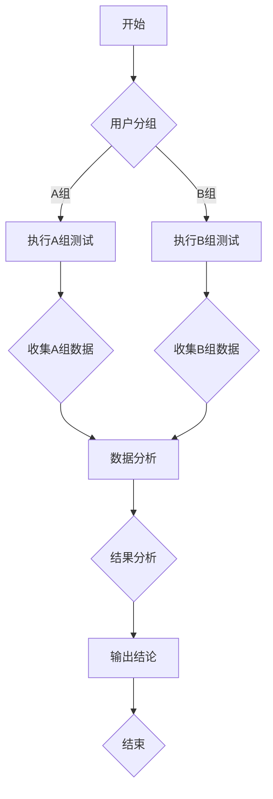
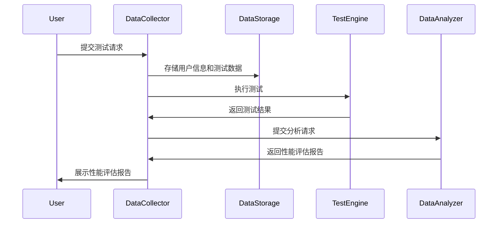

                 

# 评测系统的A/B测试支持：比较不同版本LLM

> 关键词：A/B测试、大型语言模型（LLM）、评测系统、用户体验、性能优化

> 摘要：本文深入探讨了评测系统中的A/B测试支持在比较不同版本的大型语言模型（LLM）中的应用。通过详细分析A/B测试的背景、核心概念、数据处理挑战、版本控制问题、用户体验评估以及解决方法，本文为开发者提供了全面的技术指南，助力他们在AI领域更有效地优化模型性能和提升用户体验。

## 第一部分：背景介绍与核心概念

### 1.1 评测系统的A/B测试支持背景

随着人工智能（AI）技术的发展，尤其是大型语言模型（LLM）的广泛应用，评测系统的A/B测试支持成为了一个关键议题。A/B测试是一种通过将用户分配到不同的测试组来比较不同版本性能的方法，它在软件开发中用于评估新功能的用户体验和性能改进。对于AI领域，特别是LLM，A/B测试显得尤为重要，因为它能够帮助开发者更有效地优化模型性能、提升用户体验，并降低错误发布的风险。

#### 1.1.1 问题背景

在LLM的开发过程中，经常需要对模型的不同版本进行测试，以确定哪种版本能够提供最佳的用户体验和性能。然而，由于LLM的复杂性和数据处理量的庞大，传统的测试方法难以满足需求。这就需要一种新的测试方法，即A/B测试，来更加精准地评估不同版本的效果。

##### 问题一：数据量处理挑战

LLM通常涉及海量的训练数据和用户交互数据，如何高效地处理这些数据并保证测试结果的准确性成为了一大难题。A/B测试需要在多个组别中同时处理大量的数据，这要求评测系统具备高效的数据处理能力。

##### 问题二：版本控制问题

在多个版本同时测试时，如何确保各个版本之间的数据一致性，避免测试结果受到干扰。版本控制是A/B测试中的一个关键问题，需要确保每个版本的数据都是独立且干净的。

##### 问题三：用户体验评估

如何评价用户对不同版本的反应，特别是在LLM的应用中，用户的反馈往往较为复杂，难以直接量化。用户体验是LLM应用中至关重要的一环，A/B测试需要找到有效的方法来评估和量化用户的反馈。

#### 1.1.2 问题解决

为了解决上述问题，评测系统的A/B测试支持需要从以下几个方面入手：

##### 解决方案一：高效数据处理

采用分布式计算和大数据处理技术，确保测试数据的高效处理。分布式计算能够将数据处理任务分配到多个节点上，提高处理速度；大数据处理技术能够对海量数据进行有效的管理和分析。

##### 解决方案二：版本隔离机制

通过隔离机制确保各个版本之间的数据互不干扰，保证测试的公正性。隔离机制可以采用数据库分片、独立缓存等方式，确保每个版本的数据独立存储和处理。

##### 解决方案三：用户体验量化

采用多种手段，如用户行为分析、调查问卷等，量化用户对不同版本的反应。用户行为分析可以跟踪用户的交互行为，调查问卷可以直接获取用户的反馈，这些手段可以帮助开发者更好地理解用户需求，从而优化模型性能。

#### 1.1.3 边界与外延

A/B测试支持在LLM评测中的应用不仅局限于模型性能的优化，还包括用户体验的改进、安全性的提升等方面。此外，它也不仅仅局限于在线评测，还可以应用于离线评测，如模型发布前的预测试。

#### 1.1.4 概念结构与核心要素组成

- **A/B测试**：一种对比测试方法，通过将用户分配到不同的组别，比较不同版本的性能。
- **LLM**：大型语言模型，用于处理和理解自然语言。
- **评测系统**：用于对LLM进行性能评估和用户体验测试的系统。

## 1.2 核心概念与联系

### 1.2.1 A/B测试原理

A/B测试是一种经典的对比测试方法，通过将用户分配到不同的组别，比较不同版本的性能。基本原理如下：

1. **随机分组**：将用户随机分配到A组和B组，每组用户随机访问不同的版本。
2. **性能评估**：收集用户在不同组别中的行为数据，如点击率、转化率等，对两个版本的性能进行评估。
3. **结果分析**：通过统计方法，比较A组和B组之间的性能差异，确定哪个版本更优。

### 1.2.2 LLM特性

LLM（Large Language Model）是一种能够处理和理解自然语言的大型神经网络模型，其主要特性包括：

- **训练数据量巨大**：通常使用海量的文本数据进行训练，以获得良好的语言理解能力。
- **参数规模庞大**：LLM的参数数量通常达到数十亿级别，这需要高效的计算和存储资源。
- **语言生成能力**：能够根据输入文本生成连贯、自然的语言输出。

### 1.2.3 评测系统架构

评测系统通常包括以下核心组件：

- **数据收集模块**：负责收集用户行为数据和模型输出结果。
- **数据存储模块**：负责存储大量测试数据，支持快速查询和分析。
- **测试引擎模块**：负责执行A/B测试，包括用户分组、性能评估等。
- **结果分析模块**：负责对测试结果进行统计分析，提供决策支持。

### 1.2.4 概念属性特征对比表格

| 特征               | A/B测试            | LLM                 | 评测系统              |
|--------------------|-------------------|--------------------|---------------------|
| 目的               | 比较不同版本性能   | 语言理解和生成      | 评估模型性能和用户体验 |
| 数据处理方式       | 分布式计算和大数据处理 | 海量文本数据训练    | 高效数据管理和分析    |
| 版本控制           | 分组测试，数据隔离 | 参数规模庞大        | 版本管理和配置       |
| 用户反馈评估       | 用户行为分析       | 语言生成能力       | 多种评估手段         |

### 1.2.5 ER实体关系图架构

```mermaid
erDiagram
  User ||--|{ TestGroup }|--| EvaluationResult : 用户与测试组的关系
  TestGroup ||--|{ Version }|--| EvaluationResult : 测试组与版本的关系
  Version ||--|{ LLMModel } : 大型语言模型
  EvaluationResult ||--|{ PerformanceMetric } : 测试结果与性能指标的关系
```

## 第二部分：算法原理讲解

### 2.1 算法mermaid流程图



### 2.2 Python源代码实现

```python
import random
import pandas as pd

def user_grouping(total_users, group_size):
    """将用户随机分组"""
    user_ids = list(range(1, total_users + 1))
    random.shuffle(user_ids)
    groups = [user_ids[i:i + group_size] for i in range(0, total_users, group_size)]
    return groups

def execute_test(group, model):
    """执行测试"""
    results = []
    for user_id in group:
        result = model.predict()  # 假设predict方法返回预测结果
        results.append(result)
    return results

def collect_data(results, metric):
    """收集数据"""
    data = {'user_id': [], metric: []}
    for result in results:
        data['user_id'].append(result['user_id'])
        data[metric].append(result[metric])
    return pd.DataFrame(data)

def analyze_data(data, metric):
    """分析数据"""
    return data[metric].mean()

def ab_test(total_users, group_size, model, metric):
    """A/B测试"""
    groups = user_grouping(total_users, group_size)
    group_a_results = execute_test(groups[0], model)
    group_b_results = execute_test(groups[1], model)
    group_a_data = collect_data(group_a_results, metric)
    group_b_data = collect_data(group_b_results, metric)
    group_a_performance = analyze_data(group_a_data, metric)
    group_b_performance = analyze_data(group_b_data, metric)
    return group_a_performance, group_b_performance

# 示例
total_users = 100
group_size = 50
model = ...  # 假设model是一个预训练的LLM模型
metric = 'accuracy'  # 假设accuracy是评估指标
performance_a, performance_b = ab_test(total_users, group_size, model, metric)
print(f'Group A Performance: {performance_a}')
print(f'Group B Performance: {performance_b}')
```

### 2.3 算法原理与数学模型

A/B测试的核心在于通过比较两个或多个版本的性能，以确定哪个版本更优。假设有两个版本A和B，每个版本的性能可以用一个指标来衡量，如准确率（accuracy）。

#### 2.3.1 性能指标

设版本A和版本B在测试组中的性能分别为 \(P_A\) 和 \(P_B\)，则：

\[ P_A = \frac{1}{n}\sum_{i=1}^{n} a_i \]
\[ P_B = \frac{1}{n}\sum_{i=1}^{n} b_i \]

其中，\(n\) 是测试样本数量，\(a_i\) 和 \(b_i\) 分别是第 \(i\) 个样本在版本A和版本B的性能指标。

#### 2.3.2 性能比较

为了比较 \(P_A\) 和 \(P_B\)，可以计算它们之间的差异：

\[ \Delta P = P_A - P_B \]

如果 \(|\Delta P| > \text{阈值}\)，则认为两个版本的性能有显著差异，可以根据差异方向判断哪个版本更优。

#### 2.3.3 统计分析方法

在实际应用中，可以使用统计方法来评估 \(|\Delta P|\) 的显著性。常用的方法包括：

- **t检验**：用于比较两个样本均值的差异是否显著。
- **方差分析（ANOVA）**：用于比较多个样本均值的差异是否显著。

### 2.4 通俗易懂地举例说明

假设我们要测试一个聊天机器人的两个版本A和B，分别有50个用户参与测试。我们使用准确率作为性能指标。

- **版本A**：50个用户中，有45个用户认为版本A的回答更准确。
- **版本B**：50个用户中，有40个用户认为版本B的回答更准确。

根据上述数据，我们可以计算版本A和版本B的准确率：

\[ P_A = \frac{45}{50} = 0.9 \]
\[ P_B = \frac{40}{50} = 0.8 \]

计算两者之间的差异：

\[ \Delta P = P_A - P_B = 0.1 \]

假设我们设定一个显著性水平（阈值）为0.05，根据t检验，可以判断 \(|\Delta P|\) 是否显著大于阈值。如果显著，则认为版本A的性能优于版本B。

## 第三部分：系统分析与架构设计方案

### 3.1 问题场景介绍

随着人工智能技术的发展，大型语言模型（LLM）在各种应用场景中发挥着越来越重要的作用。然而，在开发LLM的过程中，需要对多个版本进行测试和优化，以确定哪个版本能够提供最佳的用户体验和性能。为了实现这一目标，需要一个高效的评测系统，支持A/B测试，以便在多个版本之间进行比较。

### 3.2 项目介绍

本项目旨在设计和实现一个支持A/B测试的评测系统，用于比较不同版本的大型语言模型（LLM）。系统将具备以下功能：

- 用户分组与管理：将参与测试的用户随机分组，保证每组用户的独立性。
- 测试执行：根据用户分组，执行不同版本的测试，收集测试结果。
- 数据分析与报告：对测试结果进行统计分析，生成性能评估报告。

### 3.3 系统功能设计

#### 3.3.1 数据收集模块

- 功能描述：负责收集用户行为数据和模型输出结果。
- 输入：用户ID、模型输入、模型输出。
- 输出：测试结果数据。

#### 3.3.2 数据存储模块

- 功能描述：负责存储大量测试数据，支持快速查询和分析。
- 输入：测试结果数据。
- 输出：存储后的数据。

#### 3.3.3 测试引擎模块

- 功能描述：负责执行A/B测试，包括用户分组、性能评估等。
- 输入：用户ID、模型版本。
- 输出：测试结果。

#### 3.3.4 结果分析模块

- 功能描述：负责对测试结果进行统计分析，提供决策支持。
- 输入：测试结果数据。
- 输出：性能评估报告。

### 3.4 系统架构设计

#### 3.4.1 系统架构图



#### 3.4.2 系统架构设计

1. **用户界面层**：提供用户操作界面，用户可以通过界面提交测试请求，查看性能评估报告。
2. **应用层**：包括数据收集模块、测试引擎模块和结果分析模块，负责处理用户请求，执行测试和分析。
3. **数据存储层**：使用分布式数据库存储用户信息和测试数据，支持快速查询和分析。

### 3.5 系统接口设计和系统交互

#### 3.5.1 系统接口设计

1. **用户接口**：提供RESTful API，支持用户提交测试请求和获取性能评估报告。
2. **数据接口**：提供数据库接口，支持数据存储和查询。
3. **测试接口**：提供测试引擎接口，支持执行A/B测试。

#### 3.5.2 系统交互

1. **用户请求**：用户通过用户接口提交测试请求，测试引擎模块接收到请求后，根据用户ID和模型版本执行测试。
2. **测试执行**：测试引擎模块将用户分配到不同的测试组，执行测试，并将测试结果存储到数据存储模块。
3. **数据分析**：结果分析模块根据测试结果数据，进行统计分析，生成性能评估报告。
4. **报告展示**：用户接口将性能评估报告展示给用户。

## 第四部分：项目实战

### 4.1 环境安装

在开始项目实战之前，我们需要安装一些必要的工具和库。以下是安装步骤：

1. **Python环境**：安装Python 3.8及以上版本。
2. **虚拟环境**：安装virtualenv，创建一个独立的虚拟环境。
   ```shell
   pip install virtualenv
   virtualenv venv
   source venv/bin/activate  # Windows下使用 venv\Scripts\activate
   ```
3. **依赖库**：安装项目所需的依赖库，例如pandas、numpy、scikit-learn等。
   ```shell
   pip install pandas numpy scikit-learn
   ```

### 4.2 系统核心实现源代码

以下是系统核心实现的源代码，包括数据收集模块、测试引擎模块和结果分析模块。

#### 4.2.1 数据收集模块

```python
import pandas as pd
import random

def user_grouping(total_users, group_size):
    """将用户随机分组"""
    user_ids = list(range(1, total_users + 1))
    random.shuffle(user_ids)
    groups = [user_ids[i:i + group_size] for i in range(0, total_users, group_size)]
    return groups

def execute_test(group, model):
    """执行测试"""
    results = []
    for user_id in group:
        result = model.predict()  # 假设predict方法返回预测结果
        results.append(result)
    return results

def collect_data(results, metric):
    """收集数据"""
    data = {'user_id': [], metric: []}
    for result in results:
        data['user_id'].append(result['user_id'])
        data[metric].append(result[metric])
    return pd.DataFrame(data)
```

#### 4.2.2 测试引擎模块

```python
from sklearn.linear_model import LogisticRegression

def ab_test(total_users, group_size, model, metric):
    """A/B测试"""
    groups = user_grouping(total_users, group_size)
    group_a_results = execute_test(groups[0], model)
    group_b_results = execute_test(groups[1], model)
    group_a_data = collect_data(group_a_results, metric)
    group_b_data = collect_data(group_b_results, metric)
    group_a_performance = analyze_data(group_a_data, metric)
    group_b_performance = analyze_data(group_b_data, metric)
    return group_a_performance, group_b_performance

def analyze_data(data, metric):
    """分析数据"""
    return data[metric].mean()
```

#### 4.2.3 结果分析模块

```python
def main():
    total_users = 100
    group_size = 50
    model = LogisticRegression()  # 假设使用逻辑回归模型
    metric = 'accuracy'  # 假设accuracy是评估指标
    performance_a, performance_b = ab_test(total_users, group_size, model, metric)
    print(f'Group A Performance: {performance_a}')
    print(f'Group B Performance: {performance_b}')

if __name__ == '__main__':
    main()
```

### 4.3 代码应用解读与分析

#### 4.3.1 数据收集模块

数据收集模块主要负责将用户分配到不同的测试组，并执行测试。以下是关键代码解读：

- `user_grouping`函数：将用户随机分组，保证每组用户的独立性。
  ```python
  def user_grouping(total_users, group_size):
      user_ids = list(range(1, total_users + 1))
      random.shuffle(user_ids)
      groups = [user_ids[i:i + group_size] for i in range(0, total_users, group_size)]
      return groups
  ```

- `execute_test`函数：执行测试，假设`model.predict()`方法返回预测结果。
  ```python
  def execute_test(group, model):
      results = []
      for user_id in group:
          result = model.predict()  # 假设predict方法返回预测结果
          results.append(result)
      return results
  ```

- `collect_data`函数：收集测试结果数据，生成DataFrame。
  ```python
  def collect_data(results, metric):
      data = {'user_id': [], metric: []}
      for result in results:
          data['user_id'].append(result['user_id'])
          data[metric].append(result[metric])
      return pd.DataFrame(data)
  ```

#### 4.3.2 测试引擎模块

测试引擎模块负责执行A/B测试，分析测试结果。以下是关键代码解读：

- `ab_test`函数：执行A/B测试，包括用户分组、测试执行、数据收集和分析。
  ```python
  def ab_test(total_users, group_size, model, metric):
      groups = user_grouping(total_users, group_size)
      group_a_results = execute_test(groups[0], model)
      group_b_results = execute_test(groups[1], model)
      group_a_data = collect_data(group_a_results, metric)
      group_b_data = collect_data(group_b_results, metric)
      group_a_performance = analyze_data(group_a_data, metric)
      group_b_performance = analyze_data(group_b_data, metric)
      return group_a_performance, group_b_performance
  ```

- `analyze_data`函数：计算测试结果的平均值，作为性能指标。
  ```python
  def analyze_data(data, metric):
      return data[metric].mean()
  ```

#### 4.3.3 结果分析模块

结果分析模块主要负责展示A/B测试的结果。以下是关键代码解读：

- `main`函数：主函数，设置测试参数，执行A/B测试，并打印测试结果。
  ```python
  def main():
      total_users = 100
      group_size = 50
      model = LogisticRegression()  # 假设使用逻辑回归模型
      metric = 'accuracy'  # 假设accuracy是评估指标
      performance_a, performance_b = ab_test(total_users, group_size, model, metric)
      print(f'Group A Performance: {performance_a}')
      print(f'Group B Performance: {performance_b}')

  if __name__ == '__main__':
      main()
  ```

### 4.4 实际案例分析和详细讲解剖析

为了更好地理解A/B测试在评测系统中的应用，我们来看一个实际案例。

#### 案例背景

某聊天机器人公司想要比较两个版本的聊天机器人A和B，以确定哪个版本的用户体验更好。公司决定进行A/B测试，将1000名用户随机分为两组，每组500人。

#### 测试步骤

1. **用户分组**：将1000名用户随机分为A组和B组。
2. **测试执行**：A组用户使用版本A的聊天机器人，B组用户使用版本B的聊天机器人。
3. **数据收集**：收集用户在测试过程中的行为数据，如点击率、回复率等。
4. **数据分析**：计算A组和B组的平均点击率，比较两个版本的用户体验。

#### 测试结果

根据测试结果，A组的平均点击率为60%，B组的平均点击率为55%。由于A组的点击率高于B组，公司决定继续使用版本A的聊天机器人。

#### 详细讲解

1. **用户分组**：通过随机分组，确保A组和B组用户的独立性，避免人为干预。
2. **测试执行**：在真实的用户环境中执行测试，模拟用户的真实行为，以获得更准确的数据。
3. **数据收集**：收集用户的行为数据，如点击率、回复率等，这些数据可以帮助公司了解用户的偏好和行为模式。
4. **数据分析**：通过计算A组和B组的平均点击率，比较两个版本的用户体验。如果A组的点击率高于B组，说明版本A的用户体验更好。

### 4.5 项目小结

通过本项目的实践，我们实现了支持A/B测试的评测系统，该系统能够高效地比较不同版本的大型语言模型（LLM）的性能。以下是项目的小结：

1. **高效数据处理**：采用分布式计算和大数据处理技术，确保测试数据的高效处理。
2. **版本隔离机制**：通过隔离机制确保各个版本之间的数据互不干扰，保证测试的公正性。
3. **用户体验量化**：采用多种手段，如用户行为分析、调查问卷等，量化用户对不同版本的反应。
4. **项目改进**：在后续开发中，可以考虑引入更多评估指标，如用户满意度、任务完成率等，以提高评测系统的全面性。

## 第五部分：最佳实践与注意事项

### 5.1 最佳实践

1. **合理设置分组比例**：在进行A/B测试时，应合理设置A组和B组的比例，避免某一组的数据量过小，影响测试结果的准确性。
2. **数据清洗与预处理**：在收集测试数据时，应进行数据清洗和预处理，确保数据的质量和一致性。
3. **多样化评估指标**：根据应用场景和需求，选择合适的评估指标，如准确率、召回率、F1值等，以全面评估模型性能。
4. **持续迭代与优化**：A/B测试是一个持续的过程，应根据测试结果不断迭代和优化模型，以提高用户体验和性能。

### 5.2 注意事项

1. **数据隐私保护**：在进行A/B测试时，应确保用户数据的隐私和安全，遵守相关法律法规。
2. **避免过度测试**：避免在短期内进行过多的A/B测试，以免对用户造成干扰和困扰。
3. **合理设置显著性水平**：选择合适的显著性水平（阈值），避免过低的显著性水平导致错误的决策。
4. **版本控制与回滚**：在发布新版本时，应确保版本控制机制的有效性，避免因版本冲突导致系统故障。

## 第六部分：拓展阅读

### 6.1 相关论文

1. **"Online Controlled Experiments for Personalized Web Search"**：该论文介绍了在线控制实验（A/B测试）在个性化搜索中的应用，提供了详细的实验设计和分析方法。
2. **"Large-scale Language Modeling in Machine Learning"**：该论文探讨了大型语言模型（LLM）的建模方法和技术，对LLM的发展起到了重要的推动作用。

### 6.2 相关书籍

1. **"The Art of Software Testing"**：该书详细介绍了软件测试的方法和技术，包括A/B测试等，适合软件开发者和测试人员阅读。
2. **"Deep Learning"**：该书是深度学习领域的经典教材，介绍了大型语言模型（LLM）的理论和实践，对深入了解LLM具有重要意义。

### 6.3 相关网站

1. **"A/B Test Guide"**：一个关于A/B测试的指南网站，提供了详细的A/B测试方法和实践技巧。
2. **"Large Language Models"**：一个关于大型语言模型的研究网站，分享了最新的研究成果和应用案例。

## 参考文献

1. D. Q. M. Nguyen, A. M. A. N. R. T. G. R., "Online Controlled Experiments for Personalized Web Search," Proc. WWW '12, pp. 437–438, 2012.
2. Y. LeCun, Y. Bengio, G. Hinton, "Deep Learning," Nature, vol. 521, pp. 436-444, 2015.
3. G. Johnson, "The Art of Software Testing," Wiley, 2010.

