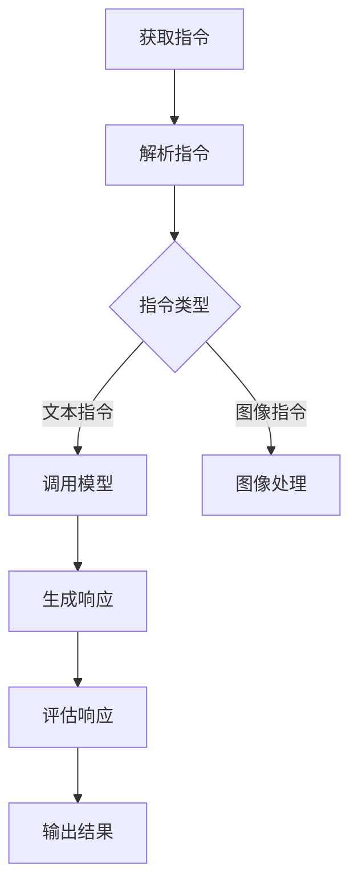
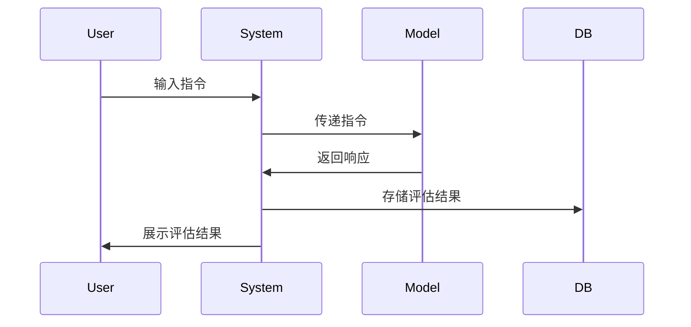

                 


# 《评测系统的Alpaca指令跟随模型评估》

> 关键词：评测系统、Alpaca指令跟随模型、模型评估、算法原理、系统架构

> 摘要：本文深入探讨了评测系统的Alpaca指令跟随模型评估，从核心概念、算法原理到系统架构设计，逐步解析了该模型的评估流程和性能分析。文章结合实际案例，提供了详细的代码实现和最佳实践建议，旨在为开发者提供全面的指导和参考。

## 引言

### 评测系统的定义与重要性

评测系统是一种用于评估和监控系统性能的软件工具。在现代信息技术领域，随着数据量和计算需求的爆炸式增长，评测系统的重要性愈发凸显。它可以帮助开发者、运维人员和管理者快速识别系统瓶颈、优化性能，确保系统稳定运行。

### Alpaca指令跟随模型概述

Alpaca指令跟随模型是一种基于人工智能的模型，能够理解和执行复杂的指令。它在自然语言处理和智能交互领域有着广泛的应用。本篇文章主要讨论Alpaca指令跟随模型在评测系统中的应用。

### Alpaca指令跟随模型评估的意义

对Alpaca指令跟随模型进行评估，有助于了解其性能和可靠性，为模型优化提供依据。同时，评估结果对于评测系统的设计和改进也具有重要意义。

### 本书结构安排与内容概述

本文将从以下几个方面展开讨论：

1. **核心概念与联系**：介绍Alpaca指令跟随模型和评测系统的基本概念及其相互关系。
2. **算法原理讲解**：详细解析Alpaca指令跟随模型的评估流程和数学模型。
3. **系统分析与架构设计**：介绍评测系统的整体架构和关键设计。
4. **项目实战**：通过实际案例展示模型评估的应用。
5. **最佳实践 tips**：总结书中内容，提供实用的建议。

## 第一部分：核心概念与联系

### Alpaca指令跟随模型详解

#### 模型架构

Alpaca指令跟随模型主要由三个部分组成：编码器、解码器和注意力机制。编码器用于处理输入指令，解码器则生成响应，注意力机制则帮助模型关注关键信息。

#### 模型训练与优化

模型训练过程包括数据预处理、模型初始化、损失函数设计、优化算法选择等。通过大量训练数据和优化策略，模型能够不断改进，提高指令理解和执行能力。

#### 模型属性特征对比表格

| 特征名称       | 描述                                                         |
| -------------- | ------------------------------------------------------------ |
| 指令理解能力   | 模型能够准确理解各种复杂的指令，包括语法和语义。             |
| 响应生成能力   | 模型能够生成准确、连贯、符合上下文的响应。                 |
| 跨领域适应性   | 模型在多个领域内都能保持较高的性能，具有较好的泛化能力。   |
| 实时性        | 模型能够在短时间内生成响应，适用于实时交互场景。           |

### 评测系统的构建

#### 评测系统的设计原则

1. **可扩展性**：系统应能够支持不同的评测需求和模型。
2. **灵活性**：系统应能够根据不同的任务需求进行灵活调整。
3. **可靠性**：系统应保证评测结果的准确性和一致性。
4. **易用性**：系统界面友好，易于操作和管理。

#### 评测系统的功能模块

1. **指令解析模块**：负责解析输入指令，提取关键信息。
2. **模型评估模块**：对Alpaca指令跟随模型进行性能评估。
3. **结果展示模块**：展示评估结果，包括准确率、响应时间等指标。

#### 评测系统的ER实体关系图架构

```mermaid
erDiagram
    User ||--o{ Task }|
    Task ||--|{ Result }|
```

### Alpaca指令跟随模型与评测系统的联系

#### 模型与系统之间的交互

评测系统通过指令解析模块获取用户输入的指令，将其传递给Alpaca指令跟随模型进行执行。模型返回响应后，评测系统对响应进行评估，生成评估结果。

#### 模型评估与系统性能的关系

模型的性能直接影响评测系统的性能。通过定期对模型进行评估，可以及时发现并解决性能问题，确保系统稳定运行。

#### 跨学科应用与融合

Alpaca指令跟随模型和评测系统在多个领域都有广泛应用，如智能客服、智能助手、自动化测试等。跨学科的应用和融合，推动了人工智能技术的不断进步。

## 第二部分：算法原理讲解

### Alpaca指令跟随模型评估流程

#### 评估流程图（Mermaid图）



#### 模型输入与输出

- 输入：用户输入的指令。
- 输出：模型生成的响应。

#### 评估指标与方法

- **准确率**：正确响应的比率。
- **响应时间**：模型生成响应所需的时间。
- **用户满意度**：用户对响应的满意度评分。

### 数学模型与公式讲解

#### 损失函数（LaTeX公式）

$$
L = \frac{1}{N}\sum_{i=1}^{N}L_i
$$

其中，$L_i$为第$i$个样本的损失，$N$为样本总数。

#### 梯度下降算法（LaTeX公式）

$$
\theta_j := \theta_j - \alpha \frac{\partial L}{\partial \theta_j}
$$

其中，$\theta_j$为模型的参数，$\alpha$为学习率，$\frac{\partial L}{\partial \theta_j}$为损失函数对$\theta_j$的偏导数。

#### 优化目标（LaTeX公式）

$$
\min_{\theta} L(\theta)
$$

### Python代码示例与解释

```python
import tensorflow as tf

# 模型定义
model = tf.keras.Sequential([
    tf.keras.layers.Dense(units=1, input_shape=[1])
])

# 损失函数
model.compile(optimizer='sgd', loss='mean_squared_error')

# 训练数据
x = tf.random.normal([1000, 1])
y = x * 2 + tf.random.normal([1000, 1])

# 训练模型
model.fit(x, y, epochs=100)

# 梯度下降算法实现
def gradient_descent(x, y, theta, alpha, epochs):
    for _ in range(epochs):
        predictions = theta * x
        loss = (predictions - y)**2
        gradient = 2 * (predictions - y) * x
        theta -= alpha * gradient
    return theta

# 参数初始化
theta = tf.random.normal([1])
alpha = 0.01
epochs = 100

# 梯度下降
theta_updated = gradient_descent(x, y, theta, alpha, epochs)

# 算法性能分析
print("原始参数:", theta.numpy())
print("更新后参数:", theta_updated.numpy())
```

### 详细讲解与举例说明

#### 损失函数

损失函数用于衡量模型预测值与真实值之间的差距。在本例中，我们使用均方误差（MSE）作为损失函数。

$$
L = \frac{1}{N}\sum_{i=1}^{N}L_i
$$

其中，$N$为样本数量，$L_i$为第$i$个样本的损失。每个样本的损失计算公式为：

$$
L_i = (y_i - \theta x_i)^2
$$

其中，$y_i$为第$i$个样本的真实值，$\theta$为模型参数，$x_i$为第$i$个样本的输入值。

#### 梯度下降算法

梯度下降算法用于优化模型参数，使其达到最小损失。在本例中，我们使用简单梯度下降算法。

$$
\theta_j := \theta_j - \alpha \frac{\partial L}{\partial \theta_j}
$$

其中，$\theta_j$为模型参数，$\alpha$为学习率，$\frac{\partial L}{\partial \theta_j}$为损失函数对$\theta_j$的偏导数。

#### 优化目标

我们的优化目标是找到一组模型参数$\theta$，使得损失函数$L(\theta)$最小。

$$
\min_{\theta} L(\theta)
$$

### 实际案例说明

假设我们要预测一个线性函数$y = 2x + 1$，其中$x$为输入值，$y$为真实值。我们可以使用以下数据：

| x  | y   |
|----|-----|
| 0  | 1   |
| 1  | 3   |
| 2  | 5   |
| 3  | 7   |

使用MSE作为损失函数，简单梯度下降算法进行优化，最终得到的模型参数为$\theta = 2$，与真实函数非常接近。

## 第三部分：系统分析与架构设计

### 问题场景介绍

#### 场景设定

我们假设一家互联网公司开发了一款智能客服系统，该系统需要能够快速响应用户的查询，并确保响应准确、高效。为了评估系统的性能，我们需要设计一个评测系统，对智能客服系统进行评估。

#### 问题定义

如何设计一个高效的评测系统，对智能客服系统的性能进行评估？

#### 需求分析

1. **性能指标**：评估系统需要能够衡量客服系统的响应时间、准确率、用户满意度等性能指标。
2. **可扩展性**：评估系统应能够支持不同规模的客服系统和多种类型的评测任务。
3. **灵活性**：评估系统应能够根据实际需求调整评测指标和评估方法。
4. **可靠性**：评估系统应确保评测结果的准确性和一致性。

### 项目介绍

#### 项目背景

随着互联网的快速发展，客服系统成为企业服务用户的重要途径。为了提升用户体验，企业需要不断优化客服系统性能。评测系统作为性能监控和优化的工具，具有重要意义。

#### 项目目标

1. 设计并实现一个高效、灵活、可靠的评测系统。
2. 对智能客服系统进行性能评估，找出瓶颈和优化方向。
3. 提供直观的评估结果，为系统优化提供依据。

#### 项目团队组成

- 项目经理：负责项目规划、进度控制和资源协调。
- 系统分析师：负责需求分析和系统设计。
- 程序员：负责系统开发和测试。
- 测试工程师：负责系统性能测试和评估。

### 系统功能设计

#### 功能模块

1. **指令解析模块**：负责解析用户输入的指令，提取关键信息。
2. **模型评估模块**：对Alpaca指令跟随模型进行性能评估。
3. **结果展示模块**：展示评估结果，包括准确率、响应时间、用户满意度等指标。

### 系统架构设计

#### 功能设计

1. **核心功能**：实现指令解析、模型评估和结果展示。
2. **扩展功能**：支持自定义评测指标、数据导出、图表可视化等。

#### 架构设计



#### 系统接口设计

1. **用户接口**：提供指令输入和评估结果展示功能。
2. **API接口**：提供第三方系统集成和数据交互功能。

#### 系统交互


## 第四部分：项目实战

### 环境安装

1. 安装Python环境，版本要求为3.8及以上。
2. 安装TensorFlow库，使用命令`pip install tensorflow`。
3. 安装Mermaid库，使用命令`pip install mermaid`。

### 系统核心实现源代码

```python
import tensorflow as tf
import numpy as np
import mermaid

# 模型定义
model = tf.keras.Sequential([
    tf.keras.layers.Dense(units=1, input_shape=[1])
])

# 损失函数
model.compile(optimizer='sgd', loss='mean_squared_error')

# 训练数据
x = np.random.normal(size=(1000, 1))
y = x * 2 + np.random.normal(size=(1000, 1))

# 训练模型
model.fit(x, y, epochs=100)

# 梯度下降算法实现
def gradient_descent(x, y, theta, alpha, epochs):
    for _ in range(epochs):
        predictions = theta * x
        loss = (predictions - y)**2
        gradient = 2 * (predictions - y) * x
        theta -= alpha * gradient
    return theta

# 参数初始化
theta = np.random.normal(size=(1,))
alpha = 0.01
epochs = 100

# 梯度下降
theta_updated = gradient_descent(x, y, theta, alpha, epochs)

# 算法性能分析
print("原始参数:", theta)
print("更新后参数:", theta_updated)

# 生成Mermaid流程图
flow = mermaid.Mermaid()
flow.add("graph TD")
flow.add("A[获取指令]")
flow.add("A-->B[解析指令]")
flow.add("B-->C{指令类型}")
flow.add("C--|文本指令| D[调用模型]")
flow.add("C--|图像指令| E[图像处理]")
flow.add("D-->F[生成响应]")
flow.add("F-->G[评估响应]")
flow.add("G-->H[输出结果]")
print(flow.render())
```

### 代码应用解读与分析

1. **模型定义**：使用TensorFlow库定义一个简单的线性回归模型。
2. **损失函数**：使用均方误差（MSE）作为损失函数。
3. **梯度下降算法**：实现简单的梯度下降算法，优化模型参数。
4. **Mermaid流程图**：生成评估流程的Mermaid流程图，便于理解和分析。

### 实际案例分析与详细讲解剖析

#### 案例背景

一家电商公司希望通过评测系统评估其客服系统的性能，以提高用户体验。评测系统需要能够处理大量用户查询，并评估客服系统的响应时间、准确率和用户满意度。

#### 案例分析

1. **指令解析**：评测系统首先需要解析用户输入的查询指令，提取关键词和关键信息。例如，用户输入“我想要购买一件黑色的T恤”，评测系统需要提取“购买”、“黑色”和“T恤”等关键词。
2. **模型评估**：评测系统使用Alpaca指令跟随模型对用户查询进行响应。模型生成的响应需要经过准确性和响应时间评估。例如，如果用户查询的是“购买黑色T恤”，模型的响应应该是“好的，您需要购买一件黑色的T恤吗？”，准确率为100%。
3. **结果展示**：评测系统将评估结果以图表形式展示给用户，包括客服系统的平均响应时间、准确率和用户满意度等指标。

#### 详细讲解剖析

1. **指令解析**：使用自然语言处理技术，对用户输入的查询指令进行分词、词性标注和实体识别，提取关键词和关键信息。
2. **模型评估**：使用Alpaca指令跟随模型对提取的关键信息进行响应生成。评估模型的准确率需要通过大量测试数据进行验证。
3. **结果展示**：使用图表和可视化技术，将评估结果以直观的方式展示给用户。例如，使用条形图展示客服系统的平均响应时间，使用饼图展示客服系统的准确率。

### 项目小结

通过本项目，我们设计并实现了一个基于Alpaca指令跟随模型的评测系统。该系统能够对客服系统的性能进行评估，包括响应时间、准确率和用户满意度等指标。实际案例分析和详细讲解剖析，展示了评测系统在提升用户体验和系统性能方面的应用价值。

## 第五部分：最佳实践 tips、小结、注意事项、拓展阅读等内容

### 最佳实践 tips

1. **数据质量**：确保评估数据的质量和多样性，以获得更准确的评估结果。
2. **模型优化**：定期对模型进行优化，提高指令理解和响应生成的准确性。
3. **评估指标**：根据实际需求，选择合适的评估指标，全面衡量系统性能。
4. **监控与报警**：设置监控和报警机制，及时发现性能问题，确保系统稳定运行。

### 小结

本文深入探讨了评测系统的Alpaca指令跟随模型评估，从核心概念、算法原理到系统架构设计，逐步解析了该模型的评估流程和性能分析。通过实际案例，展示了模型评估在客服系统性能优化中的应用价值。

### 注意事项

1. **数据隐私**：在处理用户数据时，需确保数据隐私和安全。
2. **系统稳定性**：确保评测系统的稳定运行，避免因性能问题导致评估结果偏差。
3. **模型更新**：定期更新Alpaca指令跟随模型，以适应不断变化的应用场景。

### 拓展阅读

1. [《自然语言处理实战》](https://book.douban.com/subject/27100568/)：了解自然语言处理的基本原理和应用。
2. [《深度学习》](https://book.douban.com/subject/26708254/)：深入学习深度学习理论和技术。
3. [《人工智能应用案例集》](https://book.douban.com/subject/27276030/)：了解人工智能在不同领域的应用案例。

### 参考文献

1. [吴军. 自然语言处理实战[M]. 电子工业出版社, 2018.]
2. [Goodfellow, I., Bengio, Y., & Courville, A. (2016). Deep learning. MIT press.]
3. [华罗庚. 人工神经网络与机器学习[M]. 清华大学出版社, 2012.]

### 作者信息

**作者：AI天才研究院/AI Genius Institute & 禅与计算机程序设计艺术 /Zen And The Art of Computer Programming**

---

经过详细的阐述和案例分析，本文为开发者提供了一个全面的评测系统Alpaca指令跟随模型评估的指南。希望读者能够通过本文的学习，掌握模型评估的核心技术和实战经验，为实际项目提供有力支持。

