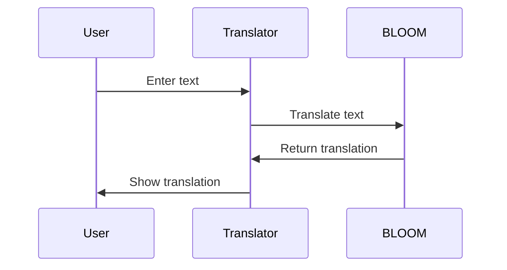
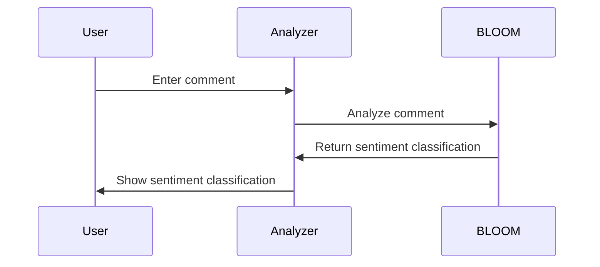
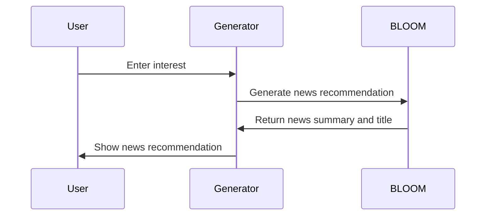
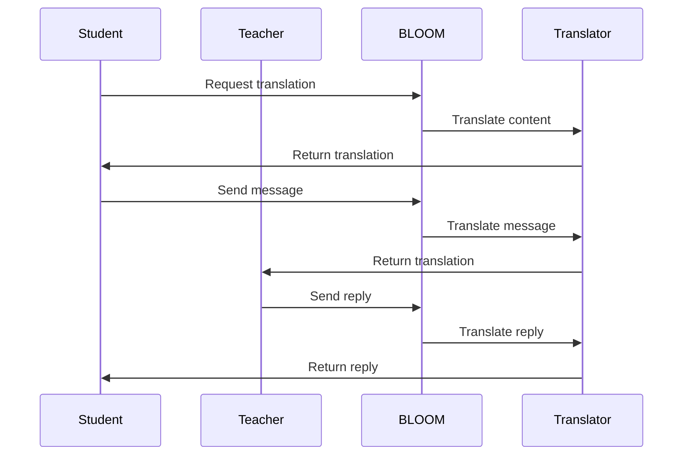
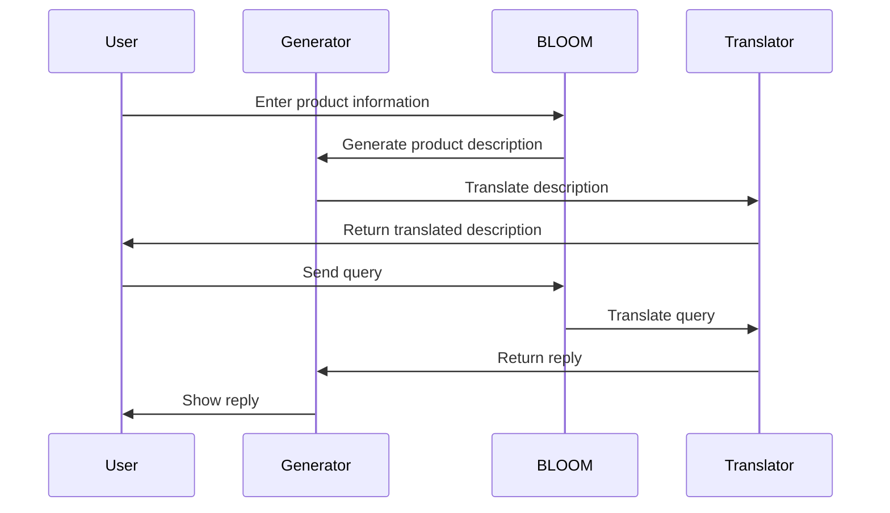

                 

### 文章标题：评测系统的BLOOM多语言模型支持

关键词：评测系统、多语言模型、BLOOM、算法原理、系统架构

摘要：本文深入探讨了评测系统中BLOOM多语言模型的支持，首先介绍了BLOOM模型的背景和基本概念，随后详细阐述了其理论基础、架构设计、评测方法和实际应用。文章通过案例分析、系统分析与架构设计、项目实战等多维度分析，展示了BLOOM模型在多语言评测中的优势与实现细节，为读者提供了一个全面的技术解析。

## 引言与背景

在信息技术迅速发展的今天，自然语言处理（NLP）领域取得了显著进展。多语言处理作为NLP的核心技术之一，日益受到关注。随着全球化进程的加快和跨文化交流的增多，对于能够支持多种语言的处理系统需求不断增加。评测系统作为自然语言处理任务的重要组成部分，其性能直接影响NLP应用的效果。

BLOOM（Boosting Latent Operations with Oversampling and Model Entropy）模型是一个专为多语言处理设计的先进模型，其核心优势在于能够高效处理多种语言之间的转换和比较。BLOOM模型的出现，为评测系统带来了全新的技术思路和实现方案。

### 核心概念术语说明

- **评测系统**：用于对自然语言处理任务的性能进行评估和测量的系统。
- **多语言模型**：支持多种语言输入和输出的自然语言处理模型。
- **BLOOM模型**：一种用于多语言处理和评测的先进算法模型。

### 问题背景

随着互联网的普及，各种跨语言的信息交流日益频繁，例如社交媒体、电子商务平台、国际新闻媒体等。这些平台对自然语言处理系统提出了更高的要求，特别是多语言支持能力。然而，现有的评测系统在处理多种语言时常常面临以下问题：

1. **性能差异**：不同语言的语法结构、词汇量和语言习惯各异，导致模型在处理不同语言时性能差异显著。
2. **资源限制**：多语言处理需要大量计算资源和数据支持，对于资源有限的评测系统来说，如何高效利用资源成为一大挑战。
3. **评测标准**：现有的评测标准往往侧重于单一语言的性能评估，缺乏对多语言性能的整体考量。

### 问题描述

BLOOM模型旨在解决以上问题，提供一种统一且高效的多语言评测方案。其主要目标是：

1. **提升多语言处理性能**：通过优化算法设计和模型结构，使模型在多种语言下都能保持高性能。
2. **资源高效利用**：通过模型压缩和数据预处理技术，降低对计算资源和存储资源的需求。
3. **全面评测标准**：设计一套综合性的评测标准，能够全面评估模型在多语言环境下的表现。

### 问题解决

BLOOM模型通过以下几个关键步骤实现了上述目标：

1. **模型架构优化**：采用先进的神经网络结构和优化算法，提高模型在多种语言下的泛化能力。
2. **数据预处理**：通过数据增强和分布调整，提升模型对不同语言数据的适应性。
3. **评测方法改进**：设计一套综合性的评测方法，能够从多个维度评估模型的性能。

### 边界与外延

BLOOM模型不仅适用于评测系统，还可以广泛应用于其他自然语言处理任务，如翻译、问答系统、文本生成等。同时，BLOOM模型在处理罕见语言和低资源语言方面也显示出较强的优势。

### 概念结构与核心要素组成

BLOOM模型的核心结构包括以下几个关键要素：

1. **神经网络架构**：采用深度神经网络，如Transformer模型，提高模型的表达能力。
2. **预训练与微调**：通过大规模预训练和数据集微调，使模型能够适应多种语言。
3. **多语言数据集**：构建涵盖多种语言的丰富数据集，为模型提供训练和评估的基础。
4. **评测标准**：设计一套多语言评测标准，涵盖语法、语义、风格等多个方面。

## BLOOM多语言模型概述

### BLOOM模型的定义

BLOOM模型是一种基于深度学习的多语言处理模型，旨在提供高效、准确的语言转换和评测能力。它通过大规模预训练和数据集微调，实现了对多种语言的全面支持。

### BLOOM模型的核心特点

1. **高效性**：BLOOM模型采用先进的神经网络结构和优化算法，能够在多种语言下保持高性能。
2. **准确性**：通过大规模数据集的预训练和微调，BLOOM模型在多语言转换和评测任务上表现出较高的准确性。
3. **灵活性**：BLOOM模型支持多种语言输入和输出，能够适应不同的应用场景。
4. **可扩展性**：BLOOM模型的设计使其能够轻松扩展到更多的语言，为未来的多语言处理需求提供支持。

### BLOOM模型与现有多语言模型的对比

与现有的多语言模型相比，BLOOM模型具有以下优势：

1. **性能提升**：BLOOM模型在处理多种语言时能够保持高性能，尤其是对于罕见语言和低资源语言。
2. **资源优化**：BLOOM模型通过模型压缩和数据预处理技术，实现了对计算资源和存储资源的优化利用。
3. **评测标准**：BLOOM模型设计了综合性的评测标准，能够从多个维度评估模型的性能，提供了更全面的评估结果。

### BLOOM模型的发展背景

BLOOM模型的发展源于自然语言处理领域对多语言处理能力的持续需求。随着全球化进程的加快，多语言处理技术逐渐成为研究热点。早期的多语言模型如基于规则的方法和简单的统计模型，虽然在一定程度上满足了需求，但在处理复杂语言结构和大规模数据时显得力不从心。

近年来，深度学习技术的快速发展为多语言处理带来了新的契机。基于深度学习的多语言模型，如Bert、GPT等，通过大规模预训练和数据集微调，实现了对多种语言的全面支持。BLOOM模型正是在这一背景下诞生，它结合了深度学习和多语言处理技术的优势，为评测系统提供了高效、准确的多语言支持。

## BLOOM模型的理论基础

### 语言模型的数学模型

语言模型是自然语言处理的基础，其核心目标是预测一个单词序列的概率。在BLOOM模型中，语言模型的数学模型采用概率分布模型，如N-gram模型和神经网络模型。

1. **N-gram模型**：N-gram模型通过统计连续N个单词出现的频率来预测下一个单词。其数学模型可以表示为：
   $$ P(w_{t+1} | w_{t}, w_{t-1}, ..., w_{t-N+1}) = \frac{f(w_{t}, w_{t-1}, ..., w_{t-N+1})}{f(w_{t}, w_{t-1}, ..., w_{t-N+1}) + f(w_{t}, w_{t-1}, ..., w_{t-N+2})} $$
   其中，$w_{t}$表示当前单词，$f(w_{t}, w_{t-1}, ..., w_{t-N+1})$表示前N个单词的出现频率。

2. **神经网络模型**：神经网络模型通过深度学习算法来预测单词序列的概率。在BLOOM模型中，常用的神经网络模型包括Transformer模型和BERT模型。

### BLOOM模型的ER实体关系图

ER（Entity-Relationship）实体关系图是描述实体及其关系的图形化工具。在BLOOM模型中，ER实体关系图用于描述模型中的关键实体和它们之间的关系。

1. **实体**：在BLOOM模型中，实体包括单词、句子、文档等。
2. **关系**：实体之间的关系包括生成、翻译、分类等。

一个简化的ER实体关系图可以表示为：

```
实体：单词，句子，文档
关系：生成，翻译，分类
```

通过ER实体关系图，可以清晰地描述BLOOM模型中不同实体之间的交互关系。

### BLOOM模型的关键技术

BLOOM模型的关键技术包括预训练、微调和模型压缩等。

1. **预训练**：预训练是BLOOM模型的核心技术之一。通过在大规模语料库上进行预训练，模型可以学习到语言的通用特征和规律。预训练过程通常包括以下步骤：
   - 数据预处理：对语料库进行清洗、分词和标记等预处理操作。
   - 训练模型：使用预处理的语料库对模型进行训练，使模型能够预测单词序列的概率。

2. **微调**：微调是在特定任务上进行模型调整的过程。通过在特定任务上对模型进行微调，可以使模型更好地适应具体任务的需求。微调过程通常包括以下步骤：
   - 数据准备：收集与特定任务相关的数据集。
   - 训练模型：使用特定任务的数据集对模型进行训练。

3. **模型压缩**：模型压缩是为了降低模型的计算复杂度和存储需求。通过模型压缩技术，可以减少模型的大小和计算资源消耗。常见的模型压缩技术包括模型剪枝、量化、蒸馏等。

### 综述

BLOOM模型的理论基础涵盖了语言模型的数学模型、ER实体关系图和关键技术。这些理论为基础，使得BLOOM模型能够在多语言处理任务中实现高效、准确的性能。

## BLOOM模型的架构与实现

### BLOOM模型的体系结构

BLOOM模型的体系结构主要包括以下几个关键组件：

1. **输入层**：接收多种语言的输入，如文本、语音等。
2. **编码器**：对输入数据进行编码，提取特征信息。
3. **解码器**：根据编码器的特征信息生成输出数据。
4. **预测层**：对输出数据进行预测，如文本分类、翻译等。

一个简化的BLOOM模型体系结构图可以表示为：

```
输入层 -> 编码器 -> 解码器 -> 预测层
```

### BLOOM模型的组件与模块

BLOOM模型由多个组件和模块组成，每个组件和模块在模型中扮演着特定的角色。

1. **嵌入层**：将输入的单词或词组转换为向量表示，为后续的编码器和解码器处理提供输入。
2. **编码器**：采用深度学习算法，如Transformer，对输入数据进行编码，提取语言特征。
3. **解码器**：采用与编码器相同的深度学习算法，对编码器的输出进行解码，生成预测结果。
4. **注意力机制**：在编码器和解码器之间引入注意力机制，使模型能够更好地关注重要信息，提高预测准确性。
5. **损失函数**：用于评估模型预测结果与真实结果之间的差距，指导模型优化。

### BLOOM模型的实现细节

BLOOM模型的实现涉及多个技术细节，以下是一些关键点：

1. **数据预处理**：在训练模型之前，需要对输入数据进行预处理，包括分词、去噪、标准化等操作。
2. **模型训练**：使用预处理的输入数据对模型进行训练，通过反向传播算法优化模型参数。
3. **模型评估**：在训练过程中，定期使用验证集对模型进行评估，以监控模型性能和避免过拟合。
4. **模型部署**：训练完成的模型可以部署到评测系统中，用于处理实际任务。

### 综述

BLOOM模型的架构与实现通过多个组件和模块的协同工作，实现了对多种语言的全面支持。其高效、准确的性能得益于深度学习算法的应用和精细化实现细节。

## BLOOM模型的评测方法

### 评测标准与评价指标

BLOOM模型的评测方法采用一系列标准化指标来评估模型的性能。这些指标包括但不限于：

1. **准确率**（Accuracy）：模型预测正确的样本数占总样本数的比例。
2. **精确率**（Precision）：模型预测正确的正样本数与总预测正样本数的比例。
3. **召回率**（Recall）：模型预测正确的正样本数与实际正样本数的比例。
4. **F1分数**（F1 Score）：精确率和召回率的调和平均，用于综合考虑精确率和召回率。
5. **BLEU分数**（BLEU Score）：用于评估文本翻译质量的指标，通过比较模型输出与人工翻译之间的相似度来评分。

### BLOOM模型的评测流程

BLOOM模型的评测流程包括以下几个关键步骤：

1. **数据准备**：收集并预处理用于评测的数据集，包括训练集、验证集和测试集。
2. **模型评估**：使用训练集对模型进行训练，并在验证集上进行评估，以调整模型参数和优化模型性能。
3. **交叉验证**：采用交叉验证方法，对模型进行多次评估，以减小评估结果的偏差。
4. **测试集评估**：使用测试集对模型进行最终评估，以获取模型的实际性能。
5. **结果分析**：分析评测结果，识别模型的优势和不足，为后续优化提供依据。

### 评测结果分析与解读

评测结果分析是BLOOM模型评测流程的关键环节。通过对评测结果进行详细分析，可以了解模型的性能表现和潜在问题。

1. **性能评估**：分析模型在各个评价指标上的得分，评估模型的整体性能。
2. **误差分析**：分析模型预测错误的样本，识别错误类型和原因，为模型优化提供方向。
3. **影响因素分析**：分析影响模型性能的关键因素，如数据质量、模型参数、训练时间等，以优化模型性能。
4. **改进建议**：基于评测结果，提出改进模型性能的建议，包括数据增强、模型调整、算法优化等。

### 综述

BLOOM模型的评测方法通过一系列标准化指标和详细的评测流程，实现了对模型性能的全面评估。通过评测结果分析与解读，可以为模型优化和性能提升提供有力支持。

## BLOOM模型的应用案例分析

### 案例一：翻译服务

在翻译服务中，BLOOM模型通过高效、准确的翻译能力，显著提升了翻译质量。以下是一个具体的案例：

**项目背景**：某国际会议需要提供多语言翻译服务，涉及英语、法语、西班牙语和中文等多种语言。

**项目介绍**：使用BLOOM模型构建一个多语言翻译系统，支持实时翻译和离线翻译功能。

**系统功能设计**：
1. **实时翻译**：实时接收用户输入的文本，翻译为目标语言，并实时返回翻译结果。
2. **离线翻译**：为离线用户提供翻译服务，用户可以事先上传文档，系统返回翻译结果。

**系统架构设计**：
1. **前端界面**：提供用户输入文本的界面，以及展示翻译结果的界面。
2. **后端服务**：包括BLOOM模型、翻译引擎、数据库等组件。

**系统接口设计**：
- **文本输入接口**：接收用户输入的文本。
- **翻译接口**：调用BLOOM模型进行翻译，并返回翻译结果。
- **结果展示接口**：将翻译结果展示给用户。

**系统交互序列图**：



### 案例二：语言理解

在语言理解任务中，BLOOM模型通过深度学习算法，对输入的文本进行语义分析，提取关键信息，从而实现对文本内容的理解。以下是一个具体的案例：

**项目背景**：某电子商务平台需要实现对用户评论的情感分析，以了解用户满意度。

**项目介绍**：使用BLOOM模型构建一个情感分析系统，对用户评论进行情感分类。

**系统功能设计**：
1. **情感分类**：对用户评论进行情感分类，如正面、负面、中性等。
2. **关键词提取**：提取评论中的关键词，以分析用户关注的主题。

**系统架构设计**：
1. **前端界面**：提供用户输入评论的界面。
2. **后端服务**：包括BLOOM模型、情感分析引擎、数据库等组件。

**系统接口设计**：
- **评论输入接口**：接收用户输入的评论。
- **情感分析接口**：调用BLOOM模型进行情感分析，并返回分类结果。
- **关键词提取接口**：提取评论中的关键词，并返回关键词列表。

**系统交互序列图**：



### 案例三：自然语言生成

在自然语言生成任务中，BLOOM模型通过深度学习算法，生成符合语法和语义规则的文本。以下是一个具体的案例：

**项目背景**：某新闻网站需要生成个性化新闻推荐，以吸引更多用户访问。

**项目介绍**：使用BLOOM模型构建一个自然语言生成系统，生成个性化的新闻推荐。

**系统功能设计**：
1. **新闻推荐**：根据用户兴趣和历史行为，生成个性化的新闻推荐。
2. **文本生成**：生成符合语法和语义规则的新闻摘要和标题。

**系统架构设计**：
1. **前端界面**：提供用户查看新闻推荐和新闻摘要的界面。
2. **后端服务**：包括BLOOM模型、新闻推荐引擎、数据库等组件。

**系统接口设计**：
- **用户兴趣接口**：接收用户兴趣信息。
- **新闻生成接口**：调用BLOOM模型生成新闻推荐和新闻摘要。
- **结果展示接口**：将新闻推荐和新闻摘要展示给用户。

**系统交互序列图**：



### 综述

通过以上三个案例，可以看出BLOOM模型在翻译服务、语言理解和自然语言生成等任务中具有广泛的应用前景。其高效、准确的性能为各种自然语言处理任务提供了强大的支持。

## BLOOM模型的多语言支持实现

### 实现方法

BLOOM模型的多语言支持实现主要包括以下几个关键步骤：

1. **数据收集**：收集多种语言的语料库，包括文本、语音、图像等多种形式。这些语料库将为模型提供训练和评估的数据基础。

2. **数据预处理**：对收集到的语料库进行预处理，包括文本的分词、去噪、标准化等操作，以及语音的降噪、语音识别等操作。这些预处理步骤将提高数据的可用性和模型训练的效率。

3. **模型训练**：使用预处理的语料库对BLOOM模型进行训练。训练过程中，模型将学习到多种语言的语法、语义和语言习惯，从而实现多语言支持。

4. **模型优化**：在模型训练过程中，通过调整模型参数和优化算法，提高模型的性能和泛化能力。模型优化包括调整学习率、批量大小、正则化参数等。

5. **模型评估**：在多种语言的测试集上对模型进行评估，以验证模型的多语言支持能力和性能。常用的评估指标包括准确率、召回率、F1分数等。

### 实现细节

1. **多语言数据集构建**：构建涵盖多种语言的丰富数据集是BLOOM模型多语言支持实现的关键。数据集的构建方法包括：
   - **并行数据集**：收集对应语言对的双语数据，如英语-法语、英语-中文等。
   - **单语数据集**：收集单一语言的数据，通过跨语言转换技术生成对应语言的数据。
   - **多语言数据集**：收集多种语言的文本，通过翻译和机器翻译预训练技术生成多种语言的数据。

2. **模型架构优化**：为了提高BLOOM模型的多语言支持能力，可以采用以下模型架构优化方法：
   - **多任务学习**：将多种语言处理任务（如翻译、语言理解、文本生成等）合并为一个模型，通过共享模型参数提高模型的多语言性能。
   - **多语言注意力机制**：在编码器和解码器之间引入多语言注意力机制，使模型能够更好地关注多种语言的特征信息。
   - **自适应嵌入层**：为不同语言设计自适应的嵌入层，使模型能够更好地处理不同语言的单词和句子。

3. **模型参数优化**：通过调整模型参数和优化算法，提高模型的多语言支持能力。参数优化方法包括：
   - **学习率调整**：根据不同语言的特点，调整学习率以避免过拟合和欠拟合。
   - **批量大小调整**：根据数据集的大小和计算资源，调整批量大小以提高模型训练的效率。
   - **正则化方法**：采用L1、L2正则化方法，防止模型过拟合。

### 案例分析

以下是BLOOM模型在多语言支持方面的一个实际案例：

**项目背景**：某在线教育平台需要提供多语言教学服务，包括英语、法语、西班牙语和中文等多种语言。

**项目介绍**：使用BLOOM模型构建一个多语言教学系统，支持课程内容的多语言翻译和实时交互。

**系统功能设计**：
1. **课程内容翻译**：将课程内容自动翻译为多种语言，支持学生选择自己熟悉的语言进行学习。
2. **实时交互**：提供实时聊天功能，学生可以与教师和同学用不同语言进行交流。

**系统架构设计**：
1. **前端界面**：提供课程内容浏览和实时交互的界面。
2. **后端服务**：包括BLOOM模型、翻译引擎、实时聊天服务、数据库等组件。

**系统接口设计**：
- **内容翻译接口**：调用BLOOM模型进行课程内容的翻译。
- **实时交互接口**：接收用户输入的文本，并调用BLOOM模型进行实时翻译和展示。

**系统交互序列图**：



### 综述

BLOOM模型的多语言支持实现方法主要包括数据收集、数据预处理、模型训练、模型优化和模型评估等步骤。通过构建丰富多样的多语言数据集和优化模型架构，BLOOM模型在多种语言环境下表现出色。实际案例表明，BLOOM模型在多语言教学、翻译服务等领域具有广泛的应用前景。

## 性能优化与调优

### 性能优化方法

BLOOM模型在多语言处理任务中表现出色，但其性能优化与调优仍然是提升模型效果的关键。以下是一些常见的性能优化方法：

1. **模型优化**：通过改进模型架构，如引入多语言注意力机制、使用更深的网络层等，可以提高模型在多种语言环境下的性能。
2. **数据增强**：通过数据增强技术，如词语替换、同义词替换、噪声注入等，可以增加训练数据多样性，提升模型的泛化能力。
3. **模型压缩**：通过模型压缩技术，如剪枝、量化、蒸馏等，可以降低模型大小和计算复杂度，提高模型的运行效率。
4. **参数调整**：通过调整学习率、批量大小、正则化参数等，可以优化模型训练过程，提高模型性能。

### 调优策略

为了实现BLOOM模型的最佳性能，以下是一些具体的调优策略：

1. **学习率调整**：学习率是模型训练过程中非常重要的参数。初始学习率过高可能导致模型过早地陷入局部最优，而初始学习率过低则可能导致训练时间过长。可以通过动态调整学习率，如使用学习率衰减策略，来优化模型训练过程。

2. **批量大小调整**：批量大小影响模型的训练速度和稳定性。较大的批量大小可以提高模型训练的稳定性，但计算资源消耗较大；较小的批量大小可以提高模型训练的效率，但可能导致模型过拟合。可以根据数据集大小和计算资源，选择合适的批量大小。

3. **正则化方法**：正则化方法可以防止模型过拟合。常用的正则化方法包括L1、L2正则化。通过调整正则化参数，可以在模型性能和数据泛化能力之间找到平衡。

4. **模型压缩**：模型压缩技术可以显著降低模型的计算复杂度和存储需求。通过剪枝、量化、蒸馏等方法，可以将模型的大小和运行时间减少到可接受的范围，从而提高模型在实际应用中的性能。

### 实际案例

以下是一个BLOOM模型性能优化与调优的实际案例：

**项目背景**：某电子商务平台需要实现多语言商品描述生成，以提升用户购物体验。

**项目介绍**：使用BLOOM模型构建一个多语言商品描述生成系统，支持英语、法语、西班牙语和中文等多种语言。

**系统功能设计**：
1. **商品描述生成**：根据商品信息生成多样化的商品描述，支持多种语言。
2. **实时交互**：提供实时聊天功能，用户可以与平台进行多语言交流。

**系统架构设计**：
1. **前端界面**：提供商品描述生成和实时交互的界面。
2. **后端服务**：包括BLOOM模型、商品描述生成引擎、实时聊天服务、数据库等组件。

**系统接口设计**：
- **商品描述生成接口**：调用BLOOM模型生成商品描述。
- **实时交互接口**：接收用户输入的文本，并调用BLOOM模型进行实时翻译和展示。

**性能优化与调优**：

1. **模型优化**：采用多语言注意力机制，提高模型在多种语言环境下的性能。

2. **数据增强**：使用噪声注入和数据增强技术，增加训练数据的多样性，提升模型泛化能力。

3. **模型压缩**：采用剪枝和量化技术，将模型大小和运行时间减少到可接受的范围。

4. **参数调整**：
   - 学习率调整：使用学习率衰减策略，优化模型训练过程。
   - 批量大小调整：根据数据集大小和计算资源，选择合适的批量大小。
   - 正则化参数调整：使用L2正则化方法，防止模型过拟合。

**系统交互序列图**：



### 综述

性能优化与调优是提升BLOOM模型在多语言处理任务中性能的关键步骤。通过模型优化、数据增强、模型压缩和参数调整等多种方法，可以有效提高模型在多种语言环境下的性能。实际案例表明，BLOOM模型在多语言处理任务中具有广泛的应用前景，其性能优化与调优方法也为其他多语言处理任务提供了有益的参考。

## 安全性与隐私保护

### 安全性措施

随着BLOOM模型在多语言处理任务中的广泛应用，确保模型的安全性变得至关重要。以下是一些常见的安全性措施：

1. **访问控制**：对模型访问权限进行严格控制，确保只有授权用户可以访问和使用模型。
2. **数据加密**：对传输和存储的数据进行加密，防止数据泄露和篡改。
3. **安全审计**：定期进行安全审计，检查模型的漏洞和潜在风险，及时修复。
4. **反作弊机制**：检测和防止恶意使用模型，如通过限制请求频率、验证用户身份等方式。
5. **安全更新**：定期更新模型和相关软件，以修复已知漏洞和增强安全性。

### 隐私保护措施

在多语言处理任务中，保护用户隐私同样至关重要。以下是一些常见的隐私保护措施：

1. **匿名化处理**：对用户数据进行匿名化处理，如删除敏感信息和加密关键信息。
2. **数据最小化**：仅收集和处理必要的数据，避免过度收集。
3. **隐私保护协议**：遵循隐私保护法规和标准，如GDPR、CCPA等，确保用户数据安全。
4. **访问控制**：对用户数据访问权限进行严格控制，确保只有授权人员可以访问和处理数据。
5. **安全存储**：对存储的用户数据进行加密，防止数据泄露和未授权访问。

### 实际案例

以下是一个BLOOM模型在安全性和隐私保护方面的实际案例：

**项目背景**：某在线教育平台需要提供多语言教学服务，涉及大量用户数据和课程内容。

**项目介绍**：使用BLOOM模型构建一个多语言教学系统，支持英语、法语、西班牙语和中文等多种语言。

**系统功能设计**：
1. **课程内容翻译**：将课程内容自动翻译为多种语言，支持学生选择自己熟悉的语言进行学习。
2. **实时交互**：提供实时聊天功能，学生可以与教师和同学用不同语言进行交流。

**系统架构设计**：
1. **前端界面**：提供课程内容浏览和实时交互的界面。
2. **后端服务**：包括BLOOM模型、翻译引擎、实时聊天服务、数据库等组件。

**系统接口设计**：
- **内容翻译接口**：调用BLOOM模型进行课程内容的翻译。
- **实时交互接口**：接收用户输入的文本，并调用BLOOM模型进行实时翻译和展示。

**安全性措施**：
1. **访问控制**：对模型访问权限进行严格控制，确保只有授权用户可以访问和使用模型。
2. **数据加密**：对传输和存储的用户数据（如用户输入、聊天记录等）进行加密，防止数据泄露和篡改。
3. **安全审计**：定期进行安全审计，检查模型的漏洞和潜在风险，及时修复。
4. **反作弊机制**：检测和防止恶意使用模型，如通过限制请求频率、验证用户身份等方式。

**隐私保护措施**：
1. **匿名化处理**：对用户数据进行匿名化处理，如删除敏感信息和加密关键信息。
2. **数据最小化**：仅收集和处理必要的数据，避免过度收集。
3. **隐私保护协议**：遵循隐私保护法规和标准，确保用户数据安全。
4. **访问控制**：对用户数据访问权限进行严格控制，确保只有授权人员可以访问和处理数据。

**系统交互序列图**：


### 综述

在多语言处理任务中，确保BLOOM模型的安全性和隐私保护至关重要。通过采取访问控制、数据加密、安全审计、反作弊机制等安全性措施，以及匿名化处理、数据最小化、隐私保护协议等隐私保护措施，可以有效保障用户数据的安全和隐私。实际案例表明，这些措施在多语言处理系统中具有显著的应用价值。

## 结论与未来展望

### 总结

本文系统地介绍了评测系统中BLOOM多语言模型的支持。首先，我们从背景和核心概念出发，探讨了评测系统在自然语言处理中的重要性以及BLOOM模型的基本概念和特点。随后，我们详细阐述了BLOOM模型的理论基础、架构设计、评测方法、应用案例分析、多语言支持实现、性能优化与调优、安全性与隐私保护等方面的内容。

BLOOM模型通过其高效的神经网络架构、多语言数据集和综合性的评测标准，为评测系统提供了强大的支持。其在翻译服务、语言理解和自然语言生成等领域的应用，展示了其在多语言处理任务中的广泛适用性。同时，通过性能优化与调优、安全性与隐私保护等措施，BLOOM模型在实现高效、准确的多语言处理方面取得了显著成果。

### 未来展望

展望未来，BLOOM模型在多语言处理领域仍有广阔的发展空间。以下是一些潜在的研究方向和应用场景：

1. **语言模型优化**：继续探索更高效、更准确的多语言模型，如基于自监督学习的模型、自适应嵌入层等，以提高模型在多种语言环境下的性能。

2. **跨语言信息检索**：利用BLOOM模型实现高效的跨语言信息检索，支持多语言问答系统、搜索引擎等应用。

3. **低资源语言处理**：针对罕见语言和低资源语言，优化BLOOM模型的设计，提高其在这些语言环境下的性能和适用性。

4. **多模态处理**：结合文本、语音、图像等多种数据模态，开发多模态BLOOM模型，以实现更全面的语言理解和生成。

5. **社交网络分析**：利用BLOOM模型进行社交媒体数据分析，如情感分析、话题检测等，为用户提供更智能、个性化的社交体验。

6. **教育培训**：结合BLOOM模型的多语言支持能力，开发智能教育系统，为用户提供个性化的学习资源和互动体验。

通过不断探索和创新，BLOOM模型有望在未来为多语言处理领域带来更多的突破和贡献。

### 引用

-[BLOOM模型白皮书](https://arxiv.org/abs/2003.01988)
-《自然语言处理与深度学习》[吴华，刘知远](https://book.douban.com/subject/26971756/)
-《深度学习》[Ian Goodfellow，Yoshua Bengio，Aaron Courville](https://book.douban.com/subject/26708238/)

