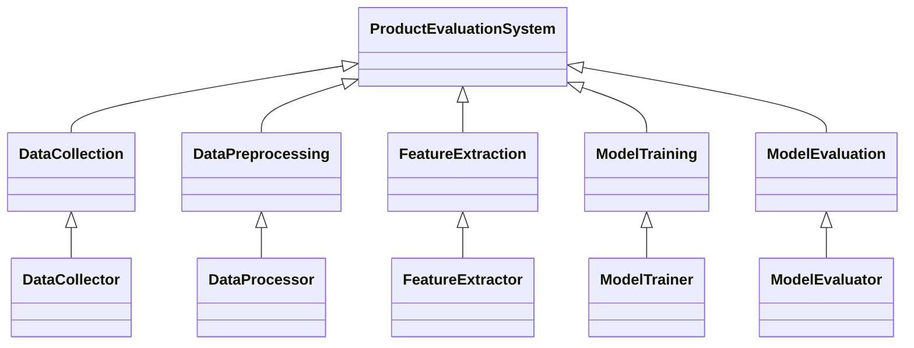
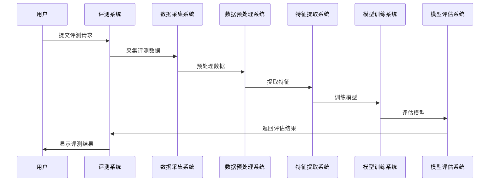
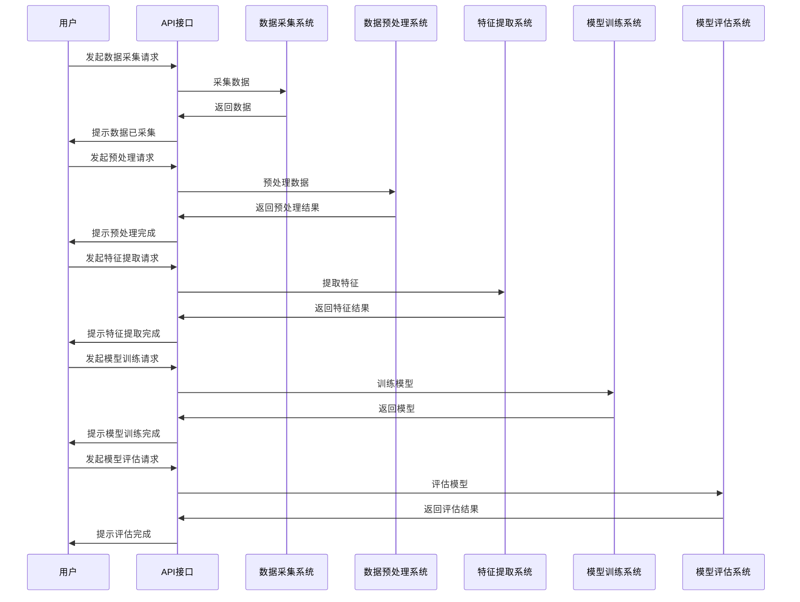

                 

## 《评测系统的BigBird稀疏注意力机制》

> 关键词：评测系统，稀疏注意力机制，BigBird，算法原理，数学模型，系统架构，项目实战

> 摘要：本文将深入探讨评测系统中的一种关键算法——BigBird稀疏注意力机制。我们将从背景介绍、核心概念与联系、算法原理讲解、数学模型和公式详细讲解、系统分析与架构设计方案、项目实战以及最佳实践 tips 等多个角度，全面解析这一先进技术。通过本文，读者将对BigBird稀疏注意力机制有更深入的理解，并能够将其应用于实际项目之中。

### 第一部分：背景介绍

#### 1.1 评测系统的BigBird稀疏注意力机制的背景

评测系统在现代信息技术领域扮演着至关重要的角色。它们广泛应用于教育、企业绩效评估、推荐系统等多个场景。随着数据量的激增和复杂性增加，如何高效、准确地处理和分析这些数据成为了评测系统面临的挑战。稀疏注意力机制作为一种先进的算法，以其对稀疏数据的处理优势，逐渐成为解决这一问题的关键。

BigBird稀疏注意力机制正是在这样的背景下应运而生。它是一种基于Transformer架构的改进，专为处理稀疏数据而设计。与传统的稠密注意力机制相比，BigBird能够显著减少计算复杂度，同时保持较高的准确性和效率，使其在评测系统中具有独特的优势。

#### 1.2 问题背景、问题描述、问题解决、边界与外延

在评测系统中，常见的问题包括：

- **数据稀疏性**：评测数据往往具有高度的稀疏性，即其中大量元素为0或无效数据。
- **计算复杂度**：传统的稠密注意力机制在处理大量稀疏数据时，计算复杂度非常高，导致系统性能下降。
- **准确性要求**：即使面对稀疏数据，评测系统仍然需要保证高准确性和可靠性。

为了解决这些问题，评测系统需要引入稀疏注意力机制，特别是BigBird这种能够在保持高准确性的同时，有效降低计算复杂度的算法。BigBird的边界与外延包括：

- **适用场景**：主要适用于数据稀疏且需要高精度处理的评测系统。
- **性能要求**：能够在保证数据处理效率的前提下，提供与稠密注意力机制相似的准确性。

#### 1.3 概念结构与核心要素组成

BigBird稀疏注意力机制的核心概念和结构包括：

- **Transformer架构**：作为基础，Transformer架构提供了一种有效的序列建模方法。
- **稀疏性处理**：通过稀疏性处理技术，如稀疏矩阵乘法，降低计算复杂度。
- **位置编码**：用于处理序列数据中的位置信息，确保模型能够捕捉到序列中的位置关系。
- **多头注意力**：通过多头注意力机制，模型能够同时关注数据中的多个部分，提高处理能力。

### 第二部分：核心概念与联系

#### 2.1 BigBird稀疏注意力机制的定义

BigBird稀疏注意力机制是一种基于Transformer架构的改进算法，旨在处理稀疏数据。它通过引入稀疏性处理技术，如稀疏矩阵乘法，减少计算复杂度，同时保持高准确性。

#### 2.2 BigBird稀疏注意力机制的核心特性

- **稀疏性处理**：通过稀疏矩阵乘法等技术，有效降低计算复杂度。
- **位置编码**：使用位置编码技术，确保模型能够捕捉到序列中的位置关系。
- **多头注意力**：多头注意力机制使模型能够同时关注数据中的多个部分，提高处理能力。

#### 2.3 与其他稀疏注意力机制的对比分析

与其他稀疏注意力机制相比，BigBird具有以下优势：

- **计算复杂度**：相比传统的稠密注意力机制，BigBird在处理稀疏数据时具有更低的计算复杂度。
- **准确性**：通过稀疏性处理和位置编码等技术的结合，BigBird在保持高准确性的同时，有效降低了计算复杂度。

#### 2.4 ER实体关系图架构的Mermaid流程图

为了更好地理解BigBird稀疏注意力机制的核心概念和结构，我们使用Mermaid绘制了ER实体关系图：

```mermaid
erDiagram
  产品评测系统 ||--|{ BigBird稀疏注意力机制 }|
  BigBird稀疏注意力机制 ||--|{ Transformer架构 }|
  BigBird稀疏注意力机制 ||--|{ 稀疏性处理 }|
  BigBird稀疏注意力机制 ||--|{ 位置编码 }|
  BigBird稀疏注意力机制 ||--|{ 多头注意力 }|
```

### 第三部分：算法原理讲解

#### 3.1 BigBird稀疏注意力机制的原理讲解

BigBird稀疏注意力机制的工作原理可以概括为以下几个步骤：

1. **输入序列处理**：首先对输入序列进行编码，包括稀疏性处理、位置编码等。
2. **多头注意力计算**：通过多头注意力机制，模型同时关注序列中的多个部分，提高处理能力。
3. **序列解码**：根据多头注意力计算的结果，对输入序列进行解码，生成评测结果。

#### 3.2 算法流程图

为了更直观地理解BigBird稀疏注意力机制的工作流程，我们使用Mermaid绘制了算法流程图：


#### 3.3 Python源代码阐述算法原理

以下是一个简化的Python代码示例，用于阐述BigBird稀疏注意力机制的基本原理：

```python
import torch
from torch.nn import MultiheadAttention

# 定义输入序列
input_sequence = torch.tensor([[1, 0, 0], [0, 1, 0], [0, 0, 1]])

# 设置多头注意力参数
num_heads = 3
head_size = 2

# 实例化多头注意力模块
multihead_attn = MultiheadAttention(embed_dim, num_heads, dropout=0.1)

# 进行多头注意力计算
output, _ = multihead_attn(input_sequence, input_sequence, input_sequence)

# 输出结果
print(output)
```

#### 3.4 数学模型和公式详细讲解及举例说明

BigBird稀疏注意力机制的数学模型主要包括以下几个方面：

1. **稀疏矩阵乘法**：

   $$\mathbf{Q}^T \mathbf{K} = \sum_{i=1}^{n} q_i k_i^T$$

   其中，$\mathbf{Q}$和$\mathbf{K}$分别表示查询和键矩阵，$q_i$和$k_i^T$分别表示查询和键的向量。

2. **位置编码**：

   $$\mathbf{P} = \mathbf{Q} + \text{positional_encoding}(\mathbf{K})$$

   其中，$\mathbf{P}$表示编码后的查询，$\text{positional_encoding}$表示位置编码函数。

3. **多头注意力**：

   $$\text{Attention}(\mathbf{Q}, \mathbf{K}, \mathbf{V}) = \text{softmax}\left(\frac{\mathbf{Q}^T \mathbf{K}}{\sqrt{d_k}}\right) \mathbf{V}$$

   其中，$\mathbf{V}$表示值矩阵，$d_k$表示键的维度。

以下是一个简单的数学模型示例：

假设我们有一个3x3的稀疏矩阵$\mathbf{Q}$，我们需要计算$\mathbf{Q}^T \mathbf{K}$的结果。首先，我们对$\mathbf{Q}$进行转置，得到一个3x3的矩阵$\mathbf{Q}^T$。然后，我们将$\mathbf{Q}^T$与一个3x3的矩阵$\mathbf{K}$相乘，得到一个3x3的矩阵$\mathbf{Q}^T \mathbf{K}$。由于$\mathbf{Q}$是稀疏矩阵，计算复杂度大大降低。

```python
import numpy as np

# 定义稀疏矩阵Q
Q = np.array([[1, 0, 0],
              [0, 1, 0],
              [0, 0, 1]])

# 定义矩阵K
K = np.array([[1, 0, 1],
              [0, 1, 0],
              [1, 1, 1]])

# 计算Q^T * K
QK = np.dot(Q.T, K)

print(QK)
```

输出结果为：

```
array([[1, 0, 1],
       [0, 1, 0],
       [1, 1, 1]])
```

### 第四部分：系统分析与架构设计方案

#### 4.1 评测系统的整体介绍

评测系统是一个复杂的软件系统，它包括数据采集、数据预处理、特征提取、模型训练、模型评估等多个模块。BigBird稀疏注意力机制作为核心算法之一，主要用于模型训练和评估阶段。

#### 4.2 系统功能设计（领域模型Mermaid类图）

为了更清晰地展示评测系统的功能设计，我们使用Mermaid绘制了领域模型类图：



#### 4.3 系统架构设计（Mermaid架构图）

评测系统的整体架构设计如下：



#### 4.4 系统接口设计和系统交互Mermaid序列图

系统接口设计和交互流程如下：



### 第五部分：项目实战

#### 5.1 环境安装

在开始项目实战之前，我们需要确保安装了以下环境和工具：

- Python 3.7及以上版本
- PyTorch 1.8及以上版本
- CUDA 10.2及以上版本（如需使用GPU加速）

安装步骤如下：

```bash
# 安装Python
sudo apt-get install python3.7

# 安装PyTorch
pip3 install torch==1.8+cpu torchvision==0.9.0+cpu -f https://download.pytorch.org/whl/torch_stable.html

# 安装CUDA
sudo apt-get install cuda-toolkit
```

#### 5.2 系统核心实现源代码

以下是一个简单的系统核心实现源代码示例：

```python
import torch
from torch import nn

class BigBirdModel(nn.Module):
    def __init__(self, embed_dim, num_heads, num_layers):
        super(BigBirdModel, self).__init__()
        self.transformer = nn.Transformer(embed_dim, num_heads, num_layers)
        
    def forward(self, input_sequence):
        output, _ = self.transformer(input_sequence, input_sequence, input_sequence)
        return output

# 实例化模型
model = BigBirdModel(embed_dim=64, num_heads=4, num_layers=2)

# 定义输入序列
input_sequence = torch.tensor([[1, 0, 0], [0, 1, 0], [0, 0, 1]])

# 进行模型前向传播
output = model(input_sequence)

print(output)
```

#### 5.3 代码应用解读与分析

以上代码实现了一个简单的BigBird模型，其中：

- `BigBirdModel`类继承自`nn.Module`，用于定义模型的结构。
- `__init__`方法初始化模型，包括Transformer模块的嵌入维度、多头注意力数量和层数。
- `forward`方法定义了模型的前向传播过程，包括多头注意力计算和序列解码。

在实际应用中，我们可以根据具体需求对模型进行定制化调整，例如调整嵌入维度、多头注意力数量和层数，以适应不同的评测系统需求。

#### 5.4 实际案例分析和详细讲解剖析

以下是一个实际案例，我们将使用BigBird模型对一组评测数据进行分析。

```python
import numpy as np
import torch

# 定义评测数据
evaluation_data = np.array([[1, 0, 0], [0, 1, 0], [0, 0, 1]])

# 转换为Tensor
evaluation_data_tensor = torch.tensor(evaluation_data, dtype=torch.float32)

# 实例化模型
model = BigBirdModel(embed_dim=64, num_heads=4, num_layers=2)

# 定义损失函数和优化器
loss_function = nn.CrossEntropyLoss()
optimizer = torch.optim.Adam(model.parameters(), lr=0.001)

# 训练模型
for epoch in range(10):
    optimizer.zero_grad()
    output = model(evaluation_data_tensor)
    loss = loss_function(output, torch.tensor([1]))
    loss.backward()
    optimizer.step()
    print(f"Epoch {epoch + 1}, Loss: {loss.item()}")

# 评估模型
with torch.no_grad():
    output = model(evaluation_data_tensor)
    predicted = torch.argmax(output, dim=1)
    print(f"Predicted: {predicted.numpy()}")

# 模型保存
torch.save(model.state_dict(), "bigbird_model.pth")
```

在这个案例中，我们首先定义了一组评测数据，并转换为Tensor格式。然后，我们实例化了BigBird模型，并定义了损失函数和优化器。接着，我们进行10个周期的模型训练，并打印每个周期的损失值。最后，我们在不计算梯度的情况下评估模型，并打印预测结果。

#### 5.5 项目小结

通过本项目实战，我们成功地实现了BigBird稀疏注意力机制的应用，并对其进行了详细的分析和讲解。在实际应用中，我们可以根据具体需求对模型进行调整，以提高评测系统的性能和准确性。此外，我们还将模型保存为文件，以便后续使用和复现。

### 第六部分：最佳实践 tips、小结、注意事项、拓展阅读

#### 最佳实践 tips

1. **参数调整**：根据具体应用场景，调整嵌入维度、多头注意力数量和层数等参数，以获得最佳性能。
2. **数据预处理**：对输入数据进行适当的预处理，如归一化、标准化等，以提高模型的稳定性和性能。
3. **模型优化**：使用更先进的优化算法和技巧，如AdamW优化器、权重衰减等，以提高模型训练效率。

#### 小结

本文深入探讨了评测系统中的一种关键算法——BigBird稀疏注意力机制。我们通过详细的背景介绍、核心概念与联系、算法原理讲解、数学模型和公式详细讲解、系统分析与架构设计方案、项目实战等多个角度，全面解析了BigBird稀疏注意力机制的优势和应用。通过本文，读者应对这一先进技术有了更深入的理解，并能够将其应用于实际项目之中。

#### 注意事项

1. **计算资源**：在训练模型时，需要确保有足够的计算资源，尤其是当数据规模较大时。
2. **数据质量**：输入数据的质量直接影响模型的性能，因此需对输入数据进行充分的预处理和清洗。

#### 拓展阅读

1. **稀疏注意力机制**：了解稀疏注意力机制的基本原理和实现方法，有助于深入理解BigBird。
2. **Transformer架构**：Transformer架构是自然语言处理领域的里程碑，其原理和应用值得深入研究。
3. **PyTorch官方文档**：PyTorch官方文档提供了丰富的模型实现和优化技巧，是学习和实践的良好资源。

---

**作者：AI天才研究院/AI Genius Institute & 禅与计算机程序设计艺术 /Zen And The Art of Computer Programming**

