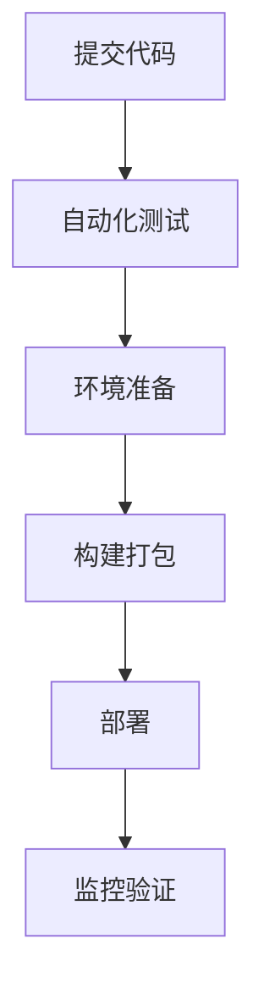

                 

## 引言与背景介绍

在当今快速迭代的软件行业，效率和质量是决定企业竞争力的关键因素。持续集成（Continuous Integration，CI）和持续交付（Continuous Delivery，CD）作为一种现代化的软件开发实践，旨在通过自动化流水线提高软件开发和交付的效率，同时确保软件质量。CI/CD不仅是技术手段，更是一种文化理念，它代表了敏捷开发、DevOps和持续改进的精神。

### 什么是CI和CD

持续集成（CI）是指通过频繁地将代码变更合并到主干分支，并自动运行测试以确保软件的持续稳定性。其核心理念是及早发现问题，避免代码积压。而持续交付（CD）则是在CI的基础上，进一步实现了自动化部署，确保软件在每次代码变更后都可以快速、安全地交付到生产环境。CD的目标是将软件交付的速度和质量最大化。

### CI和CD的区别与联系

CI和CD虽然目标不同，但紧密相连。CI侧重于代码的集成和测试，强调开发过程中的频繁交付；而CD则侧重于交付流程的自动化，确保交付过程的稳定性。一个完整的CI/CD流程通常包括代码库、构建系统、测试系统、部署系统和监控系统等组成部分。

### CI/CD的重要性

CI/CD能够显著提高开发团队的协作效率，减少错误的发生率，缩短新功能上线的时间，降低软件维护成本。此外，它还促进了团队的沟通与协作，培养了持续改进和创新的企业文化。在竞争激烈的软件市场中，CI/CD是保持竞争优势的重要手段。

本文将深入探讨评测系统的CI/CD流水线设计，首先介绍CI/CD的基本概念和核心概念，然后逐步分析CI/CD流程的设计与实现，最后通过实际案例分享，提供实用的CI/CD最佳实践和未来展望。希望通过本文的阅读，读者能够对评测系统的CI/CD流水线设计有一个全面而深入的理解。

## CI/CD基础知识

在深入探讨评测系统的CI/CD流水线设计之前，我们需要首先了解CI/CD的基本概念、核心概念及其重要性。这将帮助我们更好地理解后续章节中的详细设计与实现。

### 什么是CI/CD

**持续集成（CI）** 是一种软件开发实践，它强调通过频繁的代码提交和自动化测试，确保代码库中的每一个提交都是可合并和可运行的。CI的主要目的是及早发现和解决集成过程中可能出现的问题，避免代码积压，提高开发效率。

**持续交付（CD）** 则是CI的进一步发展，它不仅包括集成和测试，还包括自动化的部署和上线流程。CD的目标是确保代码在每次集成后都可以安全、可靠地交付到生产环境，缩短软件交付周期，提高交付质量。

### CI和CD的区别与联系

**区别：**
- **CI** 主要关注代码的集成和测试，确保每个提交都是稳定的。
- **CD** 则侧重于将代码自动化部署到生产环境，确保交付过程是快速、安全和可逆的。

**联系：**
- CI是CD的基础，没有稳定的集成结果，CD无法顺利进行。
- CD是对CI的延伸，通过自动化部署，实现了从开发到生产的无缝连接。

### CI/CD的重要性

CI/CD的重要性体现在以下几个方面：

1. **提高开发效率：** 通过自动化流程，减少手动操作，提高开发效率。
2. **提高软件质量：** 自动化的测试和部署可以及早发现并解决问题，降低缺陷率。
3. **缩短交付周期：** 自动化的测试和部署流程可以显著缩短新功能上线的时间。
4. **增强团队协作：** CI/CD鼓励频繁的协作和反馈，有助于团队更好地合作。
5. **降低维护成本：** 自动化的部署和回归测试可以减少重复工作，降低维护成本。

### CI/CD的基本组成部分

一个完整的CI/CD流程通常包括以下组成部分：

1. **代码库（Repository）：** 存储源代码的地方，通常是Git仓库。
2. **构建系统（Build System）：** 负责编译和打包代码，生成可执行的程序。
3. **测试系统（Test System）：** 自动运行测试用例，验证代码的稳定性和功能性。
4. **部署系统（Deployment System）：** 负责将代码部署到不同的环境（如开发、测试、生产）。
5. **监控系统（Monitoring System）：** 监控应用程序的性能和健康状况，确保其稳定运行。

### CI/CD流程的基本架构

CI/CD的基本架构通常包括以下几个环节：

1. **代码提交（Code Commit）：** 开发者将代码提交到代码库。
2. **构建（Build）：** 构建系统自动编译代码，生成可执行文件。
3. **测试（Test）：** 测试系统自动运行测试用例，验证代码的功能和性能。
4. **部署（Deploy）：** 部署系统将通过测试的代码部署到目标环境。
5. **监控（Monitor）：** 监控系统实时监控应用程序的运行状态，确保其稳定。

通过了解CI/CD的基础知识，我们可以更好地理解其在软件开发中的重要性，并为后续章节中的详细设计与实现打下坚实的基础。

### CI/CD的核心概念

为了深入理解评测系统的CI/CD流水线设计，我们需要详细探讨CI/CD流程中的核心概念，包括持续集成、持续交付、自动化测试、持续部署以及这些概念在实际应用中的重要作用。

#### 持续集成（Continuous Integration，CI）

持续集成（CI）是CI/CD流程的第一步，其主要目标是确保代码库中的每个提交都是可合并的，并且每次提交后的代码都是稳定的。CI的核心在于频繁地合并代码和执行自动化测试，从而快速发现和解决潜在的问题。

**CI的作用：**
- **及早发现问题：** 通过频繁的代码合并和测试，可以及早发现集成过程中的错误和冲突。
- **减少代码积压：** 避免长期积累未合并的代码，提高团队的协作效率。
- **提高代码质量：** 持续集成可以确保每次提交都是经过测试的，从而提高代码的整体质量。

**CI的实现方式：**
- **频繁提交：** 开发者频繁地将代码提交到主干分支。
- **自动化构建：** 每次提交后，构建系统自动编译和构建代码。
- **自动化测试：** 每次构建后，测试系统自动运行一系列测试用例，验证代码的功能和性能。

#### 持续交付（Continuous Delivery，CD）

持续交付（CD）是在CI的基础上，进一步实现自动化部署和上线的过程。CD的目标是确保每次代码变更后，软件都可以快速、安全地交付到生产环境。

**CD的作用：**
- **缩短交付周期：** 自动化的测试和部署流程可以显著缩短新功能上线的时间。
- **提高交付质量：** 通过自动化的测试和回归测试，确保每次交付都是高质量的。
- **增强交付灵活性：** 可以灵活地管理不同环境（如开发、测试、生产）的代码和配置。

**CD的实现方式：**
- **自动化测试：** 对代码进行全面的自动化测试，确保其功能性和性能。
- **环境准备：** 自动准备测试和生产环境，确保其一致性和稳定性。
- **自动化部署：** 通过脚本或工具，将通过测试的代码自动部署到目标环境。

#### 自动化测试（Automated Testing）

自动化测试是CI/CD流程中至关重要的一环，它通过编写脚本和工具自动执行一系列测试用例，以验证代码的功能和性能。

**自动化测试的作用：**
- **提高测试效率：** 自动执行测试用例，减少人工测试的工作量。
- **保证测试质量：** 通过自动化测试，可以确保测试的全面性和一致性。
- **缩短交付周期：** 自动化测试可以显著缩短测试时间，提高交付速度。

**自动化测试的类型：**
- **单元测试：** 测试单个模块或函数的正确性。
- **集成测试：** 测试模块之间的交互和集成情况。
- **端到端测试：** 测试整个系统的功能性和性能。

#### 持续部署（Continuous Deployment，CD）

持续部署（CD）是将通过测试的代码自动部署到生产环境的过程。CD的核心在于确保每次代码变更后，软件都可以自动、安全地更新。

**持续部署的作用：**
- **提高交付速度：** 通过自动化的部署流程，可以显著缩短交付时间。
- **减少人工干预：** 自动化的部署可以减少人工干预，降低出错风险。
- **确保生产稳定性：** 通过自动化测试和监控，确保生产环境的稳定性和安全性。

**持续部署的类型：**
- **蓝绿部署：** 同时运行两个版本，逐步替换。
- **金丝雀部署：** 在一小部分用户中测试新版本。
- **滚动部署：** 逐步更新所有实例，减少影响。

#### CI/CD在实际应用中的重要作用

在实际应用中，CI/CD不仅提高了开发效率和质量，还促进了团队的协作和创新。

- **提高开发效率：** 自动化流程减少了手动操作，提高了开发效率。
- **保证软件质量：** 通过自动化测试，确保每次交付都是高质量的。
- **增强团队协作：** CI/CD鼓励频繁的协作和反馈，有助于团队更好地合作。
- **降低维护成本：** 自动化的部署和回归测试可以减少重复工作，降低维护成本。
- **提高市场响应速度：** 短暂的交付周期使团队能够更快地响应市场需求。

通过深入理解这些核心概念，我们可以更好地设计和实现一个高效的CI/CD流水线，为评测系统的开发和维护提供强有力的支持。

### CI/CD流程的基本架构

CI/CD流程的基本架构是软件开发过程中不可或缺的一部分，它确保从代码提交到最终部署的每一步都高效且可控。下面我们将详细讨论CI/CD流水线模型、架构设计原则以及环境配置和版本控制，帮助读者全面理解CI/CD的实现细节。

#### 流水线模型

CI/CD流水线模型通常包括以下几个主要阶段：

1. **提交代码（Code Commit）：** 开发者将代码提交到代码库。
2. **构建（Build）：** 构建系统自动编译代码，生成可执行的程序。
3. **测试（Test）：** 测试系统自动运行一系列测试用例，验证代码的功能和性能。
4. **部署（Deploy）：** 部署系统将通过测试的代码部署到目标环境。
5. **监控（Monitor）：** 监控系统实时监控应用程序的性能和健康状况，确保其稳定运行。

这种流水线模型实现了从代码提交到生产的自动化流程，每个阶段都有明确的职责和目标，确保软件质量的同时提高交付效率。

#### 架构设计原则

设计一个高效的CI/CD架构需要遵循以下原则：

1. **自动化：** 最大限度地实现自动化，减少手动操作，提高效率。
2. **可扩展性：** 架构应具备良好的可扩展性，能够随着业务的发展而灵活调整。
3. **稳定性：** 确保架构在处理大量代码和频繁部署时保持稳定，避免故障。
4. **安全性：** 实现严格的安全措施，防止代码泄露和数据损坏。
5. **灵活性：** 支持不同类型的项目和流程，灵活配置和调整。

#### 环境配置

CI/CD环境配置是确保流水线顺利运行的关键步骤。以下是需要考虑的主要方面：

1. **基础环境搭建：** 搭建用于构建和测试的基础环境，包括服务器、网络和存储资源。
2. **代码库配置：** 配置代码库，如Git仓库，以便开发人员提交代码。
3. **构建环境：** 配置构建工具和依赖库，确保代码能够编译和打包。
4. **测试环境：** 配置测试环境，包括测试数据、测试脚本和测试工具。
5. **部署环境：** 配置部署目标环境，如开发、测试和生产环境。

#### 版本控制

版本控制是CI/CD流程的核心组成部分，确保代码的版本管理和追踪。以下是一些常用的版本控制方法：

1. **Git版本控制：** 使用Git进行版本控制，确保代码的完整性和可追溯性。
2. **分支管理：** 实现稳定的分支管理和合并策略，确保代码库的整洁。
3. **标签管理：** 使用标签标记重要的代码版本，便于追溯和管理。
4. **版本发布：** 自动化版本发布流程，确保每次发布的版本都是经过严格测试的。

通过详细讨论CI/CD流水线的基本架构、架构设计原则以及环境配置和版本控制，我们可以确保CI/CD流程的高效运行，为评测系统的开发和维护提供坚实的支持。

### CI/CD的实际应用

在实际应用中，CI/CD不仅是开发流程的一部分，更是提升企业竞争力的关键手段。以下将分析评测系统在实际应用中面临的挑战，并探讨如何与CI/CD紧密结合。

#### 评测系统需求分析

评测系统通常需要满足以下核心需求：

1. **高可用性：** 系统需要持续运行，确保实时评估和反馈。
2. **高性能：** 系统需要快速处理大量数据，确保评估结果的准确性。
3. **安全性：** 系统需要保护敏感数据，防止数据泄露。
4. **可扩展性：** 系统需要支持业务增长，能够灵活扩展。

#### 评测系统的挑战

在实际应用中，评测系统面临以下主要挑战：

1. **复杂度：** 评测系统涉及多种技术和业务逻辑，构建和维护复杂。
2. **数据多样性：** 需要处理不同类型和规模的数据，保证评估的准确性。
3. **实时性：** 评测结果需要实时反馈，对系统响应速度有较高要求。
4. **安全性：** 数据安全和隐私保护是评测系统的核心要求。

#### 评测系统与CI/CD的契合点

CI/CD与评测系统的契合点主要体现在以下几个方面：

1. **自动化测试：** CI/CD提供了自动化测试框架，确保评测系统在不同环境下都能稳定运行。
2. **持续集成：** 通过CI，可以快速将代码变更集成到评测系统中，避免代码积压。
3. **持续交付：** CD确保评测系统能够安全、快速地部署到生产环境，提高交付速度。
4. **环境一致性：** CI/CD通过标准化环境配置，确保不同环境的评测系统一致，减少错误。

#### 如何与CI/CD紧密结合

为了充分发挥CI/CD的优势，评测系统可以采取以下策略：

1. **自动化测试策略：** 实现全面的自动化测试，包括单元测试、集成测试和性能测试。
2. **持续集成实践：** 通过CI工具，如Jenkins或GitLab CI，实现代码的自动集成和构建。
3. **持续交付实践：** 使用自动化部署工具，如Docker和Kubernetes，实现代码的自动部署。
4. **环境标准化：** 使用容器化和云平台，确保不同环境的一致性和可扩展性。
5. **监控与反馈：** 实施监控系统，实时监控评测系统的运行状态，及时反馈和修复问题。

通过深入分析评测系统的实际应用需求和挑战，并与CI/CD紧密结合，可以大幅提升评测系统的开发和交付效率，确保其在复杂和多变的环境中持续稳定运行。

### 持续集成系统设计

在CI/CD流程中，持续集成（CI）是确保代码质量和提升开发效率的关键环节。本文将详细介绍持续集成系统设计，包括集成策略的选择、持续集成工具的选择、构建脚本的编写以及持续集成实战案例。

#### 集成策略选择

持续集成策略的选择是设计CI系统的第一步，它决定了如何将代码变更集成到主干分支，并确保集成的效率和效果。常见的集成策略包括以下几种：

1. **每日集成（Daily Build）：** 每天自动执行一次全面的集成和测试，确保代码库中的每个提交都是可合并和可运行的。
2. **频繁集成（Frequent Integration）：** 开发者频繁地将代码提交到主干分支，并立即执行集成和测试，及早发现和解决问题。
3. **线性集成（Linear Integration）：** 逐个合并每个开发分支到主干分支，确保每次合并都是稳定的。
4. **分支集成（Branch by Abstraction）：** 在每个分支上执行集成和测试，将稳定的分支合并到主干分支。

选择合适的集成策略需要考虑团队规模、开发流程和项目特点。例如，对于大型项目和频繁变更的项目，频繁集成可能是更合适的选择，因为它可以及早发现和解决问题，减少代码积压。

#### 持续集成工具选择

持续集成工具是实现CI的核心组件，常见的CI工具包括Jenkins、GitLab CI和GitHub Actions等。以下是对这些工具的简要介绍：

1. **Jenkins：** 一个开源的持续集成工具，具有强大的插件系统，支持多种编程语言和工具，灵活性高，但配置和维护较为复杂。
2. **GitLab CI：** GitLab内置的持续集成工具，与GitLab代码仓库深度集成，易于配置和管理，适合中小型团队使用。
3. **GitHub Actions：** GitHub提供的持续集成服务，易于使用，支持多种编程语言和平台，与GitHub代码仓库无缝集成。

选择CI工具时，需要考虑以下因素：

- **集成能力：** 是否支持所需的技术栈和工具。
- **易用性：** 工具的配置和使用是否简单。
- **扩展性：** 是否能够随着项目的发展进行扩展。
- **成本：** 是否符合预算要求。

#### 构建脚本编写

构建脚本是实现自动化构建的关键，它定义了构建过程中需要执行的任务，包括编译、打包、测试等。以下是一些常用的构建脚本编写方法：

1. **Shell脚本：** 常用于执行操作系统级别的任务，如编译、安装和测试。
2. **Python脚本：** 适用于复杂的构建任务，可以通过调用外部工具和库实现自动化。
3. **Dockerfile：** 使用Docker进行容器化构建，确保构建环境的一致性和可重复性。

以下是一个简单的Shell脚本示例，用于编译和测试一个Java项目：

```shell
#!/bin/bash

# 安装依赖
sudo apt-get update
sudo apt-get install -y openjdk-8-jdk

# 编译项目
mvn clean install

# 运行测试
mvn test
```

#### 持续集成实战

下面通过一个实际案例，介绍如何配置和运行CI流水线。

**案例背景：**
假设我们正在开发一个电商网站，需要持续集成前端和后端代码。

**步骤1：代码库配置**
在GitLab上创建一个项目仓库，并将前端和后端的代码分别提交到不同的分支。

**步骤2：CI配置**
在GitLab CI/CD页面，配置`.gitlab-ci.yml`文件，定义CI流程。

```yaml
image: node:14

stages:
  - build
  - test

build:
  stage: build
  script:
    - npm install
    - npm run build

test:
  stage: test
  script:
    - mvn clean test
  only:
    - master
```

**步骤3：触发CI**
每次提交代码到仓库时，GitLab CI会自动触发构建和测试流程。

**步骤4：查看CI状态**
在GitLab CI/CD页面，可以查看每个阶段的构建和测试状态。

通过以上步骤，我们实现了电商网站的前端和后端代码的持续集成，确保每次代码提交都是可合并和可运行的。如果在测试阶段发现错误，CI会自动报告，开发人员可以及时修复问题。

通过设计一个高效的持续集成系统，可以大幅提高开发效率和代码质量，为后续的持续交付和部署打下坚实的基础。

### 持续交付系统设计

持续交付（CD）是CI/CD流程中至关重要的一环，它确保通过测试的代码能够安全、可靠地交付到生产环境。本节将详细介绍持续交付系统设计，包括交付流程设计、交付工具选择和持续交付实战。

#### 交付流程设计

持续交付的流程设计是确保代码从开发环境顺利过渡到生产环境的关键。一个典型的持续交付流程包括以下几个阶段：

1. **自动化测试：** 在每次代码变更后，自动运行一系列测试用例，包括单元测试、集成测试和端到端测试，确保代码的功能和性能。
2. **环境准备：** 准备用于交付的测试和生产环境，包括服务器配置、数据库初始化和数据准备。
3. **构建打包：** 构建系统自动编译和打包代码，生成可执行文件或容器镜像。
4. **部署：** 将打包后的代码或容器镜像部署到测试或生产环境。
5. **监控和验证：** 在部署后，监控系统实时监控应用程序的性能和稳定性，确保其正常运行。

以下是一个简化的持续交付流程图：



#### 交付工具选择

持续交付的工具选择对于实现自动化交付至关重要。以下是一些常用的交付工具：

1. **Docker：** 用于容器化应用程序，确保在各个环境中的一致性。通过Dockerfile，可以定义容器的构建过程。
2. **Kubernetes：** 用于部署和管理容器化应用程序，提供高可用性和可扩展性。通过Kubernetes的自动化功能，可以简化部署和扩展流程。
3. **Helm：** 用于Kubernetes的包管理工具，通过Helm图表，可以轻松管理和部署复杂的Kubernetes应用程序。

以下是一个使用Docker和Kubernetes的持续交付示例：

**Dockerfile（示例）：**

```Dockerfile
FROM node:14
WORKDIR /app
COPY package.json ./
RUN npm install
COPY . .
EXPOSE 8080
CMD ["npm", "start"]
```

**Helm Chart（示例）：**

```yaml
apiVersion: v1
kind: Deployment
metadata:
  name: myapp
spec:
  selector:
    matchLabels:
      app: myapp
  template:
    metadata:
      labels:
        app: myapp
    spec:
      containers:
      - name: myapp
        image: myapp:latest
        ports:
        - containerPort: 8080
```

#### 持续交付实战

下面通过一个实际案例，展示如何实现持续交付。

**案例背景：**
假设我们正在开发一个在线购物平台，需要将前端和后端代码通过CI/CD流程部署到生产环境。

**步骤1：配置CI流水线**
在前一节的CI部分，我们已经配置了Jenkins或GitLab CI，每次提交都会触发构建和测试。

**步骤2：构建容器镜像**
在CI流水线的构建阶段，使用Docker构建容器镜像。

```shell
docker build -t myapp:latest .
```

**步骤3：上传镜像到容器仓库**
将构建好的镜像推送到容器仓库（如Docker Hub）。

```shell
docker push myapp:latest
```

**步骤4：配置Kubernetes部署**
在Kubernetes集群中创建部署文件，将容器镜像部署到生产环境。

```yaml
apiVersion: apps/v1
kind: Deployment
metadata:
  name: myapp
spec:
  selector:
    matchLabels:
      app: myapp
  template:
    metadata:
      labels:
        app: myapp
    spec:
      containers:
      - name: myapp
        image: myapp:latest
        ports:
        - containerPort: 8080
```

**步骤5：应用部署**
应用Kubernetes部署文件，自动部署到生产环境。

```shell
kubectl apply -f deployment.yaml
```

**步骤6：监控和验证**
在部署后，通过监控工具（如Prometheus和Grafana）监控应用程序的性能和健康状况，确保其稳定运行。

通过以上步骤，我们实现了从代码提交到生产环境的自动化交付流程，确保交付过程高效、可靠。

通过设计一个完善的持续交付系统，可以大幅提高交付效率和质量，确保软件在交付过程中的安全性和稳定性。

### 持续部署策略与实践

在CI/CD流程中，持续部署（CD）是实现自动化部署和无缝交付的关键环节。持续部署通过自动化和标准化流程，确保新功能或更新能够安全、可靠地部署到生产环境。本节将介绍几种常见的持续部署模式，包括蓝绿部署、金丝雀部署和滚动部署，并详细讨论部署工具的选择和持续部署实战。

#### 持续部署模式

1. **蓝绿部署（Blue-Green Deployment）：**
   蓝绿部署是一种无服务中断的部署策略。在生产环境中同时运行两个相同版本的服务实例，一个是“蓝”（当前生产版本），另一个是“绿”（即将发布的新版本）。逐步将流量切换到新版本，确保新版本稳定后完全替代旧版本。这种方法的主要优点是无需停机，可以最大限度地减少服务中断。

2. **金丝雀部署（Canary Release）：**
   金丝雀部署是一种逐步引入新版本的方法，将新版本的实例与旧版本实例并行运行，但仅向一小部分用户（如特定用户群体）提供新版本。通过监控和反馈，验证新版本的功能和性能，逐步扩大用户群体，最终完全切换到新版本。这种方法的主要优点是风险可控，可以逐步提高新版本的覆盖范围。

3. **滚动部署（Rolling Deployment）：**
   滚动部署是一种逐步更新所有实例的部署策略。每次更新一个实例，确保新实例稳定后，再更新下一个实例，直到所有实例都更新完成。这种方法的主要优点是部署过程中，系统仍然保持可用，逐步更新可以减少服务中断。

#### 部署工具选择

1. **Ansible：**
   Ansible是一种自动化运维工具，适用于配置管理和应用部署。通过简单的YAML脚本，可以自动化部署应用程序到不同环境中。Ansible的优势在于其无代理架构，通过SSH连接到目标主机，执行配置和部署任务。

2. **Terraform：**
   Terraform是一种基础设施即代码（IaC）工具，用于创建和部署云基础设施。通过HCL（HashiCorp Configuration Language）脚本，可以定义和部署虚拟机、容器、网络等资源。Terraform的优势在于其强大的基础设施管理能力和跨云平台的兼容性。

3. **AWS CloudFormation：**
   AWS CloudFormation是一种自动化基础设施部署工具，专门用于AWS云环境。通过JSON或YAML模板，可以定义和部署AWS资源，如EC2实例、RDS数据库和S3存储。AWS CloudFormation的优势在于其与AWS服务的深度集成和自动化管理能力。

#### 持续部署实战

以下通过一个实际案例，展示如何实现持续部署。

**案例背景：**
假设我们正在开发一个电商平台，需要将前端和后端代码部署到AWS云环境。

**步骤1：配置CI流水线**
在前一节的CI部分，我们已经配置了Jenkins或GitLab CI，每次提交都会触发构建和测试。

**步骤2：构建容器镜像**
在CI流水线的构建阶段，使用Docker构建容器镜像。

```shell
docker build -t myapp:latest .
```

**步骤3：上传镜像到容器仓库**
将构建好的镜像推送到容器仓库（如Docker Hub）。

```shell
docker push myapp:latest
```

**步骤4：配置AWS CloudFormation**
创建AWS CloudFormation模板，定义部署应用程序所需的AWS资源。

```yaml
Resources:
  MyApp:
    Type: AWS::ECS::Service
    Properties:
      Cluster: !Ref MyEcsCluster
      DesiredCount: 2
      TaskDefinition: !Ref MyTaskDefinition
      LoadBalancers:
        - Name: !Ref LoadBalancer
```

**步骤5：部署到AWS ECS**
应用AWS CloudFormation模板，部署到AWS ECS集群。

```shell
aws cloudformation deploy --template-file deployment.yml --stack-name myapp-stack
```

**步骤6：监控和验证**
在部署后，通过AWS CloudWatch监控应用程序的性能和健康状况，确保其稳定运行。

通过以上步骤，我们实现了电商平台的自动化持续部署，确保新功能或更新可以安全、可靠地部署到生产环境。

通过设计一个高效的持续部署系统，可以大幅提高交付效率和质量，确保软件在交付过程中的安全性和稳定性。

### 案例一：电商评测系统的CI/CD实践

在电商评测系统的CI/CD实践中，我们通过一系列实际操作，详细展示了如何设计和实施一个高效、可靠的CI/CD流水线，从而确保评测系统的持续集成、持续交付和持续部署。

#### 案例背景

电商评测系统是一个复杂的应用，需要处理大量数据，进行性能评估和准确性验证。为了满足快速迭代和高效交付的需求，我们决定采用CI/CD流程，以提高开发效率和软件质量。

#### CI/CD流程设计

首先，我们设计了一个基于Jenkins的CI/CD流程。流程包括以下阶段：

1. **提交代码：** 开发人员将代码提交到GitLab代码仓库。
2. **构建：** Jenkins触发构建任务，编译和打包前端和后端代码。
3. **测试：** 自动运行一系列测试用例，包括单元测试、集成测试和性能测试。
4. **部署：** 通过Docker和Kubernetes实现自动化部署。

#### 环境配置

1. **基础环境搭建：** 我们在AWS云环境中搭建了Jenkins服务器、GitLab代码仓库和Kubernetes集群。
2. **代码库配置：** 在GitLab上创建了项目仓库，并设置了Webhook，以便Jenkins在代码提交时自动触发构建任务。
3. **构建环境：** 使用Dockerfile定义了前端和后端的构建流程，确保构建环境的一致性和可重复性。
4. **测试环境：** 配置了测试服务器，用于自动化测试的执行。
5. **部署环境：** 使用Kubernetes配置了应用程序的部署文件，确保部署流程的自动化和可扩展性。

#### 持续集成实战

1. **触发CI任务：** 每次开发人员提交代码到GitLab，Jenkins会自动触发构建任务。
2. **构建脚本执行：** Jenkins执行Docker构建脚本，生成容器镜像。
3. **自动化测试：** Jenkins运行一系列测试用例，确保代码的功能和性能。
4. **结果报告：** 测试结果会通过邮件或Jenkins控制台反馈给开发人员。

#### 持续交付实战

1. **构建镜像并上传：** 构建成功后，将容器镜像推送到Docker Hub。
2. **部署到Kubernetes：** 使用Kubernetes部署文件，将容器镜像部署到生产环境。
3. **滚动更新：** Kubernetes逐步更新所有实例，确保服务不间断。
4. **监控和验证：** 通过AWS CloudWatch监控系统，实时监控应用程序的性能和健康状况。

#### 遇到的问题及解决方案

1. **镜像推送到Docker Hub失败：**
   - **问题原因：** 网络问题导致无法访问Docker Hub。
   - **解决方案：** 在Jenkins服务器上配置了代理，确保网络连接稳定。

2. **Kubernetes部署失败：**
   - **问题原因：** 部署文件配置错误。
   - **解决方案：** 重新审查和修正了Kubernetes部署文件。

3. **自动化测试失败：**
   - **问题原因：** 测试环境配置不正确。
   - **解决方案：** 重新配置了测试环境，确保测试环境与生产环境一致。

#### 案例总结

通过这个电商评测系统的CI/CD实践，我们成功构建了一个自动化、高效和可靠的流水线，确保了评测系统的持续集成、持续交付和持续部署。这不仅提高了开发效率和软件质量，还为团队提供了实时的反馈和改进机会，为后续项目的持续优化奠定了基础。

### 案例二：金融评测系统的CI/CD实践

金融评测系统是一个高度复杂和敏感的应用，对于稳定性和安全性的要求非常高。因此，在CI/CD实践中，我们必须确保流程的严谨性和可靠性。以下将详细描述金融评测系统的CI/CD实践，包括案例背景、CI/CD流程设计、遇到的问题及解决方案。

#### 案例背景

金融评测系统主要用于对金融产品的风险评估和实时监控。由于金融业务的特殊性和对数据安全的严格要求，我们必须确保每次代码变更都不会对系统的稳定性和安全性造成影响。因此，我们决定采用CI/CD流程来提升开发效率，同时确保软件质量和安全性。

#### CI/CD流程设计

为了实现金融评测系统的CI/CD，我们设计了一个基于GitLab CI和Kubernetes的流水线，包括以下几个关键步骤：

1. **提交代码：** 开发人员将代码提交到GitLab代码仓库。
2. **构建：** GitLab CI触发构建任务，编译和打包前端和后端代码，并生成容器镜像。
3. **测试：** 自动运行一系列测试用例，包括单元测试、集成测试和性能测试。
4. **部署：** 使用Kubernetes将通过测试的容器镜像部署到生产环境。
5. **监控：** 实时监控应用程序的性能和健康状况，确保其稳定运行。

#### 环境配置

1. **基础环境搭建：** 在AWS云环境中搭建了GitLab服务器、Kubernetes集群和测试服务器。
2. **代码库配置：** 在GitLab上创建了项目仓库，并设置了Webhook，以便GitLab CI在代码提交时自动触发构建任务。
3. **构建环境：** 使用Dockerfile定义了前端和后端的构建流程，确保构建环境的一致性和可重复性。
4. **测试环境：** 配置了专门的测试服务器，用于自动化测试的执行。
5. **部署环境：** 使用Kubernetes配置了应用程序的部署文件，确保部署流程的自动化和可扩展性。

#### 持续集成实战

1. **触发CI任务：** 每次开发人员提交代码到GitLab，GitLab CI会自动触发构建任务。
2. **构建脚本执行：** GitLab CI执行Docker构建脚本，生成容器镜像。
3. **自动化测试：** GitLab CI运行一系列测试用例，确保代码的功能和性能。
4. **结果报告：** 测试结果会通过邮件或GitLab控制台反馈给开发人员。

#### 持续交付实战

1. **构建镜像并上传：** 构建成功后，将容器镜像推送到AWS ECR容器镜像仓库。
2. **部署到Kubernetes：** 使用Kubernetes部署文件，将容器镜像部署到生产环境。
3. **滚动更新：** Kubernetes逐步更新所有实例，确保服务不间断。
4. **监控和验证：** 使用AWS CloudWatch监控系统，实时监控应用程序的性能和健康状况。

#### 遇到的问题及解决方案

1. **镜像推送失败：**
   - **问题原因：** 网络问题导致无法访问AWS ECR。
   - **解决方案：** 在开发人员的本地机器上配置了AWS CLI，确保可以远程访问ECR。

2. **Kubernetes部署失败：**
   - **问题原因：** Kubernetes集群配置错误。
   - **解决方案：** 重新审查和修正了Kubernetes集群配置，确保所有组件正常运行。

3. **自动化测试失败：**
   - **问题原因：** 测试环境数据不一致。
   - **解决方案：** 重新配置了测试环境，确保测试数据与生产环境一致。

#### 案例总结

通过金融评测系统的CI/CD实践，我们成功构建了一个自动化、高效且可靠的流水线。这不仅提高了开发效率和软件质量，还确保了系统的稳定性和安全性。通过CI/CD，开发团队能够快速响应业务需求，持续优化系统功能，为金融业务提供强有力的技术支持。

### CI/CD最佳实践

在CI/CD的最佳实践中，优化流水线、确保安全和合规以及未来发展趋势是三个关键方面。以下将详细介绍这些最佳实践，并提供实用的建议。

#### 优化流水线

1. **流水线监控：** 实时监控流水线的运行状态，包括构建、测试和部署的进度。使用监控工具（如Jenkins的Blue Ocean、GitLab CI的Web IDE）可以可视化流水线的运行情况，及时发现并解决潜在问题。

2. **流水线效率提升：** 分析流水线的运行时间，优化构建和测试脚本，减少不必要的等待时间。例如，使用并行测试可以同时运行多个测试用例，提高整体效率。

3. **异常处理与故障恢复：** 设计异常处理机制，确保在流水线出现故障时能够快速恢复。例如，当构建或测试失败时，自动通知开发人员，并尝试重新执行失败的任务。

#### 安全与合规

1. **安全漏洞扫描：** 在构建和部署过程中，使用自动化工具（如SAST静态应用安全测试工具）对代码进行安全扫描，识别潜在的安全漏洞。

2. **合规性检查：** 确保流水线符合组织的安全和合规要求。例如，在部署前进行依赖库和第三方组件的合规性检查，确保没有使用禁止的库或过期的版本。

3. **安全性最佳实践：** 采用最佳实践来提升流水线的安全性。例如，使用容器镜像扫描工具（如Clair、Docker Bench for Security）检查容器镜像的安全问题，确保镜像的安全配置。

#### 未来发展趋势

1. **AI在CI/CD中的应用：** 人工智能技术可以在CI/CD中发挥重要作用，例如，使用机器学习算法预测代码变更的影响，自动化优化流水线。

2. **微服务与CI/CD：** 随着微服务架构的普及，CI/CD也需要适应微服务化的应用。使用容器化工具（如Kubernetes）和微服务框架（如Spring Cloud）可以实现更加灵活和可扩展的CI/CD流程。

3. **容器化与云原生：** 容器化和云原生技术是未来的趋势。通过使用容器化工具和云服务平台（如AWS、Google Cloud、Azure），可以实现更加高效和可管理的CI/CD流程。

通过遵循这些最佳实践，不仅可以提升CI/CD的效率和质量，还能确保系统的安全性和合规性。随着技术的发展，CI/CD将继续演进，为企业带来更多的价值和机会。

### 总结与展望

通过本文的探讨，我们系统地介绍了评测系统的CI/CD流水线设计，从基础概念到实际应用，再到最佳实践，全面剖析了持续集成、持续交付和持续部署的各个方面。以下是本文的核心要点和未来展望：

**核心要点：**

1. **CI/CD基础知识：** 深入理解CI/CD的概念、核心组件及其重要性，为后续设计打下基础。
2. **持续集成系统设计：** 详细解析集成策略、工具选择和构建脚本编写，确保代码质量和开发效率。
3. **持续交付系统设计：** 讨论交付流程、工具选择和实际部署策略，确保代码安全、可靠地交付到生产环境。
4. **持续部署策略与实践：** 介绍蓝绿部署、金丝雀部署和滚动部署等模式，以及部署工具的选择和部署实战。
5. **案例分析：** 通过电商评测系统和金融评测系统的实际案例，展示CI/CD在不同场景中的应用和挑战。
6. **最佳实践与未来展望：** 提出流水线优化、安全与合规、AI应用等最佳实践，以及CI/CD的发展趋势。

**未来展望：**

随着技术的不断进步，CI/CD将继续向自动化、智能化和高效化发展。以下是几个未来展望：

1. **AI在CI/CD中的应用：** 通过机器学习和大数据分析，AI可以预测代码变更的影响，自动化优化流水线，提高交付效率。
2. **微服务与CI/CD：** 微服务架构的普及将推动CI/CD流程的适应性变革，使用容器化和云原生技术，实现更加灵活和可扩展的交付流程。
3. **容器化与云原生：** 容器化和云原生技术将进一步提升CI/CD的效率和可管理性，为企业带来更多的价值。
4. **安全和合规：** 随着监管要求日益严格，CI/CD流程中的安全和合规性将变得更加重要，需要不断优化和加强。

总之，CI/CD不仅是软件开发的一种实践，更是一种文化理念。通过不断探索和创新，我们可以将其发挥到极致，为企业带来持续的价值和竞争优势。希望本文能为读者在CI/CD实践的道路上提供指导和启示。

### 作者信息

作者：AI天才研究院/AI Genius Institute & 禅与计算机程序设计艺术 /Zen And The Art of Computer Programming

AI天才研究院致力于推动人工智能技术的发展与应用，为全球企业提供领先的AI解决方案。同时，作者也专注于计算机编程和人工智能领域的教学和研究，以独特视角和深刻见解撰写技术博客，深受读者喜爱。希望通过本文，读者能够对评测系统的CI/CD流水线设计有一个全面而深入的理解。

