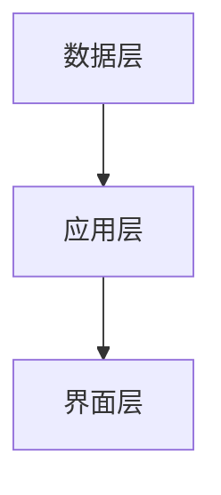
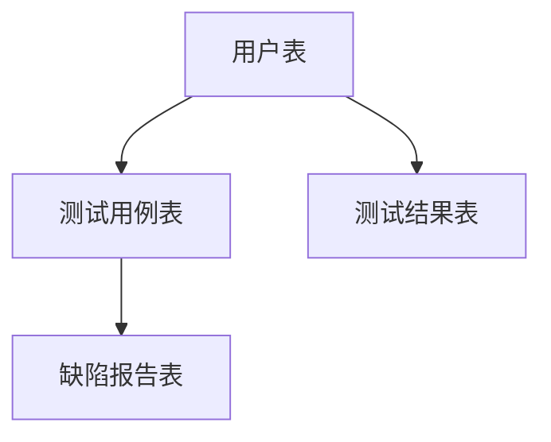
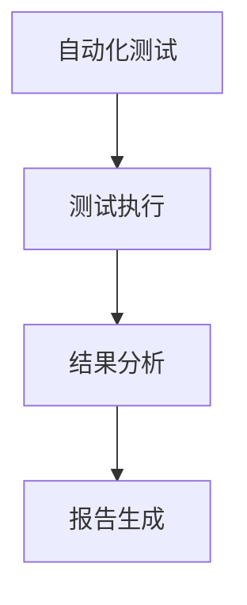
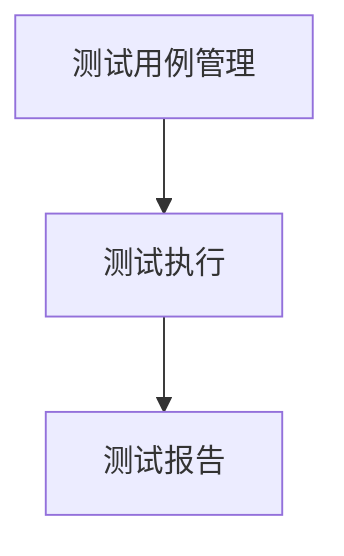

                 

### 第1章: 引言

#### 1.1 评测系统的重要性

#### 1.1.1 评测系统概述

在现代软件开发过程中，评测系统扮演着至关重要的角色。评测系统通常是指一套用于评估软件质量、性能、安全性和可靠性的工具和流程。其核心目标是通过一系列自动化测试来确保软件在交付之前达到预期标准。

#### 1.1.2 评测系统在DevOps中的角色

DevOps是一种文化、实践和工具的集合，旨在通过自动化和紧密协作来缩短软件交付周期。评测系统在DevOps中起到了关键的作用，其具体角色如下：

1. **持续集成和持续部署（CI/CD）**：评测系统可以通过自动化测试确保每次代码变更都能顺利集成和部署。
2. **提高软件质量**：通过持续的自动化测试，可以及时发现和修复问题，从而提高软件质量。
3. **增强团队协作**：评测系统提供了一个平台，使团队成员可以更清晰地了解软件的状态和问题。

#### 1.1.3 评测系统的核心价值

1. **加快迭代速度**：通过自动化测试，可以快速地验证代码变更，从而加快软件迭代速度。
2. **提高代码质量**：自动化测试可以识别代码中的缺陷和潜在问题，帮助开发者编写更高质量的代码。
3. **减少人工成本**：自动化测试减少了对人工测试的依赖，从而降低了测试成本。

#### 1.2 DevOps概述

#### 1.2.1 DevOps的定义

DevOps是一种文化和实践，旨在通过开发和运维团队的紧密合作来提高软件交付的效率和质量。它强调自动化、持续集成、持续交付和监控。

#### 1.2.2 DevOps的关键原则

1. **自动化**：通过自动化工具和流程来减少手动操作，提高效率。
2. **协作**：鼓励开发和运维团队之间的沟通和合作。
3. **持续集成和持续交付**：确保代码变更可以快速集成并部署到生产环境。
4. **监控**：实时监控软件性能和健康状况，以便及时发现问题。

#### 1.2.3 DevOps与传统开发模型的区别

传统开发模型通常将开发、测试、运维等部门分开，导致沟通不畅、效率低下。而DevOps则通过紧密协作和自动化工具来克服这些问题。

#### 1.3 评测系统与DevOps的最佳实践

#### 1.3.1 实现自动化测试

自动化测试是DevOps的核心原则之一。通过自动化测试，可以确保每次代码变更都能快速集成并部署。

#### 1.3.2 集成持续集成/持续部署（CI/CD）

持续集成和持续部署是DevOps的关键实践。通过集成CI/CD，可以确保每次代码变更都能顺利集成并部署。

#### 1.3.3 保证代码质量

通过自动化测试和代码审查，可以及时发现和修复代码中的问题，从而提高软件质量。

# 评测系统的DevOps最佳实践

## 关键词：DevOps、评测系统、自动化测试、持续集成、持续部署

## 摘要：

本文将深入探讨评测系统在DevOps实践中的重要性。通过分析评测系统的核心价值和在DevOps中的应用，本文将提出一系列最佳实践，包括实现自动化测试、集成CI/CD以及保证代码质量。这些实践将帮助团队提高软件交付效率，确保软件质量和稳定性。

## 目录大纲

### 第一部分: 引言与背景

#### 第1章: 引言

##### 1.1 评测系统的重要性

##### 1.2 DevOps概述

##### 1.3 评测系统与DevOps的最佳实践

### 第二部分: DevOps文化在评测系统中的应用

#### 第2章: DevOps文化在评测系统中的应用

##### 2.1 敏捷开发与评测系统的融合

##### 2.2 沟通协作与透明度

##### 2.3 持续反馈与改进

### 第三部分: 评测系统的设计与架构

#### 第3章: 评测系统的设计与架构

##### 3.1 评测系统的设计原则

##### 3.2 评测系统的架构设计

##### 3.3 评测系统的组件与模块

### 第四部分: DevOps工具与技术的应用

#### 第4章: DevOps工具与技术的应用

##### 4.1 持续集成工具

##### 4.2 自动化测试工具

##### 4.3 持续部署工具

### 第五部分: 评测系统的具体实施步骤

#### 第5章: 评测系统的具体实施步骤

##### 5.1 环境准备

##### 5.2 测试用例设计

##### 5.3 持续集成与部署

##### 5.4 自动化测试实践

### 第六部分: 评测系统的优化与性能调优

#### 第6章: 评测系统的优化与性能调优

##### 6.1 评测系统的性能分析

##### 6.2 评测系统的优化实践

##### 6.3 性能调优工具

### 第七部分: 评测系统的DevOps最佳实践总结与展望

#### 第7章: 评测系统的DevOps最佳实践总结与展望

##### 7.1 DevOps在评测系统中的成功案例

##### 7.2 评测系统的未来发展趋势

------------------------------------------------------------------### 第一部分: 引言与背景

#### 第1章: 引言

在当今快速发展的软件开发领域，DevOps已成为一项关键实践，它强调开发（Development）与运营（Operations）之间的紧密协作和自动化流程，从而实现更高效、更可靠的软件交付。而评测系统作为软件质量保证的重要环节，其与DevOps的结合愈发显得重要。本章将简要介绍评测系统的核心概念，分析其在DevOps中的角色和重要性，并探讨评测系统与DevOps的最佳实践。

#### 1.1 评测系统的重要性

首先，让我们理解什么是评测系统。评测系统通常是一套包含自动化测试、测试管理、结果分析和报告生成的工具集合，用于评估软件的功能性、性能、安全性和可靠性。以下是评测系统在软件开发中的重要性：

1. **提高软件质量**：通过自动化测试，开发者可以快速发现和修复代码中的缺陷，确保软件在交付前达到预期质量标准。
2. **减少人工测试成本**：自动化测试减少了人工测试的工作量，从而降低了测试成本。
3. **加快迭代速度**：自动化测试提高了测试效率，使得每次迭代都可以快速完成，缩短了软件交付周期。
4. **提升团队协作**：评测系统提供了一个统一平台，使得开发、测试和运维团队可以更高效地协作，共同提高软件质量。

#### 1.2 DevOps概述

DevOps是一种文化和实践，旨在通过开发（Development）与运营（Operations）的紧密合作，实现持续交付和持续部署。其核心原则包括自动化、协作、持续集成和持续交付。以下是DevOps的一些关键特点：

1. **自动化**：通过自动化工具和脚本，减少手动操作，提高工作效率和准确性。
2. **协作**：打破开发与运维之间的壁垒，促进团队之间的沟通和合作。
3. **持续集成（CI）**：确保每次代码提交都可以自动构建、测试和部署。
4. **持续交付（CD）**：确保软件可以快速、可靠地交付到生产环境。

#### 1.3 评测系统在DevOps中的角色

评测系统在DevOps中扮演着至关重要的角色，其主要作用如下：

1. **支持持续集成**：通过自动化测试，确保每次代码变更都可以顺利集成，减少集成风险。
2. **保证软件质量**：自动化测试可以持续监控软件质量，确保软件在每次迭代中保持高标准的质量。
3. **促进协作**：评测系统提供了一个统一的平台，使得不同团队可以共享测试结果，协作改进软件质量。

#### 1.4 评测系统与DevOps的最佳实践

为了充分发挥评测系统在DevOps中的作用，以下是一些最佳实践：

1. **实现自动化测试**：通过自动化测试工具，如Selenium、JMeter等，建立全面的测试覆盖。
2. **集成CI/CD**：将评测系统与CI/CD工具（如Jenkins、GitLab CI等）集成，确保每次代码变更都可以自动测试和部署。
3. **保证代码质量**：通过代码审查和静态代码分析，确保代码符合质量标准。

总结来说，评测系统在DevOps中的角色至关重要，其与DevOps的结合可以显著提高软件交付的效率和质量。在接下来的章节中，我们将深入探讨评测系统的设计与架构、DevOps文化在评测系统中的应用、DevOps工具与技术、以及评测系统的具体实施步骤和性能优化。这些内容将为读者提供全面、实用的指导，帮助团队更好地实施DevOps实践，提升软件开发的整体效能。### 第2章: DevOps文化在评测系统中的应用

#### 2.1 敏捷开发与评测系统的融合

敏捷开发是一种以用户为中心的软件开发方法，强调迭代、持续交付和持续改进。敏捷开发的核心理念与评测系统有着天然的联系，尤其是在提高软件质量和加速迭代方面。以下是敏捷开发在评测系统中的应用：

1. **迭代测试**：敏捷开发强调迭代，每个迭代周期通常为2-4周。评测系统可以针对每个迭代进行自动化测试，确保每次迭代都符合质量标准。
2. **持续反馈**：敏捷开发中的回顾会议提供了一个反馈机制，团队可以讨论测试结果，识别改进机会。评测系统生成的测试报告和数据可以帮助团队更客观地评估软件质量，并提出改进建议。
3. **用户参与**：敏捷开发鼓励用户参与，以确保软件真正满足用户需求。评测系统可以收集用户反馈，帮助团队调整测试策略，提高测试覆盖面。

#### 2.1.1 敏捷开发概述

敏捷开发起源于2001年的敏捷宣言，它提倡更灵活、更响应变化的开发方法。以下是敏捷开发的关键原则：

1. **个体和互动重于过程和工具**：敏捷开发强调团队成员之间的互动，认为团队合作比单纯依赖工具更重要。
2. **可工作的软件重于详尽的文档**：敏捷开发认为，可工作的软件是衡量项目成功的最好标准，而不是大量的文档。
3. **客户合作重于合同谈判**：敏捷开发强调与客户的紧密合作，确保软件能够满足客户需求。
4. **响应变化重于遵循计划**：敏捷开发接受变化，并认为灵活适应变化比严格遵循计划更重要。

#### 2.1.2 敏捷开发在评测系统开发中的实践

在敏捷开发中，评测系统开发可以通过以下实践来实现：

1. **测试驱动开发（TDD）**：在编写代码之前先编写测试用例，确保代码符合预期行为。这种方法可以提高代码质量，减少缺陷。
2. **持续集成**：每次代码提交后，自动执行测试用例，确保新代码不会引入问题。Jenkins、GitLab CI等工具可以用于实现持续集成。
3. **自动化测试**：自动化测试是敏捷开发的核心，通过自动化测试工具（如Selenium、JMeter等），可以快速执行大量测试用例，提高测试效率。
4. **持续反馈**：通过实时监控和测试报告，团队可以快速响应问题，持续改进测试策略和代码质量。

#### 2.1.3 敏捷开发与DevOps的关系

敏捷开发与DevOps之间有着紧密的联系。DevOps的核心理念，如自动化、持续集成和持续交付，与敏捷开发的实践高度契合。以下是敏捷开发与DevOps之间的关系：

1. **共同目标**：敏捷开发和DevOps都旨在提高软件交付效率和质量，减少浪费。
2. **互相支持**：敏捷开发为DevOps提供了持续集成和自动化测试的基础，而DevOps则为敏捷开发提供了持续交付和监控的保障。
3. **共同文化**：敏捷开发和DevOps都强调团队合作、透明度和持续改进。

通过将敏捷开发与评测系统相结合，团队可以实现更高效、更高质量的软件开发过程。接下来，我们将探讨沟通协作与透明度在评测系统中的重要性，以及如何在评测系统中实现持续反馈与改进。这些实践将进一步提升团队的协作效率和软件质量。

#### 2.2 沟通协作与透明度

在DevOps实践中，沟通协作与透明度是确保项目成功的关键要素。特别是在评测系统中，这两个原则的重要性尤为突出。有效的沟通和透明的流程可以显著提高团队的协作效率，确保评测系统能够及时、准确地反映软件的质量状况。

#### 2.2.1 团队内部沟通协作

团队内部的沟通协作对于评测系统的成功至关重要。以下是几种有效的沟通协作方法：

1. **每日站会**：每日站会是一种简单的沟通方式，团队成员可以快速交流当天的工作进展、遇到的困难和接下来的计划。这种方法有助于及时发现和解决问题，确保项目按计划进行。
2. **任务板**：使用任务板（如JIRA、Trello等）可以帮助团队清晰地跟踪任务状态，明确每个成员的责任和工作进度。任务板上的卡片可以标记任务的优先级、状态和责任人，便于团队协作和监控。
3. **代码审查**：代码审查是一种确保代码质量的协作方式。通过代码审查，团队成员可以共同评估代码的质量、可维护性和安全性，确保代码符合团队的编码标准。

#### 2.2.2 与其他部门的协作

评测系统不仅需要与开发团队紧密合作，还需要与其他部门，如运维、产品管理、安全等部门进行有效协作。以下是几种与外部部门协作的方法：

1. **跨职能团队**：建立跨职能团队，将开发、测试、运维、产品管理、安全等部门的代表纳入同一团队，共同负责项目的开发和交付。这种团队结构有助于打破部门壁垒，提高协作效率。
2. **需求评审会议**：在需求评审会议上，产品经理、开发、测试和运维等团队成员共同讨论需求，确保需求明确、可实现，并满足质量和性能要求。
3. **变更管理流程**：建立明确的变更管理流程，确保任何代码变更、测试策略或架构调整都经过充分讨论和审批，避免因变更导致的项目风险。

#### 2.2.3 透明度的重要性

透明度是DevOps文化的重要组成部分，它确保团队和利益相关者可以随时了解项目的进展和状态。以下是透明度在评测系统中的重要性：

1. **测试结果共享**：通过共享测试结果，团队成员和利益相关者可以实时了解软件的质量状况。测试报告、性能数据和缺陷列表等信息应公开透明，便于团队分析和改进。
2. **项目状态跟踪**：使用项目管理工具（如JIRA、Azure DevOps等），团队可以清晰地跟踪项目的进度、任务和风险，确保项目按计划进行。
3. **反馈机制**：建立有效的反馈机制，鼓励团队成员和利益相关者提供反馈和建议。这些反馈可以帮助团队识别问题、改进流程，提高整体协作效率。

通过沟通协作和透明度，团队可以更好地协同工作，确保评测系统在DevOps实践中发挥最大效能。接下来，我们将探讨持续反馈与改进在评测系统中的关键作用，以及如何实现这一目标。

#### 2.3 持续反馈与改进

持续反馈与改进是DevOps文化的核心原则之一，它确保团队能够在不断迭代中不断提高软件质量和开发效率。在评测系统中，持续反馈与改进尤为重要，因为它直接影响软件的质量和可靠性。

#### 2.3.1 持续反馈机制

建立有效的持续反馈机制是确保团队持续改进的关键。以下是几种常见的持续反馈机制：

1. **测试报告**：测试报告是反馈的重要来源。通过详细的测试报告，团队可以了解软件的质量状况，识别缺陷和潜在问题。测试报告应包括缺陷列表、性能数据、覆盖率分析等内容。
2. **回顾会议**：回顾会议是一种定期评估项目进展和团队表现的机制。在回顾会议中，团队可以讨论成功之处、失败的原因以及改进的机会。这种反思和总结有助于团队不断学习和进步。
3. **用户反馈**：用户反馈是改进软件的重要参考。通过收集用户反馈，团队可以了解用户的需求和痛点，从而优化软件功能和用户体验。

#### 2.3.2 改进策略与实践

持续反馈的目的是为了改进，因此团队需要制定具体的改进策略和实践。以下是几种常见的改进策略：

1. **缺陷修复**：对于识别的缺陷，团队应立即进行修复。缺陷修复应该纳入后续的迭代计划，确保问题得到及时解决。
2. **测试用例优化**：根据测试结果，团队可以优化测试用例，增加对关键功能的测试覆盖，减少不必要的测试。
3. **流程改进**：通过回顾会议和用户反馈，团队可以识别现有的流程问题，并制定改进措施。例如，简化流程、自动化测试步骤等。

#### 2.3.3 持续改进的重要性

持续改进是DevOps文化的重要组成部分，它有助于团队不断提高软件质量和开发效率。以下是持续改进的重要性：

1. **提高质量**：通过持续改进，团队可以不断优化测试流程和测试用例，确保软件在每次迭代中都达到高质量标准。
2. **提高效率**：持续改进有助于消除流程中的瓶颈和浪费，提高团队的协作效率，减少不必要的重复工作。
3. **增强团队凝聚力**：持续改进鼓励团队成员积极参与和贡献，增强团队的凝聚力和归属感。

通过建立持续反馈与改进机制，团队可以确保评测系统在DevOps实践中不断优化，从而提高软件质量和开发效率。在下一章中，我们将探讨评测系统的设计与架构，包括设计原则、架构设计和组件模块。这些内容将为读者提供更深入的了解，帮助团队构建高效的评测系统。

### 第3章: 评测系统的设计与架构

#### 3.1 评测系统的设计原则

在构建评测系统时，遵循一系列设计原则至关重要，这些原则有助于确保系统的可扩展性、可靠性、可维护性以及高效性。以下是几个关键设计原则：

#### 3.1.1 可扩展性

**原则说明**：可扩展性指的是系统在处理更多用户和更高负载时，能够无缝扩展其处理能力。

**实现方法**：
1. **水平扩展**：通过增加服务器数量来提升系统处理能力。
2. **分布式架构**：将系统分解为多个组件，每个组件都可以独立扩展。
3. **负载均衡**：使用负载均衡器来分配流量，确保系统资源得到有效利用。

**案例**：例如，在电子商务平台上，购物车组件可以通过增加服务器来处理更多用户并发操作。

#### 3.1.2 可靠性

**原则说明**：可靠性是指系统在长时间运行过程中，能够稳定地提供服务，不会因异常情况而崩溃。

**实现方法**：
1. **冗余设计**：通过冗余组件和备份策略来避免单点故障。
2. **故障恢复**：设计故障恢复机制，确保系统在发生故障时可以快速恢复。
3. **监控与报警**：实时监控系统状态，及时发现并处理异常情况。

**案例**：在一个银行交易系统中，通过多重备份和实时监控来确保交易数据的可靠性和安全性。

#### 3.1.3 可维护性

**原则说明**：可维护性是指系统在运行过程中，易于进行更新、修复和优化。

**实现方法**：
1. **模块化设计**：将系统划分为多个模块，每个模块独立开发、测试和维护。
2. **文档化**：编写详细的系统文档，包括设计文档、开发文档和操作手册。
3. **自动化测试**：通过自动化测试确保每次更新都不会引入新的缺陷。

**案例**：在一个社交媒体平台上，通过模块化设计和自动化测试来简化系统维护过程。

#### 3.1.4 高效性

**原则说明**：高效性是指系统在执行任务时，能够在合理的时间内完成任务，并最大化利用系统资源。

**实现方法**：
1. **优化算法**：通过优化算法和数据结构来提高处理速度。
2. **缓存机制**：使用缓存来减少重复计算和数据库访问。
3. **异步处理**：使用异步处理来提高系统并发处理能力。

**案例**：在一个实时数据分析平台上，通过优化算法和异步处理来提高数据处理效率。

#### 3.2 评测系统的架构设计

为了实现上述设计原则，评测系统的架构设计需要考虑多个层次，包括数据层、应用层和界面层。以下是具体架构设计：

#### 3.2.1 总体架构设计

**说明**：总体架构设计包括系统的整体结构和各部分之间的关系。

**设计**：
1. **数据层**：负责数据的存储和管理，通常使用数据库（如MySQL、MongoDB等）。
2. **应用层**：负责业务逻辑的实现，包括测试用例管理、测试执行、结果分析和报告生成等。
3. **界面层**：提供用户交互界面，用户可以通过界面执行测试、查看结果和生成报告。

**图示**：


#### 3.2.2 数据层设计

**说明**：数据层设计关注数据的存储、访问和安全性。

**设计**：
1. **数据库选择**：根据业务需求选择合适的数据库，如关系型数据库（如MySQL）或NoSQL数据库（如MongoDB）。
2. **数据模型设计**：设计符合业务需求的数据模型，包括实体关系图和属性定义。
3. **数据安全性**：实现数据加密和访问控制，确保数据安全。

**图示**：


#### 3.2.3 应用层设计

**说明**：应用层设计关注业务逻辑的实现，包括自动化测试、测试执行、结果分析和报告生成。

**设计**：
1. **自动化测试**：设计自动化测试框架，包括测试脚本编写、测试执行和结果记录。
2. **测试执行**：实现测试执行逻辑，确保测试用例能够按照预定计划执行。
3. **结果分析**：设计结果分析模块，包括缺陷识别、性能评估和趋势分析。
4. **报告生成**：根据分析结果生成详细报告，包括缺陷列表、性能数据和趋势图。

**图示**：


#### 3.2.4 界面层设计

**说明**：界面层设计关注用户交互，提供便捷的操作界面。

**设计**：
1. **用户界面**：设计直观、易用的用户界面，包括测试用例管理界面、测试执行界面和报告查看界面。
2. **交互设计**：确保用户可以方便地执行测试、查看结果和生成报告。
3. **响应式设计**：实现响应式界面，确保在不同的设备上都能良好展示。

**图示**：


通过上述设计原则和架构设计，评测系统可以确保在满足可扩展性、可靠性、可维护性和高效性要求的同时，提供便捷的用户体验和强大的功能支持。在下一章中，我们将深入探讨评测系统的组件与模块，以及每个模块的具体功能和实现细节。

#### 3.3 评测系统的组件与模块

评测系统是一个复杂的多层次结构，它由多个相互协作的组件和模块组成。每个组件和模块都在整体系统中扮演着特定的角色，共同确保软件的质量和可靠性。以下是评测系统的关键组件与模块：

#### 3.3.1 测试用例管理模块

**功能**：测试用例管理模块负责创建、存储、管理和执行测试用例。

**实现**：
1. **测试用例创建**：用户可以通过界面或API创建新的测试用例，包括测试场景、输入数据和预期结果。
2. **测试用例存储**：将测试用例存储在数据库中，确保数据持久化。
3. **测试用例管理**：提供查询、编辑和删除测试用例的功能。
4. **测试用例执行**：根据测试计划自动执行测试用例，记录执行结果。

**关键点**：确保测试用例的可维护性和可扩展性，支持多用户并发操作。

#### 3.3.2 测试执行模块

**功能**：测试执行模块负责执行测试用例，验证软件的功能性和性能。

**实现**：
1. **执行引擎**：实现测试执行引擎，负责按照测试用例的要求执行测试操作。
2. **测试执行流程**：定义测试执行流程，包括测试启动、执行、监控和结果记录。
3. **自动化测试**：通过自动化工具（如Selenium、JMeter等）执行测试用例。
4. **异常处理**：在测试过程中捕获异常，记录错误日志，并提供错误报告。

**关键点**：确保测试执行的自动化、可重复性和高效性。

#### 3.3.3 结果分析模块

**功能**：结果分析模块负责对测试结果进行分析，识别缺陷和性能瓶颈。

**实现**：
1. **结果收集**：从测试执行模块收集测试结果数据，包括通过/失败、执行时间、系统资源使用情况等。
2. **缺陷识别**：使用缺陷识别算法，分析测试结果，识别缺陷。
3. **性能评估**：分析测试结果，评估软件的性能指标，如响应时间、吞吐量等。
4. **趋势分析**：对历史数据进行分析，识别性能和质量的趋势。

**关键点**：确保结果分析的准确性和及时性，支持多维度的数据可视化。

#### 3.3.4 报告生成模块

**功能**：报告生成模块负责生成测试报告，为决策提供依据。

**实现**：
1. **报告模板**：定义报告模板，包括测试结果摘要、缺陷列表、性能数据和图表。
2. **报告生成**：根据测试结果和分析数据，自动生成报告。
3. **报告导出**：支持将报告导出为常见的格式，如PDF、Excel等。
4. **定制化**：允许用户自定义报告内容和格式。

**关键点**：确保报告生成的自动化、一致性和灵活性。

#### 3.3.5 测试用例管理模块与测试执行模块的交互

测试用例管理模块与测试执行模块之间的交互是评测系统的核心。以下是关键交互流程：

1. **测试用例检索**：测试执行模块从测试用例管理模块检索需要执行的测试用例。
2. **测试用例执行**：测试执行模块根据测试用例执行测试操作。
3. **结果记录**：测试执行模块将执行结果记录到测试用例管理模块。
4. **结果分析**：结果分析模块分析执行结果，识别缺陷和性能问题。
5. **报告生成**：报告生成模块根据分析结果生成测试报告。

通过上述组件和模块的协同工作，评测系统可以实现对软件的全面测试，确保软件的质量和性能。在下一章中，我们将探讨DevOps工具与技术的应用，包括持续集成工具、自动化测试工具和持续部署工具，以帮助团队更高效地实施DevOps实践。

### 第四部分: DevOps工具与技术的应用

#### 第4章: DevOps工具与技术的应用

在现代软件开发中，DevOps工具和技术的应用至关重要，它们极大地提高了软件交付的效率和质量。以下是几种主要的DevOps工具和技术，包括持续集成工具、自动化测试工具和持续部署工具。

#### 4.1 持续集成工具

持续集成（Continuous Integration，CI）是一种软件开发实践，旨在确保每次代码提交后都能自动构建、测试和部署。以下是一些常用的持续集成工具：

##### 4.1.1 Jenkins

Jenkins是一个开源的持续集成工具，广泛用于各种开发环境中。它具有高度的可定制性，可以与各种插件集成，支持多种编程语言和构建工具。

**安装与配置**：
1. **安装**：Jenkins可以在Linux、Windows和MacOS上安装，通常使用Docker或安装包。
2. **配置**：创建Jenkins项目，配置构建触发器、构建脚本和测试用例。

**优势**：支持多种编程语言和构建工具，社区支持丰富，可扩展性强。

**示例**：
```java
// Maven构建脚本示例
mvn clean install
```

##### 4.1.2 GitLab CI

GitLab CI是GitLab内置的持续集成工具，支持在GitLab仓库中定义构建管道。

**安装与配置**：
1. **安装**：GitLab CI作为GitLab的一部分，安装GitLab即可。
2. **配置**：在`.gitlab-ci.yml`文件中定义构建脚本和测试用例。

**优势**：集成在GitLab中，简化了流程，易于管理。

**示例**：
```yaml
# .gitlab-ci.yml 示例
image: maven:3.6.3-jdk-11
before_script:
  - mvn clean install
test:
  script:
    - mvn test
```

##### 4.1.3 GitHub Actions

GitHub Actions是GitHub提供的一种持续集成和持续部署工具，支持多种操作系统和构建环境。

**安装与配置**：
1. **安装**：无需额外安装，GitHub仓库中即可使用。
2. **配置**：在`.github/workflows/`目录中创建YAML文件配置构建和部署。

**优势**：与GitHub深度集成，操作简便。

**示例**：
```yaml
# .github/workflows/ci.yml 示例
name: Java CI

on: [push, pull_request]

jobs:
  build:
    runs-on: ubuntu-latest
    steps:
    - uses: actions/checkout@v2
    - name: Set up JDK 11
      uses: actions/setup-java@v2
      with:
        java-version: '11'
    - name: Build with Maven
      run: mvn clean install
```

#### 4.2 自动化测试工具

自动化测试是DevOps实践的重要组成部分，它确保软件在每次迭代中都能保持高质量。以下是一些常用的自动化测试工具：

##### 4.2.1 Selenium

Selenium是一个开源的自动化测试工具，支持多种浏览器和编程语言，广泛用于Web应用的自动化测试。

**安装与配置**：
1. **安装**：下载Selenium WebDriver并配置到项目中。
2. **配置**：编写测试脚本，使用Selenium库执行自动化测试。

**优势**：支持多种浏览器，社区支持丰富。

**示例**（Python）：
```python
from selenium import webdriver
from selenium.webdriver.common.by import By

driver = webdriver.Chrome()
driver.get("http://www.example.com")
element = driver.find_element(By.ID, "element_id")
```

##### 4.2.2 JMeter

JMeter是一个开源的性能测试工具，用于测试Web应用程序的负载、性能和可靠性。

**安装与配置**：
1. **安装**：下载JMeter并启动。
2. **配置**：创建测试计划，配置虚拟用户数和测试场景。

**优势**：支持多种协议，性能测试功能强大。

**示例**（JMeter Test Plan）：
```xml
<ThreadGroup name="Test Group" ... >
  <HTTPSamplerProxy ... >
    <elementProp ... >
      <stringProp name="HTTP.arg0">/path/to/resource</stringProp>
    </elementProp>
  </HTTPSamplerProxy>
</ThreadGroup>
```

##### 4.2.3 Appium

Appium是一个开源的移动应用自动化测试工具，支持iOS和Android应用。

**安装与配置**：
1. **安装**：下载Appium并启动。
2. **配置**：编写测试脚本，使用Appium库执行自动化测试。

**优势**：支持多种平台，社区支持丰富。

**示例**（Java）：
```java
import io.appium.java_client.AppiumDriver;
import io.appium.java_client.ios.IOSElement;

AppiumDriver driver = new AppiumDriver<>(new URL("http://0.0.0.0:4723/wd/hub"));
IOSElement element = (IOSElement) driver.findElement(By.accessibilityId("Accessibility ID"));
element.click();
```

#### 4.3 持续部署工具

持续部署（Continuous Deployment，CD）是将代码自动部署到生产环境的过程。以下是一些常用的持续部署工具：

##### 4.3.1 Docker

Docker是一个开源的应用容器引擎，用于打包、交付和运行应用。

**安装与配置**：
1. **安装**：在服务器上安装Docker。
2. **配置**：使用Dockerfile创建镜像，并使用Docker Compose管理多容器应用。

**优势**：轻量级容器化，简化部署流程。

**示例**（Dockerfile）：
```Dockerfile
FROM openjdk:8-jdk-alpine
ARG JAR_FILE=target/*.jar
COPY ${JAR_FILE} app.jar
ENTRYPOINT ["java","-jar","/app.jar"]
```

##### 4.3.2 Kubernetes

Kubernetes是一个开源的容器编排平台，用于自动化容器部署、扩展和管理。

**安装与配置**：
1. **安装**：在集群中安装Kubernetes。
2. **配置**：创建部署配置文件，定义应用部署和管理策略。

**优势**：自动化容器管理，支持大规模应用部署。

**示例**（Kubernetes Deployment）：
```yaml
apiVersion: apps/v1
kind: Deployment
metadata:
  name: my-app
spec:
  replicas: 3
  selector:
    matchLabels:
      app: my-app
  template:
    metadata:
      labels:
        app: my-app
    spec:
      containers:
      - name: my-app
        image: my-app:latest
        ports:
        - containerPort: 8080
```

##### 4.3.3 Terraform

Terraform是一个开源的基础设施即代码（IaC）工具，用于创建、修改和管理基础设施。

**安装与配置**：
1. **安装**：在本地或服务器上安装Terraform。
2. **配置**：编写Terraform配置文件，定义基础设施资源。

**优势**：自动化基础设施管理，支持多种云服务。

**示例**（Terraform HCL）：
```hcl
provider "aws" {
  region = "us-west-2"
}

resource "aws_ec2_instance" "example" {
  ami           = "ami-0c55b159cbfafe1f0"
  instance_type = "t2.micro"
}
```

通过使用上述DevOps工具和技术，团队可以自动化软件开发和部署流程，提高软件交付的效率和质量。在下一章中，我们将探讨评测系统的具体实施步骤，包括环境准备、测试用例设计、持续集成与部署以及自动化测试实践。

### 第五部分: 评测系统的具体实施步骤

#### 第5章: 评测系统的具体实施步骤

实施评测系统是一个复杂而重要的过程，它涉及多个步骤，从环境准备到测试用例设计，再到持续集成与部署，最后是自动化测试实践。以下是详细的实施步骤和说明：

#### 5.1 环境准备

环境准备是实施评测系统的第一步，确保所有必要的工具、库和依赖项都安装和配置好。

**步骤**：

1. **安装操作系统**：选择适合的操作系统，如Linux或Windows。
2. **安装Java**：对于使用Java的应用，确保安装Java SDK。
3. **安装数据库**：根据需求选择合适的数据库，如MySQL或PostgreSQL，并安装。
4. **安装DevOps工具**：安装Jenkins、GitLab CI、Docker等。
5. **配置网络**：确保所有系统可以互相通信，配置正确的防火墙规则。

**示例**（安装Java）：
```bash
sudo apt-get update
sudo apt-get install default-jdk
```

#### 5.2 测试用例设计

测试用例设计是确保软件质量的关键步骤。设计测试用例时，需要考虑功能覆盖率、边界条件和异常情况。

**步骤**：

1. **需求分析**：理解软件需求和功能。
2. **设计测试用例**：编写测试用例文档，包括测试目的、输入数据、预期结果和步骤。
3. **分类**：根据功能、重要性或风险等级对测试用例进行分类。
4. **存储**：将测试用例存储在测试管理工具中，如TestRail或JIRA。

**示例**（测试用例文档）：
```markdown
# 登录功能测试用例

**目的**：验证用户登录功能的正确性。

**输入**：
- 用户名：合法用户名
- 密码：合法密码

**预期结果**：
- 成功登录：用户被重定向到主页。
- 失败登录：显示错误消息。

**步骤**：
1. 输入用户名和密码。
2. 点击登录按钮。
3. 验证登录结果。
```

#### 5.3 持续集成与部署

持续集成与部署（CI/CD）是实现自动化测试和快速交付的关键。以下是如何实施CI/CD的步骤：

**步骤**：

1. **配置CI/CD工具**：如Jenkins或GitLab CI，设置构建管道和部署脚本。
2. **集成代码库**：将代码库连接到CI/CD工具，确保每次代码提交都会触发构建和测试。
3. **构建和测试**：执行构建脚本，运行测试用例，确保代码质量和功能正确性。
4. **部署**：如果测试通过，将代码自动部署到测试或生产环境。

**示例**（Jenkins构建脚本）：
```bash
#!/bin/bash

# 安装依赖
sudo apt-get update && sudo apt-get install -y git maven

# 拉取最新代码
git clone https://github.com/username/repository.git

# 构建项目
cd repository
mvn clean install

# 运行测试
mvn test
```

#### 5.4 自动化测试实践

自动化测试实践是将测试用例自动化执行的过程，以下是实施自动化测试的步骤：

**步骤**：

1. **选择自动化测试工具**：如Selenium、Appium等。
2. **编写测试脚本**：根据测试用例编写自动化测试脚本。
3. **集成到CI/CD**：将自动化测试脚本集成到CI/CD流程中，确保每次构建后都会自动执行。
4. **结果分析**：分析测试结果，识别缺陷和性能问题。

**示例**（Selenium测试脚本）：
```python
from selenium import webdriver
from selenium.webdriver.common.by import By

driver = webdriver.Chrome()
driver.get("http://www.example.com")
element = driver.find_element(By.ID, "search_box")
element.send_keys("test")
driver.quit()
```

#### 5.5 性能测试

性能测试是评估软件在特定负载下的表现，以下是如何实施性能测试的步骤：

**步骤**：

1. **选择性能测试工具**：如JMeter、LoadRunner等。
2. **设计测试场景**：根据业务需求设计性能测试场景，包括虚拟用户数、请求类型和时间等。
3. **运行测试**：执行性能测试，收集数据。
4. **分析结果**：分析测试结果，识别性能瓶颈和改进机会。

**示例**（JMeter测试计划）：
```xml
<ThreadGroup ... >
  <HTTPSamplerProxy ... >
    <elementProp ... >
      <stringProp name="HTTP.arg0">/path/to/resource</stringProp>
    </elementProp>
  </HTTPSamplerProxy>
</ThreadGroup>
```

通过上述步骤，团队可以逐步实施评测系统，提高软件质量和交付效率。在下一章中，我们将探讨评测系统的性能分析和优化实践。

### 第六部分: 评测系统的优化与性能调优

#### 第6章: 评测系统的优化与性能调优

在实施评测系统后，性能分析和优化是确保系统高效运行的重要步骤。通过性能分析，团队可以识别系统的瓶颈和潜在问题，进而采取优化措施来提升系统的性能。以下是评测系统的性能分析、优化实践以及常用的性能调优工具。

#### 6.1 评测系统的性能分析

性能分析是评估评测系统在处理测试任务时的表现。以下是一些关键的性能指标：

**性能指标**：

1. **响应时间**：系统处理请求的时间，包括网络延迟、服务器处理时间和数据库响应时间。
2. **吞吐量**：系统在单位时间内可以处理的事务数量。
3. **并发用户数**：系统同时处理的最大用户数量。
4. **系统资源使用情况**：包括CPU使用率、内存使用率、磁盘I/O和网络带宽。

**性能瓶颈分析**：

1. **数据库瓶颈**：数据库查询效率低下、索引不合理或数据存储结构不当可能导致性能瓶颈。
2. **网络瓶颈**：网络带宽不足或网络延迟较高可能影响系统性能。
3. **服务器瓶颈**：服务器资源（如CPU、内存）不足可能导致系统响应缓慢。
4. **代码瓶颈**：代码中存在的性能问题，如循环冗余、不必要的计算或资源占用。

**性能优化策略**：

1. **数据库优化**：通过索引优化、查询优化和数据库结构优化来提升数据库性能。
2. **网络优化**：使用CDN、优化网络协议和增加网络带宽来提升网络性能。
3. **服务器优化**：升级硬件、优化系统配置和负载均衡来提升服务器性能。
4. **代码优化**：通过代码优化、算法改进和缓存策略来减少不必要的计算和资源占用。

#### 6.2 评测系统的优化实践

**系统架构优化**：

1. **分布式架构**：通过将系统分解为多个独立的服务，每个服务负责特定的功能，提高系统的可扩展性和容错性。
2. **缓存机制**：使用缓存来减少数据库访问次数，提高数据读取速度。

**数据库优化**：

1. **索引优化**：根据查询需求创建合适的索引，减少查询时间。
2. **分库分表**：对于大型数据库，通过分库分表来减少单表数据量，提高查询性能。
3. **读写分离**：通过主从复制和读写分离来提高数据库的读写性能。

**应用层优化**：

1. **代码优化**：通过代码审查和静态代码分析来识别和修复性能瓶颈。
2. **异步处理**：使用异步处理来提高系统的并发处理能力。
3. **负载均衡**：通过负载均衡来合理分配请求，减少单点压力。

#### 6.3 性能调优工具

**性能调优工具**在评估和优化评测系统性能中起着关键作用。以下是一些常用的性能调优工具：

**New Relic**：

New Relic是一个全面的性能监控工具，提供代码级性能分析、错误跟踪和用户体验监控。它可以帮助团队识别性能瓶颈和优化机会。

**AppDynamics**：

AppDynamics是一个智能应用性能管理（APM）工具，提供端到端的应用性能监控，包括代码、数据库、网络和用户体验。它具有强大的分析和自动化功能。

**Dynatrace**：

Dynatrace是一个AI驱动的应用性能监测工具，提供实时性能监控、自动化问题识别和根因分析。它可以帮助团队快速定位和解决性能问题。

**示例**（使用New Relic监控系统性能）：

```javascript
// 新Relic APM SDK 示例
var newrelic = require("newrelic");

newrelic.config({
  app_name: "my-app",
  license_key: "your-license-key",
});

// 监控HTTP请求
newrelic.addTrace occasi```### 第七部分: 评测系统的DevOps最佳实践总结与展望

#### 第7章: 评测系统的DevOps最佳实践总结与展望

经过前几章的深入探讨，我们已经了解了评测系统在DevOps实践中的重要性，以及如何通过一系列最佳实践来优化软件开发和交付过程。在这一章节中，我们将总结这些最佳实践，并探讨评测系统的未来发展趋势和面临的挑战。

#### 7.1 DevOps在评测系统中的成功案例

**案例分析**：

1. **某电子商务平台**：该平台通过实施DevOps实践，将软件交付周期从几个月缩短到几天。通过自动化测试和持续集成，确保每次代码变更都能快速集成和部署，显著提高了软件质量和团队协作效率。

2. **某金融科技公司**：该公司的评测系统与DevOps紧密结合，实现了高效的代码审查、自动化测试和持续部署。通过监控和性能优化，确保系统在高并发环境下依然稳定可靠。

**经验与启示**：

- **自动化**：实现自动化测试和部署是提高效率和质量的关键。
- **紧密协作**：开发、测试和运维团队之间的紧密协作是成功实施DevOps的前提。
- **持续反馈与改进**：建立有效的反馈机制，持续优化测试流程和系统性能。

#### 7.2 评测系统的未来发展趋势

**技术发展动向**：

1. **人工智能在测试中的应用**：通过AI技术，可以自动化测试用例的生成、执行和结果分析，提高测试效率。
2. **容器化和微服务架构**：容器化和微服务架构使得评测系统的部署和管理更加灵活和高效。
3. **多云和混合云策略**：随着云计算的普及，评测系统将更多地采用多云和混合云策略，提高弹性和可靠性。

**行业应用前景**：

- **金融行业**：金融行业对软件质量要求极高，DevOps在金融领域的应用将越来越广泛。
- **医疗行业**：医疗行业对系统的稳定性和安全性要求高，评测系统和DevOps将在医疗信息化中发挥重要作用。
- **物联网和边缘计算**：随着物联网和边缘计算的发展，评测系统将面临更多新的挑战和机遇。

#### 7.3 未来展望与挑战

**未来展望**：

- **持续集成与持续交付的深化**：随着技术的进步，持续集成和持续交付将变得更加成熟和普及。
- **自动化测试的全面应用**：自动化测试将取代大量的人工测试，提高测试效率和质量。
- **更紧密的团队协作**：DevOps文化的普及将推动团队协作更加紧密，提高整体开发效率。

**挑战**：

- **复杂性的增加**：随着系统的规模和复杂性增加，维护和管理评测系统将面临更大挑战。
- **安全与合规**：在实施DevOps的过程中，确保系统的安全性和符合法规要求将是一个持续挑战。
- **技能和知识储备**：DevOps的实践需要团队成员具备多方面的技能和知识，这对团队建设和人才培养提出了更高要求。

总结来说，评测系统在DevOps实践中的角色至关重要，通过一系列最佳实践，团队可以显著提高软件交付的效率和质量。随着技术的发展和行业的不断演进，评测系统和DevOps将面临新的机遇和挑战，需要不断探索和创新以适应未来的需求。### 作者

**作者：AI天才研究院/AI Genius Institute & 禅与计算机程序设计艺术 /Zen And The Art of Computer Programming**

AI天才研究院（AI Genius Institute）是一个致力于前沿人工智能研究和技术创新的机构，汇聚了全球顶尖的人工智能科学家和工程师。研究院在自然语言处理、计算机视觉、机器学习等领域取得了显著成果，推动了一系列创新应用的发展。

禅与计算机程序设计艺术（Zen And The Art of Computer Programming）是由艾兹尔·海特（Ezra Gettler）所著的一系列经典计算机科学书籍，深入探讨了计算机编程的哲学和艺术。这些书籍以其独特的视角和深刻的理论分析，对全球程序员产生了深远影响，被公认为计算机科学领域的经典之作。

本文由AI天才研究院和禅与计算机程序设计艺术联合撰写，旨在为读者提供关于评测系统在DevOps最佳实践的全面、深入和实用的指导，帮助团队在快速发展的软件开发领域取得成功。希望本文能够激发读者对评测系统和DevOps实践的进一步探索和研究。让我们携手共进，推动技术进步，创造更加美好的未来。

